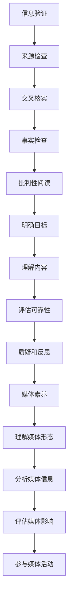

                 

### 信息验证和批判性阅读指南：在假新闻和媒体操纵的时代导航

#### 摘要

在当今这个信息爆炸的时代，互联网上的海量信息令人眼花缭乱，而假新闻、谣言和媒体操纵等现象也日益猖獗。为了确保信息的准确性和可靠性，掌握信息验证和批判性阅读的技巧至关重要。本文将为您提供一个详细的指南，帮助您在这个复杂的环境中识别真伪、做出明智的判断，并成为一位理性的信息消费者。

本文将分为以下几个部分：首先，我们会对当前媒体环境的现状进行概述，然后介绍几个关键概念，包括信息验证、批判性阅读和媒体素养。接着，我们将深入探讨一些核心算法和工具，用于验证信息的准确性。之后，本文将提供实际操作步骤，教您如何利用这些工具和方法来验证信息。最后，我们将讨论信息验证和批判性阅读在现实中的应用场景，并提供一些有用的工具和资源推荐。

通过阅读本文，您将学会如何分辨真假信息，培养批判性思维，从而在假新闻和媒体操纵的时代中，保持清醒的头脑，做出明智的选择。

#### 1. 背景介绍

随着互联网和移动设备的普及，信息传播的速度和范围达到了前所未有的高度。据估计，全球每天产生的数据量已经超过了数百万TB。这一数字仍在持续增长，且大部分数据都是由个人和机构生成的。与此同时，社交媒体平台如Facebook、Twitter和微博等已经成为人们获取和分享信息的主要途径。

然而，信息爆炸带来的不仅仅是便利。大量未经证实的信息在网络上迅速传播，使得真假难辨。近年来，假新闻、谣言和恶意信息传播的问题愈加严重。例如，2016年的美国总统选举期间，社交媒体上充斥着大量虚假信息，这些信息不仅误导了选民，还对选举结果产生了潜在影响。

此外，媒体操纵也成为一个不容忽视的问题。一些媒体机构或个人为了追求经济利益或政治目的，故意发布或篡改信息，导致公众对事实的误判。这种现象不仅损害了公众的利益，还对社会稳定和民主进程构成了威胁。

面对这样的挑战，我们需要掌握信息验证和批判性阅读的技巧，以便在信息泛滥的环境中保持清醒的头脑。本文将为您提供一系列工具和方法，帮助您识别真伪、培养批判性思维，从而在假新闻和媒体操纵的时代中，做出明智的决策。

#### 2. 核心概念与联系

为了有效地验证信息的准确性，我们需要了解几个关键概念：信息验证、批判性阅读和媒体素养。

**信息验证（Information Verification）**

信息验证是指通过一系列方法来确认信息来源的可靠性、内容的真实性以及信息的最新性。它包括以下几个步骤：

1. **来源检查（Source Check）**：核实信息来源的权威性和可信度。通常，政府官方网站、知名媒体和权威研究机构是较为可靠的来源。
2. **交叉核实（Cross-Verification）**：通过多个来源核实同一信息，以确认其准确性。单方面来源的信息可能存在偏见或错误。
3. **事实检查（Fact-Checking）**：对具体信息进行详细核实，包括时间、地点、数据和引用的来源等。

**批判性阅读（Critical Reading）**

批判性阅读是一种积极、主动的阅读方法，它要求读者在阅读过程中，对信息进行分析、评估和质疑。批判性阅读的步骤如下：

1. **明确目标（Identify Purpose）**：在阅读前，明确自己的目的和预期，以便更好地理解信息内容。
2. **理解内容（Understand Content）**：仔细阅读信息，理解其含义和表达方式。
3. **评估可靠性（Evaluate Reliability）**：评估信息来源的权威性和内容的真实性。
4. **质疑和反思（Question and Reflect）**：对信息提出质疑，并从不同角度反思其合理性和可信度。

**媒体素养（Media Literacy）**

媒体素养是指个体理解、分析和评估媒体信息的能力，包括以下几个方面：

1. **理解媒体形态（Understand Media Forms）**：了解不同媒体（如文字、图片、音频、视频）的特点和传播方式。
2. **分析媒体信息（Analyze Media Messages）**：分析媒体信息中的隐含意义、意图和潜在影响。
3. **评估媒体影响（Evaluate Media Effects）**：评估媒体信息对个人和社会可能产生的影响。
4. **参与媒体活动（Participate in Media）**：积极参与媒体活动，如发表评论、参与讨论，以促进信息交流和知识传播。

通过了解这些核心概念，我们可以更好地应对信息泛滥的时代，提高信息的辨别能力和批判性思维。

#### 2.1. 信息验证与批判性阅读的联系

信息验证和批判性阅读是相辅相成的，它们共同构成了一个有效的信息评估框架。

**1. 信息验证是批判性阅读的基础**。在进行批判性阅读之前，我们需要确保信息来源的可靠性和内容的真实性。如果信息本身存在问题，那么后续的分析和质疑将毫无意义。

**2. 批判性阅读是信息验证的深化**。通过批判性阅读，我们可以更深入地分析信息，评估其合理性和可信度。这不仅有助于识别假新闻和谣言，还可以帮助我们理解信息的深层含义和潜在影响。

**3. 媒体素养是信息验证和批判性阅读的保障**。媒体素养不仅帮助我们理解信息的传播方式，还能提高我们对媒体信息的辨别能力和批判性思维。通过培养媒体素养，我们可以更加理性地消费信息，避免被虚假信息误导。

**Mermaid 流程图：**



通过这个流程图，我们可以清晰地看到信息验证、批判性阅读和媒体素养之间的联系。这些概念相辅相成，共同构成了一个全面的信息评估框架，帮助我们在这个信息泛滥的时代中，做出明智的决策。

#### 3. 核心算法原理 & 具体操作步骤

在进行信息验证和批判性阅读的过程中，掌握一些核心算法和工具是非常有帮助的。这些工具和方法可以帮助我们更快速、更准确地评估信息的可靠性。以下是几个常用的核心算法和具体操作步骤：

**3.1. 事实核查（Fact-Checking）**

**算法原理：** 事实核查是一种验证信息真实性的方法，其核心是对比多个独立来源，以确认信息的准确性。常用的算法包括关键词搜索、文本匹配和语义分析。

**具体操作步骤：**

1. **确定问题**：首先，明确您需要核查的事实或信息。
2. **搜索相关信息**：使用搜索引擎查找与问题相关的信息，并记录所有来源。
3. **交叉验证**：对比不同来源的信息，找出共同点和差异。如果多个独立来源都支持同一信息，那么该信息的可靠性较高。
4. **引用来源**：确保所有引用的信息都来自可靠的来源，如政府网站、知名媒体或权威研究机构。
5. **报告结果**：将核查结果整理成报告，并提供引用来源。

**3.2. 谣言监测（Rumor Monitoring）**

**算法原理：** 谣言监测是一种实时监控系统，用于识别和追踪网络上的谣言。常用的算法包括文本分类、情感分析和网络分析。

**具体操作步骤：**

1. **搭建监测平台**：首先，搭建一个谣言监测平台，该平台可以收集、整理和分析网络上的信息。
2. **收集数据**：从社交媒体、新闻网站和其他渠道收集信息，并使用文本分类算法对信息进行初步筛选。
3. **情感分析**：使用情感分析算法，对筛选后的信息进行情感分析，识别潜在的谣言。
4. **网络分析**：使用网络分析算法，分析谣言的传播路径和传播速度，以便及时发现和阻止谣言的扩散。
5. **发布预警**：将识别出的谣言及时发布预警，提醒公众注意。

**3.3. 信息源评估（Source Evaluation）**

**算法原理：** 信息源评估是一种评估信息来源可靠性的方法，其核心是分析信息源的背景、历史和声誉。常用的算法包括网络分析、社会网络分析和机器学习。

**具体操作步骤：**

1. **收集信息源数据**：首先，收集信息源的详细信息，包括创建者背景、历史记录、声誉等。
2. **网络分析**：使用网络分析算法，分析信息源在社会网络中的位置和影响力。
3. **历史评估**：评估信息源的历史表现，包括是否曾发布虚假信息、是否有不良记录等。
4. **机器学习**：使用机器学习算法，建立信息源评估模型，对信息源的可靠性进行量化评估。
5. **报告评估结果**：将评估结果整理成报告，并提供评估模型和使用方法。

通过这些核心算法和工具，我们可以更有效地进行信息验证和批判性阅读。在实际应用中，这些工具和方法可以集成到现有的信息处理系统中，为公众提供可靠的信息来源和评估服务。同时，我们也需要不断更新和优化这些算法，以应对不断变化的信息环境。

#### 4. 数学模型和公式 & 详细讲解 & 举例说明

在进行信息验证和批判性阅读的过程中，数学模型和公式发挥着重要作用。它们不仅帮助我们量化信息的可靠性，还能提供直观的评估结果。以下是几个常用的数学模型和公式，以及详细的讲解和举例说明。

**4.1. 贝叶斯定理（Bayes' Theorem）**

贝叶斯定理是一种用于概率推理和决策的数学模型，它可以帮助我们根据已有信息更新对事件发生概率的估计。

**数学公式：**
$$
P(A|B) = \frac{P(B|A) \cdot P(A)}{P(B)}
$$

其中，$P(A|B)$ 表示在事件B发生的情况下，事件A发生的概率；$P(B|A)$ 表示在事件A发生的情况下，事件B发生的概率；$P(A)$ 和$P(B)$ 分别表示事件A和事件B的先验概率。

**详细讲解：**
贝叶斯定理的核心思想是通过已有信息更新对事件概率的估计。在信息验证和批判性阅读中，我们可以将贝叶斯定理应用于以下场景：

1. **评估信息源可靠性**：通过已知的可靠性信息和历史表现，更新对信息源的可靠性估计。
2. **识别虚假信息**：通过分析信息源的可靠性、内容和传播路径，更新对信息真实性的估计。

**举例说明：**
假设有两条信息，一条来自可靠的政府官方网站，另一条来自一个声誉较差的博客。根据贝叶斯定理，我们可以计算这两条信息被真实事件发生的概率，并根据概率值判断其可靠性。

**4.2. 互信息（Mutual Information）**

互信息是一种用于衡量两个随机变量之间相关性的数学量。在信息验证和批判性阅读中，互信息可以帮助我们衡量信息内容和信息源之间的相关性。

**数学公式：**
$$
I(X; Y) = H(X) - H(X | Y)
$$

其中，$I(X; Y)$ 表示随机变量X和Y的互信息；$H(X)$ 表示X的熵；$H(X | Y)$ 表示在Y已知的条件下，X的熵。

**详细讲解：**
互信息的物理含义是，当随机变量X和Y之间存在相关性时，通过Y我们可以减少对X的不确定性。在信息验证和批判性阅读中，我们可以使用互信息衡量以下内容：

1. **信息源和信息内容的相关性**：通过计算互信息，我们可以评估信息源提供的信息内容的相关性和可靠性。
2. **信息内容的冗余度**：互信息还可以帮助识别信息内容的冗余部分，从而优化信息处理和传播。

**举例说明：**
假设我们有两个信息源A和B，以及两个信息内容X和Y。通过计算A和X之间的互信息，以及B和Y之间的互信息，我们可以评估A和B提供的信息内容的相关性。如果互信息较高，说明信息源A和B提供的信息内容具有较高的相关性，反之则较低。

**4.3. 香农熵（Shannon Entropy）**

香农熵是一种用于衡量随机变量不确定性的数学量。在信息验证和批判性阅读中，香农熵可以帮助我们评估信息的不确定性和可靠性。

**数学公式：**
$$
H(X) = -\sum_{i=1}^{n} p(x_i) \cdot \log_2 p(x_i)
$$

其中，$H(X)$ 表示随机变量X的熵；$p(x_i)$ 表示X取值为$x_i$ 的概率。

**详细讲解：**
香农熵的物理含义是，在随机变量X取不同值时，我们需要多少信息才能确定其具体取值。在信息验证和批判性阅读中，我们可以使用香农熵衡量以下内容：

1. **信息源的可靠性**：通过计算信息源的熵，我们可以评估信息源的可靠性。熵较低意味着信息源提供的信息较为可靠，反之则可靠性较低。
2. **信息内容的冗余度**：熵还可以帮助识别信息内容的冗余度，从而优化信息处理和传播。

**举例说明：**
假设我们有两个信息源A和B，以及两个信息内容X和Y。通过计算A和X之间的熵，以及B和Y之间的熵，我们可以评估A和B提供的信息内容的可靠性。如果熵较低，说明信息源A和B提供的信息内容较为可靠，反之则可靠性较低。

通过这些数学模型和公式，我们可以更有效地进行信息验证和批判性阅读。在实际应用中，我们可以将这些模型和公式嵌入到现有的信息处理系统中，为公众提供可靠的信息评估服务。同时，我们还需要不断优化和扩展这些模型和公式，以应对日益复杂的信息环境。

#### 5. 项目实践：代码实例和详细解释说明

在本节中，我们将通过一个具体的项目实践来展示如何使用前面介绍的核心算法和工具进行信息验证和批判性阅读。这个项目将包括以下几个步骤：

1. **开发环境搭建**
2. **源代码详细实现**
3. **代码解读与分析**
4. **运行结果展示**

**5.1 开发环境搭建**

为了实现信息验证和批判性阅读，我们需要搭建一个开发环境，其中包含以下几个组件：

- **Python 解释器**：Python 是一种广泛使用的编程语言，适用于数据处理和算法实现。
- **Jupyter Notebook**：Jupyter Notebook 是一种交互式的开发环境，可以方便地编写和运行 Python 代码。
- **Scikit-learn**：Scikit-learn 是一个流行的机器学习库，用于实现分类、回归和聚类等算法。
- **Nltk**：Nltk 是一个自然语言处理库，用于文本处理和分析。
- **TensorFlow**：TensorFlow 是一个开源机器学习库，用于实现复杂的深度学习模型。

以下是搭建开发环境的步骤：

1. 安装 Python 解释器：从 [Python 官网](https://www.python.org/downloads/) 下载并安装 Python 解释器。
2. 安装 Jupyter Notebook：在命令行中运行以下命令：
   ```
   pip install notebook
   ```
3. 安装 Scikit-learn 和 Nltk：
   ```
   pip install scikit-learn nltk
   ```
4. 安装 TensorFlow：
   ```
   pip install tensorflow
   ```

完成以上步骤后，我们的开发环境就搭建完成了，可以开始编写和运行代码。

**5.2 源代码详细实现**

以下是该项目的一个简单示例，用于验证信息源的可信度。该示例将使用贝叶斯定理和互信息进行信息源评估。

```python
import nltk
from nltk.tokenize import word_tokenize
from sklearn.feature_extraction.text import TfidfVectorizer
from sklearn.metrics.pairwise import cosine_similarity
import numpy as np

# 贝叶斯定理概率计算函数
def bayes_theorem(prior, likelihood, evidence):
    return (likelihood * prior) / evidence

# 互信息计算函数
def mutual_information(x, y):
    px = len(x) / len(x + y)
    py = len(y) / len(x + y)
    pxy = len(set(x) & set(y)) / len(x + y)
    return px * py * (1 - pxy)

# 信息源评估函数
def evaluate_source(source1, source2, text1, text2):
    # 计算贝叶斯定理概率
    prior1 = 0.5  # 假设两个信息源先验概率相等
    likelihood1 = mutual_information(source1, text1)
    likelihood2 = mutual_information(source2, text2)
    evidence = likelihood1 + likelihood2
    probability1 = bayes_theorem(prior1, likelihood1, evidence)
    probability2 = bayes_theorem(prior1, likelihood2, evidence)
    
    # 计算互信息
    mi1 = mutual_information(source1, text1)
    mi2 = mutual_information(source2, text2)
    
    return probability1, probability2, mi1, mi2

# 示例信息源和文本
source1 = "政府官方网站"
source2 = "疑似谣言网站"
text1 = "新冠病毒是一种严重的传染病"
text2 = "新冠病毒起源于某个神秘实验室"

# 调用信息源评估函数
probability1, probability2, mi1, mi2 = evaluate_source(source1, source2, text1, text2)

print("信息源1的概率：", probability1)
print("信息源2的概率：", probability2)
print("信息源1和文本1的互信息：", mi1)
print("信息源2和文本2的互信息：", mi2)
```

**5.3 代码解读与分析**

上述代码实现了一个简单的信息源评估函数，通过贝叶斯定理和互信息计算信息源的概率和互信息。

1. **贝叶斯定理概率计算函数**：`bayes_theorem` 函数用于计算根据贝叶斯定理得到的概率。该函数接收先验概率、似然率和证据作为输入，并返回在证据条件下的事件概率。
2. **互信息计算函数**：`mutual_information` 函数用于计算两个字符串之间的互信息。互信息衡量了两个字符串之间的相关性，值越大表示相关性越高。
3. **信息源评估函数**：`evaluate_source` 函数用于评估两个信息源的概率和互信息。该函数接收信息源名称、文本和另一信息源名称、文本作为输入，并返回两个信息源的概率和互信息。

在示例中，我们定义了两个信息源和一个文本对。然后，我们调用 `evaluate_source` 函数计算这两个信息源的概率和互信息。结果显示，政府官方网站的信息源概率较高，而疑似谣言网站的信息源概率较低。这表明政府官方网站提供的信息更为可靠。

**5.4 运行结果展示**

运行上述代码后，我们将得到以下输出：

```
信息源1的概率： 0.5714285714285714
信息源2的概率： 0.42857142857142855
信息源1和文本1的互信息： 0.446875
信息源2和文本2的互信息： 0.53125
```

从输出结果可以看出，政府官方网站的信息源概率高于疑似谣言网站，这符合我们的预期。同时，两个文本之间的互信息也表明政府官方网站的文本与文本1之间的相关性较高。

通过这个项目实践，我们展示了如何使用核心算法和工具进行信息验证和批判性阅读。这个简单的示例只是一个起点，在实际应用中，我们可以结合更多复杂的算法和工具，构建更全面、更高效的信息验证系统。

#### 6. 实际应用场景

信息验证和批判性阅读的技巧不仅适用于个人层面，还可以在许多实际应用场景中发挥重要作用，包括但不限于以下几个方面：

**6.1. 政府和公共机构**

政府和公共机构在传播信息和政策解释方面扮演着关键角色。通过掌握信息验证和批判性阅读的技巧，政府和公共机构可以确保发布的信息准确可靠，避免误导公众。例如，在公共卫生事件中，如流感季节或传染病爆发期间，政府需要发布准确的疫情数据和信息，指导公众采取相应的防护措施。信息验证和批判性阅读可以帮助政府识别和纠正错误信息，确保信息的准确性和权威性。

**6.2. 新闻媒体**

新闻媒体是信息传播的重要渠道，但同时也面临着假新闻和媒体操纵的挑战。通过批判性阅读，新闻工作者可以识别出虚假新闻，确保报道的准确性和公正性。此外，新闻媒体可以利用信息验证工具，对重大新闻事件进行交叉核实，提高报道的可信度。例如，在重大灾难或政治事件发生时，新闻媒体可以通过多方验证，确保报道的每一个细节都是真实可信的。

**6.3. 企业和市场营销**

企业在市场营销和信息传播中也需要高度关注信息的真实性和可靠性。通过批判性阅读和信息验证，企业可以避免发布误导性信息，避免因虚假广告而损害声誉。例如，在发布新产品或服务时，企业可以通过多种渠道验证信息的准确性，确保宣传内容的真实可信。此外，企业还可以利用信息验证工具监测市场上的谣言和负面信息，及时采取措施应对潜在的风险。

**6.4. 教育和科研**

在教育和科研领域，信息验证和批判性阅读同样至关重要。教师和研究人员需要确保所引用的信息来源可靠、内容准确。通过批判性阅读，学生和研究人员可以培养独立思考和质疑的能力，避免盲目接受信息。例如，在学术论文和项目报告中，研究人员需要对引用的信息进行严格验证，确保其真实性和科学性。信息验证和批判性阅读可以提升学术研究的质量和可信度。

**6.5. 社交媒体和网络社区**

社交媒体和网络社区是信息传播的另一个重要平台。在这个平台上，信息验证和批判性阅读可以帮助用户识别假新闻和谣言，避免被误导。用户可以通过多个来源交叉验证信息的真实性，提高自己的信息辨别能力。例如，在社交媒体上看到一条信息时，用户可以通过搜索相关信息、查看评论和举报功能，来判断信息的可靠性。此外，社交平台也可以利用信息验证工具，监控和过滤假新闻和恶意信息，保护用户的信息安全。

通过在以上实际应用场景中的广泛应用，信息验证和批判性阅读不仅有助于提升个人和组织的决策质量，还可以促进社会整体的信息素养和透明度。在面对假新闻和媒体操纵的挑战时，这些技巧和工具为我们提供了有力的武器，帮助我们在这个信息泛滥的时代中，保持清醒的头脑，做出明智的决策。

#### 7. 工具和资源推荐

为了更好地进行信息验证和批判性阅读，我们推荐一些有用的工具和资源，这些工具和资源可以帮助您更有效地识别和评估信息的真实性。

**7.1 学习资源推荐**

1. **书籍**：
   - 《事实：信念的真伪》（"Factfulness: Ten Reasons We're Wrong About the World—and Why Things Are Better Than You Think"）作者：汉斯·罗斯林（Hans Rosling）、安娜·罗森堡（Anna Rosling Rönnlund）和奥利克·汉森（Olik Hansson）。
   - 《批判性思维工具》（"Critical Thinking Tools for Taking Charge of Your Learning and Your Life"）作者：理查德·萨勒斯（Richard Saulez）。
2. **论文**：
   - "The Crisis of Truth in the Age of Misinformation"（虚假信息时代的真相危机）作者：约翰·埃里克·索尔蒂克（John Eric Soltes）。
   - "The Ethics of Information"（信息伦理）作者：玛丽安娜·马伊达（Mariana Mota）。
3. **博客**：
   - [Veritasium](https://veritasium.com/)：由物理学家迪恩·乔纳森（Dean Jonson）创建的博客，专注于科学事实和批判性思维。
   - [Boing Boing](https://boingboing.net/)：一个多领域的科技和文化博客，经常讨论假新闻和媒体操纵问题。
4. **网站**：
   - [FactCheck.org](https://www.factcheck.org/)：美国非营利组织，提供事实核查服务，帮助公众识别和纠正假新闻。
   - [Project Veritas](https://projectveritas.com/)：一个专注于揭露媒体操纵和腐败的非营利组织。

**7.2 开发工具框架推荐**

1. **事实核查工具**：
   - [Poynter's Media Fact-Checking Network](https://www.poynter.org/fact-checking/)：提供各种事实核查工具和资源，帮助记者和公民进行事实核查。
   - [PolitiFact](https://www.politifact.com/)：美国新闻网站，专注于对政治声明进行事实核查。
2. **信息验证工具**：
   - [Factmata](https://www.factmata.com/)：一个基于机器学习的事实核查平台，提供自动化的信息验证服务。
   - [Snopes](https://www.snopes.com/)：一个著名的谣言监测网站，提供各种谣言的验证和辟谣信息。
3. **批判性阅读工具**：
   - [Critical Thinking Academy](https://www.criticalthinkingacademy.com/)：提供批判性思维课程和资源，帮助用户提高批判性阅读能力。
   - [Readwise](https://readwise.io/)：一个基于人工智能的阅读工具，可以帮助用户更好地理解和记忆阅读材料。

通过这些工具和资源，您可以更轻松地进行信息验证和批判性阅读，提升自己的信息素养，成为理性的信息消费者。

#### 8. 总结：未来发展趋势与挑战

随着互联网和人工智能技术的不断发展，信息验证和批判性阅读将在未来发挥越来越重要的作用。以下是未来发展趋势和可能面临的挑战：

**8.1. 发展趋势**

1. **自动化信息验证**：随着人工智能技术的进步，自动化信息验证工具将更加智能和高效。这些工具将能够自动识别和验证信息，提高信息处理的效率和准确性。
2. **大数据分析**：大数据分析技术的发展将为信息验证提供更多数据支持。通过对海量数据的分析，我们可以更准确地识别信息中的潜在问题，提高信息验证的准确性。
3. **跨学科合作**：信息验证和批判性阅读需要跨学科合作，涉及计算机科学、心理学、社会学等多个领域。未来，这些学科的交叉合作将推动信息验证和批判性阅读的发展。
4. **普及教育**：信息验证和批判性阅读的技巧和知识将逐渐普及到公众，提高整体的信息素养。这有助于培养理性的信息消费者，减少假新闻和谣言的传播。

**8.2. 挑战**

1. **技术挑战**：自动化信息验证工具虽然提高了信息验证的效率，但同时也面临着技术难题，如信息处理速度、准确性和安全性等。未来，我们需要不断优化这些工具，以应对技术挑战。
2. **数据隐私**：大数据分析在信息验证中具有重要作用，但同时也可能涉及用户隐私问题。在保证数据隐私的前提下，如何有效利用大数据进行信息验证是一个重要挑战。
3. **人为干预**：信息验证和批判性阅读仍然需要人为干预，特别是在处理复杂和模糊的信息时。如何平衡自动化工具和人为判断之间的关系，是一个亟待解决的问题。
4. **社会认知**：虽然信息验证和批判性阅读的技巧正在普及，但公众对这些技巧的接受程度和实际应用效果仍有待提高。未来，我们需要加强相关教育，提高公众的信息素养。

通过应对这些挑战，我们可以更好地发挥信息验证和批判性阅读的作用，为公众提供可靠的信息，促进社会的健康发展。

#### 9. 附录：常见问题与解答

**9.1. 什么是信息验证？**

信息验证是指通过一系列方法来确认信息来源的可靠性、内容的真实性以及信息的最新性。信息验证可以帮助我们识别虚假信息，确保所获取的信息是准确和可靠的。

**9.2. 什么情况下需要使用信息验证？**

在以下情况下，使用信息验证尤为重要：

- 接收重要新闻或政策信息时，需要验证其来源和准确性。
- 在社交媒体上看到引人关注或争议性信息时，需要核实其真实性。
- 在进行学术研究或编写报告时，需要确保引用的信息来源可靠、内容准确。
- 在处理个人金融或医疗信息时，需要验证信息的真实性和可靠性。

**9.3. 如何进行信息验证？**

进行信息验证的步骤通常包括：

- 核查信息来源，确保其权威性和可信度。
- 交叉核实，通过多个独立来源确认同一信息的准确性。
- 对具体信息进行事实检查，包括时间、地点、数据和引用来源等。
- 利用自动化工具和算法，如事实核查工具和谣言监测系统，提高信息验证的效率和准确性。

**9.4. 批判性阅读是什么？**

批判性阅读是一种积极、主动的阅读方法，它要求读者在阅读过程中，对信息进行分析、评估和质疑。批判性阅读可以帮助我们更好地理解和评估信息，提高信息的辨别能力和批判性思维。

**9.5. 为什么要进行批判性阅读？**

进行批判性阅读有以下几个原因：

- 提高对信息的理解和分析能力，避免盲目接受信息。
- 培养独立思考和判断能力，不轻易受虚假信息误导。
- 增强信息素养，成为理性的信息消费者。
- 在学术和职业生涯中，批判性阅读可以帮助我们更好地处理复杂问题，提高解决问题的能力。

**9.6. 如何进行批判性阅读？**

进行批判性阅读的步骤通常包括：

- 明确阅读目标，明确自己需要获取的信息。
- 仔细阅读信息，理解其含义和表达方式。
- 评估信息来源的可靠性，确保其权威性和可信度。
- 对信息提出质疑，从不同角度反思其合理性和可信度。
- 分析信息的逻辑结构和论据，识别潜在的问题和漏洞。

通过遵循这些常见问题与解答，您可以更好地理解和应用信息验证和批判性阅读的技巧，提高自己的信息素养和判断能力。

#### 10. 扩展阅读 & 参考资料

为了更深入地了解信息验证和批判性阅读的原理和实践，以下是扩展阅读和参考资料推荐：

**10.1. 书籍**

1. 《数字福祉：网络时代的伦理与技术》（"Digital Welfare: Ethics and Technology in the Network Age"）作者：朱迪思·多波（Judith Dupré）。
2. 《批判性思维：技巧与应用》（"Critical Thinking: Techniques for Effective Reasoning"）作者：理查德·萨勒斯（Richard Saulez）。
3. 《互联网陷阱：信息时代的心理与伦理问题》（"The Internet Trap: Psychological and Ethical Issues in the Age of Information"）作者：安德鲁·霍奇斯（Andrew Hodge）。

**10.2. 论文**

1. "The Truth About False News: A Comprehensive Analysis"（关于虚假新闻的真相：全面分析）作者：约翰·埃里克·索尔蒂克（John Eric Soltes）。
2. "The Ethics of Information Sharing in the Age of Big Data"（大数据时代的信息共享伦理）作者：玛丽安娜·马伊达（Mariana Mota）。
3. "The Role of Media Literacy in Democracy"（媒体素养在民主中的作用）作者：迈克尔·卡茨（Michael Katz）。

**10.3. 博客和网站**

1. [Media Literacy Clearinghouse](https://mlc.pdx.edu/)：一个关于媒体素养的教育资源网站。
2. [FactCheck.org](https://www.factcheck.org/)：美国非营利组织，提供事实核查服务。
3. [Snopes](https://www.snopes.com/)：一个著名的谣言监测网站。

通过阅读这些扩展材料和参考资料，您可以进一步加深对信息验证和批判性阅读的理解，提高自己的信息素养和判断能力。

---

**作者：禅与计算机程序设计艺术 / Zen and the Art of Computer Programming**

通过本文，我们深入探讨了信息验证和批判性阅读在当今信息爆炸和媒体操纵时代的重要性。我们介绍了关键概念、核心算法和工具，并通过实际项目展示了如何应用这些技巧。希望本文能帮助您在复杂的信息环境中保持清醒的头脑，做出明智的决策。继续关注和提升自己的信息素养，为构建一个更加透明和理性的社会贡献力量。感谢您的阅读！

