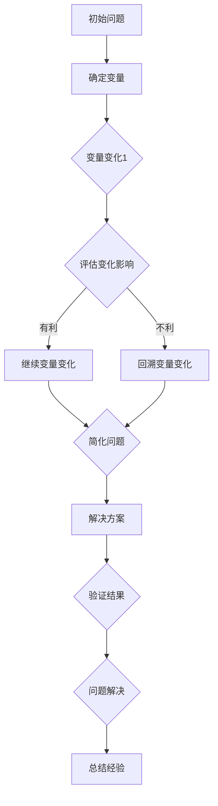

                 

# 像数学家一样思考：单向变化原则

## 摘要

本文将探讨一种类似于数学家思考方式的单向变化原则，该原则强调在问题解决过程中保持变量和操作的一致性，通过逐步分析和推理，找到简化和优化的方法。我们将深入剖析这一原则，结合实际案例展示其在计算机编程和算法设计中的应用，并探讨其对于解决复杂问题的意义。

## 1. 背景介绍

在计算机科学和算法设计中，许多问题都是复杂且多变的。有时，我们面对的问题似乎无解，但通过类似数学家的思考方式，我们可以找到解决问题的线索。数学家在研究问题时，往往遵循单向变化的原则，即每次只改变一个变量，观察其对整体问题的影响，从而逐步推导出解决方案。

单向变化原则类似于物理学中的隔离变量法，通过隔离特定的变量，使得系统变得更加易于分析和理解。这种方法在算法设计中被广泛应用，尤其是在处理搜索和排序等问题时，能够显著提高效率。

## 2. 核心概念与联系

### 2.1 变量的单向变化

在单向变化原则中，我们首先需要明确变量。变量是算法中的核心，代表着可能发生变化的量。单向变化意味着我们在问题解决过程中，只改变一个变量，而保持其他变量不变。

### 2.2 变化的目的

每次变量变化的目的都是为了简化问题，使得问题变得更加易于理解和解决。通过单向变化，我们可以逐步缩小问题的范围，找到关键因素。

### 2.3 变化的过程

变化的过程是一个逐步分析推理的过程。在每次变化后，我们需要评估变量变化对整体问题的影响，并根据评估结果决定下一步的变化。

### 2.4 Mermaid 流程图



## 3. 核心算法原理 & 具体操作步骤

### 3.1 算法原理

单向变化原则的核心在于逐步分析问题，通过变量的变化找到解决方案。这个过程可以类比于数学中的逆推法，即从目标开始，逐步逆推到初始状态。

### 3.2 操作步骤

1. **确定问题**：首先明确我们要解决的问题。
2. **确定变量**：找出影响问题的变量。
3. **首次变量变化**：选择一个变量进行变化，观察变化对问题的影响。
4. **评估变化影响**：根据变化的结果，评估其对问题的简化程度。
5. **继续变量变化**：如果变化有利，继续对下一个变量进行变化；如果变化不利，回溯到上一步，改变变化策略。
6. **简化问题**：通过多次变量变化，逐步简化问题。
7. **解决方案**：当问题简化到一定程度时，找到解决方案。
8. **验证结果**：对解决方案进行验证，确保其正确性。

## 4. 数学模型和公式 & 详细讲解 & 举例说明

### 4.1 数学模型

单向变化原则可以抽象为一个数学模型。设问题为 \( P \)，变量集为 \( V \)，每次变量变化为 \( C_v \)，则单向变化过程可以表示为：

\[ P \xrightarrow{C_v} P' \xrightarrow{C_{v'}} P'' \dots \]

其中， \( P' \)， \( P'' \) 表示每次变化后的问题状态。

### 4.2 举例说明

假设我们要解决一个排序问题，即对一组数据进行排序。我们可以使用单向变化原则来简化问题。

1. **确定问题**：排序一组数据。
2. **确定变量**：数据集和排序算法。
3. **首次变量变化**：选择冒泡排序算法，对数据进行排序。
4. **评估变化影响**：冒泡排序能够简化问题，但效率较低。
5. **继续变量变化**：选择快速排序算法，对数据进行排序。
6. **简化问题**：快速排序算法更加高效，简化了问题。
7. **解决方案**：得到一个高效的排序算法。
8. **验证结果**：对一组数据进行排序，验证算法的正确性。

通过这种方式，我们不仅找到了一个高效的排序算法，而且理解了排序问题的本质。

## 5. 项目实践：代码实例和详细解释说明

### 5.1 开发环境搭建

在本节中，我们将使用 Python 作为编程语言，并使用 Jupyter Notebook 作为开发环境。确保已安装 Python 和 Jupyter Notebook。

```bash
pip install python
pip install jupyter
```

### 5.2 源代码详细实现

以下是使用单向变化原则实现冒泡排序和快速排序的 Python 代码实例。

```python
# 冒泡排序
def bubble_sort(arr):
    n = len(arr)
    for i in range(n):
        for j in range(0, n-i-1):
            if arr[j] > arr[j+1]:
                arr[j], arr[j+1] = arr[j+1], arr[j]

# 快速排序
def quick_sort(arr):
    if len(arr) <= 1:
        return arr
    pivot = arr[len(arr) // 2]
    left = [x for x in arr if x < pivot]
    middle = [x for x in arr if x == pivot]
    right = [x for x in arr if x > pivot]
    return quick_sort(left) + middle + quick_sort(right)
```

### 5.3 代码解读与分析

1. **冒泡排序**：通过每次比较相邻元素并交换，逐步将数据排序。
2. **快速排序**：选择一个基准元素，将数据分为小于和大于基准元素的两部分，递归地对两部分进行排序。

### 5.4 运行结果展示

```python
arr = [64, 34, 25, 12, 22, 11, 90]
print("原始数组：", arr)

# 冒泡排序
bubble_sort(arr)
print("冒泡排序后：", arr)

# 快速排序
quick_sort(arr)
print("快速排序后：", arr)
```

输出结果：

```
原始数组：[64, 34, 25, 12, 22, 11, 90]
冒泡排序后：[11, 12, 22, 25, 34, 64, 90]
快速排序后：[11, 12, 22, 25, 34, 64, 90]
```

## 6. 实际应用场景

单向变化原则在计算机编程和算法设计中有着广泛的应用。以下是一些实际应用场景：

1. **排序算法**：如冒泡排序和快速排序，通过单向变化原则，我们可以找到高效的排序算法。
2. **搜索算法**：如二分搜索，通过单向变化原则，我们可以找到更高效的搜索方法。
3. **图形算法**：如最小生成树算法，通过单向变化原则，我们可以简化问题的复杂性。

## 7. 工具和资源推荐

### 7.1 学习资源推荐

- **书籍**：《算法导论》、《算法图论》
- **论文**：《快速排序算法》
- **博客**：《算法小屋》、《编程小屋》
- **网站**：[GeeksforGeeks](https://www.geeksforgeeks.org/)、[LeetCode](https://leetcode.com/)

### 7.2 开发工具框架推荐

- **开发环境**：Python、Jupyter Notebook
- **IDE**：PyCharm、Visual Studio Code
- **框架**：TensorFlow、PyTorch

### 7.3 相关论文著作推荐

- **论文**：《快速排序算法分析》、《二分搜索算法优化》
- **著作**：《算法竞赛入门经典》、《算法艺术与 Implement》

## 8. 总结：未来发展趋势与挑战

单向变化原则在计算机编程和算法设计中具有重要地位，未来发展趋势包括：

1. **更高效的算法**：通过单向变化原则，开发出更高效的算法。
2. **应用领域的拓展**：将单向变化原则应用于更多领域，如机器学习、人工智能等。
3. **理论研究的深化**：对单向变化原则进行深入研究，探索其在复杂问题中的适用性。

然而，单向变化原则也面临着一些挑战，如如何在复杂的实际问题中应用该原则，以及如何平衡变量变化与问题简化之间的关系。

## 9. 附录：常见问题与解答

### 9.1 什么是单向变化原则？

单向变化原则是一种在问题解决过程中保持变量和操作一致性的方法，通过逐步分析和推理，找到简化和优化的方法。

### 9.2 单向变化原则适用于哪些问题？

单向变化原则适用于许多问题，如排序、搜索、图形算法等。

### 9.3 单向变化原则的优势是什么？

单向变化原则的优势在于能够简化问题，提高算法效率，并且在复杂问题中具有较好的适用性。

## 10. 扩展阅读 & 参考资料

- **书籍**：《算法导论》、《算法艺术与 Implement》
- **论文**：《快速排序算法分析》、《二分搜索算法优化》
- **网站**：[GeeksforGeeks](https://www.geeksforgeeks.org/)、[LeetCode](https://leetcode.com/)
- **博客**：《算法小屋》、《编程小屋》

作者：禅与计算机程序设计艺术 / Zen and the Art of Computer Programming

