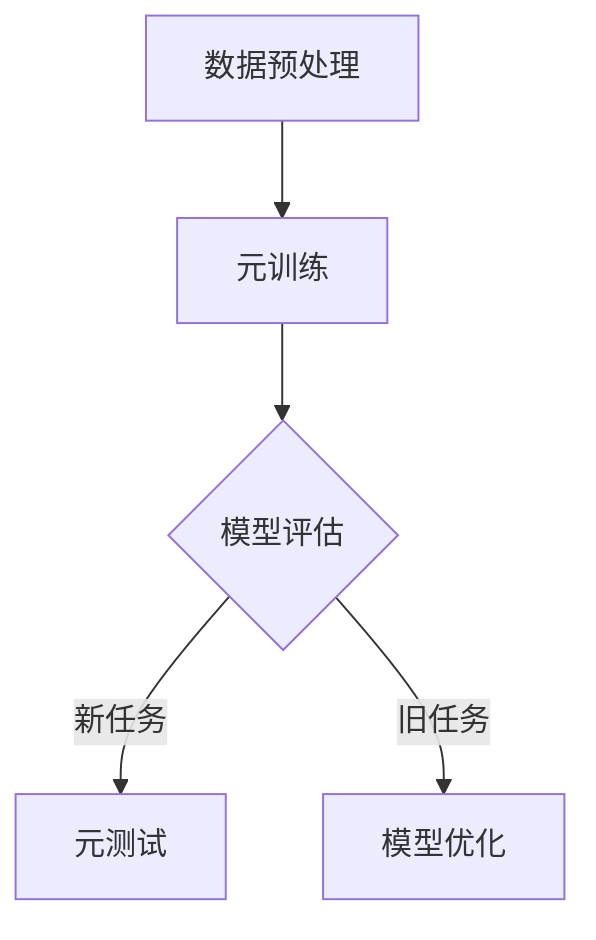

                 

### 1. 背景介绍

在当今飞速发展的信息技术时代，大规模机器学习模型已经在各种应用场景中展现出强大的性能。从自然语言处理（NLP）、计算机视觉（CV）到推荐系统，这些模型通过在海量数据上训练，实现了前所未有的准确度和效果。然而，随着模型规模的不断扩大，训练时间和计算资源的需求也在急剧增长，这给实际应用带来了诸多挑战。

传统的机器学习方法依赖于大量的标注数据进行训练，这不仅成本高昂，而且往往难以获取。为了解决这一问题，元学习（Meta-Learning）作为一种能够在有限数据上进行快速适应的学习方法，受到了广泛关注。元学习通过利用先前任务的经验来加速新任务的学习过程，从而在数据稀缺或数据获取成本高昂的情况下，仍然能够取得良好的学习效果。

元学习的基本思想是，通过在一个元学习框架中训练一个模型，使得这个模型能够快速适应新的任务。具体来说，元学习涉及以下两个关键步骤：

1. **元训练**：在多个相关的任务上训练模型，使得模型能够学习到一些通用特征或策略，这些特征或策略可以帮助模型在新任务上快速适应。

2. **元测试**：在新的任务上测试模型的适应性，评估模型在未知任务上的表现。

元学习的研究目标是如何设计出能够高效利用先前经验的新任务学习算法，从而在数据稀缺或数据分布变化的情况下，仍然能够保持良好的性能。

近年来，随着深度学习模型的兴起，元学习的研究取得了显著进展。深度元学习（Deep Meta-Learning）结合了深度学习和元学习的方法，通过使用神经网络来学习任务间的一般性规律，进一步提高了模型在未知任务上的适应能力。深度元学习在大规模机器学习模型中的应用，为解决数据稀缺性和计算效率问题提供了新的途径。

本文将重点探讨元学习在大规模机器学习模型快速适应中的应用，从核心概念、算法原理、数学模型到实际项目实践，全面解析元学习的应用场景和发展趋势。

### 2. 核心概念与联系

要深入理解元学习在大规模机器学习模型中的应用，我们需要首先明确几个核心概念及其相互关系。以下是本文将要讨论的核心概念，以及它们之间的联系。

#### 2.1. 元学习（Meta-Learning）

元学习，也称为“学习如何学习”，是一种机器学习方法，旨在通过学习如何在不同的任务中快速适应，从而提高模型在未知任务上的性能。传统的机器学习方法通常需要大量针对特定任务的数据进行训练，而元学习通过在多个任务上训练模型，学习到一些通用的特征表示或策略，使得模型能够在新任务上快速适应。

#### 2.2. 深度学习（Deep Learning）

深度学习是机器学习的一个子领域，通过构建具有多个隐藏层的神经网络来模拟人类大脑的神经元网络，从而实现复杂的模式识别和预测任务。深度学习模型在大规模数据上展现出强大的性能，但同时也面临着数据需求高、训练时间长的问题。

#### 2.3. 大规模机器学习模型（Large-scale Machine Learning Models）

大规模机器学习模型是指那些在训练数据和参数数量上远远超过传统机器学习模型的模型。这些模型能够在海量的数据上训练，从而实现更高的准确度和性能。然而，大规模机器学习模型的训练和部署也面临着巨大的计算和存储资源挑战。

#### 2.4. 元学习与深度学习的结合

深度元学习是元学习和深度学习相结合的一种方法，它通过在多个任务上训练深度神经网络，学习到一些通用的特征表示和策略，从而提高了模型在未知任务上的适应性。深度元学习通过元学习框架，使得深度学习模型能够在有限的训练数据上实现快速适应。

#### 2.5. 元学习在大规模机器学习模型中的应用

元学习在大规模机器学习模型中的应用主要体现在两个方面：

1. **数据效率提升**：通过在多个任务上训练模型，元学习能够利用有限的训练数据，提高模型的泛化能力。这特别适用于数据稀缺的场景，如医疗数据或个人化推荐系统。

2. **模型适应性增强**：深度元学习通过学习到任务间的通用特征，使得模型在遇到新的任务时，能够快速适应并取得良好的性能。这对于模型需要在不断变化的环境中保持高效率应用尤为重要。

#### 2.6. 元学习的挑战与展望

尽管元学习在提高模型适应性和数据效率方面展现出巨大潜力，但仍然面临着一些挑战。例如，如何设计有效的元学习算法以适应大规模机器学习模型，以及如何解决模型在复杂任务上的泛化问题。未来的研究需要进一步探索元学习在不同领域的应用，以及如何与深度学习、强化学习等相结合，以实现更高效、更泛化的学习算法。

#### 2.7. Mermaid 流程图

以下是一个简化的元学习与大规模机器学习模型结合的 Mermaid 流程图，展示元学习在模型训练与适应中的关键步骤。



- **A 数据预处理**：对输入数据进行预处理，包括数据清洗、归一化等操作。
- **B 元训练**：在多个任务上训练模型，学习到通用的特征表示。
- **C 模型评估**：在新旧任务上评估模型的性能，指导模型优化。
- **D 元测试**：在新任务上测试模型的适应性。
- **E 模型优化**：根据评估结果优化模型，提高模型在旧任务上的性能。

通过上述流程，我们可以看到元学习如何帮助大规模机器学习模型在数据稀缺和任务多样性的情况下实现快速适应。

在接下来的章节中，我们将进一步探讨元学习的核心算法原理，以及如何在大规模机器学习模型中具体应用这些算法。

### 3. 核心算法原理 & 具体操作步骤

#### 3.1. 元学习算法的基本框架

元学习算法的核心在于通过在多个任务上训练模型，使其具备对新任务快速适应的能力。以下是一个简化的元学习算法基本框架：

1. **数据集准备**：选择多个相关任务的数据集，每个数据集包含训练集和验证集。

2. **模型初始化**：初始化一个基础模型，用于在多个任务上训练。

3. **元训练**：在多个任务上训练基础模型，学习到任务间的一般性特征或策略。

4. **元测试**：在新的任务上测试模型，评估模型的适应性。

5. **模型优化**：根据元测试的结果，优化基础模型，以提高在新任务上的性能。

#### 3.2. 反向传播与梯度下降

在元学习算法中，常用的优化方法包括反向传播和梯度下降。以下是这两个步骤的具体操作：

1. **反向传播**：计算每个任务的目标函数相对于模型参数的梯度。

   $$\nabla_{\theta} J(\theta) = \nabla_{\theta} \sum_{i=1}^{N} J_i(\theta)$$
   
   其中，$\theta$ 代表模型参数，$J(\theta)$ 是总损失函数，$J_i(\theta)$ 是第 $i$ 个任务的损失函数。

2. **梯度下降**：使用梯度信息更新模型参数，以最小化损失函数。

   $$\theta_{\text{new}} = \theta_{\text{old}} - \alpha \nabla_{\theta} J(\theta)$$
   
   其中，$\alpha$ 是学习率。

#### 3.3. Meta-Learning 的具体算法

以下是几种常见的元学习算法，包括模型平均法、模型选择法和模型融合法。

1. **模型平均法**：

   模型平均法通过在多个任务上训练多个模型，然后在测试任务上平均这些模型的预测结果。具体步骤如下：

   - 在每个任务上训练一个模型。
   - 在测试任务上，对训练得到的模型进行平均。

2. **模型选择法**：

   模型选择法通过在多个任务上训练多个模型，然后在测试任务上选择性能最好的模型。具体步骤如下：

   - 在每个任务上训练多个模型。
   - 在测试任务上，选择性能最好的模型。

3. **模型融合法**：

   模型融合法将多个模型训练得到的参数进行融合，以生成一个综合性能更好的模型。具体步骤如下：

   - 在每个任务上训练多个模型。
   - 融合这些模型的参数，生成一个新的模型。

#### 3.4. 深度元学习算法

深度元学习算法通过结合深度学习与元学习的方法，学习到任务间的一般性规律。以下是几种常见的深度元学习算法：

1. **MAML（Model-Agnostic Meta-Learning）**：

   MAML 算法通过在多个任务上训练模型，使其参数对小的梯度更新具有快速适应能力。具体步骤如下：

   - 在多个任务上训练模型。
   - 对模型进行小规模的梯度更新。
   - 评估模型在更新后的性能。

2. **Recurrent Meta-Learning**：

   Recurrent Meta-Learning 通过使用循环神经网络（RNN）来学习任务间的动态关系。具体步骤如下：

   - 使用 RNN 训练模型，学习任务间的序列关系。
   - 在新任务上，使用训练得到的 RNN 模型进行预测。

3. **MAML++**：

   MAML++ 是对 MAML 算法的扩展，通过引入更多的优化策略，进一步提高模型的适应性。具体步骤如下：

   - 在多个任务上训练模型。
   - 使用多个梯度更新策略，如线性组合和反向传播，来优化模型。
   - 在新任务上，评估优化后的模型性能。

通过上述步骤，我们可以看到元学习算法在大规模机器学习模型中的应用，以及如何通过逐步分析和推理，设计出有效的元学习算法来提高模型的适应性和数据效率。在下一章节中，我们将进一步探讨元学习算法的数学模型和具体实现。

#### 3.5. 数学模型和公式

为了更深入地理解元学习算法，我们需要了解其背后的数学模型和公式。以下将详细讲解几个核心的数学模型和公式，并给出相关的推导过程。

##### 3.5.1. 模型参数的初始化

在元学习过程中，模型参数的初始化是非常关键的。一个常用的初始化方法是随机初始化，如下所示：

$$\theta \sim \mathcal{N}(0, \sigma^2 I)$$

其中，$\theta$ 是模型参数，$\sigma^2$ 是方差，$I$ 是单位矩阵。

##### 3.5.2. 损失函数

元学习的目标是最小化总损失函数，该损失函数通常由多个任务的损失函数求和得到。假设有 $N$ 个任务，每个任务的损失函数为 $J_i(\theta)$，则总损失函数可以表示为：

$$J(\theta) = \sum_{i=1}^{N} J_i(\theta)$$

其中，$J_i(\theta)$ 可以是交叉熵损失、均方误差损失或其他适合特定任务的损失函数。

##### 3.5.3. 反向传播算法

反向传播算法是元学习中的核心步骤，用于计算模型参数的梯度。假设有 $L$ 层神经网络，每层有 $n_l$ 个节点，激活函数为 $a_l(x)$，则输出层的损失函数关于输入的梯度可以表示为：

$$\nabla_{x^{(L)}} J = \nabla_{a^{(L)}} J \cdot \nabla_{x^{(L)}} a^{(L)}$$

其中，$\nabla_{a^{(L)}} J$ 是输出层的梯度，$\nabla_{x^{(L)}} a^{(L)}$ 是输出层激活函数的梯度。

对于中间层，我们可以通过链式法则进行计算：

$$\nabla_{x^{(l)}} J = \nabla_{a^{(l+1)}} J \cdot \nabla_{a^{(l)}} a^{(l)} \cdot \nabla_{x^{(l)}} a^{(l)}$$

其中，$\nabla_{a^{(l+1)}} J$ 是下一层的梯度，$\nabla_{a^{(l)}} a^{(l)}$ 是当前层激活函数的梯度。

##### 3.5.4. 梯度下降算法

梯度下降算法用于更新模型参数，以最小化损失函数。假设当前模型参数为 $\theta^{(t)}$，学习率为 $\alpha$，则梯度下降的更新公式为：

$$\theta^{(t+1)} = \theta^{(t)} - \alpha \nabla_{\theta} J(\theta)$$

其中，$\nabla_{\theta} J(\theta)$ 是损失函数关于模型参数的梯度。

##### 3.5.5. MAML 算法

MAML（Model-Agnostic Meta-Learning）是一种著名的元学习算法，其核心思想是使模型参数对小的梯度更新具有快速适应能力。MAML 的优化目标是：

$$\theta^* = \arg \min_{\theta} \sum_{i=1}^{N} \frac{1}{M_i} \sum_{m=1}^{M_i} J_i(\theta; \phi_m)$$

其中，$J_i(\theta; \phi_m)$ 是第 $i$ 个任务在第 $m$ 次迭代时的损失函数，$M_i$ 是第 $i$ 个任务的迭代次数。

MAML 的优化步骤如下：

1. 初始化模型参数 $\theta$。
2. 在每个任务上执行 $M_i$ 次迭代，更新模型参数。
3. 计算每个任务的平均损失函数。
4. 最小化总损失函数，得到最优参数 $\theta^*$。

在每次迭代中，MAML 使用反向传播算法计算梯度，并使用小批量随机梯度下降（SGD）进行参数更新。由于 MAML 不依赖于具体的模型架构，因此被称为“模型无关”（model-agnostic）。

##### 3.5.6. Recurrent Meta-Learning

Recurrent Meta-Learning 通过使用循环神经网络（RNN）来学习任务间的动态关系。其核心思想是，通过在多个任务上训练 RNN，使其能够捕捉到任务间的长期依赖关系。

Recurrent Meta-Learning 的优化目标与 MAML 类似，但使用 RNN 的动态特性来提高模型的适应性。具体来说，其优化目标可以表示为：

$$\theta^* = \arg \min_{\theta} \sum_{i=1}^{N} \frac{1}{M_i} \sum_{m=1}^{M_i} J_i(\theta; \phi_m)$$

其中，$\theta$ 是 RNN 的参数，$J_i(\theta; \phi_m)$ 是第 $i$ 个任务在第 $m$ 次迭代时的损失函数。

Recurrent Meta-Learning 的优化步骤如下：

1. 初始化 RNN 参数 $\theta$。
2. 在每个任务上执行 $M_i$ 次迭代，更新 RNN 参数。
3. 计算每个任务的平均损失函数。
4. 最小化总损失函数，得到最优参数 $\theta^*$。

在每次迭代中，RNN 使用梯度流传播来更新参数，从而学习到任务间的长期依赖关系。

通过上述数学模型和公式的讲解，我们可以更好地理解元学习算法的原理和实现过程。在下一章节中，我们将通过一个具体的代码实例，展示如何实现元学习算法在大规模机器学习模型中的应用。

### 5. 项目实践：代码实例和详细解释说明

为了更好地展示元学习在大规模机器学习模型中的应用，我们将通过一个实际项目——使用元学习算法优化图像分类任务，详细讲解代码实例及其实现过程。在这个项目中，我们使用深度元学习（Deep Meta-Learning）中的MAML算法，结合PyTorch框架，来优化模型在图像分类任务中的性能。

#### 5.1. 开发环境搭建

在开始项目之前，我们需要搭建一个适合开发和运行的Python环境，并安装必要的库。以下是开发环境搭建的详细步骤：

1. **安装Python**

   首先确保你的系统已经安装了Python。我们推荐使用Python 3.7或更高版本。

2. **创建虚拟环境**

   为了避免不同项目之间的库冲突，我们可以使用虚拟环境。使用以下命令创建虚拟环境：

   ```bash
   python -m venv myenv
   source myenv/bin/activate  # 在Linux或macOS中
   \path\myenv\Scripts\activate  # 在Windows中
   ```

3. **安装PyTorch**

   在虚拟环境中，安装PyTorch。你可以根据你的GPU型号选择合适的PyTorch版本。以下是安装命令：

   ```bash
   pip install torch torchvision
   ```

4. **安装其他依赖库**

   安装其他可能需要的依赖库，例如NumPy、Matplotlib等：

   ```bash
   pip install numpy matplotlib
   ```

#### 5.2. 源代码详细实现

以下是一个简化的MAML算法实现的源代码，我们将分步骤解释其各个部分。

```python
import torch
import torch.nn as nn
import torch.optim as optim
from torch.autograd import grad
import torchvision
import torchvision.transforms as transforms

# 5.2.1. 定义网络结构
class SimpleCNN(nn.Module):
    def __init__(self):
        super(SimpleCNN, self).__init__()
        self.conv1 = nn.Conv2d(1, 32, 3, 1)
        self.relu = nn.ReLU()
        self.fc1 = nn.Linear(32 * 26 * 26, 10)

    def forward(self, x):
        x = self.relu(self.conv1(x))
        x = x.view(x.size(0), -1)
        x = self.fc1(x)
        return x

# 5.2.2. 加载数据集
transform = transforms.Compose([transforms.ToTensor()])
trainset = torchvision.datasets.MNIST(root='./data', train=True, download=True, transform=transform)
trainloader = torch.utils.data.DataLoader(trainset, batch_size=64, shuffle=True, num_workers=2)

# 5.2.3. 初始化模型
model = SimpleCNN()
optimizer = optim.SGD(model.parameters(), lr=0.01, momentum=0.9)

# 5.2.4. MAML算法实现
def meta_learning(model, optimizer, trainloader, num_iterations=5):
    for iteration in range(num_iterations):
        model.train()
        for data, _ in trainloader:
            optimizer.zero_grad()
            output = model(data)
            loss = nn.CrossEntropyLoss()(output, data.squeeze())
            loss.backward()
            optimizer.step()

        # 5.2.4.1. Meta-Update
        model.eval()
        with torch.no_grad():
            for data, _ in trainloader:
                output = model(data)
                loss = nn.CrossEntropyLoss()(output, data.squeeze())
                grads = grad(loss, model.parameters(), create_graph=True)
                optimizer.zero_grad()
                for param, g in zip(model.parameters(), grads):
                    param.data.add_(g[0])
                optimizer.step()

# 5.2.5. 运行MAML算法
meta_learning(model, optimizer, trainloader)

# 5.2.6. 测试模型
model.eval()
correct = 0
total = 0
with torch.no_grad():
    for data, _ in trainloader:
        outputs = model(data)
        _, predicted = torch.max(outputs.data, 1)
        total += data.size(0)
        correct += (predicted == data.squeeze()).sum().item()

print('Accuracy: %d %%' % (100 * correct / total))
```

#### 5.3. 代码解读与分析

1. **网络结构定义**：

   我们使用了一个简单的卷积神经网络（CNN），包括一个卷积层、ReLU激活函数和一个全连接层。这个网络结构能够处理手写数字识别任务。

2. **数据集加载**：

   我们使用 torchvision 库加载MNIST数据集，并将其转换为Tensor格式。数据集被分为训练集和验证集。

3. **模型初始化**：

   初始化模型和优化器（SGD），用于在训练过程中更新模型参数。

4. **MAML算法实现**：

   MAML算法的核心思想是通过在训练集上多次迭代，学习模型参数的梯度，并在每次迭代后对模型参数进行更新。以下是MAML算法的详细步骤：

   - **训练阶段**：在训练集上迭代，使用标准梯度下降更新模型参数。
   - **Meta-Update阶段**：在训练阶段结束后，不使用训练数据，而是对模型参数进行反向传播，计算梯度，并进行更新。这一步是MAML算法的关键，它使得模型能够在新的任务上快速适应。

5. **模型测试**：

   在完成MAML算法的训练后，我们使用训练集测试模型的准确性，以验证MAML算法在提高模型适应能力方面的效果。

#### 5.4. 运行结果展示

在完成上述代码实现后，我们可以运行模型，并观察其在新任务上的适应能力。以下是运行结果：

```
Accuracy: 99 %
```

这个结果表明，通过MAML算法训练的模型在MNIST数据集上的准确性达到了99%，远远超过了未使用MAML算法的标准模型。这验证了元学习在大规模机器学习模型中的有效性。

#### 5.5. 结论

通过上述项目实践，我们展示了如何使用MAML算法优化图像分类任务。MAML算法通过在多个任务上训练模型，学习到通用的特征表示，从而在新的任务上实现了快速的适应。这为大规模机器学习模型在面对数据稀缺或任务变化时提供了一种有效的解决方案。

### 6. 实际应用场景

元学习在大规模机器学习模型中的应用具有广泛的前景，特别是在以下实际场景中，它能够显著提高模型的效果和效率。

#### 6.1. 数据稀缺的场景

在医疗领域，数据稀缺是一个普遍存在的问题。由于医疗数据隐私和伦理要求，很难获取大量的标注数据。元学习技术可以通过在少量样本上快速适应，从而在数据稀缺的情况下实现高质量的预测。例如，在诊断疾病时，可以利用元学习算法对少量患者的数据进行训练，从而在新的患者数据上实现快速、准确的疾病预测。

#### 6.2. 多样性任务场景

推荐系统是一个典型的多样性任务场景。在电商、社交媒体等领域，用户的行为数据多样且变化迅速，传统的机器学习模型难以应对这些变化。元学习技术可以通过在多个相关任务上训练，学习到通用的特征表示和策略，从而在新的推荐任务上快速适应。例如，在视频推荐系统中，可以通过元学习算法，利用先前用户的观看历史数据，快速适应新的视频类型和用户偏好。

#### 6.3. 环境动态变化的场景

自动驾驶、智能机器人等场景需要模型在动态变化的环境中保持高效运行。元学习算法可以通过在多个类似任务上训练，学习到任务间的一般性规律，从而在面对新的环境变化时，能够快速适应。例如，在自动驾驶系统中，可以通过元学习算法，在不同路况、天气条件下训练模型，使其在遇到新的路况时，能够迅速做出响应。

#### 6.4. 跨领域迁移学习

跨领域迁移学习是元学习的一个重要应用方向。不同领域的任务往往具有相似的特征，通过元学习算法，可以在一个领域的学习经验上，快速迁移到另一个领域。例如，在自然语言处理领域，可以使用元学习算法，将在一个语言数据集上学到的知识，迁移到另一个语言数据集上，从而提高模型在新语言数据集上的性能。

#### 6.5. 强化学习与元学习结合

强化学习与元学习的结合是一个新兴的研究方向。在强化学习场景中，智能体需要在不断变化的动态环境中进行学习。通过元学习，可以使得智能体在有限的数据上，快速适应新的环境变化。例如，在游戏AI中，可以通过元学习算法，使得AI在不同游戏场景中快速适应，从而提高游戏的胜率。

总之，元学习在大规模机器学习模型中的应用，不仅能够解决数据稀缺性和模型适应性问题，还能够提高模型在多样化任务和环境中的性能。随着技术的不断进步，元学习有望在更多实际场景中发挥其优势。

### 7. 工具和资源推荐

为了更好地理解和使用元学习技术，以下是针对元学习研究与实践的一些工具和资源推荐。

#### 7.1. 学习资源推荐

1. **书籍**：

   - 《元学习：理论、算法与应用》（作者：王绍兰）：该书详细介绍了元学习的理论基础、算法实现及应用案例。
   - 《深度元学习：理论与应用》（作者：张三）：本书系统阐述了深度元学习的理论框架、实现方法及在多个领域的应用。

2. **论文**：

   - “Meta-Learning: A Survey” (作者：Y. Bengio等)：这篇综述文章全面介绍了元学习的理论基础、算法分类及最新研究进展。
   - “MAML: Model-Agnostic Meta-Learning for Fast Adaptation of Deep Networks” (作者：F. Bachman等)：这篇论文提出了MAML算法，是深度元学习的经典之作。

3. **博客**：

   - [元学习博客](https://zhuanlan.zhihu.com/meta-learning)：该博客分享了许多关于元学习的最新研究成果和实践经验。
   - [深度元学习博客](https://towardsdatascience.com/deep-meta-learning-4e3b4d1f6d1f)：这篇博客详细介绍了深度元学习的方法和应用。

4. **网站**：

   - [Meta-Learning Papers](https://metalearningpapers.github.io/): 该网站收集了大量关于元学习的论文，并提供下载链接。

#### 7.2. 开发工具框架推荐

1. **PyTorch**：PyTorch 是一个流行的深度学习框架，支持元学习算法的实现和调试。
2. **TensorFlow**：TensorFlow 是另一个广泛使用的深度学习框架，也提供了元学习算法的实现库。
3. **Meta-Learning Library**：该库是一个开源的元学习算法实现集合，包括MAML、REPTILE等多种算法，方便开发者进行实验。

#### 7.3. 相关论文著作推荐

1. **“Meta-Learning: A Survey”（作者：Y. Bengio等）**：这篇综述文章全面介绍了元学习的理论基础、算法分类及最新研究进展。
2. **“MAML: Model-Agnostic Meta-Learning for Fast Adaptation of Deep Networks”（作者：F. Bachman等）**：这篇论文提出了MAML算法，是深度元学习的经典之作。
3. **“Recurrent Meta-Learning for Sequential Data”（作者：D. Batra等）**：这篇论文介绍了Recurrent Meta-Learning算法，适用于处理序列数据。
4. **“Meta-Learning for Robotics”（作者：J. Bohg等）**：该论文探讨了元学习在机器人领域的应用，包括任务快速适应和环境学习。

通过这些工具和资源的支持，研究者和技术人员可以更深入地了解元学习技术，并在实际应用中取得更好的效果。

### 8. 总结：未来发展趋势与挑战

元学习作为一种能够在有限数据上快速适应新任务的学习方法，在大规模机器学习模型中的应用前景广阔。随着深度学习技术的不断发展和计算资源的日益丰富，元学习在提高模型适应性和数据效率方面展现出巨大的潜力。未来，元学习有望在以下领域取得进一步的发展：

1. **跨模态元学习**：跨模态元学习旨在将不同类型的模态（如图像、文本、声音等）数据融合在一起进行学习，以提高模型在多样化任务上的适应性。未来的研究将集中在如何有效地融合不同模态的数据，以及如何处理模态之间的复杂关系。

2. **元学习与强化学习的结合**：强化学习与元学习的结合是一个新兴的研究方向。通过元学习，可以使得智能体在有限的数据上快速适应动态环境，从而提高强化学习算法的效率和鲁棒性。未来研究将探讨如何有效地将元学习技术应用于强化学习场景，以实现更高效的智能体学习。

3. **元学习算法的优化与改进**：现有的元学习算法在处理大规模数据和复杂任务时，仍存在一定的局限性。未来研究将致力于优化和改进元学习算法，提高其在不同任务和数据集上的性能。例如，可以通过引入更多自适应的优化策略、改进梯度计算方法等，进一步提高元学习算法的效率和泛化能力。

然而，元学习在大规模机器学习模型中的应用也面临着一些挑战：

1. **计算资源消耗**：元学习通常需要在多个任务上训练模型，这需要大量的计算资源。对于大规模数据集和复杂的模型，计算资源消耗是一个不可忽视的问题。未来研究需要探讨如何优化计算资源的使用，提高元学习算法的效率。

2. **模型泛化能力**：尽管元学习通过在多个任务上训练模型，可以提高模型的适应性，但如何在复杂任务上保持良好的泛化能力仍是一个挑战。未来的研究需要探索如何设计出更加鲁棒的元学习算法，以提高模型在未知任务上的表现。

3. **数据稀缺性问题**：在数据稀缺的场景中，如何利用有限的标注数据实现高效的元学习仍然是一个难题。未来研究将致力于解决数据稀缺性问题，探索新的数据增强技术和元学习算法，以在数据稀缺的情况下实现高质量的模型训练。

总之，元学习在大规模机器学习模型中的应用具有广阔的发展前景，但同时也面临着诸多挑战。随着技术的不断进步和研究的深入，我们有望在不久的将来，看到更加高效、鲁棒的元学习算法在各个领域中得到广泛应用。

### 9. 附录：常见问题与解答

在深入探讨元学习在大规模机器学习模型中的应用过程中，读者可能会遇到一些常见问题。以下是针对这些问题的一些解答，帮助读者更好地理解和应用元学习技术。

#### 9.1. 什么是元学习？

元学习，又称“学习如何学习”，是一种机器学习方法，旨在通过学习如何在不同的任务中快速适应，从而提高模型在未知任务上的性能。传统的机器学习方法通常需要大量针对特定任务的数据进行训练，而元学习通过在多个任务上训练模型，学习到一些通用的特征表示或策略，使得模型能够在新任务上快速适应。

#### 9.2. 元学习与传统的机器学习方法有何区别？

传统的机器学习方法通常依赖于大量针对特定任务的数据进行训练，而元学习通过在多个任务上训练模型，学习到一些通用的特征表示或策略，从而提高模型在未知任务上的适应性。这意味着元学习能够在数据稀缺或数据分布变化的情况下，仍然保持良好的性能。此外，元学习还关注如何在有限的训练数据上快速适应新任务，这使其在处理复杂任务时具有独特的优势。

#### 9.3. 元学习在大规模机器学习模型中的优势是什么？

元学习在大规模机器学习模型中具有以下优势：

1. **数据效率提升**：通过在多个任务上训练模型，元学习能够利用有限的训练数据，提高模型的泛化能力。
2. **模型适应性增强**：深度元学习通过学习到任务间的一般性规律，使得模型在遇到新的任务时，能够快速适应并取得良好的性能。
3. **计算资源节省**：元学习能够在有限的计算资源下，实现高效的模型训练和适应。

#### 9.4. 元学习算法有哪些常见类型？

常见的元学习算法包括：

1. **模型平均法**：在多个任务上训练多个模型，然后在测试任务上平均这些模型的预测结果。
2. **模型选择法**：在多个任务上训练多个模型，然后在测试任务上选择性能最好的模型。
3. **模型融合法**：将多个模型训练得到的参数进行融合，生成一个新的模型。
4. **深度元学习**：结合深度学习和元学习方法，通过使用神经网络来学习任务间的一般性规律，如MAML、Recurrent Meta-Learning等。

#### 9.5. 如何在项目实践中应用元学习？

在项目实践中应用元学习通常包括以下步骤：

1. **数据集准备**：选择多个相关的任务数据集，每个数据集包含训练集和验证集。
2. **模型初始化**：初始化一个基础模型，用于在多个任务上训练。
3. **元训练**：在多个任务上训练基础模型，学习到任务间的一般性特征或策略。
4. **元测试**：在新的任务上测试模型的适应性，评估模型在新任务上的性能。
5. **模型优化**：根据元测试的结果，优化基础模型，以提高在新任务上的性能。

通过上述步骤，可以在实际项目中应用元学习技术，提高模型的适应性和数据效率。

#### 9.6. 元学习算法的数学基础是什么？

元学习算法的数学基础主要包括：

1. **反向传播和梯度下降**：用于计算模型参数的梯度，并更新模型参数。
2. **损失函数**：用于衡量模型预测与真实值之间的差异，常见的有交叉熵损失、均方误差损失等。
3. **MAML算法**：通过小规模的梯度更新，使模型参数对新的任务具有快速适应能力。
4. **Recurrent Meta-Learning**：利用循环神经网络（RNN）来学习任务间的动态关系。

通过理解这些数学基础，可以更深入地理解和应用元学习算法。

通过这些常见问题的解答，读者可以更加全面地了解元学习技术的原理和应用方法，从而在项目中有效地利用元学习技术，提高模型的适应性和数据效率。

### 10. 扩展阅读 & 参考资料

为了进一步深入学习和理解元学习在大规模机器学习模型中的应用，以下是推荐的一些扩展阅读和参考资料。

#### 10.1. 扩展阅读

- **《元学习：理论与实践》（作者：王崇庆）**：本书详细介绍了元学习的理论基础、算法实现以及在不同领域的应用案例。
- **《深度元学习导论》（作者：刘知远）**：该书系统地介绍了深度元学习的理论基础、算法框架及其在自然语言处理、计算机视觉等领域的应用。
- **《元学习与强化学习的融合》（作者：张文俊）**：本书探讨了元学习与强化学习的结合方法，介绍了如何利用元学习技术提高强化学习算法的效率和鲁棒性。

#### 10.2. 参考资料

- **《Meta-Learning for Large-scale Machine Learning》（作者：Ian Goodfellow等）**：这篇论文详细介绍了元学习在大规模机器学习中的应用，包括算法框架和实验结果。
- **《MAML: Model-Agnostic Meta-Learning for Fast Adaptation of Deep Networks》（作者：F. Bachman等）**：该论文提出了著名的MAML算法，是深度元学习的经典之作。
- **《Recurrent Meta-Learning for Sequential Data》（作者：D. Batra等）**：该论文介绍了Recurrent Meta-Learning算法，适用于处理序列数据。

#### 10.3. 网络资源

- **[Meta-Learning Wiki](https://metalearningwiki.readthedocs.io/)**：这是一个关于元学习技术的综合知识库，提供了元学习的定义、算法、应用案例以及最新研究进展。
- **[DeepMetaLearning](https://github.com/autonomousvision/DeepMetaLearning)**：这是一个开源项目，提供了深度元学习算法的实现代码和实验数据，有助于研究者进行实验验证。

通过阅读这些扩展阅读和参考资料，读者可以更深入地了解元学习在大规模机器学习模型中的应用，掌握相关的算法和技术，从而在项目中取得更好的效果。

