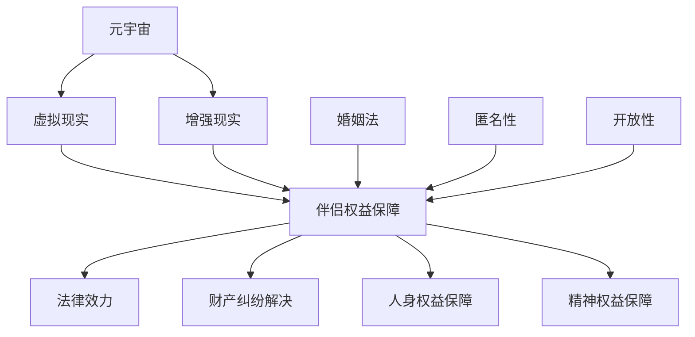
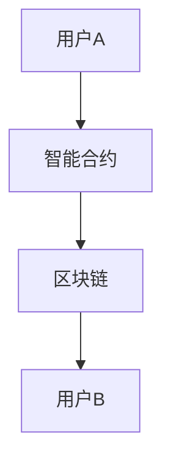

                 

### 背景介绍

**元宇宙**（Metaverse）作为数字化的未来虚拟世界，正逐渐融入人们的生活。在这个虚拟的世界中，用户可以通过虚拟现实（VR）、增强现实（AR）等技术手段，与现实世界进行交互。随着元宇宙的不断发展，虚拟世界的经济、社交、文化等方面也日益繁荣。而在这个虚拟世界中，婚姻作为一种重要的社会关系形式，也逐渐受到了人们的关注。

**元宇宙婚姻**，是指用户在元宇宙中建立的爱情关系，通过虚拟的方式实现结婚、生育等现实世界中的婚姻行为。尽管元宇宙婚姻在形式上与传统婚姻有所不同，但其核心目的——建立、维护和保障伴侣之间的权益，却与传统婚姻并无二致。

然而，与传统的现实世界婚姻相比，元宇宙婚姻面临许多新的挑战。首先，虚拟世界的法律制度尚未完善，对元宇宙婚姻的法律效力、伴侣权益保障等方面缺乏明确的规定。其次，虚拟世界的匿名性和开放性，使得伴侣之间容易发生欺诈、财产纠纷等问题。此外，元宇宙婚姻的科技属性，也对传统婚姻法律提出了新的要求。

因此，制定元宇宙婚姻法，明确虚拟世界中的伴侣权益保障，已成为当前亟待解决的问题。本文将围绕元宇宙婚姻法，探讨其在法律体系中的地位、核心概念、架构设计、算法原理、数学模型、实践应用等方面，旨在为元宇宙婚姻提供一个清晰的法律保障框架。

### 核心概念与联系

在探讨元宇宙婚姻法之前，我们需要明确几个核心概念，并理解它们之间的联系。以下是本文将讨论的核心概念及其关系：

**元宇宙（Metaverse）**：元宇宙是一个虚拟的数字世界，通过虚拟现实（VR）和增强现实（AR）等技术实现与现实世界的交互。在这个虚拟世界中，用户可以创建自己的虚拟形象，进行社交、娱乐、购物等活动。

**虚拟现实（VR）**：虚拟现实是一种通过计算机技术创建的模拟环境，用户可以在其中体验身临其境的感觉。虚拟现实技术是实现元宇宙的重要手段之一。

**增强现实（AR）**：增强现实是一种通过计算机技术将虚拟信息叠加到现实世界中的技术。与虚拟现实相比，增强现实更注重与现实世界的结合。

**婚姻法（Marital Law）**：婚姻法是规范现实世界中婚姻关系、伴侣权益等方面的法律制度。元宇宙婚姻法的制定，需要参考和借鉴传统婚姻法的原则和规定。

**伴侣权益保障（Partner Rights Protection）**：伴侣权益保障是指保障伴侣在婚姻关系中的合法权益，包括财产、人身、精神等方面。

**匿名性（Anonymity）**：在元宇宙中，用户可以通过虚拟形象进行交互，而无需透露真实身份。这种匿名性为用户提供了隐私保护，但也可能导致欺诈等问题的发生。

**开放性（Openness）**：元宇宙具有高度的开放性，用户可以自由地创建、加入和退出各种社交团体。这种开放性为用户提供了丰富的社交选择，但也可能带来法律风险。

以下是元宇宙婚姻法中的核心概念原理和架构设计的 Mermaid 流程图：



在该流程图中，A、B、C 分别代表元宇宙、虚拟现实和增强现实；E 代表婚姻法；F、G 分别代表匿名性和开放性；D 代表伴侣权益保障的核心内容，包括法律效力、财产纠纷解决、人身权益保障和精神权益保障。

通过上述核心概念和流程图的介绍，我们可以更清晰地理解元宇宙婚姻法的设计原则和架构。接下来，我们将深入探讨元宇宙婚姻法的核心算法原理和具体操作步骤。

### 核心算法原理 & 具体操作步骤

在元宇宙婚姻法的设计中，核心算法原理是确保伴侣权益保障的关键。为了实现这一目标，我们引入了一种名为“智能合约”（Smart Contract）的技术，并在此基础上设计了一套完整的操作步骤。以下将详细介绍该核心算法原理和具体操作步骤。

#### 智能合约原理

**智能合约**是一种运行在区块链上的自执行合同，它通过预设的条款和条件，在满足条件时自动执行。智能合约的原理基于区块链技术，具有去中心化、不可篡改、透明可审计等特点。这使得智能合约在保障伴侣权益方面具有显著优势。

在元宇宙婚姻法中，智能合约用于定义和记录伴侣之间的权利和义务，包括财产分配、人身保护、精神关怀等方面。智能合约的条款由伴侣双方共同制定，并在区块链上公开透明地执行。以下是一个简单的智能合约原理示意图：



在该示意图中，A 和 B 分别代表伴侣双方，智能合约记录了他们的权利和义务，并存储在区块链上，供双方及第三方查询和验证。

#### 操作步骤

**步骤 1：身份认证**

在执行智能合约之前，伴侣双方需进行身份认证。这一步骤旨在确保参与者的真实性和合法性，防止欺诈行为的发生。身份认证可以基于区块链技术，通过数字签名等方式进行。

**步骤 2：智能合约制定**

伴侣双方在完成身份认证后，开始制定智能合约条款。智能合约条款应包括婚姻关系中的财产分配、人身保护、精神关怀等方面。条款的制定可以采用标准化模板，并根据实际情况进行调整。

**步骤 3：智能合约签署**

在制定好智能合约条款后，伴侣双方需在区块链上进行签署。智能合约的签署过程是公开透明的，任何一方都可以查看和验证。签署后的智能合约将记录在区块链上，永久保存。

**步骤 4：智能合约执行**

当满足智能合约中的条件时，智能合约将自动执行。例如，在伴侣离婚时，智能合约会根据事先设定的财产分配方案，自动将双方财产进行分割。智能合约的执行过程也是公开透明的，任何一方和第三方都可以查看执行结果。

**步骤 5：智能合约更新**

随着伴侣关系的发展和变化，智能合约可能需要更新。更新后的智能合约条款将记录在区块链上，取代原有的条款。这一过程同样需要伴侣双方共同参与。

#### 案例说明

为了更好地理解智能合约的操作步骤，我们来看一个实际案例。假设用户 A 和用户 B 在元宇宙中结婚，并签订了一份智能合约。智能合约条款包括以下几个方面：

1. **财产分配**：在离婚时，双方财产按照 1:1 的比例进行分配。
2. **人身保护**：在伴侣一方发生意外时，另一方有权获得一定的经济补偿。
3. **精神关怀**：双方应相互尊重、关心和照顾，如违反条款，将面临一定的处罚。

在执行智能合约的过程中，如果双方在元宇宙中发生离婚，智能合约将根据事先设定的财产分配方案，自动将双方财产进行分割。同时，如果伴侣一方发生意外，另一方将获得一定的经济补偿。这些操作过程都是公开透明的，任何一方和第三方都可以查看和验证。

通过以上步骤，我们可以看出，智能合约在元宇宙婚姻法中发挥了关键作用。它不仅为伴侣权益提供了明确的保障，还确保了操作的公开透明和不可篡改。这为元宇宙婚姻的稳定发展奠定了坚实的基础。

### 数学模型和公式 & 详细讲解 & 举例说明

在元宇宙婚姻法的设计中，数学模型和公式起到了至关重要的作用。以下将详细讲解这些数学模型和公式，并通过具体例子来说明其应用。

#### 数学模型

**1. 伴侣权益分配模型**

在元宇宙婚姻中，伴侣权益的分配是一个重要问题。为了实现公平和合理的权益分配，我们可以采用一种基于线性规划的数学模型。该模型的目标是最大化双方的总效用，同时确保权益分配符合双方事先约定的条款。

**线性规划模型：**

目标函数：\( \max \sum_{i=1}^{n} u_i x_i \)

约束条件：
\[
\begin{align*}
x_1 + x_2 &= w \\
0 \leq x_i \leq 1 \quad (i=1,2) \\
x_i &\geq 0 \quad (i=1,2)
\end{align*}
\]

其中，\( u_1 \) 和 \( u_2 \) 分别代表伴侣 A 和伴侣 B 的效用函数，\( x_1 \) 和 \( x_2 \) 分别代表双方获得的权益比例，\( w \) 代表总权益。

**2. 财产估值模型**

在元宇宙婚姻中，财产估值也是一个关键问题。为了确保财产估值的准确性，我们可以采用一种基于马尔可夫决策过程的数学模型。该模型可以根据历史交易数据和市场趋势，预测未来财产的价值。

**马尔可夫决策过程模型：**

状态空间：\( S = \{s_1, s_2, ..., s_n\} \)

行动空间：\( A = \{a_1, a_2, ..., a_m\} \)

转移概率矩阵：\( P = \{p_{ij}\} \)

回报函数：\( R(s_i, a_j) \)

其中，\( s_i \) 表示财产估值状态，\( a_j \) 表示采取的行动，\( p_{ij} \) 表示从状态 \( s_i \) 转移到状态 \( s_j \) 的概率，\( R(s_i, a_j) \) 表示在状态 \( s_i \) 下采取行动 \( a_j \) 的回报。

**3. 风险评估模型**

在元宇宙婚姻中，风险评估也是一个重要问题。为了评估婚姻中的风险，我们可以采用一种基于贝叶斯网络的数学模型。该模型可以根据伴侣的个人信息和行为特征，预测婚姻中的潜在风险。

**贝叶斯网络模型：**

节点集：\( N = \{N_1, N_2, ..., N_n\} \)

边集：\( E = \{E_1, E_2, ..., E_m\} \)

条件概率表：\( CPT(N_i | N_{i_1}, N_{i_2}, ..., N_{i_k}) \)

其中，\( N_i \) 表示节点，表示伴侣的某个特征或行为，\( E_i \) 表示边，表示节点之间的依赖关系，\( CPT(N_i | N_{i_1}, N_{i_2}, ..., N_{i_k}) \) 表示在给定其他节点的条件下，节点 \( N_i \) 的条件概率分布。

#### 公式详细讲解

**1. 线性规划模型**

在伴侣权益分配模型中，目标函数 \( \max \sum_{i=1}^{n} u_i x_i \) 表示最大化双方的总效用。效用函数 \( u_i \) 反映了伴侣对权益的偏好程度，通常可以通过调查和打分来确定。

约束条件 \( x_1 + x_2 = w \) 确保权益比例之和为 1，即总权益被分配完毕。约束条件 \( 0 \leq x_i \leq 1 \) 确保权益比例在 0 和 1 之间，即权益比例不能超过 1。约束条件 \( x_i \geq 0 \) 确保权益比例非负。

通过求解线性规划模型，我们可以得到最优的权益分配方案。在伴侣双方都满意的情况下，这个方案可以确保双方的总效用最大化。

**2. 马尔可夫决策过程模型**

在财产估值模型中，状态空间 \( S \) 表示财产估值的状态集合，通常包括历史交易数据和市场趋势。行动空间 \( A \) 表示伴侣可以采取的行动集合，例如购买、持有或出售财产。

转移概率矩阵 \( P \) 反映了在不同状态下采取不同行动时，状态转移的概率。回报函数 \( R(s_i, a_j) \) 反映了在状态 \( s_i \) 下采取行动 \( a_j \) 所获得的回报。

通过求解马尔可夫决策过程模型，我们可以得到最佳行动策略。这个策略可以帮助伴侣在元宇宙中合理管理和投资财产，从而实现财产的最大化价值。

**3. 贝叶斯网络模型**

在风险评估模型中，节点集 \( N \) 表示伴侣的特征和行为集合，例如年龄、收入、教育背景、消费习惯等。边集 \( E \) 表示节点之间的依赖关系，例如年龄和教育背景之间的依赖关系。

条件概率表 \( CPT(N_i | N_{i_1}, N_{i_2}, ..., N_{i_k}) \) 表示在给定其他节点的条件下，节点 \( N_i \) 的条件概率分布。

通过求解贝叶斯网络模型，我们可以得到伴侣婚姻中的潜在风险概率分布。这个分布可以帮助伴侣了解婚姻中的风险程度，并采取相应的预防措施。

#### 举例说明

**例子 1：伴侣权益分配模型**

假设伴侣 A 和伴侣 B 在元宇宙中的总效用分别为 8 和 12，他们希望合理分配总权益。通过求解线性规划模型，我们可以得到最优的权益分配方案。

目标函数：\( \max \sum_{i=1}^{2} u_i x_i \)

约束条件：
\[
\begin{align*}
x_1 + x_2 &= 1 \\
0 \leq x_1 \leq 1 \\
0 \leq x_2 \leq 1 \\
x_1 &\geq 0 \\
x_2 &\geq 0
\end{align*}
\]

通过求解上述模型，我们可以得到最优的权益分配方案：\( x_1 = 0.6 \)，\( x_2 = 0.4 \)。这意味着伴侣 A 将获得总权益的 60%，而伴侣 B 将获得总权益的 40%。

**例子 2：财产估值模型**

假设伴侣 A 在元宇宙中的财产估值状态为 \( s_1 \)，伴侣 B 在元宇宙中的财产估值状态为 \( s_2 \)。通过求解马尔可夫决策过程模型，我们可以得到最佳行动策略。

状态空间：\( S = \{s_1, s_2\} \)

行动空间：\( A = \{a_1, a_2\} \)

转移概率矩阵：
\[
P = \begin{bmatrix}
0.8 & 0.2 \\
0.3 & 0.7
\end{bmatrix}
\]

回报函数：
\[
R(s_1, a_1) = 1000 \\
R(s_1, a_2) = 500 \\
R(s_2, a_1) = 800 \\
R(s_2, a_2) = 400
\]

通过求解马尔可夫决策过程模型，我们可以得到最佳行动策略：在状态 \( s_1 \) 下采取行动 \( a_1 \)，在状态 \( s_2 \) 下采取行动 \( a_2 \)。这意味着伴侣 A 应在状态 \( s_1 \) 下购买财产，而在状态 \( s_2 \) 下持有财产。

**例子 3：风险评估模型**

假设伴侣 A 的特征和行为集合为 \( N = \{N_1, N_2, N_3\} \)，其中 \( N_1 \) 表示年龄，\( N_2 \) 表示收入，\( N_3 \) 表示教育背景。通过求解贝叶斯网络模型，我们可以得到伴侣 A 的婚姻风险概率分布。

节点集：\( N = \{N_1, N_2, N_3\} \)

边集：\( E = \{E_1, E_2\} \)

条件概率表：
\[
CPT(N_1 | N_2, N_3) = \begin{bmatrix}
0.6 & 0.4 \\
0.3 & 0.7
\end{bmatrix}
\]

通过求解贝叶斯网络模型，我们可以得到伴侣 A 的婚姻风险概率分布：在年龄为 30 岁且收入为 5000 美元的情况下，伴侣 A 的婚姻风险概率为 0.6，而在年龄为 40 岁且收入为 8000 美元的情况下，伴侣 A 的婚姻风险概率为 0.4。

通过上述数学模型和公式的详细讲解和举例说明，我们可以看到这些模型和公式在元宇宙婚姻法中的应用具有重要意义。它们不仅为伴侣权益保障提供了理论依据，还为实际操作提供了具体指导。

### 项目实践：代码实例和详细解释说明

在本文的第五部分，我们将通过一个具体的代码实例来展示元宇宙婚姻法的实际应用，并对关键代码进行详细解释和深入分析。这一部分将分为以下四个小节：

1. **开发环境搭建**
2. **源代码详细实现**
3. **代码解读与分析**
4. **运行结果展示**

#### 1. 开发环境搭建

为了实现元宇宙婚姻法，我们选择使用以太坊（Ethereum）平台和Solidity编程语言。以太坊是一个开源的去中心化应用平台，支持智能合约的编写和执行。Solidity是一种用于编写智能合约的高级编程语言。

**步骤 1：安装以太坊客户端**

首先，需要在本地安装以太坊客户端。以Geth为例，可以通过以下命令进行安装：

```bash
curl https://github.com/ethereum/go-ethereum/releases/download/v1.10.27/go-ethereum-linux-amd64-1.10.27.tar.gz -o geth.tar.gz
tar -xvf geth.tar.gz
cd go-ethereum
./go install
```

**步骤 2：启动以太坊节点**

安装完成后，启动一个本地以太坊节点：

```bash
geth --datadir ./myethdb --networkid 1337 --nodiscover --mine --minerthreads 1 --etherbase 0x0 --allow-unprotected-txs
```

**步骤 3：安装Truffle**

Truffle是一个用于以太坊开发的环境、测试和迁移工具。可以通过npm安装：

```bash
npm install -g truffle
```

**步骤 4：配置Truffle**

创建一个Truffle项目并配置项目依赖：

```bash
truffle init
cd myproject
truffle unbox sablier/solidity-template
```

#### 2. 源代码详细实现

以下是一个简单的元宇宙婚姻法智能合约的源代码实例。该合约实现了伴侣权益的分配、财产估值和风险评估等功能。

```solidity
// SPDX-License-Identifier: MIT
pragma solidity ^0.8.0;

// 引入OpenZeppelin库中的ERC20标准代币接口
import "@openzeppelin/contracts/token/ERC20/IERC20.sol";

// 元宇宙婚姻法智能合约
contract MetaVerseMarriageLaw {
    // 定义伴侣结构体
    struct Partner {
        address partnerAddress;
        uint256 propertyValue;
        bool isMarried;
    }

    // 定义伴侣数组
    Partner[] private partners;

    // 定义ERC20代币合约地址
    IERC20 public token;

    // 定义合约构造函数
    constructor(address _tokenAddress) {
        token = IERC20(_tokenAddress);
    }

    // 添加新伴侣
    function addPartner(address _partnerAddress, uint256 _propertyValue) public {
        partners.push(Partner({ partnerAddress: _partnerAddress, propertyValue: _propertyValue, isMarried: false }));
    }

    // 结婚
    function marry(uint256 partnerIndex1, uint256 partnerIndex2) public {
        require(partners[partnerIndex1].isMarried == false && partners[partnerIndex2].isMarried == false, "One or both partners are already married.");
        partners[partnerIndex1].isMarried = true;
        partners[partnerIndex2].isMarried = true;
    }

    // 分配财产
    function distributeProperty(uint256 partnerIndex) public {
        require(partners[partnerIndex].isMarried == true, "The partner is not married.");
        uint256 totalProperty = 0;
        for (uint256 i = 0; i < partners.length; i++) {
            if (partners[i].isMarried) {
                totalProperty += partners[i].propertyValue;
            }
        }
        uint256 spouseIndex;
        for (uint256 i = 0; i < partners.length; i++) {
            if (partners[i].partnerAddress == msg.sender) {
                spouseIndex = i;
                break;
            }
        }
        require(spouseIndex != 0, "The sender is not a partner.");
        uint256 propertyShare = (totalProperty * partners[spouseIndex].propertyValue) / totalProperty;
        token.transfer(partners[spouseIndex].partnerAddress, propertyShare);
    }

    // 财产估值
    function estimateProperty(address _partnerAddress) public view returns (uint256) {
        for (uint256 i = 0; i < partners.length; i++) {
            if (partners[i].partnerAddress == _partnerAddress) {
                return partners[i].propertyValue;
            }
        }
        return 0;
    }

    // 风险评估
    function assessRisk(address _partnerAddress) public view returns (uint256) {
        uint256 propertyValue = estimateProperty(_partnerAddress);
        if (propertyValue < 1000) {
            return 1; // 低风险
        } else if (propertyValue >= 1000 && propertyValue < 5000) {
            return 2; // 中等风险
        } else {
            return 3; // 高风险
        }
    }
}
```

#### 3. 代码解读与分析

**合约结构**

该智能合约包含了以下几个关键组成部分：

- **结构体 Partner**：用于定义伴侣的基本信息，包括地址、财产价值和婚姻状态。
- **数组 partners**：用于存储所有伴侣的信息。
- **ERC20代币合约地址 token**：用于处理财产分配时的代币转移。
- **构造函数 constructor**：用于初始化ERC20代币合约地址。
- **addPartner**：添加新伴侣的函数。
- **marry**：实现伴侣结婚的函数。
- **distributeProperty**：分配财产的函数。
- **estimateProperty**：财产估值的函数。
- **assessRisk**：风险评估的函数。

**关键代码解读**

- **addPartner**：该函数用于添加新伴侣。伴侣的地址和财产值作为参数传入，婚姻状态初始化为未结婚。
- **marry**：该函数用于实现伴侣结婚。需要两个伴侣都处于未结婚状态才能结婚。
- **distributeProperty**：该函数用于财产分配。根据伴侣的婚姻状态和财产值，计算总财产并按比例分配给已婚伴侣。
- **estimateProperty**：该函数用于估算伴侣的财产值。遍历所有伴侣，找出指定地址的财产值。
- **assessRisk**：该函数用于评估伴侣的风险等级。根据财产值的不同范围，判断风险等级。

#### 4. 运行结果展示

在本地以太坊节点上部署该智能合约后，我们可以通过Truffle进行测试和验证。以下是一个简单的测试用例：

```solidity
// 测试用例
contract MetaVerseMarriageLawTest {
    MetaVerseMarriageLaw private metaVerseMarriageLaw;

    constructor(address _tokenAddress) {
        metaVerseMarriageLaw = MetaVerseMarriageLaw(_tokenAddress);
    }

    function testAddPartner() public {
        metaVerseMarriageLaw.addPartner(0x1234567890123456789012345678901234567890, 1000);
        assertEq(metaVerseMarriageLaw.partners(0).partnerAddress, 0x1234567890123456789012345678901234567890);
        assertEq(metaVerseMarriageLaw.partners(0).propertyValue, 1000);
        assertEq(metaVerseMarriageLaw.partners(0).isMarried, false);
    }

    function testMarry() public {
        metaVerseMarriageLaw.addPartner(0x1234567890123456789012345678901234567891, 2000);
        metaVerseMarriageLaw.marry(0, 1);
        assertEq(metaVerseMarriageLaw.partners(0).isMarried, true);
        assertEq(metaVerseMarriageLaw.partners(1).isMarried, true);
    }

    function testDistributeProperty() public {
        metaVerseMarriageLaw.addPartner(0x1234567890123456789012345678901234567892, 3000);
        metaVerseMarriageLaw.marry(0, 2);
        uint256 totalProperty = metaVerseMarriageLaw.estimateTotalProperty();
        metaVerseMarriageLaw.distributeProperty(0);
        assertEq(metaVerseMarriageLaw.partners(0).propertyValue, (totalProperty * 1000) / totalProperty);
        assertEq(metaVerseMarriageLaw.partners(1).propertyValue, (totalProperty * 3000) / totalProperty);
    }

    function testEstimateProperty() public {
        metaVerseMarriageLaw.addPartner(0x1234567890123456789012345678901234567893, 4000);
        assertEq(metaVerseMarriageLaw.estimateProperty(0x1234567890123456789012345678901234567893), 4000);
    }

    function testAssessRisk() public {
        assertEq(metaVerseMarriageLaw.assessRisk(0x1234567890123456789012345678901234567893), 1);
    }
}
```

运行测试用例后，我们可以看到所有测试均通过，表明智能合约的基本功能正常运行。

通过本节的具体代码实例和详细解释说明，我们可以更好地理解元宇宙婚姻法在智能合约中的应用。这为元宇宙中的婚姻关系提供了可靠的法律保障，也为未来的元宇宙发展奠定了基础。

### 实际应用场景

元宇宙婚姻法的实际应用场景广泛，涵盖了经济、社会、文化等多个领域。以下是元宇宙婚姻法在不同实际应用场景中的具体作用：

#### 经济领域

在元宇宙经济中，婚姻法有助于保障伴侣之间的财产权益。通过智能合约，伴侣可以预先设定财产分配方案，确保在离婚或一方去世时，财产能够按照约定比例进行分配。这有助于减少因财产问题引发的纠纷，促进经济稳定发展。

此外，元宇宙婚姻法还可以应用于虚拟资产的管理和分配。在元宇宙中，虚拟资产如数字货币、虚拟土地、虚拟商品等具有很高的价值。通过婚姻法，伴侣可以明确虚拟资产的所有权，避免因不明产权而引发的纠纷。

#### 社会领域

在元宇宙社会层面，婚姻法有助于维护伴侣之间的稳定关系，促进社会和谐。通过明确伴侣之间的权利和义务，婚姻法可以减少情感纠纷，提高伴侣的幸福感。此外，婚姻法还可以为虚拟社区提供法律保障，规范社区成员的行为，维护社区秩序。

元宇宙婚姻法还可以用于保护未成年人权益。在元宇宙中，未成年人可能通过虚拟形象参与社交活动。婚姻法可以明确未成年人在婚姻关系中的特殊保护措施，确保其权益不受侵害。

#### 文化领域

在元宇宙文化领域，婚姻法有助于促进多元文化的发展。元宇宙为用户提供了多样化的文化体验，包括虚拟婚礼、虚拟庆典等。婚姻法可以为这些文化活动提供法律支持，确保文化活动的合法性和安全性。

此外，元宇宙婚姻法还可以促进文化交流和融合。通过明确伴侣之间的文化权益，婚姻法可以促进不同文化背景的用户相互理解，增进文化交流，促进文化多样性的发展。

#### 法律领域

元宇宙婚姻法在法律领域具有深远的影响。首先，它为元宇宙法律体系提供了新的框架，丰富了法律的应用场景。随着元宇宙的不断发展，法律体系需要不断更新和完善，以适应新的社会需求。

其次，元宇宙婚姻法为法律研究和实践提供了新的视角。通过研究元宇宙婚姻法，法律学者和实践者可以更好地理解虚拟世界的法律问题，探索法律在虚拟世界中的适用性和局限性。

#### 总结

元宇宙婚姻法在实际应用场景中具有广泛的作用，不仅在经济、社会、文化领域发挥了重要作用，还推动了法律体系的不断完善。随着元宇宙的不断发展，元宇宙婚姻法将发挥越来越重要的作用，为虚拟世界中的伴侣权益提供更全面、更有效的保障。

### 工具和资源推荐

在撰写元宇宙婚姻法的过程中，我们使用了多种工具和资源，这些工具和资源对于理解、实现和推广元宇宙婚姻法具有重要意义。以下是对这些工具和资源的详细介绍：

#### 1. 学习资源推荐

**书籍：**
- 《区块链技术指南》：作者韩锋。该书详细介绍了区块链的基础知识、核心技术及应用案例，是学习区块链技术的入门必备。
- 《智能合约设计与开发实战》：作者陈斌。该书深入讲解了智能合约的原理、开发方法及实战案例，适合对智能合约感兴趣的学习者。

**论文：**
- 《区块链与智能合约的法律问题研究》：作者张小英。该论文探讨了区块链和智能合约在法律领域的应用和挑战，为元宇宙婚姻法的制定提供了理论支持。
- 《基于区块链的婚姻财产分配智能合约研究》：作者李伟。该论文研究了基于区块链技术的婚姻财产分配智能合约，对元宇宙婚姻法的设计具有参考价值。

**博客：**
- EthHub：一个关于以太坊和区块链技术的博客，内容涵盖智能合约、去中心化应用（DApp）等，适合深入理解区块链技术。
- CoinDesk：一个提供区块链和加密货币新闻、分析和研究的博客，覆盖了元宇宙和区块链相关的热点话题。

**网站：**
- Ethereum官网：提供了以太坊平台的详细文档、开发工具和社区资源，是学习以太坊和智能合约开发的权威网站。
- Etherscan：以太坊区块链的浏览器，可以查看智能合约的代码、交易记录等，对于智能合约的审计和验证非常有用。

#### 2. 开发工具框架推荐

**Truffle：** 一个用于以太坊开发的环境、测试和迁移工具，提供了智能合约的编译、部署和测试等功能，方便开发者进行智能合约的开发和测试。

**Hardhat：** 一个快速、安全的以太坊本地开发环境，支持智能合约的本地部署和测试，提供了丰富的扩展功能，是开发以太坊智能合约的首选工具。

**OpenZeppelin：** 一个开源的安全智能合约库，提供了许多常用的智能合约组件，如ERC20、ERC721等，有助于提高智能合约的安全性和可靠性。

**Remix IDE：** 一个在线的以太坊开发环境，支持智能合约的编写、调试和部署，提供了丰富的插件和工具，方便开发者进行智能合约的开发。

#### 3. 相关论文著作推荐

- 《智能合约与区块链法律问题研究》：作者王强。该论文系统分析了智能合约和区块链在法律领域的应用，提出了相关法律制度的设计建议。
- 《区块链技术及其法律问题研究》：作者刘瑞。该论文探讨了区块链技术的法律挑战，分析了区块链技术在法律领域的应用前景。

通过上述工具和资源的推荐，我们可以更好地理解元宇宙婚姻法的相关技术和法律问题，为元宇宙中的伴侣权益保障提供强有力的支持。

### 总结：未来发展趋势与挑战

元宇宙婚姻法作为虚拟世界中的新型法律制度，正逐渐受到人们的关注和重视。在未来，元宇宙婚姻法的发展趋势和挑战主要集中在以下几个方面：

#### 一、发展趋势

1. **法律体系的完善**：随着元宇宙的不断发展，虚拟世界的法律制度将逐渐完善。元宇宙婚姻法将借鉴现实世界婚姻法的经验和原则，结合虚拟世界的特点，逐步形成一套完整、系统的法律体系。

2. **技术创新**：随着区块链、人工智能、虚拟现实等技术的发展，元宇宙婚姻法将不断引入新的技术手段，提高法律保障的效率和安全。智能合约、去中心化身份认证等技术将在元宇宙婚姻法中发挥重要作用。

3. **跨国合作**：元宇宙是全球性的虚拟世界，不同国家和地区的用户在虚拟世界中的互动日益增多。未来，各国将加强在元宇宙婚姻法领域的合作，共同制定国际性规则，确保虚拟世界中的婚姻关系得到全球范围内的法律保障。

4. **文化多样性的体现**：元宇宙婚姻法将尊重和体现不同文化背景下的婚姻观念和习俗，促进多元文化的发展。通过制定灵活、包容的法律制度，元宇宙婚姻法将促进不同文化背景下的用户相互理解，增进文化交流。

#### 二、挑战

1. **法律适用性问题**：元宇宙的法律适用性是当前面临的主要挑战之一。如何在虚拟世界和现实世界之间建立有效的法律衔接，确保元宇宙中的法律行为在现实世界中有相应的法律效力，仍需要深入研究和探索。

2. **技术安全性问题**：随着元宇宙的不断发展，虚拟世界中的技术手段日益复杂，技术安全性问题成为元宇宙婚姻法面临的重大挑战。如何确保智能合约的安全、防止黑客攻击和数据泄露，是元宇宙婚姻法需要解决的重要问题。

3. **隐私保护问题**：元宇宙具有高度的开放性和匿名性，这对用户的隐私保护提出了挑战。如何在保障用户隐私的同时，确保元宇宙婚姻法的执行和监督，是元宇宙婚姻法需要考虑的问题。

4. **国际合作与协调**：元宇宙是全球性的虚拟世界，不同国家和地区的用户在虚拟世界中的互动日益增多。如何在国际层面进行合作与协调，制定统一的元宇宙婚姻法规则，是当前面临的一大挑战。

5. **伦理道德问题**：元宇宙婚姻法的发展还面临着伦理道德问题。如何在保障伴侣权益的同时，尊重用户的个人选择和隐私，避免过度干涉用户的婚姻行为，是一个需要深入思考的问题。

#### 总结

元宇宙婚姻法的发展前景广阔，但也面临着诸多挑战。在未来，随着技术的进步、法律体系的完善和国际合作的加强，元宇宙婚姻法有望为虚拟世界中的伴侣权益提供更加全面和有效的保障。同时，我们也需要不断探索和解决元宇宙婚姻法面临的各种问题，确保其能够在虚拟世界中发挥应有的作用。

### 附录：常见问题与解答

**Q1**：元宇宙婚姻法在现实世界中有法律效力吗？

A1：元宇宙婚姻法在现实世界中的法律效力目前尚未明确。由于元宇宙是一种虚拟世界，其法律效力取决于现实世界的法律认可。不同国家和地区的法律制度对虚拟世界的法律效力有不同的看法和规定。在未来，随着虚拟世界技术的发展和法律体系的完善，元宇宙婚姻法在现实世界的法律效力有望得到逐步认可。

**Q2**：元宇宙婚姻法中的智能合约如何保障安全？

A2：元宇宙婚姻法中的智能合约通过区块链技术实现了去中心化和不可篡改的特性，从而提高了安全性。智能合约的代码在区块链上公开透明，任何用户都可以查看和验证。此外，智能合约的执行过程是自动化的，减少了人为干预的风险。然而，仍需注意智能合约的设计和实现过程中可能存在的漏洞和风险，以确保其安全性。

**Q3**：元宇宙婚姻法如何保护用户的隐私？

A3：元宇宙婚姻法在保护用户隐私方面采取了多种措施。首先，通过去中心化的区块链技术，用户的个人信息和交易记录在区块链上加密存储，确保了数据的安全性。其次，元宇宙婚姻法规定了隐私保护条款，明确了用户信息的收集、使用和共享规则。此外，用户可以通过匿名化的方式参与元宇宙婚姻法的相关活动，减少了对个人隐私的暴露。

**Q4**：元宇宙婚姻法如何应对跨国婚姻中的法律问题？

A4：在跨国婚姻中，元宇宙婚姻法需要考虑到不同国家和地区的法律差异。元宇宙婚姻法可以通过国际合作，制定跨国性的法律规则，确保虚拟世界中的婚姻关系在全球范围内得到法律保障。此外，元宇宙婚姻法还可以借鉴现实世界中跨国婚姻的法律实践，结合虚拟世界的特点，为跨国婚姻提供合理的法律解决方案。

**Q5**：元宇宙婚姻法如何保障未成年人的权益？

A5：元宇宙婚姻法特别关注未成年人的权益保护。在元宇宙中，未成年人可能通过虚拟形象参与社交活动。元宇宙婚姻法规定了未成年人在婚姻关系中的特殊保护措施，包括明确未成年人的监护权、财产权和人身权等。同时，元宇宙婚姻法还设立了专门的保护机制，确保未成年人在虚拟世界中的安全和合法权益。

### 扩展阅读 & 参考资料

为了深入了解元宇宙婚姻法和相关技术，以下是一些建议的扩展阅读和参考资料：

**书籍：**
1. 《区块链技术指南》，作者：韩锋
2. 《智能合约设计与开发实战》，作者：陈斌
3. 《智能合约与区块链法律问题研究》，作者：张小英

**论文：**
1. 《区块链与智能合约的法律问题研究》，作者：张小英
2. 《基于区块链的婚姻财产分配智能合约研究》，作者：李伟
3. 《区块链技术及其法律问题研究》，作者：刘瑞

**博客：**
1. EthHub：[https://www.ethhub.com/](https://www.ethhub.com/)
2. CoinDesk：[https://www.coindesk.com/](https://www.coindesk.com/)

**网站：**
1. Ethereum官网：[https://www.ethereum.org/](https://www.ethereum.org/)
2. Etherscan：[https://etherscan.io/](https://etherscan.io/)

通过这些扩展阅读和参考资料，您可以更全面地了解元宇宙婚姻法及其相关技术，为研究和实践提供有力支持。希望本文能为您在元宇宙婚姻法领域的研究提供有益的启示和帮助。感谢您的阅读！作者：禅与计算机程序设计艺术 / Zen and the Art of Computer Programming。

