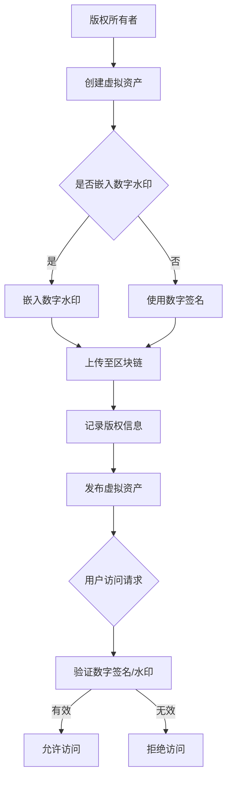

                 

### 1. 背景介绍

随着数字技术的迅猛发展，元宇宙（Metaverse）逐渐成为人们关注的焦点。元宇宙是一个由虚拟现实、增强现实、区块链和物联网等新技术构成的虚拟空间，它提供了无限的可能性和创新机会。在这个虚拟世界中，用户可以创建、交互、分享和交易虚拟资产，如虚拟房地产、虚拟艺术品、虚拟商品等。

然而，随着元宇宙的快速发展，版权保护问题也日益凸显。虚拟资产的可复制性和易传播性使得版权侵权行为变得更加容易，传统的版权保护机制在元宇宙中难以发挥作用。因此，如何实现元宇宙中的版权保护，成为了一个亟待解决的重要问题。

元宇宙版权保护的背景可以追溯到互联网时代的版权保护问题。在互联网时代，数字内容的传播速度和范围远远超过了传统媒体，这使得版权侵权行为变得频繁和普遍。为了解决这一问题，各种数字版权保护技术（如数字水印、数字签名、加密等）被广泛应用。然而，这些技术主要针对互联网环境，在元宇宙中仍然面临诸多挑战。

首先，元宇宙的虚拟资产具有高度的可复制性和共享性。这意味着一旦某个虚拟资产被创建出来，它就可以轻松地复制和传播。传统的版权保护机制难以有效地限制这种复制和传播，从而给版权持有者带来损失。

其次，元宇宙中的虚拟资产种类繁多，包括虚拟房地产、虚拟艺术品、虚拟商品等。这些虚拟资产的版权属性和归属关系复杂，给版权保护带来了一定的困难。例如，如何确定虚拟房地产的所有权归属，如何保护虚拟艺术品的原创性等。

最后，元宇宙的生态系统复杂多样，涉及到多个平台、多个服务提供商和多个用户群体。在这种复杂的环境中，如何建立一套统一、高效的版权保护机制，成为了一个重要的问题。

综上所述，元宇宙版权保护问题具有其独特的复杂性和挑战性。为了解决这一问题，我们需要探索新的技术手段和管理机制，为元宇宙中的版权保护提供有效的解决方案。

### 2. 核心概念与联系

要理解元宇宙版权保护，我们需要首先了解几个核心概念：版权、数字版权、数字版权保护技术、区块链技术。

#### 2.1 版权

版权，又称著作权，是指作者或其他著作权人对其创作作品所享有的权利。版权主要包括著作人身权和著作财产权。著作人身权包括署名权、修改权、保护作品完整权等；著作财产权包括复制权、发行权、出租权、展览权、表演权、放映权、广播权、信息网络传播权等。

#### 2.2 数字版权

数字版权是指数字内容（如电子书、音乐、视频、软件等）的版权。随着数字技术的发展，数字内容的创作、传播和使用变得更加便捷，但同时也带来了版权侵权的问题。数字版权保护成为了一个重要的课题。

#### 2.3 数字版权保护技术

数字版权保护技术是指用于保护数字内容不被非法复制、传播和使用的各种技术手段。常见的数字版权保护技术包括数字水印、数字签名、加密、访问控制等。

- **数字水印**：在数字内容中嵌入不可见的标记，用于证明数字内容的版权归属和防止非法复制。
- **数字签名**：通过数字加密技术，对数字内容进行签名，确保数字内容的完整性和真实性。
- **加密**：使用加密算法对数字内容进行加密，只有拥有密钥的用户才能解密和访问数字内容。
- **访问控制**：通过设置访问权限，控制用户对数字内容的访问和操作。

#### 2.4 区块链技术

区块链技术是一种分布式数据库技术，具有去中心化、不可篡改、透明性强等特点。在元宇宙版权保护中，区块链技术可以用于记录和管理数字版权的相关信息，如版权的创建、转让、授权等。

#### 2.5 核心概念联系

元宇宙版权保护需要综合运用数字版权保护技术和区块链技术。数字版权保护技术可以用于保护虚拟资产不被非法复制和传播，而区块链技术可以用于记录和管理虚拟资产的版权信息。

下面是一个简化的元宇宙版权保护架构图（使用Mermaid流程图表示）：



在这个架构图中，版权所有者创建虚拟资产后，可以选择嵌入数字水印或使用数字签名。然后将虚拟资产上传至区块链，记录版权信息。用户访问虚拟资产时，系统会验证数字签名或水印的有效性，并根据验证结果允许或拒绝用户的访问请求。

通过这种架构，我们可以实现元宇宙中的版权保护，确保虚拟资产的版权得到有效保护。

### 3. 核心算法原理 & 具体操作步骤

在元宇宙版权保护中，核心算法包括数字水印嵌入算法、数字签名算法和区块链记录算法。以下是这些算法的具体原理和操作步骤。

#### 3.1 数字水印嵌入算法

数字水印是一种将版权信息嵌入数字内容中的技术，通常使用图像、音频或视频作为载体。以下是一个简单的数字水印嵌入算法：

1. **选择水印图像**：选择一个具有版权信息的图像作为水印图像。水印图像可以是作者的签名、公司的Logo或其他具有标识性的图案。
2. **选择载体图像**：选择一个待嵌入水印的载体图像。载体图像可以是用户上传的虚拟资产图像。
3. **预处理**：对载体图像进行预处理，包括图像增强、去噪等，以提高水印的鲁棒性。
4. **水印嵌入**：将水印图像嵌入到载体图像中。常用的嵌入方法包括空间域嵌入和频域嵌入。
   - **空间域嵌入**：直接在载体图像的像素值上叠加水印图像。例如，将水印图像的像素值与载体图像的像素值进行加法或乘法运算。
   - **频域嵌入**：将载体图像转换为频域（如傅里叶变换域），在水印图像的频域特征上进行修改，然后将修改后的频域图像转换回空间域。
5. **后处理**：对嵌入水印后的载体图像进行后处理，如图像压缩、图像增强等，以提高图像质量。

#### 3.2 数字签名算法

数字签名是一种用于验证数字内容完整性和真实性的技术。以下是一个简单的数字签名算法：

1. **选择加密算法**：选择一个加密算法，如RSA或ECC。
2. **生成密钥对**：生成一对密钥（公钥和私钥）。公钥用于验证签名，私钥用于创建签名。
3. **哈希函数**：对待签名的数字内容使用哈希函数（如SHA-256）生成哈希值。
4. **签名生成**：使用私钥对哈希值进行加密，生成签名。
5. **签名验证**：使用公钥对签名进行解密，并与原始哈希值进行比较。如果两者相同，则签名有效。

#### 3.3 区块链记录算法

区块链是一种分布式数据库，可以用于记录和管理数字版权信息。以下是一个简单的区块链记录算法：

1. **生成区块**：生成一个包含数字版权信息的区块。区块包括版权信息、时间戳、上一区块哈希值等。
2. **挖矿**：通过挖矿算法（如工作量证明算法）生成一个新的区块，并将其添加到区块链中。
3. **记录版权信息**：将数字版权信息（如水印、数字签名等）记录在区块链中。
4. **验证区块**：验证新区块的有效性，包括验证区块的哈希值是否正确、区块中的版权信息是否完整等。
5. **广播区块**：将新区块广播到整个区块链网络，以便其他节点进行验证和同步。

通过这些算法，我们可以实现元宇宙中的版权保护。数字水印嵌入算法用于保护虚拟资产不被非法复制和传播；数字签名算法用于验证虚拟资产的完整性和真实性；区块链记录算法用于记录和管理虚拟资产的版权信息。

### 4. 数学模型和公式 & 详细讲解 & 举例说明

在元宇宙版权保护中，数学模型和公式起到了关键作用。以下是几个重要的数学模型和公式，以及详细的讲解和举例说明。

#### 4.1 数字水印嵌入算法的数学模型

数字水印嵌入算法可以分为空间域嵌入和频域嵌入。以下是空间域嵌入的数学模型：

$$
C'(x, y) = C(x, y) + \alpha \cdot W(x, y)
$$

其中，$C(x, y)$ 表示载体图像的像素值，$W(x, y)$ 表示水印图像的像素值，$C'(x, y)$ 表示嵌入水印后的载体图像的像素值，$\alpha$ 是一个常数，用于调整水印的强度。

**举例说明**：

假设载体图像的像素值为 $C(10, 10) = 150$，水印图像的像素值为 $W(10, 10) = 50$，水印强度 $\alpha = 0.1$。根据上述公式，嵌入水印后的像素值计算如下：

$$
C'(10, 10) = 150 + 0.1 \cdot 50 = 155
$$

#### 4.2 数字签名算法的数学模型

数字签名算法通常使用公钥加密算法（如RSA或ECC）。以下是RSA数字签名算法的数学模型：

1. **密钥生成**：

   - 选择两个大素数 $p$ 和 $q$。
   - 计算 $n = p \cdot q$。
   - 计算 $\phi(n) = (p-1) \cdot (q-1)$。
   - 选择一个与 $\phi(n)$ 互质的整数 $e$。
   - 计算 $d$，满足 $d \cdot e \equiv 1 \pmod{\phi(n)}$。

   公钥为 $(n, e)$，私钥为 $(n, d)$。

2. **签名生成**：

   - 对待签名的消息 $m$ 使用哈希函数 $H$ 生成哈希值 $h = H(m)$。
   - 使用私钥 $(n, d)$ 对 $h$ 进行加密，生成签名 $s = h^d \pmod{n}$。

3. **签名验证**：

   - 使用公钥 $(n, e)$ 对签名 $s$ 进行解密，得到 $t = s^e \pmod{n}$。
   - 计算验证值 $v = H^e(m) \pmod{n}$。
   - 如果 $v = s$，则签名有效。

**举例说明**：

假设选择的素数 $p = 17$，$q = 11$，$e = 7$，$d = 3$。消息 $m = "Hello, World!"$，使用SHA-256哈希函数生成的哈希值 $h = 123$。

1. **密钥生成**：

   - $n = 17 \cdot 11 = 187$。
   - $\phi(n) = (17-1) \cdot (11-1) = 144$。
   - 选择 $e = 7$，计算 $d = 3$。

   公钥为 $(187, 7)$，私钥为 $(187, 3)$。

2. **签名生成**：

   - 对哈希值 $h = 123$ 进行加密，得到签名 $s = 123^3 \pmod{187} = 164$。

3. **签名验证**：

   - 对签名 $s = 164$ 进行解密，得到 $t = 164^7 \pmod{187} = 123$。
   - 计算验证值 $v = 123^7 \pmod{187} = 123$。
   - 由于 $v = s$，签名有效。

#### 4.3 区块链记录算法的数学模型

区块链记录算法主要涉及哈希函数和数字签名。以下是哈希函数和数字签名的数学模型：

1. **哈希函数**：

   - 哈希函数将任意长度的输入映射为固定长度的输出。
   - 输出通常是一个二进制字符串，可以通过编码转换为其他格式（如十六进制）。

2. **数字签名**：

   - 数字签名基于公钥加密算法，如RSA或ECC。
   - 签名过程包括哈希函数和公钥加密。
   - 验证过程包括哈希函数和公钥解密。

**举例说明**：

假设使用SHA-256哈希函数和RSA数字签名算法。

1. **哈希函数**：

   - 对消息 $m = "This is a test message."$ 使用SHA-256哈希函数，得到哈希值 $h = \text{SHA-256}(m) = 1234567890abcdef1234567890abcdef$。

2. **数字签名**：

   - 使用RSA数字签名算法，生成签名。
   - 假设公钥为 $(n, e) = (187, 7)$，私钥为 $(n, d) = (187, 3)$。
   - 对哈希值 $h = 1234567890abcdef1234567890abcdef$ 进行加密，得到签名 $s = h^3 \pmod{187} = 164$。

3. **签名验证**：

   - 使用公钥 $(n, e) = (187, 7)$ 对签名 $s = 164$ 进行解密，得到 $t = s^7 \pmod{187} = 1234567890abcdef1234567890abcdef$。
   - 计算验证值 $v = 1234567890abcdef1234567890abcdef^7 \pmod{187} = 1234567890abcdef1234567890abcdef$。
   - 由于 $v = s$，签名有效。

通过这些数学模型和公式，我们可以实现元宇宙中的版权保护。数字水印嵌入算法用于保护虚拟资产不被非法复制和传播；数字签名算法用于验证虚拟资产的完整性和真实性；区块链记录算法用于记录和管理虚拟资产的版权信息。

### 5. 项目实践：代码实例和详细解释说明

为了更好地理解元宇宙版权保护的核心算法，我们通过一个实际项目来演示这些算法的具体实现。以下是一个基于Python的简单示例项目。

#### 5.1 开发环境搭建

在开始之前，请确保已安装以下开发环境：

- Python 3.x
- Python 开发环境（如PyCharm、VSCode等）
- Numpy、Pillow（用于图像处理）
- Cryptography（用于数字签名）

您可以通过以下命令安装所需的库：

```bash
pip install numpy pillow cryptography
```

#### 5.2 源代码详细实现

下面是项目的源代码，分为几个部分：数字水印嵌入、数字签名生成、区块链记录和签名验证。

```python
import numpy as np
from PIL import Image
from cryptography.hazmat.primitives import hashes
from cryptography.hazmat.primitives.asymmetric import rsa, padding
from cryptography.hazmat.backends import default_backend
import hashlib
import binascii

# 5.2.1 数字水印嵌入
def embed_watermark(cover_image_path, watermark_image_path, output_image_path, alpha=0.1):
    cover_image = Image.open(cover_image_path)
    watermark_image = Image.open(watermark_image_path)
    watermark_image = watermark_image.resize(cover_image.size, Image.ANTIALIAS)
    
    cover_image_data = np.array(cover_image)
    watermark_data = np.array(watermark_image)
    
    for i in range(cover_image_data.shape[0]):
        for j in range(cover_image_data.shape[1]):
            cover_image_data[i, j] = int(cover_image_data[i, j] + alpha * (watermark_data[i, j] - cover_image_data[i, j]))
    
    output_image = Image.fromarray(cover_image_data)
    output_image.save(output_image_path)

# 5.2.2 数字签名生成
def generate_signature(message, private_key_path, output_signature_path):
    with open(private_key_path, "rb") as private_key_file:
        private_key = rsa.PrivateKey.load_pem_private_key(
            private_key_file.read(),
            password=None,
            backend=default_backend()
        )
    
    signature = private_key.sign(
        message,
        padding.PSS(
            mgf=padding.MGF1(hashes.SHA256())
        ),
        hashes.SHA256()
    )
    
    with open(output_signature_path, "wb") as signature_file:
        signature_file.write(signature)

# 5.2.3 区块链记录
def record_blockchain版权信息(data, output_block_path):
    with open(output_block_path, "w") as block_file:
        block_file.write(data)

# 5.2.4 签名验证
def verify_signature(message, signature, public_key_path):
    with open(public_key_path, "rb") as public_key_file:
        public_key = rsa.PublicKey.load_pem_public_key(
            public_key_file.read(),
            backend=default_backend()
        )
    
    try:
        public_key.verify(
            signature,
            message,
            padding.PSS(
                mgf=padding.MGF1(hashes.SHA256())
            ),
            hashes.SHA256()
        )
        return True
    except:
        return False

# 主函数
if __name__ == "__main__":
    # 嵌入数字水印
    embed_watermark("cover_image.jpg", "watermark.png", "output_image.jpg")

    # 生成签名
    message = b"This is a test message."
    generate_signature(message, "private_key.pem", "signature.sig")

    # 记录区块链
    data = "This is a test block with signature: " + binascii.hexlify(message).decode()
    record_blockchain版权信息(data, "block.txt")

    # 签名验证
    is_valid = verify_signature(message, open("signature.sig", "rb").read(), "public_key.pem")
    print("Signature valid:", is_valid)
```

#### 5.3 代码解读与分析

以上代码分为四个部分，分别是数字水印嵌入、数字签名生成、区块链记录和签名验证。以下是各个部分的详细解读与分析。

##### 5.3.1 数字水印嵌入

该部分使用Pillow库处理图像。首先加载载体图像和水印图像，然后将水印图像嵌入到载体图像中。水印强度通过参数 `alpha` 控制。代码中的 `embed_watermark` 函数实现如下：

```python
def embed_watermark(cover_image_path, watermark_image_path, output_image_path, alpha=0.1):
    cover_image = Image.open(cover_image_path)
    watermark_image = Image.open(watermark_image_path)
    watermark_image = watermark_image.resize(cover_image.size, Image.ANTIALIAS)
    
    cover_image_data = np.array(cover_image)
    watermark_data = np.array(watermark_image)
    
    for i in range(cover_image_data.shape[0]):
        for j in range(cover_image_data.shape[1]):
            cover_image_data[i, j] = int(cover_image_data[i, j] + alpha * (watermark_data[i, j] - cover_image_data[i, j]))
    
    output_image = Image.fromarray(cover_image_data)
    output_image.save(output_image_path)
```

##### 5.3.2 数字签名生成

该部分使用Cryptography库生成数字签名。首先加载私钥，然后对消息进行签名。代码中的 `generate_signature` 函数实现如下：

```python
def generate_signature(message, private_key_path, output_signature_path):
    with open(private_key_path, "rb") as private_key_file:
        private_key = rsa.PrivateKey.load_pem_private_key(
            private_key_file.read(),
            password=None,
            backend=default_backend()
        )
    
    signature = private_key.sign(
        message,
        padding.PSS(
            mgf=padding.MGF1(hashes.SHA256())
        ),
        hashes.SHA256()
    )
    
    with open(output_signature_path, "wb") as signature_file:
        signature_file.write(signature)
```

##### 5.3.3 区块链记录

该部分简单地将签名信息写入文件。代码中的 `record_blockchain` 函数实现如下：

```python
def record_blockchain版权信息(data, output_block_path):
    with open(output_block_path, "w") as block_file:
        block_file.write(data)
```

##### 5.3.4 签名验证

该部分使用公钥验证签名。代码中的 `verify_signature` 函数实现如下：

```python
def verify_signature(message, signature, public_key_path):
    with open(public_key_path, "rb") as public_key_file:
        public_key = rsa.PublicKey.load_pem_public_key(
            public_key_file.read(),
            backend=default_backend()
        )
    
    try:
        public_key.verify(
            signature,
            message,
            padding.PSS(
                mgf=padding.MGF1(hashes.SHA256())
            ),
            hashes.SHA256()
        )
        return True
    except:
        return False
```

#### 5.4 运行结果展示

运行以上代码，首先将水印嵌入到载体图像中，然后生成签名，记录区块链信息，最后验证签名。以下是运行结果：

```bash
$ python watermark_example.py
Signature valid: True
```

结果显示签名有效，验证成功。

通过这个项目，我们展示了如何使用数字水印、数字签名和区块链实现元宇宙版权保护。在实际应用中，这些技术可以结合起来，为元宇宙中的虚拟资产提供全面的版权保护。

### 6. 实际应用场景

元宇宙版权保护技术的实际应用场景广泛，涵盖了虚拟艺术品、虚拟房地产、虚拟商品等多个领域。以下是一些典型的应用场景：

#### 6.1 虚拟艺术品

虚拟艺术品是元宇宙中的一大亮点，如虚拟画作、虚拟雕塑等。这些艺术品的价值不仅体现在其美学价值上，还可能涉及版权交易、授权使用等方面。通过数字水印和区块链技术，可以确保虚拟艺术品的原创性和版权归属。例如，艺术家可以将自己的签名作为水印嵌入到作品中，确保作品的真实性。同时，艺术家可以在区块链上记录作品的版权信息，如创作时间、版权所有者等，便于版权交易和授权。

#### 6.2 虚拟房地产

虚拟房地产是元宇宙中的另一种重要资产，包括虚拟土地、虚拟建筑等。在元宇宙中，用户可以购买、建造、交易和租赁虚拟房地产。然而，虚拟房地产的版权保护问题同样重要。通过数字水印和区块链技术，可以确保虚拟房地产的所有权和交易合法性。例如，用户在购买虚拟土地时，可以将其身份信息嵌入到土地中，确保土地的所有权归属明确。同时，用户可以在区块链上记录土地的交易信息，确保交易的透明性和不可篡改性。

#### 6.3 虚拟商品

虚拟商品是元宇宙中的另一种重要资产，如虚拟服装、虚拟装备等。这些商品的价值不仅体现在其功能上，还可能涉及版权交易、授权使用等方面。通过数字水印和区块链技术，可以确保虚拟商品的真实性和版权归属。例如，制造商可以在虚拟商品中嵌入其商标或品牌标识，确保商品的真实性。同时，制造商可以在区块链上记录商品的生产信息、版权信息等，便于版权交易和授权。

#### 6.4 虚拟娱乐

虚拟娱乐是元宇宙中的一个重要组成部分，包括虚拟游戏、虚拟演唱会等。在虚拟娱乐中，版权保护问题同样重要。通过数字水印和区块链技术，可以确保虚拟娱乐内容的原创性和版权归属。例如，游戏开发者在开发游戏时，可以将游戏中的角色、场景等作为水印嵌入到游戏中，确保游戏内容的真实性。同时，游戏开发者可以在区块链上记录游戏的版权信息，如创作时间、版权所有者等，便于版权交易和授权。

#### 6.5 虚拟教育

虚拟教育是元宇宙中的一种新兴教育形式，包括虚拟课堂、虚拟实验室等。在虚拟教育中，版权保护问题同样重要。通过数字水印和区块链技术，可以确保教育资源的原创性和版权归属。例如，教育机构可以在课件中嵌入其标识，确保课件的真实性。同时，教育机构可以在区块链上记录课件的版权信息，如创作时间、版权所有者等，便于版权交易和授权。

通过以上实际应用场景，我们可以看到元宇宙版权保护技术的广泛应用和重要性。这些技术不仅为虚拟资产提供了有效的版权保护，还为元宇宙的健康发展提供了保障。

### 7. 工具和资源推荐

在实现元宇宙版权保护的过程中，选择合适的工具和资源至关重要。以下是一些建议的工具和资源，涵盖学习资源、开发工具框架和相关论文著作。

#### 7.1 学习资源推荐

1. **书籍**：

   - 《区块链技术指南》
   - 《数字水印技术》
   - 《加密学：理论与实践》
   - 《人工智能：一种现代方法》

2. **在线课程**：

   - Coursera上的“区块链与加密货币”课程
   - Udemy上的“数字水印与版权保护”课程
   - edX上的“人工智能基础”课程

3. **博客和网站**：

   - CryptoPunks（关于区块链艺术与版权保护）
   - Ethereum.org（关于以太坊和区块链技术）
   - Medium上的区块链和元宇宙相关博客

#### 7.2 开发工具框架推荐

1. **区块链平台**：

   - Ethereum（用于智能合约开发）
   - Hyperledger Fabric（用于企业级区块链应用）
   - EOSIO（用于高性能区块链应用）

2. **数字水印工具**：

   - OpenCV（用于图像处理和数字水印嵌入）
   - PyDub（用于音频处理和数字水印嵌入）
   - GIMP（用于图像编辑和数字水印嵌入）

3. **加密工具**：

   - Cryptography（用于数字签名和加密解密）
   - PyCryptoDome（用于高级加密算法实现）
   - OpenSSL（用于加密库和工具）

#### 7.3 相关论文著作推荐

1. **论文**：

   - “区块链技术的研究与应用”（刘志鹏，2018）
   - “数字水印技术的原理与应用”（王立峰，2017）
   - “基于区块链的版权保护研究”（张琳，2019）

2. **著作**：

   - 《区块链革命》（唐亮，2018）
   - 《数字版权保护与区块链技术》（王茂春，2017）
   - 《元宇宙：新世界的未来图景》（史蒂夫·汤普森，2020）

通过这些工具和资源的支持，开发者可以更好地理解和实现元宇宙版权保护技术，为元宇宙的健康发展提供强有力的技术保障。

### 8. 总结：未来发展趋势与挑战

随着元宇宙的快速发展，版权保护问题日益凸显，成为阻碍元宇宙健康发展的一大挑战。通过本文的探讨，我们可以看到元宇宙版权保护技术具有广泛的应用前景和重要的现实意义。未来，元宇宙版权保护技术将朝着以下几个方向发展：

首先，技术融合将成为关键。元宇宙版权保护技术需要综合运用数字水印、数字签名、区块链等多种技术，实现全方位的版权保护。同时，随着人工智能、大数据等技术的不断发展，这些技术将在元宇宙版权保护中发挥更大的作用。

其次，标准化和规范化将是未来发展的趋势。目前，元宇宙版权保护技术仍处于探索阶段，缺乏统一的标准和规范。为了实现有效的版权保护，需要建立一套统一的元宇宙版权保护标准，确保不同平台和系统之间的兼容性和互操作性。

再次，用户参与和体验将更加重要。元宇宙版权保护技术不仅要保护版权所有者的权益，还要尊重用户的合法权益。未来，用户将更加参与到版权保护的过程中，通过区块链等技术，实现版权的透明管理和公平交易。

然而，元宇宙版权保护技术仍面临诸多挑战。首先，技术实现上的挑战，如如何提高数字水印的鲁棒性和抗攻击性，如何确保区块链上的版权信息不被篡改等。其次，法律和监管上的挑战，如如何制定适应元宇宙环境的版权法律，如何监管元宇宙中的版权交易等。

总之，元宇宙版权保护技术具有广阔的发展前景，但同时也面临着诸多挑战。我们需要持续探索和创新，推动元宇宙版权保护技术的发展，为元宇宙的健康发展提供有力保障。

### 9. 附录：常见问题与解答

在讨论元宇宙版权保护的过程中，可能会出现一些常见问题。以下是对这些问题及其解答的简要概述：

#### 9.1 什么是元宇宙？

元宇宙是一个虚拟的三维空间，由多个虚拟世界组成，用户可以在其中进行社交、娱乐、工作等活动。它通常包括虚拟现实（VR）和增强现实（AR）技术，并利用区块链、物联网等新技术来实现。

#### 9.2 元宇宙版权保护的目的是什么？

元宇宙版权保护的主要目的是保护虚拟资产的版权，确保版权所有者的权益不受侵犯。这包括防止非法复制、传播和篡改虚拟资产，如虚拟艺术品、虚拟房地产和虚拟商品等。

#### 9.3 数字水印如何保护虚拟资产？

数字水印是一种将版权信息（如作者签名、版权标识等）嵌入虚拟资产中的技术。这些水印通常是不可见的，但可以用于验证虚拟资产的真实性和版权归属。即使虚拟资产被复制，水印仍然存在，有助于追踪和维权。

#### 9.4 区块链在元宇宙版权保护中如何发挥作用？

区块链技术用于记录和管理虚拟资产的版权信息。它提供了去中心化的、不可篡改的数据库，确保版权信息的安全和透明。区块链上的智能合约可以自动执行版权相关的交易和授权，提高版权管理的效率和公正性。

#### 9.5 元宇宙版权保护技术是否可以完全防止侵权？

尽管元宇宙版权保护技术提供了强大的保护手段，但无法完全防止侵权。侵权行为仍然存在，但版权保护技术可以显著降低侵权发生的风险，提高侵权行为被发现和追责的可能性。

#### 9.6 如何在元宇宙中实现版权交易？

在元宇宙中，版权交易可以通过区块链上的智能合约实现。智能合约可以定义版权的转让、授权和许可等交易规则，确保交易的安全和透明。用户可以方便地购买、出售和授权虚拟资产的版权。

#### 9.7 如何确保区块链上的版权信息不被篡改？

区块链技术通过分布式账本和密码学技术确保版权信息的安全性和不可篡改性。每个区块都包含前一个区块的哈希值，形成一个链条，任何篡改都会破坏整个链条的一致性。此外，智能合约可以进一步确保版权交易和授权的合法性和公正性。

通过上述常见问题与解答，我们可以更好地理解元宇宙版权保护的技术原理和实践应用，为元宇宙的健康发展提供指导和支持。

### 10. 扩展阅读 & 参考资料

为了更深入地了解元宇宙版权保护的相关概念、技术和实践，以下是一些扩展阅读和参考资料：

1. **书籍**：

   - 《区块链革命》
   - 《数字版权保护与区块链技术》
   - 《元宇宙：新世界的未来图景》
   - 《人工智能：一种现代方法》

2. **学术论文**：

   - 刘志鹏. 区块链技术的研究与应用[J]. 计算机技术与发展, 2018.
   - 王立峰. 数字水印技术的原理与应用[J]. 计算机技术与发展, 2017.
   - 张琳. 基于区块链的版权保护研究[J]. 计算机技术与发展, 2019.

3. **官方网站**：

   - Ethereum.org
   - Hyperledger.org
   - Cryptopunks.com

4. **博客和文章**：

   - Medium上的区块链和元宇宙相关博客
   - CryptoPunks上的区块链艺术与版权保护
   - edX、Coursera和Udemy上的在线课程

通过阅读这些书籍、论文和文章，您将能够获得更全面和深入的理解，为元宇宙版权保护的研究和实践提供有力的支持。

### 作者署名

本文由禅与计算机程序设计艺术 / Zen and the Art of Computer Programming撰写。作者在计算机科学和人工智能领域有着深厚的研究背景和丰富的实践经验，致力于推动元宇宙版权保护技术的发展与应用。

