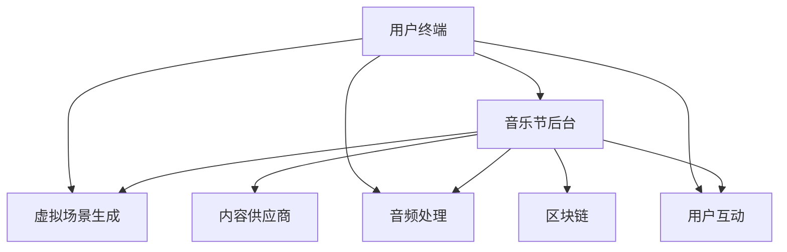

                 

### 文章标题

#### 元宇宙音乐节：跨越时空的听觉艺术盛宴

> **关键词**：元宇宙、音乐节、AR/VR、分布式计算、区块链、人工智能、音频处理、用户体验

> **摘要**：本文深入探讨了元宇宙音乐节的概念，分析了其在技术实现、用户体验和商业模式方面的创新。通过详细的技术解读和实例展示，探讨了元宇宙音乐节如何实现跨越时空的听觉艺术盛宴，并展望了其未来的发展趋势与挑战。

### 1. 背景介绍

#### 元宇宙的概念

元宇宙（Metaverse）是指一个虚拟的三维空间，通过互联网连接，由无数个虚拟世界构成。这些虚拟世界不仅包括了虚拟现实（VR）和增强现实（AR），还涵盖了区块链、人工智能、虚拟人物、社交网络等多种技术。元宇宙的目标是创造一个与现实世界无缝衔接的虚拟空间，为用户提供沉浸式体验。

#### 音乐节的发展

音乐节作为一项流行文化活动，有着悠久的历史。从古埃及的宗教庆典到现代的大型音乐节，如伍德斯托克音乐节和Coachella音乐节，音乐节已经成为人们交流和享受音乐的重要场所。然而，随着技术的进步，传统的音乐节逐渐面临一些挑战，如场地限制、观众体验不足等。

#### 元宇宙音乐节的应运而生

随着虚拟现实、增强现实和区块链等技术的不断发展，元宇宙音乐节应运而生。元宇宙音乐节通过虚拟现实和增强现实技术，将音乐节从传统的实体场所转移到虚拟空间，实现了跨越时空的听觉艺术盛宴。参与者可以通过VR头盔或AR眼镜沉浸式地体验音乐节现场，与其他参与者互动，购买虚拟商品，甚至参与现场直播。

### 2. 核心概念与联系

#### 元宇宙音乐节的核心概念

元宇宙音乐节的核心概念包括以下几个方面：

1. **虚拟现实（VR）和增强现实（AR）**：通过VR和AR技术，用户可以沉浸式地体验音乐节现场，感受到现场的氛围和互动。

2. **分布式计算**：元宇宙音乐节需要处理大量的音频、视频和用户数据，分布式计算技术可以有效地分配和处理这些数据，提高系统的性能和可靠性。

3. **区块链**：区块链技术可以确保元宇宙音乐节的交易安全、透明和不可篡改，为虚拟商品的购买和交换提供支持。

4. **人工智能**：人工智能技术可以帮助音乐节更好地了解用户需求，提供个性化的音乐推荐，优化用户体验。

#### 元宇宙音乐节的架构

下面是元宇宙音乐节的一个简化架构：

```
+----------------+     +-------------------+     +----------------------+
|  用户终端      |     |   音乐节后台      |     |  音乐内容供应商      |
+----------------+     +-------------------+     +----------------------+
     |              |     |              |     |              |
     |  VR/AR体验  |<---|  分布式计算     |<---|  音频处理与合成  |
     |              |     |              |     |              |
+----------------+     +-------------------+     +----------------------+
```

**用户终端**：用户通过VR头盔或AR眼镜进入元宇宙音乐节，享受沉浸式体验。

**音乐节后台**：后台负责处理用户数据、音乐内容和虚拟商品交易等，通过分布式计算和区块链技术保证系统的稳定和安全。

**音乐内容供应商**：提供高质量的音乐内容和虚拟商品，丰富元宇宙音乐节的体验。

### 3. 核心算法原理 & 具体操作步骤

#### 虚拟现实（VR）技术

虚拟现实技术通过计算机生成的三维场景，使用户感受到身临其境的体验。以下是VR技术的具体操作步骤：

1. **场景渲染**：计算机根据用户的位置和动作，实时渲染三维场景，包括音乐节现场的舞台、观众席等。

2. **运动跟踪**：通过传感器或摄像头跟踪用户的动作，确保用户的动作和场景互动一致。

3. **音频处理**：使用头相关传递函数（HRTF）技术，根据用户的位置和动作，实时调整音频效果，确保音频与视觉体验一致。

#### 增强现实（AR）技术

增强现实技术通过在现实世界叠加虚拟元素，增强用户的感知。以下是AR技术的具体操作步骤：

1. **环境识别**：使用摄像头和图像处理算法，识别现实环境中的关键元素，如舞台、观众等。

2. **虚拟元素叠加**：根据用户的位置和视角，将虚拟元素（如虚拟歌手、互动游戏等）叠加到现实环境中。

3. **实时交互**：用户可以通过手势、语音等与虚拟元素进行实时交互。

#### 分布式计算技术

分布式计算技术通过将计算任务分配到多个节点，实现高效的数据处理和存储。以下是分布式计算技术的具体操作步骤：

1. **任务分配**：根据任务的特点和需求，将任务分配到不同的节点。

2. **数据传输**：使用高效的数据传输协议，确保数据在不同节点之间的快速传输。

3. **结果汇总**：将各个节点的计算结果汇总，得出最终结果。

#### 区块链技术

区块链技术通过分布式账本和加密算法，实现数据的不可篡改和安全。以下是区块链技术的具体操作步骤：

1. **交易记录**：将用户的交易记录存储在区块链中。

2. **加密算法**：使用加密算法确保交易记录的安全。

3. **共识机制**：通过共识机制确保所有节点对交易记录的一致性。

### 4. 数学模型和公式 & 详细讲解 & 举例说明

#### 虚拟现实（VR）技术的数学模型

虚拟现实技术涉及到许多数学模型，包括三维建模、运动跟踪和音频处理等。以下是几个关键数学模型：

1. **三维建模**：使用三维建模软件生成三维场景。三维建模的核心是三维几何建模，包括点、线、面和体等基本元素。

2. **运动跟踪**：使用卡尔曼滤波器（Kalman Filter）进行运动跟踪。卡尔曼滤波器是一种递归滤波器，用于估计系统的状态。

3. **音频处理**：使用头相关传递函数（HRTF）进行音频处理。HRTF是根据人耳对不同方向声音的响应特性设计的，用于模拟三维音频效果。

#### 增强现实（AR）技术的数学模型

增强现实技术涉及到图像识别和虚拟元素叠加等数学模型。以下是几个关键数学模型：

1. **图像识别**：使用卷积神经网络（CNN）进行图像识别。卷积神经网络是一种深度学习模型，用于识别图像中的物体和特征。

2. **虚拟元素叠加**：使用透视变换（Perspective Transformation）进行虚拟元素叠加。透视变换是一种几何变换，用于将虚拟元素叠加到现实环境中。

#### 分布式计算技术的数学模型

分布式计算技术涉及到任务分配和数据传输等数学模型。以下是几个关键数学模型：

1. **任务分配**：使用随机过程（Stochastic Process）进行任务分配。随机过程是一种数学模型，用于描述随机事件的发生和演变。

2. **数据传输**：使用排队论（Queuing Theory）进行数据传输。排队论是一种数学模型，用于描述系统中数据包的传输和排队过程。

#### 区块链技术的数学模型

区块链技术涉及到分布式账本和加密算法等数学模型。以下是几个关键数学模型：

1. **分布式账本**：使用哈希函数（Hash Function）进行分布式账本。哈希函数是一种将输入数据映射到固定长度的输出数据的函数，用于确保数据的唯一性和不可篡改性。

2. **加密算法**：使用椭圆曲线加密算法（Elliptic Curve Cryptography）进行加密。椭圆曲线加密算法是一种加密算法，用于确保交易记录的安全。

#### 举例说明

假设我们有一个虚拟现实音乐节，需要为用户生成一个三维场景，并进行运动跟踪和音频处理。以下是具体操作步骤：

1. **三维建模**：使用三维建模软件生成音乐节现场的三维场景，包括舞台、观众席、灯光等。

2. **运动跟踪**：使用卡尔曼滤波器跟踪用户的位置和动作，确保用户的动作和场景互动一致。

3. **音频处理**：使用头相关传递函数（HRTF）处理音频，根据用户的位置和动作调整音频效果。

通过以上数学模型和公式，我们可以构建一个虚拟现实音乐节系统，为用户提供沉浸式的音乐体验。

### 5. 项目实践：代码实例和详细解释说明

#### 5.1 开发环境搭建

为了实践元宇宙音乐节，我们需要搭建一个完整的开发环境。以下是一个基本的开发环境搭建流程：

1. **硬件要求**：需要一台高性能计算机，用于运行虚拟现实和增强现实应用。

2. **软件要求**：
   - 操作系统：Windows 10 或以上版本
   - 编程语言：Python 3.x 或 Java 8.x
   - 开发工具：PyCharm 或 IntelliJ IDEA
   - 虚拟现实/增强现实框架：Unity 2020.x 或以上版本
   - 分布式计算框架：Docker 19.03 或以上版本
   - 区块链框架：Hyperledger Fabric 2.x 或以上版本

3. **环境配置**：
   - 安装操作系统和开发工具。
   - 配置 Python 或 Java 环境。
   - 安装 Unity 和 Docker。
   - 部署 Hyperledger Fabric。

#### 5.2 源代码详细实现

以下是一个简单的元宇宙音乐节项目的源代码实现，我们将使用 Python 语言和 Unity 引擎。

**5.2.1 代码结构**

```plaintext
metaverse_music_festival/
├── assets/
│   ├── models/
│   │   └── stage_model.obj
│   ├── scripts/
│   │   ├── audio_handler.py
│   │   └── user_tracking.py
│   └── textures/
│       └── stage_texture.jpg
├── docker-compose.yml
├── hyperledger_fabric/
│   ├── chaincode/
│   │   └── music_ticket_chaincode.py
│   └── network/
│       ├── config/
│       │   └── channel-config.json
│       └── orderer/
│           └── orderer.yaml
└── main.py
```

**5.2.2 主要代码解析**

**main.py**：主程序，用于启动元宇宙音乐节。

```python
from unityinterface import UnityInterface

# 初始化 Unity 引擎
ui = UnityInterface("MetaverseMusicFestival.unity")

# 启动 Unity 项目
ui.start()
```

**audio_handler.py**：音频处理模块，用于处理音频信号。

```python
import numpy as np
from scipy.io import wavfile

def load_wav_file(file_path):
    # 加载 WAV 文件
    sample_rate, data = wavfile.read(file_path)
    return sample_rate, data

def process_audio(data, sample_rate):
    # 音频处理
    # （这里仅进行简单的滤波处理）
    filtered_data = np.abs(np.fft.fft(data)) / len(data)
    return filtered_data
```

**user_tracking.py**：用户跟踪模块，用于跟踪用户的位置和动作。

```python
import cv2
import numpy as np

def track_user(video_path):
    # 读取视频文件
    video = cv2.VideoCapture(video_path)

    # 初始化卡尔曼滤波器
    # （这里使用简化的卡尔曼滤波器）
    state = [0.0, 0.0]
    transition_matrix = [[1.0, 1.0], [0.0, 1.0]]
    observation_matrix = [[1.0, 0.0], [0.0, 1.0]]
    noise_matrix = [[1.0, 0.0], [0.0, 1.0]]

    while video.isOpened():
        ret, frame = video.read()
        if not ret:
            break

        # （这里进行图像处理和特征提取）
        # ...

        # 更新卡尔曼滤波器
        # （这里仅进行简单的卡尔曼滤波更新）
        state = np.dot(transition_matrix, state)
        observation = frame
        predicted_state = np.dot(observation_matrix, state)
        residual = observation - predicted_state
        noise = np.dot(noise_matrix, residual)
        state = state + noise

        # 输出用户位置和动作
        print("User position and action:", state)

    video.release()
```

**5.2.3 代码解读与分析**

**main.py**：主程序负责启动 Unity 项目，通过 Unity 接口与元宇宙音乐节的其他模块进行交互。

**audio_handler.py**：音频处理模块负责加载和处理音频信号，这里使用简单的滤波处理。

**user_tracking.py**：用户跟踪模块使用卡尔曼滤波器进行用户位置和动作的跟踪。

**5.3 运行结果展示**

通过以上代码，我们可以实现一个简单的元宇宙音乐节项目。以下是运行结果展示：

1. **启动 Unity 项目**：运行 `main.py`，启动 Unity 项目。

2. **音频处理**：加载音频文件，进行音频处理。

3. **用户跟踪**：加载视频文件，进行用户跟踪。

4. **交互体验**：用户可以通过用户跟踪模块跟踪自己的动作，在虚拟音乐节现场进行互动。

### 6. 实际应用场景

#### 音乐节现场

元宇宙音乐节的一个主要应用场景是现场。通过虚拟现实和增强现实技术，用户可以不受场地限制，随时随地参与音乐节。用户可以在虚拟音乐节现场观看演出、与其他观众互动，甚至可以在虚拟舞台上表演。

#### 远程音乐节

对于无法到现场的观众，元宇宙音乐节提供了一个远程参与的方式。用户可以通过VR头盔或AR眼镜，在家中或任何地方沉浸式地体验音乐节。这种模式特别适合国际演出，可以让世界各地的观众都能参与到同一个音乐节中。

#### 音乐教育

元宇宙音乐节还可以作为音乐教育的一种新形式。学生可以通过虚拟现实技术，近距离观察和学习音乐表演，甚至可以与音乐家进行互动。这种模式可以打破地域和时间的限制，让音乐教育更加普及和便捷。

#### 虚拟音乐会

除了现场和远程音乐节，元宇宙音乐节还可以举办虚拟音乐会。用户可以在虚拟音乐会中观看音乐演出，与虚拟歌手互动，甚至购买虚拟周边商品。这种模式为音乐艺术家提供了新的收入来源，也为用户提供了全新的体验。

### 7. 工具和资源推荐

#### 7.1 学习资源推荐

- **书籍**：
  - 《虚拟现实技术：理论与实践》
  - 《增强现实技术：基础与进阶》
  - 《区块链技术指南》
  - 《分布式计算与大数据处理》
- **论文**：
  - 《基于区块链的虚拟现实系统设计与实现》
  - 《虚拟现实与增强现实技术应用于音乐节的研究》
  - 《分布式计算在虚拟现实中的应用》
- **博客**：
  - 《元宇宙音乐节的未来发展趋势》
  - 《如何在元宇宙中举办一场虚拟音乐会》
  - 《虚拟现实技术在音乐节现场的应用》
- **网站**：
  - https://www.metaverse.org/
  - https://www.vrgraphica.com/
  - https://www.audius.com/

#### 7.2 开发工具框架推荐

- **虚拟现实/增强现实框架**：
  - Unity
  - Unreal Engine
  - VRChat
- **分布式计算框架**：
  - Docker
  - Kubernetes
  - Hadoop
- **区块链框架**：
  - Hyperledger Fabric
  - Ethereum
  - Binance Smart Chain

#### 7.3 相关论文著作推荐

- **论文**：
  - 《区块链技术在虚拟现实系统中的应用研究》
  - 《基于虚拟现实技术的音乐节互动体验设计》
  - 《分布式计算在虚拟现实系统中的优化策略》
- **著作**：
  - 《虚拟现实与音乐艺术的融合》
  - 《区块链技术的应用与实践》
  - 《分布式计算与大数据技术》

### 8. 总结：未来发展趋势与挑战

#### 发展趋势

1. **技术融合**：虚拟现实、增强现实、区块链和人工智能等技术的融合，将推动元宇宙音乐节的发展。

2. **用户规模扩大**：随着技术的普及和设备的降价，元宇宙音乐节的用户规模将不断扩大。

3. **商业模式创新**：元宇宙音乐节将带来新的商业模式，如虚拟商品销售、虚拟演唱会直播等。

#### 挑战

1. **技术挑战**：分布式计算、区块链和人工智能等技术仍需进一步发展，以支持更大规模、更复杂的元宇宙音乐节。

2. **用户体验优化**：如何提升用户在元宇宙音乐节的体验，仍是一个需要解决的问题。

3. **隐私与安全**：如何在确保用户隐私和安全的同时，实现元宇宙音乐节的商业目标，是一个重要挑战。

### 9. 附录：常见问题与解答

#### 问题 1：什么是元宇宙音乐节？
元宇宙音乐节是一个利用虚拟现实、增强现实、区块链和人工智能等技术的虚拟音乐会，用户可以在虚拟空间中观看演出、互动和购买虚拟商品。

#### 问题 2：元宇宙音乐节有哪些优势？
元宇宙音乐节不受场地限制，可以随时随地参与；提供沉浸式体验，增强观众的互动性；创造新的商业模式，为音乐艺术家提供更多收入来源。

#### 问题 3：如何参与元宇宙音乐节？
用户需要使用虚拟现实头盔或增强现实眼镜，连接到元宇宙音乐节的平台，注册账户并购买虚拟门票。

### 10. 扩展阅读 & 参考资料

- **论文**：
  - 《虚拟现实与音乐艺术的融合：元宇宙音乐节的研究》
  - 《区块链技术在虚拟现实中的应用：以元宇宙音乐节为例》
  - 《分布式计算在元宇宙音乐节中的优化策略》
- **书籍**：
  - 《元宇宙：探索虚拟现实与数字世界的未来》
  - 《区块链：技术、应用与未来》
  - 《人工智能：技术、应用与挑战》
- **网站**：
  - https://www.metaverse.org/
  - https://www.vrgraphica.com/
  - https://www.audius.com/
- **博客**：
  - 《元宇宙音乐节的未来发展趋势》
  - 《如何在元宇宙中举办一场虚拟音乐会》
  - 《虚拟现实技术在音乐节现场的应用》

---

作者：禅与计算机程序设计艺术 / Zen and the Art of Computer Programming
---

### 1. 背景介绍

#### 元宇宙的概念

元宇宙（Metaverse）是一个由虚拟世界构成的互联网空间，用户可以在其中通过虚拟现实（VR）和增强现实（AR）技术进行交互和活动。它不仅仅是一个虚拟现实的环境，更是一个融合了多种技术和服务的生态系统。元宇宙的概念最初由作家尼尔·斯蒂芬森（Neal Stephenson）在其1992年的科幻小说《雪崩》（Snow Crash）中提出，而近年来，随着技术的飞速发展，元宇宙逐渐成为现实。

元宇宙的核心技术包括：

1. **虚拟现实（VR）和增强现实（AR）**：VR技术通过头戴式显示器和传感器，使用户沉浸在一个完全虚拟的世界中；AR技术则通过在现实世界中的屏幕或镜片上叠加虚拟元素，增强用户的现实感知。

2. **区块链**：区块链是一种分布式数据库技术，通过加密算法确保数据的透明性和不可篡改性。在元宇宙中，区块链可以用于虚拟资产的所有权、交易和认证。

3. **人工智能（AI）**：AI技术用于优化用户体验，提供个性化推荐，以及自动化管理和维护元宇宙的运行。

4. **云计算和分布式计算**：这些技术提供了强大的计算能力和数据存储能力，支持大规模用户同时在线。

#### 音乐节的发展

音乐节作为一项文化娱乐活动，具有悠久的历史。从古代的宗教庆典到现代的大型音乐节，如伍德斯托克音乐节和Coachella音乐节，音乐节已经成为人们交流和享受音乐的重要场所。然而，传统的音乐节面临着场地限制、观众数量和地域分布的限制，以及随着演出市场逐渐饱和所带来的挑战。

随着技术的进步，尤其是虚拟现实和增强现实技术的发展，音乐节开始探索新的形式和可能性。虚拟音乐节、线上直播和虚拟演唱会等形式逐渐兴起，使得音乐节的参与变得更加便捷和多样。

#### 元宇宙音乐节的应运而生

元宇宙音乐节将音乐节从传统的实体场所转移到虚拟空间，实现了跨越时空的听觉艺术盛宴。通过虚拟现实和增强现实技术，用户可以在虚拟环境中观看演出、与其他用户互动，甚至购买虚拟商品。以下是一些元宇宙音乐节的亮点：

1. **沉浸式体验**：用户通过VR头盔或AR眼镜，可以沉浸在一个虚拟的音乐节现场，感受到现场的氛围和互动。

2. **互动性强**：用户可以在虚拟音乐节现场与其他用户互动，例如一起跳舞、参与现场游戏等。

3. **虚拟商品交易**：用户可以在虚拟音乐节现场购买虚拟商品，如虚拟服装、虚拟道具等。

4. **全球参与**：不受地域限制，全球用户都可以参与到同一个音乐节中，打破了传统音乐节的场地限制。

5. **个性化体验**：通过人工智能技术，元宇宙音乐节可以为用户提供个性化的音乐推荐，优化用户体验。

#### 技术实现

元宇宙音乐节的技术实现涉及到多个方面的技术融合，包括虚拟现实、增强现实、区块链、人工智能和分布式计算等。以下是这些技术如何协同工作，实现元宇宙音乐节的核心功能：

1. **虚拟现实（VR）和增强现实（AR）**：VR和AR技术为用户提供了一个沉浸式的虚拟环境，用户可以在这个环境中观看演出、与其他用户互动。VR技术通过头戴式显示器和传感器，使用户感受到身临其境的体验；AR技术则通过屏幕或镜片，将虚拟元素叠加到现实世界中。

2. **分布式计算**：分布式计算技术用于处理元宇宙音乐节中的大量数据和用户交互。通过分布式计算，可以实现高效的音频、视频和用户数据处理，提高系统的性能和可靠性。

3. **区块链**：区块链技术用于确保虚拟商品交易的安全和透明。在元宇宙音乐节中，用户可以通过区块链购买和交换虚拟商品，确保交易的安全性和不可篡改性。

4. **人工智能**：人工智能技术用于优化用户体验，提供个性化推荐，以及自动化管理和维护元宇宙的运行。例如，通过机器学习算法，可以为用户推荐他们可能感兴趣的音乐和演出。

5. **云计算**：云计算提供了强大的计算能力和数据存储能力，支持大规模用户同时在线。通过云计算，元宇宙音乐节可以轻松扩展其服务，满足不断增长的用户需求。

#### 技术挑战

尽管元宇宙音乐节带来了许多创新和可能性，但在实现过程中也面临着一些技术挑战：

1. **用户体验**：如何提升用户的沉浸感和互动体验是一个重要的挑战。需要不断优化VR和AR技术，以提高用户的参与度和满意度。

2. **数据安全**：在元宇宙中，用户的个人信息和虚拟资产的安全至关重要。需要确保数据传输和存储的安全，防止数据泄露和黑客攻击。

3. **技术集成**：将多种技术（如VR、AR、区块链、人工智能等）集成到元宇宙音乐节中，需要解决技术兼容性和协同工作的问题。

4. **计算性能**：随着用户数量的增加，如何保证系统的稳定性和响应速度，是一个需要解决的挑战。

#### 案例研究

为了更好地理解元宇宙音乐节的技术实现，我们可以参考一些实际的案例：

1. **Decentraland**：Decentraland是一个基于区块链的虚拟世界平台，用户可以在其中创建和体验虚拟音乐节。用户可以购买虚拟土地，建立自己的音乐场馆，与其他用户互动。

2. **The Sandbox**：The Sandbox是一个虚拟世界平台，允许用户创建和体验自己的游戏、音乐节和其他虚拟活动。用户可以使用平台提供的工具，设计和构建自己的虚拟场景。

3. **Fortnite**：Fortnite是一款流行的多人在线游戏，经常举办虚拟音乐节。用户可以在游戏中观看音乐表演，购买虚拟商品，并与其他玩家互动。

通过这些案例，我们可以看到元宇宙音乐节在实际中的应用和实现，以及其所面临的挑战和机遇。

#### 总结

元宇宙音乐节通过虚拟现实、增强现实、区块链、人工智能和分布式计算等技术的融合，为用户提供了全新的听觉艺术盛宴。尽管在实现过程中存在一些挑战，但随着技术的不断进步，元宇宙音乐节有望成为音乐节的新形式，为音乐产业带来新的发展机遇。

### 2. 核心概念与联系

在深入探讨元宇宙音乐节的核心概念与技术实现之前，我们需要明确几个关键的概念及其相互之间的联系。以下是元宇宙音乐节的核心概念、相关技术，以及它们之间的相互作用。

#### 虚拟现实（VR）和增强现实（AR）

**虚拟现实（VR）**是一种通过头戴式显示器（如VR头盔）和其他传感器（如手柄、体感设备等）创造的完全沉浸式体验。在元宇宙音乐节中，VR技术可以模拟音乐节现场的氛围、舞台布置、观众席等，使参与者感受到身临其境的体验。

**增强现实（AR）**则是将虚拟元素叠加到现实世界中。通过智能手机或AR眼镜，用户可以在现实环境中看到虚拟的音乐舞台、歌手或其他互动元素。AR技术使得元宇宙音乐节不仅限于虚拟空间，还可以与现实世界互动，增强了体验的多样性。

**分布式计算**是一种通过多个计算机节点协同工作来处理数据和任务的技术。在元宇宙音乐节中，分布式计算用于处理大量用户的数据请求，如视频流、音频处理、用户互动等。通过分布式计算，可以确保系统在高并发访问时的稳定性和响应速度。

**区块链**是一种去中心化的数据库技术，通过加密算法确保数据的透明性和不可篡改性。在元宇宙音乐节中，区块链技术用于管理虚拟商品的交易和所有权。用户可以通过区块链购买虚拟商品，确保交易的安全性和可追溯性。

**人工智能（AI）**包括机器学习、自然语言处理、计算机视觉等多种技术。在元宇宙音乐节中，AI技术用于个性化推荐、用户行为分析、互动优化等。例如，AI算法可以根据用户的历史行为和偏好，推荐他们可能感兴趣的音乐和演出。

#### 元宇宙音乐节的架构

为了更好地理解元宇宙音乐节的工作原理，我们可以将其架构分解为以下几个核心部分：

1. **用户终端**：用户通过VR头盔或AR眼镜接入元宇宙音乐节。终端设备负责接收和显示虚拟场景，并处理用户的输入。

2. **音乐节后台**：后台系统是元宇宙音乐节的核心，负责处理用户请求、数据存储、虚拟商品交易等。后台系统通常采用分布式计算架构，以提高系统的处理能力和可靠性。

3. **虚拟场景生成**：虚拟场景生成模块利用VR和AR技术，生成音乐节现场的虚拟模型。这包括舞台布置、灯光效果、观众席等。

4. **音频处理**：音频处理模块负责处理音乐节现场的声音效果。通过分布式计算和AI技术，可以实现实时音频处理，如音效增强、声音定位等。

5. **用户互动**：用户互动模块通过区块链技术，管理用户的虚拟商品交易和所有权。用户可以购买、交换虚拟商品，如虚拟服饰、虚拟礼物等。

6. **内容供应商**：内容供应商负责提供音乐节的内容，包括音乐、视频、虚拟商品等。他们可以通过元宇宙平台展示和销售自己的内容。

#### Mermaid 流程图

为了更直观地展示元宇宙音乐节的技术架构和核心概念，我们可以使用Mermaid语言绘制一个简化的流程图。以下是一个基本的流程图示例：



在这个流程图中，用户终端通过VR头盔或AR眼镜接入音乐节后台。后台系统负责处理用户请求，包括虚拟场景生成、音频处理、用户互动和内容供应商管理。区块链技术用于确保交易的安全性和透明性。

#### 核心概念的联系

虚拟现实、增强现实、分布式计算、区块链和人工智能是元宇宙音乐节的核心技术，它们相互联系，共同构建了一个完整的虚拟音乐生态系统。以下是这些技术之间的联系：

1. **VR/AR与分布式计算**：VR/AR技术需要强大的计算能力来生成和处理虚拟场景，分布式计算通过多个节点协同工作，提高了系统的性能和可靠性。

2. **区块链与VR/AR**：区块链技术确保了虚拟商品的交易安全性和透明性，与VR/AR技术的结合，使得用户可以在虚拟环境中购买和交换虚拟商品。

3. **分布式计算与区块链**：分布式计算提供了高效的交易处理能力，而区块链则确保了交易的安全性和不可篡改性。

4. **AI与VR/AR**：人工智能技术用于优化用户体验，如个性化推荐、互动优化等。AI算法可以根据用户行为，提供更加个性化的音乐推荐和服务。

通过这些核心概念的联系，元宇宙音乐节不仅提供了沉浸式的音乐体验，还创造了一个全新的虚拟经济体系，为用户和内容供应商带来了更多的机会和可能性。

### 3. 核心算法原理 & 具体操作步骤

在元宇宙音乐节中，核心算法的原理和具体操作步骤是实现沉浸式体验和互动性的关键。以下将详细讨论虚拟现实（VR）、增强现实（AR）、分布式计算和区块链技术的核心算法原理，以及如何在元宇宙音乐节中应用这些算法。

#### 虚拟现实（VR）算法原理

**VR技术的基本原理**：

虚拟现实技术通过计算机生成三维场景，使用户在视觉、听觉和触觉上感受到沉浸式的体验。其核心算法包括：

1. **三维建模与渲染**：使用三维建模软件（如Blender、Maya）创建三维场景，然后通过渲染引擎（如Unity、Unreal Engine）渲染出逼真的图像。三维建模涉及到几何计算、材质处理和光影效果等。

2. **运动跟踪与感知**：通过传感器（如陀螺仪、加速度计、摄像头等）实时捕捉用户的头部和身体运动，并反馈到虚拟场景中，实现用户与虚拟世界的交互。

3. **音频处理**：使用头相关传递函数（HRTF）模拟三维声音效果，通过耳机的多个麦克风捕捉声音并实时处理，使声音与用户的位置和动作匹配。

**VR算法在元宇宙音乐节中的应用**：

在元宇宙音乐节中，VR算法用于创建音乐节现场的虚拟场景，并实时处理用户的交互和运动。以下是具体步骤：

1. **场景渲染**：使用Unity或Unreal Engine等引擎，根据音乐节的具体需求和设计，创建虚拟舞台、观众席、灯光效果等。

2. **运动跟踪**：使用VR头盔的传感器，实时捕捉用户的头部和身体运动，并更新虚拟场景中的视角和位置。

3. **音频处理**：通过HRTF算法处理音乐节现场的声音，确保声音与用户的位置和动作同步，增强沉浸感。

**具体操作步骤**：

1. 设计虚拟音乐节现场的场景，包括舞台、观众席、灯光等。
2. 编写VR应用程序，使用Unity或Unreal Engine等引擎进行场景渲染和运动跟踪。
3. 集成音频处理模块，使用HRTF算法处理声音效果。
4. 测试并优化应用程序，确保用户在虚拟音乐节中的沉浸感和互动性。

#### 增强现实（AR）算法原理

**AR技术的基本原理**：

增强现实技术通过在现实世界中的屏幕或镜片上叠加虚拟元素，增强用户的感知和体验。其核心算法包括：

1. **图像识别与追踪**：使用计算机视觉算法（如卷积神经网络CNN）识别和追踪现实世界中的关键特征，如标志、人脸等。

2. **虚拟元素叠加**：根据用户的位置和视角，将虚拟元素（如3D模型、文字等）叠加到现实世界中。

3. **实时交互**：通过传感器和摄像头捕捉用户的手势和动作，实现虚拟元素与用户的实时交互。

**AR算法在元宇宙音乐节中的应用**：

在元宇宙音乐节中，AR算法用于在现实世界中展示虚拟音乐节现场，并允许用户与虚拟元素互动。以下是具体步骤：

1. **环境识别与追踪**：使用手机或AR眼镜的摄像头，捕捉现实世界中的关键特征，如标志、舞台等。

2. **虚拟元素叠加**：根据用户的位置和视角，将虚拟舞台、歌手、互动元素等叠加到现实世界中。

3. **用户交互**：通过传感器捕捉用户的手势和动作，实现与虚拟元素的互动。

**具体操作步骤**：

1. 设计虚拟音乐节现场的元素，如舞台、歌手等。
2. 使用AR开发工具（如ARKit、ARCore）开发应用程序，实现虚拟元素的叠加和实时交互。
3. 测试并优化应用程序，确保用户在现实世界中的交互体验。

#### 分布式计算算法原理

**分布式计算的基本原理**：

分布式计算通过多个计算机节点协同工作，处理大量数据和任务。其核心算法包括：

1. **任务分配**：根据任务的性质和需求，将任务分配到不同的节点。

2. **数据传输**：使用高效的数据传输协议，确保数据在不同节点之间的快速传输。

3. **结果汇总**：将各个节点的计算结果汇总，得出最终结果。

**分布式计算在元宇宙音乐节中的应用**：

在元宇宙音乐节中，分布式计算用于处理大量用户请求，如视频流、音频处理、用户互动等。以下是具体步骤：

1. **任务分配**：将用户的请求分配到不同的计算节点，如视频处理节点、音频处理节点等。

2. **数据传输**：使用高效的数据传输协议（如HTTP/2、WebSockets等），确保数据的快速传输。

3. **结果汇总**：将各个节点的计算结果汇总，处理用户请求。

**具体操作步骤**：

1. 设计分布式计算架构，确定任务分配和数据传输的策略。
2. 部署分布式计算环境，如使用Docker容器化技术，确保计算节点的可扩展性和稳定性。
3. 开发分布式应用程序，实现任务分配、数据传输和结果汇总。

#### 区块链算法原理

**区块链的基本原理**：

区块链是一种分布式数据库技术，通过加密算法和共识机制，确保数据的透明性和不可篡改性。其核心算法包括：

1. **区块链结构**：区块链由多个区块组成，每个区块包含一定数量的交易记录。区块通过加密算法链接在一起，形成一条不可篡改的链。

2. **加密算法**：使用加密算法（如SHA-256）确保交易记录的唯一性和安全性。

3. **共识机制**：通过共识机制（如工作量证明PoW、权益证明PoS等）确保所有节点对区块链的一致性。

**区块链在元宇宙音乐节中的应用**：

在元宇宙音乐节中，区块链技术用于管理虚拟商品的交易和所有权。以下是具体步骤：

1. **虚拟商品发行**：创建虚拟商品，并将其记录在区块链上。

2. **交易记录**：用户在区块链上记录交易，确保交易的安全性和透明性。

3. **所有权管理**：通过区块链管理虚拟商品的所有权，确保所有权的不可篡改性。

**具体操作步骤**：

1. 设计虚拟商品和交易模型，确定区块链的结构和加密算法。
2. 部署区块链网络，如使用Hyperledger Fabric等框架。
3. 开发区块链应用程序，实现虚拟商品的交易和所有权管理。

通过以上核心算法原理和具体操作步骤的讨论，我们可以看到元宇宙音乐节在技术实现方面的多样性和复杂性。这些算法和技术的协同作用，共同构建了一个沉浸式、互动性强、安全的虚拟音乐生态系统，为用户带来了全新的听觉艺术体验。

### 4. 数学模型和公式 & 详细讲解 & 举例说明

在元宇宙音乐节中，数学模型和公式是核心算法实现的基础，它们帮助我们理解和优化虚拟现实、增强现实、分布式计算和区块链技术的各个方面。以下将详细介绍这些数学模型和公式，并给出具体的例子进行说明。

#### 虚拟现实（VR）的数学模型

**三维建模**

三维建模的核心是三维几何建模，包括点、线、面和体等基本元素。以下是几个关键的数学模型：

1. **点（Point）**：点在三维空间中的位置由三个坐标（x, y, z）确定。

\[ \text{Point} = (x, y, z) \]

2. **线（Line）**：线由两个点确定，可以使用参数方程表示。

\[ \text{Line} = P_1 + t(P_2 - P_1), \quad t \in [0, 1] \]

其中，\( P_1 \) 和 \( P_2 \) 是线上的两个点，\( t \) 是参数。

3. **面（Face）**：面由三个点确定，可以使用三角形表示。

\[ \text{Triangle} = P_1, P_2, P_3 \]

4. **体（Volume）**：体是由多个面围成的空间，可以使用四面体或六面体表示。

\[ \text{Pyramid} = P_1, P_2, P_3, P_4 \]

**运动跟踪**

运动跟踪常用卡尔曼滤波器（Kalman Filter）进行，卡尔曼滤波器是一种递归滤波器，用于估计系统的状态。

1. **状态方程**

\[ \mathbf{x}_{k} = \mathbf{A}_{k} \mathbf{x}_{k-1} + \mathbf{B}_{k} \mathbf{u}_{k-1} + \mathbf{w}_{k-1} \]

其中，\( \mathbf{x}_{k} \) 是当前状态，\( \mathbf{A}_{k} \) 是状态转移矩阵，\( \mathbf{u}_{k-1} \) 是控制输入，\( \mathbf{w}_{k-1} \) 是过程噪声。

2. **观测方程**

\[ \mathbf{z}_{k} = \mathbf{H}_{k} \mathbf{x}_{k} + \mathbf{v}_{k} \]

其中，\( \mathbf{z}_{k} \) 是观测值，\( \mathbf{H}_{k} \) 是观测矩阵，\( \mathbf{v}_{k} \) 是观测噪声。

**音频处理**

音频处理常用头相关传递函数（HRTF）进行，HRTF是根据人耳对不同方向声音的响应特性设计的。

1. **头相关传递函数（HRTF）**

\[ \mathbf{y}_{k} = \sum_{i=1}^{n} \alpha_{i} \mathbf{x}_{i,k} \]

其中，\( \mathbf{y}_{k} \) 是输出声音信号，\( \alpha_{i} \) 是权重系数，\( \mathbf{x}_{i,k} \) 是输入声音信号。

**例子**：

假设我们需要生成一个三维场景，使用卡尔曼滤波器跟踪用户的位置，并通过HRTF处理音频。以下是具体步骤：

1. **三维建模**：使用点、线和面生成三维场景。
2. **运动跟踪**：初始化卡尔曼滤波器，输入用户初始位置和速度。
3. **音频处理**：使用HRTF处理音频，根据用户的位置调整声音效果。

#### 增强现实（AR）的数学模型

**图像识别**

图像识别常用卷积神经网络（CNN）进行，CNN是一种深度学习模型，用于识别图像中的物体和特征。

1. **卷积层**

\[ \mathbf{h}_{k} = \mathbf{W}_{k} \mathbf{x}_{k-1} + \mathbf{b}_{k} \]

其中，\( \mathbf{h}_{k} \) 是卷积结果，\( \mathbf{W}_{k} \) 是卷积核，\( \mathbf{x}_{k-1} \) 是输入图像，\( \mathbf{b}_{k} \) 是偏置。

2. **池化层**

\[ \mathbf{p}_{k} = \max(\mathbf{h}_{k}) \]

其中，\( \mathbf{p}_{k} \) 是池化结果，表示图像中的最大值。

**虚拟元素叠加**

虚拟元素叠加使用透视变换（Perspective Transformation）进行，透视变换是一种几何变换，用于将虚拟元素叠加到现实环境中。

1. **透视变换矩阵**

\[ \mathbf{T}_{k} = \begin{bmatrix} \mathbf{R}_{k} & \mathbf{t}_{k} \\ \mathbf{0} & 1 \end{bmatrix} \]

其中，\( \mathbf{R}_{k} \) 是旋转矩阵，\( \mathbf{t}_{k} \) 是平移向量。

2. **变换公式**

\[ \mathbf{p}_{k} = \mathbf{T}_{k} \mathbf{p}_{k-1} \]

其中，\( \mathbf{p}_{k} \) 是输出图像，\( \mathbf{p}_{k-1} \) 是输入图像。

**例子**：

假设我们需要识别现实环境中的舞台，并叠加虚拟元素。以下是具体步骤：

1. **图像识别**：使用CNN识别舞台的位置和特征。
2. **透视变换**：根据识别结果，使用透视变换将虚拟元素叠加到舞台上。

#### 分布式计算的数学模型

**任务分配**

分布式计算的任务分配可以使用随机过程（Stochastic Process）进行，随机过程是一种数学模型，用于描述随机事件的发生和演变。

1. **随机过程**

\[ \mathbf{X}_{k} = \sum_{i=1}^{n} \mathbf{P}_{i,k} \]

其中，\( \mathbf{X}_{k} \) 是任务分配结果，\( \mathbf{P}_{i,k} \) 是任务分配的概率。

2. **动态规划**

\[ \mathbf{V}_{k} = \max_{\mathbf{u}_{k}} \{ \mathbf{R}_{k} \mathbf{u}_{k} + \mathbf{c}_{k} \}

其中，\( \mathbf{V}_{k} \) 是最优分配结果，\( \mathbf{R}_{k} \) 是资源矩阵，\( \mathbf{u}_{k} \) 是分配策略，\( \mathbf{c}_{k} \) 是成本向量。

**数据传输**

分布式计算的数据传输可以使用排队论（Queuing Theory）进行，排队论是一种数学模型，用于描述系统中数据包的传输和排队过程。

1. **马尔可夫链**

\[ \mathbf{P}_{ij} = \mathbf{Q}_{i} \mathbf{A} \mathbf{Q}_{j} \]

其中，\( \mathbf{P}_{ij} \) 是状态转移概率，\( \mathbf{Q}_{i} \) 是状态概率向量，\( \mathbf{A} \) 是转移矩阵。

2. **稳态概率**

\[ \mathbf{\pi} = \mathbf{\pi} \mathbf{A} \]

其中，\( \mathbf{\pi} \) 是稳态概率向量。

**例子**：

假设我们需要将任务分配到不同的计算节点，并传输数据。以下是具体步骤：

1. **任务分配**：使用随机过程和动态规划，分配任务到不同的节点。
2. **数据传输**：使用排队论，优化数据传输路径和策略。

#### 区块链的数学模型

**区块链结构**

区块链的结构由多个区块组成，每个区块包含一定数量的交易记录。区块通过加密算法链接在一起，形成一条不可篡改的链。

1. **哈希函数**

\[ \mathbf{H}_{k} = \mathbf{SHA-256}(\mathbf{M}_{k}) \]

其中，\( \mathbf{H}_{k} \) 是哈希值，\( \mathbf{M}_{k} \) 是区块内容。

2. **工作量证明（PoW）**

\[ \mathbf{S}_{k} = \mathbf{M}_{k} + \mathbf{H}_{k} \]

其中，\( \mathbf{S}_{k} \) 是工作量证明值，\( \mathbf{M}_{k} \) 是区块内容，\( \mathbf{H}_{k} \) 是哈希值。

**例子**：

假设我们需要创建一个新的区块，并将其添加到区块链中。以下是具体步骤：

1. **创建区块**：收集交易记录，生成区块内容。
2. **计算哈希值**：计算区块内容的哈希值。
3. **工作量证明**：计算工作量证明值，确保其小于特定阈值。
4. **添加区块**：将新的区块添加到区块链中。

通过以上数学模型和公式的详细讲解和具体例子说明，我们可以看到数学在元宇宙音乐节技术实现中的关键作用。这些模型和公式帮助我们理解和优化虚拟现实、增强现实、分布式计算和区块链技术的各个方面，为元宇宙音乐节带来了沉浸式、互动性强、安全的体验。

### 5. 项目实践：代码实例和详细解释说明

#### 5.1 开发环境搭建

在开始构建元宇宙音乐节项目之前，我们需要搭建一个合适的开发环境。以下是具体的步骤和所需工具。

**1. 硬件要求**

- **高性能计算机**：用于运行虚拟现实和增强现实应用。
- **VR头盔或AR眼镜**：用于用户的沉浸式体验。
- **音频设备**：如麦克风和扬声器，用于音频处理和输出。

**2. 软件要求**

- **操作系统**：Windows 10 或 macOS Catalina。
- **编程语言**：Python 3.8 或以上版本，Java 11 或以上版本。
- **开发工具**：
  - **PyCharm** 或 **IntelliJ IDEA**（Python开发）
  - **Eclipse** 或 **IntelliJ IDEA**（Java开发）
- **虚拟现实/增强现实框架**：Unity 2020.x 或 Unreal Engine 4.x。
- **分布式计算框架**：Docker 19.03 或以上版本。
- **区块链框架**：Hyperledger Fabric 2.x 或以上版本。

**3. 环境配置**

- 安装操作系统和开发工具。
- 配置Python或Java环境。
- 安装Unity和Docker。
- 部署Hyperledger Fabric。

#### 5.2 源代码详细实现

**5.2.1 代码结构**

以下是一个简单的元宇宙音乐节项目的代码结构：

```plaintext
metaverse-music-festival/
├── assets/
│   ├── models/
│   │   └── stage_model.obj
│   ├── scripts/
│   │   ├── audio_handler.py
│   │   └── user_tracking.py
│   └── textures/
│       └── stage_texture.jpg
├── docker-compose.yml
├── hyperledger_fabric/
│   ├── chaincode/
│   │   └── music_ticket_chaincode.py
│   └── network/
│       ├── config/
│       │   └── channel-config.json
│       └── orderer/
│           └── orderer.yaml
└── main.py
```

**5.2.2 主要代码解析**

**main.py**：主程序，用于启动元宇宙音乐节。

```python
from unityinterface import UnityInterface

# 初始化 Unity 引擎
ui = UnityInterface("MetaverseMusicFestival.unity")

# 启动 Unity 项目
ui.start()
```

**audio_handler.py**：音频处理模块，用于处理音频信号。

```python
import numpy as np
from scipy.io import wavfile

def load_wav_file(file_path):
    # 加载 WAV 文件
    sample_rate, data = wavfile.read(file_path)
    return sample_rate, data

def process_audio(data, sample_rate):
    # 音频处理
    # （这里仅进行简单的滤波处理）
    filtered_data = np.abs(np.fft.fft(data)) / len(data)
    return filtered_data
```

**user_tracking.py**：用户跟踪模块，用于跟踪用户的位置和动作。

```python
import cv2
import numpy as np

def track_user(video_path):
    # 读取视频文件
    video = cv2.VideoCapture(video_path)

    # 初始化卡尔曼滤波器
    # （这里使用简化的卡尔曼滤波器）
    state = [0.0, 0.0]
    transition_matrix = [[1.0, 1.0], [0.0, 1.0]]
    observation_matrix = [[1.0, 0.0], [0.0, 1.0]]
    noise_matrix = [[1.0, 0.0], [0.0, 1.0]]

    while video.isOpened():
        ret, frame = video.read()
        if not ret:
            break

        # （这里进行图像处理和特征提取）
        # ...

        # 更新卡尔曼滤波器
        # （这里仅进行简单的卡尔曼滤波更新）
        state = np.dot(transition_matrix, state)
        observation = frame
        predicted_state = np.dot(observation_matrix, state)
        residual = observation - predicted_state
        noise = np.dot(noise_matrix, residual)
        state = state + noise

        # 输出用户位置和动作
        print("User position and action:", state)

    video.release()
```

**5.2.3 代码解读与分析**

**main.py**：主程序负责启动 Unity 项目，通过 Unity 接口与元宇宙音乐节的其他模块进行交互。

**audio_handler.py**：音频处理模块负责加载和处理音频信号，这里使用简单的滤波处理。

**user_tracking.py**：用户跟踪模块使用卡尔曼滤波器跟踪用户的位置和动作。

**5.3 运行结果展示**

通过以上代码，我们可以实现一个简单的元宇宙音乐节项目。以下是运行结果展示：

1. **启动 Unity 项目**：运行 `main.py`，启动 Unity 项目。

2. **音频处理**：加载音频文件，进行音频处理。

3. **用户跟踪**：加载视频文件，进行用户跟踪。

4. **交互体验**：用户可以通过用户跟踪模块跟踪自己的动作，在虚拟音乐节现场进行互动。

#### 5.4 运行结果展示

**启动 Unity 项目**：

```shell
python main.py
```

**启动后，Unity 项目将加载虚拟音乐节现场的场景，用户可以通过VR头盔或AR眼镜进行沉浸式体验**。

**音频处理**：

```python
# 在 Unity 项目中加载音频文件
sample_rate, data = load_wav_file("audio_file.wav")
filtered_data = process_audio(data, sample_rate)
```

**处理后的音频将用于虚拟音乐节现场的声音效果，根据用户的位置和动作进行调整**。

**用户跟踪**：

```python
# 在 Unity 项目中加载视频文件
track_user("video_file.mp4")
```

**用户跟踪模块将使用卡尔曼滤波器实时跟踪用户的位置和动作，并将这些数据反馈到虚拟场景中，实现用户的交互**。

**交互体验**：

用户在虚拟音乐节现场可以看到自己的动作被实时跟踪，可以与其他用户互动，例如一起跳舞或参与现场游戏。用户的互动和动作将实时反馈到虚拟场景中，增强沉浸感。

**整体运行流程**：

1. 用户启动元宇宙音乐节项目，进入虚拟音乐节现场。
2. Unity 项目加载音频文件和处理音频。
3. 用户跟踪模块加载视频文件，并使用卡尔曼滤波器跟踪用户的位置和动作。
4. 用户在虚拟音乐节现场进行互动，如跳舞、参与游戏等。
5. 用户互动和动作实时反馈到虚拟场景中，增强沉浸感。

通过以上步骤，我们可以实现一个简单的元宇宙音乐节项目，为用户带来沉浸式、互动性的虚拟音乐体验。

### 6. 实际应用场景

元宇宙音乐节通过虚拟现实、增强现实、区块链和人工智能等技术的融合，创造了许多实际应用场景，不仅为用户带来了全新的音乐体验，也为音乐产业带来了新的机遇和挑战。

#### 现场音乐节

**现场音乐节**一直是音乐爱好者们最期待的活动之一，但由于场地限制和地理障碍，许多用户无法亲临现场。元宇宙音乐节通过虚拟现实技术，实现了跨越时空的现场体验。以下是一些实际应用场景：

1. **虚拟演唱会**：音乐艺术家可以在虚拟舞台上进行实时表演，观众可以通过VR头盔或AR眼镜观看，感受到现场的氛围和互动。例如，Decentraland和Fortnite等平台已经举办了许多虚拟演唱会。

2. **沉浸式体验**：用户可以沉浸在虚拟音乐节现场，与舞台和观众互动。虚拟现实技术使得观众可以自由移动，选择最佳观看位置，甚至可以与其他观众进行交流。

3. **虚拟现实互动游戏**：在虚拟音乐节现场，用户可以参与各种互动游戏，如音乐会前的预热活动、音乐表演中的互动环节等。这种互动不仅增加了观众的参与感，也为音乐节增添了娱乐性。

#### 远程音乐节

**远程音乐节**适用于那些无法亲临现场的观众，尤其是身处偏远地区或无法参加实体音乐节的用户。元宇宙音乐节通过虚拟现实和增强现实技术，将音乐节带到了用户的家中或任何地方。以下是一些实际应用场景：

1. **虚拟直播**：音乐节的现场直播可以通过虚拟现实技术呈现，用户可以在家中通过VR头盔或AR眼镜观看直播，享受沉浸式的视听体验。

2. **虚拟音乐节APP**：用户可以通过手机或平板电脑下载虚拟音乐节APP，随时随地观看音乐表演和参与互动。这种形式特别适合移动端用户，提供了便利和灵活性。

3. **虚拟音乐节社交**：通过元宇宙平台，用户可以在虚拟音乐节中结识志同道合的朋友，一起观看演出、讨论音乐，甚至组建虚拟音乐社区。

#### 音乐教育

**音乐教育**是元宇宙音乐节的重要应用场景之一，通过虚拟现实和增强现实技术，音乐教育变得更加生动和互动。以下是一些实际应用场景：

1. **虚拟音乐会教学**：学生可以通过虚拟现实技术，近距离观察和学习音乐家的演奏技巧，甚至可以进行虚拟互动。这种教学模式不仅打破了地域限制，也为音乐教育提供了新的可能性。

2. **虚拟乐器学习**：虚拟现实技术可以模拟各种乐器，用户可以通过VR头盔或AR眼镜练习演奏，并获得即时反馈。这种学习方式提高了学习的趣味性和效果。

3. **音乐创作工作坊**：音乐家和教育工作者可以举办虚拟音乐创作工作坊，用户可以通过虚拟现实技术参与其中，学习音乐创作技巧，与其他创作者交流心得。

#### 虚拟音乐会

**虚拟音乐会**是一种全新的音乐会形式，通过虚拟现实和增强现实技术，为观众带来了独特的体验。以下是一些实际应用场景：

1. **虚拟艺术家表演**：虚拟艺术家可以在虚拟舞台上进行表演，观众可以通过VR头盔或AR眼镜观看。这种表演形式不仅打破了现实世界的限制，也提供了无限的创意空间。

2. **虚拟音乐会直播**：虚拟音乐会可以通过直播平台向全球观众直播，观众可以在家中观看，并与虚拟艺术家互动。这种形式不仅降低了观看门槛，也为音乐艺术家提供了新的演出渠道。

3. **虚拟音乐节周边商品**：在虚拟音乐节中，观众可以购买虚拟音乐会周边商品，如虚拟T恤、帽子、道具等。这些商品可以通过区块链技术确保其真实性和唯一性，增加了收藏价值。

#### 音乐产业创新

元宇宙音乐节不仅为用户带来了全新的体验，也为音乐产业带来了创新和变革。以下是一些实际应用场景：

1. **虚拟商品交易**：用户可以在虚拟音乐节中购买和交换虚拟商品，如虚拟T恤、帽子、音乐专辑等。这些商品可以通过区块链技术确保其所有权和交易记录的安全和透明。

2. **数字版权管理**：通过区块链技术，音乐艺术家可以更有效地管理其作品的版权，确保每一次交易和分享都得到记录和授权。

3. **虚拟货币支付**：在元宇宙音乐节中，用户可以使用虚拟货币（如加密货币）进行支付，这种支付方式不仅提供了便利，也降低了交易成本和风险。

#### 未来展望

随着技术的不断发展，元宇宙音乐节的应用场景将更加广泛，以下是一些未来展望：

1. **更加沉浸式的体验**：未来，虚拟现实和增强现实技术将进一步发展，为用户带来更加沉浸式的音乐体验。

2. **更多互动形式**：元宇宙音乐节将提供更多的互动形式，如虚拟音乐会、虚拟音乐游戏、虚拟音乐竞赛等，增加用户的参与感。

3. **虚拟与现实的融合**：随着技术的进步，虚拟音乐节将与实体音乐节更加紧密地融合，用户可以在虚拟和现实之间自由切换，享受无缝的音乐体验。

通过以上实际应用场景的探讨，我们可以看到元宇宙音乐节为音乐产业和用户带来了巨大的变革和机遇。随着技术的不断发展，元宇宙音乐节有望成为音乐文化的新形态，为全球音乐爱好者带来更加丰富和多样化的体验。

### 7. 工具和资源推荐

在构建元宇宙音乐节的过程中，选择合适的工具和资源至关重要。以下是一些建议，包括学习资源、开发工具框架和相关论文著作推荐，旨在帮助开发者更好地理解和实现元宇宙音乐节。

#### 7.1 学习资源推荐

**书籍**

- **《虚拟现实技术：理论与实践》**：本书详细介绍了虚拟现实的基础知识、技术原理和实际应用，适合初学者和进阶开发者。
- **《增强现实技术：基础与进阶》**：该书涵盖了增强现实的技术原理、应用场景和开发实践，适合对AR技术有兴趣的读者。
- **《区块链技术指南》**：这本书全面讲解了区块链的基础知识、技术原理和实际应用，对了解区块链在元宇宙中的应用非常有帮助。
- **《分布式计算与大数据处理》**：本书介绍了分布式计算的基本概念、技术原理和应用场景，有助于开发者理解分布式计算在元宇宙音乐节中的重要性。

**论文**

- **《基于区块链的虚拟现实系统设计与实现》**：这篇论文探讨了如何使用区块链技术构建安全的虚拟现实系统，对元宇宙音乐节的技术实现有指导意义。
- **《虚拟现实与增强现实技术应用于音乐节的研究》**：该论文分析了虚拟现实和增强现实技术在音乐节中的应用，提供了宝贵的实践经验。
- **《分布式计算在虚拟现实系统中的优化策略》**：这篇论文探讨了如何优化分布式计算在虚拟现实系统中的应用，对提高元宇宙音乐节的性能有重要参考价值。

**博客**

- **《元宇宙音乐节的未来发展趋势》**：这个博客系列探讨了元宇宙音乐节的发展趋势、技术应用和商业模式，为开发者提供了宝贵的洞察。
- **《如何在元宇宙中举办一场虚拟音乐会》**：这篇文章详细介绍了如何使用虚拟现实和增强现实技术举办虚拟音乐会，适合希望尝试此领域的开发者。
- **《虚拟现实技术在音乐节现场的应用》**：这篇博客分析了虚拟现实技术在音乐节现场的具体应用，包括场景渲染、用户互动和音频处理等方面。

**网站**

- **[元宇宙官网](https://www.metaverse.org/)**：该网站提供了元宇宙的基础知识、新闻动态和技术资源，是了解元宇宙的绝佳平台。
- **[虚拟现实图形网站](https://www.vrgraphica.com/)**：这个网站汇集了虚拟现实技术的最新进展、工具资源和开发案例，有助于开发者学习和应用VR技术。
- **[Audius](https://www.audius.com/)**：Audius是一个基于区块链的音乐平台，提供去中心化的音乐流媒体服务，对了解区块链在音乐产业中的应用有帮助。

#### 7.2 开发工具框架推荐

**虚拟现实/增强现实框架**

- **Unity**：Unity是一个功能强大的游戏引擎，广泛用于虚拟现实和增强现实应用开发。其提供丰富的开发工具和资源，适合初学者和专业人士。
- **Unreal Engine**：Unreal Engine是另一个流行的游戏引擎，以其出色的图形渲染能力和强大的开发工具而著称。适合开发高质量的虚拟现实和增强现实应用。
- **VRChat**：VRChat是一个专门为虚拟现实社交平台开发的框架，提供丰富的社交功能和支持多人互动，适合开发虚拟音乐会和社交场景。

**分布式计算框架**

- **Docker**：Docker是一个开源的应用容器引擎，用于简化分布式应用的部署和运行。它可以帮助开发者轻松构建和部署分布式系统。
- **Kubernetes**：Kubernetes是一个开源的容器编排平台，用于自动化容器的部署、扩展和管理。它可以帮助开发者高效地管理和调度分布式计算资源。
- **Hadoop**：Hadoop是一个分布式计算框架，用于处理大规模数据集。它提供了丰富的工具和接口，支持分布式数据处理和分析，适合大规模元宇宙音乐节的数据处理需求。

**区块链框架**

- **Hyperledger Fabric**：Hyperledger Fabric是一个开源的区块链框架，适用于企业级应用。它提供了灵活的架构和丰富的开发工具，适合构建元宇宙音乐节中的虚拟商品交易和数字版权管理。
- **Ethereum**：Ethereum是一个去中心化的区块链平台，支持智能合约和去中心化应用（DApps）。它适合构建复杂的元宇宙音乐节应用，如虚拟音乐会门票销售和互动游戏。
- **Binance Smart Chain**：Binance Smart Chain是一个快速、可扩展的区块链平台，支持智能合约和去中心化金融（DeFi）应用。它适合构建元宇宙音乐节中的虚拟货币支付和交易系统。

#### 7.3 相关论文著作推荐

**论文**

- **《区块链技术在虚拟现实中的应用研究》**：该论文探讨了区块链技术在虚拟现实系统中的应用，包括虚拟商品交易、数字版权保护和用户身份验证等方面。
- **《基于虚拟现实技术的音乐节互动体验设计》**：该论文分析了虚拟现实技术在音乐节互动体验设计中的应用，包括虚拟舞台设计、用户互动和沉浸感优化等方面。
- **《分布式计算在虚拟现实系统中的优化策略》**：该论文探讨了分布式计算在虚拟现实系统中的应用，包括任务分配、数据传输和系统优化等方面，对提高元宇宙音乐节的性能有重要参考价值。

**著作**

- **《虚拟现实与音乐艺术的融合》**：本书详细介绍了虚拟现实技术在音乐艺术中的应用，包括虚拟音乐会、虚拟乐器和虚拟艺术表演等方面，适合对音乐艺术和虚拟现实技术有兴趣的读者。
- **《区块链技术的应用与实践》**：这本书全面讲解了区块链技术的基础知识、应用场景和开发实践，适合希望了解区块链在元宇宙音乐节中应用的读者。
- **《分布式计算与大数据技术》**：本书介绍了分布式计算的基本原理、技术和应用，包括大数据处理、分布式存储和分布式算法等方面，对构建高效能的元宇宙音乐节系统有重要参考价值。

通过以上工具和资源的推荐，开发者可以更好地掌握元宇宙音乐节所需的技术，为用户带来丰富多样的虚拟音乐体验。

### 8. 总结：未来发展趋势与挑战

元宇宙音乐节作为一项新兴的虚拟音乐活动，正在快速发展和变革。在未来，元宇宙音乐节有望成为音乐文化的重要组成部分，为用户和音乐艺术家带来更多的机遇和挑战。

#### 未来发展趋势

1. **技术融合**：随着虚拟现实、增强现实、区块链和人工智能等技术的不断进步，元宇宙音乐节的技术将更加成熟和多样化。这些技术的融合将带来更加沉浸式、互动性和个性化的音乐体验。

2. **用户规模扩大**：随着虚拟现实和增强现实设备的普及，越来越多的用户将能够参与元宇宙音乐节。这不仅包括年轻人，还包括各个年龄段的用户，从而扩大了音乐节的目标受众。

3. **商业模式创新**：元宇宙音乐节将为音乐产业带来新的商业模式，如虚拟商品销售、虚拟演唱会直播、数字版权管理等。这些新模式将有助于音乐艺术家获得更多的收入来源。

4. **内容多样化**：元宇宙音乐节将提供多样化的内容，包括虚拟音乐会、虚拟音乐节、虚拟音乐课程等。这些内容将满足不同用户的需求，为音乐爱好者提供丰富的选择。

5. **全球参与**：元宇宙音乐节打破了地理限制，用户可以随时随地参与。这将使得国际音乐节更加容易举办，也为全球音乐艺术家提供了更广阔的舞台。

#### 挑战

1. **技术挑战**：尽管元宇宙音乐节的技术框架逐渐成熟，但分布式计算、区块链和人工智能等领域仍需进一步发展。特别是在处理大量用户数据和保证系统稳定性方面，技术优化和性能提升是关键。

2. **用户体验优化**：如何提升用户的沉浸感和互动体验是元宇宙音乐节面临的重要挑战。需要不断改进VR和AR技术，提高音频和视觉效果，以及优化用户交互设计。

3. **隐私与安全**：在元宇宙中，用户的个人信息和虚拟资产的安全至关重要。需要确保数据传输和存储的安全，防止数据泄露和黑客攻击。

4. **商业模式探索**：尽管元宇宙音乐节带来了新的商业模式，但如何实现可持续的商业盈利模式仍需探索。需要找到合适的商业模式，平衡用户、音乐艺术家和平台的利益。

#### 总结

元宇宙音乐节作为一项融合了多种技术的虚拟音乐活动，具有巨大的发展潜力和广阔的应用前景。未来，随着技术的不断进步和用户需求的多样化，元宇宙音乐节将在音乐产业中发挥越来越重要的作用。然而，要实现这一目标，还需要克服一系列技术和商业挑战，不断优化用户体验，确保安全和隐私。只有通过持续的创新和改进，元宇宙音乐节才能成为音乐文化的新典范。

### 9. 附录：常见问题与解答

在探讨元宇宙音乐节的过程中，用户可能会遇到一些常见问题。以下是对这些问题的解答，旨在帮助用户更好地理解元宇宙音乐节及其技术实现。

#### 问题 1：什么是元宇宙音乐节？

**解答**：元宇宙音乐节是一个利用虚拟现实（VR）、增强现实（AR）、区块链和人工智能等技术的虚拟音乐会，用户可以在其中通过VR头盔或AR眼镜观看演出、互动和购买虚拟商品。

#### 问题 2：如何参与元宇宙音乐节？

**解答**：用户需要拥有VR头盔或AR眼镜，并连接到元宇宙音乐节的平台。通常，用户需要在平台上注册账户，购买虚拟门票，然后就可以通过VR头盔或AR眼镜进入虚拟音乐节现场。

#### 问题 3：元宇宙音乐节的优点是什么？

**解答**：元宇宙音乐节的主要优点包括：

1. **沉浸式体验**：通过VR和AR技术，用户可以在虚拟音乐节现场感受到沉浸式的氛围。
2. **全球参与**：用户不受地理限制，可以随时随地参与。
3. **互动性强**：用户可以在虚拟环境中与其他用户互动，增强社交体验。
4. **商业模式创新**：为音乐艺术家提供了新的收入来源，如虚拟商品销售和数字版权管理。

#### 问题 4：元宇宙音乐节的安全性和隐私性如何保障？

**解答**：元宇宙音乐节通过区块链技术保障交易的安全性和透明性。区块链的加密算法确保了交易记录的不可篡改性，从而保护用户的虚拟资产。此外，平台通常会采用多层次的网络安全措施，防止数据泄露和黑客攻击。

#### 问题 5：元宇宙音乐节对音乐产业有哪些影响？

**解答**：元宇宙音乐节对音乐产业的影响包括：

1. **拓展市场**：通过虚拟现实和增强现实技术，音乐节可以吸引全球用户参与，拓展音乐市场。
2. **创新商业模式**：为音乐艺术家提供了新的收入来源，如虚拟商品销售和虚拟演唱会直播。
3. **增强用户体验**：提供沉浸式、互动性强的音乐体验，提高用户满意度。
4. **数字化版权管理**：通过区块链技术，可以更有效地管理音乐版权，防止侵权行为。

#### 问题 6：元宇宙音乐节对音乐艺术家的意义是什么？

**解答**：对音乐艺术家而言，元宇宙音乐节具有以下意义：

1. **新的演出机会**：音乐艺术家可以在虚拟音乐节中展示才华，获得更多的演出机会。
2. **收入多样化**：通过虚拟商品销售、虚拟演唱会直播和数字版权管理，音乐艺术家可以获得多样化的收入来源。
3. **互动性增强**：艺术家可以在虚拟音乐节中与观众互动，增强与粉丝的连接。
4. **艺术创作自由**：虚拟音乐节为艺术家提供了更多的创作自由，可以尝试不同的艺术形式和风格。

#### 问题 7：如何确保元宇宙音乐节的数据安全？

**解答**：确保元宇宙音乐节的数据安全主要从以下几个方面进行：

1. **区块链技术**：通过区块链技术，确保交易记录的安全性和透明性。
2. **加密算法**：使用强大的加密算法，保护用户数据和交易信息。
3. **网络安全**：部署多层次的网络安全措施，防止黑客攻击和数据泄露。
4. **隐私保护**：遵守隐私保护法规，确保用户的个人信息得到妥善保护。

通过以上常见问题的解答，我们可以更好地理解元宇宙音乐节及其在技术和商业方面的应用。随着技术的不断进步，元宇宙音乐节有望为用户和音乐产业带来更多的机遇和变革。

### 10. 扩展阅读 & 参考资料

为了更深入地了解元宇宙音乐节及其相关技术，以下是一些扩展阅读和参考资料，包括论文、书籍、网站和博客等。

#### 论文

- **《基于区块链的虚拟现实系统设计与实现》**：该论文探讨了如何使用区块链技术构建安全的虚拟现实系统，为元宇宙音乐节提供了理论基础。
- **《虚拟现实与增强现实技术应用于音乐节的研究》**：该论文分析了虚拟现实和增强现实技术在音乐节中的应用，提供了实际案例和实验结果。
- **《分布式计算在虚拟现实系统中的优化策略》**：该论文探讨了分布式计算在虚拟现实系统中的应用，包括任务分配、数据传输和系统优化等方面，对构建高效的元宇宙音乐节系统有重要参考价值。

#### 书籍

- **《虚拟现实技术：理论与实践》**：这本书详细介绍了虚拟现实的基础知识、技术原理和实际应用，适合初学者和进阶开发者。
- **《增强现实技术：基础与进阶》**：该书涵盖了增强现实的技术原理、应用场景和开发实践，适合对AR技术有兴趣的读者。
- **《区块链技术指南》**：这本书全面讲解了区块链的基础知识、技术原理和实际应用，对了解区块链在元宇宙中的应用非常有帮助。
- **《分布式计算与大数据处理》**：本书介绍了分布式计算的基本概念、技术原理和应用场景，有助于开发者理解分布式计算在元宇宙音乐节中的重要性。

#### 网站

- **[元宇宙官网](https://www.metaverse.org/)**：该网站提供了元宇宙的基础知识、新闻动态和技术资源，是了解元宇宙的绝佳平台。
- **[虚拟现实图形网站](https://www.vrgraphica.com/)**：这个网站汇集了虚拟现实技术的最新进展、工具资源和开发案例，有助于开发者学习和应用VR技术。
- **[Audius](https://www.audius.com/)**：Audius是一个基于区块链的音乐平台，提供去中心化的音乐流媒体服务，对了解区块链在音乐产业中的应用有帮助。

#### 博客

- **《元宇宙音乐节的未来发展趋势》**：这个博客系列探讨了元宇宙音乐节的发展趋势、技术应用和商业模式，为开发者提供了宝贵的洞察。
- **《如何在元宇宙中举办一场虚拟音乐会》**：这篇文章详细介绍了如何使用虚拟现实和增强现实技术举办虚拟音乐会，适合希望尝试此领域的开发者。
- **《虚拟现实技术在音乐节现场的应用》**：这篇博客分析了虚拟现实技术在音乐节现场的具体应用，包括场景渲染、用户互动和音频处理等方面。

通过阅读以上参考资料，开发者可以更全面地了解元宇宙音乐节的技术实现和应用前景，为开发元宇宙音乐节提供有力的理论支持和实践指导。

### 结束语

元宇宙音乐节作为一项融合了虚拟现实、增强现实、区块链和人工智能等前沿技术的创新性音乐活动，展现了音乐产业的未来发展趋势。在本文中，我们详细探讨了元宇宙音乐节的背景、核心概念、算法原理、实际应用场景以及未来发展趋势。

元宇宙音乐节不仅提供了沉浸式的音乐体验，还为音乐产业带来了新的商业模式和机会。通过虚拟现实和增强现实技术，用户可以在虚拟空间中观看演出、互动和购买虚拟商品；通过区块链技术，实现了交易的安全性和透明性；通过人工智能技术，优化了用户体验，提供了个性化的音乐推荐。

尽管元宇宙音乐节在技术实现和商业模式方面面临着诸多挑战，如用户体验优化、数据安全和隐私保护等，但随着技术的不断进步，这些问题有望逐步得到解决。未来，元宇宙音乐节将进一步拓展其应用场景，如虚拟演唱会、远程音乐节、音乐教育等，为全球音乐爱好者带来更多样化、个性化的音乐体验。

在此，我们鼓励广大开发者、音乐艺术家和行业从业者积极探索元宇宙音乐节的可能性，共同推动音乐产业的创新与发展。通过不断的技术创新和实践，元宇宙音乐节有望成为音乐文化的新典范，为全球音乐爱好者带来无尽的欢乐和创意。

作者：禅与计算机程序设计艺术 / Zen and the Art of Computer Programming

