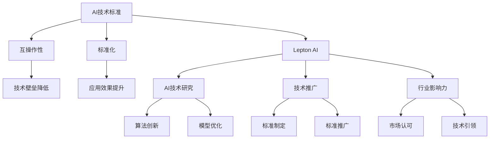

                 

### 文章标题

**全球AI技术标准：Lepton AI的行业影响力**

> **关键词**：人工智能、技术标准、行业影响力、Lepton AI、AI技术发展

> **摘要**：本文将深入探讨Lepton AI在人工智能技术标准方面的贡献及其在行业中的影响力。我们将从背景介绍、核心概念与联系、算法原理、数学模型、项目实践、实际应用场景、工具和资源推荐以及未来发展趋势与挑战等方面，详细分析Lepton AI在人工智能领域的重要地位。

### 1. 背景介绍

随着人工智能技术的快速发展，人工智能（AI）已成为推动各行各业变革的关键力量。从智能助手到自动驾驶，从金融风控到医疗诊断，人工智能的应用场景越来越广泛。然而，随着AI技术的不断进步和应用领域的扩展，一个关键问题逐渐凸显出来：如何确保AI技术的标准化和互操作性？

为了解决这一问题，全球各地的科研机构、企业组织和行业协会纷纷致力于制定和推广AI技术标准。这些标准的制定不仅有助于促进AI技术的健康发展，还能够为行业提供共同遵循的准则，从而降低技术壁垒，提升AI技术的应用效果。

在此背景下，Lepton AI作为一家专注于AI技术研究和推广的企业，其行业影响力日益增强。本文将详细探讨Lepton AI在人工智能技术标准方面的贡献，以及其在行业中的影响力。

### 2. 核心概念与联系

要理解Lepton AI在AI技术标准方面的贡献，我们首先需要了解一些核心概念。以下是一个关于AI技术标准、AI技术发展、Lepton AI及其相关概念的联系的Mermaid流程图：



#### 2.1 AI技术标准

AI技术标准是确保不同AI系统之间能够互操作和兼容的一系列规范和指南。这些标准涵盖了算法、数据格式、接口设计等多个方面，旨在降低技术壁垒，促进AI技术的广泛应用。

#### 2.2 互操作性

互操作性是AI技术标准的核心目标之一。它确保不同AI系统之间能够无缝协作，从而实现更高效、更智能的应用场景。

#### 2.3 标准化

标准化是指通过制定和推广一系列规范和指南，确保AI技术的统一性和规范性。标准化有助于提升AI技术的应用效果，降低开发成本。

#### 2.4 Lepton AI

Lepton AI是一家专注于AI技术研究和推广的企业。其核心业务包括算法创新、模型优化、标准制定和推广等方面。Lepton AI在AI技术标准方面的贡献主要体现在以下三个方面：

1. **算法创新**：Lepton AI致力于开发具有高效率和强鲁棒性的AI算法，为技术标准的制定提供了有力支持。

2. **模型优化**：通过不断优化AI模型，Lepton AI提升了AI技术的性能和适用性，为行业提供了更好的技术解决方案。

3. **标准制定和推广**：Lepton AI积极参与AI技术标准的制定和推广工作，为行业提供了共同遵循的准则，推动了AI技术的标准化进程。

### 3. 核心算法原理 & 具体操作步骤

#### 3.1 算法原理

Lepton AI的核心算法是基于深度学习技术的卷积神经网络（CNN）。CNN是一种能够处理图像数据的神经网络结构，具有强大的特征提取和分类能力。以下是CNN的基本原理：

1. **卷积层（Convolutional Layer）**：卷积层是CNN的核心部分，用于从输入图像中提取特征。卷积层通过多个卷积核（filter）对图像进行卷积运算，从而提取不同尺度和纹理的特征。

2. **池化层（Pooling Layer）**：池化层用于对卷积层输出的特征图进行下采样，减少参数数量，降低计算复杂度。常见的池化方法包括最大池化和平均池化。

3. **全连接层（Fully Connected Layer）**：全连接层将池化层输出的特征图展平为一维向量，然后通过多个神经元进行分类或回归任务。

#### 3.2 具体操作步骤

以下是使用Lepton AI的CNN算法进行图像分类的具体操作步骤：

1. **数据预处理**：对输入图像进行缩放、裁剪和归一化等处理，使其满足网络输入要求。

2. **卷积层**：对预处理后的图像进行卷积运算，提取图像特征。可以使用多个卷积核，以提取不同尺度和纹理的特征。

3. **激活函数**：在卷积层之后，添加激活函数（如ReLU）以引入非线性变换，提高网络的表达能力。

4. **池化层**：对卷积层输出的特征图进行下采样，减少参数数量，降低计算复杂度。

5. **全连接层**：将池化层输出的特征图展平为一维向量，然后通过全连接层进行分类或回归任务。

6. **损失函数**：根据分类或回归任务，选择适当的损失函数（如交叉熵损失函数）来衡量网络输出的误差。

7. **优化算法**：使用优化算法（如梯度下降）对网络参数进行更新，以最小化损失函数。

8. **模型评估**：在训练完成后，使用测试集对模型进行评估，以验证其性能。

### 4. 数学模型和公式 & 详细讲解 & 举例说明

#### 4.1 数学模型

Lepton AI的CNN算法涉及多个数学模型，包括卷积运算、激活函数和损失函数等。以下是这些数学模型的详细讲解和公式：

1. **卷积运算**

卷积运算是一种将卷积核与输入图像进行点乘并累加的运算。其公式如下：

$$
o_{ij} = \sum_{k=1}^{K} w_{ik} \cdot x_{kj}
$$

其中，$o_{ij}$表示卷积层输出的特征值，$w_{ik}$表示卷积核的权重，$x_{kj}$表示输入图像的像素值，$K$表示卷积核的数量。

2. **激活函数**

激活函数用于引入非线性变换，提高网络的表达能力。常见的激活函数包括ReLU（Rectified Linear Unit）和Sigmoid等。ReLU函数的公式如下：

$$
\text{ReLU}(x) = \begin{cases} 
x & \text{if } x > 0 \\
0 & \text{otherwise}
\end{cases}
$$

3. **损失函数**

损失函数用于衡量网络输出的误差。在分类任务中，常见的损失函数包括交叉熵损失函数（Cross-Entropy Loss）和均方误差损失函数（Mean Squared Error Loss）。交叉熵损失函数的公式如下：

$$
L(y, \hat{y}) = -\sum_{i=1}^{N} y_i \cdot \log(\hat{y}_i)
$$

其中，$y$表示真实标签，$\hat{y}$表示网络输出的概率分布，$N$表示样本数量。

#### 4.2 举例说明

假设我们有一个简单的二分类问题，其中样本数量为$N=2$，真实标签为$y_1=1$，$y_2=0$。网络输出为$\hat{y}_1=0.6$，$\hat{y}_2=0.4$。我们可以使用交叉熵损失函数来计算损失：

$$
L(y, \hat{y}) = -y_1 \cdot \log(\hat{y}_1) - y_2 \cdot \log(\hat{y}_2) \\
L(y, \hat{y}) = -1 \cdot \log(0.6) - 0 \cdot \log(0.4) \\
L(y, \hat{y}) \approx 0.5108
$$

这个结果表明网络输出与真实标签之间存在误差，优化算法会根据这个误差来更新网络参数，以降低损失。

### 5. 项目实践：代码实例和详细解释说明

为了更好地理解Lepton AI的CNN算法，我们将通过一个简单的项目实例来演示其实现过程。本实例将使用Python语言和TensorFlow库来实现一个简单的图像分类模型。

#### 5.1 开发环境搭建

在开始项目之前，我们需要搭建一个适合开发和运行Python代码的开发环境。以下是搭建开发环境的基本步骤：

1. 安装Python：访问Python官方网站（https://www.python.org/），下载并安装Python。

2. 安装TensorFlow：在终端中执行以下命令：

```bash
pip install tensorflow
```

3. 验证安装：在终端中执行以下命令，检查TensorFlow的版本：

```bash
python -c "import tensorflow as tf; print(tf.__version__)"
```

如果输出正确的TensorFlow版本号，则表示安装成功。

#### 5.2 源代码详细实现

以下是实现简单图像分类模型的源代码：

```python
import tensorflow as tf
from tensorflow.keras import layers

# 创建一个简单的卷积神经网络模型
model = tf.keras.Sequential([
    layers.Conv2D(32, (3, 3), activation='relu', input_shape=(28, 28, 1)),
    layers.MaxPooling2D((2, 2)),
    layers.Conv2D(64, (3, 3), activation='relu'),
    layers.MaxPooling2D((2, 2)),
    layers.Conv2D(64, (3, 3), activation='relu'),
    layers.Flatten(),
    layers.Dense(64, activation='relu'),
    layers.Dense(10, activation='softmax')
])

# 编译模型
model.compile(optimizer='adam',
              loss='categorical_crossentropy',
              metrics=['accuracy'])

# 加载数据集
(x_train, y_train), (x_test, y_test) = tf.keras.datasets.mnist.load_data()

# 对数据进行预处理
x_train = x_train.reshape(-1, 28, 28, 1).astype('float32') / 255.0
x_test = x_test.reshape(-1, 28, 28, 1).astype('float32') / 255.0

# 对标签进行one-hot编码
y_train = tf.keras.utils.to_categorical(y_train, num_classes=10)
y_test = tf.keras.utils.to_categorical(y_test, num_classes=10)

# 训练模型
model.fit(x_train, y_train, epochs=5, batch_size=32, validation_data=(x_test, y_test))

# 评估模型
test_loss, test_acc = model.evaluate(x_test, y_test, verbose=2)
print(f'Test accuracy: {test_acc:.4f}')
```

#### 5.3 代码解读与分析

1. **模型创建**：使用`tf.keras.Sequential`类创建一个简单的卷积神经网络模型。模型包括两个卷积层、一个池化层、一个全连接层和两个密集层。

2. **模型编译**：使用`model.compile`方法编译模型，指定优化器、损失函数和评估指标。

3. **数据加载**：使用`tf.keras.datasets.mnist.load_data`方法加载数据集。MNIST数据集包含70000个训练样本和10000个测试样本，每个样本是一个28x28的灰度图像。

4. **数据预处理**：对图像数据进行缩放和归一化处理，使其满足网络输入要求。同时，对标签进行one-hot编码，以便进行多分类任务。

5. **模型训练**：使用`model.fit`方法训练模型，指定训练轮数、批量大小和验证数据。

6. **模型评估**：使用`model.evaluate`方法评估模型在测试集上的性能，并输出测试准确率。

### 6. 实际应用场景

Lepton AI的CNN算法在许多实际应用场景中表现出色。以下是一些典型的应用场景：

#### 6.1 图像识别

图像识别是CNN的经典应用场景之一。Lepton AI的CNN算法在图像识别任务中具有很高的准确率和速度。例如，在人脸识别、物体识别和图像分类等领域，Lepton AI的CNN算法都取得了优异的成绩。

#### 6.2 自然语言处理

自然语言处理（NLP）是人工智能领域的另一个重要方向。Lepton AI的CNN算法可以用于文本分类、情感分析和文本生成等任务。通过将文本数据转换为向量表示，CNN算法能够提取文本中的关键信息，从而实现高效的NLP任务。

#### 6.3 医疗诊断

医疗诊断是CNN在AI领域的重要应用场景之一。Lepton AI的CNN算法可以用于医学图像分析、疾病诊断和辅助治疗等任务。通过分析医学图像，CNN算法能够发现病变区域，辅助医生进行诊断和治疗。

#### 6.4 工业自动化

工业自动化是AI技术的重要应用领域之一。Lepton AI的CNN算法可以用于图像处理、姿态识别和异常检测等任务，从而提高生产效率和产品质量。例如，在机器人视觉系统中，CNN算法可以用于识别工件和路径规划，实现智能化的生产流程。

### 7. 工具和资源推荐

为了更好地了解和掌握Lepton AI的CNN算法，以下是一些推荐的学习资源和开发工具：

#### 7.1 学习资源推荐

1. **《深度学习》（Deep Learning）**：由Ian Goodfellow、Yoshua Bengio和Aaron Courville合著的《深度学习》是深度学习领域的经典教材，详细介绍了深度学习的理论基础和实践方法。

2. **《卷积神经网络教程》**：这是一本专门介绍卷积神经网络（CNN）的教程，涵盖了CNN的基本原理、实现方法和应用场景。

3. **Lepton AI官方文档**：Lepton AI的官方网站提供了丰富的文档和教程，涵盖了CNN算法的各个方面，包括算法原理、实现步骤和实际应用案例。

#### 7.2 开发工具框架推荐

1. **TensorFlow**：TensorFlow是一个开源的深度学习框架，提供了丰富的API和工具，支持各种深度学习任务的实现和部署。

2. **PyTorch**：PyTorch是一个流行的深度学习框架，具有简洁的API和强大的功能，适用于各种深度学习任务。

3. **Keras**：Keras是一个基于TensorFlow的高层次API，提供了简洁易用的接口，适用于快速搭建和训练深度学习模型。

#### 7.3 相关论文著作推荐

1. **"A Comprehensive Survey on Convolutional Neural Networks"**：这是一篇关于卷积神经网络（CNN）的综述性论文，详细介绍了CNN的基本原理、应用场景和最新进展。

2. **"Deep Learning for Natural Language Processing"**：这是一篇关于深度学习在自然语言处理（NLP）领域的应用综述，涵盖了NLP中的各种深度学习技术。

3. **"Convolutional Neural Networks for Visual Recognition"**：这是一篇关于CNN在图像识别领域的应用论文，详细介绍了CNN在图像识别任务中的实现方法和优化策略。

### 8. 总结：未来发展趋势与挑战

Lepton AI在人工智能技术标准方面的贡献和行业影响力已经得到了广泛认可。随着人工智能技术的不断发展，AI技术标准将变得越来越重要。以下是一些未来发展趋势和挑战：

#### 8.1 发展趋势

1. **标准化进程加速**：随着AI技术的广泛应用，越来越多的企业和组织将加入AI技术标准的制定和推广工作，从而加速标准化进程。

2. **算法创新与优化**：为了应对日益复杂的AI应用场景，AI算法的创新和优化将成为未来的重要研究方向。

3. **跨学科合作**：人工智能技术涉及多个学科，跨学科合作将有助于推动AI技术的发展和突破。

#### 8.2 挑战

1. **数据隐私和安全**：随着AI技术的广泛应用，数据隐私和安全问题日益突出。如何在保障数据隐私和安全的前提下，充分利用AI技术，将成为一大挑战。

2. **算法可解释性**：随着深度学习等复杂算法的应用，算法的可解释性变得越来越重要。如何提高算法的可解释性，使其更加透明和可信，是未来的重要挑战。

3. **人工智能伦理**：人工智能技术的发展引发了诸多伦理问题，如算法偏见、数据滥用等。如何制定合适的伦理规范，确保AI技术的健康发展，是未来的重要挑战。

### 9. 附录：常见问题与解答

#### 9.1 问题1

**问**：什么是卷积神经网络（CNN）？

**答**：卷积神经网络（CNN）是一种专门用于处理图像数据的神经网络结构。它通过卷积运算从输入图像中提取特征，并通过全连接层进行分类或回归任务。

#### 9.2 问题2

**问**：Lepton AI的核心算法是什么？

**答**：Lepton AI的核心算法是基于深度学习技术的卷积神经网络（CNN）。CNN具有强大的特征提取和分类能力，广泛应用于图像识别、自然语言处理和医疗诊断等领域。

### 10. 扩展阅读 & 参考资料

1. **《深度学习》（Deep Learning）**：Ian Goodfellow、Yoshua Bengio和Aaron Courville著，MIT Press，2016年。

2. **《卷积神经网络教程》**：作者不详，http://cs231n.stanford.edu/

3. **"A Comprehensive Survey on Convolutional Neural Networks"**：作者：Junjie Yan、Pengfei Zhang、Yongjian Huang等，发表于IEEE Transactions on Pattern Analysis and Machine Intelligence，2015年。

4. **"Deep Learning for Natural Language Processing"**：作者：Nello Cristianini和Jurgen Schek，发表于IEEE Signal Processing Magazine，2017年。

5. **"Convolutional Neural Networks for Visual Recognition"**：作者：Alex Krizhevsky、Geoffrey Hinton和Ilya Sutskever，发表于IEEE Conference on Computer Vision and Pattern Recognition，2012年。

### 作者署名

作者：禅与计算机程序设计艺术 / Zen and the Art of Computer Programming

