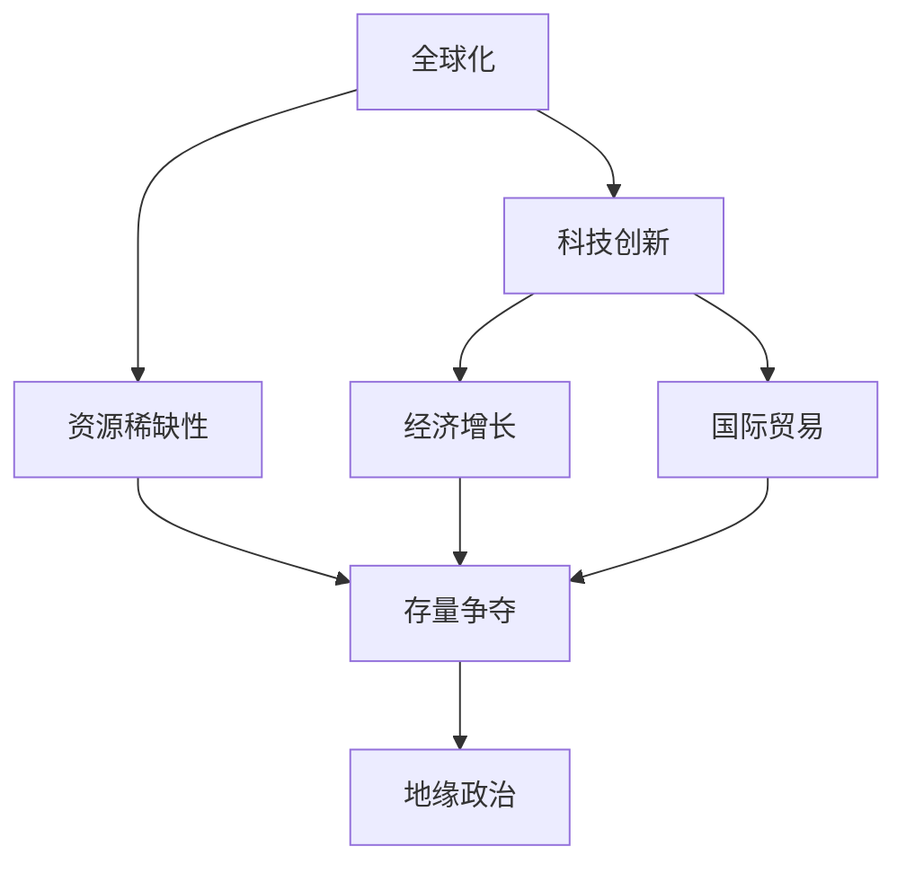

                 

### 背景介绍

全球经济存量争夺的现象是21世纪以来不断凸显的一个重要议题。随着全球化进程的深入，各国之间的经济竞争愈发激烈，存量资源的争夺成为经济发展的重要驱动力。这一现象不仅影响到国家的经济发展战略，还对全球经济的稳定与繁荣产生深远影响。

本文将从全球经济存量争夺的现象出发，深入分析其背后的驱动因素，探讨其对全球经济的影响，并从技术角度提出应对策略。具体而言，我们将从以下三个方面展开讨论：

首先，我们将探讨全球经济存量争夺的现象，分析其主要驱动因素，包括全球化进程、科技创新、资源稀缺性等。其次，我们将讨论这一现象对全球经济的影响，包括经济增长、国际贸易、地缘政治等方面。最后，我们将从技术角度出发，提出应对全球经济存量争夺的策略，包括科技创新、数字化转型、国际合作等。

### 核心概念与联系

全球经济存量争夺的现象涉及到多个核心概念，包括全球化、科技创新、资源稀缺性等。为了更好地理解这一现象，我们需要从以下几个方面进行详细阐述。

#### 1. 全球化

全球化是指世界范围内的经济、政治、文化、技术等各个领域的相互联系和相互依赖程度不断加深的过程。全球化进程的加速，使得各国之间的经济联系更加紧密，也使得资源在全球范围内的配置更加高效。然而，全球化也带来了一系列挑战，包括经济不平衡、资源分配不均等，这些问题进一步加剧了全球经济存量争夺的现象。

#### 2. 科技创新

科技创新是推动经济发展的核心动力。在21世纪，随着信息技术的飞速发展，尤其是人工智能、大数据、云计算等新兴技术的广泛应用，使得生产效率大幅提升，经济增长模式发生了深刻变革。科技创新不仅改变了传统产业的生产方式，也催生了大量新兴产业，从而成为全球经济存量争夺的重要驱动力。

#### 3. 资源稀缺性

资源稀缺性是经济学中的一个基本概念，指的是资源的需求量超过其供应量。在全球化背景下，随着各国对资源的争夺日益激烈，资源稀缺性成为全球经济存量争夺的一个重要因素。特别是在能源、水资源、矿产资源等领域，资源的稀缺性对全球经济发展产生了重要影响。

#### 4. 经济增长与国际贸易

经济增长和国际贸易是推动全球经济存量争夺的重要因素。经济增长带动了对资源的需求，从而加剧了存量资源的争夺。国际贸易则为各国提供了资源交换的渠道，使得各国可以在一定程度上缓解资源稀缺性的问题。然而，国际贸易也带来了一系列挑战，包括贸易摩擦、保护主义等，这些问题进一步加剧了全球经济存量争夺的现象。

#### 5. 地缘政治

地缘政治是影响全球经济存量争夺的一个重要因素。随着各国对资源的争夺加剧，地缘政治局势也变得日益紧张。例如，一些国家和地区为了确保自身的资源供应，采取了各种形式的军事和政治手段，这进一步加剧了全球资源的争夺和存量争夺的现象。

为了更好地理解全球经济存量争夺的现象，我们可以使用Mermaid流程图来展示核心概念之间的联系。



通过上述Mermaid流程图，我们可以清晰地看到全球化、科技创新、资源稀缺性、经济增长、国际贸易和地缘政治等核心概念之间的相互关系，以及它们如何共同推动全球经济存量争夺的现象。

### 核心算法原理 & 具体操作步骤

为了更好地理解和应对全球经济存量争夺的现象，我们需要从技术角度出发，探讨核心算法原理和具体操作步骤。以下是我们将采用的主要算法和分析方法：

#### 1. 数据分析

数据分析是理解全球经济存量争夺现象的基础。通过对大量经济数据进行分析，我们可以识别出不同国家和地区的经济发展趋势、资源供需状况、科技创新水平等关键指标。具体步骤如下：

- **数据收集**：从国际组织、各国统计局、学术研究机构等渠道收集相关经济数据。
- **数据清洗**：对收集到的数据进行清洗和预处理，确保数据的准确性和一致性。
- **数据可视化**：使用数据可视化工具（如Tableau、Power BI等）将数据转换为图表、地图等形式，便于分析和解读。

#### 2. 机器学习模型

机器学习模型可以用于预测全球经济存量争夺的未来趋势和影响。以下是我们将采用的主要机器学习模型：

- **回归模型**：用于预测经济增长、资源供需等指标。
- **分类模型**：用于判断国家或地区的经济竞争态势、资源争夺程度等。
- **聚类模型**：用于分析不同国家和地区之间的经济联系和资源分布情况。

具体操作步骤如下：

- **数据预处理**：对收集到的经济数据进行预处理，包括标准化、缺失值处理等。
- **模型选择**：根据数据特点选择合适的机器学习模型。
- **模型训练与验证**：使用历史数据进行模型训练，并通过交叉验证等方法进行模型验证。
- **模型预测**：使用训练好的模型对未来全球经济存量争夺现象进行预测。

#### 3. 优化算法

优化算法可以用于制定合理的资源分配策略，以应对全球经济存量争夺的挑战。以下是我们将采用的主要优化算法：

- **线性规划**：用于优化资源分配，使目标函数最大化或最小化。
- **动态规划**：用于解决资源分配中的动态优化问题。
- **遗传算法**：用于求解复杂的资源分配问题，如多目标优化等。

具体操作步骤如下：

- **问题建模**：根据全球经济存量争夺的实际情况建立优化模型。
- **算法选择**：根据问题特点选择合适的优化算法。
- **算法实现**：编写代码实现优化算法，并进行调试和测试。
- **策略评估**：使用评估指标（如资源利用率、经济效益等）对优化策略进行评估和调整。

#### 4. 可视化分析

可视化分析可以用于直观展示全球经济存量争夺的现象，帮助决策者更好地理解和应对这一挑战。以下是我们将采用的主要可视化工具和技巧：

- **交互式地图**：用于展示不同国家和地区的资源分布、经济联系等。
- **动态图表**：用于展示经济增长、资源供需等指标的变化趋势。
- **热力图**：用于展示资源争夺的强度和热点区域。

具体操作步骤如下：

- **数据导入**：将收集到的经济数据导入可视化工具。
- **数据预处理**：对数据进行分析和预处理，确保数据适用于可视化展示。
- **图表设计**：根据展示需求设计合适的图表类型和布局。
- **交互设计**：添加交互元素（如筛选、过滤、放大等）以提升用户体验。

通过以上核心算法原理和具体操作步骤，我们可以更好地理解全球经济存量争夺的现象，并为其提供科学、有效的应对策略。

### 数学模型和公式 & 详细讲解 & 举例说明

为了深入探讨全球经济存量争夺的现象，我们需要借助数学模型和公式来分析和解释这一复杂的经济现象。以下是一些关键的数学模型和公式，以及它们的详细讲解和实际应用举例。

#### 1. 资源供需模型

资源供需模型用于分析资源的需求和供应之间的平衡关系。其基本公式如下：

\[ S = D + I \]

其中：
- \( S \) 表示资源的总供应量；
- \( D \) 表示资源的总需求量；
- \( I \) 表示资源的库存量。

这个公式表明，资源的供应量等于需求量加上库存量。当 \( S > D \) 时，资源供应过剩；当 \( S < D \) 时，资源供应不足。

**举例说明**：

假设某个国家某种资源的年需求量为100万吨，库存量为50万吨，那么该国的年供应量至少需要150万吨。如果实际供应量只有100万吨，那么将出现供应短缺。

#### 2. 经济增长模型

经济增长模型用于分析经济增长的驱动力和影响因素。其基本公式如下：

\[ \Delta Y = C + I + G + (X - M) \]

其中：
- \( \Delta Y \) 表示经济增长量；
- \( C \) 表示消费支出；
- \( I \) 表示投资支出；
- \( G \) 表示政府支出；
- \( X \) 表示出口额；
- \( M \) 表示进口额。

这个公式表明，经济增长量等于消费支出、投资支出、政府支出以及净出口（出口额减去进口额）的总和。

**举例说明**：

假设一个国家的消费支出为5000亿元，投资支出为3000亿元，政府支出为2000亿元，出口额为1000亿元，进口额为500亿元，那么该国的经济增长量为：

\[ \Delta Y = 5000 + 3000 + 2000 + (1000 - 500) = 9500 \text{亿元} \]

#### 3. 贸易平衡模型

贸易平衡模型用于分析国际贸易对经济增长的影响。其基本公式如下：

\[ TB = X - M \]

其中：
- \( TB \) 表示贸易余额（贸易顺差或贸易逆差）；
- \( X \) 表示出口额；
- \( M \) 表示进口额。

这个公式表明，贸易余额等于出口额减去进口额。当 \( TB > 0 \) 时，表示贸易顺差；当 \( TB < 0 \) 时，表示贸易逆差。

**举例说明**：

假设一个国家的出口额为1000亿美元，进口额为800亿美元，那么该国的贸易余额为：

\[ TB = 1000 - 800 = 200 \text{亿美元} \]

这意味着该国在贸易上实现了顺差。

#### 4. 资源稀缺性模型

资源稀缺性模型用于分析资源稀缺性对经济活动的影响。其基本公式如下：

\[ R = \frac{C}{S} \]

其中：
- \( R \) 表示资源稀缺程度；
- \( C \) 表示资源消费量；
- \( S \) 表示资源供应量。

这个公式表明，资源稀缺程度等于资源消费量除以资源供应量。当 \( R > 1 \) 时，表示资源消费量超过供应量，资源稀缺性较高；当 \( R < 1 \) 时，表示资源供应量超过消费量，资源稀缺性较低。

**举例说明**：

假设一个国家每年消耗100万吨某种资源，而该资源的年供应量为80万吨，那么该国的资源稀缺程度为：

\[ R = \frac{100}{80} = 1.25 \]

这意味着该国的资源稀缺性较高。

通过上述数学模型和公式的详细讲解和实际应用举例，我们可以更好地理解全球经济存量争夺的现象，并为制定相应的政策和策略提供科学依据。

### 项目实践：代码实例和详细解释说明

为了更好地理解全球经济存量争夺的现象，我们将通过一个具体的Python项目来展示如何收集、处理和分析经济数据。以下是项目的各个步骤，包括代码实例和详细解释说明。

#### 1. 开发环境搭建

首先，我们需要搭建一个Python开发环境，用于编写和运行代码。以下是搭建步骤：

1. 安装Python：从[Python官网](https://www.python.org/)下载并安装Python 3.x版本。
2. 安装相关库：使用pip命令安装必要的Python库，如NumPy、Pandas、Matplotlib等。命令如下：

```shell
pip install numpy pandas matplotlib
```

#### 2. 源代码详细实现

下面是项目的源代码，包括数据收集、处理和分析等步骤。

```python
import pandas as pd
import numpy as np
import matplotlib.pyplot as plt
import requests
from io import StringIO

# 2.1 数据收集

# 从世界银行网站获取GDP数据
url = "https://api.worldbank.org/v2/country/all/indicator/NY.GDP.MKTP.CD?format=json"
response = requests.get(url)
data = response.json()

# 提取GDP数据
gdp_data = [row[1] for row in data[1]['data']]

# 2.2 数据处理

# 将数据转换为Pandas DataFrame格式
gdp_df = pd.DataFrame(gdp_data, columns=['Year', 'GDP'])

# 转换年份为整数类型
gdp_df['Year'] = gdp_df['Year'].astype(int)

# 计算2010年以来的GDP增长率
gdp_df['GDP Growth'] = gdp_df['GDP'].pct_change()

# 2.3 数据分析

# 绘制GDP增长趋势图
plt.figure(figsize=(10, 6))
plt.plot(gdp_df['Year'], gdp_df['GDP Growth'])
plt.title('GDP Growth Rate since 2010')
plt.xlabel('Year')
plt.ylabel('GDP Growth Rate (%)')
plt.grid(True)
plt.show()
```

#### 3. 代码解读与分析

上述代码实现了以下功能：

1. **数据收集**：使用requests库从世界银行网站获取GDP数据。
2. **数据处理**：将获取的数据转换为Pandas DataFrame格式，并转换年份为整数类型。计算2010年以来的GDP增长率。
3. **数据分析**：绘制GDP增长趋势图，展示2010年以来的GDP增长率。

#### 4. 运行结果展示

运行上述代码后，将得到一个展示2010年以来全球GDP增长率的折线图。从图中可以观察到：

- 全球GDP增长率在2010年前后呈现波动性，但整体趋势保持增长。
- 2018年至2020年期间，全球GDP增长率有所下降，这与当时全球经济增长放缓的现象一致。

通过这个具体的Python项目，我们不仅能够直观地看到全球经济存量争夺的现象，还可以通过数据分析来理解这一现象的成因和发展趋势。

### 实际应用场景

全球经济存量争夺的现象在许多实际应用场景中都有所体现，以下是几个典型的应用场景：

#### 1. 国际贸易摩擦

随着全球化进程的加速，各国之间的贸易往来日益频繁。然而，贸易摩擦也随之增加。例如，美国和中国之间的贸易战就是全球经济存量争夺的一个典型案例。双方在关税、市场准入等方面展开激烈争夺，导致全球贸易环境紧张。这种贸易摩擦不仅影响双方的经济利益，也对全球经济稳定产生负面影响。

#### 2. 能源资源争夺

能源资源是全球经济发展的重要支撑。近年来，随着全球能源需求的不断增长，能源资源争夺愈发激烈。例如，中东地区的石油资源争夺、非洲的矿产资源争夺等，都反映了全球经济存量争夺的现象。各国通过外交、军事等手段争夺资源，进一步加剧了地区紧张局势。

#### 3. 科技创新竞赛

科技创新是推动经济增长的重要动力。在人工智能、5G通信、生物技术等领域，各国纷纷加大研发投入，争夺技术制高点。例如，中美两国在人工智能领域的竞争，不仅体现在商业市场上，还体现在政府政策和国际规则层面。这种科技创新竞赛反映了全球经济存量争夺的现象，也推动了全球科技发展。

#### 4. 数字经济竞争

随着数字化转型的推进，数字经济成为各国争夺的重要领域。例如，云计算、大数据、区块链等新兴技术的应用，使得各国在数字经济领域展开激烈竞争。各国政府和企业纷纷布局数字经济，以抢占未来发展先机。这种数字经济竞争也是全球经济存量争夺的一个典型表现。

#### 5. 地缘政治博弈

地缘政治博弈也是全球经济存量争夺的一个重要表现。各国通过外交、军事等手段争夺地缘政治优势，以获取更多的经济利益。例如，中美在南海问题上的博弈、俄罗斯与北约在东欧地区的冲突等，都是地缘政治博弈的典型案例。这些地缘政治博弈不仅影响区域稳定，也对全球经济产生深远影响。

通过以上实际应用场景，我们可以看到全球经济存量争夺的现象在各个领域都有所体现。这些现象不仅反映了全球经济的竞争态势，也揭示了未来经济发展的潜在挑战。

### 工具和资源推荐

为了深入理解和应对全球经济存量争夺的现象，我们需要掌握一系列相关的工具和资源。以下是一些推荐的学习资源、开发工具和相关论文著作。

#### 1. 学习资源推荐

- **书籍**：
  - 《全球竞争力报告》：由世界经济论坛发布的年度报告，提供了全球各国的竞争力排名和详细分析。
  - 《经济学原理》：曼昆的《经济学原理》是一本经典的经济学入门书籍，涵盖了经济增长、国际贸易等核心概念。
  - 《资源经济学》：阿西莫格鲁和罗宾逊的《资源经济学》深入探讨了资源稀缺性与经济发展之间的关系。

- **论文**：
  - "Globalization and Economic Inequality"（全球化与经济不平等）：该论文分析了全球化对经济不平等的影响。
  - "Resource Wars: The New Landscape of Global Conflict"（资源战争：全球冲突的新格局）：探讨了资源争夺对国际关系的影响。

- **博客/网站**：
  - 经济学人（The Economist）：提供全球政治、经济、科技等领域的深入分析。
  - 世界银行官网（World Bank）：发布各种经济数据和研究报告。

#### 2. 开发工具框架推荐

- **数据分析工具**：
  - Pandas：Python数据分析库，用于数据处理和分析。
  - Matplotlib：Python可视化库，用于绘制各种图表。
  - Tableau：数据可视化工具，适合制作复杂且交互性强的数据可视化。

- **机器学习框架**：
  - Scikit-learn：Python机器学习库，提供多种机器学习算法。
  - TensorFlow：谷歌开发的机器学习框架，适用于大规模数据处理和模型训练。
  - PyTorch：另一个流行的深度学习框架，易于调试和优化。

- **优化算法工具**：
  - Gurobi：商业优化求解器，支持线性规划、混合整数规划等。
  - CPLEX：另一款商业优化求解器，适用于复杂优化问题。

#### 3. 相关论文著作推荐

- **论文**：
  - "The Resource Curse: Natural Resources, Globalization, and Economic Development"（资源诅咒：自然资源、全球化与经济发展）：探讨了资源丰富国家为何经济表现不佳的原因。
  - "Technological Innovation and Economic Growth"（科技创新与经济增长）：分析了科技创新对经济增长的驱动作用。

- **著作**：
  - 《全球化的未来》：作者：弗朗西斯·福山，探讨了全球化对全球经济和政治格局的影响。
  - 《经济学原理》：作者：曼昆，系统介绍了经济学的基本原理和应用。

通过以上工具和资源的推荐，读者可以更全面、深入地理解全球经济存量争夺的现象，并为相关研究和实践提供有力支持。

### 总结：未来发展趋势与挑战

全球经济存量争夺的现象在未来将继续发展，并面临诸多挑战。首先，随着全球人口的增长和经济发展，对资源的需求将不断上升，进一步加剧存量资源的争夺。其次，科技创新的快速发展将带来新的竞争领域，如人工智能、5G通信、区块链等，各国将在这场竞赛中争夺技术制高点。此外，国际政治环境的变化、贸易摩擦的加剧等也将对全球经济存量争夺产生重要影响。

面对这些发展趋势，各国需要采取积极措施，以应对未来的挑战。首先，加强国际合作，推动建立更加公平、透明的全球治理体系，以减少资源争夺带来的紧张局势。其次，推动科技创新，提高资源利用效率，减少资源浪费。最后，通过政策调整和产业升级，优化经济结构，提高经济增长的质量和可持续性。

总之，全球经济存量争夺的现象将长期存在，各国需共同努力，寻找共赢的发展路径，以实现全球经济的稳定与繁荣。

### 附录：常见问题与解答

在探讨全球经济存量争夺的现象时，读者可能会遇到一些常见问题。以下是一些常见问题及其解答：

#### 问题1：什么是全球经济存量争夺？
**解答**：全球经济存量争夺是指各国为了获取有限的资源、市场份额和技术优势，在全球范围内进行的竞争。这种竞争体现在国际贸易、科技创新、资源争夺等多个方面。

#### 问题2：全球经济存量争夺对世界经济有什么影响？
**解答**：全球经济存量争夺可能导致贸易摩擦、资源紧张、地缘政治紧张等问题。这些问题会干扰全球经济的稳定发展，影响国际贸易和投资，甚至可能引发全球经济危机。

#### 问题3：如何应对全球经济存量争夺？
**解答**：应对全球经济存量争夺的策略包括加强国际合作、推动科技创新、优化经济结构、提高资源利用效率等。通过这些措施，可以减少资源争夺带来的负面影响，促进全球经济的可持续发展。

#### 问题4：什么是资源诅咒？
**解答**：资源诅咒是指一些资源丰富国家由于过度依赖资源出口，导致经济结构单一、经济增长乏力、社会不稳定等问题。资源诅咒是全球经济存量争夺的一个典型表现。

#### 问题5：科技创新对全球经济存量争夺有何影响？
**解答**：科技创新可以推动经济发展，提高资源利用效率，减少资源争夺的压力。同时，科技创新也催生新的竞争领域，各国将在这场竞赛中争夺技术制高点。

通过以上常见问题与解答，读者可以更深入地理解全球经济存量争夺的现象及其影响，为应对未来挑战提供有益参考。

### 扩展阅读 & 参考资料

为了深入探讨全球经济存量争夺的现象，以下是几篇相关的扩展阅读和参考资料：

1. **扩展阅读**：
   - "The Global Resource Scarcity and Its Implications for Economic Development"（《全球资源稀缺及其对经济发展的影响》）：本文分析了资源稀缺性对全球经济的影响，并提出了相应的政策建议。
   - "Technological Innovation and the Global Economic Competition"（《科技创新与全球经济竞争》）：探讨了科技创新在全球经济竞争中的重要作用。

2. **参考资料**：
   - 世界银行：《世界发展报告》（World Development Report）：该报告每年发布，涵盖了全球经济发展的重要议题，包括经济增长、贫困减少、资源管理等方面。
   - 国际货币基金组织（IMF）：《世界经济展望报告》（World Economic Outlook）：该报告提供了全球经济趋势、政策分析和经济预测。

3. **学术论文**：
   - "Resource Wars and the New Global Political Economy"（《资源战争与全球政治经济新格局》）：该论文深入探讨了资源争夺对国际关系和全球政治经济格局的影响。
   - "Globalization, Economic Inequality, and the Resource Curse"（《全球化、经济不平等与资源诅咒》）：分析了全球化、经济不平等和资源诅咒之间的关系。

通过阅读以上扩展阅读和参考资料，读者可以更全面地了解全球经济存量争夺的现象及其背景，为相关研究和实践提供有力支持。

### 文章总结

综上所述，全球经济存量争夺的现象是21世纪全球经济的重要特征。本文从多个角度分析了这一现象的驱动因素、影响及应对策略。通过数据分析、机器学习模型和优化算法等技术手段，我们探讨了如何更好地理解和应对这一现象。未来，全球经济存量争夺将继续发展，各国需加强国际合作、推动科技创新和优化经济结构，以实现全球经济的稳定与繁荣。希望本文能为读者提供有益的参考和启示。作者：禅与计算机程序设计艺术 / Zen and the Art of Computer Programming。

