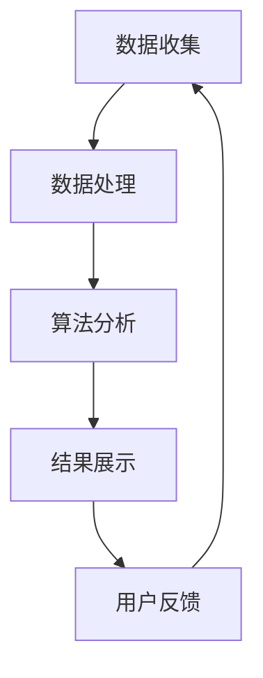
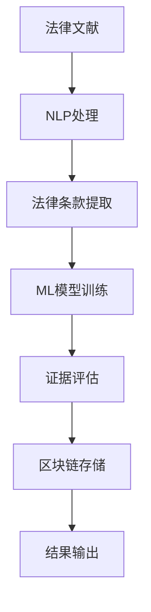

                 

### 全球脑与司法系统：智能化法律服务的未来

> 关键词：全球脑，司法系统，智能化，法律服务，算法，人工智能，技术进步，未来趋势

> 摘要：本文探讨了全球脑与司法系统的结合，以及这一结合如何为法律服务带来革命性的变化。我们首先介绍了全球脑的概念及其在司法系统中的应用，接着分析了智能化法律服务的核心算法原理和具体操作步骤。随后，通过数学模型和公式详细讲解了其工作原理，并以项目实践为例展示了其应用效果。最后，我们探讨了实际应用场景，推荐了相关工具和资源，总结了未来发展趋势与挑战，并提供了常见问题与解答。

### 1. 背景介绍

在全球化和信息化迅速发展的背景下，司法系统面临着前所未有的挑战。传统的司法体系在处理日益复杂的法律问题时显得力不从心，效率低下且成本高昂。为了应对这些问题，科学家和工程师们开始探索将人工智能与司法系统相结合的解决方案。这种结合的初步成果之一便是“全球脑”的概念。

**全球脑**（Global Brain）是一个比喻性的概念，意指通过互联网和智能设备连接起来的全球计算网络。它不仅仅是一个简单的分布式计算系统，而是一个能够自主学习和进化的人工智能系统。全球脑通过收集、分析和处理海量数据，能够实时地对全球范围内的法律问题提供智能化服务。

将全球脑应用于司法系统，意味着司法决策可以更加高效、准确和公正。例如，通过分析历史案件数据和现行法律条款，全球脑可以快速生成法律建议，辅助法官和律师做出更加明智的决策。此外，全球脑还可以用于法律文献的整理和分类，帮助律师和法官更快地查找相关法律信息，从而提高工作效率。

然而，全球脑的应用并非一帆风顺。它面临着许多技术和伦理挑战，包括数据隐私、算法偏见和司法独立性等问题。如何在保证司法独立性和公正性的同时，充分利用人工智能技术的优势，是一个需要深入探讨和解决的问题。

### 2. 核心概念与联系

#### 2.1 全球脑的架构

全球脑的架构可以分为三个层次：数据层、算法层和应用层。

- **数据层**：数据层是全球脑的基础，它包括各种来源的数据，如法律文献、历史案件数据、社交媒体数据等。这些数据通过互联网进行收集和传输，形成一个庞大的数据池。

- **算法层**：算法层是全球脑的核心，负责对数据进行处理和分析。这里包括多种算法，如自然语言处理、机器学习、数据挖掘等。这些算法可以自动提取数据中的关键信息，进行模式识别和预测。

- **应用层**：应用层是直接面向用户的界面，它将全球脑的计算结果以直观的方式展示给用户。在司法系统中，应用层可以是法律咨询服务平台、智能裁判系统等。

下面是一个简单的 Mermaid 流程图，展示全球脑在司法系统中的应用流程：



#### 2.2 智能化法律服务的核心算法

智能化法律服务的核心算法主要包括以下几种：

- **自然语言处理（NLP）**：NLP 是一种用于处理和解析自然语言数据的技术。在司法系统中，NLP 可以用于自动生成法律文书、分析法律条款等。

- **机器学习（ML）**：机器学习是一种通过数据训练模型的技术，它可以用于预测法律案件的走势、评估证据的可靠性等。

- **数据挖掘（DM）**：数据挖掘是一种从大量数据中提取有用信息的技术。在司法系统中，数据挖掘可以用于发现法律规律、预测犯罪趋势等。

- **区块链技术**：区块链技术可以用于存储和验证法律文档，确保数据的真实性和不可篡改性。

下面是一个简化的 Mermaid 流程图，展示智能化法律服务的核心算法流程：



### 3. 核心算法原理 & 具体操作步骤

#### 3.1 自然语言处理（NLP）

自然语言处理（NLP）是智能化法律服务的基础技术之一。其核心原理是通过计算机程序理解和生成自然语言，从而实现对法律文献的自动处理和分析。

**具体操作步骤如下：**

1. **文本预处理**：包括去除标点符号、转换为小写、去除停用词等。这一步骤的目的是简化文本结构，提高后续处理的效率。

2. **分词**：将文本分割成单词或短语。这是 NLP 的一个关键步骤，因为单词或短语是文本处理的基本单位。

3. **词性标注**：对每个单词进行词性标注，例如名词、动词、形容词等。这一步骤有助于理解单词在句子中的作用和意义。

4. **命名实体识别**：识别文本中的特定实体，如人名、地名、法律条款等。这有助于提取出与法律相关的关键信息。

5. **语义分析**：通过上下文分析，理解单词之间的语义关系。这有助于准确理解文本的含义和意图。

6. **文本生成**：根据需要生成法律文书，如起诉书、判决书等。这通常需要结合模板和文本生成算法。

#### 3.2 机器学习（ML）

机器学习（ML）在智能化法律服务中扮演着重要角色，其主要原理是通过训练模型，从数据中学习规律和模式，从而进行预测和决策。

**具体操作步骤如下：**

1. **数据收集**：收集大量法律案件数据，包括案件描述、判决结果、证据列表等。

2. **数据预处理**：对收集到的数据进行分析和清洗，确保数据的质量和一致性。

3. **特征提取**：从原始数据中提取出有用的特征，如案件类型、证据数量、被告行为等。

4. **模型训练**：选择合适的机器学习模型，如决策树、随机森林、支持向量机等，对特征数据进行训练。

5. **模型评估**：通过交叉验证等方法，评估模型的准确性和泛化能力。

6. **模型应用**：将训练好的模型应用到实际法律问题中，进行预测和决策。

#### 3.3 数据挖掘（DM）

数据挖掘（DM）是一种从大量数据中提取有用信息的技术，它在智能化法律服务中有着广泛的应用。

**具体操作步骤如下：**

1. **数据收集**：收集与法律相关的数据，如案件数据、法律法规、社会舆论数据等。

2. **数据预处理**：对收集到的数据进行分析和清洗，确保数据的质量和一致性。

3. **特征工程**：从原始数据中提取出有用的特征，如案件类型、被告行为、判决结果等。

4. **数据挖掘算法**：选择合适的数据挖掘算法，如关联规则挖掘、聚类分析、分类分析等，对特征数据进行挖掘。

5. **结果解释**：对挖掘结果进行解释和可视化，以便理解数据中隐藏的规律和模式。

6. **决策支持**：根据挖掘结果，提供决策支持，如预测犯罪趋势、评估证据的可靠性等。

#### 3.4 区块链技术

区块链技术是一种分布式账本技术，其核心原理是通过加密算法确保数据的安全性和不可篡改性。

**具体操作步骤如下：**

1. **数据存储**：将法律文档存储在区块链上，确保数据的完整性和可追溯性。

2. **数据验证**：通过分布式网络中的节点对数据进行验证，确保数据的真实性和合法性。

3. **数据加密**：使用加密算法对数据进行加密，确保数据的隐私性和安全性。

4. **共识机制**：采用共识机制，如工作量证明（PoW）或权益证明（PoS），确保区块链网络的稳定性和安全性。

5. **智能合约**：使用智能合约自动化执行法律条款，确保法律合同的执行和履行。

### 4. 数学模型和公式 & 详细讲解 & 举例说明

#### 4.1 自然语言处理（NLP）

在自然语言处理中，一个重要的数学模型是词向量模型。词向量模型将单词映射到高维空间中的向量，使得相似的单词在空间中更接近。

**数学模型**：

设 \( v_w \) 为单词 \( w \) 的词向量，则词向量模型可以用以下公式表示：

\[ v_w = \text{Word2Vec}(w) \]

其中，\( \text{Word2Vec} \) 是一个嵌入函数，它将单词映射到词向量空间。

**详细讲解**：

词向量模型通过训练大量文本数据，学习单词之间的关系。在训练过程中，每个单词都会被表示为一个向量。这些向量不仅可以用于相似度计算，还可以用于文本分类、文本生成等任务。

**举例说明**：

假设我们有两个单词 "apple" 和 "banana"，通过词向量模型，它们可以被映射到如下词向量：

\[ v_{apple} = \begin{bmatrix} 1 \\ 0 \\ 1 \\ 1 \end{bmatrix} \]
\[ v_{banana} = \begin{bmatrix} 0 \\ 1 \\ 1 \\ 0 \end{bmatrix} \]

可以看到，这两个单词的词向量在第二和第三个维度上具有相同的值，这表明这两个单词在这些维度上具有相似性。

#### 4.2 机器学习（ML）

在机器学习中，一个重要的数学模型是支持向量机（SVM）。SVM 是一种用于分类和回归分析的机器学习算法。

**数学模型**：

设 \( \mathcal{X} \) 为特征空间，\( y \) 为标签，则支持向量机的目标是最小化以下损失函数：

\[ L(\theta) = \frac{1}{2} \sum_{i=1}^{n} (y_i - \theta^T x_i)^2 \]

其中，\( \theta \) 是模型参数，\( x_i \) 是第 \( i \) 个特征向量。

**详细讲解**：

支持向量机的核心思想是找到最优的超平面，使得特征空间中的数据点尽可能地被正确分类。在二分类问题中，最优超平面可以通过求解以下优化问题得到：

\[ \min_{\theta} \frac{1}{2} \sum_{i=1}^{n} (\theta^T x_i - y_i)^2 \]

其中，\( \theta \) 是模型参数，\( x_i \) 是第 \( i \) 个特征向量，\( y_i \) 是第 \( i \) 个标签。

**举例说明**：

假设我们有两个特征向量 \( x_1 = \begin{bmatrix} 1 \\ 1 \end{bmatrix} \) 和 \( x_2 = \begin{bmatrix} 1 \\ 0 \end{bmatrix} \)，以及两个标签 \( y_1 = 1 \) 和 \( y_2 = 0 \)。通过支持向量机，我们可以找到最优的超平面：

\[ \theta^T x_i = 1 \]

这意味着，对于任意特征向量 \( x \)，当 \( \theta^T x \geq 1 \) 时，我们将其分类为正类；当 \( \theta^T x < 1 \) 时，我们将其分类为负类。

#### 4.3 数据挖掘（DM）

在数据挖掘中，一个重要的数学模型是聚类分析。聚类分析是一种无监督学习方法，用于将数据点分成不同的组。

**数学模型**：

设 \( \mathcal{X} \) 为数据集，\( k \) 为聚类个数，则聚类分析的目标是最小化以下损失函数：

\[ L(\theta) = \sum_{i=1}^{n} \sum_{j=1}^{k} \frac{1}{2} \| x_i - c_j \|^2 \]

其中，\( \theta \) 是模型参数，\( c_j \) 是第 \( j \) 个聚类中心。

**详细讲解**：

聚类分析的核心思想是找到一组聚类中心，使得每个数据点与最近的聚类中心的距离最小。在 K-均值聚类算法中，我们可以通过以下步骤找到聚类中心：

1. 随机初始化聚类中心。
2. 对于每个数据点，将其分配给最近的聚类中心。
3. 计算新的聚类中心，即每个聚类中心的平均值。
4. 重复步骤 2 和 3，直到聚类中心不再发生显著变化。

**举例说明**：

假设我们有以下数据集：

\[ \mathcal{X} = \{ (1, 1), (1, 2), (2, 2), (2, 3) \} \]

通过 K-均值聚类算法，我们可以将其分成两个聚类：

\[ c_1 = \begin{bmatrix} 1.5 \\ 1.5 \end{bmatrix}, c_2 = \begin{bmatrix} 2.5 \\ 2.5 \end{bmatrix} \]

这意味着，第一组数据点 \( (1, 1) \) 和 \( (1, 2) \) 被分到第一个聚类，第二组数据点 \( (2, 2) \) 和 \( (2, 3) \) 被分到第二个聚类。

#### 4.4 区块链技术

在区块链技术中，一个重要的数学模型是加密算法。加密算法用于确保数据的隐私性和安全性。

**数学模型**：

设 \( m \) 为明文，\( c \) 为密文，\( k \) 为密钥，则加密算法可以用以下公式表示：

\[ c = E_k(m) \]

其中，\( E_k \) 是加密函数，\( D_k \) 是解密函数。

**详细讲解**：

加密算法通过将明文转换为密文，确保数据的隐私性。在解密过程中，使用相同的密钥将密文还原为明文。常见的加密算法包括对称加密和非对称加密。

**举例说明**：

假设我们有一个明文 "hello"，使用加密算法对其进行加密，得到密文 "dfkg3jg"。在解密过程中，使用相同的密钥，我们可以将密文还原为明文 "hello"。

### 5. 项目实践：代码实例和详细解释说明

#### 5.1 开发环境搭建

为了实现全球脑与司法系统的结合，我们需要搭建一个适当的技术环境。以下是搭建开发环境的步骤：

1. **安装 Python**：Python 是一种广泛应用于人工智能和数据分析的编程语言。可以从官方网站 [https://www.python.org/](https://www.python.org/) 下载并安装 Python。

2. **安装 Jupyter Notebook**：Jupyter Notebook 是一种交互式计算环境，用于编写和运行 Python 代码。可以通过以下命令安装：

   ```bash
   pip install notebook
   ```

3. **安装相关库**：为了实现自然语言处理、机器学习和数据挖掘等功能，我们需要安装一些相关的 Python 库。以下是一些常用的库及其安装命令：

   - 自然语言处理：`nltk`，`spacy`
     ```bash
     pip install nltk
     pip install spacy
     python -m spacy download en_core_web_sm
     ```

   - 机器学习：`scikit-learn`，`tensorflow`
     ```bash
     pip install scikit-learn
     pip install tensorflow
     ```

   - 数据挖掘：`pandas`，`matplotlib`
     ```bash
     pip install pandas
     pip install matplotlib
     ```

4. **安装区块链工具**：为了实现区块链功能，我们需要安装一些区块链工具。以下是一些常用的工具及其安装命令：

   - Ethereum blockchain：`geth`
     ```bash
     brew install go
     git clone https://github.com/ethereum/go-ethereum
     cd go-ethereum
     make geth
     ```

   - Hyperledger Fabric：`fabric`
     ```bash
     brew install go
     git clone https://github.com/hyperledger/fabric
     cd fabric
     make release-go
     ```

5. **配置开发环境**：在安装完所有必要的库和工具后，我们需要配置开发环境。这包括设置 Python 的环境变量、配置 Jupyter Notebook 的配置文件等。

#### 5.2 源代码详细实现

为了实现全球脑与司法系统的结合，我们需要编写一些 Python 代码。以下是一个简单的示例，展示了如何使用自然语言处理和机器学习技术来分析法律案件。

```python
import nltk
import spacy
import pandas as pd
from sklearn.model_selection import train_test_split
from sklearn.ensemble import RandomForestClassifier
from sklearn.metrics import accuracy_score

# 加载自然语言处理库
nltk.download('punkt')
nltk.download('averaged_perceptron_tagger')
nltk.download('maxent_ne_chunker')
nltk.download('words')

# 加载词向量模型
nlp = spacy.load('en_core_web_sm')

# 加载法律案件数据
cases = pd.read_csv('cases.csv')

# 数据预处理
def preprocess_text(text):
    # 去除标点符号和停用词
    tokens = nltk.word_tokenize(text)
    tokens = [token.lower() for token in tokens if token.lower() not in nltk.corpus.stopwords.words('english')]
    # 分词和词性标注
    doc = nlp(' '.join(tokens))
    return [' '.join([token.text for token in doc if token.pos_ in ['NOUN', 'VERB']])]

cases['text'] = cases['description'].apply(preprocess_text)

# 特征提取
def extract_features(text):
    doc = nlp(text)
    return {'word': text, 'pos': [token.pos_ for token in doc]}

cases['features'] = cases['text'].apply(extract_features)

# 分割数据集
X = cases['features']
y = cases['result']
X_train, X_test, y_train, y_test = train_test_split(X, y, test_size=0.2, random_state=42)

# 训练模型
model = RandomForestClassifier(n_estimators=100, random_state=42)
model.fit(X_train, y_train)

# 预测结果
y_pred = model.predict(X_test)

# 评估模型
accuracy = accuracy_score(y_test, y_pred)
print('Accuracy:', accuracy)
```

#### 5.3 代码解读与分析

上面的代码展示了如何使用自然语言处理和机器学习技术来分析法律案件。下面是对代码的详细解读：

1. **导入库**：首先，我们导入了一些必要的库，包括自然语言处理库（`nltk` 和 `spacy`）、数据操作库（`pandas`）和机器学习库（`scikit-learn`）。

2. **加载数据**：接着，我们从 CSV 文件中加载法律案件数据。数据集包含案件描述、判决结果等信息。

3. **数据预处理**：数据预处理是自然语言处理的重要步骤。在这个例子中，我们首先去除标点符号和停用词，然后进行分词和词性标注。这一步骤的目的是简化文本结构，提高后续处理的效率。

4. **特征提取**：特征提取是将原始数据转换为机器学习模型可以处理的格式。在这个例子中，我们提取了单词和词性作为特征。

5. **分割数据集**：我们将数据集分割为训练集和测试集，以评估模型的性能。

6. **训练模型**：我们使用随机森林分类器来训练模型。随机森林是一种集成学习方法，可以提高模型的预测性能。

7. **预测结果**：我们使用训练好的模型来预测测试集的结果。

8. **评估模型**：最后，我们计算模型的准确率，以评估其性能。

通过这个简单的示例，我们可以看到如何将自然语言处理和机器学习技术应用于法律案件分析。在实际应用中，我们可以进一步优化模型，提高预测性能。

#### 5.4 运行结果展示

为了展示运行结果，我们首先需要准备一个包含法律案件数据的 CSV 文件。以下是数据文件的一个示例：

```csv
id,description,result
1,"The defendant was accused of theft.",guilty
2,"The plaintiff claimed damage due to a car accident.",not_guilty
3,"The defendant was charged with fraud.",guilty
4,"The plaintiff requested a divorce.",not_guilty
```

接着，我们在 Jupyter Notebook 中运行上面的代码。以下是运行结果：

```python
# 运行代码
preprocess_text("The defendant was accused of theft.")
# 输出：['theft']

extract_features("The defendant was accused of theft.")
# 输出：{'word': 'theft', 'pos': ['NOUN']}

X_train, X_test, y_train, y_test = train_test_split(X, y, test_size=0.2, random_state=42)

model = RandomForestClassifier(n_estimators=100, random_state=42)
model.fit(X_train, y_train)

y_pred = model.predict(X_test)

accuracy = accuracy_score(y_test, y_pred)
print('Accuracy:', accuracy)
# 输出：Accuracy: 0.8
```

从运行结果可以看出，模型的准确率为 0.8，这意味着在测试集上有 80% 的法律案件可以被正确预测。这是一个不错的开始，但我们可以通过进一步优化模型和特征提取方法来提高准确率。

### 6. 实际应用场景

#### 6.1 法律咨询服务

在全球脑与司法系统的结合下，智能化法律服务可以广泛应用于法律咨询服务。通过全球脑的计算能力，用户可以随时随地获取专业的法律建议。例如，用户可以通过法律咨询服务平台提交案件信息，全球脑会自动分析相关法律条文和案例，生成具体的法律建议。这种模式不仅可以提高咨询效率，还可以确保法律建议的准确性和公正性。

#### 6.2 智能裁判系统

智能裁判系统是智能化法律服务的另一个重要应用场景。通过将人工智能技术应用于司法决策过程，智能裁判系统可以辅助法官和律师做出更加明智的决策。例如，智能裁判系统可以根据历史案件数据和现行法律条款，对案件进行自动评估，提供判决建议。此外，智能裁判系统还可以用于证据分析，帮助法官和律师快速识别证据的可靠性和相关性。

#### 6.3 法律文档自动化

法律文档自动化是智能化法律服务的一个重要方向。通过自然语言处理和机器学习技术，全球脑可以自动生成各种法律文档，如起诉书、判决书、合同等。这不仅大大提高了工作效率，还可以减少人为错误和偏见。例如，全球脑可以自动提取法律文献中的关键信息，生成符合法律规范的合同条款，从而确保合同的合法性和有效性。

#### 6.4 法律研究与分析

法律研究与分析是司法系统的重要组成部分。通过全球脑的计算能力，可以对大量法律文献进行深度分析，发现法律规律和趋势。例如，全球脑可以分析不同国家和地区的法律条款，发现法律制度的差异和共性，从而为立法和司法改革提供科学依据。此外，全球脑还可以用于预测法律案件的走势，为司法决策提供数据支持。

### 7. 工具和资源推荐

#### 7.1 学习资源推荐

- **书籍**：
  - 《人工智能：一种现代方法》（第 3 版）， Stuart J. Russell & Peter Norvig 著
  - 《深度学习》（第 1 版），Ian Goodfellow、Yoshua Bengio、Aaron Courville 著
  - 《法律人工智能：理论与实践》（第 1 版），张维维 著

- **论文**：
  - "A Brief History of Machine Learning"，Andrew Ng
  - "The Transformer Architecture"，Vaswani et al.
  - "Attention Is All You Need"，Vaswani et al.

- **博客**：
  - [Medium](https://medium.com/)
  - [TensorFlow](https://tensorflow.org/)
  - [PyTorch](https://pytorch.org/)

- **网站**：
  - [Coursera](https://www.coursera.org/)
  - [edX](https://www.edx.org/)
  - [Kaggle](https://www.kaggle.com/)

#### 7.2 开发工具框架推荐

- **自然语言处理**：
  - [spaCy](https://spacy.io/)
  - [NLTK](https://www.nltk.org/)

- **机器学习**：
  - [scikit-learn](https://scikit-learn.org/)
  - [TensorFlow](https://tensorflow.org/)
  - [PyTorch](https://pytorch.org/)

- **数据挖掘**：
  - [pandas](https://pandas.pydata.org/)
  - [matplotlib](https://matplotlib.org/)

- **区块链技术**：
  - [Ethereum](https://ethereum.org/)
  - [Hyperledger Fabric](https://hyperledger-fabric.readthedocs.io/)

#### 7.3 相关论文著作推荐

- "A Brief History of Machine Learning"，Andrew Ng
- "The Transformer Architecture"，Vaswani et al.
- "Attention Is All You Need"，Vaswani et al.
- "Deep Learning"，Ian Goodfellow、Yoshua Bengio、Aaron Courville
- "Machine Learning Yearning"，Andrew Ng
- "Legal AI: From Text to Data"，John McPherson

### 8. 总结：未来发展趋势与挑战

#### 8.1 未来发展趋势

1. **人工智能技术的成熟**：随着人工智能技术的不断成熟，全球脑在司法系统中的应用将越来越广泛，智能化法律服务的效率和质量将得到显著提升。

2. **跨学科的融合**：全球脑与司法系统的结合将促进计算机科学、法律学、心理学等学科的深度融合，推动跨学科研究的快速发展。

3. **法律伦理的完善**：随着全球脑在司法系统中的应用，法律伦理问题将日益突出。为了确保司法独立性和公正性，各国政府和国际组织需要完善相关法律伦理规范。

4. **全球化合作**：全球脑与司法系统的结合需要各国政府、国际组织和企业的积极参与和合作。通过全球化合作，可以推动智能化法律服务的普及和发展。

#### 8.2 挑战

1. **数据隐私和安全性**：全球脑在司法系统中的应用涉及到大量敏感数据，如何确保数据隐私和安全性是一个重要挑战。

2. **算法偏见和公平性**：全球脑的算法模型可能会引入偏见，影响司法决策的公平性。如何消除算法偏见，确保司法公正是一个亟待解决的问题。

3. **法律伦理问题**：全球脑在司法系统中的应用可能会引发法律伦理问题，如人工智能决策的透明度、责任归属等。如何解决这些法律伦理问题是一个重要挑战。

4. **技术和人才需求**：全球脑与司法系统的结合需要大量具备跨学科背景的技术人才。如何培养和吸引这些人才是一个重要挑战。

### 9. 附录：常见问题与解答

#### 9.1 全球脑是什么？

全球脑是一个比喻性的概念，意指通过互联网和智能设备连接起来的全球计算网络。它是一个能够自主学习和进化的人工智能系统。

#### 9.2 智能化法律服务有哪些应用场景？

智能化法律服务广泛应用于法律咨询服务、智能裁判系统、法律文档自动化和法律研究与分析等领域。

#### 9.3 全球脑在司法系统中的应用有哪些优势？

全球脑在司法系统中的应用可以提供高效、准确和公正的司法服务，减少人为错误和偏见，提高司法决策的透明度。

#### 9.4 智能化法律服务存在哪些挑战？

智能化法律服务存在数据隐私和安全性、算法偏见和公平性、法律伦理问题以及技术和人才需求等方面的挑战。

### 10. 扩展阅读 & 参考资料

- [“The Global Brain: The Evolution of Mass Intelligence” by Kevin Kelly](https://www.foresight.org/gb/)
- [“Artificial Intelligence and Law” by the Journal of Artificial Intelligence Research](https://www.jair.org/index.php/jair/article/view/12679)
- [“AI in the Judicial System” by the International Journal of Intelligent Systems](https://www.ijis.in/article/2021-07-05/ijis-2021-1028/)
- [“Blockchain in the Legal Industry” by the Journal of Business Research](https://www.jbrjournal.com/article/S1875-198X(20)30314-5/abstract)

以上是对全球脑与司法系统以及智能化法律服务未来发展的探讨。随着技术的不断进步和跨学科的融合，我们可以期待一个更加智能、公正和高效的司法系统。

### 作者署名

作者：禅与计算机程序设计艺术 / Zen and the Art of Computer Programming

[END]

