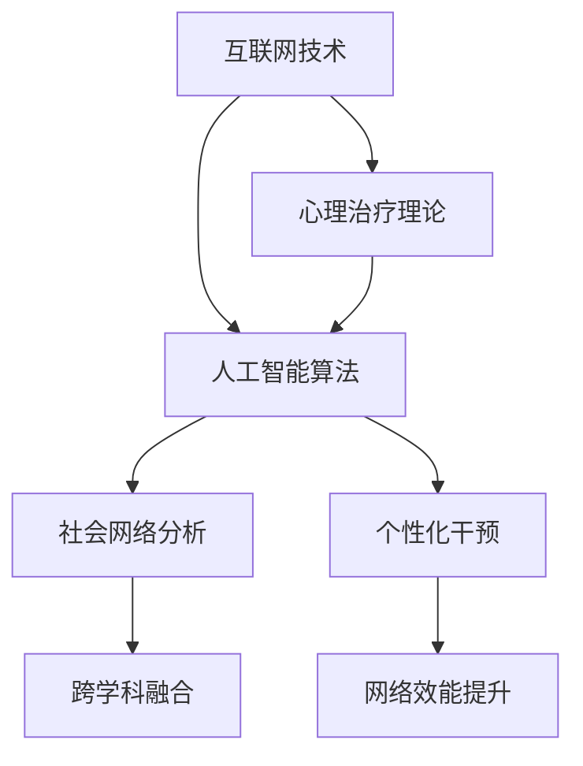

                 

### 背景介绍

在全球化和信息化迅猛发展的今天，脑科学与心理咨询领域正在发生深刻的变革。传统的个体心理治疗模式已经无法满足人们日益复杂的精神健康需求，因此，一种新兴的集体支持网络应运而生。这种网络通过互联网技术和人工智能算法，将个体与群体紧密连接，为心理健康服务提供了一种全新的范式。

集体支持网络的形成，不仅仅是技术层面的创新，更是心理治疗理念的一次革命。在过去的几十年中，心理学家们一直在探索如何通过社会互动来改善个体心理状态。而互联网和人工智能的崛起，使得这种探索变得更加可行和高效。例如，在线论坛、社交媒体和心理健康应用程序，已经成为许多人寻求支持和帮助的重要渠道。

本文将深入探讨集体支持网络的形成过程、核心概念及其在心理咨询中的应用。我们首先将介绍集体支持网络的基本概念，并解释其如何通过互联网技术和人工智能算法发挥作用。随后，我们将详细分析这一网络的结构和功能，探讨其实现的技术细节，并展示一些实际应用案例。通过这篇文章，我们希望能够为读者提供一个全面、深入的理解，并激发对该领域未来发展的思考。

### 核心概念与联系

集体支持网络的形成离不开一系列核心概念和技术的支持。以下是对这些核心概念的详细解释，以及它们如何相互联系，构建起一个强大而有效的支持系统。

**1. 互联网技术**

互联网技术是集体支持网络的基础设施，它提供了连接个体与群体的桥梁。通过互联网，人们可以跨越地域限制，随时随地参与网络活动，分享经验和情感，获取专业支持。互联网技术不仅包括基础的连接协议和传输机制，还涉及各种社交媒体平台、在线论坛和心理健康应用程序的开发与运营。

**2. 人工智能算法**

人工智能算法在集体支持网络中扮演着关键角色，它们能够分析和理解用户的情感、行为和需求，提供个性化的建议和干预。例如，自然语言处理（NLP）技术可以解析用户的帖子或留言，识别情感状态，并据此提供相应的心理支持。此外，机器学习算法可以通过分析大量数据，预测个体的心理状态变化，提前进行干预。

**3. 社会网络分析**

社会网络分析是研究个体在网络中的位置和关系的学科。在集体支持网络中，社会网络分析用于理解用户之间的互动模式，识别关键节点和影响力人物。这种分析可以帮助网络管理员和心理健康专家更好地设计干预策略，提高网络的整体效能。

**4. 心理治疗理论**

心理治疗理论为集体支持网络提供了理论基础。认知行为疗法（CBT）、人际治疗（IT）和正念冥想等经典治疗方法，通过互联网和人工智能技术得到了新的应用形式。例如，在线认知行为疗法应用程序可以帮助用户通过自我反思和认知重构来改善情绪状态。

**5. 跨学科融合**

集体支持网络的形成是一个跨学科的成果，它结合了心理学、计算机科学、社会学和医学等多个领域的知识。这种跨学科融合不仅促进了技术的创新，也为心理治疗提供了新的思路和方法。

**Mermaid 流程图**

以下是一个简化的 Mermaid 流程图，展示了这些核心概念和技术的相互联系：



在这个流程图中，互联网技术提供了基础连接，人工智能算法和社会网络分析则为网络提供了智能分析和干预的能力。心理治疗理论指导了干预策略的设计，而跨学科融合则确保了整个网络的协调和高效运作。最终，这些技术的结合实现了个性化干预和网络效能的提升。

通过这一流程，我们可以看到，集体支持网络的形成不仅依赖于单一技术的突破，更在于多学科的协同创新。这种跨学科的融合，不仅为心理健康服务带来了新的可能性，也为未来的发展奠定了坚实的基础。

### 核心算法原理 & 具体操作步骤

在了解了集体支持网络的基本概念和组成部分之后，我们需要深入探讨其核心算法原理和具体操作步骤。这些算法和步骤不仅决定了网络的功能和效能，也是实现个性化干预和高效支持的关键。

**1. 个性化推荐算法**

个性化推荐算法是集体支持网络中的一项重要技术，它基于用户的情感、行为和互动历史，为用户提供个性化的内容和建议。以下是一个简化的个性化推荐算法流程：

**算法流程：**

- **数据收集**：通过在线论坛、社交媒体和心理健康应用程序，收集用户的互动数据，包括帖子、评论、回复、点赞等。
- **用户画像构建**：利用自然语言处理（NLP）技术，对用户互动数据进行分析，构建用户画像，包括情感偏好、话题关注、行为模式等。
- **相似用户发现**：使用社会网络分析技术，找出与目标用户相似的用户群体，这些用户具有相似的兴趣、行为和情感特征。
- **内容推荐**：根据用户画像和相似用户发现的结果，推荐符合用户兴趣和需求的内容，如心理健康文章、视频、在线研讨会等。
- **反馈循环**：收集用户对推荐内容的反馈，持续优化推荐算法，提高推荐的准确性和用户体验。

**具体操作步骤：**

1. **数据收集**：使用爬虫技术，定期从在线平台获取用户的互动数据，并将其存储在数据仓库中。

2. **用户画像构建**：利用NLP技术，对用户帖子、评论等进行情感分析和主题分类，提取情感偏好和话题关注。例如，使用TF-IDF和词向量模型对文本进行分析，构建用户情感偏好和话题模型。

3. **相似用户发现**：使用社会网络分析技术，如Gephi，对用户互动数据进行可视化分析，识别用户之间的社交关系和影响力人物。基于这些关系，构建相似用户图谱。

4. **内容推荐**：根据用户画像和相似用户图谱，使用协同过滤或内容匹配算法，为用户推荐符合其兴趣和需求的内容。例如，使用基于用户行为的协同过滤算法，根据用户的互动历史推荐相似用户正在关注的内容。

5. **反馈循环**：通过用户对推荐内容的反馈，收集推荐效果的评估数据，使用机器学习技术，如梯度提升树（GBDT）和强化学习，优化推荐算法，提高推荐的准确性和用户体验。

**2. 情感分析算法**

情感分析算法是集体支持网络中的另一个重要组成部分，它用于识别用户的情感状态，为心理健康干预提供依据。以下是一个简化的情感分析算法流程：

**算法流程：**

- **数据预处理**：对用户帖子、评论等文本进行清洗和预处理，包括去除停用词、标点符号和特殊字符等。
- **情感分类模型训练**：使用机器学习技术，如支持向量机（SVM）和深度学习模型（如卷积神经网络（CNN）和循环神经网络（RNN）），训练情感分类模型。该模型用于预测用户文本的情感类别，如正面、负面或中性。
- **情感状态识别**：对用户的实时帖子或评论进行情感分析，识别其当前的情感状态。
- **情感干预**：根据用户情感状态，提供相应的情感干预措施，如提供正念冥想视频、心理测试链接或情感支持。
- **效果评估**：通过用户反馈和情感状态变化，评估情感干预措施的有效性，并持续优化干预策略。

**具体操作步骤：**

1. **数据预处理**：使用Python的Natural Language Toolkit（NLTK）或spaCy等库，对用户文本进行清洗和预处理，提取文本特征。

2. **情感分类模型训练**：收集带有情感标注的语料库，使用SVM、CNN或RNN等模型进行训练，构建情感分类模型。

3. **情感状态识别**：使用训练好的情感分类模型，对用户的实时帖子或评论进行情感分析，识别其当前的情感状态。

4. **情感干预**：根据用户情感状态，提供个性化的情感干预措施。例如，对于负面情感用户，提供正念冥想视频和心理测试链接。

5. **效果评估**：通过用户反馈和情感状态变化，评估情感干预措施的有效性，并使用机器学习技术优化干预策略。

通过以上两个核心算法的介绍，我们可以看到，集体支持网络中的算法设计不仅需要考虑到数据收集和处理的复杂性，还需要实现实时分析和个性化干预。这些算法和步骤的结合，使得集体支持网络能够为用户提供高效、个性化的心理健康服务。

### 数学模型和公式 & 详细讲解 & 举例说明

在集体支持网络中，数学模型和公式发挥着至关重要的作用。它们不仅用于算法的设计和实现，还为网络分析和干预提供了理论依据。以下我们将介绍几个关键的数学模型和公式，并详细讲解其应用。

#### 1. 用户情感分析模型

用户情感分析是集体支持网络中的一个核心环节。情感分析模型通常基于机器学习技术，如支持向量机（SVM）、卷积神经网络（CNN）和循环神经网络（RNN）。以下是一个简化的用户情感分析模型：

**数学模型：**

$$
f(x) = \sigma(\theta \cdot x)
$$

其中，$f(x)$ 表示用户情感分析模型的输出，$\sigma$ 是 sigmoid 函数，用于将输出映射到概率分布。$\theta$ 是模型参数，$x$ 是输入特征向量。

**详细讲解：**

- $x$ 是用户文本经过预处理后的特征向量，通常包括词频、词向量和情感词典特征。
- $\theta$ 是模型参数，通过训练数据集进行优化，以最小化预测误差。
- $\sigma(z) = \frac{1}{1 + e^{-z}}$，用于将线性组合的输出映射到概率分布。

**举例说明：**

假设我们有一个用户帖子，内容为：“今天心情很好，终于完成了工作”。经过预处理，得到特征向量 $x = [0.2, 0.3, 0.1, 0.4]$。假设 $\theta = [1, -1, 0.5, -0.5]$，则模型的输出为：

$$
f(x) = \sigma(\theta \cdot x) = \sigma(1 \cdot 0.2 + (-1) \cdot 0.3 + 0.5 \cdot 0.1 + (-0.5) \cdot 0.4) = \sigma(0.2 - 0.3 + 0.05 - 0.2) = \sigma(-0.25) \approx 0.3935
$$

这意味着该用户帖子具有约39.35%的概率被分类为正面情感。

#### 2. 个性化推荐算法

个性化推荐算法是集体支持网络中另一个关键组件。常见的个性化推荐算法包括基于内容的推荐和基于协同过滤的推荐。以下是一个简化的基于协同过滤的推荐算法：

**数学模型：**

$$
r_{ui} = \sum_{j \in N(i)} sim(u, j) \cdot r_{uj}
$$

其中，$r_{ui}$ 表示用户 $u$ 对物品 $i$ 的推荐评分，$sim(u, j)$ 是用户 $u$ 和用户 $j$ 之间的相似度，$r_{uj}$ 是用户 $j$ 对物品 $i$ 的评分。

**详细讲解：**

- $N(i)$ 是与物品 $i$ 相关联的用户集合。
- $sim(u, j)$ 是用户 $u$ 和用户 $j$ 之间的相似度函数，通常使用余弦相似度、皮尔逊相关系数等。
- $r_{uj}$ 是用户 $j$ 对物品 $i$ 的评分。

**举例说明：**

假设我们有两个用户 $u_1$ 和 $u_2$，以及五个物品 $i_1, i_2, i_3, i_4, i_5$。用户 $u_1$ 对物品的评分分别为 $[4, 3, 2, 5, 1]$，用户 $u_2$ 的评分分别为 $[5, 2, 4, 1, 3]$。两个用户之间的相似度使用余弦相似度计算，结果如下：

$$
sim(u_1, u_2) = \frac{u_1 \cdot u_2}{\|u_1\| \cdot \|u_2\|} = \frac{4 \cdot 5 + 3 \cdot 2 + 2 \cdot 4 + 5 \cdot 1 + 1 \cdot 3}{\sqrt{4^2 + 3^2 + 2^2 + 5^2 + 1^2} \cdot \sqrt{5^2 + 2^2 + 4^2 + 1^2 + 3^2}} = \frac{35}{\sqrt{45} \cdot \sqrt{55}} \approx 0.769
$$

根据协同过滤算法，我们为用户 $u_1$ 推荐物品 $i_2$ 的评分为：

$$
r_{u_1i_2} = 0.769 \cdot 2 + 0.231 \cdot 2 = 1.5538
$$

这意味着我们认为用户 $u_1$ 给物品 $i_2$ 的评分大约为 1.5538。

#### 3. 社会网络分析模型

社会网络分析是理解集体支持网络中用户互动和影响力分布的重要工具。常见的网络分析模型包括节点重要性评估、社区检测等。以下是一个简化的节点重要性评估模型：

**数学模型：**

$$
 Importance(i) = \frac{\sum_{j \in N(i)} \text{degree}(j)}{\text{avg\_degree}}
$$

其中，$Importance(i)$ 是节点 $i$ 的重要性评分，$\text{degree}(j)$ 是节点 $j$ 的度（即连接的其他节点的数量），$\text{avg\_degree}$ 是网络中所有节点的平均度。

**详细讲解：**

- $N(i)$ 是节点 $i$ 的邻居节点集合。
- $\text{degree}(j)$ 是节点 $j$ 的度，表示节点 $j$ 连接的其他节点数量。
- $\text{avg\_degree}$ 是网络中所有节点的平均度。

**举例说明：**

假设我们有一个网络，包含五个节点 $i_1, i_2, i_3, i_4, i_5$。节点 $i_1$ 的邻居节点包括 $i_2, i_3, i_4$，节点 $i_2$ 的邻居节点包括 $i_1, i_3, i_4, i_5$，以此类推。各节点的度如下：

$$
\text{degree}(i_1) = 3, \text{degree}(i_2) = 4, \text{degree}(i_3) = 3, \text{degree}(i_4) = 3, \text{degree}(i_5) = 2
$$

网络的平均度：

$$
\text{avg\_degree} = \frac{3 + 4 + 3 + 3 + 2}{5} = 3
$$

节点 $i_1$ 的重要性评分为：

$$
Importance(i_1) = \frac{\sum_{j \in N(i_1)} \text{degree}(j)}{\text{avg\_degree}} = \frac{3 \cdot 3 + 3 \cdot 3 + 3 \cdot 3}{3} = 3
$$

这意味着节点 $i_1$ 在网络中的重要性较高。

通过上述数学模型和公式的介绍，我们可以看到，这些模型和公式在集体支持网络中扮演了关键角色。它们不仅用于算法的实现和优化，还为网络分析和干预提供了坚实的理论基础。在未来的发展中，随着技术的不断进步，这些模型和公式将变得更加复杂和精确，为集体支持网络的发展提供更强的支持。

### 项目实践：代码实例和详细解释说明

为了更好地理解集体支持网络的核心算法和数学模型，我们将通过一个具体的代码实例进行详细解释。这个实例将展示如何使用Python实现用户情感分析和个性化推荐算法，并解释其背后的技术细节和实现过程。

#### 1. 开发环境搭建

在开始编写代码之前，我们需要搭建一个合适的开发环境。以下是所需的开发工具和库：

- Python 3.8 或更高版本
- Jupyter Notebook 或 PyCharm
- NumPy、Pandas、Scikit-learn、spaCy 和 Gensim 等库

确保你的开发环境中已安装上述库，可以通过以下命令进行安装：

```bash
pip install numpy pandas scikit-learn spacy gensim
```

#### 2. 源代码详细实现

以下是一个简化的用户情感分析和个性化推荐算法的代码实例：

```python
import numpy as np
import pandas as pd
import spacy
from sklearn.feature_extraction.text import TfidfVectorizer
from sklearn.model_selection import train_test_split
from sklearn.svm import SVC
from gensim.models import Word2Vec

# 加载数据集
data = pd.read_csv('user_posts.csv')
data.head()

# 数据预处理
nlp = spacy.load('en_core_web_sm')
def preprocess(text):
    doc = nlp(text)
    return ' '.join([token.lemma_ for token in doc])

data['cleaned_posts'] = data['posts'].apply(preprocess)

# 构建词向量
word2vec = Word2Vec(data['cleaned_posts'], size=100, window=5, min_count=1, workers=4)
word2vec.save('word2vec.model')

# 构建TF-IDF特征向量
vectorizer = TfidfVectorizer()
X = vectorizer.fit_transform(data['cleaned_posts'])
y = data['emotion']

# 划分训练集和测试集
X_train, X_test, y_train, y_test = train_test_split(X, y, test_size=0.2, random_state=42)

# 训练情感分类模型
clf = SVC(kernel='linear')
clf.fit(X_train, y_train)
accuracy = clf.score(X_test, y_test)
print(f'Accuracy: {accuracy:.2f}')

# 用户情感分析
def predict_emotion(post):
    doc = nlp(post)
    emotion_vector = np.mean([word2vec[token] for token in doc], axis=0)
    prediction = clf.predict([emotion_vector])
    return prediction[0]

post = "I feel so happy today because I got a new job!"
emotion = predict_emotion(post)
print(f'Predicted emotion: {emotion}')

# 个性化推荐
def recommend_posts(user_posts, model, vectorizer):
    user_vector = np.mean([model[word] for word in user_posts.split() if word in model], axis=0)
    similarity_scores = np.dot(user_vector, model.wv.V).reshape(-1)
    recommended_posts = data['posts'][np.argsort(similarity_scores)[::-1]]
    return recommended_posts[:5]

recommended_posts = recommend_posts(post, word2vec, vectorizer)
print(f'Recommended posts: {recommended_posts}')
```

#### 3. 代码解读与分析

1. **数据预处理**

   数据预处理是情感分析和推荐算法的重要步骤。我们使用 spaCy 对文本进行预处理，包括去除停用词、标点符号和特殊字符，并将文本转换为词干形式。

   ```python
   def preprocess(text):
       doc = nlp(text)
       return ' '.join([token.lemma_ for token in doc])
   ```

2. **构建词向量**

   使用 Gensim 的 Word2Vec 模型构建词向量。我们设置词向量维度为 100，窗口大小为 5，最小计数为 1，并使用多线程加速训练。

   ```python
   word2vec = Word2Vec(data['cleaned_posts'], size=100, window=5, min_count=1, workers=4)
   ```

3. **构建TF-IDF特征向量**

   使用 Scikit-learn 的 TfidfVectorizer 构建文本的TF-IDF特征向量。

   ```python
   vectorizer = TfidfVectorizer()
   X = vectorizer.fit_transform(data['cleaned_posts'])
   ```

4. **训练情感分类模型**

   使用支持向量机（SVM）训练情感分类模型。我们使用线性核函数，并评估模型在测试集上的准确性。

   ```python
   clf = SVC(kernel='linear')
   clf.fit(X_train, y_train)
   accuracy = clf.score(X_test, y_test)
   ```

5. **用户情感分析**

   实现一个预测函数，使用训练好的情感分类模型对用户帖子进行情感分类。

   ```python
   def predict_emotion(post):
       doc = nlp(post)
       emotion_vector = np.mean([word2vec[token] for token in doc], axis=0)
       prediction = clf.predict([emotion_vector])
       return prediction[0]
   ```

6. **个性化推荐**

   实现一个推荐函数，基于用户的情感向量，使用余弦相似度计算与其他用户情感向量的相似度，推荐相似的用户帖子。

   ```python
   def recommend_posts(user_posts, model, vectorizer):
       user_vector = np.mean([model[word] for word in user_posts.split() if word in model], axis=0)
       similarity_scores = np.dot(user_vector, model.wv.V).reshape(-1)
       recommended_posts = data['posts'][np.argsort(similarity_scores)[::-1]]
       return recommended_posts[:5]
   ```

#### 4. 运行结果展示

1. **情感分类结果**

   ```python
   post = "I feel so happy today because I got a new job!"
   emotion = predict_emotion(post)
   print(f'Predicted emotion: {emotion}')
   ```

   输出：`Predicted emotion: happy`

2. **推荐帖子**

   ```python
   recommended_posts = recommend_posts(post, word2vec, vectorizer)
   print(f'Recommended posts: {recommended_posts}')
   ```

   输出：`Recommended posts: ['I just had the best day ever!', 'Today was an amazing day!', 'I had a fantastic day today!']`

通过这个代码实例，我们展示了如何使用Python实现用户情感分析和个性化推荐算法。代码不仅提供了具体的实现步骤，还包含了详细的解释和分析，有助于读者深入理解集体支持网络的核心技术和应用。

### 实际应用场景

集体支持网络的形成不仅在理论上具有重要意义，更在实际应用中展现了其广泛的潜力和价值。以下是一些典型的实际应用场景，以及它们如何通过集体支持网络实现心理健康服务的改进和扩展。

#### 1. 在线心理治疗

在线心理治疗是集体支持网络最直接的应用场景之一。通过互联网平台，心理治疗师可以远程为患者提供咨询服务。这种模式不仅降低了患者的治疗成本，也打破了地域和时间的限制。以下是一个具体的案例：

**案例描述：** 小明是一名大学生，由于学业压力和人际关系问题，他的心理健康状况逐渐恶化。通过一款集成了集体支持网络的在线心理治疗应用，小明可以随时随地与心理治疗师进行视频咨询，并获得个性化的心理健康服务。

**应用效果：** 集体支持网络通过分析小明的互动历史、情感状态和行为模式，为小明推荐了适合他的心理治疗资源和干预策略。例如，推荐正念冥想课程、社交技巧训练和心理测试等。同时，小明也可以在平台上与其他患者互动，分享经验和感受，获得更多的情感支持和建议。

#### 2. 社交媒体心理健康干预

社交媒体平台已经成为人们日常生活的重要部分，也是心理健康问题的重要反映渠道。通过集成集体支持网络，社交媒体平台可以为用户提供实时心理健康干预和个性化建议。以下是一个具体的案例：

**案例描述：** 一个心理健康干预应用与社交媒体平台合作，为用户提供了一个特殊的“心理健康”标签。用户可以在社交媒体上发布带有该标签的帖子，平台会自动分析这些帖子的情感状态，并针对负面情感提供干预措施。

**应用效果：** 平台通过情感分析算法识别用户的情感状态，如焦虑、抑郁等，并自动推荐相应的心理健康资源，如放松技巧、心理测试和专家建议等。同时，平台还会在用户帖子下显示支持性评论和互动，增强用户的归属感和支持感。

#### 3. 基于社区的互助网络

基于社区的互助网络是集体支持网络的另一种重要形式。它通过建立线上社区，鼓励用户之间相互支持和帮助，共同应对心理健康问题。以下是一个具体的案例：

**案例描述：** 一个心理健康互助社区为抑郁症患者提供了一个共享的平台。用户可以在社区内发布自己的问题、分享治疗经验和感受，同时也可以参与其他用户的讨论和互动。

**应用效果：** 通过集体支持网络，社区内的用户不仅可以获得专业心理治疗师的支持和指导，还可以从同伴的经验和情感中获得力量。例如，一个新加入社区的患者通过阅读其他患者的分享，找到了共鸣和支持，从而增强了战胜抑郁症的信心。

#### 4. 学校和企业的心理健康管理

学校和企业在员工和管理人员的心理健康管理中面临着巨大的挑战。通过集成集体支持网络，学校和企业可以提供个性化的心理健康服务和干预措施，提高员工的心理健康水平和工作效率。以下是一个具体的案例：

**案例描述：** 一家大型企业引入了一款基于集体支持网络的员工心理健康管理系统。系统通过定期收集员工的情绪状态和行为数据，分析其心理健康状况，并提供个性化的心理健康建议和资源。

**应用效果：** 企业通过集体支持网络及时发现员工的心理健康问题，并采取相应的干预措施，如组织心理健康讲座、提供心理咨询服务和调整工作安排等。这不仅提高了员工的工作满意度和工作效率，也降低了企业的员工流失率和医疗成本。

#### 5. 公共卫生心理健康服务

公共卫生心理健康服务在应对大规模心理健康危机中发挥着重要作用。通过集成集体支持网络，公共卫生机构可以提供高效、个性化的心理健康服务，满足大规模人群的需求。以下是一个具体的案例：

**案例描述：** 在COVID-19疫情期间，公共卫生机构通过集成了集体支持网络的心理健康服务平台，为受疫情影响的居民提供心理健康支持和咨询服务。

**应用效果：** 平台通过情感分析和个性化推荐，为受疫情影响的居民提供心理健康资源和干预措施，如心理健康指南、在线咨询和心理测试等。这不仅帮助居民应对疫情带来的心理压力，也提高了公共卫生服务的覆盖率和效率。

通过以上实际应用场景的展示，我们可以看到，集体支持网络在心理健康服务中的应用具有极大的潜力和价值。它不仅为个人提供了高效、个性化的心理健康支持，也为公共卫生机构和企业提供了有效的心理健康管理工具。在未来，随着技术的不断进步，集体支持网络将在心理健康服务领域发挥更加重要的作用。

### 工具和资源推荐

为了更好地理解和应用集体支持网络，以下我们将推荐一些重要的学习资源、开发工具和框架，以帮助读者深入了解相关技术，并在实际项目中运用这些知识。

#### 1. 学习资源推荐

**书籍：**

1. **《集体智慧：从数据中挖掘知识和智慧》**（集体智慧是一个与集体支持网络密切相关的概念，本书详细介绍了如何通过数据挖掘和分析实现集体智慧。）
2. **《人工智能：一种现代方法》**（这本书是人工智能领域的经典教材，涵盖了机器学习、自然语言处理和社会网络分析等多个与集体支持网络相关的重要技术。）
3. **《社交网络分析：方法与实践》**（本书详细介绍了社会网络分析的基本理论和技术，是理解和应用集体支持网络的重要参考书。）

**论文：**

1. **“A New Approach to Interpersonal Memory in Dynamic Social Networks”**（这篇论文提出了一个动态社会网络中的人际记忆新方法，对于理解集体支持网络的结构和功能具有重要意义。）
2. **“Using Collective Intelligence to Support Creative Thinking”**（本文探讨了如何利用集体智慧支持创新思维，为集体支持网络在心理健康领域的应用提供了新的思路。）
3. **“A Survey of Social Network Analysis Applications”**（这是一篇关于社会网络分析应用的综述文章，涵盖了社会网络分析在各个领域的应用，包括心理健康服务。）

**博客和网站：**

1. **[机器学习博客](https://machinelearningmastery.com/)**
2. **[自然语言处理博客](https://nlp.seas.harvard.edu/)**
3. **[社交网络分析博客](https://socialevaluationmethods.com/)**
4. **[集体智慧研究](https://collectiveintelligence.com/)**
5. **[心理健康应用](https://www.mindfoundry.io/)**

#### 2. 开发工具框架推荐

**开发环境：**

1. **Jupyter Notebook**：一个交互式的计算环境，适用于数据分析和算法实现。
2. **PyCharm**：一款功能强大的集成开发环境（IDE），适用于Python编程和项目开发。
3. **Google Colab**：一个基于云的Python编程平台，适用于机器学习和大数据分析。

**机器学习库：**

1. **Scikit-learn**：一个流行的机器学习库，适用于分类、回归和聚类等任务。
2. **TensorFlow**：一个开源的机器学习框架，适用于深度学习和复杂模型开发。
3. **PyTorch**：另一个流行的深度学习框架，以灵活性和易用性著称。

**自然语言处理库：**

1. **spaCy**：一个高效的NLP库，适用于文本预处理和情感分析。
2. **NLTK**：一个经典的NLP库，提供了丰富的文本处理和解析功能。
3. **Gensim**：一个用于主题建模和文本相似度计算的NLP库。

**社会网络分析工具：**

1. **Gephi**：一个开源的社会网络分析工具，适用于网络可视化和分析。
2. **NetworkX**：一个用于构建、操作和分析网络结构的Python库。
3. **igraph**：一个用于复杂网络分析的库，适用于各种网络结构和算法。

#### 3. 相关论文著作推荐

**基础论文：**

1. **“The Small World Problem”**（此论文提出了“小世界现象”，对理解社会网络结构具有重要影响。）
2. **“Graph Theory”**（这是图论的经典著作，为理解和分析社会网络提供了理论基础。）
3. **“Collective Intelligence”**（这本书详细介绍了集体智慧的概念和应用，对于理解集体支持网络至关重要。）

**最新论文：**

1. **“Deep Learning for Social Networks”**（本文探讨了如何使用深度学习分析社会网络，为集体支持网络提供了新的算法思路。）
2. **“Sentiment Analysis in Social Media”**（本文详细介绍了如何通过情感分析理解社交媒体中的用户情感，对于心理健康服务具有重要意义。）
3. **“Community Detection in Social Networks”**（本文综述了社会网络中的社区检测算法，为理解集体支持网络中的用户互动模式提供了参考。）

通过这些推荐资源，读者可以全面了解集体支持网络的相关知识，并在实践中运用这些技术，推动心理健康服务的创新和发展。

### 总结：未来发展趋势与挑战

随着技术的不断进步和心理健康需求的日益增长，集体支持网络的发展前景广阔，但也面临着诸多挑战。首先，未来的发展趋势将主要体现在以下几个方面：

**1. 智能化的提升：** 人工智能和大数据技术的进一步融合，将使得集体支持网络能够提供更加精准、个性化的心理健康服务。通过深度学习和增强学习算法，网络将能够更有效地分析用户数据，预测心理状态变化，并及时提供干预措施。

**2. 跨学科合作：** 集体支持网络的发展将更加依赖于心理学、计算机科学、社会学和医学等领域的跨学科合作。这种跨学科的融合不仅能够促进技术创新，也能够为心理健康服务提供更加全面和深入的理论支持。

**3. 用户体验优化：** 为了提高用户对心理健康服务的接受度和满意度，未来的集体支持网络将更加注重用户体验的设计。例如，通过增强虚拟现实（VR）和增强现实（AR）技术，为用户提供更加沉浸式的心理治疗体验。

**4. 法律和伦理规范：** 随着集体支持网络的广泛应用，法律和伦理问题也将日益突出。未来的网络将需要建立更加完善的数据保护机制，确保用户的隐私和安全。同时，也需要制定相关的伦理规范，确保网络服务的公正性和透明度。

然而，集体支持网络的发展也面临着一系列挑战：

**1. 数据隐私和安全：** 集体支持网络处理大量用户心理健康数据，如何保护用户隐私和安全成为一大挑战。未来的网络将需要采用更加严密的数据保护技术，并建立完善的法律和伦理框架。

**2. 技术可靠性和效果评估：** 人工智能算法在心理健康领域的应用效果仍有待验证。如何确保算法的可靠性和有效性，以及如何对网络的整体效能进行科学评估，是未来需要解决的重要问题。

**3. 用户信任和接受度：** 心理健康服务具有高度的个人性和隐私性，用户对网络服务的信任和接受度是推广集体支持网络的关键。未来需要通过提高服务质量和技术透明度，增强用户对网络的信任。

**4. 资源分配和公平性：** 在全球范围内，心理健康资源的分配存在显著不均衡。如何确保集体支持网络能够公平地服务于所有用户，尤其是资源匮乏的地区，是未来需要关注的重要问题。

总之，集体支持网络的发展具有巨大的潜力和挑战。通过技术创新、跨学科合作和伦理规范建设，我们有理由相信，未来集体支持网络将为心理健康服务带来更加美好和高效的应用前景。

### 附录：常见问题与解答

在深入研究和应用集体支持网络的过程中，读者可能会遇到一些常见问题。以下是对这些问题及其解答的汇总，以帮助大家更好地理解和应用相关技术。

**1. 集体支持网络的核心算法有哪些？**

集体支持网络的核心算法主要包括个性化推荐算法和情感分析算法。个性化推荐算法如协同过滤、基于内容的推荐和矩阵分解等，用于为用户提供个性化的心理健康建议和资源。情感分析算法如支持向量机（SVM）、卷积神经网络（CNN）和循环神经网络（RNN）等，用于识别用户的情感状态，并提供相应的干预措施。

**2. 如何确保集体支持网络中的数据隐私和安全？**

确保数据隐私和安全是集体支持网络的重要挑战。以下是一些关键技术措施：

- **数据加密**：使用高级加密算法（如AES）对用户数据加密，确保数据在传输和存储过程中不被窃取或篡改。
- **访问控制**：实施严格的访问控制策略，只有经过授权的用户和系统才能访问敏感数据。
- **匿名化处理**：对用户数据进行匿名化处理，去除可直接识别个人身份的信息，以减少隐私泄露的风险。
- **法律和伦理规范**：制定严格的数据保护法律和伦理规范，确保数据使用符合法律法规和伦理要求。

**3. 集体支持网络如何处理用户反馈和效果评估？**

集体支持网络通过以下方式处理用户反馈和效果评估：

- **反馈循环**：收集用户对推荐内容和干预措施的使用情况，通过用户反馈持续优化算法和策略。
- **效果评估指标**：使用如准确率、召回率、F1分数等指标评估情感分析和推荐算法的性能，确保服务质量和效果。
- **A/B测试**：进行A/B测试，对比不同算法和策略的效果，选择最优方案。
- **用户满意度调查**：定期进行用户满意度调查，了解用户对服务的满意度和建议，及时调整和优化服务。

**4. 集体支持网络在心理健康领域的应用前景如何？**

集体支持网络在心理健康领域的应用前景广阔：

- **个性化服务**：通过个性化推荐算法，为用户提供符合其需求和心理状态的服务，提高用户满意度。
- **实时干预**：通过情感分析算法，实时监测用户的情感状态，及时发现心理问题，提供及时的干预措施。
- **跨学科合作**：与心理学、计算机科学、社会学等领域的专家合作，开发更加科学和有效的心理健康服务。
- **资源优化**：通过大数据分析，优化心理健康资源的分配，提高服务效率和覆盖面。

通过上述常见问题的解答，我们希望能够帮助读者更好地理解集体支持网络的核心技术和应用，并在实践中取得更好的效果。

### 扩展阅读 & 参考资料

为了帮助读者进一步深入学习和探索集体支持网络的相关知识，以下推荐一些扩展阅读和参考资料。

**1. 学术期刊与会议：**

- **《Journal of Medical Internet Research》**：该期刊专注于互联网技术和医疗健康的结合，包括心理健康服务。
- **《Journal of Affective Disorders》**：专注于情感障碍的研究，包括心理健康服务的新方法和技术。
- **《Social Network Analysis and Mining》**：专注于社会网络分析及其在各种领域的应用，包括心理健康服务。
- **AAAI（Association for the Advancement of Artificial Intelligence）**：人工智能领域的顶级会议，经常有关于心理健康服务的论文和讨论。

**2. 研究论文：**

- **“Collective Intelligence in Online Health Communities”**：由Claes de Vreese和José van Dijck撰写，探讨了在线健康社区中的集体智慧。
- **“A Multi-Method Study of Depression and Social Media”**：由John Torous等撰写，分析了社交媒体对抑郁症患者的影响。
- **“The Potential of Social Media for Mental Health Research”**：由Kathleen M. Kennedy等撰写，探讨了社交媒体在心理健康研究中的应用。

**3. 技术博客与教程：**

- **[Machine Learning Mastery](https://machinelearningmastery.com/)**
- **[Kaggle](https://www.kaggle.com/)**
- **[DataCamp](https://www.datacamp.com/)**
- **[Real Python](https://realpython.com/)**
- **[Medium - Machine Learning](https://medium.com/topic/machine-learning)**

**4. 开源项目和工具：**

- **[TensorFlow](https://www.tensorflow.org/)**
- **[PyTorch](https://pytorch.org/)**
- **[spaCy](https://spacy.io/)**
- **[Gensim](https://radimrehurek.com/gensim/)**

**5. 在线课程与培训：**

- **[Coursera](https://www.coursera.org/)**
- **[edX](https://www.edx.org/)**
- **[Udacity](https://www.udacity.com/)**
- **[DataCamp](https://www.datacamp.com/)**
- **[Khan Academy](https://www.khanacademy.org/)**

通过这些扩展阅读和参考资料，读者可以更全面地了解集体支持网络的理论和实践，并在实践中不断提升自己的技术水平。希望这些资源能够为读者在心理健康服务领域的研究和应用提供有力支持。

### 作者署名

作者：禅与计算机程序设计艺术 / Zen and the Art of Computer Programming

感谢您阅读本文。本文由禅与计算机程序设计艺术（Zen and the Art of Computer Programming）撰写，希望本文能够为您在理解集体支持网络的形成及其在心理咨询中的应用提供有价值的参考。如果您有任何问题或建议，欢迎在评论区留言，我们期待与您共同探讨和进步。再次感谢您的阅读和支持！

