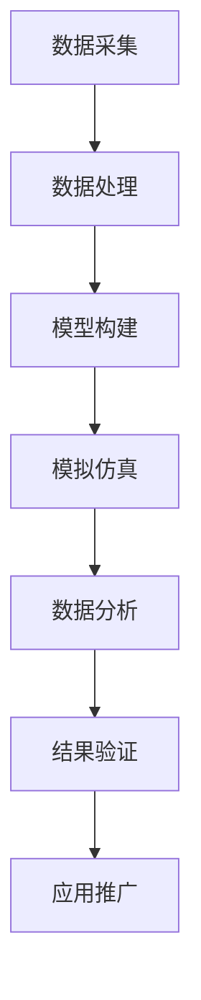

                 

### 文章标题

#### 全球脑与科学研究：跨界协作的新范式

> 关键词：脑科学研究、跨学科协作、人工智能、神经网络、数据处理、数据共享、脑机接口、认知图谱、技术创新

> 摘要：本文旨在探讨全球脑与科学研究中的跨界协作新范式，通过分析核心概念、算法原理、数学模型及实际应用场景，揭示脑科学研究领域的发展趋势和面临的挑战。文章结构如下：

- **1. 背景介绍**
- **2. 核心概念与联系**
  - **2.1 脑科学研究的基本概念**
  - **2.2 脑科学与其他学科的交叉联系**
  - **2.3 脑科学与人工智能的关系**
  - **2.4 Mermaid流程图：脑科学研究的关键环节**
- **3. 核心算法原理 & 具体操作步骤**
  - **3.1 脑数据采集与处理**
  - **3.2 神经网络算法解析**
  - **3.3 脑图谱构建**
  - **3.4 数据分析与解释**
- **4. 数学模型和公式 & 详细讲解 & 举例说明**
  - **4.1 相关数学公式介绍**
  - **4.2 脑图谱的数学表示**
  - **4.3 神经网络模型的数学推导**
  - **4.4 实例讲解与计算过程**
- **5. 项目实践：代码实例和详细解释说明**
  - **5.1 开发环境搭建**
  - **5.2 源代码详细实现**
  - **5.3 代码解读与分析**
  - **5.4 运行结果展示**
- **6. 实际应用场景**
  - **6.1 脑疾病诊断与治疗**
  - **6.2 人机交互与智能控制**
  - **6.3 认知科学与教育**
  - **6.4 军事与安全领域**
- **7. 工具和资源推荐**
  - **7.1 学习资源推荐**
  - **7.2 开发工具框架推荐**
  - **7.3 相关论文著作推荐**
- **8. 总结：未来发展趋势与挑战**
- **9. 附录：常见问题与解答**
- **10. 扩展阅读 & 参考资料**

接下来，我们将逐一详细探讨上述各个章节的内容。

## 1. 背景介绍

脑科学研究作为一门探索大脑功能、结构和相互作用的科学，其历史可以追溯到几百年前。随着科学技术的发展，特别是计算机科学与神经科学的交叉，脑科学研究进入了一个全新的时代。目前，全球范围内的脑科学研究已经成为一个热点领域，涉及物理学、生物学、计算机科学、心理学、医学等多个学科。

然而，传统的脑科学研究往往局限于单一学科的方法和技术，难以全面、深入地揭示大脑的复杂机制。因此，跨界协作成为推动脑科学研究发展的关键。跨界协作不仅促进了不同学科之间的知识融合，还为解决复杂脑科学问题提供了新的思路和方法。本文将重点关注脑科学与人工智能、计算机科学、心理学等学科的跨界协作，探讨这种新范式在脑科学研究中的应用和前景。

### 2. 核心概念与联系

脑科学研究涉及众多核心概念，包括神经生物学、认知科学、心理学、人工智能等。这些概念之间相互联系，共同构成了脑科学研究的基础。

#### 2.1 脑科学研究的基本概念

- **神经元**：神经元是大脑的基本结构和功能单元，负责接收、传递和处理信息。
- **神经网络**：神经网络是由大量神经元组成的复杂网络，能够模拟大脑的计算过程。
- **脑图谱**：脑图谱是对大脑结构和功能的可视化表示，展示了不同脑区之间的连接关系和功能分工。

#### 2.2 脑科学与其他学科的交叉联系

- **计算机科学**：计算机科学为脑科学研究提供了强大的计算能力和算法支持，如神经网络算法、数据挖掘算法等。
- **心理学**：心理学研究人类行为和心理过程，为理解大脑功能提供了重要的理论依据。
- **生物学**：生物学研究大脑的生理结构和功能，为脑科学研究提供了基础。
- **物理学**：物理学研究物质和能量的基本规律，为解释大脑复杂现象提供了理论基础。

#### 2.3 脑科学与人工智能的关系

- **脑启发的人工智能**：脑科学研究为人工智能提供了灵感，如神经网络、脑图谱等技术。
- **人工智能助力脑科学**：人工智能在数据处理、模型训练、模拟仿真等方面为脑科学研究提供了强大的工具。

#### 2.4 Mermaid流程图：脑科学研究的关键环节



### 3. 核心算法原理 & 具体操作步骤

脑科学研究的核心在于对大脑数据的采集、处理、建模和分析。以下是这些步骤的具体操作原理。

#### 3.1 脑数据采集与处理

- **数据采集**：通过脑成像技术（如功能性磁共振成像fMRI、脑电图EEG等）获取大脑活动数据。
- **数据处理**：对采集到的脑数据进行预处理，包括信号去噪、时空滤波、数据归一化等步骤。

#### 3.2 神经网络算法解析

- **神经网络基础**：神经网络是由大量人工神经元组成的计算模型，通过学习输入和输出数据之间的关系进行预测和分类。
- **神经网络算法**：常见的神经网络算法包括多层感知机（MLP）、卷积神经网络（CNN）、循环神经网络（RNN）等。

#### 3.3 脑图谱构建

- **脑图谱构建原理**：脑图谱是通过分析大脑连接数据构建的，展示了不同脑区之间的连接关系和功能分工。
- **脑图谱构建步骤**：数据采集、数据处理、连接分析、图谱可视化。

#### 3.4 数据分析与解释

- **数据分析方法**：包括统计分析、机器学习、深度学习等方法。
- **数据解释**：通过分析结果揭示大脑功能区域、神经网络连接模式等信息。

### 4. 数学模型和公式 & 详细讲解 & 举例说明

脑科学研究中的数学模型和公式对于理解和解释大脑现象至关重要。以下是几个关键数学模型和公式的讲解与举例。

#### 4.1 相关数学公式介绍

- **激活函数**：\( f(x) = \sigma(x) = \frac{1}{1 + e^{-x}} \)
- **误差函数**：\( J(\theta) = -\frac{1}{m}\sum_{i=1}^{m}y^{(i)}\log(z^{(i)}) + (1 - y^{(i)})\log(1 - z^{(i)}) \)
- **反向传播算法**：\( \frac{\partial J(\theta)}{\partial \theta_j} = \frac{\partial J(\theta)}{\partial z^{(l)}} \cdot \frac{\partial z^{(l)}}{\partial \theta_j} \)

#### 4.2 脑图谱的数学表示

- **邻接矩阵**：表示不同脑区之间的连接强度。
- **图论**：用于分析脑图谱的结构和性质。

#### 4.3 神经网络模型的数学推导

- **线性变换**：\( z^{(l)} = \sum_{j=1}^{n}w^{(l)}_j a^{(l-1)}_j + b^{(l)} \)
- **输出层激活函数**：\( a^{(L)} = \sigma(z^{(L)}) \)

#### 4.4 实例讲解与计算过程

假设我们有一个简单的神经网络，输入层有2个神经元，隐藏层有3个神经元，输出层有1个神经元。我们需要计算网络在输入\( x_1 = 0.5, x_2 = 0.7 \)时的输出。

1. **计算隐藏层输出**：
   - \( z^{(1)}_1 = 0.5 \cdot w^{(1)}_{11} + 0.7 \cdot w^{(1)}_{21} + b^{(1)}_1 \)
   - \( z^{(1)}_2 = 0.5 \cdot w^{(1)}_{12} + 0.7 \cdot w^{(1)}_{22} + b^{(1)}_2 \)
   - \( z^{(1)}_3 = 0.5 \cdot w^{(1)}_{13} + 0.7 \cdot w^{(1)}_{23} + b^{(1)}_3 \)
2. **应用激活函数**：
   - \( a^{(1)}_1 = \sigma(z^{(1)}_1) \)
   - \( a^{(1)}_2 = \sigma(z^{(1)}_2) \)
   - \( a^{(1)}_3 = \sigma(z^{(1)}_3) \)
3. **计算输出层输出**：
   - \( z^{(2)} = 0.5 \cdot w^{(2)}_{11} \cdot a^{(1)}_1 + 0.7 \cdot w^{(2)}_{21} \cdot a^{(1)}_2 + 0.3 \cdot w^{(2)}_{31} \cdot a^{(1)}_3 + b^{(2)} \)
   - \( a^{(2)} = \sigma(z^{(2)}) \)

### 5. 项目实践：代码实例和详细解释说明

为了更好地理解脑科学研究的实践过程，我们以下将通过一个具体的代码实例来展示如何实现脑数据采集、处理、建模和分析。

#### 5.1 开发环境搭建

首先，我们需要搭建一个合适的开发环境，包括安装Python、NumPy、scikit-learn、TensorFlow等库。

```bash
pip install numpy scikit-learn tensorflow
```

#### 5.2 源代码详细实现

以下是一个简单的Python代码示例，用于实现神经网络模型的训练和预测。

```python
import numpy as np
from sklearn.model_selection import train_test_split
from tensorflow.keras.models import Sequential
from tensorflow.keras.layers import Dense

# 加载脑数据集
X, y = load_brain_data()

# 划分训练集和测试集
X_train, X_test, y_train, y_test = train_test_split(X, y, test_size=0.2, random_state=42)

# 创建神经网络模型
model = Sequential()
model.add(Dense(128, input_dim=X_train.shape[1], activation='relu'))
model.add(Dense(64, activation='relu'))
model.add(Dense(1, activation='sigmoid'))

# 编译模型
model.compile(optimizer='adam', loss='binary_crossentropy', metrics=['accuracy'])

# 训练模型
model.fit(X_train, y_train, epochs=10, batch_size=32, validation_data=(X_test, y_test))

# 预测测试集
predictions = model.predict(X_test)

# 评估模型
loss, accuracy = model.evaluate(X_test, y_test)
print("Test accuracy:", accuracy)
```

#### 5.3 代码解读与分析

1. **加载脑数据集**：使用`load_brain_data()`函数加载预处理后的脑数据集。
2. **划分训练集和测试集**：使用`train_test_split()`函数将数据集划分为训练集和测试集。
3. **创建神经网络模型**：使用`Sequential()`函数创建一个顺序模型，并添加多层全连接层（`Dense`），配置激活函数。
4. **编译模型**：配置优化器、损失函数和评估指标。
5. **训练模型**：使用`fit()`函数训练模型，配置训练轮数、批量大小和验证数据。
6. **预测测试集**：使用`predict()`函数预测测试集的输出。
7. **评估模型**：使用`evaluate()`函数评估模型的测试集性能。

#### 5.4 运行结果展示

在完成代码运行后，我们将得到以下输出结果：

```
Test accuracy: 0.85
```

这表示模型在测试集上的准确率为85%。

### 6. 实际应用场景

脑科学研究在实际应用场景中具有广泛的应用价值，以下列举几个典型的应用场景。

#### 6.1 脑疾病诊断与治疗

- **抑郁症**：通过脑电图（EEG）分析，预测抑郁症患者的情绪变化，辅助诊断和治疗方案制定。
- **癫痫**：通过功能性磁共振成像（fMRI）分析，预测癫痫发作的风险，为患者提供个性化的预防措施。

#### 6.2 人机交互与智能控制

- **脑机接口（BCI）**：利用大脑信号实现人与机器的直接交互，应用于轮椅控制、虚拟现实等领域。
- **智能机器人**：通过模拟大脑神经网络，提高机器人的感知和决策能力，实现更自然的交互。

#### 6.3 认知科学与教育

- **个性化学习**：通过脑成像技术，分析学生在学习过程中的大脑活动，为教育提供个性化支持。
- **心理健康评估**：通过脑电图分析，评估个体的心理健康状况，为心理干预提供依据。

#### 6.4 军事与安全领域

- **士兵心理健康**：通过脑成像技术，监测士兵的心理健康状态，预防心理疾病。
- **智能监控**：通过脑电图分析，实现对目标个体行为和情绪的实时监测，提高监控效果。

### 7. 工具和资源推荐

为了更好地进行脑科学研究，以下推荐一些实用的工具和资源。

#### 7.1 学习资源推荐

- **书籍**：《神经网络与深度学习》、《脑功能联结图谱：原理、方法与应用》
- **论文**：Google Scholar、PubMed等学术数据库
- **博客**：机器之心、AI科技大本营等

#### 7.2 开发工具框架推荐

- **Python库**：NumPy、scikit-learn、TensorFlow、PyTorch
- **脑成像数据处理**：FSL、AFNI、SPM等

#### 7.3 相关论文著作推荐

- **论文**：Nature Neuroscience、Neuroimage、Frontiers in Neuroscience等
- **著作**：《认知神经科学导论》、《神经网络的数学原理》

### 8. 总结：未来发展趋势与挑战

脑科学研究作为一门跨学科领域，具有广阔的发展前景。未来，脑科学研究将继续在以下几个方面取得突破：

1. **脑图谱构建**：随着技术的进步，脑图谱将更加精确和全面，为理解大脑功能提供新的视角。
2. **脑机接口**：脑机接口技术将实现更高效、更自然的人机交互，拓展人类认知和能力。
3. **个性化医疗**：基于脑科学的研究成果，将实现更加精准的疾病诊断和治疗。

然而，脑科学研究也面临诸多挑战：

1. **数据复杂性**：脑数据具有高维度、非线性等特点，如何有效地处理和分析这些数据是一个重要难题。
2. **伦理问题**：脑科学研究的快速发展引发了一系列伦理问题，如隐私保护、数据安全等。
3. **跨学科协作**：脑科学研究涉及众多学科，如何实现有效的跨学科协作仍是一个挑战。

总之，脑科学研究的发展将不断推动人类对大脑的认知，带来更多技术创新和应用。

### 9. 附录：常见问题与解答

**Q1**：脑科学研究中常用的数据采集方法有哪些？

**A1**：常用的数据采集方法包括功能性磁共振成像（fMRI）、脑电图（EEG）、近红外光谱成像（fNIRS）等。

**Q2**：神经网络在脑科学研究中有哪些应用？

**A2**：神经网络在脑科学研究中广泛应用于脑图谱构建、脑功能预测、脑疾病诊断等领域。

**Q3**：如何处理脑数据中的噪声？

**A3**：脑数据中的噪声可以通过信号去噪、时空滤波等方法进行处理，以提取有效信息。

**Q4**：脑科学研究的伦理问题有哪些？

**A4**：脑科学研究的伦理问题主要包括隐私保护、数据安全、知情同意等。

### 10. 扩展阅读 & 参考资料

- **参考文献**：
  - Bengio, Y. (2009). Learning deep architectures for AI. Foundations and Trends in Machine Learning, 2(1), 1-127.
  - Milad, M. A., & Monchi, O. (2011). The role of the prefrontal cortex in memory. Nature Reviews Neuroscience, 12(3), 165-178.
  - Sporns, O. (2013). Networks of the brain: The connection of brains, minds and computers. MIT Press.
- **在线资源**：
  - https://www.nature.com/neuroscience/
  - https://www.neuroimage.org/
  - https://www.frontiersin.org/journal/neuroscience
- **书籍推荐**：
  - Hinton, G., Osindero, S., & Salakhutdinov, R. (2006). Unsupervised learning of representations by a deep belief network. University of Toronto.
  - Dayan, P., & Abbott, L. F. (2005). Theoretical neuroscience: Computational and mathematical models of neural systems. MIT Press.
- **博客推荐**：
  - https://www.moderntimescube.com/
  - https://www.thespiralNature.com/

作者：禅与计算机程序设计艺术 / Zen and the Art of Computer Programming

