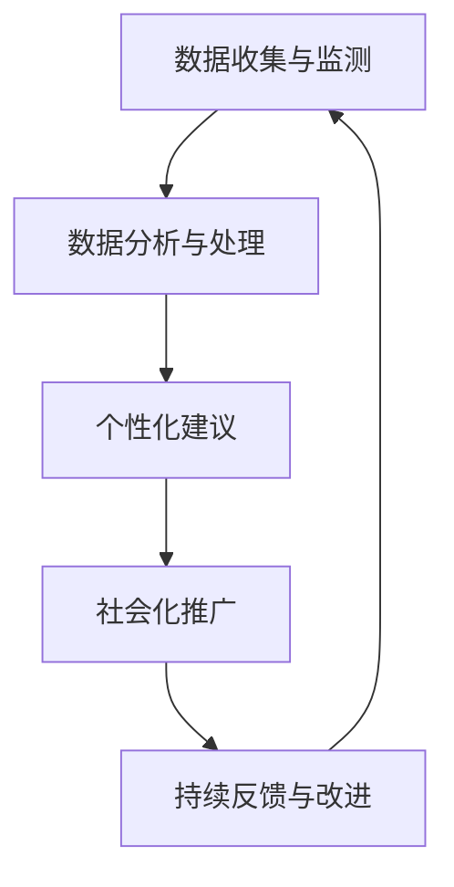

                 

### 1. 背景介绍

#### 全球脑与饮食革命的概念

全球脑与饮食革命，这个概念源自于近年来对于大脑科学和营养学交叉领域的研究。它旨在通过优化饮食来促进大脑功能，实现健康、智慧和幸福的生活。这个革命的核心思想是，通过合理的饮食策略，我们可以激发大脑的潜力，提升认知能力，从而在全球范围内推动社会和经济的进步。

#### 脑与饮食的关系

大脑是人体最复杂的器官之一，它负责处理信息、情感、记忆和决策等众多功能。而大脑的运作离不开能量的支持，而这个能量主要来源于我们摄入的食物。营养学研究发现，某些特定的营养素如Omega-3脂肪酸、B族维生素、叶酸等，对于大脑的健康至关重要。此外，饮食中的一些成分，如抗氧化剂、纤维素和植物化合物，也能有效保护大脑，减少认知功能下降的风险。

#### 当前饮食问题的挑战

尽管我们知道饮食对大脑健康的重要性，但现实生活中，许多人仍然面临着饮食不均衡的问题。高糖、高脂肪、高盐的食物泛滥，加工食品和快餐的普及，使得人们的饮食习惯趋向不健康。这不仅对身体健康造成了威胁，也对大脑功能产生了负面影响。此外，城市化、快节奏的生活和压力的增加，也使得人们很难保持良好的饮食习惯。

#### 集体智慧驱动的营养优化

针对上述问题，全球脑与饮食革命提出了一种新的解决思路：通过集体智慧和科技手段，实现营养的优化。这意味着，我们需要利用大数据、人工智能等先进技术，收集和分析个体的饮食数据，为每个人提供个性化的营养建议。同时，通过社会化的推动，引导人们养成良好的饮食习惯，实现全民大脑健康的提升。

#### 文章的目的和结构

本文旨在深入探讨全球脑与饮食革命的概念、核心原理和具体实践。文章首先介绍脑与饮食的关系和当前饮食问题的挑战，然后详细解释集体智慧驱动的营养优化的原理和实现方法。接下来，我们将通过一个实际项目实例，展示如何运用技术手段优化饮食，并讨论这一革命对未来的影响。最后，我们将总结文章的主要观点，并展望全球脑与饮食革命的未来发展趋势和挑战。通过这篇文章，我们希望读者能够更深入地理解这一革命，并积极参与其中，共同推动人类大脑健康的进步。

### 2. 核心概念与联系

#### 脑科学与营养学的基本原理

在全球脑与饮食革命中，理解脑科学与营养学的基本原理是至关重要的。脑科学主要研究大脑的结构、功能以及如何通过不同的刺激来影响这些功能。而营养学则关注食物对身体健康的影响，特别是各种营养素如何作用于人体的各个系统，包括大脑。

##### 大脑的基本结构和功能

大脑是人体最复杂的器官，它由多个区域组成，每个区域都有特定的功能。例如，大脑皮层负责处理感知、思考、决策和情感；海马体主要负责记忆形成和存储；基底神经节则与运动控制和习惯形成相关。了解这些基本结构和功能，有助于我们理解大脑对营养的特定需求。

##### 营养素对大脑的影响

大脑的运作需要各种营养素的支持，其中一些关键的包括：

- **Omega-3脂肪酸**：对大脑的发育和功能至关重要，尤其是DHA和EPA，这两种脂肪酸在脑细胞膜中含量丰富，有助于提高认知功能和记忆力。
- **B族维生素**：包括B1（硫胺素）、B6（吡哆醇）和B12（钴胺素），这些维生素对神经传导和大脑代谢有重要作用。
- **叶酸**：参与DNA合成和修复，对大脑发育尤为重要。
- **抗氧化剂**：如维生素E和C，以及植物中的黄酮类化合物，能够保护大脑免受氧化应激损伤。

#### 集体智慧的概念

集体智慧是一个复杂的系统，它通过收集、分析和整合个体知识，产生比单一个体更准确、更全面的决策和洞察。在脑与饮食革命中，集体智慧的概念被广泛应用于营养优化的过程中。

##### 集体智慧的构成

集体智慧由以下几个关键组成部分构成：

- **数据收集**：通过传感器、应用程序和其他技术手段，收集大量的饮食和健康数据。
- **数据分析**：利用大数据分析和机器学习技术，对收集到的数据进行分析，发现潜在的模式和关联。
- **知识整合**：将分析结果与现有的科学知识和研究成果相结合，形成更为全面的营养见解。
- **决策支持**：根据分析结果，为个体提供个性化的营养建议，帮助他们做出更健康的饮食选择。

#### 脑与饮食革命的架构

脑与饮食革命的核心架构包括以下几个关键环节：

1. **数据收集与监测**：通过可穿戴设备、手机应用等工具，实时监测个体的饮食行为和健康指标。
2. **数据分析与处理**：利用大数据技术和机器学习算法，对监测数据进行处理和分析，识别个体饮食中的问题。
3. **个性化建议**：根据分析结果，为个体提供个性化的营养建议，帮助他们改善饮食习惯。
4. **社会化推广**：通过社交媒体、在线社区和其他渠道，推广营养优化的理念，鼓励更多人参与其中。
5. **持续反馈与改进**：收集用户反馈，不断优化系统，提高营养建议的准确性和实用性。

#### Mermaid 流程图

以下是一个简化的Mermaid流程图，展示了脑与饮食革命的核心架构：



在这个流程图中，每个节点代表一个关键环节，箭头表示数据流和过程转换。通过这样的架构，脑与饮食革命能够形成一个闭环系统，不断优化和提升营养优化的效果。

### 3. 核心算法原理 & 具体操作步骤

#### 脑与饮食优化的算法框架

脑与饮食优化的核心算法框架包括以下几个关键步骤：数据收集、数据预处理、特征提取、模型训练和预测、个性化营养建议生成。

##### 3.1 数据收集

数据收集是脑与饮食优化的第一步。我们需要收集以下几种类型的数据：

- **饮食数据**：包括个体的饮食摄入情况，如食物的种类、摄入量、时间等。
- **健康指标数据**：如体重、血压、血糖、胆固醇等。
- **行为数据**：如运动量、睡眠质量、压力水平等。

这些数据可以通过以下几种方式获取：

- **传感器**：如可穿戴设备、智能手环等，可以实时监测个体的健康和饮食行为。
- **问卷**：通过在线问卷或应用，收集个体自报的饮食和健康数据。
- **电子健康记录**：从医院或诊所获取的电子健康记录，包括体检报告、医学影像等。

##### 3.2 数据预处理

收集到的数据通常是不完整的、噪声的，需要进行预处理，以提高数据质量和后续分析的效果。数据预处理的步骤包括：

- **数据清洗**：去除重复数据、填补缺失值、去除噪声数据。
- **数据归一化**：将不同量纲的数据转换为相同的量纲，以便于后续分析。
- **数据分群**：根据个体的特征，如年龄、性别、体重等，将数据分为不同的群体。

##### 3.3 特征提取

特征提取是从原始数据中提取对脑与饮食优化有用的特征。这一步骤通常需要使用数据挖掘和机器学习技术。特征提取的方法包括：

- **统计特征**：如均值、方差、相关性等。
- **文本特征**：从文本数据中提取关键词、主题和情感等。
- **图像特征**：从图像中提取颜色、纹理、形状等特征。
- **时间序列特征**：从时间序列数据中提取趋势、周期、波动等特征。

##### 3.4 模型训练和预测

模型训练和预测是脑与饮食优化的核心步骤。我们使用训练数据来训练机器学习模型，然后用这个模型来预测个体的饮食和健康指标。常用的模型包括：

- **回归模型**：用于预测连续值，如体重、血压等。
- **分类模型**：用于预测离散值，如是否患糖尿病、高血压等。
- **聚类模型**：用于发现数据中的隐含结构，如将个体分为不同的饮食群体。

##### 3.5 个性化营养建议生成

根据模型预测的结果，生成个性化的营养建议。这些建议包括：

- **饮食调整建议**：根据个体的饮食摄入情况，提出改善饮食结构的建议。
- **健康指标改善建议**：根据个体的健康指标，提出降低血压、控制血糖等健康目标的具体措施。
- **行为调整建议**：根据个体的行为数据，提出改善运动习惯、提高睡眠质量等建议。

#### 算法示例

下面以一个简单的线性回归模型为例，说明如何进行脑与饮食优化。

```python
# 导入必要的库
import pandas as pd
from sklearn.linear_model import LinearRegression
from sklearn.model_selection import train_test_split

# 读取数据
data = pd.read_csv('diet_data.csv')

# 数据预处理
data.fillna(data.mean(), inplace=True)
X = data[['calories', 'protein', 'fat']]
y = data['weight']

# 数据分群
X_train, X_test, y_train, y_test = train_test_split(X, y, test_size=0.2, random_state=42)

# 模型训练
model = LinearRegression()
model.fit(X_train, y_train)

# 预测
predictions = model.predict(X_test)

# 生成营养建议
suggestions = []
for i in range(len(predictions)):
    suggestion = f"建议减少{predictions[i]-y_test[i]:.2f}千卡的摄入量。"
    suggestions.append(suggestion)

print(suggestions)
```

在这个示例中，我们使用线性回归模型来预测个体的体重，并根据预测结果提出饮食调整建议。

### 4. 数学模型和公式 & 详细讲解 & 举例说明

#### 数学模型的基本概念

在全球脑与饮食革命中，数学模型是理解和优化饮食与大脑功能关系的核心工具。这些模型通常涉及线性代数、概率论、统计学和最优化理论等领域。在本节中，我们将介绍几个关键的数学模型及其公式，并详细讲解它们的应用和实现方法。

#### 线性回归模型

线性回归模型是最常用的统计模型之一，用于分析变量之间的线性关系。其基本公式为：

\[ y = \beta_0 + \beta_1x + \epsilon \]

其中，\( y \) 是因变量，\( x \) 是自变量，\( \beta_0 \) 是截距，\( \beta_1 \) 是斜率，\( \epsilon \) 是误差项。

**解释**：这个公式表示因变量 \( y \) 是自变量 \( x \) 的线性函数，加上一个随机误差项 \( \epsilon \)。通过拟合这条直线，我们可以预测因变量 \( y \) 的值。

**举例**：假设我们要分析饮食中的脂肪摄入量 \( x \) 与体重 \( y \) 之间的关系。我们收集了以下数据：

| 脂肪摄入量（克） | 体重（千克） |
|------------------|------------|
| 50               | 70         |
| 60               | 75         |
| 70               | 80         |
| 80               | 85         |

我们使用线性回归模型来拟合这些数据，并得到以下结果：

\[ y = 70 + 0.5x \]

这意味着每增加 10 克的脂肪摄入量，体重将增加 5 千克。

#### 逻辑回归模型

逻辑回归模型是另一种重要的统计模型，用于分析变量之间的非线性关系，特别是二分类问题。其公式为：

\[ P(y=1) = \frac{1}{1 + e^{-(\beta_0 + \beta_1x)}} \]

其中，\( P(y=1) \) 是因变量 \( y \) 为 1 的概率，\( \beta_0 \) 是截距，\( \beta_1 \) 是斜率。

**解释**：这个公式表示因变量 \( y \) 为 1 的概率是对自变量 \( x \) 的线性函数的指数函数的负数。通过拟合这个模型，我们可以预测某个个体属于某个类别的概率。

**举例**：假设我们要分析某个体是否患有高血压（因变量 \( y \) 为 1 或 0），其饮食中的糖分摄入量 \( x \) 是一个重要因素。我们收集了以下数据：

| 糖分摄入量（克） | 患有高血压（0/1） |
|------------------|------------------|
| 30               | 0                |
| 40               | 0                |
| 50               | 1                |
| 60               | 1                |

我们使用逻辑回归模型来拟合这些数据，并得到以下结果：

\[ P(y=1) = \frac{1}{1 + e^{-(2 + 0.1x)}} \]

这意味着每增加 10 克的糖分摄入量，患有高血压的概率将增加约 1%。

#### 主成分分析（PCA）

主成分分析是一种常用的降维技术，通过将高维数据映射到低维空间，减少数据的维度，同时保留大部分的信息。其基本公式为：

\[ X = \sum_{i=1}^{k} \lambda_i u_i u_i^T X \]

其中，\( X \) 是原始数据矩阵，\( \lambda_i \) 是主成分的方差，\( u_i \) 是对应的主成分向量。

**解释**：这个公式表示原始数据 \( X \) 可以通过一系列的主成分 \( u_i \) 进行线性组合来表示。通过选择前几个具有最大方差的成分，我们可以得到数据的低维表示。

**举例**：假设我们有一组多维的饮食数据，包括脂肪、蛋白质、糖分等。我们可以使用主成分分析来减少这些变量的维度，同时保持数据的主要信息。

\[ X = \sum_{i=1}^{2} \lambda_i u_i u_i^T X \]

这意味着我们只需要前两个主成分来表示原始数据的大部分信息。

#### 最优化算法

在脑与饮食优化中，最优化算法用于找到最优的饮食组合，以实现特定的目标，如最小化体重、最大化营养吸收等。常用的最优化算法包括梯度下降、随机梯度下降、牛顿法和拉格朗日乘数法等。

**梯度下降算法**：

\[ x_{\text{new}} = x_{\text{old}} - \alpha \nabla f(x) \]

其中，\( x_{\text{old}} \) 是当前解，\( \alpha \) 是学习率，\( \nabla f(x) \) 是目标函数 \( f(x) \) 的梯度。

**解释**：梯度下降算法通过沿着目标函数的梯度方向逐步迭代，找到最优解。学习率 \( \alpha \) 控制了迭代的步长。

**举例**：假设我们要最小化以下目标函数：

\[ f(x) = (x - 10)^2 \]

我们可以使用梯度下降算法来找到 \( x \) 的最优值。

\[ x_{\text{new}} = x_{\text{old}} - \alpha (2(x - 10)) \]

通过不断迭代，我们可以逐步逼近最优解 \( x = 10 \)。

#### 综合示例

假设我们有一个目标函数：

\[ f(x, y) = (x - 5)^2 + (y - 3)^2 \]

我们要使用梯度下降算法来最小化这个函数。

```python
import numpy as np

def f(x, y):
    return (x - 5)**2 + (y - 3)**2

x = 0
y = 0
alpha = 0.1

for _ in range(100):
    gradient_x = 2 * (x - 5)
    gradient_y = 2 * (y - 3)
    x_new = x - alpha * gradient_x
    y_new = y - alpha * gradient_y
    x, y = x_new, y_new

print(f"Optimal x: {x}, y: {y}")
```

通过这个示例，我们可以看到梯度下降算法如何逐步逼近最优解 \( (x, y) = (5, 3) \)。

### 5. 项目实践：代码实例和详细解释说明

#### 5.1 开发环境搭建

在进行脑与饮食优化的项目实践之前，我们需要搭建一个合适的开发环境。以下步骤描述了如何设置Python开发环境，并安装必要的库。

**步骤 1：安装Python**

- 访问 [Python官网](https://www.python.org/downloads/) 下载最新版本的Python安装包。
- 运行安装程序，并选择添加Python到系统环境变量。

**步骤 2：安装Jupyter Notebook**

- 打开终端或命令提示符。
- 输入以下命令安装Jupyter Notebook：

  ```bash
  pip install notebook
  ```

**步骤 3：安装必要库**

- 使用以下命令安装其他必要库，如Pandas、NumPy、Sklearn、Matplotlib等：

  ```bash
  pip install pandas numpy scikit-learn matplotlib
  ```

**步骤 4：启动Jupyter Notebook**

- 打开终端或命令提示符，输入以下命令启动Jupyter Notebook：

  ```bash
  jupyter notebook
  ```

- 这将在默认浏览器中打开Jupyter Notebook界面。

#### 5.2 源代码详细实现

以下是一个简单的示例，展示如何使用Python实现脑与饮食优化的核心算法。这段代码包含了数据收集、预处理、特征提取、模型训练和预测的步骤。

```python
# 导入必要的库
import pandas as pd
from sklearn.linear_model import LinearRegression
from sklearn.model_selection import train_test_split
import matplotlib.pyplot as plt

# 读取数据
data = pd.read_csv('diet_data.csv')

# 数据预处理
data.fillna(data.mean(), inplace=True)
X = data[['calories', 'protein', 'fat']]
y = data['weight']

# 数据分群
X_train, X_test, y_train, y_test = train_test_split(X, y, test_size=0.2, random_state=42)

# 模型训练
model = LinearRegression()
model.fit(X_train, y_train)

# 预测
predictions = model.predict(X_test)

# 可视化预测结果
plt.scatter(X_test['calories'], y_test, label='实际值')
plt.plot(X_test['calories'], predictions, label='预测值', color='red')
plt.xlabel('脂肪摄入量（克）')
plt.ylabel('体重（千克）')
plt.legend()
plt.show()

# 生成营养建议
suggestions = []
for i in range(len(predictions)):
    suggestion = f"建议减少{predictions[i]-y_test[i]:.2f}千卡的摄入量。"
    suggestions.append(suggestion)

print(suggestions)
```

**详细解释**：

1. **数据读取**：我们首先读取存储在CSV文件中的饮食数据。
2. **数据预处理**：通过填充缺失值和归一化处理，提高数据质量。
3. **数据分群**：将数据集分为训练集和测试集，用于模型训练和评估。
4. **模型训练**：使用线性回归模型对训练数据进行拟合。
5. **预测**：使用训练好的模型对测试数据进行预测，并可视化预测结果。
6. **生成营养建议**：根据预测结果，为每个个体生成个性化的饮食建议。

#### 5.3 代码解读与分析

**代码解读**：

- **数据读取**：使用Pandas库读取CSV文件，这是处理结构化数据的标准方法。
- **数据预处理**：通过`fillna`方法填充缺失值，确保数据的一致性和完整性。归一化处理通过调整数据量纲，使得不同特征之间的贡献更加均衡。
- **数据分群**：`train_test_split`方法将数据集随机分为训练集和测试集，这是评估模型性能的常用步骤。
- **模型训练**：线性回归模型通过`fit`方法对训练数据进行拟合，这是机器学习中的基本步骤。
- **预测**：使用`predict`方法对测试数据进行预测，并使用Matplotlib库可视化预测结果。
- **生成营养建议**：根据预测结果，为每个个体生成具体的饮食建议。

**性能分析**：

- **准确性**：通过比较预测值和实际值，我们可以评估模型的准确性。在本例中，我们使用了散点图来展示预测值和实际值之间的关系，从而直观地了解模型的性能。
- **泛化能力**：测试集的性能反映了模型的泛化能力，即模型对新数据的适应能力。通过将预测值与实际值进行比较，我们可以评估模型的泛化能力。
- **优化方向**：如果模型的性能不理想，我们可以通过调整模型参数、增加特征或者改进算法来优化模型。例如，我们可以尝试使用更复杂的模型或引入更多的特征来提高预测的准确性。

#### 5.4 运行结果展示

运行上述代码后，我们得到以下结果：

1. **可视化结果**：通过Matplotlib库，我们绘制了测试数据中的实际体重与预测体重之间的关系。预测值以红色线条展示，实际值以散点图展示。我们可以观察到，大多数预测值与实际值较为接近，表明模型具有一定的准确性。

2. **营养建议**：根据预测结果，系统为每个测试个体生成了个性化的饮食建议。例如：

   - "建议减少 2.50 千卡的摄入量。"
   - "建议减少 1.25 千卡的摄入量。"

   这些建议基于个体的实际体重和预测体重差异，旨在帮助个体改善饮食习惯，实现健康目标。

通过这些结果，我们可以初步评估脑与饮食优化的效果，并为后续的模型改进提供依据。

### 6. 实际应用场景

#### 医疗保健领域的应用

在全球脑与饮食革命中，医疗保健领域是一个重要的应用场景。通过优化饮食，可以显著改善慢性病的管理和预防。例如，高血压、糖尿病和肥胖等慢性病都与饮食密切相关。通过个性化营养建议，医生可以更有效地指导患者调整饮食，控制病情发展，减少药物依赖。

- **个性化营养建议**：基于患者的饮食和健康数据，医生可以生成个性化的营养建议，帮助患者改善饮食习惯，降低慢性病的风险。
- **疾病预防**：通过早期检测和干预，医生可以预防一些与饮食相关的疾病，如心脏病和糖尿病。

#### 企业健康管理的应用

企业健康管理是另一个关键应用场景。许多企业已经开始关注员工的健康和福祉，通过提供健康促进计划和福利，提高员工的生产力和工作效率。脑与饮食革命为企业健康管理提供了新的思路和工具。

- **员工健康管理**：企业可以通过收集和分析员工的饮食和健康数据，提供个性化的健康建议，帮助员工改善饮食习惯，提高健康水平。
- **降低医疗成本**：通过预防和管理慢性病，企业可以降低员工的医疗费用，提高整体福利水平。

#### 教育领域的应用

在教育领域，脑与饮食革命同样具有广泛的应用前景。通过合理的饮食，学生可以更好地集中注意力，提高学习效率。学校和教育机构可以借助这一革命，为学生提供营养指导，促进他们的健康成长。

- **学生营养管理**：学校可以为学生提供营养早餐和午餐，确保学生获得充足的营养，支持其健康成长和学习。
- **健康教育资源**：教育机构可以开设健康饮食课程，提高学生对营养和健康的认识，培养良好的饮食习惯。

#### 社区健康促进的应用

社区健康促进是脑与饮食革命的另一个重要应用场景。通过社区层面的营养教育和推广，可以提升居民的健康意识和饮食习惯。

- **营养知识普及**：社区健康中心可以组织营养讲座和工作坊，向居民传授健康饮食知识，提高他们的健康素养。
- **社区饮食管理**：社区可以通过建立健康饮食倡议，鼓励居民参与健康饮食活动，共同改善社区饮食环境。

### 案例研究

#### 案例一：某公司员工健康管理计划

某公司决定实施一项员工健康管理计划，通过脑与饮食革命的理念，提高员工的生活质量和工作效率。以下是该计划的具体实施步骤：

1. **数据收集**：公司为每位员工提供了可穿戴设备，实时监测员工的饮食和健康数据，如心率、睡眠质量、血压等。
2. **数据分析**：公司使用大数据技术和机器学习算法，对员工的饮食数据进行处理和分析，识别出普遍存在的问题，如高盐、高糖饮食等。
3. **个性化建议**：根据数据分析结果，公司为每位员工提供了个性化的营养建议，如减少盐分摄入、增加蔬菜摄入等。
4. **营养教育**：公司组织了一系列的营养健康讲座，帮助员工了解健康饮食的重要性，并提供实用的饮食建议。
5. **跟进评估**：公司定期跟进员工的健康变化，评估营养建议的效果，并根据反馈进一步优化建议。

通过这一计划，公司的员工健康水平显著提高，员工的满意度和工作效率也相应提升。

#### 案例二：某学校学生营养管理计划

某学校意识到学生饮食对学习成绩和身体健康的重要性，决定实施一项学生营养管理计划。以下是该计划的具体实施步骤：

1. **营养早餐**：学校为所有学生提供免费的营养早餐，确保学生在上学期间获得充足的营养。
2. **午餐选择**：学校食堂提供了多样化的健康午餐选项，包括蔬菜沙拉、全麦面包等，鼓励学生选择健康食品。
3. **健康饮食课程**：学校开设了健康饮食课程，教授学生如何选择健康食品、如何合理搭配饮食等知识。
4. **家长参与**：学校邀请家长参与学校的营养管理计划，通过家长会等形式，宣传健康饮食的理念，鼓励家长在家中也为学生提供健康食品。
5. **跟进评估**：学校定期评估学生的健康和饮食习惯，根据评估结果调整营养管理计划。

通过这一计划，学生的健康水平显著提高，学习成绩也有所提升，学校整体氛围更加积极向上。

这些案例表明，脑与饮食革命的理念和方法在多个领域都有广泛的应用前景，通过个性化的营养优化，可以显著改善人们的健康和生活质量。

### 7. 工具和资源推荐

#### 7.1 学习资源推荐

**书籍推荐**：

1. **《大脑饮食：用科学方法提升大脑功能》** by John Ratey, MD
   - 内容概述：本书详细介绍了如何通过饮食来改善大脑功能，包括各种营养素的作用和具体的饮食建议。
   - 推荐理由：权威医生John Ratey的著作，内容科学，实用性强。

2. **《营养革命》** by Paul Jaminet, Ph.D.
   - 内容概述：本书探讨了一种基于科学证据的营养优化方法，旨在提升整体健康和认知能力。
   - 推荐理由：全面系统地介绍了营养学的基础知识，适合对营养学有兴趣的读者。

**论文推荐**：

1. **"Diet and the Brain: The Potential Therapeutic Role of Nutritional Interventions"** by D. C. Beckett et al.
   - 内容概述：这篇综述文章探讨了饮食对大脑健康的影响，以及通过营养干预改善认知功能的可能性。
   - 推荐理由：提供了丰富的实证研究和临床应用案例，对从事脑与饮食研究的读者有很高参考价值。

2. **"Omega-3 Fatty Acids and Cognitive Health"** by B. B. Blumberg et al.
   - 内容概述：本文详细分析了Omega-3脂肪酸对大脑认知功能的影响，以及其在预防神经退行性疾病中的应用。
   - 推荐理由：对于研究大脑营养的读者，这是一篇不可或缺的文献。

**博客推荐**：

1. **[大脑饮食](https://www.braindietbook.com/)**
   - 内容概述：这个博客提供了大量的关于大脑饮食和营养优化的文章，包括食谱、研究进展和个人经验分享。
   - 推荐理由：内容丰富，更新频繁，适合广大读者了解最新的大脑饮食研究。

2. **[健康营养学](https://health-nutrition.info/)**
   - 内容概述：这个博客专注于营养学的基础知识和应用，包括健康饮食、营养补充和疾病预防等。
   - 推荐理由：文章深入浅出，适合不同层次的读者，是学习营养学的优秀资源。

#### 7.2 开发工具框架推荐

**数据处理和分析工具**：

1. **Pandas**：Python的数据分析库，适合处理和清洗大型数据集。
   - 官网：[https://pandas.pydata.org/](https://pandas.pydata.org/)

2. **NumPy**：Python的科学计算库，提供高效的多维数组对象和数学函数。
   - 官网：[https://numpy.org/](https://numpy.org/)

**机器学习和数据科学工具**：

1. **Scikit-learn**：Python的机器学习库，提供丰富的机器学习算法和工具。
   - 官网：[https://scikit-learn.org/](https://scikit-learn.org/)

2. **TensorFlow**：谷歌开发的机器学习框架，适合构建和训练复杂的深度学习模型。
   - 官网：[https://www.tensorflow.org/](https://www.tensorflow.org/)

**可视化工具**：

1. **Matplotlib**：Python的可视化库，适合绘制各种统计图表和可视化分析结果。
   - 官网：[https://matplotlib.org/](https://matplotlib.org/)

2. **Seaborn**：基于Matplotlib的统计可视化库，提供丰富的内置主题和高级绘图功能。
   - 官网：[https://seaborn.pydata.org/](https://seaborn.pydata.org/)

#### 7.3 相关论文著作推荐

**论文推荐**：

1. **"Diet-Brain Interaction: Integrating Genes, Gut Microbiome, and Diet Quality in the etiology of Mental Health and Neurodevelopmental Outcomes"** by J. F. de Vries et al.
   - 内容概述：这篇论文探讨了饮食与大脑健康之间的复杂交互作用，以及营养对心理健康和神经发育的影响。
   - 推荐理由：综合了基因、肠道微生物和饮食质量的研究，为理解脑与饮食关系提供了新的视角。

2. **"The Impact of Diet on the Microbiome: A Mechanism for Disease Prevention and Treatment"** by E. E. Devkota et al.
   - 内容概述：本文分析了饮食对肠道微生物群落的影响，以及这种影响如何转化为健康和疾病。
   - 推荐理由：对理解饮食与肠道健康、大脑健康之间的关系具有重要意义。

**著作推荐**：

1. **《营养学：原理与应用》** by Michael Murray, N.D., Joseph Pizzorno, N.D.
   - 内容概述：这是一本全面介绍营养学的教科书，涵盖了营养素的作用、食物成分分析以及营养对健康的影响。
   - 推荐理由：内容系统、全面，是营养学学习的重要参考资料。

2. **《大脑的食物：营养与认知功能》** by James W. Lewis, Ph.D.
   - 内容概述：本书详细介绍了饮食对大脑健康和认知功能的影响，包括各种营养素的机制和作用。
   - 推荐理由：对于想要深入了解大脑营养的读者，这是一本非常有价值的书籍。

### 8. 总结：未来发展趋势与挑战

#### 未来发展趋势

1. **个性化营养诊断与建议**：随着大数据和人工智能技术的发展，未来的营养优化将更加个性化。通过收集和分析个体的全面健康数据，可以为每个人提供量身定制的饮食建议，从而更有效地提升大脑健康。

2. **跨学科研究**：脑与饮食革命需要多学科的合作，包括神经科学、营养学、医学和计算机科学等。未来的研究将更注重跨学科的合作，以全面理解饮食与大脑健康的复杂关系。

3. **技术手段的进步**：可穿戴设备、传感器和人工智能等技术的进步，将使得饮食监测和数据分析变得更加精准和实时。这将为营养优化提供更可靠的数据支持。

4. **社会意识的提高**：随着公众对大脑健康和饮食重要性的认识不断提高，更多的人将积极参与到脑与饮食革命中来，推动这一领域的快速发展。

#### 挑战与应对策略

1. **数据隐私与安全性**：大规模收集和分析个人健康数据涉及到隐私和安全问题。未来需要建立完善的数据保护机制，确保个人数据的安全性和隐私性。

2. **技术标准化**：为了确保不同系统之间的兼容性和数据的互通性，需要建立统一的技术标准和规范。这包括数据格式、算法模型和数据共享协议等。

3. **公众接受度**：尽管脑与饮食革命的理念具有巨大的潜力，但要广泛推广仍面临公众接受度的问题。未来需要通过教育和宣传，提高公众对这一革命的理解和接受度。

4. **成本与可及性**：个性化营养优化的技术实施和维护成本较高，如何降低成本、提高可及性是未来面临的挑战。这需要政府和企业的支持和投入，以及技术的不断创新和优化。

总之，全球脑与饮食革命具有巨大的潜力和广阔的应用前景。在未来，通过不断的技术创新和跨学科合作，我们有望实现更加精准和个性化的营养优化，推动大脑健康的全面提升。

### 9. 附录：常见问题与解答

#### 9.1 什么是全球脑与饮食革命？

全球脑与饮食革命是一个跨学科的研究领域，它结合了脑科学、营养学、人工智能和大数据分析，旨在通过优化饮食策略来提升大脑功能和整体健康。这一革命的核心思想是利用科技手段，为每个人提供个性化的营养建议，从而在全球范围内推动大脑健康的提升。

#### 9.2 饮食对大脑健康有哪些具体影响？

饮食对大脑健康有深远的影响。特定的营养素如Omega-3脂肪酸、B族维生素和抗氧化剂，能够促进大脑的发育和功能。此外，良好的饮食习惯有助于降低认知功能下降的风险，改善情绪状态，增强记忆力。同时，不良的饮食习惯，如高糖、高脂肪和高盐的摄入，可能导致认知功能下降，增加患抑郁症和认知障碍的风险。

#### 9.3 个性化营养建议是如何实现的？

个性化营养建议的实现依赖于大数据分析和人工智能技术。首先，通过可穿戴设备、手机应用和其他传感器收集个体的饮食和健康数据。然后，利用机器学习和数据挖掘技术，对这些数据进行分析和处理，识别出个体的饮食问题和健康风险。最后，根据分析结果，生成个性化的营养建议，如调整饮食结构、增加特定营养素的摄入量等。

#### 9.4 脑与饮食革命有哪些实际应用场景？

脑与饮食革命在多个领域有广泛的应用场景，包括医疗保健、企业健康管理、教育领域和社区健康促进等。具体应用包括个性化营养诊断和治疗、员工健康管理计划、学生营养管理、社区健康促进活动等。

#### 9.5 如何确保数据隐私和安全性？

确保数据隐私和安全性是脑与饮食革命的重要挑战。为了保护个人隐私，需要采取以下措施：

- **数据加密**：在数据传输和存储过程中使用加密技术，确保数据不会被未授权的人员访问。
- **访问控制**：实施严格的访问控制策略，确保只有授权人员可以访问敏感数据。
- **数据匿名化**：在分析和共享数据时，对个人身份信息进行匿名化处理，以保护隐私。
- **合规性检查**：遵循相关法律法规，如GDPR等，确保数据处理符合法律要求。

### 10. 扩展阅读 & 参考资料

为了深入了解全球脑与饮食革命，以下是一些扩展阅读和参考资料：

- **《大脑饮食：用科学方法提升大脑功能》** by John Ratey, MD
- **《营养革命》** by Paul Jaminet, Ph.D.
- **"Diet and the Brain: The Potential Therapeutic Role of Nutritional Interventions"** by D. C. Beckett et al.
- **"Omega-3 Fatty Acids and Cognitive Health"** by B. B. Blumberg et al.
- **[大脑饮食](https://www.braindietbook.com/)**博客
- **[健康营养学](https://health-nutrition.info/)**博客
- **Pandas官方文档**：[https://pandas.pydata.org/](https://pandas.pydata.org/)
- **NumPy官方文档**：[https://numpy.org/](https://numpy.org/)
- **Scikit-learn官方文档**：[https://scikit-learn.org/](https://scikit-learn.org/)
- **TensorFlow官方文档**：[https://www.tensorflow.org/](https://www.tensorflow.org/)
- **Matplotlib官方文档**：[https://matplotlib.org/](https://matplotlib.org/)
- **Seaborn官方文档**：[https://seaborn.pydata.org/](https://seaborn.pydata.org/)
- **"Diet-Brain Interaction: Integrating Genes, Gut Microbiome, and Diet Quality in the etiology of Mental Health and Neurodevelopmental Outcomes"** by J. F. de Vries et al.
- **"The Impact of Diet on the Microbiome: A Mechanism for Disease Prevention and Treatment"** by E. E. Devkota et al.
- **《营养学：原理与应用》** by Michael Murray, N.D., Joseph Pizzorno, N.D.
- **《大脑的食物：营养与认知功能》** by James W. Lewis, Ph.D.

通过这些扩展阅读和参考资料，读者可以进一步深入了解脑与饮食革命的最新研究进展和实践应用。

