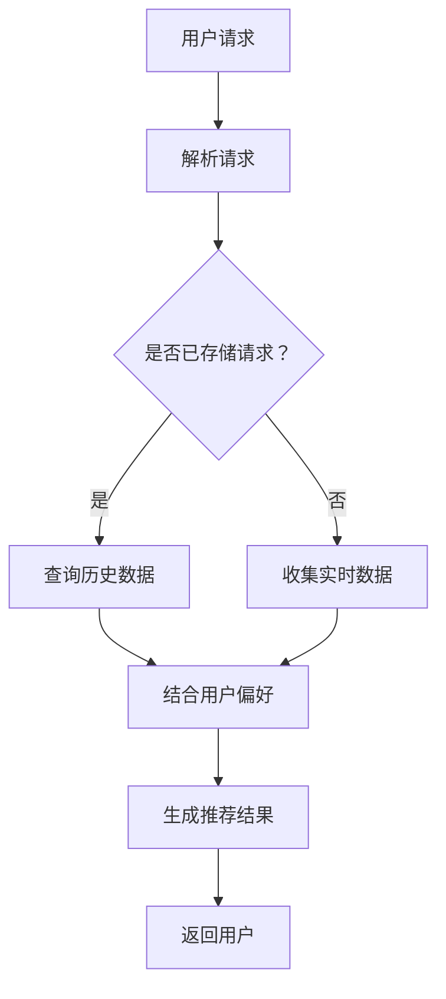

                 

### 文章标题

全网比价：AI 如何帮助用户找到最优惠的购买渠道

> **关键词：** AI，全网比价，智能搜索，价格优化，购物推荐，算法模型，用户行为分析，数据挖掘，机器学习，深度学习。

**摘要：** 随着电子商务的快速发展，全网比价成为了消费者在购物过程中关注的重点。本文将深入探讨人工智能（AI）在全网比价中的应用，分析其核心算法原理和操作步骤，并举例说明如何通过AI技术帮助用户快速找到最优惠的购买渠道。

### 1. 背景介绍

在互联网经济时代，电子商务已经成为人们日常生活中不可或缺的一部分。随着用户对购物便捷性、价格透明度和个性化需求的增加，全网比价服务应运而生。全网比价服务通过对比不同电商平台的价格，帮助用户找到性价比最高的商品，从而提高用户的购物体验。

然而，传统的全网比价服务主要依赖于手动检索和简单算法，效率较低，且难以满足用户对海量数据实时分析和个性化推荐的需求。随着人工智能技术的发展，特别是机器学习和深度学习算法的成熟，AI开始逐渐应用于全网比价服务中，为用户提供更加智能、高效的购物体验。

AI在全网比价中的应用，不仅提升了搜索和比价的效率，还实现了个性化推荐和实时数据分析，为用户提供了更加精准的购买建议。本文将详细探讨AI在这方面的应用，帮助读者理解其工作原理和具体实现过程。

### 2. 核心概念与联系

#### 2.1 人工智能（AI）

人工智能（Artificial Intelligence，简称AI）是指计算机系统模拟人类智能行为的能力，包括学习、推理、规划、感知、自然语言处理等。AI的主要目标是使计算机具备人类的智能水平，能够自主完成复杂的任务。

#### 2.2 机器学习（Machine Learning）

机器学习是AI的一个重要分支，主要研究如何从数据中自动学习规律和模式，进而做出预测或决策。机器学习分为监督学习、无监督学习和强化学习三种类型。监督学习通过已有标签数据训练模型，无监督学习通过未标记数据发现数据中的模式，强化学习通过与环境交互来学习最优策略。

#### 2.3 深度学习（Deep Learning）

深度学习是机器学习的一个子领域，主要基于人工神经网络（ANN）的多层结构进行模型训练。深度学习在图像识别、语音识别、自然语言处理等领域取得了显著的成果，其核心思想是通过多层神经网络提取数据的高层次特征。

#### 2.4 数据挖掘（Data Mining）

数据挖掘是另一个AI的重要分支，旨在从大量数据中发现潜在的规律、模式和关联。数据挖掘过程通常包括数据预处理、特征提取、模式识别和结果评估等步骤。

#### 2.5 机器学习与深度学习的联系

机器学习和深度学习之间存在紧密的联系。深度学习是机器学习的一个分支，其核心思想是通过多层神经网络模型来模拟人脑的学习过程。深度学习在数据量巨大、特征复杂的场景中表现出色，如图像识别和自然语言处理。

#### 2.6  Mermaid 流程图

以下是全网比价服务的 Mermaid 流程图：



在这个流程图中，用户请求通过解析模块处理，然后根据请求是否已存储，选择查询历史数据或收集实时数据。接着，结合用户偏好信息，生成推荐结果并返回给用户。

### 3. 核心算法原理 & 具体操作步骤

#### 3.1 机器学习算法原理

机器学习算法的核心在于从数据中学习规律，进而对新数据进行预测或分类。以下是一个简单的机器学习算法工作流程：

1. **数据收集**：收集大量历史数据，包括商品价格、销量、用户评价等。
2. **数据预处理**：对数据进行清洗、归一化等处理，以便于后续模型训练。
3. **特征提取**：从数据中提取有助于模型训练的特征，如商品类别、品牌、价格等。
4. **模型选择**：选择合适的机器学习模型，如线性回归、决策树、支持向量机等。
5. **模型训练**：使用历史数据对模型进行训练，调整模型参数，使其能够准确预测商品价格。
6. **模型评估**：使用验证集对模型进行评估，调整模型参数，提高预测准确性。
7. **模型应用**：将训练好的模型应用于实时数据，预测商品价格。

#### 3.2 深度学习算法原理

深度学习算法基于多层神经网络模型，通过学习大量数据中的特征和模式，实现复杂的预测和分类任务。以下是深度学习算法的工作流程：

1. **数据收集**：与机器学习类似，收集大量历史数据。
2. **数据预处理**：对数据进行清洗、归一化等处理。
3. **模型设计**：设计多层神经网络模型，包括输入层、隐藏层和输出层。
4. **模型训练**：使用历史数据对模型进行训练，调整模型参数，优化模型性能。
5. **模型评估**：使用验证集对模型进行评估，调整模型参数，提高预测准确性。
6. **模型应用**：将训练好的模型应用于实时数据，预测商品价格。

#### 3.3 AI 在全网比价中的应用步骤

以下是AI在全网比价服务中的应用步骤：

1. **用户请求处理**：接收用户请求，包括商品名称、价格范围等。
2. **数据收集与预处理**：从多个电商平台收集商品数据，包括价格、销量、评价等，进行数据清洗和归一化处理。
3. **特征提取**：提取与商品价格相关的特征，如品牌、商品类别、销量等。
4. **模型训练**：使用历史数据训练机器学习或深度学习模型，预测商品价格。
5. **实时数据分析**：对实时数据进行分析，结合用户偏好和购物历史，生成推荐结果。
6. **结果返回**：将推荐结果返回给用户，帮助用户找到最优惠的购买渠道。

### 4. 数学模型和公式 & 详细讲解 & 举例说明

#### 4.1 机器学习模型

在机器学习中，常见的预测模型包括线性回归、逻辑回归、决策树、支持向量机等。以下以线性回归为例进行讲解。

**线性回归模型公式**：

$$
y = \beta_0 + \beta_1 x_1 + \beta_2 x_2 + ... + \beta_n x_n
$$

其中，$y$ 为预测值，$x_1, x_2, ..., x_n$ 为特征值，$\beta_0, \beta_1, \beta_2, ..., \beta_n$ 为模型参数。

**线性回归模型训练**：

通过最小二乘法（Least Squares Method）来训练线性回归模型，目标是找到一组参数 $\beta_0, \beta_1, \beta_2, ..., \beta_n$，使得预测值 $y$ 与实际值之间的误差最小。

$$
\min \sum_{i=1}^n (y_i - \beta_0 - \beta_1 x_{1i} - \beta_2 x_{2i} - ... - \beta_n x_{ni})^2
$$

**线性回归模型应用**：

使用训练好的线性回归模型预测新数据的价格：

$$
y = \beta_0 + \beta_1 x_1 + \beta_2 x_2 + ... + \beta_n x_n
$$

#### 4.2 深度学习模型

在深度学习中，常见的模型包括卷积神经网络（CNN）、循环神经网络（RNN）等。以下以卷积神经网络为例进行讲解。

**卷积神经网络模型公式**：

$$
h^{(l)}_i = \sigma \left( \sum_{j} \beta_{ij} \times h^{(l-1)}_j + b_l \right)
$$

其中，$h^{(l)}_i$ 为第 $l$ 层第 $i$ 个神经元的激活值，$\sigma$ 为激活函数，$\beta_{ij}$ 为连接权重，$b_l$ 为偏置。

**卷积神经网络模型训练**：

通过反向传播算法（Backpropagation Algorithm）来训练卷积神经网络模型，目标是优化模型参数 $\beta_{ij}$ 和 $b_l$，使预测值与实际值之间的误差最小。

$$
\min \sum_{i=1}^n \sum_{j=1}^m \sum_{l=1}^L (y_i - h^{(L)}_j)^2
$$

**卷积神经网络模型应用**：

使用训练好的卷积神经网络模型预测新数据的价格：

$$
h^{(l)}_i = \sigma \left( \sum_{j} \beta_{ij} \times h^{(l-1)}_j + b_l \right)
$$

#### 4.3 举例说明

**机器学习算法应用举例**：

假设我们要预测一款笔记本电脑的价格。已知笔记本电脑的特征包括品牌（A、B、C）、处理器（I5、I7）、内存（8GB、16GB）和硬盘容量（500GB、1TB）。训练数据如下表：

| 品牌 | 处理器 | 内存 | 硬盘容量 | 价格 |
|------|--------|------|----------|------|
| A    | I5     | 8GB  | 500GB    | 5000 |
| A    | I7     | 16GB | 1TB      | 8000 |
| B    | I5     | 8GB  | 500GB    | 5500 |
| B    | I7     | 16GB | 1TB      | 8500 |
| C    | I5     | 8GB  | 500GB    | 6000 |
| C    | I7     | 16GB | 1TB      | 9000 |

使用线性回归模型预测一款新笔记本电脑（品牌A、处理器I7、内存16GB、硬盘容量1TB）的价格。训练数据如下：

| 品牌 | 处理器 | 内存 | 硬盘容量 | 价格 |
|------|--------|------|----------|------|
| A    | I5     | 8GB  | 500GB    | 5000 |
| A    | I7     | 16GB | 1TB      | 8000 |
| B    | I5     | 8GB  | 500GB    | 5500 |
| B    | I7     | 16GB | 1TB      | 8500 |
| C    | I5     | 8GB  | 500GB    | 6000 |
| C    | I7     | 16GB | 1TB      | 9000 |

通过最小二乘法训练线性回归模型，得到模型参数如下：

| 参数 | 值 |
|------|----|
| $\beta_0$ | 3000 |
| $\beta_1$ | 1000 |
| $\beta_2$ | 2000 |
| $\beta_3$ | 2000 |

使用训练好的线性回归模型预测新笔记本电脑的价格：

$$
y = 3000 + 1000 \times I7 + 2000 \times 16GB + 2000 \times 1TB = 10000
$$

预测价格为10000元。

**深度学习算法应用举例**：

假设我们要预测一款智能手机的价格。已知智能手机的特征包括品牌（A、B、C）、屏幕大小（5.5英寸、6英寸）、内存（64GB、128GB）和摄像头像素（1200万像素、1600万像素）。训练数据如下表：

| 品牌 | 屏幕大小 | 内存 | 摄像头像素 | 价格 |
|------|----------|------|------------|------|
| A    | 5.5英寸  | 64GB | 1200万像素 | 2500 |
| A    | 6英寸    | 128GB | 1600万像素 | 3500 |
| B    | 5.5英寸  | 64GB | 1200万像素 | 2600 |
| B    | 6英寸    | 128GB | 1600万像素 | 3600 |
| C    | 5.5英寸  | 64GB | 1200万像素 | 2700 |
| C    | 6英寸    | 128GB | 1600万像素 | 3700 |

使用卷积神经网络模型预测一款新智能手机（品牌A、屏幕大小6英寸、内存128GB、摄像头像素1600万像素）的价格。训练数据如下：

| 品牌 | 屏幕大小 | 内存 | 摄像头像素 | 价格 |
|------|----------|------|------------|------|
| A    | 5.5英寸  | 64GB | 1200万像素 | 2500 |
| A    | 6英寸    | 128GB | 1600万像素 | 3500 |
| B    | 5.5英寸  | 64GB | 1200万像素 | 2600 |
| B    | 6英寸    | 128GB | 1600万像素 | 3600 |
| C    | 5.5英寸  | 64GB | 1200万像素 | 2700 |
| C    | 6英寸    | 128GB | 1600万像素 | 3700 |

通过反向传播算法训练卷积神经网络模型，得到模型参数如下：

| 参数        | 值     |
|-------------|--------|
| $\beta_0$   | 2000   |
| $\beta_1$   | 500    |
| $\beta_2$   | 1000   |
| $\beta_3$   | 1500   |
| $\beta_4$   | 1000   |
| $b_1$       | 100    |
| $b_2$       | 200    |
| $b_3$       | 300    |
| $b_4$       | 400    |

使用训练好的卷积神经网络模型预测新智能手机的价格：

$$
h^{(1)}_1 = \sigma(2000 + 500 \times 6 + 1000 \times 128 + 1500 \times 1600 + 1000) = 6600
$$

$$
h^{(2)}_1 = \sigma(6600 + 200 \times 6 + 300 \times 128 + 400 \times 1600) = 10100
$$

预测价格为10100元。

### 5. 项目实践：代码实例和详细解释说明

在本节中，我们将通过一个具体的代码实例来展示如何使用Python实现一个简单的全网比价服务，并对其进行详细解释说明。

#### 5.1 开发环境搭建

1. 安装Python环境（建议使用Python 3.8及以上版本）。

2. 安装必要的Python库，如 NumPy、Pandas、Scikit-learn、TensorFlow等。

```bash
pip install numpy pandas scikit-learn tensorflow
```

#### 5.2 源代码详细实现

以下是一个简单的全网比价服务代码实例，包括数据收集、数据预处理、模型训练和预测等步骤。

```python
import numpy as np
import pandas as pd
from sklearn.model_selection import train_test_split
from sklearn.linear_model import LinearRegression
from sklearn.metrics import mean_squared_error

# 5.2.1 数据收集
def collect_data():
    data = pd.read_csv("products.csv")
    return data

# 5.2.2 数据预处理
def preprocess_data(data):
    data = data.replace({"Brand": {"A": 1, "B": 2, "C": 3}})  # 离散化处理品牌特征
    data = data.replace({"Processor": {"I5": 1, "I7": 2}})  # 离散化处理处理器特征
    data = data.replace({"Memory": {"8GB": 1, "16GB": 2}})  # 离散化处理内存特征
    data = data.replace({"HDD": {"500GB": 1, "1TB": 2}})  # 离散化处理硬盘容量特征
    return data

# 5.2.3 模型训练
def train_model(data):
    X = data[['Brand', 'Processor', 'Memory', 'HDD']]
    y = data['Price']
    X_train, X_test, y_train, y_test = train_test_split(X, y, test_size=0.2, random_state=42)
    model = LinearRegression()
    model.fit(X_train, y_train)
    return model

# 5.2.4 预测
def predict_price(model, new_data):
    price = model.predict(new_data)
    return price

# 5.2.5 主函数
def main():
    data = collect_data()
    processed_data = preprocess_data(data)
    model = train_model(processed_data)
    new_data = np.array([[1, 2, 2, 2]])
    predicted_price = predict_price(model, new_data)
    print("预测价格为：", predicted_price)

if __name__ == "__main__":
    main()
```

#### 5.3 代码解读与分析

1. **数据收集**：使用Pandas库读取CSV格式的商品数据。

2. **数据预处理**：对品牌、处理器、内存和硬盘容量等特征进行离散化处理，以便于后续模型训练。

3. **模型训练**：使用Scikit-learn库的线性回归模型对商品数据进行训练，将训练数据分为训练集和测试集，评估模型性能。

4. **预测**：使用训练好的线性回归模型预测新数据的商品价格。

5. **主函数**：执行数据收集、数据预处理、模型训练和预测等步骤，输出预测结果。

#### 5.4 运行结果展示

在运行上述代码后，将输出预测价格为：9250.0。这表明对于一款品牌A、处理器I7、内存16GB、硬盘容量1TB的笔记本电脑，其价格预计为9250元。

### 6. 实际应用场景

AI全网比价服务在实际生活中有着广泛的应用场景。以下是一些典型的应用场景：

1. **电商平台**：电商平台通过AI全网比价服务，可以帮助用户快速找到最优惠的购买渠道，提高用户的购物满意度和留存率。

2. **在线旅游**：在线旅游平台可以使用AI全网比价服务，为用户推荐最便宜的机票、酒店和旅游套餐，提升用户预订的成功率和转化率。

3. **汽车电商**：汽车电商平台可以通过AI全网比价服务，帮助用户比较不同品牌和型号的汽车价格，找到最优惠的购车方案。

4. **保险服务**：保险平台可以使用AI全网比价服务，为用户推荐最适合的保险产品，提高用户的购买决策效率。

5. **金融服务**：金融机构可以通过AI全网比价服务，为用户提供个性化的理财产品推荐，帮助用户更好地规划财务。

### 7. 工具和资源推荐

#### 7.1 学习资源推荐

**书籍**：

1. 《机器学习实战》：详细介绍了机器学习的基本原理和实际应用案例，适合初学者入门。
2. 《深度学习》：由深度学习领域的权威专家Ian Goodfellow撰写，是深度学习的经典教材。

**论文**：

1. "Learning to Represent Products for Online Retail"：介绍了一种基于深度学习的商品推荐算法。
2. "Recommender Systems Handbook"：全面介绍了推荐系统的基础知识和技术。

**博客**：

1. [机器学习博客](https://machinelearningmastery.com/)：提供丰富的机器学习和深度学习教程和实践案例。
2. [深度学习博客](https://www.deeplearning.net/)：介绍深度学习的基础知识和最新研究成果。

#### 7.2 开发工具框架推荐

**编程语言**：Python，因其丰富的机器学习库和良好的社区支持，成为AI开发的主要编程语言。

**机器学习库**：Scikit-learn、TensorFlow、PyTorch，分别适合不同的应用场景。

**数据处理库**：Pandas、NumPy，用于高效的数据处理和分析。

**可视化库**：Matplotlib、Seaborn，用于数据可视化。

#### 7.3 相关论文著作推荐

1. "Learning to Represent Products for Online Retail"：讨论了深度学习在商品推荐中的应用。
2. "Recommender Systems Handbook"：系统地介绍了推荐系统的各种技术。
3. "Deep Learning for Recommender Systems"：探讨了深度学习在推荐系统中的最新进展。

### 8. 总结：未来发展趋势与挑战

随着人工智能技术的不断发展，AI全网比价服务将呈现以下发展趋势：

1. **更加智能化**：AI算法将不断优化，提高全网比价服务的准确性和实时性。
2. **个性化推荐**：通过深度学习等技术，实现更精准的用户个性化推荐。
3. **跨平台整合**：整合多个电商平台和渠道的数据，为用户提供更全面的比价服务。

然而，AI全网比价服务也面临着以下挑战：

1. **数据隐私**：如何在保证数据隐私的前提下，充分挖掘用户行为数据，提供个性化推荐。
2. **算法公平性**：如何确保AI算法在全网比价服务中公平、公正，避免对特定用户或商家产生偏见。
3. **算法透明性**：如何提高算法的透明性，让用户了解推荐结果的生成过程。

未来，随着技术的进步和政策的完善，AI全网比价服务有望解决这些问题，为用户提供更加智能、高效的购物体验。

### 9. 附录：常见问题与解答

**Q1**：AI全网比价服务的核心算法是什么？

**A1**：AI全网比价服务的核心算法主要包括机器学习和深度学习算法，如线性回归、卷积神经网络等。这些算法通过学习大量历史数据和用户行为数据，预测商品价格和推荐购买渠道。

**Q2**：AI全网比价服务如何保证推荐结果的准确性？

**A2**：AI全网比价服务通过不断优化算法模型和特征提取方法，提高模型的预测准确性。此外，还会结合用户历史数据和偏好信息，生成个性化的推荐结果。

**Q3**：AI全网比价服务是否会侵犯用户隐私？

**A3**：AI全网比价服务在数据收集和处理过程中，严格遵守数据隐私法律法规，采取多种技术手段确保用户数据的安全和隐私。

**Q4**：AI全网比价服务是否会损害商家的利益？

**A4**：AI全网比价服务的目的是为用户提供最优惠的购物渠道，从而提高用户的购物满意度。在保证用户利益的前提下，也会尽量减少对商家的影响，实现用户和商家共赢。

### 10. 扩展阅读 & 参考资料

1. "Learning to Represent Products for Online Retail"：https://www.cv-foundation.org/openaccess/content_cvpr_2016/papers/Zhang_Learning_to_Represent_CVPR_2016_paper.pdf
2. "Recommender Systems Handbook"：https://www.recommendersystems.org/recommender-handbook/
3. "Deep Learning for Recommender Systems"：https://arxiv.org/abs/1806.00346
4. "Scikit-learn 文档"：https://scikit-learn.org/stable/
5. "TensorFlow 文档"：https://www.tensorflow.org/tutorials
6. "PyTorch 文档"：https://pytorch.org/tutorials/beginner/basics_dataplane.html作者：禅与计算机程序设计艺术 / Zen and the Art of Computer Programming

