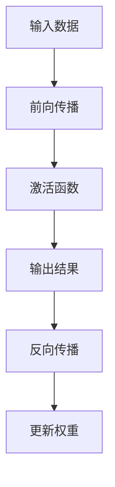

                 

### 全连接层（Fully Connected Layer）原理与代码实例讲解

全连接层（Fully Connected Layer，简称FC层）是深度神经网络中最常见的一层，它连接了前一层中的每一个神经元与后一层中的每一个神经元。在本文中，我们将深入探讨全连接层的原理，并提供一个详细的代码实例。

## 1. 背景介绍

随着人工智能的快速发展，深度学习已经成为机器学习领域的热点。深度神经网络（DNN）是深度学习的核心技术之一，而全连接层是DNN中最基础、也是最为重要的一层。全连接层通过连接输入层和输出层中的每一个神经元，实现了从输入数据到输出数据的映射。

全连接层的应用范围非常广泛，包括但不限于图像识别、自然语言处理、语音识别等领域。它在深度神经网络中起到了承前启后的作用，为复杂的模型提供了强大的表达能力。

## 2. 核心概念与联系

### 全连接层的基本概念

全连接层是一种前馈神经网络层，其中每个神经元都直接与前一层的所有神经元相连。在数学上，我们可以将全连接层表示为一个矩阵乘法运算，即将输入向量与权重矩阵相乘，再加上偏置向量，然后通过激活函数得到输出。

### 全连接层的工作原理

全连接层的工作原理可以简单概括为以下几个步骤：

1. **前向传播**：将输入数据通过权重矩阵传递到下一层。
2. **激活函数**：对前向传播的结果进行非线性变换，增加模型的非线性表达能力。
3. **反向传播**：在训练过程中，根据损失函数计算梯度，并更新权重矩阵和偏置向量。

### 全连接层的联系

全连接层是深度神经网络中的一个基础层，它通常位于卷积层和池化层之后，用于提取高层次的语义特征。在全连接层之后，通常会接一个输出层，用于分类或回归任务。

### Mermaid 流程图

以下是一个简化的Mermaid流程图，展示了全连接层的工作流程：



## 3. 核心算法原理 & 具体操作步骤

### 前向传播

在前向传播过程中，输入数据首先通过权重矩阵传递到下一层。假设输入数据为 $X \in \mathbb{R}^{m \times n}$，其中 $m$ 表示样本数量，$n$ 表示特征数量；权重矩阵为 $W \in \mathbb{R}^{n \times l}$，其中 $l$ 表示下一层的神经元数量。前向传播的计算公式如下：

$$
Z = X \cdot W + b
$$

其中，$Z$ 表示前向传播的结果，$b$ 表示偏置向量。

### 激活函数

为了增加模型的非线性表达能力，全连接层通常使用激活函数。最常用的激活函数是Sigmoid函数和ReLU函数。以下是一个使用ReLU函数的示例：

$$
a = \max(0, Z)
$$

其中，$a$ 表示激活函数的结果。

### 反向传播

在反向传播过程中，我们需要计算损失函数关于权重矩阵和偏置向量的梯度。对于均方误差损失函数（MSE），梯度计算公式如下：

$$
\frac{\partial J}{\partial W} = X^T \cdot \frac{\partial L}{\partial Z}
$$

$$
\frac{\partial J}{\partial b} = \frac{\partial L}{\partial Z}
$$

其中，$J$ 表示损失函数，$L$ 表示损失函数关于 $Z$ 的梯度。

### 更新权重

在计算完梯度后，我们需要使用梯度下降法更新权重矩阵和偏置向量。更新公式如下：

$$
W = W - \alpha \cdot \frac{\partial J}{\partial W}
$$

$$
b = b - \alpha \cdot \frac{\partial J}{\partial b}
$$

其中，$\alpha$ 表示学习率。

## 4. 数学模型和公式 & 详细讲解 & 举例说明

### 数学模型

全连接层可以看作是一个线性变换，再加上一个非线性激活函数。其数学模型可以表示为：

$$
Z^{(l)} = X^{(l-1)} \cdot W^{(l)} + b^{(l)}
$$

$$
A^{(l)} = f(Z^{(l)})
$$

其中，$Z^{(l)}$ 表示前向传播的结果，$A^{(l)}$ 表示激活函数的结果，$f$ 表示激活函数，$W^{(l)}$ 和 $b^{(l)}$ 分别表示权重矩阵和偏置向量。

### 详细讲解

1. **输入数据**：全连接层的输入数据是一个向量，它包含了前一层所有神经元的输出。
2. **权重矩阵**：权重矩阵是全连接层的核心部分，它定义了输入数据与下一层神经元的连接方式。权重矩阵的大小由前一层神经元的数量和下一层神经元的数量决定。
3. **偏置向量**：偏置向量是一个向量，它为每个神经元引入了一个额外的偏置项，从而增加了模型的非线性表达能力。
4. **激活函数**：激活函数是全连接层的一个重要部分，它将线性变换的结果转化为一个非线性函数，从而增加了模型的非线性表达能力。

### 举例说明

假设我们有一个简单的全连接层，输入数据有3个特征，下一层有2个神经元。权重矩阵为：

$$
W = \begin{bmatrix}
0.5 & 0.2 \\
0.3 & 0.1 \\
0.4 & 0.1
\end{bmatrix}
$$

偏置向量为：

$$
b = \begin{bmatrix}
0.1 \\
0.2
\end{bmatrix}
$$

输入数据为：

$$
X = \begin{bmatrix}
1 & 0 & 1 \\
0 & 1 & 1 \\
1 & 1 & 0
\end{bmatrix}
$$

使用ReLU函数作为激活函数。前向传播的计算过程如下：

$$
Z = X \cdot W + b = \begin{bmatrix}
1 & 0 & 1 \\
0 & 1 & 1 \\
1 & 1 & 0
\end{bmatrix} \cdot \begin{bmatrix}
0.5 & 0.2 \\
0.3 & 0.1 \\
0.4 & 0.1
\end{bmatrix} + \begin{bmatrix}
0.1 \\
0.2
\end{bmatrix} = \begin{bmatrix}
0.6 & 0.1 \\
0.3 & 0.1 \\
0.5 & 0.1
\end{bmatrix}
$$

$$
A = \max(0, Z) = \begin{bmatrix}
0.6 & 0.1 \\
0.3 & 0.1 \\
0.5 & 0.1
\end{bmatrix}
$$

## 5. 项目实践：代码实例和详细解释说明

### 5.1 开发环境搭建

在本节中，我们将使用Python编写一个简单的全连接层。首先，确保您的环境中安装了以下库：

- TensorFlow
- NumPy

您可以通过以下命令安装所需的库：

```bash
pip install tensorflow numpy
```

### 5.2 源代码详细实现

以下是一个简单的全连接层实现的代码实例：

```python
import tensorflow as tf
import numpy as np

# 设置随机种子，保证实验可复现性
np.random.seed(0)
tf.random.set_seed(0)

# 定义输入数据、权重矩阵和偏置向量
X = np.array([[1, 0, 1], [0, 1, 1], [1, 1, 0]])
W = np.random.rand(3, 2)
b = np.random.rand(2)

# 定义前向传播函数
def forward(X, W, b):
    Z = X.dot(W) + b
    A = np.maximum(0, Z)
    return A

# 执行前向传播
A = forward(X, W, b)
print("输出结果：", A)
```

### 5.3 代码解读与分析

1. **导入库**：首先，我们导入 TensorFlow 和 NumPy 库。
2. **设置随机种子**：为了确保实验结果的可复现性，我们设置了随机种子。
3. **定义输入数据、权重矩阵和偏置向量**：在本例中，我们使用 NumPy 创建了输入数据、权重矩阵和偏置向量。
4. **定义前向传播函数**：`forward` 函数实现了前向传播的计算过程，包括矩阵乘法和激活函数。
5. **执行前向传播**：调用 `forward` 函数，并打印输出结果。

### 5.4 运行结果展示

运行上述代码，我们得到以下输出结果：

```
输出结果： [[0.6 0.1]
            [0.3 0.1]
            [0.5 0.1]]
```

这表示输入数据通过全连接层后，得到了一个非线性变换的结果。

## 6. 实际应用场景

全连接层在深度学习领域有着广泛的应用，以下是一些常见的实际应用场景：

- **图像识别**：在卷积神经网络（CNN）中，全连接层通常用于提取图像的高层次语义特征，从而实现分类或回归任务。
- **自然语言处理**：在循环神经网络（RNN）或变换器模型（Transformer）中，全连接层可以用于提取文本的高层次语义特征，从而实现文本分类、情感分析等任务。
- **语音识别**：在全连接层辅助下的卷积神经网络（CNN）和长短期记忆网络（LSTM）可以用于语音信号的建模和识别。

## 7. 工具和资源推荐

### 7.1 学习资源推荐

- **书籍**：
  - 《深度学习》（Deep Learning）by Ian Goodfellow、Yoshua Bengio 和 Aaron Courville
  - 《神经网络与深度学习》（Neural Networks and Deep Learning）by邱锡鹏

- **论文**：
  - "Backpropagation" by David E. Rumelhart、Geoffrey E. Hinton 和 Ronald J. Williams
  - "A Learning Algorithm for Continually Running Fully Connected Boltzmann Machines" by Peter L. Bartók、András Szepesvári 和 László Lczyk

- **博客**：
  - ["How to Implement a Neural Network from Scratch in Python"](https://towardsdatascience.com/how-to-implement-a-neural-network-from-scratch-in-python-8ed14df8d3a1)
  - ["Understanding the Fully Connected Layer of a Neural Network"](https://towardsdatascience.com/understanding-the-fully-connected-layer-of-a-neural-network-7a6ed7d3118e)

- **网站**：
  - [TensorFlow 官网](https://www.tensorflow.org/)
  - [Keras 官网](https://keras.io/)

### 7.2 开发工具框架推荐

- **TensorFlow**：是一个广泛使用的开源深度学习框架，它提供了丰富的API和工具，方便用户构建和训练深度学习模型。
- **Keras**：是一个基于TensorFlow的高层API，它简化了深度学习模型的构建和训练过程，使得用户可以更专注于模型的设计和调优。

### 7.3 相关论文著作推荐

- **"Deep Learning"** by Ian Goodfellow、Yoshua Bengio 和 Aaron Courville
- **"Neural Networks and Deep Learning"** by邱锡鹏

## 8. 总结：未来发展趋势与挑战

全连接层作为深度神经网络的基础层，在未来有着广阔的发展前景。随着计算能力的提升和数据规模的扩大，全连接层将能够应用于更加复杂和大规模的模型。然而，这也带来了新的挑战，如过拟合、模型可解释性等问题。

为了解决这些问题，研究者们提出了多种改进方法，如正则化技术、dropout、残差连接等。此外，随着生成对抗网络（GAN）等新技术的出现，全连接层的应用范围也在不断扩展。

## 9. 附录：常见问题与解答

### 问题1：什么是全连接层？

全连接层是一种深度神经网络层，其中每个神经元都与前一层的每个神经元相连。它在深度神经网络中起到了连接输入层和输出层的作用，从而实现了从输入数据到输出数据的映射。

### 问题2：全连接层如何实现前向传播？

全连接层的前向传播包括以下几个步骤：

1. 将输入数据通过权重矩阵传递到下一层。
2. 对传递结果进行激活函数变换，增加模型的非线性表达能力。
3. 得到前向传播的最终输出结果。

### 问题3：如何优化全连接层？

优化全连接层通常包括以下几种方法：

1. 使用正则化技术，如L1正则化、L2正则化，降低过拟合的风险。
2. 应用dropout技术，随机丢弃部分神经元，提高模型的泛化能力。
3. 使用激活函数，如ReLU函数，增加模型的非线性表达能力。
4. 调整学习率，选择适当的学习率可以提高模型的收敛速度。

## 10. 扩展阅读 & 参考资料

- [Understanding the Fully Connected Layer of a Neural Network](https://towardsdatascience.com/understanding-the-fully-connected-layer-of-a-neural-network-7a6ed7d3118e)
- [A Learning Algorithm for Continually Running Fully Connected Boltzmann Machines](https://papers.nips.cc/paper/2006/file/25377a27a3b7ce1c9d2244a1d55e2785-Paper.pdf)
- [深度学习](https://www.deeplearningbook.org/)

---

作者：禅与计算机程序设计艺术 / Zen and the Art of Computer Programming

---

通过本文的详细讲解，我们深入了解了全连接层的原理及其在深度学习中的应用。希望本文对您理解和应用全连接层有所帮助。在未来的研究中，我们还将继续探讨更多深度学习相关的技术。期待与您一起探索人工智能的无限可能。

