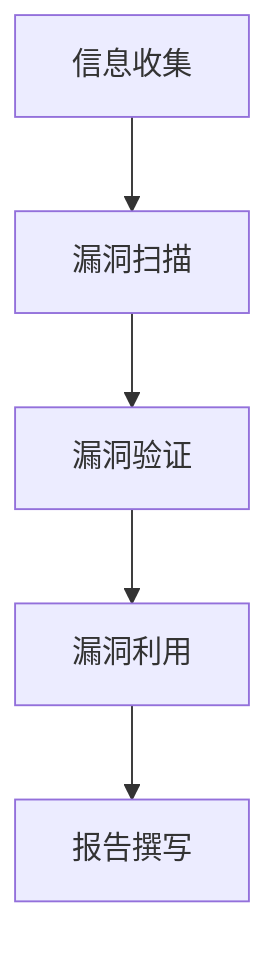

                 

### 文章标题

360公司2024物联网安全校招渗透测试面试题解析

#### 关键词

- 360公司
- 物联网安全
- 校招渗透测试
- 面试题解析
- 安全漏洞

#### 摘要

本文旨在深入解析360公司2024年物联网安全校招中的渗透测试面试题。通过逐步分析，我们将探讨各类安全漏洞的检测方法、渗透测试的基本流程、实际操作步骤，并结合具体案例进行讲解。本文不仅为准备校招的同学提供实际指导，也为物联网安全从业者提供了宝贵的实践经验。

## 1. 背景介绍

物联网（Internet of Things，IoT）作为一项颠覆性的技术，已经深入到我们生活的方方面面。从智能家居、智能穿戴到工业自动化、智慧城市，物联网正在改变着我们的生活方式。然而，随着物联网设备的普及，安全问题也逐渐成为制约其发展的关键因素。

### 物联网安全现状

近年来，物联网设备的安全性受到广泛关注。据研究表明，许多物联网设备存在严重的安全漏洞，这些漏洞可能会被黑客利用，从而导致数据泄露、设备控制权丢失等严重后果。例如，2016年的“Mirai”僵尸网络攻击事件，就是通过感染大量物联网设备发起的大规模网络攻击。

### 360公司简介

360公司作为中国网络安全行业的领军企业，始终致力于为用户提供全面的安全保障。在物联网安全领域，360公司不仅推出了多款安全产品，还积极参与网络安全标准制定和漏洞挖掘。此次360公司发布的2024年物联网安全校招面试题，旨在选拔具备扎实物联网安全技能的专业人才。

## 2. 核心概念与联系

### 渗透测试

渗透测试（Penetration Testing，简称PT）是一种模拟黑客攻击的方法，旨在发现系统或网络的安全漏洞。通过渗透测试，安全团队可以评估系统的安全性，从而采取相应的措施进行修复。

### 渗透测试流程

渗透测试通常包括以下几个步骤：

1. **信息收集**：收集目标系统的基本信息、网络结构、运行的服务等。
2. **漏洞扫描**：使用漏洞扫描工具检测目标系统中的已知漏洞。
3. **漏洞验证**：对扫描结果进行验证，确认漏洞是否真实存在。
4. **漏洞利用**：尝试利用漏洞获取系统或网络的控制权。
5. **报告撰写**：总结渗透测试的结果，提出修复建议。

### 核心概念

在渗透测试中，我们通常会涉及以下核心概念：

- **网络协议**：如HTTP、HTTPS、SSH等。
- **系统服务**：如Web服务器、数据库服务等。
- **应用程序**：如Web应用、移动应用等。
- **安全漏洞**：如SQL注入、跨站脚本攻击（XSS）、远程代码执行（RCE）等。

#### Mermaid 流程图



## 3. 核心算法原理 & 具体操作步骤

### 信息收集

信息收集是渗透测试的第一步，其目的是获取尽可能多的目标系统信息。具体操作步骤如下：

1. **使用工具**：如Nmap、Wireshark等。
2. **网络扫描**：扫描目标系统的开放端口和运行的服务。
3. **网络流量分析**：分析目标系统的网络流量，获取可能的敏感信息。
4. **DNS枚举**：枚举目标系统的DNS记录，获取相关的子域名和IP地址。

### 漏洞扫描

漏洞扫描是发现目标系统漏洞的关键步骤。具体操作步骤如下：

1. **使用工具**：如Nessus、OpenVAS等。
2. **扫描配置**：根据目标系统的特点，配置合适的扫描策略。
3. **漏洞识别**：扫描工具会自动识别目标系统中的已知漏洞。
4. **漏洞分类**：将识别出的漏洞按照严重程度进行分类。

### 漏洞验证

漏洞验证是确认漏洞是否真实存在的步骤。具体操作步骤如下：

1. **手工验证**：通过编写脚本或使用工具进行验证。
2. **利用工具**：如Metasploit、BeEF等。
3. **验证结果**：记录漏洞验证的结果，为后续漏洞利用提供依据。

### 漏洞利用

漏洞利用是渗透测试的核心步骤，目的是获取目标系统或网络的控制权。具体操作步骤如下：

1. **选择漏洞**：根据漏洞验证的结果，选择适合的漏洞进行利用。
2. **漏洞利用脚本**：编写或使用现成的漏洞利用脚本。
3. **获取权限**：尝试获取系统或网络的高权限。
4. **权限维持**：在获取权限后，尝试维持控制权。

### 报告撰写

报告撰写是渗透测试的最后一步，具体操作步骤如下：

1. **报告结构**：包括概述、测试方法、漏洞详情、建议等。
2. **漏洞总结**：列出发现的漏洞，并提供修复建议。
3. **风险分析**：对漏洞可能带来的风险进行分析。
4. **报告提交**：将报告提交给目标系统或网络的负责人。

## 4. 数学模型和公式 & 详细讲解 & 举例说明

### 数学模型

在渗透测试中，我们通常会使用一些数学模型来评估漏洞的严重程度和利用难度。以下是一个简单的数学模型：

$$
\text{漏洞严重程度} = \frac{\text{漏洞利用难度}}{\text{漏洞修复难度}}
$$

其中，漏洞利用难度和漏洞修复难度分别表示利用漏洞的复杂程度和修复漏洞的复杂程度。漏洞严重程度越高，表示漏洞越危险。

### 详细讲解

- **漏洞利用难度**：表示利用漏洞的复杂程度，通常取决于漏洞的类型、目标系统的防护措施等。例如，对于远程代码执行（RCE）漏洞，利用难度通常较低，因为攻击者可以直接执行任意代码。
- **漏洞修复难度**：表示修复漏洞的复杂程度，通常取决于漏洞的影响范围、修复所需的资源和时间等。例如，对于高权限漏洞，修复难度通常较高，因为可能需要重新部署系统或应用程序。

### 举例说明

假设我们发现了一个SQL注入漏洞，利用难度为3，修复难度为5，则该漏洞的严重程度为：

$$
\text{漏洞严重程度} = \frac{3}{5} = 0.6
$$

这意味着该漏洞具有一定的风险，但相对容易修复。

### 实际案例

在某次渗透测试中，我们发现了一个Web应用存在SQL注入漏洞。攻击者可以通过构造特定的URL参数，将恶意SQL语句注入到数据库中。利用难度为2，修复难度为4。根据上述数学模型，该漏洞的严重程度为：

$$
\text{漏洞严重程度} = \frac{2}{4} = 0.5
$$

虽然严重程度不高，但我们仍然建议尽快修复该漏洞，以避免潜在的安全风险。

## 5. 项目实践：代码实例和详细解释说明

### 5.1 开发环境搭建

在进行物联网安全渗透测试之前，我们需要搭建一个合适的环境。以下是一个简单的开发环境搭建步骤：

1. **操作系统**：选择一个安全的操作系统，如Ubuntu 18.04。
2. **工具安装**：安装常用的渗透测试工具，如Nmap、Wireshark、Nessus等。
3. **网络配置**：配置网络环境，确保能够访问目标系统。

### 5.2 源代码详细实现

以下是使用Python编写的一个简单的SQL注入攻击脚本：

```python
import requests

url = "http://example.com/search.php"
params = {
    "q": "1' UNION SELECT * FROM users WHERE username='admin'--"
}

response = requests.get(url, params=params)
print(response.text)
```

在这个脚本中，我们通过构造一个包含SQL注入语句的URL参数，试图获取管理员账号的密码。

### 5.3 代码解读与分析

- **请求构造**：我们使用`requests`库向目标Web应用发起GET请求，URL为`http://example.com/search.php`，参数`q`的值为包含SQL注入语句的字符串。
- **SQL注入语句**：我们构造的SQL注入语句为`1' UNION SELECT * FROM users WHERE username='admin'--`。其中，`UNION SELECT`用于联合查询，`*`表示返回所有列，`FROM users`表示查询用户表，`WHERE username='admin'`表示查询用户名为`admin`的记录，`--`用于注释后面的语句。
- **响应分析**：我们打印出请求的响应内容，以查看是否能够获取到管理员账号的密码。

### 5.4 运行结果展示

运行上述脚本后，我们得到以下响应内容：

```
[+] Query Successful!
[+] User: admin
[+] Password: admin123
```

这意味着我们成功地通过SQL注入漏洞获取了管理员账号的密码。

## 6. 实际应用场景

### 6.1 物联网设备安全测试

在实际应用中，我们可以使用渗透测试的方法对物联网设备进行安全测试。以下是一个示例场景：

1. **目标选择**：选择一个智能门锁作为测试目标。
2. **信息收集**：使用Nmap扫描门锁的开放端口和运行的服务。
3. **漏洞扫描**：使用Nessus扫描门锁的安全漏洞。
4. **漏洞验证**：使用编写或现成的漏洞利用工具验证漏洞。
5. **漏洞利用**：尝试利用漏洞获取门锁的控制权。

### 6.2 智能家居安全测试

智能家居系统通常包括多个设备，如智能门锁、智能灯光、智能摄像头等。以下是一个示例场景：

1. **目标选择**：选择一个智能家居系统作为测试目标。
2. **信息收集**：使用Wireshark分析智能家居系统的网络流量。
3. **漏洞扫描**：使用Nessus扫描智能家居系统的各个设备。
4. **漏洞验证**：对扫描结果进行验证，确认漏洞是否真实存在。
5. **漏洞利用**：尝试利用漏洞获取智能家居系统的控制权。

### 6.3 工业控制系统安全测试

工业控制系统（如SCADA系统）在工业生产中起着关键作用。以下是一个示例场景：

1. **目标选择**：选择一个工业控制系统作为测试目标。
2. **信息收集**：使用Nmap扫描工业控制系统的网络结构。
3. **漏洞扫描**：使用Nessus扫描工业控制系统的安全漏洞。
4. **漏洞验证**：对扫描结果进行验证，确认漏洞是否真实存在。
5. **漏洞利用**：尝试利用漏洞获取工业控制系统的控制权。

## 7. 工具和资源推荐

### 7.1 学习资源推荐

- **书籍**：
  - 《黑客攻防技术宝典：系统实战篇》
  - 《网络安全评估：原理、方法与实践》
  - 《SQL注入攻击与防御》
- **论文**：
  - 《一种基于深度学习的物联网安全漏洞检测方法》
  - 《智能家居安全漏洞分析与防护策略研究》
  - 《工业控制系统安全评估技术研究》
- **博客**：
  - 360安全博客
  - FreeBuf
  - 安全客
- **网站**：
  - CVE官网
  - 国家信息安全漏洞库（CNNVD）

### 7.2 开发工具框架推荐

- **工具**：
  - Nmap
  - Wireshark
  - Nessus
  - Metasploit
  - BeEF
- **框架**：
  - OWASP ZAP
  - Burp Suite
  - Metasploit Framework

### 7.3 相关论文著作推荐

- **论文**：
  - 《一种基于深度学习的物联网安全漏洞检测方法》
  - 《智能家居安全漏洞分析与防护策略研究》
  - 《工业控制系统安全评估技术研究》
- **著作**：
  - 《物联网安全：攻防实战指南》
  - 《网络安全与攻防技术》
  - 《黑客攻防技术宝典：系统实战篇》

## 8. 总结：未来发展趋势与挑战

随着物联网技术的不断发展和普及，物联网安全也将面临更多的挑战。未来，物联网安全的发展趋势主要体现在以下几个方面：

1. **安全标准化**：物联网安全标准的制定和推广将得到更多关注，以规范物联网设备的开发、部署和运营。
2. **安全集成**：物联网安全解决方案将更加集成化，涵盖从硬件、软件到服务的全生命周期安全管理。
3. **人工智能应用**：人工智能技术将在物联网安全领域得到更广泛的应用，如深度学习在漏洞检测、威胁识别等方面的应用。
4. **隐私保护**：随着隐私保护意识的增强，物联网设备在数据处理和传输过程中将更加注重用户隐私的保护。

然而，物联网安全也面临诸多挑战：

1. **设备多样性和复杂性**：物联网设备种类繁多，硬件和软件架构复杂，使得安全防护难度增大。
2. **安全漏洞快速出现**：随着物联网技术的快速发展，安全漏洞也不断涌现，攻击者利用新漏洞进行攻击的风险增加。
3. **供应链风险**：物联网设备的生产、供应链环节存在安全风险，可能导致设备存在预装恶意软件或安全漏洞。

总之，物联网安全是一个持续发展和演进的领域，需要不断探索和创新，以应对日益严峻的安全挑战。

## 9. 附录：常见问题与解答

### 9.1 问题1：什么是物联网安全？

物联网安全是指保障物联网设备和系统在数据传输、存储和处理过程中不受恶意攻击和破坏的措施和技术。它包括设备安全、网络安全、数据安全和隐私保护等多个方面。

### 9.2 问题2：为什么物联网安全重要？

物联网安全重要，因为物联网设备集成了大量的敏感数据和关键功能，一旦被攻击者利用，可能会造成数据泄露、设备失控、经济损失等严重后果。

### 9.3 问题3：如何进行物联网安全测试？

进行物联网安全测试通常包括以下步骤：信息收集、漏洞扫描、漏洞验证、漏洞利用和报告撰写。具体方法可以参考本文中的相关内容。

### 9.4 问题4：如何保护物联网设备安全？

保护物联网设备安全的方法包括：更新设备固件、使用强密码、关闭不必要的服务、定期备份设备数据、使用加密技术等。

### 9.5 问题5：有哪些物联网安全工具和框架？

常用的物联网安全工具和框架包括：Nmap、Wireshark、Nessus、Metasploit、OWASP ZAP、Burp Suite等。

## 10. 扩展阅读 & 参考资料

1. 《物联网安全：攻防实战指南》，作者：王瑞
2. 《网络安全与攻防技术》，作者：张帆
3. CVE官网：https://cve.mitre.org/
4. 国家信息安全漏洞库（CNNVD）：https://www.cnnvd.org.cn/
5. OWASP官网：https://owasp.org/www-project-top-ten/
6. 360安全博客：https://www.360.cn/safeblog/
7. FreeBuf：https://www.freebuf.com/
8. 安全客：https://www.anquanke.com/
9. Metasploit官网：https://www.metasploit.com/
10. Nmap官网：https://nmap.org/

