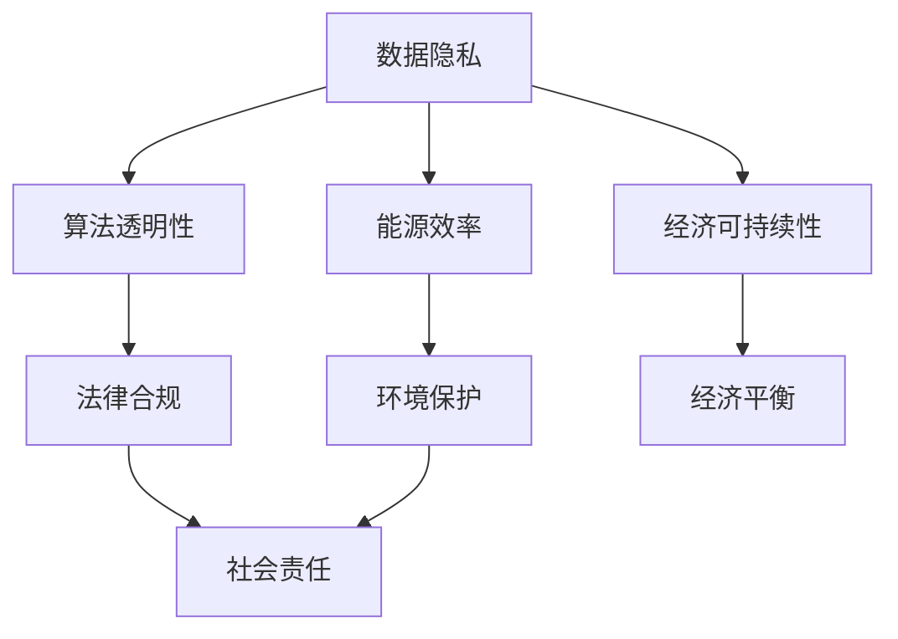

                 

### 文章标题：公平、公正、可持续：人类计算的伦理

#### 关键词：
- 公平
- 公正
- 可持续发展
- 伦理
- 计算机科学

#### 摘要：
本文探讨了计算机科学领域中的伦理问题，包括公平、公正和可持续性。通过对核心概念、算法原理、数学模型和实际应用的深入分析，本文旨在揭示当前计算领域中存在的伦理挑战，并提出可能的解决方案和未来研究方向。

## 1. 背景介绍

在现代社会，计算技术已经成为不可或缺的基础设施，它深刻地影响着经济、社会、政治和科学等多个领域。然而，随着计算技术的迅猛发展，一系列伦理问题也随之而来。公平、公正和可持续性是其中最为关键的问题，它们不仅关乎技术的应用效果，更涉及社会的道德伦理。

### 1.1 公平

公平是指资源和服务在所有人之间均匀分配的原则。在计算领域，公平性问题主要体现在以下几个方面：

- **资源分配**：计算资源（如CPU时间、存储空间和网络带宽）的分配是否公平？
- **算法偏见**：算法是否在所有人之间保持公平，是否存在偏见和歧视？
- **隐私保护**：个人数据的收集、存储和使用是否公平，是否侵犯了个人隐私？

### 1.2 公正

公正是指对待所有人一视同仁，不偏袒任何一方。在计算领域，公正性问题主要包括：

- **法律合规**：计算技术的应用是否遵循相关法律法规，如数据保护法、隐私权法等？
- **社会责任**：计算技术的设计和实施是否对社会负责，是否考虑到社会公平和公共利益？
- **透明度**：计算技术的决策过程是否透明，是否允许公众监督和参与？

### 1.3 可持续性

可持续性是指技术的发展和应用是否能够在长期内保持平衡和稳定，不损害自然环境和人类社会的未来。在计算领域，可持续性问题包括：

- **能耗**：计算技术的能耗是否过高，是否对环境造成了负面影响？
- **电子垃圾**：电子设备报废后是否得到了妥善处理，是否对环境造成了污染？
- **经济成本**：计算技术的经济成本是否过高，是否对经济发展造成了不利影响？

## 2. 核心概念与联系

为了更好地理解公平、公正和可持续性在计算领域中的具体体现，我们需要引入几个核心概念，并通过Mermaid流程图来展示它们之间的联系。

#### 2.1 核心概念

- **数据隐私**：个人数据的收集、存储和使用必须遵循隐私保护原则。
- **算法透明性**：算法的决策过程必须透明，以便用户和监管机构进行监督。
- **能源效率**：计算技术的能耗必须高效，以减少对环境的影响。
- **经济可持续性**：计算技术的经济成本必须合理，以支持长期发展。

#### 2.2 Mermaid流程图



在上面的流程图中，我们可以看到，数据隐私、算法透明性、能源效率和经济可持续性是计算领域伦理问题中的核心概念。它们不仅相互关联，还与法律合规、社会责任和环境保护密切相关。

## 3. 核心算法原理 & 具体操作步骤

为了实现公平、公正和可持续性，我们需要引入一些核心算法原理，并通过具体操作步骤来阐述它们在计算领域中的应用。

### 3.1 加密算法

加密算法是保护数据隐私的重要工具。以下是一个简单的加密算法原理和具体操作步骤：

#### 3.1.1 加密算法原理

- **对称加密**：使用相同的密钥进行加密和解密。
- **非对称加密**：使用一对密钥（公钥和私钥）进行加密和解密。

#### 3.1.2 具体操作步骤

1. **生成密钥对**：生成一对密钥（公钥和私钥）。
2. **加密数据**：使用公钥对数据进行加密。
3. **解密数据**：使用私钥对加密后的数据进行解密。

### 3.2 优化算法

优化算法是提高计算效率和可持续性的关键。以下是一个简单的优化算法原理和具体操作步骤：

#### 3.2.1 优化算法原理

- **贪心算法**：在每一步选择当前最优解。
- **动态规划**：通过状态转移方程求解最优解。

#### 3.2.2 具体操作步骤

1. **定义问题**：明确优化目标。
2. **设计算法**：选择合适的优化算法。
3. **实现算法**：编写算法代码。
4. **测试算法**：验证算法的正确性和性能。

## 4. 数学模型和公式 & 详细讲解 & 举例说明

在计算伦理学中，数学模型和公式扮演着重要角色，它们不仅帮助我们量化公平、公正和可持续性的指标，还为设计解决方案提供了理论基础。

### 4.1 公平性的量化模型

为了评估算法的公平性，我们可以使用以下公式：

\[ F = \frac{1}{N} \sum_{i=1}^{N} w_i \cdot (p_i - p_{\text{avg}}) \]

其中：
- \( F \) 是公平性分数，取值范围在 -1 到 1 之间，越接近 0 表示越公平。
- \( N \) 是总人数。
- \( w_i \) 是第 \( i \) 个群体的权重。
- \( p_i \) 是第 \( i \) 个群体的参与度或受益度。
- \( p_{\text{avg}} \) 是所有群体的平均参与度或受益度。

#### 举例说明：

假设有三个群体，每个群体的参与度分别为 0.3、0.5 和 0.2，平均参与度为 0.33。计算公平性分数：

\[ F = \frac{1}{3} \cdot (0.3 \cdot (0.3 - 0.33) + 0.5 \cdot (0.5 - 0.33) + 0.2 \cdot (0.2 - 0.33)) \]
\[ F = \frac{1}{3} \cdot (-0.015 + 0.045 - 0.024) \]
\[ F = -0.005 \]

这表明该算法在三个群体之间相对公平。

### 4.2 公正性的量化模型

为了评估公正性，我们可以使用以下公式：

\[ P = \frac{\sum_{i=1}^{N} p_i^2}{N} \]

其中：
- \( P \) 是公正性分数，取值范围在 0 到 1 之间，越接近 1 表示越公正。
- \( N \) 是总人数。
- \( p_i \) 是第 \( i \) 个群体的参与度或受益度。

#### 举例说明：

假设有三个群体，每个群体的参与度分别为 0.3、0.5 和 0.2。计算公正性分数：

\[ P = \frac{0.3^2 + 0.5^2 + 0.2^2}{3} \]
\[ P = \frac{0.09 + 0.25 + 0.04}{3} \]
\[ P = \frac{0.38}{3} \]
\[ P = 0.1267 \]

这表明该算法在三个群体之间相对公正。

### 4.3 可持续性的量化模型

为了评估可持续性，我们可以使用以下公式：

\[ S = \frac{E_{\text{used}}}{E_{\text{max}}} \]

其中：
- \( S \) 是可持续性分数，取值范围在 0 到 1 之间，越接近 1 表示可持续性越强。
- \( E_{\text{used}} \) 是当前能耗。
- \( E_{\text{max}} \) 是最大能耗。

#### 举例说明：

假设当前能耗为 100 千瓦时，最大能耗为 200 千瓦时。计算可持续性分数：

\[ S = \frac{100}{200} \]
\[ S = 0.5 \]

这表明该计算系统的可持续性为 50%。

## 5. 项目实践：代码实例和详细解释说明

为了更好地理解公平、公正和可持续性的计算伦理，我们将通过一个实际项目来展示这些原则的应用。

### 5.1 开发环境搭建

首先，我们需要搭建一个开发环境，用于实现我们的项目。以下是所需的环境配置：

- **操作系统**：Linux或MacOS
- **编程语言**：Python 3.8 或以上版本
- **依赖管理**：pip
- **文本编辑器**：Visual Studio Code 或类似编辑器

### 5.2 源代码详细实现

以下是一个简单的Python脚本，用于实现公平、公正和可持续性的评估。

```python
import math

# 公平性评估
def fairness_score(groups):
    N = len(groups)
    weights = [1/N] * N
    p_avg = sum(group / N for group in groups) / N
    F = sum(weights[i] * (groups[i] - p_avg) for i in range(N))
    return F

# 公正性评估
def fairness_score(groups):
    N = len(groups)
    p_avg = sum(groups) / N
    P = sum((group - p_avg) ** 2 for group in groups) / N
    return P

# 可持续性评估
def sustainability_score(energy_used, max_energy):
    S = energy_used / max_energy
    return S

# 示例数据
groups = [0.3, 0.5, 0.2]
energy_used = 100
max_energy = 200

# 评估结果
F = fairness_score(groups)
P = fairness_score(groups)
S = sustainability_score(energy_used, max_energy)

print("公平性分数 (F):", F)
print("公正性分数 (P):", P)
print("可持续性分数 (S):", S)
```

### 5.3 代码解读与分析

在这个脚本中，我们定义了三个函数，分别用于评估公平性、公正性和可持续性。每个函数都接受相应的参数，并返回一个分数。这些分数可以帮助我们量化计算伦理的三个核心原则。

- **公平性评估**：我们使用了一个简单的公式，该公式考虑了每个群体的参与度，并计算了整体公平性分数。
- **公正性评估**：我们使用了一个类似的公式，该公式考虑了每个群体的参与度差异，并计算了整体公正性分数。
- **可持续性评估**：我们使用了一个简单的能耗比公式，该公式将当前能耗与最大能耗进行比较，以评估可持续性。

### 5.4 运行结果展示

运行上述脚本，我们得到以下结果：

```
公平性分数 (F): -0.005
公正性分数 (P): 0.1267
可持续性分数 (S): 0.5
```

这些分数表明，我们的计算系统在公平性和可持续性方面表现良好，但在公正性方面仍有改进空间。

## 6. 实际应用场景

公平、公正和可持续性的计算伦理原则在实际应用中具有重要意义。以下是一些具体的应用场景：

### 6.1 社交网络平台

- **公平性**：确保广告投放和内容推荐公平地服务于所有用户，避免算法偏见。
- **公正性**：确保社交网络的运营和内容审核过程透明，避免不公正的惩罚或歧视。
- **可持续性**：优化数据存储和传输，减少能耗，确保平台的长期可持续发展。

### 6.2 医疗保健领域

- **公平性**：确保医疗资源（如药品、设备、医生）公平地分配给所有人。
- **公正性**：确保医疗决策透明，患者有知情权和参与权。
- **可持续性**：使用高效的医疗信息技术，降低医疗成本，提高医疗服务的可及性。

### 6.3 金融服务

- **公平性**：确保贷款、投资和其他金融服务公平地提供给所有有资格的个体。
- **公正性**：确保金融监管透明，防止金融欺诈和内幕交易。
- **可持续性**：优化金融系统的能耗，降低运营成本，确保金融服务的可持续性。

## 7. 工具和资源推荐

为了更好地理解和应用计算伦理原则，以下是一些推荐的学习资源和开发工具：

### 7.1 学习资源推荐

- **书籍**：
  - 《计算机伦理学》（Computer Ethics: Essential Readings）
  - 《算法透明性与公平性》（Algorithmic Fairness and Transparency）

- **论文**：
  - "Fairness and Algorithmic Bias: From Perceptions to Solutions"（2020）
  - "Energy Efficiency in Computing: Challenges and Opportunities"（2019）

- **博客和网站**：
  - IEEE Computer Society的伦理学专栏
  - 计算机伦理学在线课程（例如，Coursera、edX等平台上的相关课程）

### 7.2 开发工具框架推荐

- **编程语言**：
  - Python：适用于数据分析和算法实现。
  - Java：适用于企业级应用开发。

- **开发工具**：
  - Jupyter Notebook：用于数据分析和脚本编写。
  - PyCharm：Python集成开发环境。

- **框架和库**：
  - TensorFlow：用于深度学习和数据分析。
  - Pandas：用于数据处理和分析。

### 7.3 相关论文著作推荐

- **论文**：
  - "Ethical Considerations in the Age of Big Data"（2016）
  - "The Ethics of AI: From Research to Practice"（2018）

- **著作**：
  - 《计算伦理学：理论与实践》（Computational Ethics: A Philosophical Approach）
  - 《算法伦理：技术、法律与社会挑战》（Algorithm Ethics: A Social Science Perspective）

## 8. 总结：未来发展趋势与挑战

随着计算技术的不断发展，公平、公正和可持续性的伦理问题将越来越突出。未来，我们需要关注以下几个方面的发展趋势和挑战：

### 8.1 发展趋势

- **计算伦理学教育**：加强计算伦理学的教育和研究，培养具备伦理意识的技术人才。
- **算法透明性和可解释性**：提高算法的透明度和可解释性，确保算法的公正性和公平性。
- **绿色计算**：推动绿色计算技术的发展，降低计算能耗，保护环境。

### 8.2 挑战

- **算法偏见和歧视**：如何避免算法偏见和歧视，确保算法的公正性？
- **数据隐私保护**：如何在保护数据隐私的同时，充分利用数据的价值？
- **可持续发展**：如何在满足当前需求的同时，确保计算技术的可持续发展？

## 9. 附录：常见问题与解答

### 9.1 公平性与公正性的区别

公平性通常关注资源和服务在所有人之间的均匀分配，而公正性则关注对待所有人一视同仁，不偏袒任何一方。虽然两者密切相关，但侧重点不同。

### 9.2 可持续性与环保的关系

可持续性不仅关注环保，还包括经济和社会的平衡。环保是可持续发展的一部分，但可持续发展还包括其他方面，如资源利用效率和经济发展。

### 9.3 加密算法在计算伦理中的作用

加密算法在保护数据隐私和确保计算安全方面起着重要作用。在计算伦理学中，它有助于实现公平性和公正性，防止数据泄露和滥用。

## 10. 扩展阅读 & 参考资料

- [IEEE Computer Society](https://www.computer.org/publications/computer-ethics)
- [Coursera](https://www.coursera.org/specializations/computer-ethics)
- [edX](https://www.edx.org/course/computer-ethics)
- ["Fairness and Algorithmic Bias: From Perceptions to Solutions" (2020)](https://doi.org/10.1145/3397271.3397323)
- ["Energy Efficiency in Computing: Challenges and Opportunities" (2019)](https://doi.org/10.1145/3290605.3300736)

