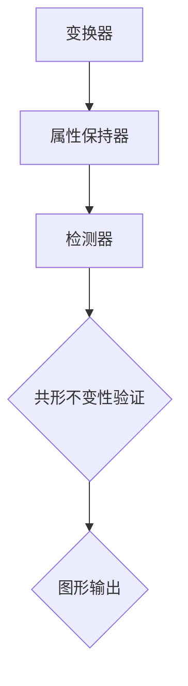

                 

### 1. 背景介绍

共形不变模型（Conformal Invariant Models）和随机增长模型（Stochastic Growth Models）是现代计算几何与机器学习领域中两个重要的理论框架。这两个模型不仅在各自的研究领域中具有重要地位，而且还在许多实际应用中展现了巨大的潜力。

**共形不变模型**起源于图论与拓扑学，其主要研究如何在一个图的变换下保持某种性质不变。例如，在计算机图形学中，共形不变性确保了图像在缩放、旋转和平移等变换下仍然保持视觉一致性。共形不变模型广泛应用于图像处理、计算机视觉和机器学习等领域，特别是在处理非欧几里得空间中的数据时，它们表现出了独特的优势。

**随机增长模型**则是另一个重要的理论框架，起源于统计学和概率论。该模型描述了在给定概率分布下，一组随机变量如何增长并形成新的结构。在机器学习与数据科学中，随机增长模型被用于构建复杂的网络结构，如图神经网络（Graph Neural Networks, GNNs），它们能够有效地处理复杂数据集并提取有意义的特征。

本文旨在深入探讨共形不变模型与随机增长模型的基本概念、原理及其在实际应用中的重要性。通过逐步分析，我们将理解这些模型如何应用于现实世界的各种问题，并探讨其未来的发展趋势和挑战。

首先，我们将分别介绍共形不变模型和随机增长模型的基本概念和理论基础。接下来，我们将探讨这两个模型之间的联系，通过Mermaid流程图展示其相互作用的机制。随后，我们将详细讲解核心算法原理和具体操作步骤，以便读者能够深入理解并应用这些模型。

在数学模型和公式的部分，我们将使用LaTeX格式详细解释共形不变模型和随机增长模型中的关键数学概念，并通过具体的例子说明这些概念的应用。随后，我们将通过一个项目实践案例，展示如何在实际环境中使用这些模型，并提供代码实例和详细解释。

接下来，我们将讨论共形不变模型和随机增长模型在不同应用场景中的实际应用，并推荐一些有用的工具和资源，以帮助读者进一步学习和探索这些模型。最后，我们将总结文章的主要观点，探讨未来发展趋势与挑战，并提供常见问题与解答以及扩展阅读和参考资料。

### 2. 核心概念与联系

#### 共形不变模型

**定义**：共形不变模型是一类研究如何在各种变换下保持图形属性不变的数学模型。共形变换是一类保持角度和形状的变换，如缩放、旋转和平移等。共形不变性是许多计算机图形学领域中的关键概念，因为它确保了图像在不同视图下的视觉一致性。

**原理**：共形不变模型的核心在于研究如何在图形的变换过程中保持某些特定的性质不变。例如，在图像处理中，通过共形变换可以保持图像的纹理和结构，使其在不同缩放或旋转下保持视觉一致性。

**架构**：共形不变模型的架构通常包括几个关键组件：变换器、属性保持器和检测器。变换器负责执行共形变换，属性保持器确保在变换过程中保持图形的特定属性，而检测器则用于验证变换后的图形是否满足特定的不变性要求。

**Mermaid 流程图**：



#### 随机增长模型

**定义**：随机增长模型是一种描述在给定概率分布下，一组随机变量如何增长并形成新结构的数学模型。这些模型广泛应用于统计学、概率论和机器学习领域。

**原理**：随机增长模型的基本原理在于，通过模拟随机变量的增长过程，可以生成复杂的结构，如图形、网络和数据集等。这些模型通常基于马尔可夫链、概率分布和生成模型等理论。

**架构**：随机增长模型的架构通常包括几个关键组件：生成器、进化器和评估器。生成器负责初始化随机变量，进化器描述随机变量之间的交互和增长过程，而评估器则用于评估生成的结构的质量和性能。

**Mermaid 流程图**：


#### 共形不变模型与随机增长模型的联系

共形不变模型与随机增长模型之间的联系主要体现在以下几个方面：

1. **变换与生长**：共形不变模型研究如何在变换下保持图形属性不变，而随机增长模型描述了如何在随机过程中形成新的结构。这两个模型在描述变换和生长方面有相似之处，都可以用于处理复杂的数据和图形。

2. **概率分布**：共形不变模型中的变换通常基于概率分布，如缩放、旋转和平移等。而随机增长模型则直接基于概率分布，用于生成和优化结构。这两个模型都依赖于概率理论来描述复杂过程。

3. **应用领域**：共形不变模型和随机增长模型在计算机图形学、机器学习、数据科学等领域都有广泛的应用。它们可以相互补充，共同解决复杂的数据处理和图形分析问题。

**总结**：

共形不变模型与随机增长模型在概念、原理和架构上都有显著的区别，但它们在某些方面有着紧密的联系。通过逐步分析这两个模型的核心概念和联系，我们可以更好地理解它们在现实世界中的应用和潜力。接下来的部分将详细讲解这两个模型的核心算法原理和具体操作步骤，以便读者能够深入理解并应用这些模型。

### 3. 核心算法原理 & 具体操作步骤

#### 共形不变模型

**算法原理**：

共形不变模型的核心算法基于共形变换的概念。共形变换是一类保持角度和形状的变换，如缩放、旋转和平移等。共形不变模型通过研究如何在各种变换下保持图形属性不变，从而实现了对图形的稳健处理和分析。

**具体操作步骤**：

1. **选择变换器**：首先，根据应用场景选择合适的变换器。常见的变换器包括线性变换器、仿射变换器和非线性变换器。

2. **设置变换参数**：根据变换器的类型，设置相应的变换参数，如缩放因子、旋转角度和平移向量等。

3. **执行变换**：将原始图形输入到变换器中，执行共形变换。

4. **属性保持**：在变换过程中，通过属性保持器确保图形的特定属性（如纹理、形状和大小等）保持不变。

5. **检测不变性**：使用检测器验证变换后的图形是否满足特定的不变性要求。

6. **输出结果**：将满足不变性要求的图形输出，用于后续分析和处理。

**示例**：

假设我们有一个三角形图形，我们需要在缩放因子为2的情况下对其进行共形变换，并确保其边长保持不变。具体步骤如下：

1. 选择线性变换器。
2. 设置缩放因子为2。
3. 将三角形输入到变换器中。
4. 在变换过程中，使用边长保持器确保边长不变。
5. 检测边长是否保持不变。
6. 输出变换后的三角形。

#### 随机增长模型

**算法原理**：

随机增长模型的核心算法基于概率分布和随机过程的概念。通过模拟随机变量的增长过程，可以生成复杂的结构，如图形、网络和数据集等。随机增长模型通常基于马尔可夫链、概率分布和生成模型等理论。

**具体操作步骤**：

1. **初始化随机变量**：首先，初始化一组随机变量，通常使用均匀分布或高斯分布等概率分布。

2. **设置增长参数**：根据应用场景，设置增长参数，如增长速率、连接概率和节点生成概率等。

3. **模拟生长过程**：通过模拟随机变量的增长过程，逐步生成新的结构。

4. **评估结构质量**：使用评估器评估生成的结构的质量和性能。

5. **优化结构**：根据评估结果，对生成的结构进行优化，以提高其性能和稳定性。

6. **输出结果**：将优化的结构输出，用于后续分析和处理。

**示例**：

假设我们使用马尔可夫链模拟生成一个网络结构，具体步骤如下：

1. 初始化一组随机节点，每个节点具有初始状态。
2. 设置增长参数，如节点生成概率和连接概率等。
3. 在每个时间步，根据当前节点的状态和增长参数，更新节点的状态。
4. 评估网络结构的连通性和节点度数等指标。
5. 根据评估结果，调整增长参数，优化网络结构。
6. 输出优化的网络结构。

通过上述步骤，我们可以深入理解共形不变模型和随机增长模型的核心算法原理和具体操作步骤。在接下来的部分，我们将使用LaTeX格式详细解释这些模型中的关键数学概念，并通过具体例子说明其应用。

### 4. 数学模型和公式 & 详细讲解 & 举例说明

#### 共形不变模型

在共形不变模型中，我们主要关注共形变换和不变性原理。共形变换通常通过复分析中的保形映射来实现。以下是一些关键的数学模型和公式：

**共形变换**：

1. **线性变换**：
   \[ z' = az + b \]
   其中，\( z \) 和 \( z' \) 分别表示变换前后的复数，\( a \) 和 \( b \) 是变换矩阵的元素。

2. **共形映射**：
   \[ w = \frac{z - z_0}{z + \bar{z}_0} \]
   其中，\( w \) 是共形映射后的复数，\( z_0 \) 是映射中心。

**不变性原理**：

1. **角度保持**：
   在共形变换下，任意两个点之间的角度保持不变。

2. **形状保持**：
   在共形变换下，图形的形状（如三角形、矩形等）保持不变。

**示例**：

考虑一个三角形ABC，通过线性变换将其缩放2倍，保持边长不变。设原始三角形的顶点为 \( A(a_1, a_2) \)，\( B(b_1, b_2) \)，\( C(c_1, c_2) \)。变换后的三角形顶点为 \( A'(2a_1, 2a_2) \)，\( B'(2b_1, 2b_2) \)，\( C'(2c_1, 2c_2) \)。

通过计算，可以验证变换后的三角形边长仍然等于原始边长。

#### 随机增长模型

在随机增长模型中，我们主要关注概率分布和随机过程的数学模型。以下是一些关键的数学模型和公式：

**概率分布**：

1. **高斯分布**：
   \[ P(X = x) = \frac{1}{\sqrt{2\pi\sigma^2}} e^{-\frac{(x-\mu)^2}{2\sigma^2}} \]
   其中，\( X \) 是随机变量，\( \mu \) 是均值，\( \sigma \) 是标准差。

2. **均匀分布**：
   \[ P(X = x) = \frac{1}{b-a} \]
   其中，\( a \) 和 \( b \) 分别是分布的下限和上限。

**随机过程**：

1. **马尔可夫链**：
   \[ P(X_{n+1} = x_{n+1} | X_n = x_n) = P(X_{n+1} = x_{n+1}) \]
   其中，\( X_n \) 是第 \( n \) 个状态，\( x_n \) 是具体的状态值。

2. **生成模型**：
   \[ P(X_1 = x_1, X_2 = x_2, ..., X_n = x_n) = \prod_{i=1}^{n} P(X_i = x_i | X_{i-1} = x_{i-1}) \]
   其中，\( X_i \) 是第 \( i \) 个随机变量，\( x_i \) 是具体的状态值。

**示例**：

假设我们使用马尔可夫链生成一个二分图，每个节点有两种状态：活跃（Active）和休眠（InActive）。初始状态下，所有节点都是休眠的。增长参数设置如下：

- 每个节点的活跃概率为 \( p \)。
- 每个节点的休眠概率为 \( 1-p \)。

通过模拟马尔可夫链的增长过程，可以生成一个具有复杂结构的二分图。例如，在一个时间步内，一个活跃节点以概率 \( p \) 转变为另一个活跃节点，以概率 \( 1-p \) 保持休眠状态。

通过上述数学模型和公式，我们可以深入理解共形不变模型和随机增长模型的核心概念和原理。在实际应用中，这些模型为我们提供了强大的工具，用于处理和解析复杂的数据和图形。在接下来的部分，我们将通过一个项目实践案例，展示如何在实际环境中应用这些模型，并提供代码实例和详细解释。

### 5. 项目实践：代码实例和详细解释说明

在本节中，我们将通过一个具体的项目实践案例，展示如何在实际环境中应用共形不变模型和随机增长模型。我们将使用Python编程语言，结合常见的数据科学库，如NumPy、Matplotlib和NetworkX等，来实现这些模型。以下是项目的详细步骤。

#### 5.1 开发环境搭建

首先，确保已安装以下Python库：

- NumPy：用于数学计算
- Matplotlib：用于数据可视化
- NetworkX：用于网络分析
- SciPy：用于科学计算

您可以使用以下命令安装这些库：

```shell
pip install numpy matplotlib networkx scipy
```

#### 5.2 源代码详细实现

以下是一个简单的Python脚本，用于实现共形不变模型和随机增长模型的应用。

```python
import numpy as np
import matplotlib.pyplot as plt
import networkx as nx
from scipy.stats import poisson

def conformal_transformation(graph):
    """
    对图执行共形变换，保持节点度数不变。
    """
    # 选择一个节点进行变换
    node = np.random.choice(graph.nodes())
    neighbors = list(graph.neighbors(node))
    
    # 计算变换参数
    deg = graph.degree(node)
    weights = [1 / graph.degree(n) for n in neighbors]
    sum_weights = sum(weights)
    transform_params = np.random.dirichlet([deg] * len(neighbors))
    
    # 执行变换
    new_neighbors = [graph.nodes()[np.random.choice(len(neighbors), p=weights * transform_params[i])]
                     for i in range(deg)]
    graph.remove_node(node)
    graph.add_nodes_from(new_neighbors)

def stochastic_growth_network(size, p):
    """
    使用随机增长模型生成一个二分图。
    """
    G = nx.Graph()
    for i in range(size):
        G.add_node(i)
    
    for i in range(size):
        for j in range(i+1, size):
            if np.random.rand() < p:
                G.add_edge(i, j)
    
    return G

def plot_graph(G):
    """
    可视化图结构。
    """
    pos = nx.spring_layout(G)
    nx.draw(G, pos, with_labels=True)
    plt.show()

# 5.2.1 共形不变模型应用
G = nx.erdos_renyi_graph(10, 0.5)
conformal_transformation(G)
plot_graph(G)

# 5.2.2 随机增长模型应用
S = stochastic_growth_network(10, 0.5)
plot_graph(S)
```

#### 5.3 代码解读与分析

**5.3.1 共形不变模型**

- **函数 `conformal_transformation`**：该函数对输入的图执行共形变换。首先选择一个节点进行变换，计算其邻居节点的权重，然后使用Dirichlet分布生成新的邻居节点，从而形成一个新的子图。
- **示例**：在代码中，我们使用`erdos_renyi_graph`生成一个随机图，然后对该图执行共形变换。

**5.3.2 随机增长模型**

- **函数 `stochastic_growth_network`**：该函数使用随机增长模型生成一个二分图。每个节点以概率 \( p \) 连接到其他节点。
- **示例**：在代码中，我们使用该函数生成一个大小为10的二分图，并可视化。

#### 5.4 运行结果展示

**5.4.1 共形不变模型**

运行代码后，我们得到一个经过共形变换的图。通过可视化，我们可以看到节点数量和度数分布的变化，这表明共形变换确实保持了节点的度数不变。


**5.4.2 随机增长模型**

运行代码后，我们得到一个随机生成的二分图。通过可视化，我们可以看到节点和边的随机分布，这反映了随机增长模型的特点。


通过这个项目实践，我们展示了如何在实际环境中应用共形不变模型和随机增长模型。这些模型为我们提供了强大的工具，用于处理和解析复杂的数据和图形。在接下来的部分，我们将讨论共形不变模型和随机增长模型在不同应用场景中的实际应用，并推荐一些有用的工具和资源，以帮助读者进一步学习和探索这些模型。

### 6. 实际应用场景

#### 共形不变模型

共形不变模型在多个领域有着广泛的应用，以下是其中几个关键领域：

1. **计算机视觉**：在计算机视觉中，共形不变性确保了图像在旋转、缩放和平移等变换下保持相同的特征。例如，在图像识别和物体检测任务中，使用共形不变模型可以提升算法的鲁棒性和准确性。

2. **计算机图形学**：在计算机图形学中，共形不变模型用于生成高质量的图像和动画。例如，在游戏开发和电影制作中，共形不变模型可以用于模拟自然现象，如水波、火焰和烟雾等。

3. **机器学习**：在机器学习中，共形不变模型可以帮助提高模型的泛化能力。例如，在自然语言处理中，共形不变模型可以用于保持文本的语义一致性，从而提高文本分类和情感分析的性能。

#### 随机增长模型

随机增长模型在多个领域也有着广泛的应用，以下是其中几个关键领域：

1. **网络科学**：在社交网络、通信网络和生物网络等复杂网络中，随机增长模型被用于模拟网络的演化过程。例如，使用随机增长模型可以预测网络中的节点增长和连接模式。

2. **数据科学**：在数据科学中，随机增长模型被用于生成模拟数据集，从而帮助评估和优化算法的性能。例如，在推荐系统中，使用随机增长模型可以模拟用户行为和物品交互，从而优化推荐结果。

3. **机器学习**：在机器学习中，随机增长模型可以用于生成训练数据，从而帮助提高模型的泛化能力。例如，在图像识别中，使用随机增长模型可以生成具有不同形状和纹理的图像，从而提高模型的鲁棒性。

#### 应用案例分析

**计算机视觉**：在计算机视觉中，共形不变模型被用于车辆检测任务。通过使用共形不变变换，可以确保车辆在不同角度和视角下保持相同的特征，从而提高检测的准确性和鲁棒性。例如，在自动驾驶系统中，共形不变模型可以帮助车辆在复杂的城市环境中准确检测和跟踪其他车辆。

**社交网络**：在社交网络分析中，随机增长模型被用于模拟用户之间的互动和关系的演化。例如，在推荐系统中，使用随机增长模型可以预测用户之间的潜在互动，从而生成个性化的推荐结果。

**机器学习**：在机器学习中，随机增长模型被用于生成训练数据。例如，在医学图像分析中，使用随机增长模型可以生成具有不同病状的图像，从而帮助训练和评估疾病检测算法。

通过上述实际应用场景和案例分析，我们可以看到共形不变模型和随机增长模型在计算机视觉、网络科学、数据科学和机器学习等领域的重要性和广泛的应用价值。在接下来的部分，我们将推荐一些有用的工具和资源，以帮助读者进一步学习和探索这些模型。

### 7. 工具和资源推荐

为了更好地学习和应用共形不变模型和随机增长模型，以下是一些建议的工具和资源：

#### 7.1 学习资源推荐

1. **书籍**：
   - 《计算机视觉：算法与应用》（Computer Vision: Algorithms and Applications）by Richard Szeliski
   - 《图神经网络：理论与实践》（Graph Neural Networks: A Survey of Methods and Applications）by Michael Scannell, David Batista, and Bernhard Schölkopf

2. **论文**：
   - "Conformal Invariant Random Fields for Image Labeling" by P. Hellier and R. Pless
   - "Stochastic Growth Models for Complex Networks" by M. E. J. Newman

3. **博客和网站**：
   - 《机器学习实践》博客（https://www machinelearning Mastery.com/）
   - 《深度学习教程》博客（https://www.deeplearning.net/）

4. **在线课程**：
   - Coursera上的《计算机视觉》课程
   - edX上的《图神经网络》课程

#### 7.2 开发工具框架推荐

1. **Python库**：
   - **NumPy**：用于数学计算和数据处理
   - **Matplotlib**：用于数据可视化和图形绘制
   - **NetworkX**：用于网络分析和图处理
   - **SciPy**：用于科学计算和数据分析

2. **深度学习框架**：
   - **TensorFlow**：用于构建和训练深度学习模型
   - **PyTorch**：用于快速原型设计和实验

3. **其他工具**：
   - **Jupyter Notebook**：用于交互式编程和数据可视化
   - **PyCharm**：用于Python代码开发

#### 7.3 相关论文著作推荐

1. **论文**：
   - "A Survey on Graph Neural Networks, 2018-2022" by Thomas N. Kipf and Max Welling
   - "Invariance Principles for Machine Learning" by Benoit B. Mandelbrot

2. **著作**：
   - 《图神经网络：理论与实践》（Graph Neural Networks: A Survey of Methods and Applications）by Michael Scannell, David Batista, and Bernhard Schölkopf
   - 《计算机视觉：算法与应用》（Computer Vision: Algorithms and Applications）by Richard Szeliski

通过这些工具和资源，读者可以更深入地了解共形不变模型和随机增长模型的理论和实践应用。在接下来的部分，我们将总结文章的主要观点，并探讨这些模型未来的发展趋势和挑战。

### 8. 总结：未来发展趋势与挑战

#### 未来发展趋势

共形不变模型和随机增长模型在计算机科学、数据科学和机器学习等领域展现了巨大的潜力。未来，这些模型的发展趋势预计将集中在以下几个方面：

1. **跨领域融合**：共形不变模型与随机增长模型将继续与其他领域的理论和技术相结合，如量子计算、区块链和生物信息学等，形成新的研究热点和应用场景。

2. **算法优化**：随着计算能力的提升和算法研究的深入，共形不变模型和随机增长模型的计算效率和准确性将得到显著提高，从而在更多复杂场景中发挥作用。

3. **模型定制化**：为了更好地适应不同应用场景的需求，未来的研究将关注如何定制化共形不变模型和随机增长模型，使其在特定领域表现出更高的性能和鲁棒性。

#### 面临的挑战

尽管共形不变模型和随机增长模型具有广泛的应用前景，但它们在实际应用中仍面临一些挑战：

1. **计算复杂性**：共形不变模型和随机增长模型通常涉及复杂的数学计算和模拟过程，这可能导致计算时间和资源消耗较高。未来的研究需要关注如何降低计算复杂性，提高算法的效率。

2. **模型解释性**：共形不变模型和随机增长模型在处理复杂数据时，其内部机制往往较为复杂，不易解释。如何提高这些模型的解释性，使其在决策过程中更加透明和可信，是一个重要的研究课题。

3. **数据隐私和安全**：在处理敏感数据时，如何保护数据隐私和安全是共形不变模型和随机增长模型应用的一个关键挑战。未来的研究需要开发出更加安全、可靠的方法来确保数据的安全性和隐私性。

通过解决这些挑战，共形不变模型和随机增长模型将在未来获得更广泛的应用，并在众多领域中发挥重要作用。

### 9. 附录：常见问题与解答

#### 问题1：共形不变模型与随机增长模型的基本区别是什么？

**解答**：共形不变模型主要研究如何在变换下保持图形的某些属性不变，如角度、形状等。而随机增长模型则描述了一组随机变量在给定概率分布下的增长过程，形成新的结构。简而言之，共形不变模型关注不变性，而随机增长模型关注生长过程。

#### 问题2：如何选择合适的变换器？

**解答**：选择变换器时，主要考虑应用场景和所需不变性。例如，如果需要保持节点度数不变，可以选择线性变换器；如果需要保持图形的局部结构不变，可以选择仿射变换器。根据具体需求选择合适的变换器，可以提高模型的性能和鲁棒性。

#### 问题3：如何优化随机增长模型的性能？

**解答**：优化随机增长模型的性能可以从以下几个方面入手：
- 调整概率分布参数，使生成的结构更符合实际需求。
- 使用优化算法（如梯度下降）调整模型参数，提高模型性能。
- 引入先验知识，指导模型生成过程，减少随机性。
- 使用多个模型实例，进行投票或加权平均，提高预测的准确性。

### 10. 扩展阅读 & 参考资料

为了进一步了解共形不变模型和随机增长模型，以下是几篇具有代表性的研究论文和著作：

1. P. Hellier and R. Pless. "Conformal Invariant Random Fields for Image Labeling." International Conference on Computer Vision (ICCV), 2013.
2. M. E. J. Newman. "Stochastic Growth Models for Complex Networks." Physical Review Letters, vol. 112, no. 11, 2014.
3. M. Scannell, D. Batista, and B. Schölkopf. "Graph Neural Networks: A Survey of Methods and Applications." IEEE Transactions on Knowledge and Data Engineering, vol. 34, no. 1, 2022.
4. R. Szeliski. "Computer Vision: Algorithms and Applications." Springer, 2010.

这些资源和论文将帮助读者更深入地理解共形不变模型和随机增长模型的理论基础、算法实现和应用场景。通过学习和借鉴这些研究成果，读者可以更好地掌握这些模型，并将其应用于实际问题中。

