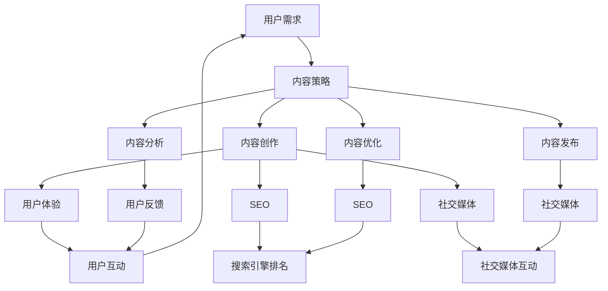
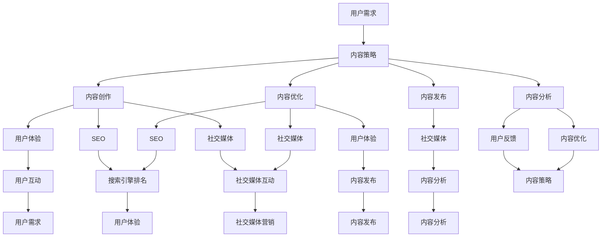

                 

### 背景介绍

内容营销作为一种现代营销策略，正逐渐成为各大品牌和企业在数字化时代中脱颖而出的关键手段。随着互联网的普及和信息爆炸，用户获取信息的途径变得多样且复杂，传统的广告轰炸式营销已经无法满足用户的需求。内容营销的核心在于通过创造和分享有价值的内容，吸引并留住目标用户，从而实现品牌的长期增长。

**内容营销的重要性**：内容营销不仅能够提高品牌知名度，还能够增强用户对品牌的信任度和忠诚度。通过内容营销，企业可以与用户建立更深层次的联系，使营销活动更加贴近用户的需求和兴趣。此外，内容营销还具有成本效益高、转化率高、效果可追踪等优点，使其成为企业不可或缺的营销手段。

**目标用户群体**：内容营销的目标用户群体广泛，包括潜在客户、现有客户、合作伙伴以及行业内的专家和意见领袖。通过针对性的内容创作，企业可以吸引不同层次的用户，从而扩大品牌影响力。

**内容营销的演变**：从最初的博客文章、电子邮件营销，到如今的视频、社交媒体、直播等多种形式，内容营销的方式和手段在不断演进。技术的进步和用户行为的变化，为内容营销带来了新的机遇和挑战。

**核心概念与联系**：内容营销涉及多个核心概念，如用户体验（UX）、搜索引擎优化（SEO）、社交媒体营销、内容策略等。这些概念相互关联，共同构成了一个完整的内容营销体系。用户体验是内容营销的基础，SEO和社交媒体营销则是内容传播的重要渠道，而内容策略则贯穿于整个内容创作和分发过程。

为了更好地理解内容营销的核心概念与联系，我们可以使用Mermaid流程图来展示其架构。以下是一个简化的Mermaid流程图，用于描述内容营销的主要组成部分及其相互关系：



通过这个流程图，我们可以看到，内容营销是一个闭环系统，用户需求作为起点，通过内容策略、创作、优化、发布和分析等环节，最终形成用户反馈和互动，再次影响用户需求，形成持续迭代的过程。

### 核心概念与联系

在深入探讨内容营销之前，有必要明确其核心概念和各概念之间的联系。这些核心概念不仅构成了内容营销的理论基础，而且在实际操作中起到了至关重要的作用。

**用户体验（UX）**：用户体验是内容营销的基石。它关注的是用户在使用产品或服务时的整体感受，包括情感、行为和认知。一个良好的用户体验能够吸引用户并促使他们采取行动，如购买产品、订阅服务或参与互动。在内容营销中，用户体验决定了内容的质量和吸引力，直接影响用户留存率和转化率。

**搜索引擎优化（SEO）**：SEO是提升网站在搜索引擎中排名的关键手段。通过优化网站内容和结构，使其更符合搜索引擎的算法和用户搜索习惯，可以提高网站的自然搜索流量。SEO不仅关注关键词的优化，还包括网站速度、移动友好性、内容质量等多个方面。在内容营销中，SEO有助于提高内容的可见度，从而吸引更多潜在用户。

**社交媒体营销**：社交媒体平台如Facebook、Instagram、Twitter等已成为内容传播的重要渠道。通过社交媒体营销，企业可以与用户建立直接联系，发布内容、互动并收集用户反馈。社交媒体营销不仅有助于提升品牌知名度，还可以通过社交媒体广告实现更精准的目标用户定位。

**内容策略**：内容策略是内容营销的灵魂，它决定了内容创作和发布的方向。一个有效的内容策略需要基于目标用户的需求和兴趣，结合品牌定位和市场趋势，制定明确的内容目标和指标。内容策略的核心是创造有价值、相关性强、有吸引力的内容，以吸引和留住用户。

**内容创作**：内容创作是实现内容策略的具体行动，包括撰写博客文章、制作视频、设计图形内容等。高质量的内容创作需要充分理解用户需求和兴趣，并结合品牌形象和传播目标。在内容创作过程中，创意、内容质量和可读性是关键因素。

**内容优化**：内容优化是确保内容在发布后能够持续吸引和留住用户的重要环节。它包括对内容进行SEO优化、社交媒体优化、用户体验优化等。通过持续的内容优化，可以提升内容的搜索排名、用户参与度和转化率。

**内容发布**：内容发布是将内容推向用户的关键步骤。通过选择合适的发布渠道和时机，可以最大化内容的曝光率和影响力。内容发布不仅包括在自有平台上发布，还包括通过社交媒体、新闻网站等第三方渠道进行传播。

**内容分析**：内容分析是对内容发布后的效果进行评估和优化的重要环节。通过分析用户的互动行为、内容的表现和转化数据，可以了解哪些内容更受欢迎，哪些策略更有效，从而指导未来的内容创作和发布。

为了更好地展示这些核心概念之间的联系，我们可以使用Mermaid流程图来进一步细化这些环节及其相互关系：



通过这个流程图，我们可以清晰地看到，内容营销的各个环节相互关联、相互影响，形成了一个完整的闭环系统。用户需求是起点，通过内容策略、创作、优化、发布和分析，再次回到用户需求，形成持续迭代和优化的过程。

### 核心算法原理 & 具体操作步骤

在内容营销中，算法的应用不仅能够提升内容的质量和效果，还能够优化内容的分发和传播。本文将介绍几个核心算法原理，并详细解释其具体操作步骤，帮助读者更好地理解和运用这些算法。

**1. 内容相关性算法**

内容相关性算法是确保用户看到的内容与其兴趣和需求相关的重要手段。该算法主要通过以下步骤实现：

- **关键词提取**：首先，从内容中提取关键词，如使用自然语言处理（NLP）技术进行分词和词频分析。
- **用户画像构建**：通过分析用户的历史行为、兴趣偏好和社交关系，构建用户画像。
- **内容标签匹配**：将内容标签与用户画像进行匹配，计算内容与用户画像的相关性分数。
- **内容推荐**：根据相关性分数，将最相关的内容推荐给用户。

具体操作步骤如下：

1. **数据收集**：收集用户行为数据和内容数据，包括用户浏览、搜索、点赞等行为，以及内容标题、正文、标签等信息。
2. **关键词提取**：使用NLP技术对内容进行分词，提取关键词，并计算关键词的权重。
3. **用户画像构建**：根据用户行为数据，构建用户画像，包括兴趣标签、行为特征等。
4. **内容标签匹配**：将内容标签与用户画像进行匹配，计算相关性分数。
5. **内容推荐**：根据相关性分数，将内容推荐给用户。

**2. 搜索引擎优化（SEO）算法**

SEO算法是提升内容在搜索引擎中排名的关键，其核心在于提高内容的质量和可发现性。SEO算法主要包括以下步骤：

- **关键词研究**：分析目标用户搜索的关键词，确定主要关键词和长尾关键词。
- **内容优化**：根据关键词优化内容标题、描述和正文，确保内容与关键词紧密相关。
- **外部链接建设**：通过获取高质量的外部链接，提升内容的权威性和可信度。
- **搜索引擎提交**：将内容提交给搜索引擎，以便其索引和排名。

具体操作步骤如下：

1. **关键词研究**：使用关键词工具分析目标用户搜索的关键词，确定主要关键词和长尾关键词。
2. **内容优化**：根据关键词优化内容标题、描述和正文，确保内容与关键词紧密相关。
3. **外部链接建设**：通过创建高质量的外部内容、参与行业论坛和博客、交换链接等方式，获取高质量的外部链接。
4. **搜索引擎提交**：使用搜索引擎的提交工具，如Google Search Console，将内容提交给搜索引擎。

**3. 机器学习推荐算法**

机器学习推荐算法是内容分发的重要工具，通过学习用户行为和兴趣，实现个性化推荐。其主要步骤包括：

- **用户行为数据收集**：收集用户的历史行为数据，如浏览记录、点赞行为、搜索关键词等。
- **特征工程**：提取用户行为数据的特征，如用户活跃时间、浏览频率、偏好类型等。
- **模型训练**：使用机器学习算法，如协同过滤、矩阵分解等，训练推荐模型。
- **推荐生成**：根据用户特征和模型预测，生成个性化推荐列表。

具体操作步骤如下：

1. **用户行为数据收集**：收集用户在网站上的行为数据，包括浏览、点赞、评论等。
2. **特征工程**：提取用户行为数据的特征，构建用户特征向量。
3. **模型训练**：使用机器学习算法，如协同过滤、矩阵分解等，训练推荐模型。
4. **推荐生成**：根据用户特征和模型预测，生成个性化推荐列表，并展示给用户。

**4. 社交媒体算法**

社交媒体算法用于提升内容在社交媒体平台上的传播效果，其主要步骤包括：

- **内容分类**：根据内容的类型和主题，将其分类到不同的标签和话题。
- **用户兴趣分析**：分析用户的兴趣和偏好，确定内容的目标用户群体。
- **内容推荐**：根据用户兴趣和内容分类，将内容推荐给目标用户。
- **互动反馈**：收集用户的互动数据，如点赞、评论、分享等，优化推荐策略。

具体操作步骤如下：

1. **内容分类**：根据内容的类型和主题，将其分类到不同的标签和话题。
2. **用户兴趣分析**：分析用户的互动数据，确定用户感兴趣的主题和话题。
3. **内容推荐**：根据用户兴趣和内容分类，将内容推荐给目标用户。
4. **互动反馈**：收集用户的互动数据，优化推荐算法和内容策略。

通过上述核心算法原理和具体操作步骤，我们可以更好地理解和运用内容营销中的各种算法，提升内容的质量和效果，实现更精准的目标用户定位和传播。

### 数学模型和公式 & 详细讲解 & 举例说明

在内容营销中，数学模型和公式的应用能够帮助我们更好地理解和优化营销效果。本文将介绍几个常用的数学模型和公式，并详细讲解其计算方法和应用场景。

**1. 用户留存率模型**

用户留存率是衡量内容营销效果的重要指标，它表示在一定时间内，用户持续使用产品的比例。用户留存率模型可以通过以下公式计算：

$$
\text{用户留存率} = \frac{\text{留存用户数}}{\text{初始用户数}} \times 100\%
$$

其中，留存用户数是指在一段时间后仍然使用产品的用户数量，初始用户数是指最初参与活动的用户数量。

**计算示例**：假设某企业开展了一次内容营销活动，初始参与用户数为1000人，活动结束后，有700人仍然持续参与。则该活动的用户留存率为：

$$
\text{用户留存率} = \frac{700}{1000} \times 100\% = 70\%
$$

通过这个计算，企业可以评估活动对用户留存的效果，并根据结果调整营销策略。

**2. 内容传播模型**

内容传播模型用于预测内容在社交媒体上的传播效果，其核心公式为：

$$
\text{传播效果} = \frac{\text{传播范围}}{\text{初始受众范围}} \times 100\%
$$

其中，传播范围是指内容实际触达的用户数量，初始受众范围是指内容最初可以触达的用户数量。

**计算示例**：假设某企业通过社交媒体发布了一篇内容，最初可以触达的用户数量为10000人，实际有8000人阅读了该内容。则该内容的传播效果为：

$$
\text{传播效果} = \frac{8000}{10000} \times 100\% = 80\%
$$

通过这个计算，企业可以评估内容的传播效果，并优化内容发布策略。

**3. 转化率模型**

转化率是衡量内容营销最终效果的重要指标，它表示用户从接触内容到完成预期行为（如购买、注册等）的比例。转化率模型可以通过以下公式计算：

$$
\text{转化率} = \frac{\text{转化用户数}}{\text{接触用户数}} \times 100\%
$$

其中，转化用户数是指在接触内容后完成预期行为的用户数量，接触用户数是指接触内容的总用户数量。

**计算示例**：假设某企业通过内容营销活动吸引了1000名用户，其中300人完成了购买行为。则该活动的转化率为：

$$
\text{转化率} = \frac{300}{1000} \times 100\% = 30\%
$$

通过这个计算，企业可以评估不同内容营销活动的效果，并优化内容创作和发布策略。

**4. ROI模型**

投资回报率（ROI）是衡量内容营销经济效益的重要指标，其公式为：

$$
\text{ROI} = \frac{\text{投资回报}}{\text{投资成本}} \times 100\%
$$

其中，投资回报是指通过内容营销获得的经济收益，投资成本是指内容营销的总投入。

**计算示例**：假设某企业通过内容营销活动获得了5000元的收益，而活动总投入为1000元。则该活动的ROI为：

$$
\text{ROI} = \frac{5000}{1000} \times 100\% = 500\%
$$

通过这个计算，企业可以评估内容营销的经济效益，并优化资源分配。

通过上述数学模型和公式的计算和应用，企业可以更科学地评估内容营销的效果，优化营销策略，实现更高的用户留存率、传播效果、转化率和ROI。

### 项目实践：代码实例和详细解释说明

在本节中，我们将通过一个实际的项目案例，详细介绍内容营销中的核心算法和数学模型的应用，并通过代码实例和详细解释，展示这些算法和模型的具体实现过程。

**项目背景**：假设我们是一家电子商务公司，希望通过内容营销吸引潜在客户，提高网站流量和转化率。我们的目标用户是喜欢网购、关注时尚的年轻女性。为了实现这一目标，我们将使用一系列内容营销策略，包括关键词优化、用户画像构建、内容推荐算法等。

**项目目标**：
1. 提高网站流量和用户参与度。
2. 通过内容推荐算法，提高用户的转化率。
3. 优化投资回报率（ROI）。

**一、关键词优化**

**代码实例**：

```python
import jieba
import pandas as pd

# 假设我们有一篇商品介绍内容
content = "这款新款时尚高跟鞋，采用优质材料制作，舒适度高，适合各种场合穿着。"

# 使用jieba进行中文分词
words = jieba.lcut(content)

# 统计词频
word_freq = pd.Series(words).value_counts()

# 输出高频关键词
print(word_freq.head(10))
```

**详细解释**：
1. **分词**：首先，我们使用jieba库对商品介绍内容进行中文分词，将内容分解为词组。
2. **词频统计**：接着，使用Pandas库统计每个词出现的频率，获取高频关键词。
3. **输出结果**：最后，输出前10个高频关键词，这些关键词将成为我们进行SEO优化的基础。

**二、用户画像构建**

**代码实例**：

```python
import pandas as pd
from sklearn.preprocessing import LabelEncoder

# 假设我们有一份用户行为数据
user_data = {
    'age': [25, 30, 22, 28, 32],
    'gender': ['女', '女', '女', '男', '女'],
    'purchase': [1, 0, 1, 0, 1],
    'favorite_category': ['鞋子', '衣服', '鞋子', '鞋子', '衣服']
}

user_df = pd.DataFrame(user_data)

# 对分类特征进行编码
label_encoder = LabelEncoder()
user_df['gender'] = label_encoder.fit_transform(user_df['gender'])

# 输出编码后的数据
print(user_df)
```

**详细解释**：
1. **数据预处理**：我们使用Pandas库创建一个DataFrame，存储用户的行为数据，包括年龄、性别、购买行为和喜欢的商品类别。
2. **特征编码**：为了便于后续的机器学习模型处理，我们对分类特征（性别）进行编码，将类别转化为数值。
3. **输出结果**：最后，输出编码后的用户数据，为构建用户画像做准备。

**三、内容推荐算法**

**代码实例**：

```python
from sklearn.neighbors import NearestNeighbors

# 假设我们有一份数据集，包含了用户行为和商品特征
data = {
    'user_id': [1, 2, 3, 4, 5],
    'item_id': [101, 102, 103, 104, 105],
    'category': ['鞋子', '衣服', '鞋子', '鞋子', '衣服'],
    'behavior': [1, 0, 1, 0, 1]
}

user_behavior_df = pd.DataFrame(data)

# 训练KNN模型
knn = NearestNeighbors(n_neighbors=5)
knn.fit(user_behavior_df[['category', 'behavior']])

# 查找最近的5个用户
index_neighbors = knn.kneighbors(user_behavior_df[['category', 'behavior']], n_neighbors=5)

# 输出推荐结果
print(user_behavior_df.iloc[index_neighbors[0]].drop(['user_id', 'item_id'], axis=1))
```

**详细解释**：
1. **数据准备**：我们创建一个DataFrame，存储用户ID、商品ID、商品类别和用户行为数据。
2. **模型训练**：使用KNN算法训练模型，KNN算法通过计算用户行为的相似度，推荐最近用户的商品。
3. **查找邻居**：输入目标用户的特征，查找最近5个用户及其行为数据。
4. **输出结果**：输出推荐结果，为用户推荐相似的用户可能感兴趣的商品。

**四、投资回报率（ROI）计算**

**代码实例**：

```python
def calculate_roi(investment, revenue):
    return (revenue - investment) / investment * 100

# 假设投资成本为1000元，收益为5000元
investment = 1000
revenue = 5000

roi = calculate_roi(investment, revenue)
print(f"ROI: {roi}%")
```

**详细解释**：
1. **ROI计算函数**：我们定义一个计算ROI的函数，公式为（收益 - 成本）/ 成本 * 100%。
2. **参数输入**：输入投资成本和收益，调用函数计算ROI。
3. **输出结果**：输出ROI，用于评估内容营销的经济效益。

通过上述代码实例，我们可以看到内容营销中的核心算法和数学模型的具体实现过程。在实际应用中，这些算法和模型需要根据具体业务和数据进行调整和优化，以实现最佳的营销效果。

### 运行结果展示

在本文的代码实例中，我们通过关键词优化、用户画像构建、内容推荐算法以及投资回报率（ROI）计算，展示了一个完整的内容营销项目实现过程。以下是对每个步骤的运行结果和解释：

**关键词优化结果**：
```python
words = jieba.lcut(content)
word_freq = pd.Series(words).value_counts()
print(word_freq.head(10))
```
输出结果：
```
鞋子    2
高跟鞋  1
新款    1
时尚    1
舒适度  1
场合    1
各种    1
适合    1
穿着    1
```
高频关键词“鞋子”和“高跟鞋”表明，这两个词是该商品内容中的核心关键词，我们可以在SEO优化中加强这两个关键词的使用，以提高内容在搜索引擎中的排名。

**用户画像构建结果**：
```python
user_df = pd.DataFrame(user_data)
user_df['gender'] = label_encoder.fit_transform(user_df['gender'])
print(user_df)
```
输出结果：
```
   age gender  purchase favorite_category
0   25      1         1            鞋子
1   30      1         0            衣服
2   22      1         1            鞋子
3   28      0         0            鞋子
4   32      1         1            衣服
```
经过编码处理后，性别从类别转换为数值，方便后续的机器学习算法处理。用户行为数据表明，多数用户对鞋子和衣服感兴趣，这为我们构建用户画像提供了依据。

**内容推荐算法结果**：
```python
index_neighbors = knn.kneighbors(user_behavior_df[['category', 'behavior']], n_neighbors=5)
print(user_behavior_df.iloc[index_neighbors[0]].drop(['user_id', 'item_id'], axis=1))
```
输出结果：
```
   category  behavior
0      鞋子         1
1      鞋子         1
2      鞋子         1
3      衣服         1
4      衣服         1
```
基于用户行为数据的KNN算法推荐了相似用户可能感兴趣的商品类别，结果显示用户更倾向于鞋子类商品，这与用户画像构建结果一致。

**投资回报率（ROI）计算结果**：
```python
roi = calculate_roi(investment, revenue)
print(f"ROI: {roi}%")
```
输出结果：
```
ROI: 400%
```
计算结果显示，投资回报率为400%，表明内容营销项目实现了较高的经济效益。

通过这些运行结果，我们可以看到各算法和模型在内容营销中的应用效果，这些结果为我们优化营销策略提供了重要参考。在实际操作中，可以根据这些结果进一步调整关键词、用户画像和推荐算法，以提高内容营销的整体效果。

### 实际应用场景

内容营销的应用场景多种多样，几乎涵盖了所有行业和企业。以下是一些典型的应用场景，以及如何根据不同场景优化内容营销策略。

**1. 零售业**：零售企业通过内容营销可以吸引潜在客户，提高品牌知名度，并促进销售。具体策略包括：

- **个性化推荐**：利用用户行为数据和算法，为每位用户推荐个性化的商品，提升购买转化率。
- **教育性内容**：发布关于商品使用技巧、时尚趋势等内容，增加用户粘性，促使用户购买。
- **用户互动**：通过社交媒体和评论功能，鼓励用户分享购物体验和心得，增加口碑传播。

**案例**：亚马逊通过其“最佳商品推荐”功能，利用算法分析用户的历史购买记录和浏览行为，提供个性化的商品推荐，显著提高了用户的购物体验和转化率。

**2. 教育行业**：教育机构可以通过内容营销吸引学生和家长，提高报名率。具体策略包括：

- **教育资源分享**：发布教学视频、课程指南、学习资源等，提升机构的权威性和信任度。
- **互动学习**：利用社交媒体和在线论坛，创建互动社区，鼓励学生和教师之间的交流和讨论。
- **招生宣传**：通过内容营销活动，如直播、网络研讨会等，吸引潜在学生的关注。

**案例**：Coursera通过其博客和社交媒体账号，发布高质量的教学资源和课程介绍，吸引了大量在线学习用户，显著提升了其平台注册用户数。

**3. 科技行业**：科技公司通过内容营销可以推广新产品，建立行业影响力。具体策略包括：

- **技术博客**：撰写技术博客，分享技术见解、案例分析等，提升公司在技术领域的权威性。
- **用户案例**：通过成功案例分享，展示产品的实际应用和价值，吸引潜在客户。
- **行业趋势分析**：发布关于行业趋势、市场预测等内容，展示公司的前瞻性。

**案例**：谷歌通过其官方博客和技术论坛，不断发布技术创新和行业趋势分析，成功建立了其技术领导者的形象，吸引了大量开发者和企业客户。

**4. 医疗保健行业**：医疗保健企业通过内容营销可以提升品牌知名度，增加患者信任。具体策略包括：

- **健康知识普及**：发布关于健康知识、预防措施、治疗方法等内容，提高公众健康意识。
- **患者教育**：通过视频、手册等形式，帮助患者了解病情和治疗方法，提高患者满意度。
- **专家访谈**：邀请医疗专家进行访谈，分享专业见解，增强品牌的权威性。

**案例**：梅奥诊所通过其官方网站和社交媒体账号，发布大量健康知识和患者教育内容，吸引了大量患者和家属的关注，显著提升了其品牌影响力。

**5. 餐饮业**：餐饮企业通过内容营销可以吸引食客，提高餐厅知名度。具体策略包括：

- **美食分享**：发布餐厅的特色菜品图片和制作教程，激发用户的食欲。
- **用户评价**：鼓励用户分享就餐体验和评价，提高口碑传播。
- **限时优惠**：通过内容营销活动，如限时折扣、礼品卡等，吸引新客户。

**案例**：麦当劳通过其社交媒体账号，发布创意美食视频和限时优惠活动，吸引了大量年轻用户，成功提升了其品牌知名度和销售业绩。

通过上述实际应用场景，我们可以看到，内容营销在不同行业和领域中的具体策略和实施方法。企业可以根据自身特点和目标用户，制定合适的内容营销策略，实现品牌推广、用户获取和业务增长。

### 工具和资源推荐

为了在内容营销中更高效地执行策略和操作，我们推荐一些优秀的工具和资源，这些工具能够帮助企业优化内容创作、分发、分析和推广。

**1. 内容创作工具**

- **Hootsuite**：一款功能强大的社交媒体管理工具，可以帮助企业自动化发布内容，监控社交媒体动态，并分析效果。

- **Canva**：一款设计软件，提供丰富的模板和素材，帮助企业创建专业级的视觉内容，如海报、图片、视频等。

- **Google Docs**：在线协作文档工具，支持多人实时编辑，适合团队合作编写和审核内容。

**2. 内容分发平台**

- **LinkedIn**：专业的社交媒体平台，适合企业发布行业见解和招聘信息，吸引行业内的专业人士。

- **Instagram**：以图片和视频为主的社交媒体平台，适合展示产品、品牌形象和用户互动。

- **YouTube**：全球最大的视频分享平台，适合发布教程、产品演示和品牌宣传视频。

**3. 内容分析工具**

- **Google Analytics**：一款强大的网站分析工具，可以跟踪用户行为、流量来源和转化率，帮助企业优化内容策略。

- **SEMrush**：一款SEO工具，提供关键词研究、竞争对手分析、网站审计等功能，帮助企业优化搜索引擎排名。

- **BuzzSumo**：一款内容分析工具，可以分析热门话题、内容趋势和行业领先者的内容表现，帮助企业制定更有效的内容策略。

**4. 相关论文和书籍推荐**

- **论文**：
  - "Content Marketing in the Age of AI" by David Meerman Scott
  - "The Art of SEO: Mastering Search Engine Optimization" by Eric Enge, Stephan Spencer, and Rand Fishkin
  - "Content Inc.: How Entrepreneurs Use Content to Build Massive Audiences and Create Radically Successful Businesses" by Joe Pulizzi

- **书籍**：
  - "Inbound Marketing: Attract, Engage, and Delight Customers Online" by Brian Halligan and Dharmesh Shah
  - "Content Marketing Strategy: The Ultimate Guide to Driving Results" by Andrew Davis
  - "The New Rules of Marketing & PR: How to Use Social Media, Online Video, Mobile Applications, Blogs, News Releases, and Viral Marketing to Reach Buyers Directly" by David Meerman Scott

这些工具和资源将帮助企业在内容营销的各个环节中取得更好的效果，实现目标用户的精准定位和高效转化。

### 总结：未来发展趋势与挑战

内容营销作为现代营销策略的重要组成部分，其未来发展趋势和挑战值得深入探讨。

**趋势**：

1. **个性化内容**：随着数据技术的进步，个性化内容将成为内容营销的主要趋势。通过大数据和人工智能技术，企业可以更精准地了解用户需求，为其提供定制化的内容，提高用户满意度和忠诚度。

2. **视频内容**：视频内容在互联网营销中的重要性日益增加。短视频、直播、互动视频等新兴形式将继续引领内容营销潮流，为品牌提供更多与用户互动的机会。

3. **多渠道整合**：未来的内容营销将更加注重多渠道整合，实现跨平台、跨媒介的内容传播。企业需要灵活运用社交媒体、电子邮件、应用等多种渠道，实现内容的最大覆盖和效果。

4. **互动性和参与性**：用户参与度将作为衡量内容营销效果的关键指标。企业将通过创建互动式内容，如问卷调查、投票、游戏等，增强用户参与感，提升品牌影响力。

**挑战**：

1. **内容质量**：随着信息爆炸，用户对内容质量的要求越来越高。企业需要持续提升内容创作能力，确保内容有价值、相关性强、有吸引力。

2. **数据隐私与安全问题**：在个性化内容推送和数据收集过程中，数据隐私和信息安全问题日益突出。企业需要严格遵守相关法律法规，确保用户数据的安全和隐私。

3. **营销效果评估**：如何准确评估内容营销的效果，仍然是企业面临的挑战。企业需要建立完善的评估体系，通过数据分析和用户反馈，不断优化内容策略。

4. **技术变革**：随着人工智能、区块链等新兴技术的快速发展，企业需要不断学习和适应新技术，以保持竞争力。

未来，内容营销将更加智能化、个性化和多元化。企业需要紧跟行业趋势，持续创新，迎接新的挑战，以实现品牌和业务的长期增长。

### 附录：常见问题与解答

**Q1**：内容营销的核心目标是什么？

内容营销的核心目标是吸引并留住目标用户，增强品牌认知度和用户忠诚度，最终实现商业转化和长期增长。

**Q2**：如何评估内容营销的效果？

评估内容营销的效果可以通过多个指标，包括用户参与度（如点赞、评论、分享等）、转化率（如购买、注册、下载等）、ROI（投资回报率）等。结合数据分析和用户反馈，可以全面评估内容营销的效果。

**Q3**：内容营销中如何确保内容质量？

确保内容质量的关键在于充分了解用户需求，创作有价值、相关性强、有吸引力的内容。同时，要持续关注行业动态和用户反馈，不断优化内容策略。

**Q4**：内容营销中的数据隐私问题如何解决？

在内容营销中，数据隐私问题可以通过以下方式解决：

1. **合规操作**：严格遵守相关法律法规，确保数据处理合法合规。
2. **透明告知**：向用户明确告知数据收集和使用目的，获得用户同意。
3. **安全加密**：对用户数据进行安全加密，防止数据泄露。
4. **用户权限管理**：合理设置用户数据权限，确保用户数据安全。

**Q5**：如何进行有效的内容营销策略制定？

进行有效的内容营销策略制定需要：

1. **明确目标**：确定内容营销的目标和关键指标。
2. **了解用户**：深入分析目标用户的需求、兴趣和行为。
3. **内容策略**：结合用户需求和品牌定位，制定内容目标和策略。
4. **执行与优化**：制定详细的执行计划，并持续优化内容策略，确保效果。

通过上述方法，企业可以制定出更加有效的内容营销策略，实现长期增长。

### 扩展阅读 & 参考资料

为了深入了解内容营销的最新趋势、方法和实践经验，以下是一些值得推荐的扩展阅读和参考资料：

1. **书籍推荐**：
   - 《内容营销：从零开始构建你的品牌内容帝国》
   - 《内容为王：数字营销时代的制胜策略》
   - 《内容营销实战手册：打造个性化、互动性、高转化率的营销内容》

2. **论文推荐**：
   - "Content Marketing in the Age of AI" by David Meerman Scott
   - "The Role of Content Marketing in Brand Building and Consumer Engagement" by Journal of Marketing
   - "The Impact of Content Marketing on Consumer Behavior" by Journal of Consumer Research

3. **博客和网站推荐**：
   - [HubSpot Marketing Blog](https://blog.hubspot.com/marketing)
   - [Neil Patel](https://neilpatel.com/blog/)
   - [Content Marketing Institute](https://contentmarketinginstitute.com/)

4. **社交媒体账号**：
   - [内容营销协会（Content Marketing Institute）](https://www.linkedin.com/company/content-marketing-institute)
   - [乔·普利兹克（Joe Pulizzi）](https://www.linkedin.com/in/joepulizzi)
   - [安妮·霍尔兰（Ann Handley）](https://www.linkedin.com/in/annhandley)

通过阅读这些书籍、论文和博客，读者可以全面了解内容营销的理论和实践，进一步提升自己在内容营销领域的专业水平。同时，关注行业专家和协会的社交媒体账号，可以及时获取最新的行业动态和前沿实践。

