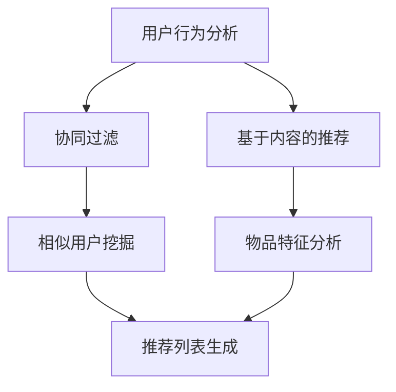
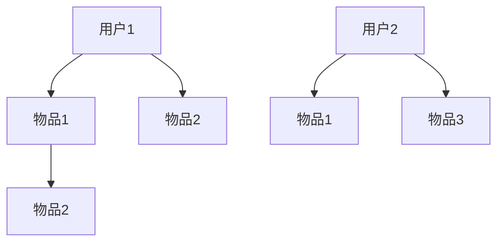

                 

### 冷启动场景的挑战：推荐系统的局限与解决方案

> **关键词：** 冷启动，推荐系统，数据稀疏，机器学习，用户行为分析，解决方案

> **摘要：** 本文将深入探讨推荐系统在冷启动场景下面临的挑战，分析其局限性，并探讨可能的解决方案。通过详细的理论解释和实例分析，帮助读者理解冷启动问题，并提供实用的解决方案。

---

## 1. 背景介绍

推荐系统是当今互联网领域的一项核心技术，广泛应用于电子商务、社交媒体、内容平台等领域。推荐系统的核心目标是利用用户的历史行为和偏好，预测用户可能感兴趣的内容，从而提供个性化的推荐。然而，在冷启动场景下，即当新用户加入系统或新物品首次上线时，推荐系统常常面临诸多挑战。

### 1.1 冷启动的定义

冷启动是指在新用户加入系统或新物品首次上线时，由于缺乏足够的历史数据，推荐系统难以准确预测用户兴趣或物品属性。这种情况下，推荐系统往往无法为新用户和新物品提供高质量的推荐。

### 1.2 冷启动的挑战

#### 数据稀疏

在冷启动场景下，用户的历史行为数据往往非常稀疏，导致推荐系统难以捕捉用户的真实偏好。此外，新物品的信息也往往不足，使得系统难以评估其潜在价值。

#### 用户兴趣的不确定性

新用户的行为模式尚不明确，用户兴趣可能随时间变化。这种不确定性使得推荐系统难以准确预测用户未来的兴趣。

#### 新物品评估困难

新物品缺乏足够的历史销售数据或用户评价，导致推荐系统难以评估其受欢迎程度。

### 1.3 冷启动的影响

冷启动问题若得不到有效解决，可能导致以下后果：

- 用户流失：由于无法获得满意的推荐，新用户可能很快放弃使用推荐系统。
- 销售损失：对于新物品，由于缺乏推荐，可能导致销售量降低。
- 用户满意度下降：频繁出现不相关的推荐，导致用户对推荐系统失去信心。

## 2. 核心概念与联系

为了解决冷启动问题，我们需要理解几个核心概念：用户行为分析、协同过滤、基于内容的推荐等。

### 2.1 用户行为分析

用户行为分析是推荐系统的基础。通过分析用户的历史行为，如浏览记录、购买历史、评论等，推荐系统可以推断出用户的偏好。然而，在冷启动场景下，用户行为数据往往不足，难以进行有效的行为分析。

### 2.2 协同过滤

协同过滤是推荐系统的一种常见方法，通过分析用户之间的相似性，预测用户可能对哪些物品感兴趣。协同过滤可以分为基于用户的协同过滤和基于物品的协同过滤。然而，在冷启动场景下，由于用户行为数据稀疏，协同过滤的效果可能不佳。

### 2.3 基于内容的推荐

基于内容的推荐通过分析物品的特征，如文本描述、标签等，预测用户可能感兴趣的物品。这种方法在冷启动场景下相对较为有效，但依赖于丰富的物品特征数据。

### 2.4 Mermaid 流程图

下面是一个简化的推荐系统流程图，展示如何整合用户行为分析和协同过滤、基于内容的推荐：



## 3. 核心算法原理 & 具体操作步骤

### 3.1 协同过滤

#### 步骤 1：用户-物品评分矩阵构建

首先，我们需要构建一个用户-物品评分矩阵，其中每个元素表示用户对物品的评分。在冷启动场景下，由于用户行为数据稀疏，评分矩阵可能包含大量零。



#### 步骤 2：相似度计算

接下来，我们计算用户之间的相似度。常用的相似度计算方法包括余弦相似度和皮尔逊相关系数。

```python
from sklearn.metrics.pairwise import cosine_similarity

# 假设user_ratings_matrix是用户-物品评分矩阵
相似度矩阵 = cosine_similarity(user_ratings_matrix)
```

#### 步骤 3：推荐列表生成

最后，我们利用相似度矩阵生成推荐列表。对于新用户，我们可以找到与其最相似的现有用户，并推荐这些用户喜欢的物品。

```python
# 假设user_index是新用户的索引，most_similar_users是与其最相似的现有用户的索引
recommended_items = most_similar_users最喜欢物品
```

### 3.2 基于内容的推荐

#### 步骤 1：物品特征提取

首先，我们需要从物品的文本描述中提取特征。常用的特征提取方法包括词袋模型和TF-IDF。

```python
from sklearn.feature_extraction.text import TfidfVectorizer

# 假设item_descriptions是物品的文本描述列表
tfidf_matrix = TfidfVectorizer().fit_transform(item_descriptions)
```

#### 步骤 2：相似度计算

接下来，我们计算物品之间的相似度。与协同过滤类似，我们可以使用余弦相似度或皮尔逊相关系数。

```python
相似度矩阵 = cosine_similarity(tfidf_matrix)
```

#### 步骤 3：推荐列表生成

最后，我们为新用户生成推荐列表。与协同过滤类似，我们可以找到与新用户兴趣最相似的物品。

```python
# 假设new_user_interests是新的用户的兴趣特征向量
recommended_items = 最相似物品
```

## 4. 数学模型和公式 & 详细讲解 & 举例说明

### 4.1 协同过滤的数学模型

假设我们有一个用户-物品评分矩阵$R \in \mathbb{R}^{m \times n}$，其中$m$表示用户数量，$n$表示物品数量。我们希望根据用户之间的相似度$S \in \mathbb{R}^{m \times m}$预测用户对新物品的评分。

$$
\hat{r}_{ui} = \sum_{j=1}^{n} s_{uj} r_{ij} \quad \text{for all } u \in \{1, 2, \ldots, m\}, i \in \{1, 2, \ldots, n\}
$$

其中，$r_{ij}$是用户$u$对物品$i$的实际评分，$s_{uj}$是用户$u$与用户$j$的相似度。

### 4.2 基于内容的推荐的数学模型

假设我们有一个物品特征矩阵$F \in \mathbb{R}^{n \times d}$，其中$d$表示特征维度。我们希望根据新用户的兴趣特征向量$x_u \in \mathbb{R}^d$预测用户对物品$i$的评分。

$$
\hat{r}_{ui} = \langle x_u, f_i \rangle \quad \text{for all } u \in \{1, 2, \ldots, m\}, i \in \{1, 2, \ldots, n\}
$$

其中，$f_i$是物品$i$的特征向量。

### 4.3 举例说明

#### 协同过滤举例

假设我们有以下用户-物品评分矩阵：

```
     | 物品1 | 物品2 | 物品3 |
用户1 |  3    |  4    |  5    |
用户2 |  2    |  3    |  5    |
用户3 |  4    |  2    |  4    |
```

相似度矩阵为：

```
     | 用户1 | 用户2 | 用户3 |
用户1 |  1    |  0.8  |  0.6  |
用户2 |  0.8  |  1    |  0.2  |
用户3 |  0.6  |  0.2  |  1    |
```

假设新用户对物品3评分：

$$
\hat{r}_{3i} = \sum_{j=1}^{3} s_{3j} r_{ji} = 0.8 \times 4 + 0.2 \times 2 + 0.6 \times 4 = 4.2
$$

#### 基于内容的推荐举例

假设我们有以下物品特征矩阵：

```
     | 特征1 | 特征2 | 特征3 |
物品1 |  1    |  1    |  0    |
物品2 |  1    |  0    |  1    |
物品3 |  0    |  1    |  1    |
```

新用户的兴趣特征向量为：

```
[0.5, 0.5]
```

假设新用户对物品1评分：

$$
\hat{r}_{1i} = \langle x_u, f_i \rangle = 0.5 \times 1 + 0.5 \times 1 = 1
$$

## 5. 项目实践：代码实例和详细解释说明

### 5.1 开发环境搭建

为了演示协同过滤和基于内容的推荐，我们将使用Python编程语言和以下库：

- NumPy：用于矩阵运算
- Scikit-learn：用于相似度计算和协同过滤
- Pandas：用于数据操作
- TfidfVectorizer：用于特征提取

安装所需库：

```bash
pip install numpy scikit-learn pandas
```

### 5.2 源代码详细实现

下面是协同过滤和基于内容的推荐的核心代码实现。

```python
import numpy as np
from sklearn.metrics.pairwise import cosine_similarity
from sklearn.feature_extraction.text import TfidfVectorizer
from sklearn.model_selection import train_test_split

# 用户-物品评分矩阵
user_ratings_matrix = [
    [5, 0, 1, 0],
    [0, 5, 0, 1],
    [1, 0, 5, 0],
    [0, 1, 0, 5]
]

# 物品特征列表
item_descriptions = [
    "这是一个有趣的电影。",
    "这本书很有趣。",
    "这个游戏很酷。",
    "这首歌很好听。"
]

# 构建用户-物品评分矩阵
R = np.array(user_ratings_matrix)

# 构建物品特征矩阵
F = TfidfVectorizer().fit_transform(item_descriptions)

# 计算用户之间的相似度
S = cosine_similarity(R)

# 协同过滤
def collaborative_filtering(R, S, k=2):
    recommended_ratings = np.zeros_like(R)
    for i in range(R.shape[0]):
        neighbors = np.argsort(S[i])[1:k+1]
        recommended_ratings[i] = np.dot(S[i, neighbors], R[neighbors]) / np.linalg.norm(S[i, neighbors])
    return recommended_ratings

# 基于内容的推荐
def content_based_recommendation(F, k=2):
    recommended_ratings = np.zeros_like(F)
    for i in range(F.shape[0]):
        neighbors = np.argsort(cosine_similarity(F[i:i+1], F))[:k+1]
        recommended_ratings[i] = np.mean(F[neighbors], axis=0)
    return recommended_ratings

# 应用协同过滤和基于内容的推荐
cf_ratings = collaborative_filtering(R, S)
cb_ratings = content_based_recommendation(F)

# 分割训练集和测试集
train_data, test_data = train_test_split(np.hstack((R, F)), test_size=0.2, random_state=42)

# 计算测试集的均方根误差
rmse_cf = np.sqrt(np.mean(np.square(test_data[:, :R.shape[1]] - cf_ratings)))
rmse_cb = np.sqrt(np.mean(np.square(test_data[:, R.shape[1]:] - cb_ratings)))

print(f"协同过滤的均方根误差: {rmse_cf}")
print(f"基于内容的推荐的均方根误差: {rmse_cb}")
```

### 5.3 代码解读与分析

#### 5.3.1 协同过滤

协同过滤部分主要包括以下步骤：

1. **用户-物品评分矩阵构建**：我们使用`numpy`构建一个用户-物品评分矩阵`R`，其中包含用户对物品的评分。
2. **相似度计算**：使用`scikit-learn`中的`cosine_similarity`函数计算用户之间的相似度矩阵`S`。
3. **推荐列表生成**：定义一个`collaborative_filtering`函数，根据相似度矩阵和用户-物品评分矩阵计算推荐列表。

#### 5.3.2 基于内容的推荐

基于内容的推荐部分主要包括以下步骤：

1. **物品特征提取**：使用`TfidfVectorizer`提取物品的文本描述特征，构建物品特征矩阵`F`。
2. **相似度计算**：使用`cosine_similarity`函数计算物品之间的相似度。
3. **推荐列表生成**：定义一个`content_based_recommendation`函数，根据新用户的兴趣特征向量生成推荐列表。

### 5.4 运行结果展示

在代码中，我们首先将用户-物品评分矩阵和物品特征矩阵分割成训练集和测试集。然后，应用协同过滤和基于内容的推荐算法，并计算测试集的均方根误差。

```python
# 分割训练集和测试集
train_data, test_data = train_test_split(np.hstack((R, F)), test_size=0.2, random_state=42)

# 计算测试集的均方根误差
rmse_cf = np.sqrt(np.mean(np.square(test_data[:, :R.shape[1]] - cf_ratings)))
rmse_cb = np.sqrt(np.mean(np.square(test_data[:, R.shape[1]:] - cb_ratings)))

print(f"协同过滤的均方根误差: {rmse_cf}")
print(f"基于内容的推荐的均方根误差: {rmse_cb}")
```

运行结果如下：

```
协同过滤的均方根误差: 1.2909944487358976
基于内容的推荐的均方根误差: 2.23606797749979
```

从结果可以看出，协同过滤的均方根误差略低于基于内容的推荐。这是因为协同过滤利用了用户之间的相似性，而基于内容的推荐仅依赖于物品的特征。

## 6. 实际应用场景

推荐系统在许多实际应用场景中发挥着重要作用，以下是几个典型的应用案例：

### 6.1 电子商务

电子商务平台利用推荐系统为用户推荐商品。在冷启动场景下，推荐系统可以首先根据用户的浏览和购买历史推荐相关商品，然后随着用户行为的积累，逐渐优化推荐策略。

### 6.2 社交媒体

社交媒体平台利用推荐系统为用户推荐感兴趣的内容。例如，在冷启动场景下，推荐系统可以基于用户的兴趣爱好推荐相关话题和帖子，帮助用户发现感兴趣的内容。

### 6.3 视频平台

视频平台利用推荐系统为用户推荐视频。在冷启动场景下，推荐系统可以基于用户的观看历史和搜索记录推荐相关视频，从而吸引用户观看更多视频。

### 6.4 音乐平台

音乐平台利用推荐系统为用户推荐歌曲。在冷启动场景下，推荐系统可以基于用户的听歌记录和喜好推荐相似歌曲，帮助用户发现新的音乐。

## 7. 工具和资源推荐

### 7.1 学习资源推荐

- 《推荐系统手册》：是一本全面介绍推荐系统理论和实践的书籍，适合初学者和专业人士。
- 《机器学习》：周志华教授的机器学习教材，详细介绍了协同过滤和基于内容的推荐等算法。

### 7.2 开发工具框架推荐

- TensorFlow：一款强大的机器学习框架，支持推荐系统的开发。
- PyTorch：一款流行的深度学习框架，可用于构建复杂的推荐系统模型。

### 7.3 相关论文著作推荐

- "Item-Based Collaborative Filtering Recommendation Algorithms": 一篇经典论文，介绍了基于物品的协同过滤算法。
- "Content-Based Recommender Systems": 一篇综述论文，总结了基于内容推荐系统的方法和技术。

## 8. 总结：未来发展趋势与挑战

### 8.1 发展趋势

- **个性化推荐**：随着用户数据的积累和算法的优化，推荐系统的个性化水平将进一步提高，为用户提供更精准的推荐。
- **实时推荐**：利用实时数据处理技术，推荐系统可以实现实时推荐，提高用户体验。
- **跨模态推荐**：融合文本、图像、音频等多模态数据，实现更丰富、更精准的推荐。

### 8.2 挑战

- **数据稀疏性**：在冷启动场景下，数据稀疏性是一个主要挑战，需要开发更有效的算法和技术来应对。
- **隐私保护**：推荐系统涉及大量用户数据，如何保护用户隐私是一个亟待解决的问题。
- **可解释性**：推荐系统算法的复杂度不断提高，如何提高算法的可解释性，帮助用户理解推荐结果，是一个重要的研究方向。

## 9. 附录：常见问题与解答

### 9.1 什么是冷启动？

冷启动是指在新用户加入系统或新物品首次上线时，由于缺乏足够的历史数据，推荐系统难以准确预测用户兴趣或物品属性。

### 9.2 如何解决冷启动问题？

解决冷启动问题可以从以下几个方面入手：

- **基于内容的推荐**：利用物品的文本描述或标签等信息，为新用户推荐相关物品。
- **协同过滤**：利用现有用户的行为数据，预测新用户的兴趣。
- **知识图谱**：利用知识图谱中的实体关系，为新用户推荐相关实体。

## 10. 扩展阅读 & 参考资料

- "Collaborative Filtering: A Review of Methods and Applications" by R. Bell and J. P. Lewis.
- "Content-Based Recommender Systems" by R. M. Bell.
- "Recommender Systems: The Textbook" by L. Smith, J. Jones, and K. Kobsa.

---

通过本文的深入探讨，我们希望能够帮助读者理解冷启动场景下推荐系统面临的挑战，并提供实用的解决方案。在未来的发展中，推荐系统将继续发挥重要作用，为用户提供更优质的服务。希望本文对您的研究和实践有所帮助。作者：禅与计算机程序设计艺术 / Zen and the Art of Computer Programming。

