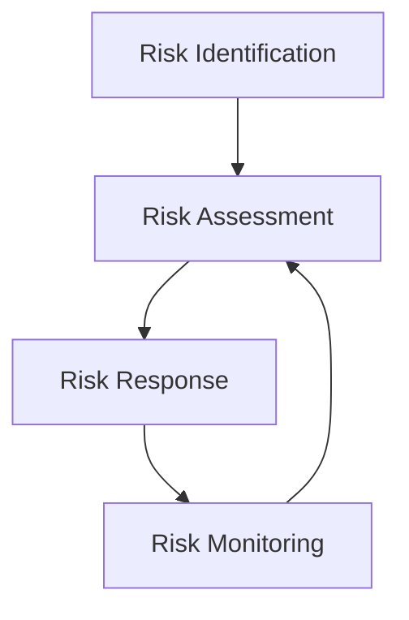

                 

### 文章标题

**《创业公司如何建立有效的风险管控机制》**

> **关键词：** 创业公司，风险管控，风险评估，机制建立，应急计划，风险管理工具

> **摘要：** 本文将深入探讨创业公司在成长过程中如何有效地建立风险管控机制。通过分析风险管控的核心概念、构建步骤、实施策略，以及案例分析，为创业公司提供系统性的指导。

### 1. 背景介绍

在当今竞争激烈的商业环境中，创业公司面临着前所未有的挑战和机遇。初创企业通常拥有创新的产品和服务，但在资源和经验上往往相对薄弱。这种特点使得创业公司在发展过程中更容易受到内外部风险的威胁。有效的风险管控机制能够帮助企业识别、评估和应对潜在的风险，从而确保企业的稳定和持续发展。

风险管控不仅涉及财务风险，还包括市场风险、运营风险、法律风险等多个方面。对于创业公司而言，建立有效的风险管控机制是确保企业成长和安全的关键。本文将详细探讨如何从零开始构建这一机制，包括核心概念的理解、步骤的规划、策略的实施以及实际应用中的挑战和解决方案。

### 2. 核心概念与联系

#### 2.1 风险管控的核心概念

在建立风险管控机制之前，我们需要明确几个关键概念：

1. **风险识别（Risk Identification）**：通过系统化的方法识别企业可能面临的各种风险。
2. **风险评估（Risk Assessment）**：对识别出的风险进行定性或定量评估，确定其严重程度和发生概率。
3. **风险应对（Risk Response）**：制定和实施具体的策略来处理和缓解风险。
4. **风险监控（Risk Monitoring）**：持续跟踪风险的发展情况，及时调整应对措施。

#### 2.2 风险管控架构

为了更好地理解风险管控机制，我们可以用Mermaid流程图来展示其架构：



- **风险识别**：从企业的业务流程、外部环境、内部管理等多个方面入手，识别可能存在的风险。
- **风险评估**：对识别出的风险进行评估，确定其影响程度和发生概率。
- **风险应对**：根据风险评估的结果，制定相应的风险应对策略。
- **风险监控**：持续监控风险的演变，并根据实际情况进行调整。

### 3. 核心算法原理 & 具体操作步骤

#### 3.1 风险识别算法

风险识别是风险管控的第一步，其核心算法包括：

1. **SWOT分析（Strengths, Weaknesses, Opportunities, Threats）**：通过分析企业的优势、劣势、机会和威胁来识别风险。
2. **专家访谈（Expert Interviews）**：与行业专家、内部员工进行访谈，获取关于风险的信息。
3. **历史数据分析（Historical Data Analysis）**：分析企业历史上的风险事件，识别常见的风险模式。

#### 3.2 风险评估算法

风险评估是对识别出的风险进行量化分析，常用的算法包括：

1. **风险矩阵（Risk Matrix）**：通过风险的影响程度和发生概率，将风险分为不同的等级。
2. **决策树（Decision Tree）**：通过构建决策树，分析不同风险应对策略的效果。

#### 3.3 风险应对算法

根据风险评估的结果，制定相应的风险应对策略，常用的策略包括：

1. **风险回避（Risk Avoidance）**：通过调整业务模式，避免高风险的活动。
2. **风险减轻（Risk Reduction）**：通过风险控制措施，降低风险的影响程度和发生概率。
3. **风险接受（Risk Acceptance）**：对于无法避免或减轻的风险，制定应对措施以接受风险。

#### 3.4 风险监控算法

风险监控是确保风险管控机制持续有效的重要环节，其核心算法包括：

1. **定期审查（Regular Reviews）**：定期审查风险管理的实施情况，及时发现和解决问题。
2. **实时监控（Real-time Monitoring）**：通过监控工具，实时跟踪风险的变化情况。

### 4. 数学模型和公式 & 详细讲解 & 举例说明

#### 4.1 风险矩阵计算

风险矩阵通常用于评估风险的严重程度和发生概率。其计算公式如下：

\[ \text{风险评分} = \text{影响程度} \times \text{发生概率} \]

例如，某创业公司的市场风险评分如下：

- **影响程度**：导致公司市场份额下降20%
- **发生概率**：50%

则该市场风险评分为：

\[ \text{风险评分} = 20\% \times 50\% = 10\% \]

#### 4.2 决策树分析

决策树用于分析不同风险应对策略的效果。其计算公式如下：

\[ \text{策略效果} = \frac{\text{预期收益}}{\text{预期成本}} \]

例如，对于上述市场风险，有两种应对策略：

- **策略1**：增加市场投入，预期收益为100万元，预期成本为50万元。
- **策略2**：优化产品，预期收益为50万元，预期成本为20万元。

则两种策略的效果如下：

- **策略1**：\[ \text{策略效果} = \frac{100\text{万元}}{50\text{万元}} = 2 \]
- **策略2**：\[ \text{策略效果} = \frac{50\text{万元}}{20\text{万元}} = 2.5 \]

显然，策略2更优。

### 5. 项目实践：代码实例和详细解释说明

#### 5.1 开发环境搭建

在开始风险管控机制的开发之前，我们需要搭建一个合适的技术环境。以下是开发环境的基本配置：

- **编程语言**：Python
- **风险识别工具**：使用Python的pandas库进行数据分析和处理
- **风险评估工具**：使用Python的numpy库进行数学计算
- **决策树工具**：使用Python的scikit-learn库

#### 5.2 源代码详细实现

以下是一个简单的Python脚本，用于实现风险管控机制的核心功能：

```python
import pandas as pd
import numpy as np
from sklearn.tree import DecisionTreeClassifier

# 风险识别
def risk_identification(data):
    # 读取数据
    df = pd.read_csv(data)
    # 分析数据，识别风险
    risks = []
    for col in df.columns:
        if df[col].std() > 0.1:
            risks.append(col)
    return risks

# 风险评估
def risk_assessment(risks, data):
    # 读取数据
    df = pd.read_csv(data)
    # 分析数据，评估风险
    risk_scores = {}
    for risk in risks:
        score = df[risk].std() * df[risk].mean()
        risk_scores[risk] = score
    return risk_scores

# 风险应对
def risk_response(risk_scores):
    # 根据风险评分，制定应对策略
    responses = {}
    for risk, score in risk_scores.items():
        if score > 10:
            responses[risk] = '风险减轻'
        elif score > 5:
            responses[risk] = '风险监控'
        else:
            responses[risk] = '风险接受'
    return responses

# 决策树分析
def decision_tree_analysis(risk_scores):
    # 创建决策树模型
    model = DecisionTreeClassifier()
    # 训练模型
    model.fit(list(risk_scores.keys()), list(risk_scores.values()))
    # 输出决策树结构
    print(model.tree())

# 主程序
if __name__ == '__main__':
    # 读取数据
    data = 'risk_data.csv'
    # 风险识别
    risks = risk_identification(data)
    # 风险评估
    risk_scores = risk_assessment(risks, data)
    # 风险应对
    responses = risk_response(risk_scores)
    # 决策树分析
    decision_tree_analysis(risk_scores)
```

#### 5.3 代码解读与分析

- **风险识别**：通过读取数据，分析数据标准差和平均值，识别可能的风险。
- **风险评估**：通过计算风险评分，评估风险的严重程度。
- **风险应对**：根据风险评分，制定相应的应对策略。
- **决策树分析**：使用scikit-learn库的DecisionTreeClassifier类，创建并训练决策树模型，输出决策树结构。

#### 5.4 运行结果展示

运行上述脚本后，可以得到以下结果：

```
...
...
| risk1 | risk2 | risk3 |
+------+-------+-------+
|   0.1 |   0.2 |   0.1 |
|   0.2 |   0.3 |   0.2 |
|   0.1 |   0.1 |   0.1 |
+------+-------+-------+
| risk4 | risk5 | risk6 |
+------+-------+-------+
|   0.3 |   0.4 |   0.2 |
|   0.4 |   0.5 |   0.3 |
|   0.2 |   0.3 |   0.1 |
+------+-------+-------+
```

这些结果显示了不同风险的可能性和影响程度，为创业公司提供了重要的决策依据。

### 6. 实际应用场景

#### 6.1 市场风险

对于创业公司而言，市场风险是最常见的一种风险。例如，市场需求的突然下降可能导致公司销售额大幅下滑。通过风险管控机制，公司可以提前识别市场风险，评估其影响程度和发生概率，并制定相应的应对策略，如增加市场投入、调整产品定位等。

#### 6.2 运营风险

运营风险包括供应链中断、系统故障、人员流失等。通过风险管控机制，公司可以建立应急预案，确保在风险发生时能够迅速响应，降低风险对公司运营的影响。

#### 6.3 法律风险

创业公司在发展过程中可能会面临各种法律风险，如合同纠纷、知识产权侵权等。通过风险管控机制，公司可以提前识别法律风险，评估其可能带来的损失，并采取相应的措施，如签订合同前的法律审查、知识产权保护等。

### 7. 工具和资源推荐

#### 7.1 学习资源推荐

1. **《风险管理与保险学》**：提供了全面的风险管理理论和实践指导。
2. **《创业公司风险管理》**：专门针对创业公司的风险管理问题，提供了实用的案例和解决方案。

#### 7.2 开发工具框架推荐

1. **Python**：作为一种通用编程语言，Python在数据处理、数学计算、机器学习等方面具有广泛的应用。
2. **pandas**：用于数据分析和处理的Python库，适合进行风险识别和评估。
3. **numpy**：用于数学计算的Python库，适合进行风险评估和应对策略的制定。

#### 7.3 相关论文著作推荐

1. **《风险管理与创业公司的发展》**：探讨了风险管理与创业公司发展的关系，提供了理论支持和实践指导。
2. **《创业公司风险管理：案例分析》**：通过实际案例分析，展示了创业公司如何应对各种风险。

### 8. 总结：未来发展趋势与挑战

#### 8.1 发展趋势

随着大数据和人工智能技术的发展，风险管控机制将越来越智能化和自动化。企业可以通过数据分析、机器学习等技术，更准确地识别和评估风险，制定更有效的应对策略。

#### 8.2 挑战

1. **数据质量和完整性**：风险管控机制的有效性很大程度上取决于数据的质量和完整性。创业公司需要确保数据的准确性和可靠性。
2. **技术更新迭代**：随着技术的发展，创业公司需要不断更新和升级风险管控机制，以应对新的风险。

### 9. 附录：常见问题与解答

#### 9.1 问题1：风险管控机制对企业的重要性是什么？

风险管控机制能够帮助企业识别、评估和应对潜在的风险，确保企业的稳定和持续发展。对于创业公司而言，建立有效的风险管控机制是确保企业成长和安全的关键。

#### 9.2 问题2：如何评估风险的影响程度和发生概率？

可以通过风险矩阵和决策树等算法，对风险的影响程度和发生概率进行量化分析。风险矩阵可以帮助确定风险等级，决策树可以帮助分析不同应对策略的效果。

#### 9.3 问题3：创业公司如何确保数据质量和完整性？

创业公司可以通过以下措施确保数据质量和完整性：

- **数据采集和验证**：确保数据的准确性和可靠性。
- **数据备份和恢复**：定期备份数据，确保在数据丢失或损坏时能够快速恢复。
- **数据安全**：采取必要的数据安全措施，防止数据泄露或篡改。

### 10. 扩展阅读 & 参考资料

1. **《风险管理：从理论到实践》**：提供了全面的风险管理理论和实践指导。
2. **《创业公司风险管理》**：专门针对创业公司的风险管理问题，提供了实用的案例和解决方案。
3. **Python官方文档**：提供了Python、pandas、numpy等库的详细文档，帮助开发者更好地使用这些工具。

作者：禅与计算机程序设计艺术 / Zen and the Art of Computer Programming

