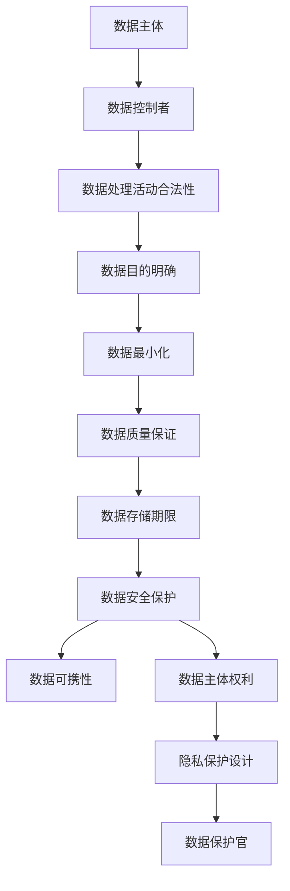

                 

### 背景介绍

在当今数字化时代，数据已经成为企业最为重要的资产之一。随着互联网和移动设备的普及，企业收集和处理的个人数据量呈指数级增长。然而，随着数据隐私和安全问题的日益突出，如何保护用户隐私成为了企业面临的重大挑战。欧盟制定的《通用数据保护条例》（General Data Protection Regulation，GDPR）在这一背景下应运而生，旨在加强个人数据保护，确保用户隐私权益。

GDPR是欧盟在2018年5月25日正式实施的法规，其影响范围不仅限于欧盟成员国，对于在全球范围内运营的企业也具有重大影响。GDPR的核心目标是通过加强个人数据的保护，提高企业对数据隐私的关注度，从而促进数字经济的健康发展。作为全球范围内最具影响力的数据保护法规，GDPR要求企业在收集、存储、处理和传输个人数据时，必须严格遵守一系列严格的规定和流程。

对创业公司而言，GDPR合规并非易事。相较于大型企业，创业公司通常在资源、技术和经验方面存在一定劣势，这使得他们在应对GDPR合规时面临更大的挑战。然而，忽视GDPR合规不仅可能导致巨额罚款，还会损害企业的声誉和客户信任。因此，创业公司必须重视GDPR合规，将其视为企业发展的关键一环。

本文旨在为创业公司提供一份全面的GDPR合规实践指南，帮助他们在数据隐私保护方面做出正确的决策和行动。本文将分为以下几个部分：

1. **核心概念与联系**：介绍GDPR的核心概念、原理和框架，并使用Mermaid流程图展示GDPR的主要组成部分。
2. **核心算法原理与具体操作步骤**：深入分析GDPR的具体要求和操作流程，帮助创业公司了解如何满足GDPR合规要求。
3. **数学模型和公式**：探讨GDPR中的相关数学模型和公式，帮助读者理解GDPR的量化标准。
4. **项目实践：代码实例**：通过实际项目案例，展示GDPR合规的实现方法和技巧。
5. **实际应用场景**：分析GDPR在不同行业和领域的实际应用，帮助创业公司了解GDPR的具体影响。
6. **工具和资源推荐**：推荐学习资源、开发工具和框架，帮助创业公司提高GDPR合规的效率。
7. **总结：未来发展趋势与挑战**：总结GDPR合规的趋势和挑战，为创业公司提供未来发展建议。

通过本文的逐步分析和详细讲解，希望创业公司能够全面了解GDPR合规，并在实际运营中采取有效的措施，确保用户隐私和数据安全。

### 1.1 GDPR的核心概念和目标

《通用数据保护条例》（General Data Protection Regulation，GDPR）是一套由欧盟制定的法律法规，旨在加强个人数据的保护，确保用户的隐私权益。GDPR的核心概念包括数据主体（Data Subject）、数据控制者（Data Controller）和数据处理器（Data Processor）等。

**数据主体**指的是任何自然人与其个人数据相关联的个人，即数据的实际拥有者。数据主体拥有对自身数据的控制权和知情权，他们有权了解自己的数据被用于什么目的，有权要求企业删除或更改自己的数据，甚至在某些情况下有权撤回同意。

**数据控制者**是指决定个人数据用途和处理的个人或组织。在大多数情况下，数据控制者是企业或机构，他们负责制定数据处理政策和流程，确保数据处理的合法性和合规性。

**数据处理器**则是执行数据控制者的指示，处理个人数据的个人或组织。数据处理器通常为企业提供数据处理服务，如数据存储、分析和传输等。

GDPR的目标主要体现在以下几个方面：

1. **加强个人数据保护**：GDPR对个人数据的收集、存储、处理和传输等环节提出了严格的要求，确保个人数据的隐私和安全。

2. **提高数据透明度**：GDPR要求企业在处理个人数据时，必须告知数据主体数据的用途、处理方式和数据保存期限等关键信息，提高数据处理的透明度。

3. **确保用户知情权**：GDPR赋予数据主体广泛的知情权，包括知情权、访问权、更正权、删除权、限制处理权和数据可携权等。

4. **规范跨境数据传输**：GDPR对跨境数据传输提出了严格的限制，要求企业确保数据在传输过程中的安全性和合规性。

5. **强化数据保护监管**：GDPR建立了严格的数据保护监管机制，对违反规定的企业进行严厉的罚款和处罚，以增强企业的合规意识和责任感。

GDPR的适用范围非常广泛，不仅限于欧盟成员国，还包括任何在全球范围内运营的企业。只要企业的数据处理活动涉及欧盟公民或居民的个人数据，就必须遵守GDPR的规定。这一全球性的适用范围使得GDPR成为全球范围内最具影响力的数据保护法规。

在GDPR的框架下，创业公司需要重点关注以下几个关键要素：

1. **明确数据主体权利**：创业公司应确保数据主体能够方便地行使自己的知情权、访问权、更正权、删除权等权利。

2. **制定合规策略和流程**：创业公司需要制定详细的合规策略和流程，确保数据处理活动符合GDPR的要求。

3. **数据保护官（DPO）的任命**：对于某些类型的创业公司，如涉及大量个人数据处理的，必须任命数据保护官（DPO）来负责GDPR合规事务。

4. **数据保护影响评估**：在进行数据处理活动之前，创业公司应进行数据保护影响评估（DPIA），以识别和处理潜在的数据保护风险。

5. **数据安全措施**：创业公司需要采取适当的技术和管理措施，确保个人数据的安全性和完整性。

6. **员工培训和教育**：创业公司应定期对员工进行GDPR合规培训，提高员工的合规意识和数据保护能力。

通过理解和遵循GDPR的核心概念和目标，创业公司可以在数据隐私保护方面做出正确的决策和行动，确保企业的长期发展和用户信任。

### 1.2 GDPR的基本原则和核心条款

GDPR的基本原则和核心条款构成了其法律框架的基础，旨在确保个人数据的合法、公正和透明处理。以下是GDPR的主要原则和条款，以及每个原则和条款的具体要求。

**1.2.1 法律基础原则（Lawfulness, fairness, and transparency）**

GDPR要求企业在处理个人数据时，必须遵循以下原则：

- **合法性（Lawfulness）**：数据处理活动必须有合法的法律基础，可以是数据主体的明确同意、合同履行、法律义务或合法利益。
- **公正性（Fairness）**：数据处理活动应公正、合理，不应造成对数据主体的不公平待遇。
- **透明性（Transparency）**：企业应向数据主体充分披露数据处理的目的、方式和范围，确保数据主体对数据处理活动有充分的知情权。

**1.2.2 数据最小化原则（Data minimization）**

- **目的明确（Purpose limitation）**：企业应在数据处理活动开始前明确数据的目的，并确保数据处理活动与这些目的相关。
- **数据最小化（Data minimization）**：企业应仅收集和处理为实现特定目的所必需的个人数据，不应过度收集。
- **数据更新（Accuracy）**：企业应确保个人数据是准确的、最新的，并在必要时进行更新。

**1.2.3 数据质量原则（Data quality）**

- **准确性和完整性（Accuracy）**：企业应确保个人数据的准确性和完整性，并在必要时更新或删除不准确或不完整的数据。
- **及时性（Relevance）**：企业应确保个人数据与其处理目的相关，并避免过度处理。

**1.2.4 数据存储限制原则（Storage limitation）**

- **数据保存期限（Retention）**：企业应根据法律要求和业务需求，确定个人数据的保存期限，并在到期后及时删除或匿名化数据。

**1.2.5 数据完整性和保密性原则（Integrity and confidentiality）**

- **数据安全性（Security）**：企业应采取适当的技术和组织措施，保护个人数据免受未经授权的访问、泄露、破坏、丢失或篡改。
- **保密性（Confidentiality）**：企业应确保个人数据的保密性，对敏感数据进行特殊保护。

**1.2.6 数据可携性原则（Data portability）**

- **数据可携性（Portability）**：数据主体有权要求企业提供其个人数据的副本，并有权将数据转移到另一个数据控制者处，而不会影响数据的完整性。

**1.2.7 数据主体权利原则（Data subject rights）**

GDPR赋予数据主体一系列权利，包括：

- **知情权（Right to be informed）**：数据主体有权了解其个人数据被用于什么目的、由谁处理、数据保存期限等。
- **访问权（Right of access）**：数据主体有权访问其个人数据，并了解数据处理的具体情况。
- **更正权（Right to rectification）**：数据主体有权要求企业更正不准确或不完整的个人数据。
- **删除权（Right to erasure）**：在特定条件下，数据主体有权要求企业删除其个人数据。
- **限制处理权（Right to restrict processing）**：数据主体有权要求企业在特定情况下限制对个人数据的处理。
- **反对权（Right to object）**：数据主体有权反对企业基于合法利益进行的个人数据处理。
- **数据可携权（Right to data portability）**：数据主体有权将个人数据从一个数据控制者转移到另一个数据控制者。

**1.2.8 隐私保护设计原则（Privacy by design）**

- **隐私保护设计（Privacy by design）**：企业在设计和开发数据处理系统时，应将隐私保护作为基本考量，从系统架构、技术实现到数据处理流程，全面贯彻隐私保护原则。

**1.2.9 数据保护官（DPO）原则**

- **数据保护官（DPO）**：对于某些类型的组织，特别是公共部门机构、大型企业以及处理敏感数据的组织，应任命数据保护官（DPO）负责GDPR合规事务，包括监督数据处理活动、提供咨询和建议等。

通过遵循这些基本原则和核心条款，创业公司可以确保其数据处理活动符合GDPR的要求，从而保护用户的隐私和数据安全。以下是一个简单的Mermaid流程图，展示了GDPR的主要组成部分：

这个流程图可以帮助创业公司更好地理解GDPR的框架和各个组成部分之间的联系，从而在实施GDPR合规时做到有的放矢。

### 1.3 GDPR合规的重要性和挑战

GDPR合规对于创业公司来说具有重要意义。首先，GDPR不仅涉及欧盟成员国的法律体系，还通过其广泛的适用范围影响了全球范围内的企业。因此，无论创业公司是否位于欧盟成员国，只要其业务涉及欧盟公民或居民的个人信息，都必须遵守GDPR的规定。这一全球性影响使得GDPR成为创业公司不可忽视的法律义务。

其次，GDPR合规有助于创业公司树立良好的企业形象，增强用户信任。在数字化时代，用户对个人数据保护的关注日益增加。企业若能严格遵守GDPR规定，保护用户隐私，将大大提升用户对其信任度，从而在激烈的市场竞争中脱颖而出。

然而，GDPR合规对于创业公司也带来了一系列挑战。以下是创业公司在GDPR合规过程中可能遇到的一些主要问题及其解决方案：

**1. 数据收集和处理流程的调整**

GDPR要求企业在收集和处理个人数据时，必须明确数据的目的、最小化数据收集范围，并在数据处理过程中保持透明度。对于创业公司，这意味着需要对现有的数据收集和处理流程进行全面的审查和调整。具体措施包括：

- **制定明确的数据处理政策**：确保所有数据处理活动都有明确的法律基础和目的。
- **优化数据收集流程**：仅收集为实现特定目的所必需的数据，避免过度收集。
- **数据匿名化和加密**：对敏感数据进行匿名化和加密处理，提高数据安全性。

**2. 数据保护官（DPO）的任命**

对于某些类型的创业公司，如处理大量个人数据的组织，GDPR要求必须任命数据保护官（DPO）。DPO负责监督数据处理活动，确保合规性，并提供相关咨询。创业公司在任命DPO时，可以考虑以下方案：

- **内部任命**：从公司内部寻找具有相关背景和经验的员工担任DPO。
- **外部合作**：与专业机构或顾问合作，获取DPO的专业支持。

**3. 数据保护影响评估（DPIA）**

GDPR要求在进行数据处理活动之前，必须进行数据保护影响评估（DPIA），以识别和处理潜在的数据保护风险。创业公司在进行DPIA时，可以采取以下步骤：

- **明确评估目标**：确定评估的具体目标和范围。
- **识别风险**：分析数据处理活动可能带来的风险，包括隐私泄露、数据滥用等。
- **制定风险管理计划**：制定具体的措施和策略，降低和化解风险。

**4. 数据安全措施的加强**

GDPR对数据安全提出了严格的要求，企业必须采取适当的技术和管理措施，确保个人数据的安全性和完整性。创业公司可以采取以下措施：

- **加密技术**：对敏感数据进行加密处理，防止未经授权的访问。
- **访问控制**：实施严格的访问控制机制，确保只有授权人员可以访问个人数据。
- **数据备份和恢复**：定期进行数据备份，确保在数据丢失或损坏时能够快速恢复。

**5. 员工培训和教育**

GDPR合规不仅是技术层面的工作，也需要员工具备足够的合规意识和知识。创业公司应定期对员工进行GDPR合规培训，提高员工的隐私保护意识和数据保护能力。具体措施包括：

- **制定培训计划**：根据员工的职责和岗位，制定针对性的培训计划。
- **开展培训活动**：通过线上线下多种方式，开展系统的GDPR合规培训。
- **考核和激励**：对培训效果进行考核，并对表现优秀的员工给予激励。

通过以上措施，创业公司可以应对GDPR合规带来的挑战，确保其数据处理活动符合GDPR的要求，从而保护用户隐私和数据安全。遵守GDPR不仅是对法律义务的履行，更是创业公司可持续发展的基石。

### 1.4 GDPR合规的重要环节和关键步骤

为确保GDPR合规，创业公司需要从多个环节和关键步骤入手，确保数据处理活动符合法规要求。以下是GDPR合规过程中需要关注的重要环节和关键步骤：

**1. 数据处理合规评估**

在GDPR合规的初期，创业公司应进行全面的数据处理合规评估，以识别和处理潜在的风险和问题。具体步骤包括：

- **数据资产梳理**：对公司内部的数据资产进行全面梳理，包括数据来源、数据类型、数据用途等。
- **风险评估**：分析数据处理活动可能带来的风险，包括隐私泄露、数据滥用等。
- **合规性评估**：根据GDPR的要求，评估数据处理活动是否符合法规规定，找出潜在的不合规问题。

**2. 数据处理政策和流程的制定**

制定详细的数据处理政策和流程是GDPR合规的重要基础。创业公司应确保以下内容：

- **数据处理政策**：明确数据处理的目的、原则、范围、程序和责任，确保数据处理活动的合法性、公正性和透明性。
- **数据处理流程**：制定详细的数据处理流程，包括数据收集、存储、处理、传输、共享和销毁等环节，确保流程的标准化和可操作性。

**3. 数据保护官（DPO）的任命**

对于某些类型的创业公司，如处理大量个人数据的组织，GDPR要求必须任命数据保护官（DPO）。DPO的职责包括：

- **合规监督**：监督数据处理活动是否符合GDPR的要求，确保合规性。
- **风险评估**：识别和处理数据处理活动中的潜在风险。
- **咨询和建议**：为公司提供GDPR合规方面的咨询和建议，协助处理数据保护相关的事务。

**4. 数据保护影响评估（DPIA）**

在进行数据处理活动之前，创业公司应进行数据保护影响评估（DPIA），以识别和处理潜在的数据保护风险。DPIA的具体步骤包括：

- **评估目标**：明确评估的具体目标和范围。
- **风险识别**：分析数据处理活动可能带来的风险，包括隐私泄露、数据滥用等。
- **风险管理**：制定具体的措施和策略，降低和化解风险。

**5. 数据安全措施的加强**

GDPR对数据安全提出了严格的要求，创业公司应采取适当的技术和管理措施，确保个人数据的安全性和完整性。具体措施包括：

- **数据加密**：对敏感数据进行加密处理，防止未经授权的访问。
- **访问控制**：实施严格的访问控制机制，确保只有授权人员可以访问个人数据。
- **数据备份和恢复**：定期进行数据备份，确保在数据丢失或损坏时能够快速恢复。

**6. 数据主体权利的保障**

GDPR赋予数据主体一系列权利，创业公司应确保数据主体能够方便地行使这些权利。具体措施包括：

- **知情权**：告知数据主体数据处理的目的、方式和范围，确保数据主体对数据处理活动有充分的知情权。
- **访问权**：数据主体有权访问其个人数据，并了解数据处理的具体情况。
- **更正权**：数据主体有权要求企业更正不准确或不完整的个人数据。
- **删除权**：在特定条件下，数据主体有权要求企业删除其个人数据。
- **数据可携权**：数据主体有权将个人数据从一个数据控制者转移到另一个数据控制者。

**7. 员工培训和教育**

员工是数据处理活动的重要参与者和执行者，为确保GDPR合规，创业公司应定期对员工进行GDPR合规培训，提高员工的隐私保护意识和数据保护能力。具体措施包括：

- **制定培训计划**：根据员工的职责和岗位，制定针对性的培训计划。
- **开展培训活动**：通过线上线下多种方式，开展系统的GDPR合规培训。
- **考核和激励**：对培训效果进行考核，并对表现优秀的员工给予激励。

通过以上环节和步骤，创业公司可以全面确保GDPR合规，保护用户隐私和数据安全，为企业的长期发展奠定坚实基础。

### 1.5 GDPR合规的最佳实践和案例

为了更好地理解GDPR合规的最佳实践，我们可以从一些成功案例中学习他们的经验和做法。以下是一些在GDPR合规方面表现卓越的创业公司案例：

**1. Facebook**

作为全球最大的社交媒体平台之一，Facebook在GDPR正式实施之前，就已经开始了一系列合规措施。以下是Facebook在GDPR合规方面的最佳实践：

- **数据保护官（DPO）的任命**：Facebook任命了首席隐私官，负责监督公司的GDPR合规事务。DPO在公司内部设立了一个专门的隐私团队，确保数据处理活动的合规性。
- **数据保护影响评估（DPIA）**：在推出新功能或进行重大数据处理活动之前，Facebook都会进行DPIA，以识别和处理潜在的风险。
- **透明性和告知**：Facebook通过其隐私政策向用户详细说明了数据收集、使用和共享的方式，提高了数据处理的透明度。
- **用户权限管理**：Facebook为用户提供了一个集中的权限管理界面，用户可以方便地管理自己的隐私设置，包括数据访问、删除和撤回同意等。

**2. Airbnb**

Airbnb在GDPR实施过程中，采取了一系列措施确保合规：

- **数据处理政策和流程的制定**：Airbnb制定了详细的数据处理政策和流程，明确了数据处理的目的、原则、范围和程序。
- **员工培训和教育**：Airbnb对全体员工进行了GDPR合规培训，提高员工的隐私保护意识和数据保护能力。
- **用户知情权和选择权**：Airbnb在用户注册和使用过程中，充分告知用户数据处理的目的和方式，并提供了多种选择权，如数据访问、删除和撤回同意等。

**3. Mailchimp**

Mailchimp是一家提供电子邮件营销服务的创业公司，他们在GDPR合规方面有以下成功经验：

- **数据最小化和数据质量**：Mailchimp仅收集为实现特定目的所必需的数据，并确保数据的准确性、完整性和及时性。
- **数据安全措施**：Mailchimp采取了多种数据安全措施，如数据加密、访问控制和定期备份等，确保数据的安全性和完整性。
- **用户透明度和知情权**：Mailchimp通过其隐私政策向用户详细说明数据处理的方式和目的，提高了数据处理的透明度。

**4. Spotify**

Spotify在GDPR实施过程中，也采取了一系列合规措施：

- **用户隐私保护**：Spotify在用户注册和使用过程中，充分尊重用户的隐私权，仅收集为实现特定服务所必需的数据，并确保数据的安全性和保密性。
- **用户权限管理**：Spotify为用户提供了一个集中的权限管理界面，用户可以方便地管理自己的隐私设置，包括数据访问、删除和撤回同意等。
- **合规监控和反馈**：Spotify定期对数据处理活动进行合规性监控，并设立了专门的合规反馈机制，及时处理用户的投诉和问题。

通过以上案例，我们可以看到，成功的GDPR合规不仅需要明确的法律和制度保障，还需要企业从数据收集、处理、存储、传输到销毁的全过程进行严格的管理和监督。创业公司可以从这些成功案例中汲取经验，制定适合自身业务特点的GDPR合规策略，确保数据安全和用户隐私保护。

### 1.6 GDPR合规工具和资源推荐

为了帮助创业公司在GDPR合规过程中提高效率，以下是一些建议的工具和资源：

**1. GDPR合规工具**

- **OneTrust GDPR Compliance Platform**：OneTrust是一款综合性的GDPR合规工具，提供数据处理、隐私政策生成、数据泄露管理等功能，适合各种规模的企业。
- **GDPR Risk Assessment Tool**：这款工具可以帮助企业进行数据保护影响评估（DPIA），识别和处理数据处理过程中的风险。
- **Dataprius**：Dataprius是一款数据安全解决方案，提供数据加密、访问控制和数据备份等功能，确保数据在存储和传输过程中的安全性。

**2. GDPR合规资源**

- **欧盟官方网站**：欧盟官方网站（https://www.eugdpr.org/）提供了详细的GDPR法规文本和解读，是企业了解GDPR法规的最佳资源。
- **GDPR Compliance Guide**：GDPR Compliance Guide（https://gdpr.eu/）提供了一整套的GDPR合规指南和最佳实践，适合企业进行GDPR合规培训和自我评估。
- **IAPP（国际隐私专业协会）**：IAPP（https://iapp.org/）是全球领先的隐私专业协会，提供各种GDPR相关的培训和认证，帮助企业提升GDPR合规能力。

**3. GDPR合规书籍和论文**

- **《GDPR实战指南》**：由国际知名隐私专家Markus Falkner所著，详细介绍了GDPR的核心原则、合规要求和实践案例。
- **《数据保护与隐私：GDPR解析与实践》**：本书由多位隐私专家共同撰写，深入分析了GDPR的各个方面，包括法规解读、合规策略和实践案例。
- **《GDPR合规实施手册》**：这是一本面向企业内部员工的GDPR合规手册，内容涵盖了GDPR的核心原则、合规要求、数据处理流程和合规管理等方面。

通过利用这些工具和资源，创业公司可以更高效地实施GDPR合规，确保数据处理活动符合法规要求，保护用户隐私和数据安全。

### 总结：GDPR合规的重要性及创业公司应对策略

总结来说，GDPR合规对于创业公司至关重要。它不仅是对法律义务的履行，更是企业构建用户信任、提升品牌形象的关键。遵守GDPR有助于确保企业的数据处理活动合法、公正、透明，从而在激烈的市场竞争中脱颖而出。

为了确保GDPR合规，创业公司需要采取以下策略：

1. **全面理解GDPR的核心概念和原则**：了解GDPR的核心概念和原则，包括数据主体权利、数据处理合法性、数据最小化、数据质量等，有助于企业制定符合法规的合规策略。

2. **进行全面的数据处理合规评估**：通过数据处理合规评估，识别和处理潜在的风险和问题，确保数据处理活动符合GDPR的要求。

3. **制定详细的合规政策和流程**：制定详细的合规政策和流程，明确数据处理的目的、原则、范围和程序，确保数据处理活动的标准化和可操作性。

4. **任命数据保护官（DPO）和进行数据保护影响评估（DPIA）**：对于某些类型的创业公司，任命DPO和进行DPIA是确保合规的重要措施。

5. **加强数据安全措施**：采取适当的技术和管理措施，如数据加密、访问控制、数据备份和恢复等，确保数据的安全性和完整性。

6. **培训和教育**：定期对员工进行GDPR合规培训，提高员工的隐私保护意识和数据保护能力。

7. **利用合规工具和资源**：利用GDPR合规工具和资源，如OneTrust、GDPR Risk Assessment Tool等，提高合规效率。

通过以上策略，创业公司可以确保其数据处理活动符合GDPR的要求，保护用户隐私和数据安全，为企业的长期发展奠定坚实基础。

### 附录：常见问题与解答

在GDPR合规过程中，创业公司可能会遇到一系列的问题和挑战。以下是一些常见的问题及其解答，以帮助创业公司更好地应对GDPR合规过程中的疑问。

**Q1：GDPR适用于哪些企业？**

GDPR适用于任何在全球范围内运营的企业，无论企业是否位于欧盟成员国，只要其数据处理活动涉及欧盟公民或居民的个人数据，都必须遵守GDPR的规定。

**Q2：数据主体权利包括哪些？**

数据主体权利包括知情权、访问权、更正权、删除权、限制处理权、反对权和数据可携权。具体来说，数据主体有权了解其个人数据被用于什么目的，有权访问其个人数据，并有权要求企业更正不准确或不完整的个人数据，甚至在某些情况下有权要求企业删除其个人数据。

**Q3：什么是数据保护影响评估（DPIA）？**

数据保护影响评估（DPIA）是在进行数据处理活动之前，对企业数据处理活动可能带来的风险进行评估和管理的流程。DPIA旨在识别和处理潜在的数据保护风险，确保数据处理活动符合GDPR的要求。

**Q4：数据控制者与数据处理器的区别是什么？**

数据控制者是决定个人数据用途和处理的个人或组织，通常是企业或机构。而数据处理器是执行数据控制者指示，处理个人数据的个人或组织，如提供数据处理服务的第三方。

**Q5：如何确保用户知情权？**

为确保用户知情权，企业应在数据处理活动开始前，向用户明确披露数据处理的目的、方式和范围。此外，企业应提供便捷的途径，供用户随时查询和处理其个人数据。

**Q6：数据安全措施有哪些？**

数据安全措施包括数据加密、访问控制、数据备份和恢复等。数据加密可以防止数据在传输和存储过程中的泄露；访问控制确保只有授权人员可以访问个人数据；数据备份和恢复可以确保在数据丢失或损坏时能够快速恢复。

**Q7：GDPR合规有哪些罚款和处罚？**

GDPR规定，对于违反GDPR规定的企业，最高可处以2000万欧元或全球年度营业额的4%的罚款，具体罚款金额取决于违法行为的严重程度和企业的具体情况。

通过了解这些问题和解答，创业公司可以更好地应对GDPR合规过程中的各种挑战，确保企业的数据处理活动符合GDPR的要求，保护用户隐私和数据安全。

### 扩展阅读与参考资料

为了深入了解《通用数据保护条例》（GDPR）的各个方面，以下推荐一些值得阅读的书籍、论文和在线资源，这些内容将帮助创业公司更好地理解和执行GDPR合规。

**1. 书籍推荐**

- **《GDPR实战指南》**，作者：Markus Falkner
  - 本书详细介绍了GDPR的核心原则、合规要求以及实际操作中的最佳实践，适合企业内部进行GDPR合规培训和自我评估。

- **《数据保护与隐私：GDPR解析与实践》**，作者：多位隐私专家
  - 本书深入分析了GDPR的各个方面，包括法规解读、合规策略和实践案例，有助于企业制定有效的GDPR合规策略。

- **《GDPR合规实施手册》**，作者：隐私专家团队
  - 本书涵盖了GDPR的核心原则、合规要求、数据处理流程和合规管理等方面，是企业进行GDPR合规的重要参考书。

**2. 论文推荐**

- **“GDPR Impact on Data Protection Compliance in the EU: A Legal Analysis”**，作者：Sophia Ananiadou等
  - 本文从法律角度分析了GDPR对欧盟数据保护合规的影响，探讨了GDPR的实施背景和意义。

- **“GDPR Compliance in Practice: Challenges and Opportunities”**，作者：Katharina Pistor等
  - 本文通过案例分析，探讨了企业在GDPR合规过程中面临的挑战和机遇，提供了实用的合规建议。

**3. 在线资源推荐**

- **欧盟官方网站**：[https://www.eugdpr.org/](https://www.eugdpr.org/)
  - 欧盟官方网站提供了详细的GDPR法规文本和解读，是了解GDPR的最佳资源。

- **国际隐私专业协会（IAPP）**：[https://iapp.org/](https://iapp.org/)
  - IAPP是全球领先的隐私专业协会，提供各种GDPR相关的培训和认证，是企业提升GDPR合规能力的可靠平台。

- **GDPR Compliance Guide**：[https://gdpr.eu/](https://gdpr.eu/)
  - GDPR Compliance Guide提供了一整套的GDPR合规指南和最佳实践，适合企业进行GDPR合规培训和自我评估。

通过阅读这些书籍、论文和在线资源，创业公司可以更深入地理解GDPR的法规要求和实际操作，从而更好地应对GDPR合规的挑战，确保企业的数据处理活动符合法规要求。

