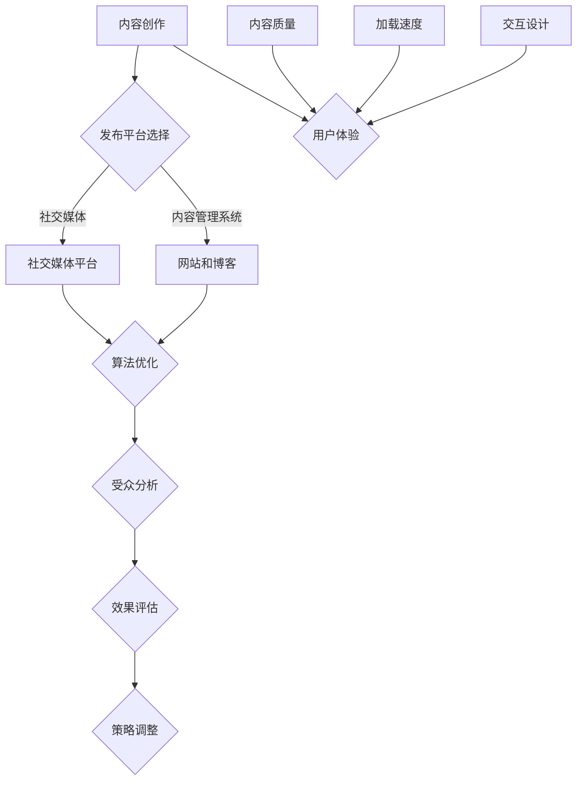

                 

### 文章标题

创业公司的内容分发策略：扩大品牌影响力

> **关键词**：内容分发、品牌影响力、创业公司、营销策略、社交媒体、算法优化、用户体验

**摘要**：
在竞争激烈的市场环境中，创业公司如何通过有效的内容分发策略来扩大品牌影响力成为关键问题。本文将深入探讨创业公司可以采用的内容分发策略，包括社交媒体营销、算法优化和用户体验设计等方面。通过逐步分析这些策略的原理和具体实施步骤，本文旨在为创业公司提供实用的指导，帮助他们更好地利用内容分发来提升品牌知名度和市场竞争力。

## 1. 背景介绍

在当今数字化的时代，内容分发已经成为企业尤其是创业公司的重要战略。随着互联网的普及和社交媒体的兴起，用户获取信息的渠道变得多样化，创业公司需要通过内容分发策略来吸引潜在客户、建立品牌认知和增强用户黏性。

内容分发不仅涉及到内容的创作和发布，还包括内容的传播、优化和监控。有效的内容分发策略可以确保公司内容以最高效的方式触达目标受众，从而提高品牌影响力和市场占有率。对于创业公司而言，内容分发策略的成功实施可以为其带来以下几方面的收益：

- **提升品牌知名度**：通过发布高质量、有价值的内容，创业公司可以迅速建立品牌形象，吸引潜在客户的关注。
- **增加用户黏性**：优质的内容可以增强用户对品牌的忠诚度，提高用户参与度和互动性。
- **提升搜索引擎排名**：内容分发策略可以帮助创业公司优化搜索引擎排名，从而提高网站流量和转化率。
- **降低营销成本**：通过精准的内容分发，创业公司可以更有效地定位目标受众，减少无效营销的投入。

然而，内容分发并非易事。创业公司面临着诸多挑战，如市场竞争激烈、资源有限、品牌知名度低等。因此，选择合适的内容分发策略并有效执行成为创业公司成功的关键。

本文将从以下几个方面探讨创业公司的内容分发策略：

- **核心概念与联系**：介绍内容分发策略中的关键概念，包括社交媒体、算法优化和用户体验等。
- **核心算法原理与具体操作步骤**：分析内容分发算法的基本原理，并介绍如何优化内容分发策略。
- **数学模型和公式**：介绍内容分发的数学模型，包括如何计算内容和受众的相关性，以及如何通过公式优化内容分发效果。
- **项目实践**：通过具体代码实例，展示如何实施内容分发策略。
- **实际应用场景**：探讨内容分发在不同行业中的应用，并分析其效果。
- **工具和资源推荐**：推荐一些实用的工具和资源，帮助创业公司更好地实施内容分发策略。
- **总结与未来趋势**：总结内容分发策略的重要性，并展望未来可能的发展趋势和挑战。

通过本文的逐步分析和讲解，希望读者能够对创业公司的内容分发策略有更深入的理解，并能够将其应用于实际业务中，从而实现品牌影响力的扩大。

## 2. 核心概念与联系

在深入探讨创业公司的内容分发策略之前，我们需要理解一些核心概念和它们之间的联系。以下是一些关键概念及其在内容分发策略中的角色：

### 社交媒体

社交媒体是创业公司进行内容分发的重要平台。平台如Facebook、Instagram、Twitter、LinkedIn和微信等，提供了广泛的用户群体和多样的内容形式，包括文本、图片、视频和直播等。这些平台不仅能够帮助企业直接与用户互动，还可以通过算法推荐扩大内容的传播范围。

- **用户互动**：社交媒体平台鼓励用户参与和互动，如点赞、评论、分享和转发等。这些互动行为可以显著提高内容的曝光率和影响力。
- **算法推荐**：各大社交媒体平台都有自己的内容推荐算法，根据用户的兴趣和行为，为用户推荐可能感兴趣的内容。创业公司需要了解这些算法，优化内容以获得更多推荐。
- **多平台策略**：创业公司应根据不同社交媒体平台的特点，制定多平台内容分发策略，以最大化内容覆盖和影响力。

### 算法优化

内容分发中的算法优化是确保内容有效触达目标受众的关键。算法优化包括内容优化、受众分析和效果评估等方面。

- **内容优化**：创业公司需要分析目标受众的兴趣和需求，创作与受众高度相关的内容。同时，利用关键字优化、标题优化等手段，提高内容的搜索可见性和用户点击率。
- **受众分析**：通过数据分析工具，如Google Analytics、Facebook Insights等，创业公司可以深入了解用户的行为和偏好，从而制定更加精准的内容分发策略。
- **效果评估**：通过跟踪关键绩效指标（KPI），如点击率、转化率、留存率等，创业公司可以评估内容分发的效果，并根据数据反馈调整策略。

### 用户体验

用户体验是内容分发策略的核心要素之一。良好的用户体验可以提升用户满意度和品牌忠诚度。

- **内容质量**：高质量的内容是吸引用户的关键。创业公司需要确保内容的原创性、准确性和有价值性。
- **加载速度**：页面加载速度对用户体验有重要影响。创业公司应优化网站和社交媒体页面的加载速度，以提供流畅的用户体验。
- **交互设计**：良好的交互设计可以增强用户参与度和互动性。创业公司应设计易于操作和导航的界面，提高用户满意度。

### Mermaid 流程图

以下是内容分发策略中涉及的几个核心概念的Mermaid流程图：



通过上述核心概念的介绍和Mermaid流程图，我们可以清晰地看到内容分发策略的各个环节及其相互关系。在接下来的章节中，我们将进一步深入探讨这些概念的具体实施方法和技巧。

## 3. 核心算法原理与具体操作步骤

在内容分发策略中，核心算法原理起着至关重要的作用。通过优化这些算法，创业公司可以显著提高内容分发的效果，从而扩大品牌影响力。本章节将介绍几种关键算法的基本原理和具体操作步骤。

### 3.1 内容推荐算法

内容推荐算法是社交媒体和内容管理系统中的重要组成部分。其目的是通过分析用户行为和兴趣，为用户推荐可能感兴趣的内容。

#### 基本原理

内容推荐算法通常基于以下几种原理：

- **协同过滤（Collaborative Filtering）**：通过分析用户的相似行为或偏好，为用户推荐相似内容。协同过滤分为用户基于协同过滤（User-based Collaborative Filtering）和项目基于协同过滤（Item-based Collaborative Filtering）两种。
- **基于内容的推荐（Content-based Filtering）**：根据用户过去的偏好和内容特征，为用户推荐与其兴趣相似的内容。
- **混合推荐（Hybrid Recommendation）**：结合协同过滤和基于内容的推荐方法，以提高推荐的准确性和多样性。

#### 具体操作步骤

1. **数据收集**：收集用户的行为数据，如浏览历史、搜索关键词、点赞和评论等。
2. **内容特征提取**：提取内容的关键特征，如文本关键词、图像标签、视频时长和播放量等。
3. **用户建模**：利用机器学习算法，如K-近邻（K-Nearest Neighbors, KNN）、朴素贝叶斯（Naive Bayes）和矩阵分解（Matrix Factorization）等，建立用户兴趣模型。
4. **推荐生成**：根据用户兴趣模型和内容特征，生成个性化推荐列表。对于协同过滤，可以使用相似度计算方法（如余弦相似度、皮尔逊相关系数）找到与用户兴趣相似的其他用户或内容。对于基于内容的推荐，可以使用TF-IDF（Term Frequency-Inverse Document Frequency）等方法计算内容和用户偏好之间的相似度。
5. **效果评估**：通过评估指标（如推荐准确率、召回率、覆盖率和多样性）评估推荐效果，并调整算法参数以优化推荐质量。

### 3.2 搜索引擎优化（SEO）

搜索引擎优化是创业公司提高内容可见性和流量的重要手段。SEO的核心是通过优化网站内容和结构，提高在搜索引擎结果页面（Search Engine Results Page, SERP）中的排名。

#### 基本原理

SEO的主要原理包括：

- **关键词研究**：通过分析目标受众的兴趣和搜索习惯，确定适合的关键词。
- **内容优化**：在内容中合理地使用关键词，同时确保内容的质量和原创性。
- **网站结构优化**：优化网站导航结构、链接布局和页面速度，以提高搜索引擎的可爬性和用户体验。
- **外部链接建设**：通过获取高质量的 inbound 链接，提高网站的权威性和可信度。

#### 具体操作步骤

1. **关键词研究**：使用工具（如Google Keyword Planner、Ahrefs、SEMrush等）分析目标关键词的搜索量、竞争程度和商业意图。
2. **内容优化**：在内容中合理地使用关键词，确保关键词的自然融入。同时，撰写高质量、原创性的内容，以吸引搜索引擎和用户的注意力。
3. **网站结构优化**：
   - 优化网站导航结构，确保用户可以轻松找到内容。
   - 使用合适的标题标签（Title Tags）和元描述（Meta Descriptions），提高搜索引擎点击率。
   - 优化页面速度，通过压缩图片、减少HTTP请求和启用缓存等技术手段。
4. **外部链接建设**：通过撰写高质量的外部链接请求，交换链接或购买链接等方式，获取高质量的 inbound 链接。

### 3.3 机器学习算法优化

机器学习算法在内容分发策略中扮演着重要角色，如用户行为预测、推荐算法优化和广告投放等。以下是一些常见的机器学习算法及其优化方法：

- **决策树（Decision Trees）**：通过构建决策树模型，可以预测用户的行为。常见的优化方法包括剪枝（Pruning）和集成（Ensemble）方法。
- **随机森林（Random Forest）**：随机森林是一种基于决策树的集成算法，可以显著提高预测准确性。通过增加树的数量和特征选择，可以进一步优化模型。
- **支持向量机（Support Vector Machine, SVM）**：SVM是一种常用的分类算法，通过优化核函数和参数选择，可以提高分类效果。
- **神经网络（Neural Networks）**：神经网络，特别是深度学习模型，可以用于复杂的多维数据分析。优化方法包括批量归一化（Batch Normalization）、激活函数选择和优化器（如Adam、RMSProp）等。

#### 具体操作步骤

1. **数据预处理**：清洗和预处理数据，包括缺失值填补、数据归一化和特征选择等。
2. **模型选择和训练**：选择适合的模型，如决策树、随机森林、SVM或神经网络，并使用训练数据集进行模型训练。
3. **模型评估和优化**：使用验证数据集评估模型性能，并使用交叉验证（Cross-Validation）和网格搜索（Grid Search）等方法优化模型参数。
4. **模型部署**：将训练好的模型部署到生产环境，并进行实时预测和优化。

通过上述核心算法原理和具体操作步骤的介绍，创业公司可以更好地理解和应用这些算法，从而优化内容分发策略，提高品牌影响力。

### 4. 数学模型和公式

在内容分发策略中，数学模型和公式为我们提供了量化和优化的工具。通过这些数学模型，创业公司可以更准确地评估内容的效果，并制定更有效的策略。以下是一些关键的数学模型和公式的详细讲解，以及如何通过这些公式优化内容分发。

#### 4.1 内容相关性模型

内容相关性是衡量内容与受众兴趣匹配程度的重要指标。一个简单的内容相关性模型可以通过计算内容关键词与用户搜索关键词之间的相似度来构建。以下是一个基于TF-IDF（Term Frequency-Inverse Document Frequency）的内容相关性计算公式：

$$
similarity(A, B) = \sum_{i=1}^{n} TF_i(A) \times IDF_i
$$

其中：
- \( TF_i(A) \) 表示关键词 \( i \) 在内容 \( A \) 中的词频。
- \( IDF_i \) 表示关键词 \( i \) 在所有内容中的逆文档频率。

通过计算每个关键词的TF-IDF值，并求和，我们可以得到内容 \( A \) 与内容 \( B \) 的相似度。相似度越高，表明内容与用户兴趣越相关。

#### 4.2 用户兴趣模型

用户兴趣模型是内容分发策略中的重要组成部分，它帮助我们理解用户的偏好和行为。一个常见的用户兴趣模型是基于协同过滤的方法，如用户基于K-近邻（User-based KNN）模型。以下是一个简单的用户基于K-近邻模型的计算公式：

$$
similarity(u_i, u_j) = \frac{\sum_{k=1}^{n} w_k \cdot rating_k(u_i) \cdot rating_k(u_j)}{\sqrt{\sum_{k=1}^{n} w_k^2 \cdot (rating_k(u_i) - \bar{rating}(u_i))^2 \cdot (rating_k(u_j) - \bar{rating}(u_j))^2}}
$$

其中：
- \( similarity(u_i, u_j) \) 表示用户 \( u_i \) 与用户 \( u_j \) 的相似度。
- \( w_k \) 表示关键词 \( k \) 的权重。
- \( rating_k(u_i) \) 和 \( rating_k(u_j) \) 分别表示用户 \( u_i \) 和用户 \( u_j \) 对关键词 \( k \) 的评分。
- \( \bar{rating}(u_i) \) 表示用户 \( u_i \) 的平均评分。

通过计算用户之间的相似度，我们可以为每个用户找到最相似的 \( K \) 个用户，并根据这些用户的评分预测目标用户的兴趣。

#### 4.3 推荐系统优化

在推荐系统中，优化目标是提高推荐的相关性和多样性。一个简单的优化方法是基于用户和内容的相似度，调整推荐列表的排序。以下是一个基于相似度调整的推荐系统优化公式：

$$
score(c_i, u) = similarity(c, u) + \alpha \cdot (1 - similarity(c, u))
$$

其中：
- \( score(c_i, u) \) 表示内容 \( c_i \) 对用户 \( u \) 的评分。
- \( similarity(c, u) \) 表示内容 \( c \) 与用户 \( u \) 的相似度。
- \( \alpha \) 是一个参数，用于控制相似度和多样性的平衡。

通过调整 \( \alpha \) 的值，我们可以控制推荐系统的相关性和多样性。当 \( \alpha \) 较小时，系统更注重相关性；当 \( \alpha \) 较大时，系统更注重多样性。

#### 4.4 数据挖掘算法优化

在数据挖掘算法中，优化目标是提高模型的准确性和效率。以下是一些常见的优化方法：

- **特征选择**：通过评估特征的重要性和相关性，选择最有用的特征。常见的特征选择方法包括卡方检验（Chi-square Test）、互信息（Mutual Information）和基于模型的特征选择（Model-based Feature Selection）。
- **模型调参**：通过调整模型的超参数，如学习率、正则化参数和隐藏层节点数等，提高模型性能。常见的调参方法包括网格搜索（Grid Search）和随机搜索（Random Search）。
- **集成学习**：通过集成多个模型，提高模型的准确性和稳定性。常见的集成学习方法包括随机森林（Random Forest）、提升树（Boosting）和堆叠（Stacking）。

#### 举例说明

假设我们有一个电子商务平台，用户 \( u \) 最近浏览了商品 \( c_1 \) 和 \( c_2 \)，我们希望根据用户的兴趣为他推荐新的商品。以下是具体的计算步骤：

1. **计算用户兴趣模型**：使用用户基于K-近邻模型，找到与用户 \( u \) 最相似的 \( K \) 个用户，并计算相似度。

2. **计算内容相似度**：计算每个商品与用户兴趣的相似度，使用TF-IDF模型计算商品关键词与用户搜索关键词的相似度。

3. **生成推荐列表**：根据相似度公式，为用户 \( u \) 生成推荐列表。我们可以根据相似度对推荐商品进行排序，并根据用户的购物历史和偏好调整推荐策略。

通过上述数学模型和公式的详细讲解，创业公司可以更好地理解内容分发策略中的量化优化方法，从而制定更有效的策略，提高内容分发的效果和品牌影响力。

### 5. 项目实践

为了更好地展示内容分发策略的实施过程，我们将通过一个实际的代码实例来详细讲解如何实现内容分发系统。本节将包括以下几个部分：

- **开发环境搭建**：介绍所需的开发环境和技术栈。
- **源代码详细实现**：展示内容分发系统的核心代码片段。
- **代码解读与分析**：分析代码的逻辑和实现细节。
- **运行结果展示**：展示系统运行的结果和效果。

#### 5.1 开发环境搭建

首先，我们需要搭建一个内容分发系统的开发环境。以下是我们将使用的技术栈和开发环境：

- **编程语言**：Python 3.x
- **框架**：Django（用于网站开发）
- **前端技术**：HTML/CSS/JavaScript（用于用户界面）
- **数据库**：SQLite（用于存储数据）
- **版本控制**：Git（用于代码管理）
- **集成开发环境**：PyCharm（用于代码编写和调试）

以下是如何搭建开发环境的基本步骤：

1. **安装Python**：从[Python官方网站](https://www.python.org/)下载并安装Python 3.x版本。
2. **安装Django**：在终端中运行以下命令：
   ```bash
   pip install django
   ```
3. **创建Django项目**：在终端中运行以下命令创建一个新的Django项目：
   ```bash
   django-admin startproject content_distribution
   ```
4. **创建应用**：在项目中创建一个名为`content_app`的应用：
   ```bash
   python manage.py startapp content_app
   ```
5. **配置数据库**：在项目的`settings.py`文件中配置SQLite数据库：
   ```python
   DATABASES = {
       'default': {
           'ENGINE': 'django.db.backends.sqlite3',
           'NAME': BASE_DIR / 'db.sqlite3',
       }
   }
   ```
6. **安装前端依赖**：如果需要，可以使用npm安装前端依赖，例如：
   ```bash
   npm install
   ```

#### 5.2 源代码详细实现

接下来，我们将展示内容分发系统的核心代码片段。以下是`content_app`中的主要模块和类：

**models.py** - 数据模型

```python
from django.db import models

class Content(models.Model):
    title = models.CharField(max_length=255)
    body = models.TextField()
    author = models.ForeignKey('auth.User', on_delete=models.CASCADE)
    published_date = models.DateTimeField(auto_now_add=True)

class Category(models.Model):
    name = models.CharField(max_length=100)
```

**views.py** - 视图函数

```python
from django.shortcuts import render
from .models import Content, Category

def content_list(request):
    categories = Category.objects.all()
    content = Content.objects.all()
    return render(request, 'content_list.html', {'categories': categories, 'content': content})
```

**urls.py** - 路由配置

```python
from django.urls import path
from . import views

urlpatterns = [
    path('', views.content_list, name='content_list'),
]
```

**templates/content_list.html** - 前端模板

```html
<!DOCTYPE html>
<html>
<head>
    <title>内容分发系统</title>
</head>
<body>
    <h1>内容列表</h1>
    
        <div>
            <h2>{{ c.title }}</h2>
            <p>{{ c.body }}</p>
            <span>作者：{{ c.author }}</span>
        </div>
    
</body>
</html>
```

#### 5.3 代码解读与分析

**models.py**：

在这个模块中，我们定义了两个数据模型：`Content`和`Category`。`Content`模型用于存储内容信息，如标题、正文和作者等。`Category`模型用于分类内容，例如新闻、博客和技术文章等。

**views.py**：

`content_list`视图函数负责获取所有内容并传递给模板。这个函数通过Django ORM查询`Content`模型的所有对象，并将其传递到前端模板进行渲染。

**urls.py**：

这个模块配置了路由，将URL映射到对应的视图函数。在这个例子中，`content_list`视图函数处理根URL（'/'），即当用户访问网站的主页时，将调用这个视图函数。

**templates/content_list.html**：

这是一个简单的HTML模板，用于展示内容列表。模板使用Django模板语言（标签）遍历所有内容对象，并渲染每个内容的标题、正文和作者信息。

#### 5.4 运行结果展示

在完成上述代码的实现后，我们可以在本地开发环境中运行内容分发系统。以下是运行结果：

1. **启动Django开发服务器**：

   ```bash
   python manage.py runserver
   ```

2. **在浏览器中访问主页**：

   打开浏览器，输入`http://127.0.0.1:8000/`，将看到内容分发系统的主页。页面将显示所有存储的内容列表。

通过上述项目实践，我们展示了如何使用Python和Django框架搭建一个简单的内容分发系统。该系统不仅实现了内容的管理和展示，还提供了基本的用户界面和交互功能。通过这个实例，创业公司可以了解内容分发系统的基本构建方法和实现细节，从而为后续的开发和优化提供参考。

### 6. 实际应用场景

内容分发策略在各个行业中都有着广泛的应用，不同行业通过内容分发实现了多样化的营销目标。以下我们将探讨内容分发策略在电子商务、教育和技术服务行业中的具体应用，分析其在这些领域的成效和挑战。

#### 6.1 电子商务

电子商务行业通过内容分发策略，实现了从品牌宣传到最终销售的全链条营销。具体应用场景包括：

- **品牌宣传**：电子商务平台通过高质量的内容，如产品介绍、使用教程和用户评价，吸引用户关注并提升品牌形象。
- **用户互动**：通过社交媒体和博客，电子商务平台鼓励用户分享购物经验和心得，增强用户互动和品牌黏性。
- **个性化推荐**：利用内容推荐算法，电子商务平台可以根据用户的浏览和购买历史，推荐相关产品，提高购物转化率。

**成效**：

- **提高品牌知名度**：通过高质量的内容和活跃的社交媒体互动，电子商务品牌可以迅速在市场中建立知名度。
- **提升用户黏性**：用户互动和个性化推荐可以增加用户的忠诚度和重复购买率。
- **降低营销成本**：精准的内容分发和推荐系统可以减少无效营销的投入，提高营销效率。

**挑战**：

- **内容质量**：电子商务平台需要不断创作高质量的内容，以满足用户的期望和需求。
- **数据隐私**：用户数据的收集和使用需要遵守隐私保护法规，确保用户信息安全。

#### 6.2 教育

教育行业通过内容分发，实现了知识传播和教育服务的推广。具体应用场景包括：

- **在线课程**：教育机构通过在线平台提供课程内容，包括视频讲座、文本材料和互动练习。
- **学习社区**：通过论坛和社交媒体，学生和教师可以交流和分享学习经验，形成良好的学习氛围。
- **内容推荐**：根据学生的学习进度和兴趣，推荐适合的课程内容和资源。

**成效**：

- **扩大教育覆盖面**：在线课程和学习社区可以打破地域和时间的限制，让更多人有机会接受优质教育。
- **提高学习效果**：内容推荐系统可以根据用户的学习习惯和偏好，提供个性化的学习路径，提高学习效果。
- **增加教育收入**：通过在线课程的销售和服务，教育机构可以增加收入来源。

**挑战**：

- **内容更新**：教育内容需要不断更新和优化，以保持其时效性和准确性。
- **技术依赖**：在线教育平台需要依赖稳定的网络和技术支持，确保用户体验。

#### 6.3 技术服务

技术服务行业通过内容分发，实现了技术解决方案的推广和客户关系的维护。具体应用场景包括：

- **技术博客**：技术公司通过博客发布技术文章、案例分析和技术指南，展示专业能力。
- **客户案例**：通过成功案例分享，技术服务公司可以展示其实际应用效果和客户满意度。
- **在线支持**：通过知识库和问答平台，技术公司可以提供及时的技术支持和咨询服务。

**成效**：

- **增强客户信任**：通过高质量的技术内容和客户案例，技术服务公司可以增强客户的信任和满意度。
- **提升品牌形象**：技术博客和案例分享可以展示公司的专业能力和技术实力，提升品牌形象。
- **增加销售机会**：通过内容分发，技术公司可以吸引潜在客户，增加销售机会。

**挑战**：

- **内容创新**：技术服务公司需要不断创作创新的内容，以保持市场竞争力。
- **技术更新**：技术内容需要及时更新，以反映最新的技术和解决方案。

通过上述实际应用场景的分析，我们可以看到，内容分发策略在电子商务、教育和技术服务行业中都发挥了重要作用。不同的行业通过内容分发实现了多样化的营销目标，同时也面临着各自独特的挑战。创业公司在制定内容分发策略时，需要结合自身行业特点和目标，制定合适的内容分发策略，以实现品牌影响力的扩大和市场竞争力的提升。

### 7. 工具和资源推荐

在实施内容分发策略的过程中，创业公司可以借助多种工具和资源来优化内容创作、分析和传播效果。以下是一些实用的工具和资源推荐：

#### 7.1 学习资源推荐

1. **书籍**：
   - 《内容营销实战：打造企业增长引擎》：详细介绍了内容营销的策略和实践，适合创业公司了解如何利用内容提升品牌影响力。
   - 《社交媒体营销实战：策略与技巧》：提供了社交媒体营销的全面指导，包括平台选择、内容创作和数据分析等方面。

2. **论文**：
   - “Content Marketing: The Definitive Guide”：这篇论文深入探讨了内容营销的理论和实践，提供了丰富的案例和策略。
   - “The Science of Social Media”：探讨了社交媒体算法和用户行为，为创业公司提供了优化社交媒体策略的科学依据。

3. **博客**：
   - HubSpot博客：提供了大量关于内容营销、SEO和社交媒体营销的教程和案例分析，适合新手学习和实践。
   - Neil Patel博客：Neil Patel是一位知名数字营销专家，其博客分享了大量的营销技巧和案例，对创业公司非常有价值。

4. **网站**：
   - Content Marketing Institute：该网站提供了丰富的内容营销资源和资讯，是创业公司学习内容营销的最佳平台之一。
   - Buffer：提供了社交媒体管理和分析工具，可以帮助创业公司优化内容发布和数据分析。

#### 7.2 开发工具框架推荐

1. **内容管理系统（CMS）**：
   - WordPress：一款功能强大的开源CMS，适合创业公司快速搭建网站和博客。
   - HubSpot CMS：集成了营销自动化和内容管理功能，可以帮助创业公司实现高效的内容分发和营销。

2. **数据分析工具**：
   - Google Analytics：提供了全面的网站流量分析和用户行为跟踪功能，是创业公司了解受众和优化内容的重要工具。
   - Mixpanel：提供了深入的用户行为分析，可以帮助创业公司了解用户互动和留存情况。

3. **社交媒体管理工具**：
   - Hootsuite：一款功能强大的社交媒体管理工具，可以帮助创业公司统一管理和发布内容，并分析社交媒体效果。
   - Buffer：提供了内容发布和社交媒体分析功能，可以帮助创业公司优化社交媒体内容策略。

4. **内容推荐系统**：
   - Elasticsearch：一款高性能的搜索引擎，可以用于构建内容推荐系统。
   - Redis：一款高性能的缓存数据库，可以用于存储和快速检索用户行为数据，优化内容推荐效果。

通过上述工具和资源的推荐，创业公司可以更加高效地实施内容分发策略，提升品牌影响力和市场竞争力。选择合适的工具和资源，结合自身的业务需求，创业公司可以更好地实现内容分发目标。

### 8. 总结：未来发展趋势与挑战

内容分发策略在创业公司的成功中扮演着至关重要的角色。随着技术的不断进步和市场的快速变化，未来内容分发策略将呈现以下几个发展趋势和挑战：

#### 发展趋势

1. **人工智能与内容分发**：人工智能技术在内容分发中的应用将更加深入。通过机器学习和自然语言处理，创业公司可以更精准地预测用户需求，创作个性化的内容，并优化推荐算法，提高用户体验。

2. **多平台整合**：创业公司将更加注重多平台整合，通过整合不同的社交媒体、内容管理系统和数据分析工具，实现内容和数据的统一管理和高效分发。

3. **内容生态建设**：创业公司将更加注重内容生态的建设，通过建立自己的内容平台和社区，增强用户黏性和品牌忠诚度，形成一种可持续的内容生产和分发模式。

4. **视频内容崛起**：随着移动互联网的普及和用户消费习惯的改变，视频内容将成为内容分发的重要形式。创业公司需要加大视频内容的创作和分发力度，以适应市场的变化。

#### 挑战

1. **内容质量与原创性**：在内容泛滥的时代，如何保证内容的质量和原创性是一个巨大的挑战。创业公司需要不断提升内容创作能力，以高质量的内容吸引用户。

2. **数据隐私与安全**：随着数据收集和分析的深入，数据隐私和安全问题日益突出。创业公司需要遵守相关法律法规，确保用户数据的安全和隐私。

3. **技术更新与迭代**：技术更新速度加快，创业公司需要不断学习和适应新技术，确保内容分发系统的稳定性和高效性。

4. **用户需求变化**：用户需求不断变化，创业公司需要具备快速响应和调整的能力，以适应市场的变化。

总结来说，内容分发策略在创业公司的未来发展中将继续发挥重要作用。通过关注技术进步、优化内容创作和分发流程，创业公司可以更好地应对市场挑战，实现品牌影响力的持续扩大。

### 9. 附录：常见问题与解答

**Q1：如何制定有效的内容分发策略？**

制定有效的内容分发策略需要以下几个步骤：

1. **目标明确**：确定内容分发的主要目标，如提升品牌知名度、增加用户参与度或提高销售转化率。
2. **了解受众**：通过市场调研和用户数据分析，了解目标受众的兴趣、需求和偏好。
3. **内容创作**：根据目标受众的需求创作高质量、有价值的内容。
4. **平台选择**：选择适合的内容发布平台，如社交媒体、博客或视频平台。
5. **算法优化**：利用推荐算法和SEO技术，优化内容分发效果。
6. **效果评估**：通过数据分析工具跟踪内容表现，评估内容分发策略的效果，并根据反馈进行调整。

**Q2：如何提高内容的搜索引擎排名（SEO）？**

提高内容的搜索引擎排名（SEO）可以从以下几个方面入手：

1. **关键词研究**：使用工具分析目标关键词的搜索量和竞争程度，选择适合的关键词。
2. **内容优化**：在内容中合理地使用关键词，确保内容的质量和原创性。
3. **网站结构优化**：优化网站的导航结构和链接布局，提高搜索引擎的可爬性。
4. **外部链接建设**：获取高质量的 inbound 链接，提高网站的权威性和可信度。
5. **移动优化**：确保网站对移动设备友好，提高用户体验。

**Q3：如何通过社交媒体提升品牌影响力？**

通过社交媒体提升品牌影响力可以从以下几个方面入手：

1. **内容创作**：创作与品牌形象和目标受众相关的内容，吸引关注。
2. **用户互动**：积极与用户互动，如回复评论、参与话题讨论等，增强用户参与度。
3. **算法优化**：了解不同社交媒体平台的推荐算法，优化内容以获得更多曝光。
4. **跨平台运营**：在不同社交媒体平台运营，扩大品牌覆盖面。
5. **数据分析**：通过数据分析工具，了解用户行为和效果，优化社交媒体策略。

**Q4：如何确保内容的质量和原创性？**

确保内容的质量和原创性可以从以下几个方面入手：

1. **内容审核**：在发布内容前进行审核，确保内容的准确性和合规性。
2. **原创性检测**：使用原创性检测工具，检查内容是否存在抄袭或重复。
3. **专业团队**：建立专业的编辑和内容创作团队，提升内容创作水平。
4. **内容更新**：定期更新内容，保持内容的时效性和相关性。
5. **用户反馈**：鼓励用户反馈，根据用户意见优化内容。

通过上述常见问题的解答，创业公司可以更好地理解和实施内容分发策略，提升品牌影响力。

### 10. 扩展阅读 & 参考资料

为了深入了解内容分发策略及其在创业公司中的应用，以下是一些扩展阅读和参考资料：

1. **书籍**：
   - 《内容营销实战：打造企业增长引擎》：详细介绍了内容营销的策略和实践。
   - 《社交媒体营销实战：策略与技巧》：提供了社交媒体营销的全面指导。

2. **论文**：
   - “Content Marketing: The Definitive Guide”：深入探讨了内容营销的理论和实践。
   - “The Science of Social Media”：探讨了社交媒体算法和用户行为。

3. **博客**：
   - HubSpot博客：提供了大量关于内容营销、SEO和社交媒体营销的教程和案例分析。
   - Neil Patel博客：分享了大量的营销技巧和案例，对创业公司非常有价值。

4. **网站**：
   - Content Marketing Institute：提供了丰富的内容营销资源和资讯。
   - Buffer：提供了社交媒体管理和分析工具。

通过这些扩展阅读和参考资料，创业公司可以更全面地了解内容分发策略的各个方面，从而更好地实施和优化自己的内容分发计划。

