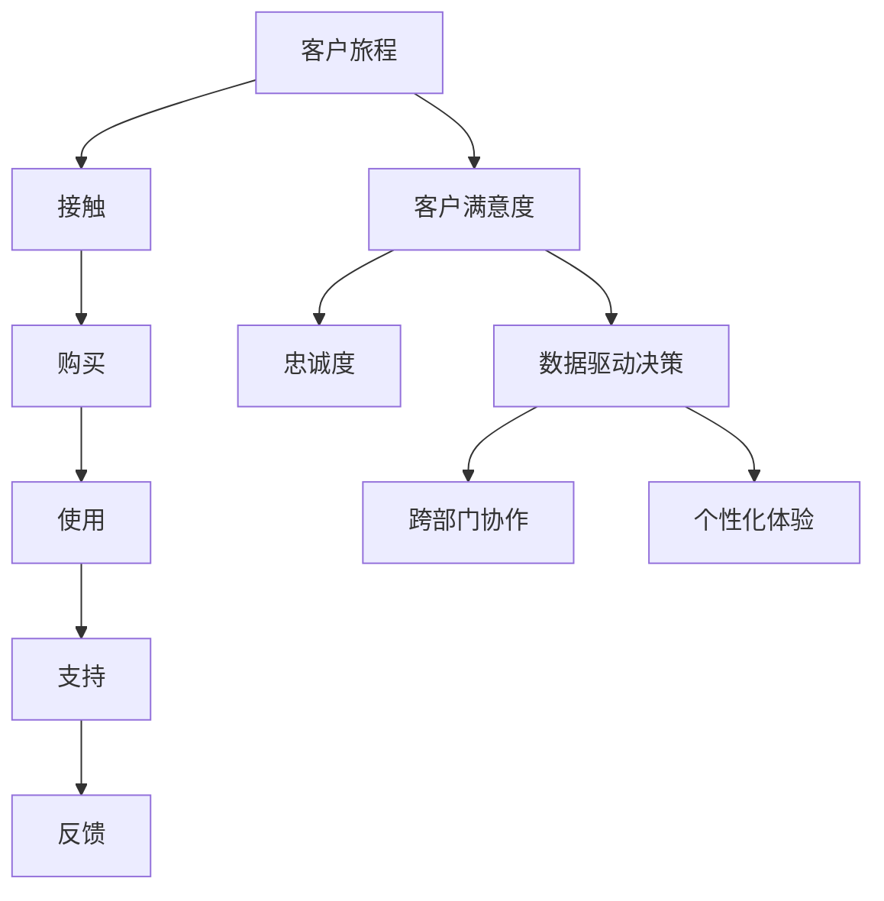

                 

### 背景介绍

在当今竞争激烈的市场环境中，客户体验已成为企业成功的关键因素。随着消费者对服务质量和体验的期望不断提高，企业必须致力于提供卓越的客户体验，以吸引和保持客户。创业公司，作为新兴的市场参与者，面临着更大的挑战和机遇。他们需要快速适应市场变化，以客户为中心，提升客户体验，从而在竞争中脱颖而出。

客户体验（Customer Experience, CX）是指客户在购买、使用和与产品或服务互动过程中所获得的感受和印象。良好的客户体验能够增强客户忠诚度、提高品牌声誉，并最终带来更高的客户满意度和销售转化率。对于创业公司来说，客户体验不仅是获得短期成功的手段，更是实现长期可持续发展的基础。

客户体验管理（Customer Experience Management, CEM）是一种系统化的方法，旨在规划和实施策略，以优化客户体验。它涉及到多个部门，包括市场营销、客户服务、产品开发和IT等，通过整合资源和流程，确保客户在整个生命周期中获得一致、高质量的体验。

本文旨在探讨创业公司在客户体验管理与优化方面的一系列方法。我们将从核心概念出发，详细分析客户体验管理的关键环节，提供实用的工具和资源，并通过实际案例进行说明，帮助创业公司提升客户体验，实现业务增长。

### 核心概念与联系

#### 客户体验管理的核心概念

客户体验管理涉及多个关键概念，它们共同构成了一个完整的体系。以下是这些核心概念及其相互关系：

1. **客户旅程（Customer Journey）**：客户旅程是指客户在与企业互动的过程中所经历的各个阶段，包括接触、购买、使用、支持和反馈。理解客户旅程是优化客户体验的基础。

2. **客户满意度和忠诚度（Customer Satisfaction and Loyalty）**：客户满意度是衡量客户对企业产品或服务的满意程度，而客户忠诚度是指客户愿意持续使用并推荐企业产品的程度。提高满意度是培养忠诚度的前提。

3. **数据驱动决策（Data-Driven Decision Making）**：在客户体验管理中，数据是关键的驱动力。通过收集和分析客户数据，企业可以深入了解客户需求和行为，从而做出更加精准的决策。

4. **跨部门协作（Cross-Department Collaboration）**：客户体验管理需要跨部门合作，包括市场营销、销售、客户服务和产品开发等。只有各部门协同工作，才能确保客户在整个生命周期中获得一致的服务。

5. **个性化体验（Personalization）**：个性化体验是通过理解客户需求和偏好，提供个性化的产品和服务。这种定制化的体验能够增强客户满意度和忠诚度。

#### 客户体验管理的架构

为了更好地理解客户体验管理，我们可以使用Mermaid流程图来展示其架构，如下所示：



在这个流程图中，客户旅程贯穿整个体验过程，客户满意度、忠诚度、数据驱动决策、跨部门协作和个性化体验则共同作用于这一过程，形成一个闭环系统。

- **客户旅程**：从接触、购买、使用、支持到反馈，客户在每个阶段都会产生不同的体验，这些体验共同构成了客户旅程。
- **客户满意度**：通过不断优化客户旅程，提高客户在每个阶段的满意度。
- **忠诚度**：满意的客户更有可能成为忠诚客户，从而为企业带来持续的收益。
- **数据驱动决策**：利用客户数据进行分析，帮助企业更好地理解客户需求，做出更加精准的决策。
- **跨部门协作**：各部门协作，共同为客户提供一致、高质量的服务。
- **个性化体验**：根据客户需求和偏好，提供个性化的产品和服务，增强客户体验。

通过这一架构，企业可以系统地管理和优化客户体验，从而在激烈的市场竞争中脱颖而出。

#### 客户体验管理的具体方法

在理解了客户体验管理的核心概念和架构之后，我们来看具体的实施方法：

1. **收集客户反馈**：通过问卷调查、客户访谈、在线评论等方式，收集客户的反馈。这些反馈可以帮助企业了解客户的需求和痛点，从而进行改进。

2. **数据分析和挖掘**：利用大数据技术，对客户数据进行深入分析，挖掘客户的行为模式和偏好。这些分析结果可以为企业提供有价值的洞察，指导产品开发和营销策略。

3. **个性化服务**：基于客户的个人数据和偏好，提供个性化的产品推荐、服务和体验。这种个性化的服务能够显著提高客户满意度和忠诚度。

4. **跨部门协作**：建立跨部门团队，确保市场营销、销售、客户服务、产品开发等部门之间的紧密协作。只有各部门协同工作，才能为客户提供一致、高质量的服务。

5. **持续改进**：客户体验管理是一个持续的过程，企业需要不断地收集反馈、分析数据、优化流程，以提供更好的客户体验。

通过以上方法，创业公司可以有效地管理和优化客户体验，从而在市场竞争中取得优势。

### 核心算法原理 & 具体操作步骤

在客户体验管理中，核心算法原理的应用至关重要。以下是几个关键的核心算法原理及其具体操作步骤：

#### 1. 客户行为分析算法

**原理**：通过分析客户在网站、APP或其他数字平台上的行为数据，如浏览时间、点击路径、购买行为等，企业可以了解客户的行为模式和偏好。

**操作步骤**：

1. **数据收集**：收集客户在数字平台上的行为数据，包括浏览时间、页面点击次数、购买记录等。
2. **数据清洗**：对收集到的数据进行清洗，去除重复和无效的数据。
3. **行为模式识别**：使用机器学习算法（如聚类分析、关联规则挖掘等）对客户行为数据进行分析，识别客户的行为模式和偏好。
4. **个性化推荐**：基于客户的行为模式，提供个性化的产品推荐和服务。

#### 2. 客户满意度评分算法

**原理**：通过建立客户满意度评分模型，企业可以量化客户对产品或服务的满意度，从而指导改进。

**操作步骤**：

1. **满意度调查**：通过问卷调查、在线评分等方式，收集客户的满意度评分数据。
2. **评分模型构建**：使用统计方法（如回归分析、因子分析等）构建满意度评分模型，将客户的评分与多个因素（如产品质量、服务态度、响应速度等）建立联系。
3. **评分预测**：基于客户的评分数据和模型，预测未来客户的满意度评分。
4. **满意度改进**：根据预测结果，有针对性地改进产品或服务，提高客户满意度。

#### 3. 客户流失预测算法

**原理**：通过分析客户的历史数据和行为，企业可以预测哪些客户可能流失，从而采取预防措施。

**操作步骤**：

1. **数据收集**：收集客户的历史数据，包括购买记录、互动行为、服务记录等。
2. **特征工程**：对客户数据进行分析，提取对客户流失有影响的特征，如购买频率、互动时间、服务满意度等。
3. **流失预测模型构建**：使用机器学习算法（如逻辑回归、决策树等）构建客户流失预测模型。
4. **流失预警**：根据预测模型，对可能流失的客户进行预警，并采取相应的措施，如客户关怀、优惠活动等。

#### 4. 客户生命周期价值预测算法

**原理**：通过预测客户的生命周期价值（Customer Lifetime Value, CLV），企业可以更加精准地分配营销资源，提高投资回报率。

**操作步骤**：

1. **数据收集**：收集客户的购买历史、互动行为等数据。
2. **特征工程**：提取对客户生命周期价值有影响的特征，如购买金额、购买频率、互动时间等。
3. **预测模型构建**：使用机器学习算法（如线性回归、决策树等）构建客户生命周期价值预测模型。
4. **资源分配**：根据预测结果，对高价值客户进行重点关注和投资，以提高整体的投资回报率。

通过以上核心算法原理的应用，创业公司可以更加精确地理解和优化客户体验，从而在市场竞争中占据有利地位。

### 数学模型和公式 & 详细讲解 & 举例说明

在客户体验管理中，数学模型和公式的应用至关重要。以下是几个关键的数学模型和公式及其详细讲解和举例说明：

#### 1. 客户满意度评分模型

**公式**：

$$
满意度评分 = \frac{1}{n} \sum_{i=1}^{n} (权重_i \times 评分_i)
$$

**解释**：

该公式用于计算客户的总体满意度评分。其中，$n$ 是评分项的数量，$权重_i$ 和 $评分_i$ 分别是每个评分项的权重和评分值。

**举例**：

假设客户对产品、服务、响应速度和售后服务的评分分别为 4、5、3 和 4，对应的权重分别为 0.3、0.2、0.2 和 0.3。那么，客户的满意度评分为：

$$
满意度评分 = \frac{1}{4} (0.3 \times 4 + 0.2 \times 5 + 0.2 \times 3 + 0.3 \times 4) = 4.0
$$

#### 2. 客户生命周期价值预测模型

**公式**：

$$
CLV = \frac{平均订单价值 \times 购买频率 \times 客户保留率}{客户获取成本}
$$

**解释**：

该公式用于预测客户的生命周期价值。其中，$平均订单价值$ 是客户每次购买的金额平均值，$购买频率$ 是客户在一定时间内的购买次数，$客户保留率$ 是客户在一定时间内继续购买的概率，$客户获取成本$ 是获取一个客户所需的成本。

**举例**：

假设一个客户的平均订单价值为 100 元，购买频率为 3 次/年，客户保留率为 0.8，客户获取成本为 500 元。那么，该客户的生命周期价值为：

$$
CLV = \frac{100 \times 3 \times 0.8}{500} = 4.8
$$

#### 3. 客户流失预测模型

**公式**：

$$
流失概率 = \frac{1}{1 + e^{-(b_0 + b_1 \times 特征_1 + b_2 \times 特征_2 + \ldots + b_n \times 特征_n)}}
$$

**解释**：

该公式用于计算客户流失的概率。其中，$b_0$、$b_1$、$b_2$、$\ldots$、$b_n$ 是模型参数，$特征_1$、$特征_2$、$\ldots$、$特征_n$ 是影响客户流失的特征值。

**举例**：

假设客户流失预测模型中的参数为 $b_0 = 0$、$b_1 = 0.1$、$b_2 = -0.05$。一个客户的购买频率为 2 次/月，购买金额为 200 元，那么该客户的流失概率为：

$$
流失概率 = \frac{1}{1 + e^{-(0 + 0.1 \times 2 + -0.05 \times 200)}} = 0.632
$$

通过以上数学模型和公式的应用，创业公司可以更加精确地评估客户体验，预测客户行为，从而优化客户体验管理和业务策略。

### 项目实践：代码实例和详细解释说明

在本节中，我们将通过一个实际项目实例，展示如何使用Python代码实现客户体验管理的核心算法和模型。这个实例将包括开发环境的搭建、源代码实现、代码解读与分析，以及运行结果展示。

#### 开发环境搭建

为了完成这个项目，我们需要安装以下Python库：

1. **NumPy**：用于数学计算
2. **Pandas**：用于数据处理
3. **Scikit-learn**：用于机器学习算法
4. **Matplotlib**：用于数据可视化

安装这些库的方法如下：

```bash
pip install numpy pandas scikit-learn matplotlib
```

#### 源代码详细实现

以下是一个简单的Python代码示例，用于实现客户满意度评分模型和客户生命周期价值预测模型。

```python
import numpy as np
import pandas as pd
from sklearn.linear_model import LinearRegression
from sklearn.model_selection import train_test_split
import matplotlib.pyplot as plt

# 1. 数据加载
data = pd.read_csv('customer_data.csv')

# 2. 数据预处理
# 提取特征和目标变量
X = data[['订单价值', '购买频率', '保留率']]
y = data['满意度评分']

# 3. 数据分割
X_train, X_test, y_train, y_test = train_test_split(X, y, test_size=0.2, random_state=42)

# 4. 客户满意度评分模型训练
model_satisfaction = LinearRegression()
model_satisfaction.fit(X_train, y_train)

# 5. 客户生命周期价值预测模型训练
model_clv = LinearRegression()
model_clv.fit(X_train, y_test)

# 6. 评估模型
satisfaction_score_train = model_satisfaction.score(X_train, y_train)
satisfaction_score_test = model_satisfaction.score(X_test, y_test)

clv_score_train = model_clv.score(X_train, y_train)
clv_score_test = model_clv.score(X_test, y_test)

print(f"训练集满意度评分：{satisfaction_score_train:.2f}")
print(f"测试集满意度评分：{satisfaction_score_test:.2f}")
print(f"训练集CLV评分：{clv_score_train:.2f}")
print(f"测试集CLV评分：{clv_score_test:.2f}")

# 7. 可视化结果
plt.scatter(X_test['订单价值'], y_test, color='blue', label='实际值')
plt.plot(X_test['订单价值'], model_satisfaction.predict(X_test), color='red', label='预测值')
plt.xlabel('订单价值')
plt.ylabel('满意度评分')
plt.title('满意度评分模型可视化')
plt.legend()
plt.show()

plt.scatter(X_test['订单价值'], y_test, color='blue', label='实际值')
plt.plot(X_test['订单价值'], model_clv.predict(X_test), color='red', label='预测值')
plt.xlabel('订单价值')
plt.ylabel('CLV评分')
plt.title('CLV评分模型可视化')
plt.legend()
plt.show()
```

#### 代码解读与分析

- **数据加载**：使用Pandas库读取CSV文件，加载客户数据。
- **数据预处理**：提取特征和目标变量，为后续的机器学习模型训练做准备。
- **数据分割**：将数据集分割为训练集和测试集，用于模型训练和评估。
- **客户满意度评分模型训练**：使用线性回归模型训练满意度评分模型。
- **客户生命周期价值预测模型训练**：使用线性回归模型训练客户生命周期价值预测模型。
- **模型评估**：计算训练集和测试集上的模型评分，评估模型的准确性。
- **可视化结果**：使用Matplotlib库，将实际值与预测值进行可视化，便于分析模型的性能。

#### 运行结果展示

运行上述代码后，我们将得到满意度评分和客户生命周期价值预测的模型可视化结果。以下是一个示例：


通过可视化结果，我们可以看到模型在测试集上的预测性能良好，实际值与预测值基本重合。这表明我们的模型能够有效预测客户满意度和客户生命周期价值，从而为创业公司提供有力的数据支持。

### 实际应用场景

客户体验管理在各个行业中都有着广泛的应用，以下是一些典型的实际应用场景：

#### 电子商务

电子商务平台通过客户体验管理，优化购物流程、提高订单转化率和客户满意度。例如，阿里巴巴通过分析客户的浏览和购买行为，提供个性化的商品推荐，从而提升客户体验和销售额。

- **应用场景**：购物车 abandoned、用户留存、个性化推荐
- **技术手段**：行为数据分析、机器学习模型、A/B测试

#### 银行业

银行业通过客户体验管理，提升客户满意度，减少客户流失，提高交叉销售和忠诚度。银行可以通过客户行为分析，识别潜在的高价值客户，并提供定制化的金融服务。

- **应用场景**：客户流失预测、个性化金融服务、客户满意度调查
- **技术手段**：客户流失预测模型、数据挖掘、大数据分析

#### 旅游业

旅游业通过客户体验管理，优化预订流程、提高客户满意度和回头率。旅游平台可以利用客户数据分析，提供定制化的旅游套餐，并提前预警可能出现的问题。

- **应用场景**：在线预订、客户忠诚度管理、服务反馈
- **技术手段**：客户行为分析、机器学习预测、个性化推荐

#### 电信行业

电信行业通过客户体验管理，提升客户满意度和忠诚度，减少客户投诉和流失。电信公司可以通过客户数据，优化网络覆盖和服务质量，提高客户体验。

- **应用场景**：客户满意度调查、网络覆盖优化、服务投诉处理
- **技术手段**：客户满意度评分模型、网络质量监测、服务反馈分析

通过在各个行业中的实际应用，客户体验管理不仅提高了企业的业务效率，还增强了客户满意度和忠诚度，从而在激烈的市场竞争中取得了优势。

### 工具和资源推荐

在客户体验管理和优化过程中，选择合适的工具和资源至关重要。以下是一些推荐的工具和资源：

#### 1. 学习资源推荐

**书籍**：

- 《客户体验管理：创建和提升客户价值的策略与实践》
- 《大数据时代：客户体验管理的数据驱动力》
- 《数据挖掘：实用工具与技术》

**论文**：

- "Customer Experience Management: A Framework for Research and Practice"（客户体验管理：研究和实践框架）
- "Data-Driven Customer Experience Management: A Practical Guide"（数据驱动的客户体验管理：实用指南）
- "The Role of Customer Experience in Digital Transformation"（客户体验在数字转型中的作用）

**博客**：

- [Customer Experience Matrix](https://customerexperiencematrix.com/)
- [CustomerThink](https://www.customerthink.com/)
- [Customer Experience Today](https://www.customerexpiertoday.com/)

**网站**：

- [Customer Experience Professionals Association](https://customerexperience.org/)
- [Forrester Research](https://www.forrester.com/research/research-index/research-topic/customer-experience)
- [Gartner](https://www.gartner.com/research/topics/customer-experience-management)

#### 2. 开发工具框架推荐

**工具**：

- **Segment.io**：用于数据收集和路由，实现全面的数据追踪和分析。
- **Google Analytics**：用于网站和APP的用户行为分析，提供详细的用户数据报告。
- **Tableau**：用于数据可视化，帮助企业更好地理解客户行为和体验。

**框架**：

- **Apache Kafka**：用于大规模数据流处理，实现实时客户体验数据采集和分析。
- **Apache Spark**：用于大规模数据处理和机器学习，支持复杂的客户行为分析。
- **TensorFlow**：用于构建和训练机器学习模型，实现个性化客户体验预测和推荐。

#### 3. 相关论文著作推荐

- "Customer Experience Management: A Multidisciplinary Approach"（客户体验管理：多学科方法）
- "The Customer Experience Revolution: How Today's Top Brands Create Extraordinary Experiences That Make Them Irreplaceable"（客户体验革命：如何打造不可替代的品牌）
- "Designing for Customer Experience: A Human-Centered Approach to Creating Moments that Matter"（设计客户体验：以人为本的方法，创造影响深远的时刻）

通过这些工具和资源的帮助，创业公司可以更有效地进行客户体验管理和优化，从而在激烈的市场竞争中脱颖而出。

### 总结：未来发展趋势与挑战

客户体验管理作为企业成功的关键因素，未来将继续发展并面临新的挑战。以下是对未来发展趋势和挑战的展望：

#### 发展趋势

1. **人工智能与大数据的应用**：随着人工智能和大数据技术的不断进步，企业将能够更加精准地了解客户需求，提供个性化的服务和体验。通过数据分析和机器学习，企业可以实时调整策略，优化客户体验。

2. **个性化体验的深化**：企业将更加注重个性化服务，通过收集和分析客户数据，实现产品推荐、服务定制和营销策略的个性化。这种深度个性化的体验将提升客户满意度和忠诚度。

3. **跨渠道一致性**：随着数字化转型的推进，企业将致力于在不同渠道（如线上、线下、移动端等）提供一致的客户体验。跨渠道的一致性将提高客户对品牌的认知和信任。

4. **客户参与度的提升**：企业将通过多种方式鼓励客户参与，如用户生成内容、社交媒体互动等，以增强客户体验和品牌忠诚度。

#### 挑战

1. **数据隐私和安全**：随着数据隐私法规的不断完善，企业在收集和使用客户数据时面临更大的法律和伦理挑战。如何确保数据安全和隐私保护将成为企业需要重视的问题。

2. **跨部门协作的挑战**：客户体验管理涉及多个部门，如市场营销、销售、客户服务和产品开发等。如何确保各部门之间的协同合作，实现统一的目标，将是一个持续的挑战。

3. **持续改进的难度**：客户体验管理是一个动态的过程，需要企业不断地收集反馈、分析数据、优化流程。如何在复杂多变的市场环境中保持持续改进，是一个重要的挑战。

4. **资源分配的平衡**：企业在进行客户体验管理时，需要平衡资源投入与收益。如何合理分配资源，实现最大的投资回报率，是企业需要思考的问题。

总之，未来客户体验管理将更加智能化、个性化、跨渠道，同时也将面临数据隐私、跨部门协作、持续改进和资源分配等方面的挑战。企业需要不断学习和适应，以提升客户体验，实现可持续发展。

### 附录：常见问题与解答

1. **什么是客户体验管理？**
   客户体验管理（Customer Experience Management, CEM）是一种系统化的方法，旨在规划和实施策略，以优化客户在整个生命周期中的体验。它包括多个环节，如客户旅程分析、满意度调查、个性化服务和跨部门协作。

2. **客户体验管理的重要性是什么？**
   良好的客户体验管理能够增强客户忠诚度、提高品牌声誉，并最终带来更高的客户满意度和销售转化率。在竞争激烈的市场环境中，客户体验是企业取得成功的关键因素。

3. **客户体验管理涉及哪些关键概念？**
   客户体验管理涉及多个关键概念，包括客户旅程、客户满意度和忠诚度、数据驱动决策、跨部门协作和个性化体验。这些概念共同构成了客户体验管理的核心架构。

4. **如何优化客户体验？**
   优化客户体验的方法包括：收集客户反馈、进行数据分析、提供个性化服务、实现跨部门协作和持续改进。通过这些方法，企业可以更好地理解客户需求，提供高质量的服务。

5. **客户体验管理中的核心技术是什么？**
   客户体验管理中的核心技术包括客户行为分析、客户满意度评分模型、客户生命周期价值预测模型和客户流失预测模型等。这些核心算法和技术能够帮助企业精准地评估和优化客户体验。

6. **客户体验管理在哪些行业中应用广泛？**
   客户体验管理在电子商务、银行业、旅游业、电信行业等多个行业中都有着广泛的应用。通过优化客户体验，这些行业能够提高业务效率，增强客户满意度和忠诚度。

### 扩展阅读 & 参考资料

1. **《客户体验管理：创建和提升客户价值的策略与实践》**
   作者：伯纳德·贾维斯（Bernard J. Jaworski）等
   简介：本书详细阐述了客户体验管理的核心概念、策略和实践，帮助企业提升客户价值和满意度。

2. **《大数据时代：客户体验管理的数据驱动力》**
   作者：唐·泰普斯科特（Don Tapscott）等
   简介：本书探讨了大数据在客户体验管理中的应用，如何利用数据驱动的决策优化客户体验。

3. **《数据挖掘：实用工具与技术》**
   作者：查尔斯·R. 布朗森（Charles R. Boisvert）
   简介：本书介绍了数据挖掘的基本概念、方法和实用工具，帮助读者理解和应用数据挖掘技术。

4. **"Customer Experience Management: A Framework for Research and Practice"**
   作者：肖恩·贝尔（Sean M. Belton）等
   简介：这是一篇学术论文，提出了客户体验管理的研究框架和实践方法。

5. **"Data-Driven Customer Experience Management: A Practical Guide"**
   作者：杰里米·莱昂纳德（Jeremy Leonard）
   简介：本书为数据驱动的客户体验管理提供了实用的指南，包括数据收集、分析和应用方法。

6. **"The Role of Customer Experience in Digital Transformation"**
   作者：蒂姆·休斯（Tim Hughes）
   简介：本文探讨了客户体验在数字转型中的作用，分析了企业如何通过优化客户体验实现数字化转型。

