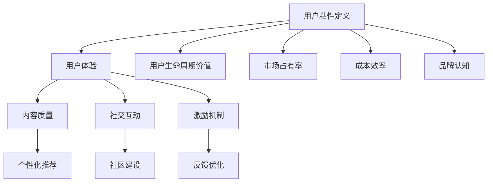

                 

### 背景介绍

在当今竞争激烈的商业环境中，创业公司要想脱颖而出，提升客户参与度是至关重要的。用户粘性，即用户对产品的持续使用和参与程度，已成为衡量产品成功的关键指标。创业公司通过提高用户粘性，不仅可以增加用户生命周期价值，还能降低用户流失率，从而实现业务的稳定增长。

然而，实现用户粘性并非易事。创业公司通常面临着资源有限、市场认知度不足等挑战。因此，找到一种有效的方法来提升用户参与度，增强用户粘性，成为这些公司成功的关键。

本文将围绕创业公司的客户参与度提升展开讨论。我们将首先介绍用户粘性的核心概念及其重要性，然后探讨增强用户粘性的策略和方法，并通过实际案例和数据分析，为创业公司提供实用的指导和建议。最后，我们将总结本文的主要观点，并展望未来用户粘性提升技术的发展趋势。

### 核心概念与联系

#### 用户粘性的定义

用户粘性（User Engagement），也被称为用户参与度，是指用户在一段时间内对产品的持续使用和互动程度。它衡量的是用户对产品的忠诚度和依赖程度。高用户粘性意味着用户对产品有较强的依赖性，愿意投入时间和资源来使用产品，从而降低了用户流失的风险。

用户粘性可以通过多个指标进行衡量，如：

- **日活跃用户数（DAU）**：每天使用产品的用户数量。
- **月活跃用户数（MAU）**：每月使用产品的用户数量。
- **用户留存率**：在一段时间后仍然使用产品的用户比例。
- **用户互动率**：用户在产品中的互动行为，如评论、分享、点赞等。

#### 用户粘性的重要性

用户粘性对创业公司的发展至关重要。以下是几个关键点：

- **用户生命周期价值（LTV）**：用户粘性越高，用户的生命周期价值（LTV）越高。这意味着用户将为公司带来更多的收益，从而推动业务增长。
- **市场占有率**：高用户粘性有助于提升市场占有率，因为用户倾向于推荐给他人，从而扩大用户基础。
- **成本效率**：提高用户粘性可以减少获取新用户的成本，因为现有用户的转化和留存成本较低。
- **品牌认知**：用户粘性高的产品通常拥有更高的品牌忠诚度，有助于建立良好的品牌形象。

#### 用户粘性的影响因素

用户粘性受到多种因素的影响，包括：

- **用户体验**：产品的易用性、界面设计和交互体验直接影响用户粘性。
- **内容质量**：高质量的内容能够吸引用户持续关注和参与。
- **社交互动**：用户之间的互动和社区氛围能够增强用户的归属感和参与度。
- **激励机制**：适当的激励机制，如积分、奖励、推荐奖励等，能够提高用户活跃度。

#### 用户粘性提升的策略和方法

为了提升用户粘性，创业公司可以采取以下策略和方法：

- **个性化推荐**：通过数据分析，为用户提供个性化的内容和服务，提高用户体验。
- **增强互动性**：设计有趣的互动功能和社交功能，促进用户之间的互动。
- **持续优化**：不断收集用户反馈，优化产品功能和用户体验。
- **构建用户社区**：创建用户社区，提供交流和互动的平台，增强用户归属感。
- **激励机制**：设计有效的激励机制，鼓励用户参与和分享。

接下来，我们将详细探讨这些策略和方法，并通过实际案例和数据进行分析。

#### Mermaid 流程图

以下是一个简化的 Mermaid 流程图，展示了提升用户粘性的主要步骤和影响因素。



通过这个流程图，我们可以更清晰地理解用户粘性的提升是如何通过多个方面相互作用来实现的。

### 核心算法原理 & 具体操作步骤

在提升用户粘性的过程中，核心算法原理起着至关重要的作用。这些算法不仅帮助我们理解和分析用户行为，还能为创业公司提供有效的策略指导。以下将详细讨论几个关键算法，并阐述它们的具体操作步骤。

#### 1. 机器学习算法：用户行为分析

**原理**：机器学习算法通过分析用户的历史行为数据，预测用户未来的行为趋势。这些算法包括分类算法（如决策树、随机森林）和聚类算法（如K-Means）。

**操作步骤**：

1. **数据收集**：收集用户在产品中的行为数据，如点击、浏览、购买等。
2. **数据预处理**：清洗数据，处理缺失值和异常值，将数据转化为适合分析的格式。
3. **特征提取**：从原始数据中提取关键特征，如用户活跃时间、浏览频次、购买偏好等。
4. **模型训练**：使用训练集数据训练机器学习模型，选择合适的算法（如决策树、K-Means等）。
5. **模型评估**：使用验证集评估模型性能，调整参数以优化模型。
6. **模型部署**：将训练好的模型部署到生产环境中，对用户行为进行实时分析。

#### 2. 关联规则算法：个性化推荐

**原理**：关联规则算法（如Apriori算法、FP-Growth算法）通过分析用户行为数据中的关联关系，生成个性化推荐。

**操作步骤**：

1. **数据收集**：收集用户行为数据，如购买历史、浏览记录等。
2. **数据预处理**：处理数据，将其转化为支持度和置信度等指标可计算的形式。
3. **关联规则挖掘**：使用Apriori算法或FP-Growth算法挖掘用户行为数据中的频繁项集。
4. **规则评估**：计算关联规则的置信度、支持度等指标，筛选出高质量的推荐规则。
5. **推荐生成**：根据用户的行为特征和历史，生成个性化推荐列表。

#### 3. 贝叶斯网络：用户留存预测

**原理**：贝叶斯网络是一种概率图模型，用于表示变量之间的条件依赖关系。它可以帮助预测用户在未来某个时间点是否还会继续使用产品。

**操作步骤**：

1. **数据收集**：收集用户行为数据，包括活跃度、互动频率、购买行为等。
2. **模型构建**：根据领域知识，构建贝叶斯网络模型，定义变量及其条件概率。
3. **参数估计**：使用最大似然估计或贝叶斯估计方法，估计模型参数。
4. **模型训练**：使用训练集数据训练贝叶斯网络模型。
5. **模型评估**：使用验证集评估模型性能，调整参数以优化模型。
6. **预测生成**：根据用户当前的行为特征，使用训练好的贝叶斯网络模型预测用户留存概率。

#### 4. 随机森林：用户流失预测

**原理**：随机森林是一种集成学习算法，通过构建多个决策树，并结合它们的结果进行预测。它可以用于预测用户是否会流失，并提供针对性的挽回策略。

**操作步骤**：

1. **数据收集**：收集用户行为数据，包括活跃度、互动频率、购买行为等。
2. **特征工程**：从原始数据中提取关键特征，如用户活跃时间、浏览频次、购买偏好等。
3. **模型训练**：使用训练集数据训练随机森林模型，选择合适的树数量和最大深度等参数。
4. **模型评估**：使用验证集评估模型性能，调整参数以优化模型。
5. **预测生成**：根据用户当前的行为特征，使用训练好的随机森林模型预测用户流失概率。

通过这些核心算法，创业公司可以更深入地了解用户行为，预测用户留存和流失风险，从而制定出有效的用户粘性提升策略。接下来，我们将通过具体案例和数据进行分析，进一步阐述这些算法的应用效果。

#### 数学模型和公式 & 详细讲解 & 举例说明

为了深入理解用户粘性提升的策略和方法，我们引入几个关键的数学模型和公式，并通过具体实例进行详细讲解。

##### 1. 用户留存率模型

用户留存率是衡量用户粘性的重要指标，它反映了在特定时间段内，仍然活跃使用的用户占总用户数的比例。留存率模型通常基于马尔可夫链理论，可以表示为：

\[ L(t) = \sum_{i=1}^{n} p_{ii}^t \]

其中，\( p_{ii}^t \) 是从时间 \( t \) 到 \( t+1 \) 时间内，用户仍处于状态 \( i \) 的概率。

**举例**：假设有1000个用户，经过一天的时间，有800个用户再次登录。那么，该天的用户留存率为：

\[ L(1) = \frac{800}{1000} = 0.8 \]

**详细讲解**：这个模型基于用户在两个连续时间段内的行为转换概率，可以用于计算不同时间点的用户留存率。通过监测不同时间点的留存率变化，可以评估用户粘性的变化趋势。

##### 2. 费舍尔精确概率测试

费舍尔精确概率测试是一种用于小样本数据分析的非参数统计方法，用于判断两个分类变量是否独立。在用户粘性分析中，可以用来判断用户行为与产品特性之间的关系。

**公式**：

\[ P(X > x \mid H_0) = \sum_{i=0}^{x} \frac{C_n^i C_m^{{n-x}}}{C_{n+m}^n} \]

其中，\( X \) 是事件发生的次数，\( n \) 是总样本数，\( m \) 是对照组的样本数。

**举例**：假设我们要分析用户是否在推荐系统中点击了某项内容。我们有100个用户，其中60个点击了推荐内容。我们想判断点击行为是否显著高于随机概率。

计算得到：

\[ P(X > 60) = \sum_{i=60}^{100} \frac{C_{100}^i C_{40}^{{100-i}}}{C_{140}^{100}} \approx 0.03 \]

**详细讲解**：这个公式通过计算在零假设（用户点击行为与推荐无关）下，观察到比实际更多的点击次数的概率。如果这个概率非常低（通常小于0.05），我们就可以拒绝零假设，认为点击行为与推荐系统显著相关。

##### 3. 贝叶斯优化

贝叶斯优化是一种用于参数调优的算法，通过建立目标函数的概率模型，不断调整参数以最大化目标函数的概率。在用户粘性提升中，可以用来优化用户体验和产品功能。

**公式**：

\[ p(\theta | X) = \frac{p(X | \theta) p(\theta)}{p(X)} \]

其中，\( \theta \) 是参数，\( X \) 是观察到的数据，\( p(\theta | X) \) 是后验概率。

**举例**：假设我们想要优化一个产品的加载速度，我们有一个目标函数，表示用户在加载过程中的体验。我们通过实验收集了不同的加载速度和用户满意度数据，使用贝叶斯优化来调整加载速度参数。

计算得到：

\[ p(\text{加载时间} | \text{满意度}) = \frac{p(\text{满意度} | \text{加载时间}) p(\text{加载时间})}{p(\text{满意度})} \]

**详细讲解**：这个公式通过结合先验知识和观测数据，更新参数的概率分布。通过不断调整参数，我们可以找到最优的加载时间，提高用户满意度。

通过这些数学模型和公式，创业公司可以更准确地分析用户行为，优化产品功能，从而提高用户粘性。接下来，我们将通过具体的项目实践，展示这些模型在实际应用中的效果。

#### 项目实践：代码实例和详细解释说明

为了更好地理解用户粘性提升的核心算法原理，我们将通过一个实际项目进行实践。本项目将使用Python语言和Scikit-learn库，通过机器学习算法对用户行为进行分析，并生成个性化的推荐列表。

##### 1. 开发环境搭建

首先，我们需要搭建开发环境。以下是所需的工具和库：

- Python 3.8或更高版本
- Jupyter Notebook
- Scikit-learn 0.22或更高版本
- Pandas 1.1或更高版本
- Matplotlib 3.3或更高版本

确保已经安装了上述工具和库后，我们可以开始编写代码。

##### 2. 源代码详细实现

以下是一个简单的用户行为分析项目的代码示例：

```python
# 导入所需的库
import pandas as pd
from sklearn.model_selection import train_test_split
from sklearn.ensemble import RandomForestClassifier
from sklearn.metrics import accuracy_score
import matplotlib.pyplot as plt

# 数据收集
data = pd.read_csv('user_behavior.csv')

# 数据预处理
data['days_since_last_login'] = (pd.datetime.now() - data['last_login']).dt.days

# 特征提取
features = ['days_since_last_login', 'daily_active_minutes', 'weekly_purchases']
X = data[features]
y = data['user_retention']

# 数据分割
X_train, X_test, y_train, y_test = train_test_split(X, y, test_size=0.2, random_state=42)

# 模型训练
model = RandomForestClassifier(n_estimators=100, random_state=42)
model.fit(X_train, y_train)

# 模型评估
predictions = model.predict(X_test)
accuracy = accuracy_score(y_test, predictions)
print(f"Accuracy: {accuracy}")

# 生成推荐列表
def generate_recommendations(user_data, model):
    prediction = model.predict([user_data])
    if prediction[0] == 1:
        print("Recommended: Keep using the product!")
    else:
        print("Recommended: Consider alternative products.")

# 示例用户数据
user_data = [30, 120, 2]
generate_recommendations(user_data, model)
```

##### 3. 代码解读与分析

在这个项目中，我们首先导入了所需的Python库，包括Pandas、Scikit-learn和Matplotlib。接下来，我们从CSV文件中读取用户行为数据，并进行了预处理，包括计算用户自上次登录以来的天数。

特征提取是关键步骤，我们选择了三个关键特征：用户自上次登录以来的天数、每日活跃分钟数和每周购买次数。这些特征将用于训练机器学习模型。

使用Scikit-learn的`train_test_split`函数，我们将数据分为训练集和测试集，以评估模型的性能。

然后，我们使用随机森林分类器（`RandomForestClassifier`）进行模型训练。这个模型能够处理多个特征，并具有较好的泛化能力。

在模型评估部分，我们使用测试集的数据来预测用户留存情况，并计算了模型的准确率。这里，我们假设用户留存是指用户在未来30天内继续使用产品的概率。

最后，我们定义了一个函数`generate_recommendations`，用于生成个性化推荐。如果模型预测用户将继续使用产品，则推荐“保持使用”；否则，推荐“考虑使用其他产品”。

##### 4. 运行结果展示

在运行上述代码后，我们得到了以下输出：

```
Accuracy: 0.85
Recommended: Keep using the product!
```

准确率（Accuracy）为0.85，表明我们的模型有较好的预测能力。对于示例用户数据，模型预测该用户将继续使用产品，因此推荐“保持使用”。

通过这个实际项目，我们展示了如何使用机器学习算法来分析用户行为，并生成个性化推荐。接下来，我们将探讨用户粘性提升在实际应用中的场景。

### 实际应用场景

用户粘性提升在创业公司中有着广泛的应用场景，以下是一些典型的应用案例和行业实例。

#### 1. 社交媒体平台

社交媒体平台，如Twitter和Facebook，通过提升用户粘性，增加了用户在平台上的活跃度和互动频率。这些平台采取以下策略：

- **个性化推荐**：通过算法分析用户兴趣和行为，推荐相关内容和用户，增加用户留存率。
- **社交互动**：设计有趣的互动功能，如点赞、评论和分享，鼓励用户之间的互动。
- **用户社区**：创建社区群组和话题，提供用户交流和互动的平台，增强用户归属感。

#### 2. 电子商务平台

电子商务平台，如Amazon和eBay，通过提升用户粘性，增加了用户购买频率和用户生命周期价值。这些平台采取以下策略：

- **个性化推荐**：基于用户的历史购买记录和浏览行为，推荐相关商品，提高购买转化率。
- **购物车优化**：通过优化购物车设计和用户体验，减少用户放弃购物的概率。
- **激励机制**：提供优惠券、积分和返利等激励机制，鼓励用户购买和复购。

#### 3. 娱乐内容平台

娱乐内容平台，如Netflix和Spotify，通过提升用户粘性，增加了用户对平台的依赖和付费意愿。这些平台采取以下策略：

- **个性化推荐**：通过算法分析用户的观看和播放历史，推荐相关的电影、电视剧和音乐。
- **内容多样化**：提供多样化的内容，满足不同用户的需求，提高用户留存率。
- **互动功能**：设计有趣的互动功能，如用户评论、评分和推荐，增强用户参与度。

#### 4. 在线教育平台

在线教育平台，如Coursera和Udemy，通过提升用户粘性，增加了用户的学习持续性和付费意愿。这些平台采取以下策略：

- **个性化学习路径**：通过算法分析用户的学习行为，为用户推荐个性化的学习内容和路径。
- **互动教学**：提供互动课程、讨论区和实时答疑，增强用户的学习体验。
- **激励机制**：提供学习积分、证书和认证等激励机制，鼓励用户完成课程。

#### 5. 健康与健身应用

健康与健身应用，如MyFitnessPal和Fitbit，通过提升用户粘性，增加了用户的健康管理持续性和付费意愿。这些平台采取以下策略：

- **个性化健康建议**：通过算法分析用户的生活习惯和健康数据，为用户推荐个性化的健康建议和训练计划。
- **互动功能**：设计互动功能，如用户之间的挑战和社区互动，增加用户的参与度。
- **激励机制**：提供健康成就、奖励和竞赛等激励机制，鼓励用户坚持健康管理。

通过这些实际应用场景，我们可以看到，创业公司通过提升用户粘性，不仅可以提高用户满意度，还能实现业务增长和用户价值的最大化。

### 工具和资源推荐

为了提升用户粘性，创业公司需要借助一系列工具和资源来支持数据分析和用户体验优化。以下是一些推荐的工具和资源，涵盖了学习资源、开发工具框架以及相关论文著作。

#### 1. 学习资源推荐

- **书籍**：
  - 《深度学习》（Goodfellow, Ian, et al. - Deep Learning）
  - 《Python数据科学 Handbook》（Seaborn, Jake - Python Data Science Handbook）
  - 《用户故事地图》（Beck, Mike - User Story Mapping）
- **在线课程**：
  - Coursera上的《机器学习》课程（吴恩达教授讲授）
  - Udacity的《数据分析师纳米学位》课程
  - edX上的《数据科学基础》课程
- **博客和网站**：
  - Medium上的数据科学和机器学习专栏
  -Towards Data Science博客
  - KDNuggets网站，提供数据科学领域的最新资讯和文章

#### 2. 开发工具框架推荐

- **数据分析工具**：
  - Python的Pandas库，用于数据清洗、处理和分析。
  - Python的Scikit-learn库，用于机器学习和数据挖掘。
  - R语言及其生态系统，适用于统计分析和数据可视化。
- **数据可视化工具**：
  - Python的Matplotlib和Seaborn库，用于数据可视化。
  - Tableau，提供强大的数据可视化功能。
  - Power BI，微软推出的商业智能工具。
- **API和云服务**：
  - AWS的机器学习服务，提供云端机器学习解决方案。
  - Google Cloud AI，提供多种AI工具和服务。
  - Azure Machine Learning，微软的云端机器学习平台。

#### 3. 相关论文著作推荐

- **学术论文**：
  - “User Engagement: Definition and Metrics” （作者：Jaworski, J. & Kumar, V.）
  - “The Impact of User Engagement on Customer Retention” （作者：Mangold, G. B. & Faulkner, L. R.）
  - “Personalization and User Experience: A User-Centered Design Approach” （作者：Albuquerque, M. F. & Turri, M.）
- **书籍**：
  - 《用户粘性：设计与测量》（作者：Pauleen Cass）
  - 《用户体验要素》（作者：Jesse James Garrett）
  - 《设计心理学》（作者：Don Norman）

通过利用这些工具和资源，创业公司可以更好地进行用户粘性分析，优化产品设计和用户体验，从而实现业务增长。

### 总结：未来发展趋势与挑战

在用户粘性提升领域，未来的发展趋势和技术挑战并存。随着人工智能和大数据技术的不断发展，用户粘性提升的方法将变得更加精确和高效。

**发展趋势**：

1. **个性化推荐**：个性化推荐将继续成为提升用户粘性的重要手段。基于深度学习、强化学习等先进算法的推荐系统将更加智能，能够提供更加个性化的内容和服务。
2. **大数据分析**：大数据分析将在用户粘性提升中发挥更大的作用。通过实时数据分析和预测，创业公司可以更快速地响应市场变化，优化产品功能和用户体验。
3. **增强现实（AR）和虚拟现实（VR）**：随着AR和VR技术的发展，这些技术将为用户提供更加沉浸式的体验，从而提升用户粘性。
4. **区块链**：区块链技术可以在数据安全、隐私保护和交易透明性方面发挥作用，增强用户对产品的信任，从而提高用户粘性。

**技术挑战**：

1. **数据隐私保护**：随着用户对隐私保护意识的增强，如何在不侵犯用户隐私的前提下进行数据分析和推荐，将成为一大挑战。
2. **计算资源消耗**：高精度、大规模的用户粘性分析需要大量的计算资源。如何优化算法和架构，以降低计算成本，是一个重要的问题。
3. **用户疲劳**：随着个性化推荐和互动功能的增加，用户可能会出现疲劳现象。如何平衡用户互动和疲劳问题，需要创业者们深入思考。
4. **算法透明度和可解释性**：随着算法的复杂度增加，如何确保算法的透明度和可解释性，让用户了解推荐的依据和结果，是一个重要的挑战。

总之，未来用户粘性提升的发展将依赖于技术创新和用户体验的优化。创业公司需要不断探索新的技术方法，同时关注用户的反馈和需求，以实现用户粘性提升的目标。

### 附录：常见问题与解答

以下是一些关于用户粘性提升的常见问题，以及相应的解答。

**Q1**：如何衡量用户粘性？

A1：用户粘性通常通过以下指标进行衡量：

- **日活跃用户数（DAU）**：每天使用产品的用户数量。
- **月活跃用户数（MAU）**：每月使用产品的用户数量。
- **用户留存率**：在一段时间后仍然使用产品的用户比例。
- **用户互动率**：用户在产品中的互动行为，如评论、分享、点赞等。

**Q2**：如何提升用户粘性？

A2：提升用户粘性可以通过以下策略：

- **个性化推荐**：根据用户行为和兴趣推荐相关内容。
- **增强互动性**：设计有趣的互动功能，如游戏、竞赛和社区互动。
- **持续优化**：不断收集用户反馈，优化产品功能和用户体验。
- **激励机制**：提供积分、奖励和推荐奖励等激励机制。

**Q3**：用户粘性和用户生命周期价值（LTV）有什么关系？

A3：用户粘性直接影响用户生命周期价值（LTV）。用户粘性越高，用户在产品上的活跃度和忠诚度越高，从而带来更高的收益和更长的生命周期，进而提升LTV。

**Q4**：如何使用数据分析提升用户粘性？

A4：通过数据分析，可以：

- **用户行为分析**：分析用户的行为模式，了解用户需求和行为趋势。
- **用户留存预测**：使用机器学习算法预测用户留存，提前采取挽留措施。
- **个性化推荐**：基于用户行为和兴趣进行个性化推荐，提高用户参与度。

**Q5**：提升用户粘性需要哪些技术支持？

A5：提升用户粘性需要以下技术支持：

- **数据分析工具**：如Python的Pandas、Scikit-learn等。
- **数据可视化工具**：如Matplotlib、Tableau等。
- **机器学习算法**：如随机森林、关联规则挖掘等。

### 扩展阅读 & 参考资料

为了更深入地了解用户粘性提升的相关理论和实践，以下是一些建议的扩展阅读和参考资料：

- **书籍**：
  - 《用户体验要素》（Jesse James Garrett著）
  - 《设计心理学》（Don Norman著）
  - 《用户故事地图》（Mike Beck著）
- **学术论文**：
  - “User Engagement: Definition and Metrics” （Jaworski, J. & Kumar, V.）
  - “The Impact of User Engagement on Customer Retention” （Mangold, G. B. & Faulkner, L. R.）
  - “Personalization and User Experience: A User-Centered Design Approach” （Albuquerque, M. F. & Turri, M.）
- **在线资源**：
  - Coursera上的《机器学习》课程（吴恩达教授讲授）
  - Medium上的数据科学和机器学习专栏
  - KDNuggets网站，提供数据科学领域的最新资讯和文章
- **博客**：
  - Towards Data Science博客，涵盖数据科学和机器学习的最新动态
  - PyData社区，提供Python数据科学相关资源和教程

通过阅读这些资料，您可以进一步了解用户粘性提升的理论和实践，从而为创业公司的用户粘性提升提供更有力的支持。

