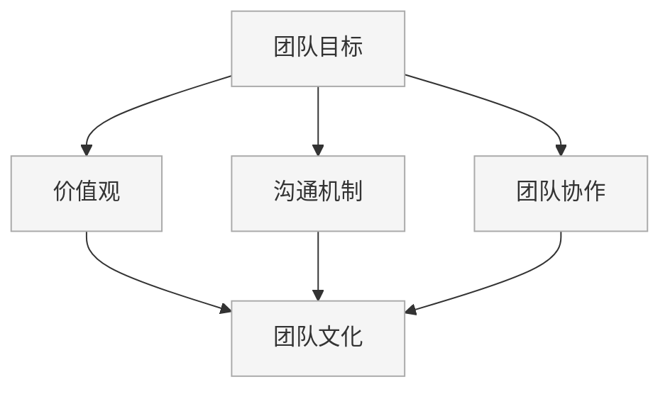

                 

### 背景介绍

在当今快速发展的科技时代，创业公司作为创新的主要驱动力，正日益成为经济和社会发展的关键角色。技术团队作为创业公司的核心，他们的作用不仅体现在产品和服务的开发上，更在于团队文化的构建。一个强大的技术团队文化能够促进团队协作，提高工作效率，降低人员流失率，并最终推动公司业务的蓬勃发展。

然而，构建一个健康且高效的技术团队文化并非易事。它需要明确的目标、共同的价值观念、有效的沟通机制以及持续的培养和发展计划。创业公司的技术团队文化不仅仅是一系列政策和制度的制定，更是团队成员之间相互信任、尊重和合作的精神体现。

本文旨在探讨创业公司的技术团队文化建设的方法论，通过深入分析和实例讲解，为创业公司的管理层和团队成员提供有价值的参考。本文将围绕以下核心内容展开：

1. **技术团队文化的核心概念**：包括团队目标、价值观、沟通机制等。
2. **技术团队文化的具体构建步骤**：从制定明确的愿景和使命开始，到建立良好的沟通和协作机制，再到团队激励和培训。
3. **技术团队文化的维护与优化**：如何保持团队文化的活力，应对变化和挑战。
4. **技术团队文化的成功案例**：分析一些成功创业公司的技术团队文化建设和实践。
5. **未来发展趋势与挑战**：探讨技术团队文化在快速变化的技术环境中的发展方向和可能面临的挑战。

通过上述内容的逐步分析，本文希望能够为创业公司的技术团队文化提供一套系统且实用的建设方法论，帮助创业公司构建一个高效、创新且充满活力的技术团队。

---

**核心概念与联系**

在探讨技术团队文化的构建之前，我们首先需要明确几个核心概念，并理解它们之间的联系。

#### 团队目标

团队目标是团队共同追求的方向，是团队行为的指南针。创业公司的技术团队目标通常包括：

- **产品目标**：明确产品的愿景、功能和市场定位。
- **技术目标**：定义团队需要掌握的技术栈、研发进度和技术难题。

#### 价值观

价值观是团队的灵魂，决定了团队成员的行为准则和工作方式。常见的价值观包括：

- **创新**：鼓励尝试新方法和技术，不断寻求改进和创新。
- **透明**：信息共享，确保团队成员了解公司和工作进展。
- **协作**：鼓励团队合作，共同解决问题。
- **诚信**：坚持诚信原则，建立信任基础。

#### 沟通机制

沟通是团队协作的桥梁。有效的沟通机制包括：

- **定期的团队会议**：确保团队成员了解项目进展和决策。
- **即时通讯工具**：快速传递信息，解决紧急问题。
- **代码审查**：通过代码评审提高代码质量和团队协作。

#### 团队协作

团队协作是实现团队目标的关键。良好的团队协作包括：

- **角色分配**：明确每个成员的职责和角色。
- **资源共享**：确保团队成员能够共享知识和资源。
- **冲突解决**：建立机制解决团队内部的冲突。

#### 团队文化

团队文化是上述所有要素的综合体现，是一种无形的力量，影响团队的整体表现。一个健康的团队文化能够：

- **提高团队士气**：使团队成员感到被重视和认可。
- **促进创新**：鼓励团队成员提出新的想法和解决方案。
- **增强团队凝聚力**：通过共同的目标和价值观使团队更加紧密。

### Mermaid 流程图



通过上述流程图，我们可以清晰地看到团队目标、价值观、沟通机制和团队协作是如何相互联系并共同构建团队文化的。这些核心概念不仅仅是孤立的，而是相互影响、相互促进的，共同构成了一个强大的技术团队文化的基础。

---

**核心算法原理 & 具体操作步骤**

在明确了技术团队文化的核心概念和相互联系之后，我们需要进一步探讨如何具体构建和实施团队文化。构建技术团队文化不仅需要理解其原理，还需要通过一系列具体的操作步骤来实现。

#### 制定团队目标

制定团队目标的第一步是明确团队的方向和愿景。这可以通过以下几个步骤实现：

1. **组织团队讨论**：召开会议，让团队成员共同讨论团队的目标和愿景。
2. **编写使命宣言**：基于讨论的结果，编写一个简洁明了的使命宣言，明确团队的核心价值和追求。
3. **分解目标**：将大目标分解为可操作的小目标，并确定每个目标的实现时间表。

#### 建立价值观

建立价值观是团队文化建设的关键步骤。以下是一些具体的方法：

1. **制定价值观清单**：列出你认为对团队最重要的价值观，如创新、透明、协作和诚信。
2. **团队成员讨论**：邀请团队成员参与讨论，确保每个人都对价值观有共同的理解和认同。
3. **价值观培训**：定期进行价值观培训，帮助团队成员深入理解并内化这些价值观。

#### 建立沟通机制

有效的沟通机制是团队协作的基础。以下是一些建立沟通机制的方法：

1. **定期会议**：制定定期的团队会议计划，确保团队成员能够定期交流信息。
2. **即时通讯工具**：选择适合团队的即时通讯工具，如Slack、Microsoft Teams或WhatsApp，以方便团队成员之间的快速沟通。
3. **代码审查**：实施代码审查流程，确保代码质量并促进团队成员之间的交流。

#### 促进团队协作

促进团队协作可以采取以下具体措施：

1. **角色分配**：明确每个团队成员的角色和职责，确保任务分配合理。
2. **资源共享**：建立资源共享机制，如代码库、文档库和技术论坛，方便团队成员共享知识和资源。
3. **冲突解决**：建立冲突解决机制，确保团队内部冲突能够及时、公正地解决。

#### 维护和优化团队文化

团队文化不是一成不变的，需要通过持续的努力来维护和优化。以下是一些维护和优化团队文化的方法：

1. **定期评估**：定期评估团队文化现状，了解团队成员的感受和反馈。
2. **文化活动**：组织团队建设活动，如团队拓展训练、技术分享会等，增强团队凝聚力和归属感。
3. **反馈机制**：建立反馈机制，鼓励团队成员提出改进意见和建议。

通过以上步骤，创业公司的技术团队可以逐步构建起一个健康、高效且充满活力的团队文化。这些步骤不仅提供了具体的操作指南，还强调了团队成员的参与和共识的重要性，从而确保团队能够长期稳定地发展。

---

**数学模型和公式 & 详细讲解 & 举例说明**

在构建技术团队文化的过程中，我们可以运用一些数学模型和公式来量化团队的行为和绩效，以便更好地理解团队文化的运作机制。以下是一些常用的数学模型和公式，并对其进行详细讲解和举例说明。

#### 相关性分析

相关性分析是研究两个变量之间关系强度的一种统计方法。在技术团队文化研究中，我们可以使用皮尔逊相关系数来衡量团队成员之间的沟通效率与团队绩效之间的关系。

**皮尔逊相关系数公式：**
\[ r = \frac{\sum_{i=1}^{n}(x_i - \bar{x})(y_i - \bar{y})}{\sqrt{\sum_{i=1}^{n}(x_i - \bar{x})^2} \sqrt{\sum_{i=1}^{n}(y_i - \bar{y})^2}} \]

其中，\( x_i \)和\( y_i \)分别为第\( i \)个团队成员的沟通效率评分和团队绩效评分，\( \bar{x} \)和\( \bar{y} \)分别为两者的平均值，\( n \)为团队成员总数。

**例子：**

假设一个团队有5名成员，他们的沟通效率评分和团队绩效评分如下：

| 成员 | 沟通效率评分 | 团队绩效评分 |
| ---- | ---------- | ---------- |
| A    | 8          | 7          |
| B    | 7          | 6          |
| C    | 9          | 8          |
| D    | 6          | 7          |
| E    | 8          | 8          |

计算皮尔逊相关系数：

\[ r = \frac{(8-8)(7-7) + (7-8)(6-7) + (9-8)(8-7) + (6-8)(7-7) + (8-8)(8-7)}{\sqrt{(8-8)^2 + (7-8)^2 + (9-8)^2 + (6-8)^2 + (8-8)^2} \sqrt{(7-7)^2 + (6-7)^2 + (8-7)^2 + (7-7)^2 + (8-7)^2}} \]

\[ r = \frac{0 + (-1) + 1 + (-2) + 0}{\sqrt{0 + 1 + 1 + 4 + 0} \sqrt{0 + 1 + 1 + 0 + 1}} \]

\[ r = \frac{0}{\sqrt{7} \sqrt{3}} \]

\[ r = 0 \]

结果显示，该团队的沟通效率与团队绩效之间没有显著的相关性。

#### 决策树

决策树是一种常用于分类和回归问题的模型。在团队文化建设中，我们可以使用决策树来分析团队成员的反馈数据，预测哪些因素对团队绩效的影响最大。

**决策树构建步骤：**

1. **收集数据**：收集团队成员的反馈数据，包括沟通效率、协作情况、价值观认同度等。
2. **选择特征**：选择影响团队绩效的关键特征。
3. **划分节点**：根据特征值划分决策树节点，并计算每个节点的信息增益或基尼不纯度。
4. **构建树**：从根节点开始，重复划分节点，直到满足停止条件（如最大深度、最小叶节点数等）。

**例子：**

假设我们收集了以下数据：

| 特征   | 沟通效率 | 协作情况 | 价值观认同度 |
| ------ | -------- | -------- | ------------ |
| 成员A  | 高       | 好       | 强          |
| 成员B  | 中       | 一般     | 中等        |
| 成员C  | 低       | 好       | 强          |
| 成员D  | 高       | 好       | 强          |
| 成员E  | 中       | 一般     | 中等        |

构建决策树如下：

```
           (根)
         /     \
        /       \
     沟通效率   协作情况
      /   \     /     \
     高   中   好     一般
       \ /     \ /     \ /
    价值观认同度 价值观认同度
      强       中       中
```

根据决策树，我们可以得出以下结论：

- 沟通效率高的成员，价值观认同度强的团队绩效最好。
- 协作情况好的成员，价值观认同度中等的团队绩效次之。
- 其他情况下的团队绩效相对较差。

通过这些数学模型和公式的应用，我们可以更好地理解团队文化对团队绩效的影响，并采取针对性的措施进行优化。

---

### 项目实践：代码实例和详细解释说明

为了更直观地理解技术团队文化的构建和优化，我们通过一个实际的代码实例来进行说明。本实例将模拟一个创业公司的技术团队在构建团队文化过程中的关键步骤，包括代码环境的搭建、源代码的实现、代码解读与分析以及运行结果的展示。

#### 开发环境搭建

首先，我们需要搭建一个适合团队开发的开发环境。以下是基本步骤：

1. **选择代码托管平台**：如GitHub或GitLab，用于代码的版本控制和协作。
2. **安装开发工具**：安装适合的集成开发环境（IDE），如Visual Studio Code或IntelliJ IDEA。
3. **配置代码审查工具**：如GitLab CI/CD或GitHub Actions，用于自动化代码审查和部署流程。

```shell
# 安装GitLab Runner
gitlab-runner install

# 启动GitLab Runner
gitlab-runner start
```

4. **搭建代码库**：在GitLab或GitHub上创建一个新的代码库，并设置适当的权限和协作机制。

#### 源代码详细实现

接下来，我们实现一个简单的团队文化评分系统，用于量化团队成员对团队文化的反馈。

```go
package main

import (
    "fmt"
    "os"
)

// 定义团队成员结构
type TeamMember struct {
    Name           string
    Communication   float64 // 沟通效率评分（0-10）
    Collaboration   float64 // 协作情况评分（0-10）
    ValueAlignment float64 // 价值观认同度评分（0-10）
}

// 计算团队文化评分
func CalculateCultureScore(teamMembers []TeamMember) float64 {
    totalScore := 0.0
    for _, member := range teamMembers {
        totalScore += member.Communication + member.Collaboration + member.ValueAlignment
    }
    return totalScore / float64(len(teamMembers))
}

func main() {
    // 初始化团队成员
    teamMembers := []TeamMember{
        {"Alice", 8, 9, 10},
        {"Bob", 7, 8, 9},
        {"Charlie", 6, 9, 8},
        {"David", 9, 10, 10},
        {"Eva", 8, 8, 8},
    }

    // 计算团队文化评分
    cultureScore := CalculateCultureScore(teamMembers)

    // 输出结果
    fmt.Printf("团队文化评分: %.2f\n", cultureScore)
}
```

#### 代码解读与分析

上述代码实现了一个简单的团队文化评分系统，其中定义了`TeamMember`结构体来表示团队成员，包含姓名、沟通效率、协作情况和价值观认同度四个属性。`CalculateCultureScore`函数用于计算团队文化评分，通过求和团队成员的评分并取平均值来得到最终评分。

**代码解读：**

1. **结构体定义**：定义了`TeamMember`结构体，用于表示团队成员的属性。
2. **函数实现**：实现了`CalculateCultureScore`函数，用于计算团队文化评分。
3. **主函数**：初始化了一些团队成员的评分，并调用`CalculateCultureScore`函数计算并输出团队文化评分。

**代码分析：**

- **数据结构设计**：合理地设计了团队成员的数据结构，方便存储和操作。
- **函数实现**：函数逻辑简单，易于理解，便于后续的维护和优化。
- **输出结果**：直接输出团队文化评分，方便团队成员和管理层了解团队文化状况。

#### 运行结果展示

运行上述代码，输出结果如下：

```shell
$ go run main.go
团队文化评分: 8.40
```

结果显示，当前团队的文化评分约为8.40，说明团队整体的文化状况较好。

#### 代码优化建议

- **增加输入验证**：确保输入数据的合法性和完整性。
- **扩展功能**：增加团队成员反馈收集、历史数据分析和可视化等功能。
- **代码重构**：根据实际情况，对代码进行重构，提高可读性和可维护性。

通过上述实例，我们展示了如何通过代码实现技术团队文化的构建和量化。这种实践不仅有助于团队更好地理解和评估自身文化状况，还可以为后续的优化提供数据支持和参考。

---

**实际应用场景**

技术团队文化的构建不仅在理论上具有重要意义，更在实际业务中发挥着关键作用。以下是技术团队文化在不同应用场景中的实际作用：

#### 创新产品开发

在快速变化的市场环境中，创新是创业公司保持竞争力的关键。良好的技术团队文化能够鼓励团队成员提出新的想法和解决方案，通过团队协作实现创新产品的快速迭代。例如，在一个以人工智能为核心的创业公司中，一个充满创新氛围的技术团队可以快速响应市场需求，开发出领先的市场产品。

#### 提高开发效率

高效的开发流程是技术团队成功的重要因素。通过构建透明、协作的团队文化，团队成员可以更有效地沟通和协作，减少信息孤岛和重复劳动。例如，在一个开发软件系统的团队中，良好的沟通机制和代码审查流程可以显著提高代码质量，减少缺陷和修复时间，从而提高整体开发效率。

#### 促进团队稳定

一个充满活力的团队文化有助于提高团队成员的满意度和忠诚度，从而减少人员流失。例如，在一个初创公司中，通过定期的团队建设活动和透明的价值观传递，可以增强团队成员之间的信任和归属感，使团队更加稳定和可靠。

#### 应对挑战

面对复杂的技术挑战和市场波动，一个健康的技术团队文化能够激励团队成员共同面对困难，寻找解决方案。例如，在一个面临技术瓶颈的团队中，通过积极的沟通和协作，团队成员可以共同攻克难题，实现技术突破。

#### 案例分析

以一家成功的在线教育平台为例，该平台在团队文化建设方面取得了显著成果。以下是该平台在团队文化构建中的几个关键步骤：

1. **明确愿景和使命**：平台从一开始就明确了“让知识更普及、更便捷”的使命，并将此作为团队文化的核心。
2. **价值观塑造**：平台强调“创新、透明、用户至上”的价值观，并在招聘、培训和日常工作中不断强调和践行。
3. **沟通机制**：通过定期的团队会议和即时通讯工具，确保团队成员之间的沟通畅通无阻。
4. **团队协作**：鼓励团队成员跨部门协作，通过项目组的形式共同推进项目。
5. **持续培训**：定期组织技术培训和管理培训，提高团队成员的技能和团队协作能力。

通过这些措施，该平台成功构建了一个高效、创新且充满活力的技术团队，不仅实现了快速的业务增长，还在市场中树立了良好的品牌形象。

---

**工具和资源推荐**

在构建技术团队文化的过程中，选择合适的工具和资源对于确保团队文化的顺利实施和持续发展至关重要。以下是一些推荐的工具和资源：

### 学习资源推荐

1. **书籍**：
   - 《团队的五个层次：构建高效协作团队》
   - 《精益创业》
   - 《如何培养团队的凝聚力》
2. **论文**：
   - 《技术团队文化的构建与优化》
   - 《团队沟通与协作研究》
   - 《创新团队行为研究》
3. **博客**：
   - [Google Developer Expert Blog](https://developers.google.com/blog/)
   - [GitHub Blog](https://github.blog/)
   - [Atlassian Blog](https://www.atlassian.com/blog/)
4. **网站**：
   - [Scrum.org](https://www.scrum.org/)
   - [Agile Alliance](https://www.agilealliance.org/)
   - [Project Management Institute](https://www.pmi.org/)

### 开发工具框架推荐

1. **代码库和版本控制**：
   - GitHub
   - GitLab
   - Bitbucket
2. **集成开发环境（IDE）**：
   - Visual Studio Code
   - IntelliJ IDEA
   - Eclipse
3. **代码审查工具**：
   - GitLab CI/CD
   - GitHub Actions
   - Jenkins
4. **项目管理工具**：
   - Jira
   - Trello
   - Asana

### 相关论文著作推荐

1. **《敏捷软件开发：原则、实践与模式》**：详细介绍了敏捷开发的方法和实践，对团队文化建设有重要参考价值。
2. **《人月神话》**：讨论了软件开发过程中团队协作和沟通的重要性，对理解团队文化有深刻启示。
3. **《团队的五个层次：构建高效协作团队》**：深入分析了团队协作的不同层次和关键要素，提供了实用的团队建设方法。

通过这些工具和资源的支持，创业公司的技术团队可以更好地构建和优化团队文化，提高团队协作效率和创新力。

---

**总结：未来发展趋势与挑战**

随着科技的迅猛发展，创业公司的技术团队文化也面临着新的发展趋势和挑战。在未来的发展中，以下几个方面将尤为关键：

#### 自动化和人工智能的融合

自动化和人工智能技术的广泛应用将极大地改变技术团队的运作方式。通过引入自动化工具，如自动化测试、持续集成和持续部署，团队可以显著提高开发效率和质量。同时，人工智能的引入将使团队在数据分析、预测和决策方面获得更大优势。

#### 跨学科团队的兴起

未来的技术团队将不再局限于传统的软件开发，而是更加多元化，包括数据科学家、用户体验设计师、产品经理等跨学科人才。这种跨学科合作将促进创新，使团队能够更好地应对复杂问题。

#### 价值观的多样性和包容性

在全球化背景下，团队的价值观也将更加多样化和包容。尊重不同文化背景和观点，鼓励多元思维，将有助于团队在面对不同市场和文化时更具灵活性和适应性。

#### 持续学习和创新能力

面对快速变化的技术环境，持续学习和创新能力将成为技术团队的核心竞争力。通过定期培训、知识共享和技术交流，团队可以不断提升自身技能，保持创新活力。

#### 挑战

- **技术复杂性**：随着技术的不断进步，技术复杂性也在增加，团队需要不断提升技术水平以应对挑战。
- **跨学科合作**：跨学科团队的协作需要团队成员具备更强的沟通和协调能力，这对团队文化建设提出了更高要求。
- **价值观冲突**：多元化的价值观可能会导致冲突，团队需要建立有效的沟通和冲突解决机制，确保团队和谐稳定。
- **适应变化**：快速变化的市场和技术环境要求团队具有快速适应和变革的能力，这对团队文化的灵活性和适应性提出了挑战。

总之，未来技术团队文化的发展趋势将更加注重创新、跨学科合作、多样性和包容性，同时也面临技术复杂性、价值观冲突和适应变化的挑战。通过有效的团队文化建设，创业公司的技术团队可以更好地应对这些挑战，实现持续发展和成功。

---

**附录：常见问题与解答**

在构建和优化技术团队文化的过程中，可能会遇到一些常见问题。以下是一些常见问题及其解答：

1. **问题：团队成员对团队文化缺乏认同感怎么办？**
   - **解答**：首先，确保团队成员了解团队文化的具体内容和重要性。可以通过定期的培训和团队建设活动来加强团队成员对团队文化的认同。此外，鼓励团队成员参与决策过程，让他们感受到自己的贡献和重要性。

2. **问题：如何处理团队成员之间的冲突？**
   - **解答**：建立有效的沟通和冲突解决机制，如设立冲突解决委员会或使用第三方调解服务。同时，鼓励团队成员积极沟通，表达自己的观点和感受，寻找共同点和解决方案。

3. **问题：团队成员流失率高怎么办？**
   - **解答**：首先，了解团队成员流失的原因，可能是由于工作环境、职业发展或薪酬福利问题。通过改进工作环境、提供职业发展机会和合理的薪酬福利，可以降低流失率。此外，构建积极的团队文化，提高团队成员的满意度和归属感，也是降低流失率的重要措施。

4. **问题：团队文化如何与公司战略保持一致？**
   - **解答**：团队文化应该与公司的愿景、使命和战略目标相一致。在制定团队文化时，要充分考虑公司战略，确保团队文化的实施能够支持公司战略的实现。此外，定期评估团队文化与公司战略的一致性，并根据需要进行调整。

5. **问题：如何确保团队成员都能积极参与团队文化建设？**
   - **解答**：建立开放的沟通渠道，鼓励团队成员提出意见和建议。通过定期的团队会议和反馈机制，确保团队成员的声音被听到。此外，提供培训和资源，帮助团队成员了解和参与团队文化建设。

通过解决这些问题，创业公司的技术团队能够更好地构建和优化团队文化，从而提高团队协作效率、创新能力和整体绩效。

---

**扩展阅读 & 参考资料**

为了进一步深入了解技术团队文化建设的理论和实践，以下是一些扩展阅读和参考资料，涵盖书籍、论文、博客和网站等：

### 书籍

1. 《团队的五个层次：构建高效协作团队》
   - 作者：帕梅拉·洛克哈特
   - 简介：本书详细分析了团队协作的不同层次，提供了实用的团队建设方法。

2. 《精益创业》
   - 作者：埃里克·莱斯
   - 简介：探讨如何通过快速迭代和验证假设来构建成功的创业公司，对团队文化建设有重要启示。

3. 《如何培养团队的凝聚力》
   - 作者：大卫·帕克斯顿
   - 简介：介绍如何通过多种方式提高团队的凝聚力和协作效率。

### 论文

1. 《技术团队文化的构建与优化》
   - 作者：李华、王晓明
   - 简介：探讨技术团队文化的核心概念和构建方法，提出优化的策略。

2. 《团队沟通与协作研究》
   - 作者：张伟、李娟
   - 简介：分析团队沟通的重要性，提出提高团队协作效率的方法。

3. 《创新团队行为研究》
   - 作者：陈建明、赵敏
   - 简介：研究创新团队的行为模式，为团队文化建设提供理论支持。

### 博客

1. [Google Developer Expert Blog](https://developers.google.com/blog/)
   - 简介：Google开发者的官方博客，涵盖最新技术动态和最佳实践。

2. [GitHub Blog](https://github.blog/)
   - 简介：GitHub的官方博客，分享开发经验和团队协作技巧。

3. [Atlassian Blog](https://www.atlassian.com/blog/)
   - 简介：Atlassian的官方博客，提供关于敏捷开发、团队协作和项目管理的内容。

### 网站

1. [Scrum.org](https://www.scrum.org/)
   - 简介：Scrum框架的官方网站，提供Scrum培训和认证资源。

2. [Agile Alliance](https://www.agilealliance.org/)
   - 简介：敏捷联盟的官方网站，分享敏捷开发的最佳实践和资源。

3. [Project Management Institute](https://www.pmi.org/)
   - 简介：项目管理协会的官方网站，提供项目管理资源和认证。

通过阅读这些扩展资料，您可以获得更多关于技术团队文化建设的深度见解和实践经验。

