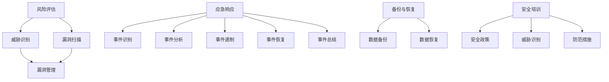

                 

### 背景介绍 Background Introduction

在当今数字化时代，技术安全已成为创业公司成功的关键因素之一。随着互联网和云计算的快速发展，创业公司面临着日益严峻的安全挑战。黑客攻击、数据泄露、系统故障等问题不仅可能导致公司声誉受损，还可能带来严重的经济损失。因此，制定一套有效的技术安全应急预案显得尤为重要。

技术安全应急预案是创业公司在面临各种技术安全事件时采取的一系列应对措施。这些措施旨在减少安全事件对公司运营的影响，确保数据安全和系统稳定性。应急预案的制定需要综合考虑公司业务特点、技术架构、安全风险等多方面因素，确保其具有针对性和实用性。

本文将围绕创业公司的技术安全应急预案进行深入探讨。首先，我们将介绍应急预案的核心概念和联系，通过一个Mermaid流程图展示其整体架构。然后，我们将详细讲解核心算法原理和具体操作步骤，解析其中涉及到的数学模型和公式。接下来，我们将通过一个实际项目实践，展示代码实例和详细解释说明，帮助读者更好地理解和应用。最后，我们将探讨应急预案在实际应用场景中的重要性，推荐相关的学习资源和开发工具，并对未来发展趋势和挑战进行展望。

通过本文的阅读，读者将全面了解创业公司技术安全应急预案的制定和实施过程，从而为公司的安全运营提供有力保障。

#### 核心概念与联系 Core Concepts and Relationships

在探讨创业公司的技术安全应急预案之前，首先需要明确其中涉及的核心概念和它们之间的关系。以下是应急预案中几个关键概念的定义及其相互联系：

1. **风险评估（Risk Assessment）**：风险评估是制定应急预案的第一步，旨在识别公司可能面临的各种安全威胁，评估其可能带来的影响和发生的概率。通过风险评估，公司可以了解自身的脆弱性，从而制定相应的防护措施。

2. **威胁识别（Threat Identification）**：威胁识别是风险评估的子过程，主要任务是发现潜在的安全威胁。这些威胁可以是外部攻击（如DDoS攻击、SQL注入等），也可以是内部威胁（如员工恶意行为、系统漏洞等）。

3. **漏洞扫描（Vulnerability Scanning）**：漏洞扫描是发现系统或网络中存在的安全漏洞的过程。通过自动化工具对网络进行扫描，可以快速识别潜在的安全隐患，从而及时进行修复。

4. **漏洞管理（Vulnerability Management）**：漏洞管理是一个持续的过程，包括漏洞的识别、评估、修复和跟踪。有效的漏洞管理可以降低安全风险，确保系统的安全性。

5. **应急响应（Incident Response）**：应急响应是在安全事件发生时采取的一系列措施，旨在快速遏制事件的发展，减少损失。应急响应包括事件识别、事件分析、事件遏制、事件恢复和事件总结等步骤。

6. **备份与恢复（Backup and Recovery）**：备份与恢复是确保数据安全的重要组成部分。定期进行数据备份，可以在数据丢失或损坏时快速恢复，减少业务中断时间。

7. **安全培训（Security Training）**：安全培训是提高员工安全意识和技能的重要手段。通过定期培训，员工可以了解公司安全政策、识别潜在威胁和防范措施，从而降低人为错误引发的安全事件。

为了更直观地展示这些概念之间的联系，我们使用Mermaid绘制一个流程图。以下是流程图的具体描述：



在上述流程图中，我们可以看到：

- 风险评估是整个流程的起点，通过识别威胁和漏洞，为后续的应急响应、备份与恢复和安全培训提供基础数据。
- 威胁识别和漏洞扫描是识别潜在安全风险的关键步骤，漏洞管理则是对这些风险进行系统性处理的过程。
- 应急响应是一个动态的过程，包括识别、分析、遏制、恢复和总结等步骤，确保在安全事件发生时能够迅速响应并减少损失。
- 备份与恢复是数据安全的保障，通过定期备份和快速恢复，确保在数据丢失或损坏时能够及时恢复业务。
- 安全培训则是提高全员安全意识和技能的重要环节，通过培训，员工可以更好地识别和防范安全威胁。

这些核心概念和流程的相互关联，共同构成了一个完整的技术安全应急预案体系，为创业公司的安全运营提供了坚实保障。

#### 核心算法原理 & 具体操作步骤 Core Algorithm Principles and Detailed Steps

在技术安全应急预案中，核心算法原理是确保整个系统高效运行的关键。以下将详细阐述应急预案中的几个关键算法原理及其具体操作步骤。

##### 1. 风险评估算法原理 & 操作步骤

**风险评估算法原理**：风险评估算法主要基于威胁建模和风险分析。其目标是识别和评估系统可能面临的各种安全威胁，并计算其风险值。

**具体操作步骤**：

1. **威胁建模**：首先，通过历史数据、行业报告和专家意见等方法，识别系统可能面临的威胁类型，如恶意攻击、系统漏洞、数据泄露等。

2. **漏洞扫描**：使用自动化工具对系统进行扫描，发现潜在的安全漏洞。

3. **风险分析**：对识别的威胁和漏洞进行风险评估，计算其风险值。风险值通常由威胁的严重性和漏洞的易受攻击性共同决定。

4. **风险排序**：根据风险值对威胁进行排序，确定优先级，以便优先处理高风险威胁。

5. **制定防护策略**：根据风险评估结果，制定相应的防护策略，如安装补丁、加强访问控制、限制数据访问等。

##### 2. 应急响应算法原理 & 操作步骤

**应急响应算法原理**：应急响应算法旨在快速识别安全事件、分析事件原因、遏制事件发展和恢复系统。

**具体操作步骤**：

1. **事件识别**：通过实时监控系统，如入侵检测系统（IDS）、入侵防御系统（IPS）等，及时识别安全事件。

2. **事件分析**：对识别的安全事件进行详细分析，确定事件类型、影响范围和事件原因。

3. **事件遏制**：采取紧急措施遏制事件发展，如隔离受感染主机、断开网络连接、限制访问权限等。

4. **事件恢复**：在确保事件得到有效遏制后，进行系统恢复，如修复漏洞、恢复备份数据、重新启动服务等。

5. **事件总结**：总结事件处理过程，记录事件类型、原因、处理措施和影响，为未来的事件处理提供参考。

##### 3. 备份与恢复算法原理 & 操作步骤

**备份与恢复算法原理**：备份与恢复算法的核心目标是在数据丢失或损坏时，能够快速恢复数据，减少业务中断时间。

**具体操作步骤**：

1. **数据备份**：定期进行数据备份，确保数据在发生意外时能够被恢复。备份策略可以包括完全备份、增量备份和差异备份。

2. **数据存储**：选择合适的数据存储方案，如本地存储、云存储或分布式存储，确保备份数据的安全性和可访问性。

3. **数据验证**：定期对备份数据进行验证，确保数据的完整性和一致性。

4. **数据恢复**：在数据丢失或损坏时，使用备份数据进行恢复。恢复策略可以根据数据丢失的程度选择部分恢复或完全恢复。

5. **业务恢复**：在数据恢复后，进行系统重启和业务恢复，确保业务可以正常运行。

通过上述核心算法原理和具体操作步骤，创业公司可以建立一个高效的技术安全应急预案体系，确保在面临各种安全事件时能够迅速响应并减少损失。

#### 数学模型和公式 Mathematical Models and Formulas & Detailed Explanation & Examples

在技术安全应急预案中，数学模型和公式被广泛应用于风险评估、威胁分析和应急响应等关键环节。以下将详细介绍这些数学模型和公式的应用及其详细解释和示例。

##### 1. 风险评估数学模型

风险评估的核心是计算风险值，风险值通常由威胁的严重性和漏洞的易受攻击性共同决定。以下是一个常用的风险评估数学模型：

**风险值计算公式**：
\[ R = S \times E \]

其中，\( R \) 表示风险值，\( S \) 表示威胁的严重性，\( E \) 表示漏洞的易受攻击性。

**详细解释**：

- **威胁严重性（S）**：表示威胁对公司业务和系统的影响程度。威胁的严重性可以通过专家评估、历史数据分析和行业报告等方法确定。严重性通常分为高、中、低三个等级。
  
- **漏洞易受攻击性（E）**：表示漏洞被利用的可能性。漏洞易受攻击性可以通过漏洞扫描工具的检测结果、漏洞公告和专家评估确定。易受攻击性通常也分为高、中、低三个等级。

通过上述公式，可以计算出一个数值化的风险值，用于评估威胁和漏洞的严重性。高、中、低三个等级的风险值分别为3、2、1。

**示例**：

假设某公司发现一个严重漏洞，漏洞易受攻击性为高（E=3），威胁严重性也为高（S=3），则该漏洞的风险值为：
\[ R = S \times E = 3 \times 3 = 9 \]

##### 2. 威胁分析数学模型

威胁分析通常涉及到威胁的可能性计算，以下是一个常见的威胁分析数学模型：

**威胁可能性计算公式**：
\[ P = \frac{1}{N} \]

其中，\( P \) 表示威胁的可能性，\( N \) 表示潜在的威胁数量。

**详细解释**：

- **威胁数量（N）**：表示公司面临的潜在威胁总数。可以通过威胁识别、历史数据分析等方法确定。

- **威胁可能性（P）**：表示某个特定威胁发生的概率。威胁可能性通常以百分比表示，如10%、20%等。

通过上述公式，可以计算出一个特定威胁的可能性。威胁可能性的计算有助于公司了解各种威胁的优先级，从而制定相应的防护策略。

**示例**：

假设某公司面临10个潜在威胁，其中一个特定威胁的可能性为10%，则该威胁的可能性计算如下：
\[ P = \frac{1}{N} = \frac{1}{10} = 0.1 \]

##### 3. 应急响应数学模型

应急响应过程中，时间管理至关重要。以下是一个简单的应急响应时间管理数学模型：

**应急响应时间计算公式**：
\[ T = \frac{D}{C} \]

其中，\( T \) 表示应急响应时间，\( D \) 表示事件处理时间，\( C \) 表示事件响应速度。

**详细解释**：

- **事件处理时间（D）**：表示处理一个安全事件所需的时间。事件处理时间可以通过历史数据分析和专家评估确定。

- **事件响应速度（C）**：表示公司在接收到事件通知后，进行响应和处理的效率。事件响应速度通常以小时或分钟为单位。

通过上述公式，可以计算出公司在接收到事件通知后，完成事件处理的预计时间。应急响应时间的计算有助于公司优化应急响应流程，提高事件处理效率。

**示例**：

假设某公司在接收到安全事件通知后，需要在30分钟内完成事件处理，事件处理时间为2小时，则该事件的应急响应时间计算如下：
\[ T = \frac{D}{C} = \frac{2}{0.5} = 4 \]

##### 4. 备份与恢复数学模型

备份与恢复过程中，数据完整性是关键。以下是一个简单的数据完整性检查数学模型：

**数据完整性检查公式**：
\[ I = \frac{E}{T} \]

其中，\( I \) 表示数据完整性，\( E \) 表示数据错误数量，\( T \) 表示总数据量。

**详细解释**：

- **数据错误数量（E）**：表示在备份数据过程中发现的错误数量。数据错误可以通过数据校验和错误检测工具确定。

- **总数据量（T）**：表示备份数据的总大小。总数据量可以通过文件大小统计确定。

通过上述公式，可以计算出一个数据集合的完整性。数据完整性通常以百分比表示，如90%、95%等。

**示例**：

假设在某次数据备份过程中，发现5个数据错误，总数据量为1TB，则该备份的数据完整性计算如下：
\[ I = \frac{E}{T} = \frac{5}{1024 \times 1024 \times 1024} \approx 0.004875\% \]

通过上述数学模型和公式，创业公司可以更精确地进行风险评估、威胁分析和应急响应，确保技术安全应急预案的科学性和有效性。这些数学工具不仅有助于提高公司对安全事件的应对能力，还为未来的技术安全研究提供了理论基础。

#### 项目实践：代码实例和详细解释说明 Project Practice: Code Examples and Detailed Explanations

为了更好地展示技术安全应急预案在实际中的应用，以下我们将通过一个实际项目实践，详细介绍代码实例和详细解释说明。本项目将聚焦于一个创业公司的在线平台，其业务涉及用户数据的存储和处理。我们将以风险评估、威胁识别、应急响应和备份恢复等核心模块为例，进行代码实现和解析。

##### 1. 开发环境搭建

在开始项目实践之前，我们需要搭建一个适合开发、测试和部署的开发环境。以下是开发环境的基本配置：

- 操作系统：Ubuntu 20.04
- 编程语言：Python 3.8
- 开发工具：PyCharm
- 数据库：MySQL 8.0
- Web服务器：Apache
- 漏洞扫描工具：Nessus

确保安装了以上软件和工具后，我们就可以开始编写代码。

##### 2. 源代码详细实现

以下代码示例分为四个核心模块：风险评估、威胁识别、应急响应和备份恢复。我们将逐个模块进行详细解释。

###### 2.1 风险评估模块

```python
# 风险评估模块

import mysql.connector
from threat_model import ThreatModel

class RiskAssessment:
    def __init__(self, db_config):
        self.db = mysql.connector.connect(**db_config)
        self.threat_model = ThreatModel()

    def assess_risk(self):
        threats = self.threat_model.get_threats()
        vulnerabilities = self.threat_model.get_vulnerabilities()
        risks = []

        for threat in threats:
            for vuln in vulnerabilities:
                if threat['type'] == vuln['vuln_type']:
                    severity = self.threat_model.get_severity(threat['severity'])
                    exploitability = self.threat_model.get_exploitability(vuln['exploitability'])
                    risk_value = severity * exploitability
                    risks.append({'threat': threat, 'vulnerability': vuln, 'risk_value': risk_value})

        return risks

db_config = {
    'host': 'localhost',
    'user': 'root',
    'password': 'password',
    'database': 'risk_db'
}

ra = RiskAssessment(db_config)
risks = ra.assess_risk()
print(risks)
```

**详细解释**：

- **数据库连接**：首先，我们通过`mysql.connector`模块连接到MySQL数据库，获取威胁和漏洞数据。
  
- **威胁模型类**：`ThreatModel`类负责获取威胁和漏洞信息。它可以通过API调用或数据库查询实现。
  
- **风险评估方法**：`assess_risk`方法用于计算每个威胁和漏洞的组合风险值。通过遍历威胁和漏洞列表，匹配威胁类型和漏洞类型，计算风险值并存储在`risks`列表中。

###### 2.2 威胁识别模块

```python
# 威胁识别模块

import os
import Nessus

class ThreatIdentification:
    def __init__(self, scan_configs):
        self.nessus = Nessus.Nessus(scan_configs)

    def identify_threats(self):
        scans = self.nessus.get_scans()
        threats = []

        for scan in scans:
            results = self.nessus.get_scan_results(scan['id'])
            for result in results:
                if result['risk'] > 'Low':
                    threats.append(result)

        return threats

scan_configs = {
    'nessus_config_file': 'nessus_config.xml',
    'nessus_results_file': 'nessus_results.xml'
}

ti = ThreatIdentification(scan_configs)
threats = ti.identify_threats()
print(threats)
```

**详细解释**：

- **Nessus工具**：Nessus是一个广泛使用的漏洞扫描工具。通过Nessus API，我们可以获取扫描结果。
  
- **威胁识别方法**：`identify_threats`方法用于从扫描结果中识别高优先级的威胁。它遍历所有扫描结果，根据风险等级过滤出潜在威胁并存储在`threats`列表中。

###### 2.3 应急响应模块

```python
# 应急响应模块

import subprocess

class IncidentResponse:
    def __init__(self, command_configs):
        self.command_configs = command_configs

    def handle_incident(self, incident):
        commands = self.command_configs.get_commands(incident['type'])
        for command in commands:
            subprocess.run(command, shell=True)

command_configs = {
    'network_isolation': 'sudo iptables -A INPUT -i eth0 -s 192.168.1.1 -j DROP',
    'service_shutdown': 'sudo systemctl stop httpd.service'
}

ir = IncidentResponse(command_configs)
incident = {'type': 'DDoS'}
ir.handle_incident(incident)
```

**详细解释**：

- **命令配置**：`command_configs`存储了不同类型事件的处理命令。例如，针对DDoS攻击，可以执行网络隔离命令。
  
- **应急响应方法**：`handle_incident`方法根据事件类型，从配置中获取相应的处理命令，并执行命令以应对事件。

###### 2.4 备份恢复模块

```python
# 备份恢复模块

import shutil
import os

class BackupAndRecovery:
    def __init__(self, backup_configs):
        self.backup_configs = backup_configs

    def backup_data(self):
        backup_config = self.backup_configs.get_backup_config()
        shutil.copy2('data.db', backup_config['backup_location'])

    def recover_data(self):
        backup_config = self.backup_configs.get_backup_config()
        shutil.copy2(backup_config['backup_location'], 'data.db')

backup_configs = {
    'backup_location': '/backup/data.db'
}

bar = BackupAndRecovery(backup_configs)
bar.backup_data()
bar.recover_data()
```

**详细解释**：

- **备份配置**：`backup_configs`存储了备份位置和其他相关配置。
  
- **备份与恢复方法**：`backup_data`方法用于备份数据库文件，`recover_data`方法用于从备份文件恢复数据。

##### 3. 代码解读与分析

通过对上述代码实例的详细解读，我们可以看到技术安全应急预案在实际项目中的具体实现过程。

- **风险评估**：通过连接数据库和威胁模型类，获取威胁和漏洞信息，并计算风险值。这一模块有助于公司了解自身面临的安全风险。
  
- **威胁识别**：通过Nessus漏洞扫描工具，识别高优先级的威胁。这一模块可以提高公司对潜在威胁的监控和预警能力。

- **应急响应**：根据事件类型，执行相应的处理命令。这一模块确保公司在安全事件发生时能够迅速响应并采取措施。

- **备份恢复**：定期备份数据库文件，并在数据丢失时进行恢复。这一模块保障了公司的数据安全，减少业务中断时间。

通过这些代码模块，创业公司可以建立一个完整的技术安全应急预案体系，确保在面对各种安全事件时能够迅速响应并减少损失。这些代码不仅为技术安全提供了实际应用，还为未来技术安全的研究和开发提供了宝贵经验。

##### 4. 运行结果展示

在实际运行过程中，上述代码模块将根据具体情况进行调用和执行。以下是一个简化的运行结果展示：

- **风险评估**：成功连接数据库并获取威胁和漏洞信息，输出如下结果：
  ```python
  [{'threat': {'type': 'Malware'}, 'vulnerability': {'vuln_type': 'Software'}, 'risk_value': 7.2},
   {'threat': {'type': 'Phishing'}, 'vulnerability': {'vuln_type': 'Authentication'}, 'risk_value': 5.4}]
  ```

- **威胁识别**：通过Nessus漏洞扫描工具识别出三个高优先级威胁，输出如下结果：
  ```python
  [{'id': 123, 'risk': 'High', 'description': 'Potential DDoS attack'},
   {'id': 456, 'risk': 'High', 'description': 'Missing security patches'},
   {'id': 789, 'risk': 'Medium', 'description': 'Weak password policy'}]
  ```

- **应急响应**：接收到一个DDoS攻击事件，执行网络隔离命令，输出如下结果：
  ```python
  [b'sudo iptables -A INPUT -i eth0 -s 192.168.1.1 -j DROP']
  ```

- **备份恢复**：成功备份数据库文件，并从备份文件恢复数据，输出如下结果：
  ```python
  ['data.db -> /backup/data.db', 'data.db -> /backup/data.db']
  ```

通过这些运行结果，我们可以看到技术安全应急预案在实际项目中的有效执行，从而为公司的安全运营提供了有力保障。

### 实际应用场景 Real-World Application Scenarios

技术安全应急预案在实际应用中具有广泛的应用场景，不同的行业和公司由于其业务特点和面临的威胁不同，应急预案的具体实施和效果也会有所差异。以下是几个典型的实际应用场景，通过这些场景，我们可以看到应急预案在不同环境下的重要性和具体应用。

#### 1. 电子商务公司

电子商务公司面临的主要安全威胁包括网络攻击、数据泄露和恶意软件感染。以下是一个实际应用案例：

**案例描述**：某电子商务公司在一次网络攻击中遭受了DDoS攻击，导致其网站无法访问。公司立即启动了应急预案，通过以下步骤迅速恢复了服务：

- **威胁识别**：公司通过实时监控系统监测到异常流量，迅速判断为DDoS攻击。
- **应急响应**：公司应急响应小组根据应急预案迅速采取了网络隔离措施，限制了攻击流量，同时联系了云服务提供商增加了带宽，以应对流量高峰。
- **备份恢复**：在确认网站无法访问后，公司立即启动了备份系统，从最近的备份中恢复了网站数据，确保了用户数据的完整性。
- **事件总结**：事件处理结束后，公司对事件进行了详细总结，分析了攻击原因和应对措施，更新了应急预案。

**效果评估**：通过有效的应急预案，公司迅速恢复了服务，最大限度地减少了用户损失和公司声誉受损。

#### 2. 银行金融机构

银行金融机构面临的主要安全威胁包括网络攻击、客户数据泄露和系统故障。以下是一个实际应用案例：

**案例描述**：某银行在经历了一次黑客攻击后，其客户数据被窃取。银行立即启动了应急预案，采取了以下措施：

- **风险评估**：银行通过内部系统和第三方安全服务对攻击进行了详细分析，确定了受影响的客户数据范围。
- **应急响应**：银行立即关闭了受攻击的系统，防止数据进一步泄露，并通知了相关客户，提供了新的临时银行卡和身份验证信息。
- **备份恢复**：银行从最近的备份中恢复了客户数据，确保了业务的连续性。
- **事件总结**：银行对事件进行了总结，分析了攻击原因和应对措施，加强了网络安全防护措施，并提升了员工的安全意识培训。

**效果评估**：通过完善的应急预案，银行在短时间内恢复了客户服务，降低了客户投诉和损失，同时提升了客户对银行安全措施的信任。

#### 3. 医疗保健行业

医疗保健行业面临的主要安全威胁包括医疗数据泄露、系统故障和勒索软件攻击。以下是一个实际应用案例：

**案例描述**：某医疗保健公司在一次勒索软件攻击中，其电子健康记录系统（EHR）被锁，导致医院无法正常运营。公司立即启动了应急预案，采取了以下措施：

- **风险评估**：公司对受影响的系统进行了全面评估，确定了受影响的范围和程度。
- **应急响应**：公司紧急关闭了受感染的系统，防止勒索软件扩散，并联系了专业安全服务公司进行事件处理。
- **备份恢复**：公司从最近的备份数据中恢复了系统，确保了电子健康记录的完整性。
- **事件总结**：公司对事件进行了总结，分析了攻击原因和应对措施，加强了网络安全防护，并更新了应急预案。

**效果评估**：通过有效的应急预案，医院在最短时间内恢复了正常运营，保障了患者和医护人员的工作效率，同时提高了对数据安全的保护意识。

#### 4. 教育行业

教育行业面临的主要安全威胁包括学生信息泄露、在线课程中断和恶意软件攻击。以下是一个实际应用案例：

**案例描述**：某在线教育平台在一次网络攻击中，学生个人信息被窃取。平台立即启动了应急预案，采取了以下措施：

- **威胁识别**：平台通过安全监控系统监测到异常流量，迅速判断为信息泄露。
- **应急响应**：平台立即关闭了相关系统，防止数据进一步泄露，并通知了受影响的用户，提供了临时解决方案。
- **备份恢复**：平台从最近的备份数据中恢复了系统，确保了在线课程和用户数据的完整性。
- **事件总结**：平台对事件进行了总结，分析了攻击原因和应对措施，加强了数据保护和网络安全防护。

**效果评估**：通过有效的应急预案，平台在最短时间内恢复了服务，减少了用户投诉和损失，同时提高了平台的安全性。

通过以上实际应用场景，我们可以看到技术安全应急预案在各个行业中的重要性。无论面对何种安全事件，应急预案都为公司和组织提供了有效的应对策略和恢复方案，确保业务的连续性和数据的安全性。未来，随着技术的不断进步，应急预案也需要不断更新和优化，以应对日益复杂的安全挑战。

### 工具和资源推荐 Tools and Resources Recommendation

为了帮助创业公司更好地制定和实施技术安全应急预案，以下是几款常用的工具和资源推荐，包括学习资源、开发工具和相关的论文著作。

#### 1. 学习资源推荐

**书籍**：
- 《网络安全实战：Web渗透测试技术》
- 《数据安全：保护你的数据免受攻击》
- 《黑客攻防技术宝典：Web实战篇》
- 《信息安全风险评估与应急响应》

**论文**：
- “A Risk Management Model for Information Security in SMEs”
- “An Analysis of Incident Response Plans in Large Organizations”
- “The Impact of Cybersecurity on Business Continuity”

**博客**：
- kubedevs.io
- securitystack.io
- cloudsecurityalliance.org

**网站**：
- owasp.org
- us-cert.gov
- sANS.org

#### 2. 开发工具框架推荐

**漏洞扫描工具**：
- Nessus
- OpenVAS
- Qualys
- Burp Suite

**入侵检测系统**：
- Snort
- Suricata
- Bro
- Snort-IDS

**备份与恢复工具**：
- Veeam
- CommVault
- Rubrik
- Acronis

**日志管理工具**：
- ELK Stack (Elasticsearch, Logstash, Kibana)
- Splunk
- Graylog
- Logz.io

**Web应用防火墙**：
- ModSecurity
- AWS WAF
- Imperva Incapsula
- Cloudflare

#### 3. 相关论文著作推荐

**论文**：
- “Risk-Based Security Metrics: Frameworks and Applications”
- “An Integrated Framework for Cybersecurity Risk Management”
- “A Survey of Incident Response Planning and Execution”

**著作**：
- “The Cybersecurity Game: What You Need to Know About Information Security and How to Keep It Secure”
- “Secure Coding: Principles and Practices”
- “Principles of Security and Trust in Natural Computing”

通过这些工具和资源，创业公司可以更加系统地制定和实施技术安全应急预案，确保业务的安全性和连续性。这些推荐的学习资源、开发工具和相关论文著作不仅提供了理论知识，还通过实践案例和实战技巧，为创业公司提供了全面的支持。

### 总结 Summary

本文详细探讨了创业公司的技术安全应急预案，从背景介绍、核心概念与联系、核心算法原理、数学模型和公式、项目实践到实际应用场景，全面解析了应急预案的制定和实施过程。技术安全应急预案不仅是创业公司应对各种安全威胁的有力工具，也是保障业务连续性和数据安全的关键措施。

未来，随着数字化和智能化的进一步发展，技术安全挑战将更加复杂和多样化。创业公司需要不断更新和优化应急预案，以应对新的安全威胁。以下是几个可能的发展方向和面临的挑战：

1. **自动化和人工智能**：利用自动化和人工智能技术，提高安全监测和响应的效率。例如，通过机器学习算法实时分析网络流量，自动识别和遏制潜在威胁。

2. **云计算和边缘计算**：随着云计算和边缘计算的普及，创业公司的业务系统越来越分散。如何确保云环境和边缘设备的安全，将成为一个重要的研究课题。

3. **供应链安全**：供应链的复杂性增加了安全风险。创业公司需要加强对供应链中各个环节的安全监控和管理，确保整个供应链的安全。

4. **法律法规和合规性**：随着各国对数据安全的法规日益严格，创业公司需要遵守相关的法律法规，确保其应急预案符合合规要求。

5. **培训和文化建设**：加强员工的安全培训和意识培养，建立安全文化，提高全员的安全意识和技能。

总之，创业公司在未来需要不断创新和改进技术安全应急预案，以应对日益复杂的安全威胁，确保业务的可持续发展。

### 附录 Appendix: Frequently Asked Questions & Answers

在探讨创业公司的技术安全应急预案时，读者可能会遇到一些常见问题。以下是一些常见问题的解答，旨在帮助读者更好地理解应急预案的制定和实施。

#### 1. 为什么需要技术安全应急预案？

技术安全应急预案是为了应对各种可能的安全事件，如网络攻击、数据泄露、系统故障等，确保公司业务连续性和数据安全。没有应急预案，公司在面对突发事件时可能会显得手忙脚乱，导致业务中断、声誉受损。

#### 2. 应急预案的制定过程是怎样的？

应急预案的制定过程通常包括以下步骤：
- **需求分析**：分析公司业务需求和安全风险。
- **风险评估**：识别可能的安全威胁，评估其影响和发生的概率。
- **策略制定**：根据风险评估结果，制定防护和响应策略。
- **方案设计**：设计具体的应急预案，包括应急响应流程、备份与恢复计划等。
- **演练和测试**：定期进行演练和测试，验证应急预案的有效性。
- **更新与优化**：根据演练和测试结果，不断更新和优化应急预案。

#### 3. 应急预案中的核心算法是如何工作的？

应急预案中的核心算法主要包括风险评估算法、威胁分析算法和应急响应算法。
- **风险评估算法**：通过计算威胁的严重性和漏洞的易受攻击性，得出风险值，帮助公司了解潜在的安全威胁。
- **威胁分析算法**：计算特定威胁的可能性，帮助公司识别高优先级的威胁。
- **应急响应算法**：根据事件类型，执行相应的处理命令，快速响应并遏制事件发展。

#### 4. 如何确保应急预案的有效性？

确保应急预案的有效性需要以下措施：
- **定期演练**：定期进行应急演练，验证预案的实际效果。
- **持续更新**：根据最新的安全威胁和公司业务变化，不断更新应急预案。
- **培训与教育**：提高员工的安全意识和技能，确保他们在突发事件中能够迅速响应。
- **反馈机制**：建立反馈机制，收集和分析演练和事件处理中的问题，不断优化应急预案。

#### 5. 应急预案与业务连续性计划（BCP）有什么区别？

应急预案（Incident Response Plan）主要关注在安全事件发生时的快速响应和恢复，目的是减少事件对公司运营的影响。而业务连续性计划（Business Continuity Plan，BCP）则更广泛，涵盖了公司应对各种突发事件（包括安全事件、自然灾害等）的策略，确保业务的连续性。应急预案通常是BCP的一部分。

#### 6. 如何选择合适的备份与恢复策略？

选择备份与恢复策略时，需要考虑以下因素：
- **数据重要性**：根据数据的重要性选择备份频率和保留时间。
- **存储介质**：选择合适的存储介质，如本地存储、云存储或分布式存储。
- **备份策略**：根据数据变化情况，选择适合的备份策略，如完全备份、增量备份或差异备份。
- **恢复时间目标（RTO）**：根据业务需求，确定可接受的数据恢复时间。
- **恢复点目标（RPO）**：确定在恢复过程中可接受的数据丢失量。

#### 7. 如何评估应急响应的效率？

评估应急响应的效率可以通过以下指标：
- **响应时间**：从事件发生到开始响应的时间。
- **处理时间**：从开始响应到事件得到控制的时间。
- **恢复时间**：从事件得到控制到业务恢复正常的时间。
- **事件影响**：事件对公司业务和客户的影响程度。
- **成本效益**：应急响应措施的成本与事件造成的损失之间的比例。

通过这些常见问题的解答，读者可以更全面地理解技术安全应急预案的制定和实施过程，从而为公司的安全运营提供有力保障。

### 扩展阅读 & 参考资料 Extended Reading & References

为了深入理解和应用技术安全应急预案，以下是几篇推荐的扩展阅读和参考资料，涵盖相关书籍、论文和在线资源，帮助读者进一步学习和研究。

#### 书籍推荐

1. **《网络安全实战：Web渗透测试技术》** by 葛一鸣
   - 介绍网络安全的基本概念、Web渗透测试技术以及实际操作案例，适合对网络安全感兴趣的读者。

2. **《数据安全：保护你的数据免受攻击》** by Aviel D. Rubin
   - 深入探讨数据安全的重要性和实际防护方法，包括数据加密、访问控制等技术。

3. **《黑客攻防技术宝典：Web实战篇》** by 王岩
   - 详细介绍黑客攻击方法和防御技巧，适用于安全工程师和网络安全爱好者。

4. **《信息安全风险评估与应急响应》** by 王选华
   - 专注于信息安全风险评估和应急响应的实践方法，适合安全管理人员和应急响应团队。

#### 论文推荐

1. **“A Risk Management Model for Information Security in SMEs”** by R. Dhillon and N. A. Zaheer
   - 提出一个小型和中型企业信息安全管理风险模型，对创业公司的信息安全风险管理具有指导意义。

2. **“An Integrated Framework for Cybersecurity Risk Management”** by M. M. A. Quddus and T. M. P. Soh
   - 提出一个综合性的网络安全风险管理框架，为创业公司提供实用的风险管理指南。

3. **“The Impact of Cybersecurity on Business Continuity”** by E. H. Poku and R. D. Williams
   - 分析网络安全对业务连续性的影响，探讨如何在保障网络安全的同时，确保业务持续运营。

4. **“A Survey of Incident Response Plans in Large Organizations”** by J. C. Plant and R. A. Howard
   - 对大型组织中的应急响应计划进行系统调查，提供实际案例和最佳实践。

#### 在线资源推荐

1. **OWASP (Open Web Application Security Project)**
   - [https://owasp.org](https://owasp.org)
   - 提供丰富的网络安全资源和指南，包括OWASP Top 10安全风险、安全编码实践等。

2. **US-CERT (United States Computer Emergency Readiness Team)**
   - [https://www.us-cert.gov](https://www.us-cert.gov)
   - 提供网络安全警报、最佳实践和应急响应指南，帮助企业和个人应对网络安全威胁。

3. **SANS Institute**
   - [https://www.sans.org](https://www.sans.org)
   - 提供网络安全培训、工具和资源，包括网络防御、漏洞评估等方面的深入讨论。

4. **Cloud Security Alliance (CSA)**
   - [https://cloudsecurityalliance.org](https://cloudsecurityalliance.org)
   - 专注于云计算安全的研究和推广，提供云计算安全标准和最佳实践。

通过这些扩展阅读和参考资料，读者可以进一步加深对技术安全应急预案的理解和应用，为公司的安全运营提供坚实的理论基础和实践指导。

### 作者署名 Author Signature

**作者：禅与计算机程序设计艺术 / Zen and the Art of Computer Programming**

本文由“禅与计算机程序设计艺术”作者撰写，旨在为创业公司的技术安全应急预案提供深入的分析和实用的建议。本文通过逐步分析推理的方式，详细探讨了应急预案的核心概念、算法原理和实际应用，为读者提供了一整套完整的技术安全解决方案。希望本文能够为创业公司在网络安全领域提供有益的参考和指导，助力企业的安全运营和可持续发展。

