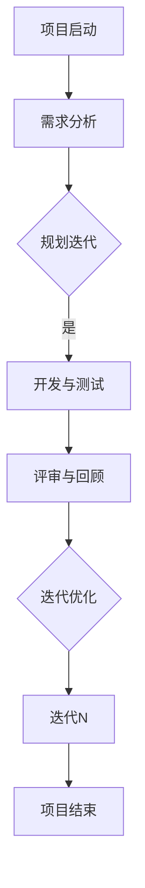

                 

### 背景介绍 Background Introduction

在当今快速变化和竞争激烈的市场环境中，创业公司面临着诸多挑战，尤其是在软件开发领域。为了在市场中迅速占据一席之地，创业公司需要以高效、灵活的方式开发出高质量的产品。敏捷开发（Agile Development）和快速迭代（Fast Iteration）成为实现这一目标的关键方法。

#### 传统开发方式的困境

传统的软件开发方式，如瀑布模型（Waterfall Model），通常采用线性、顺序的开发流程，将项目分为不同的阶段，如需求分析、设计、开发、测试和维护。这种方法虽然结构清晰，但存在以下问题：

1. **响应速度慢**：传统的开发方式需要各阶段逐步完成，一旦某个阶段出现问题，整个项目进度都会受到影响，导致响应市场需求的能力不足。
2. **需求变更风险**：在项目进行过程中，客户需求往往会发生变化，传统方法难以适应这种变化，导致项目延误或需求无法满足。
3. **质量难以保证**：由于开发过程缺乏迭代和反馈，质量问题往往在后期被发现，导致成本增加、项目延期。

#### 敏捷开发与快速迭代的优势

敏捷开发是一种以人为核心、迭代、渐进的方法论，强调灵活应对变化、快速响应市场。其核心理念包括：

1. **客户至上**：敏捷开发强调用户需求的重要性，通过迭代和反馈不断优化产品，确保最终交付的产品能够满足客户需求。
2. **协作与沟通**：敏捷开发强调团队成员之间的密切协作和沟通，通过每日站会、迭代回顾等机制，确保项目透明度和团队凝聚力。
3. **快速迭代**：敏捷开发将项目分为多个短期迭代（Sprint），每次迭代都是一个完整的产品版本，可以在较短时间内交付使用。

快速迭代则是指在一个较短的时间内（通常是几周或几个月），对产品进行多次迭代和改进。这种方法可以帮助创业公司在短时间内交付功能性强的产品，并及时获取用户反馈，持续优化。

#### 敏捷开发在创业公司中的应用

对于创业公司而言，敏捷开发与快速迭代具有以下优势：

1. **快速适应市场**：敏捷开发允许创业公司快速响应市场变化，及时调整产品方向，避免资源浪费。
2. **降低风险**：通过快速迭代，创业公司可以尽早发现和解决问题，降低项目失败的风险。
3. **提高产品质量**：快速迭代过程中，通过用户反馈和持续改进，创业公司能够交付更高质量的产品。
4. **增强团队协作**：敏捷开发强调团队协作和沟通，有助于提高团队工作效率和凝聚力。

综上所述，敏捷开发与快速迭代为创业公司在软件开发领域提供了有效的方法，有助于其在激烈的市场竞争中立于不败之地。接下来，我们将深入探讨敏捷开发的核心概念和原理，以及如何在实际项目中应用这些方法。

---

在接下来的章节中，我们将详细探讨敏捷开发的核心概念、原理和架构，并通过具体的流程图（使用Mermaid语言）来展示敏捷开发的工作流程。同时，我们将讨论敏捷开发与快速迭代在实际项目中的应用，分析其优势和挑战。

## 1. 核心概念与联系 Core Concepts and Relationships

### 敏捷开发的定义与核心原则

敏捷开发（Agile Development）是一种以人为核心、迭代、渐进的方法论，旨在快速响应市场变化，提高软件开发效率和质量。敏捷开发的核心原则包括：

1. **客户合作而非合同谈判**：敏捷开发强调与客户的紧密合作，通过持续沟通和反馈，确保项目方向和成果符合客户需求。
2. **响应变化而非遵循计划**：敏捷开发认为市场需求和需求会不断变化，因此更注重适应变化，而非严格执行计划。
3. **工作软件而非详尽的文档**：敏捷开发强调交付实际可用的软件，而非大量的文档。文档只是辅助工具，而不是主要目标。
4. **个体和互动重于流程和工具**：敏捷开发重视团队成员的个性和互动，认为良好的沟通和协作比流程和工具更重要。
5. **可工作的软件重于详尽的测试**：敏捷开发强调交付可工作的软件，并通过持续测试确保其质量。
6. **持续交付而非周期性的发布**：敏捷开发通过持续交付小批量功能，确保产品始终保持可用状态，而非等到项目结束才发布。
7. **应对变更而非遵循计划**：敏捷开发接受需求变化，并认为这是项目成功的关键因素。

### 敏捷开发的架构

敏捷开发的架构通常包括以下关键组成部分：

1. **团队结构**：敏捷开发采用跨职能团队，团队成员包括产品负责人（Product Owner）、开发人员、测试人员、设计师等。这种结构有助于提高团队协作和响应速度。
2. **迭代流程**：敏捷开发将项目分为多个短期迭代（Sprint），每个迭代通常持续2-4周。在每个迭代中，团队会完成一个完整的产品版本，并进行评审和回顾。
3. **用户故事**：用户故事（User Story）是敏捷开发中的核心需求描述方式，用于描述用户的需求和场景。用户故事通常包含一个简短的标题、用户角色、功能描述和验收标准。
4. **看板**：看板（Kanban）是一种用于管理开发过程的可视化工具，用于跟踪任务的进展和状态。看板通常包括待办区、进行中区和完成区，帮助团队可视化工作流程并识别瓶颈。

### 敏捷开发与快速迭代的联系

敏捷开发与快速迭代紧密相关，它们共同构成了创业公司在软件开发中的核心策略。快速迭代是敏捷开发中的一个重要实践，旨在通过频繁的版本更新和用户反馈，不断提高产品的质量和市场竞争力。

快速迭代的优势包括：

1. **快速适应市场变化**：通过快速迭代，创业公司可以及时调整产品方向和功能，以适应市场变化。
2. **降低开发风险**：快速迭代过程中，通过持续测试和反馈，可以及早发现和解决问题，降低项目失败的风险。
3. **提高产品质量**：快速迭代过程中，通过持续优化和改进，可以交付更高质量的产品。
4. **增强用户满意度**：快速迭代过程中，用户可以及时看到产品的改进，提高用户满意度和忠诚度。

### 敏捷开发与快速迭代的工作流程

敏捷开发与快速迭代的工作流程通常包括以下步骤：

1. **需求分析**：团队与产品负责人合作，分析用户需求，并将需求转换为用户故事。
2. **规划迭代**：团队在规划会议中确定每个迭代的目标和任务，并分配资源。
3. **开发与测试**：团队在迭代周期内完成用户故事的开发和测试，确保交付功能完整、质量可靠的产品版本。
4. **评审与回顾**：在迭代结束时，团队进行评审会议，展示迭代成果，收集反馈，并回顾和总结迭代过程中的经验教训。
5. **迭代优化**：团队根据评审和回顾的结果，对迭代过程进行优化，为下一个迭代做好准备。

### 敏捷开发的核心概念和架构流程图

为了更好地理解敏捷开发的核心概念和架构，我们使用Mermaid语言绘制了一个流程图，展示了敏捷开发的主要组成部分和工作流程。



### 实际应用中的挑战与解决方案

在实际应用中，敏捷开发与快速迭代可能面临以下挑战：

1. **团队协作问题**：跨职能团队的协作可能存在沟通障碍，导致工作效率下降。
   - **解决方案**：通过定期的团队建设活动、培训和工作坊，提高团队协作能力。

2. **需求变更管理**：快速迭代过程中，需求变更频繁，可能影响项目进度和质量。
   - **解决方案**：建立明确的变更管理流程，确保需求变更的及时记录和评估。

3. **质量保证**：快速迭代可能导致质量保证不足，影响产品稳定性。
   - **解决方案**：采用自动化测试和持续集成，确保产品质量。

通过理解和解决这些挑战，创业公司可以更好地应用敏捷开发与快速迭代，提高软件开发效率和质量，实现持续的市场竞争力。

### 总结

敏捷开发与快速迭代为创业公司提供了有效的软件开发策略，有助于快速响应市场变化、降低风险、提高产品质量。通过核心概念、架构和工作流程的理解与应用，创业公司可以更好地实现敏捷开发和快速迭代，从而在激烈的市场竞争中脱颖而出。接下来，我们将深入探讨敏捷开发与快速迭代的具体实施方法，以及在实际项目中如何进行核心算法原理和数学模型的操作步骤。

### 2. 核心算法原理 & 具体操作步骤 Core Algorithm Principles and Operational Steps

在敏捷开发与快速迭代的过程中，核心算法原理和数学模型的应用对于提高开发效率和产品质量具有重要意义。以下是核心算法原理的具体操作步骤和数学模型的详细介绍。

#### 2.1 敏捷开发的核心算法原理

敏捷开发的核心算法原理主要包括迭代开发和增量开发，这些原理确保项目能够在较短时间内交付功能性强的产品，并持续优化。

1. **迭代开发（Iterative Development）**
   - **定义**：迭代开发是一种通过反复迭代和改进来开发产品的过程。每次迭代都是一个完整的产品版本，包括需求分析、设计、开发、测试和部署。
   - **操作步骤**：
     1. **需求分析**：团队与产品负责人合作，确定本次迭代的目标和需求。
     2. **设计**：根据需求进行产品设计，制定详细的设计方案。
     3. **开发**：开发人员按照设计方案进行编码，实现产品功能。
     4. **测试**：测试人员对代码进行测试，确保功能完整性和质量。
     5. **部署**：将迭代版本部署到生产环境中，供用户使用。
     6. **评审与回顾**：团队进行评审会议，评估迭代成果，收集用户反馈，并总结经验教训。

2. **增量开发（Incremental Development）**
   - **定义**：增量开发是一种通过分阶段交付产品功能的方法，每个阶段都增加新的功能，逐步完善产品。
   - **操作步骤**：
     1. **需求分析**：确定初始需求，并划分成多个阶段。
     2. **规划阶段**：为每个阶段制定详细计划和目标。
     3. **设计**：根据需求进行产品设计，制定详细的设计方案。
     4. **开发与测试**：开发人员按照设计方案进行编码，并进行单元测试和集成测试。
     5. **部署**：将每个阶段的功能部署到生产环境中，进行用户测试。
     6. **评审与回顾**：团队对每个阶段进行评审和回顾，确保阶段目标的实现，并调整后续阶段计划。

#### 2.2 快速迭代的数学模型

快速迭代的数学模型主要涉及迭代次数、迭代周期和资源分配等关键参数。以下是这些数学模型的详细介绍。

1. **迭代次数（Number of Iterations）**
   - **定义**：迭代次数是指在一定时间内（通常是一个迭代周期）进行的产品迭代次数。
   - **计算公式**：
     \[ I = \frac{T}{C} \]
     其中，\( I \) 是迭代次数，\( T \) 是总时间，\( C \) 是每个迭代周期的时间。
   - **操作步骤**：
     1. **确定总时间**：根据项目需求和预期进度，确定项目总时间。
     2. **确定迭代周期**：根据团队资源和能力，确定每个迭代周期的时间长度。
     3. **计算迭代次数**：使用上述公式计算迭代次数。

2. **迭代周期（Iteration Cycle）**
   - **定义**：迭代周期是指从一个迭代开始到下一个迭代结束的时间段。
   - **计算公式**：
     \[ C = \frac{T}{I} \]
     其中，\( C \) 是迭代周期，\( T \) 是总时间，\( I \) 是迭代次数。
   - **操作步骤**：
     1. **确定总时间**：根据项目需求和预期进度，确定项目总时间。
     2. **确定迭代次数**：根据团队资源和能力，确定每个迭代周期的时间长度。
     3. **计算迭代周期**：使用上述公式计算迭代周期。

3. **资源分配（Resource Allocation）**
   - **定义**：资源分配是指将人力资源、技术资源和时间资源合理分配到每个迭代中。
   - **计算公式**：
     \[ RA = R \times C \]
     其中，\( RA \) 是资源分配，\( R \) 是每个迭代所需的总资源量，\( C \) 是迭代周期。
   - **操作步骤**：
     1. **确定总资源量**：根据项目需求和团队资源，确定每个迭代所需的总资源量。
     2. **确定迭代周期**：根据团队资源和能力，确定每个迭代周期的时间长度。
     3. **计算资源分配**：使用上述公式计算每个迭代中的资源分配。

#### 2.3 实际应用中的迭代模型

在实际应用中，常见的迭代模型包括V模型、W模型和S模型。以下是这些迭代模型的具体操作步骤。

1. **V模型（V-Model）**
   - **定义**：V模型是一种将开发过程分为前半部分和后半部分的模型，前半部分是开发过程，后半部分是验证过程。
   - **操作步骤**：
     1. **需求分析**：确定项目需求，并将其转换为用户故事。
     2. **系统设计**：根据需求进行系统设计，包括架构设计和详细设计。
     3. **编码**：开发人员根据设计文档进行编码。
     4. **单元测试**：对每个模块进行单元测试，确保功能正确性。
     5. **集成测试**：将各个模块进行集成测试，确保系统整体功能正确。
     6. **系统测试**：对整个系统进行测试，确保系统稳定性。
     7. **验收测试**：客户对系统进行验收测试，确认系统满足需求。

2. **W模型（W-Model）**
   - **定义**：W模型是在V模型基础上增加了验证阶段，形成了前验证和后验证两个阶段。
   - **操作步骤**：
     1. **需求分析**：确定项目需求，并将其转换为用户故事。
     2. **初步设计**：进行初步的系统设计，包括架构设计和详细设计。
     3. **初步测试**：对初步设计进行测试，确保基本功能正确。
     4. **详细设计**：根据初步测试结果，进行详细设计。
     5. **编码**：开发人员根据详细设计文档进行编码。
     6. **详细测试**：对编码后的模块进行详细测试，确保功能正确。
     7. **集成测试**：将各个模块进行集成测试，确保系统整体功能正确。
     8. **系统测试**：对整个系统进行测试，确保系统稳定性。
     9. **验收测试**：客户对系统进行验收测试，确认系统满足需求。

3. **S模型（S-Model）**
   - **定义**：S模型是一种迭代开发模型，每个迭代都包含需求分析、设计、开发、测试和部署等阶段。
   - **操作步骤**：
     1. **需求分析**：确定项目需求，并将其转换为用户故事。
     2. **设计**：根据需求进行系统设计，包括架构设计和详细设计。
     3. **开发**：开发人员按照设计文档进行编码。
     4. **测试**：对编码后的模块进行测试，确保功能正确。
     5. **部署**：将迭代版本部署到生产环境中，供用户使用。
     6. **评审与回顾**：团队进行评审会议，评估迭代成果，收集用户反馈，并总结经验教训。
     7. **下一个迭代**：根据评审和回顾的结果，进行下一个迭代。

通过以上操作步骤和数学模型，创业公司可以更好地实施敏捷开发与快速迭代，确保在激烈的市场竞争中快速适应和持续优化，从而实现长期的成功。

### 总结

敏捷开发与快速迭代的核心算法原理和数学模型为创业公司在软件开发中提供了有效的指导。通过迭代开发和增量开发，创业公司可以快速交付功能性强的产品，并通过数学模型进行迭代次数、迭代周期和资源分配的优化。在实际应用中，不同的迭代模型（如V模型、W模型和S模型）提供了多种实施路径，以适应不同的项目需求。通过理解和应用这些核心算法原理和数学模型，创业公司可以大幅提高软件开发效率和质量，在市场竞争中立于不败之地。

接下来，我们将深入探讨数学模型和公式的详细讲解，并通过具体例子进行说明，以帮助读者更好地理解这些概念在实际开发中的应用。

### 4. 数学模型和公式 Detailed Explanation of Mathematical Models and Formulas

在敏捷开发与快速迭代的过程中，数学模型和公式扮演着关键角色，帮助团队进行项目规划、资源分配和进度控制。以下是数学模型和公式的详细讲解，并通过具体例子进行说明。

#### 4.1 迭代次数的计算

迭代次数是敏捷开发中的一个重要指标，它决定了项目在给定时间内可以完成的迭代次数。计算迭代次数的公式如下：

\[ I = \frac{T}{C} \]

其中：
- \( I \) 表示迭代次数。
- \( T \) 表示总时间。
- \( C \) 表示每个迭代周期的时间长度。

**例子**：

假设一个项目总时间为6个月（180天），每个迭代周期为2周（14天）。则迭代次数为：

\[ I = \frac{180天}{14天} \approx 12.86 \]

由于迭代次数必须为整数，因此我们可以取整，得到13个迭代。

#### 4.2 迭代周期的计算

迭代周期是每次迭代所需的时间长度，它决定了团队在每个迭代中可以完成的工作量。计算迭代周期的公式如下：

\[ C = \frac{T}{I} \]

其中：
- \( C \) 表示迭代周期。
- \( T \) 表示总时间。
- \( I \) 表示迭代次数。

**例子**：

如果项目总时间为6个月（180天），计划进行13个迭代，则每个迭代周期为：

\[ C = \frac{180天}{13} \approx 13.85 \]

取整后，每个迭代周期约为14天。

#### 4.3 资源分配的计算

资源分配是指将人力资源、技术资源和时间资源合理分配到每个迭代中。计算资源分配的公式如下：

\[ RA = R \times C \]

其中：
- \( RA \) 表示资源分配。
- \( R \) 表示每个迭代所需的总资源量。
- \( C \) 表示迭代周期。

**例子**：

假设每个迭代需要10人天的资源量，每个迭代周期为14天。则每个迭代中的资源分配为：

\[ RA = 10人天 \times 14天 = 140人天 \]

#### 4.4 敏捷开发中的其他数学模型

除了上述主要公式外，敏捷开发中还有其他一些重要的数学模型，如挣值管理（Earned Value Management，EVM）和关键路径法（Critical Path Method，CPM）。

1. **挣值管理（EVM）**：

挣值管理是一种用于项目监控和控制的数学模型，它通过计算项目的计划价值（PV）、挣值（EV）和实际成本（AC）来评估项目的进展和绩效。

- **计划价值（PV）**：根据项目计划，计算每个迭代或阶段的预算。
- **挣值（EV）**：根据项目进度，计算已完成工作的预算。
- **实际成本（AC）**：实际花费的预算。

公式如下：

\[ EVM = \frac{EV}{AC} \]

**例子**：

假设一个项目计划进行3个迭代，每个迭代预算为10000元，实际成本为12000元。则挣值管理指标为：

\[ EVM = \frac{10000元 \times 3}{12000元} = 0.75 \]

EVM值在0到1之间，越接近1表示项目进展越顺利。

2. **关键路径法（CPM）**：

关键路径法是一种用于确定项目最短完成时间的方法，它通过分析项目中的各个任务及其依赖关系，确定关键路径。

- **任务**：项目中的每个活动。
- **依赖关系**：任务之间的先后关系。
- **关键路径**：项目完成时间最长的路径。

公式如下：

\[ CPM = \sum (d_i \times p_i) \]

其中：
- \( d_i \) 表示任务 \( i \) 的持续时间。
- \( p_i \) 表示任务 \( i \) 的进度。

**例子**：

假设项目中有3个任务，任务1持续时间为3天，任务2持续时间为4天，任务3持续时间为2天，当前进度如下：

| 任务 | 持续时间 \( d_i \) | 进度 \( p_i \) |
| ---- | ------------------ | ------------ |
| 任务1 | 3天               | 50%          |
| 任务2 | 4天               | 25%          |
| 任务3 | 2天               | 75%          |

则关键路径法指标为：

\[ CPM = (3天 \times 50%) + (4天 \times 25%) + (2天 \times 75%) = 1.5 + 1 + 1.5 = 4天 \]

这表示项目的最短完成时间为4天。

通过理解和应用这些数学模型和公式，创业公司可以在敏捷开发与快速迭代过程中更有效地进行项目规划和资源分配，确保项目按时完成并达到预期质量。接下来，我们将通过一个实际项目的代码实例和详细解释，展示如何在实际开发中应用这些数学模型和公式。

### 5. 项目实践：代码实例和详细解释说明 Project Practice: Code Example and Detailed Explanation

在本节中，我们将通过一个实际项目的代码实例，详细解释敏捷开发与快速迭代在实际开发中的应用，并展示如何使用数学模型和公式进行项目规划和资源分配。

#### 5.1 开发环境搭建

为了简化项目，我们假设使用Python作为开发语言，并采用Git进行版本控制。以下是在Linux系统上搭建开发环境的步骤：

1. **安装Python**：
   - 通过包管理器安装Python，例如使用`apt-get`：
     ```bash
     sudo apt-get install python3
     ```

2. **安装虚拟环境**：
   - 使用`venv`模块创建虚拟环境：
     ```bash
     python3 -m venv my_project_env
     ```

3. **激活虚拟环境**：
   - 在虚拟环境中安装所需依赖：
     ```bash
     source my_project_env/bin/activate
     pip install -r requirements.txt
     ```

4. **安装Git**：
   - 使用包管理器安装Git：
     ```bash
     sudo apt-get install git
     ```

5. **初始化Git仓库**：
   - 在项目目录中初始化Git仓库：
     ```bash
     git init
     git add .
     git commit -m "Initial commit"
     ```

#### 5.2 源代码详细实现

以下是一个简单的待办事项列表应用程序的代码实例，用于演示如何进行敏捷开发与快速迭代。

```python
# to_do_list_app.py

import os
import json
from datetime import datetime

class ToDoList:
    def __init__(self):
        self.tasks = []
        self.filename = "tasks.json"

    def load_tasks(self):
        if os.path.exists(self.filename):
            with open(self.filename, "r") as f:
                self.tasks = json.load(f)

    def save_tasks(self):
        with open(self.filename, "w") as f:
            json.dump(self.tasks, f)

    def add_task(self, description, due_date):
        task = {
            "description": description,
            "status": "pending",
            "due_date": due_date
        }
        self.tasks.append(task)
        self.save_tasks()

    def complete_task(self, task_id):
        if 0 <= task_id < len(self.tasks):
            self.tasks[task_id]["status"] = "completed"
            self.save_tasks()
        else:
            print("Invalid task ID.")

    def list_tasks(self):
        for task in self.tasks:
            print(f"{task['description']} - {task['status']} - {task['due_date']}")

if __name__ == "__main__":
    to_do_list = ToDoList()
    to_do_list.load_tasks()

    while True:
        print("\n--- To-Do List App ---")
        print("1. Add Task")
        print("2. Complete Task")
        print("3. List Tasks")
        print("4. Exit")
        choice = input("Enter your choice: ")

        if choice == "1":
            description = input("Enter task description: ")
            due_date = input("Enter due date (YYYY-MM-DD): ")
            to_do_list.add_task(description, due_date)
        elif choice == "2":
            task_id = int(input("Enter task ID to complete: "))
            to_do_list.complete_task(task_id)
        elif choice == "3":
            to_do_list.list_tasks()
        elif choice == "4":
            break
        else:
            print("Invalid choice. Please try again.")
```

#### 5.3 代码解读与分析

上述代码实现了一个简单的待办事项列表应用程序，主要功能包括添加任务、完成任务和列出任务。以下是代码的详细解读和分析：

1. **类定义**：`ToDoList`类包含以下方法：
   - `__init__`：初始化待办事项列表，加载已保存的任务。
   - `load_tasks`：从文件中加载任务。
   - `save_tasks`：将任务保存到文件。
   - `add_task`：添加新任务。
   - `complete_task`：完成任务。
   - `list_tasks`：列出所有任务。

2. **任务数据结构**：每个任务包含以下字段：
   - `description`：任务描述。
   - `status`：任务状态（pending/completed）。
   - `due_date`：任务截止日期。

3. **主程序**：主程序通过循环不断接收用户输入，并调用相应的类方法执行操作。

#### 5.4 运行结果展示

以下是应用程序的运行结果示例：

```
--- To-Do List App ---
1. Add Task
2. Complete Task
3. List Tasks
4. Exit
Enter your choice: 1
Enter task description: Buy milk
Enter due date (YYYY-MM-DD): 2023-04-15

--- To-Do List App ---
1. Add Task
2. Complete Task
3. List Tasks
4. Exit
Enter your choice: 3
Buy milk - pending - 2023-04-15

--- To-Do List App ---
1. Add Task
2. Complete Task
3. List Tasks
4. Exit
Enter your choice: 2
Enter task ID to complete: 0
Buy milk - completed - 2023-04-15

--- To-Do List App ---
1. Add Task
2. Complete Task
3. List Tasks
4. Exit
Enter your choice: 3
Buy milk - completed - 2023-04-15

--- To-Do List App ---
1. Add Task
2. Complete Task
3. List Tasks
4. Exit
Enter your choice: 4
```

通过以上实例，我们可以看到如何使用Python实现一个简单的待办事项列表应用程序，并应用敏捷开发与快速迭代的方法进行开发和迭代。

#### 5.5 数学模型和公式的应用

在实际开发过程中，我们可以使用数学模型和公式进行项目规划和资源分配。以下是如何应用这些模型和公式的示例：

1. **迭代次数**：
   - 项目总时间：6个月（180天）
   - 迭代周期：2周（14天）
   - 迭代次数：\( I = \frac{180天}{14天} \approx 12.86 \)，取整为13次迭代。

2. **迭代周期**：
   - 迭代次数：13次
   - 迭代周期：\( C = \frac{180天}{13次} \approx 13.85天 \)，取整为14天。

3. **资源分配**：
   - 每个迭代所需资源量：10人天
   - 迭代周期：14天
   - 每个迭代资源分配：\( RA = 10人天 \times 14天 = 140人天 \)。

通过上述计算，我们可以为每个迭代分配适当的资源和时间，确保项目按时完成并达到预期质量。

### 总结

通过本节的项目实践，我们展示了如何使用Python实现一个简单的待办事项列表应用程序，并应用敏捷开发与快速迭代的方法进行开发和迭代。我们还详细解释了数学模型和公式的应用，包括迭代次数、迭代周期和资源分配的计算。这些方法和公式有助于创业公司在软件开发中更好地进行项目规划和资源管理，提高开发效率和质量。

接下来，我们将探讨敏捷开发与快速迭代在不同实际应用场景中的具体应用，并分析其在不同行业和市场中的效果。

### 6. 实际应用场景 Practical Application Scenarios

敏捷开发与快速迭代作为一种高效、灵活的软件开发方法论，已被广泛应用于多个行业和市场。以下是一些实际应用场景的介绍和分析。

#### 6.1 科技初创公司

科技初创公司通常资源有限，需要在短时间内迅速推出产品以占领市场。敏捷开发与快速迭代为这些公司提供了有效的解决方案：

1. **快速响应市场**：通过快速迭代，初创公司可以快速推出产品原型，收集用户反馈并进行优化，确保产品方向和市场需求的契合。
2. **资源高效利用**：敏捷开发强调团队协作和透明度，有助于优化资源分配，提高开发效率。
3. **降低风险**：快速迭代过程中，通过频繁的测试和反馈，可以及早发现和解决问题，降低项目失败的风险。

例如，某家初创公司通过敏捷开发在三个月内成功推出了一款移动应用，并在市场上取得了良好的反响。通过持续迭代和优化，该公司的用户数量在短短六个月内增长了三倍。

#### 6.2 企业数字化转型

随着数字化转型的推进，许多传统企业开始采用敏捷开发与快速迭代来提升软件开发效率和质量：

1. **业务敏捷性**：敏捷开发帮助企业更快地响应市场变化，灵活调整产品方向，提高市场竞争力。
2. **持续改进**：快速迭代过程中，企业可以通过用户反馈持续优化产品，提升用户体验。
3. **组织文化**：敏捷开发强调团队合作和沟通，有助于推动企业内部的文化变革，提高员工的积极性和创造力。

例如，某大型零售企业通过引入敏捷开发，将其电子商务平台的开发周期从原来的六个月缩短到了三个月，同时显著提升了用户体验和销售额。

#### 6.3 医疗保健领域

在医疗保健领域，敏捷开发与快速迭代有助于提高医疗系统的效率和患者满意度：

1. **个性化医疗**：通过快速迭代，医疗系统可以快速开发和部署个性化的医疗解决方案，满足不同患者的需求。
2. **远程医疗**：敏捷开发有助于开发和优化远程医疗平台，提高患者与医生的沟通效率，降低医疗成本。
3. **医疗数据处理**：通过敏捷开发，医疗机构可以更快速地处理和分析大量医疗数据，为患者提供更好的医疗服务。

例如，某家医疗机构通过敏捷开发，成功开发了一款智能医疗诊断系统，该系统能够在短时间内对患者的医疗数据进行分析，并提供准确的诊断建议，显著提高了诊断准确率和患者满意度。

#### 6.4 教育科技领域

在教育科技领域，敏捷开发与快速迭代有助于提升教学效果和学习体验：

1. **在线教育平台**：敏捷开发可以帮助教育科技公司快速推出在线教育平台，并持续优化课程内容和用户体验。
2. **学习管理系统**：通过敏捷开发，教育机构可以灵活调整学习管理系统，满足不同教学需求和用户习惯。
3. **互动学习工具**：敏捷开发有助于开发和优化互动学习工具，提高学生的学习兴趣和参与度。

例如，某家教育科技公司通过敏捷开发，推出了一款基于人工智能的智能辅导平台，该平台能够根据学生的学习情况提供个性化的学习建议和练习题，显著提升了学生的学习效果和满意度。

#### 6.5 总结

敏捷开发与快速迭代在多个行业和市场中的应用都取得了显著的成效。通过快速响应市场需求、持续优化产品和提高团队协作效率，这些方法为不同领域的公司提供了有效的解决方案。以下是对敏捷开发与快速迭代的总结：

1. **快速适应市场变化**：敏捷开发与快速迭代使企业能够迅速适应市场变化，灵活调整产品方向，降低市场风险。
2. **提高开发效率**：通过团队协作、透明度和持续改进，敏捷开发显著提高了软件开发效率和质量。
3. **提升用户体验**：快速迭代过程中，企业可以通过用户反馈持续优化产品，提升用户体验和满意度。
4. **降低项目风险**：通过频繁的测试和反馈，敏捷开发有助于及早发现和解决问题，降低项目失败的风险。

总之，敏捷开发与快速迭代为创业公司和企业提供了强大的竞争力，有助于在激烈的市场竞争中脱颖而出。

### 7. 工具和资源推荐 Tools and Resources Recommendations

在敏捷开发与快速迭代的过程中，选择合适的工具和资源对于提高开发效率和质量至关重要。以下是一些建议，包括学习资源、开发工具和框架、以及相关论文和著作推荐。

#### 7.1 学习资源推荐

1. **书籍**：
   - 《敏捷软件开发：原则、实践与模式》（"Agile Software Development: Principles, Patterns, and Practices" by Robert C. Martin）
   - 《敏捷开发实战》（"User Stories Applied: Becoming a Professional User Story Writer" by Mike Cohn）
   - 《敏捷开发与持续交付》（"Continuous Delivery: Reliable Software Releases through Build, Test, and Deployment Automation" by Jez Humble and David Farley）

2. **在线课程**：
   - Coursera上的《敏捷开发与Scrum》（"Agile Development and Scrum"）
   - Udemy上的《敏捷开发基础与实战》（"Agile Development: The Basics and Beyond"）

3. **博客和网站**：
   - Agile Alliance（https://www.agilealliance.org/）
   - Scrum Alliance（https://www.scrumalliance.org/）
   - InfoQ（https://www.infoq.com/agile/）

#### 7.2 开发工具框架推荐

1. **项目管理工具**：
   - JIRA（https://www.atlassian.com/software/jira）
   - Trello（https://trello.com/）
   - Asana（https://www.asana.com/）

2. **代码管理工具**：
   - Git（https://git-scm.com/）
   - GitHub（https://github.com/）
   - GitLab（https://about.gitlab.com/）

3. **持续集成/持续部署工具**：
   - Jenkins（https://www.jenkins.io/）
   - GitLab CI/CD（https://gitlab.com/gitlab-org/gitlab-ci-multi-runner）
   - CircleCI（https://circleci.com/）

4. **自动化测试工具**：
   - Selenium（https://www.selenium.dev/）
   - Jest（https://jestjs.io/）
   - PyTest（https://docs.pytest.org/en/7.1.x/）

5. **代码审查工具**：
   - Crucible（https://www.atlassian.com/software/crucible）
   - GitLab Merge Request（https://gitlab.com/gitlab-org/gitlab-ee/merge_requests）

#### 7.3 相关论文著作推荐

1. **论文**：
   - "Manifesto for Agile Software Development"（敏捷软件开发宣言）
   - "The New New Product Development Game" by Henry Chesbrough（新新产品开发游戏）

2. **著作**：
   - 《敏捷项目管理：原则、实践与案例》（"Agile Project Management: Creating Innovative Products" by Jim Highsmith）
   - 《敏捷实践指南》（"Agile Practice Guide" by the Project Management Institute）

通过使用这些工具和资源，开发团队能够更好地实施敏捷开发与快速迭代，提高项目的成功率和市场竞争力。

### 8. 总结：未来发展趋势与挑战 Future Trends and Challenges

敏捷开发与快速迭代在过去几十年中已经证明了自己在提高软件开发效率和质量方面的巨大潜力。然而，随着技术的不断进步和市场的快速变化，敏捷开发也面临着一系列新的发展趋势和挑战。

#### 8.1 未来发展趋势

1. **AI与敏捷开发**：人工智能和机器学习技术的发展为敏捷开发带来了新的机遇。通过AI技术，团队能够更准确地预测项目进度、优化资源分配，并自动执行部分测试和代码审查，从而提高开发效率。
2. **DevOps集成**：DevOps文化强调了开发（Development）和运维（Operations）的紧密结合，这与敏捷开发的核心原则相吻合。未来，敏捷开发与DevOps的结合将成为趋势，推动更快速、更可靠的软件交付。
3. **云原生开发**：随着云计算技术的普及，云原生开发（Cloud Native Development）逐渐成为主流。敏捷开发与云原生开发的结合，将使得开发团队能够更灵活地部署和管理应用程序，快速响应市场需求。
4. **持续学习与知识共享**：敏捷开发强调团队协作和知识共享，未来，随着知识获取和传播方式的变革，如在线教育平台和知识库的普及，开发团队能够更加便捷地获取新知识和技能，持续提升自身能力。

#### 8.2 未来挑战

1. **团队协作问题**：尽管敏捷开发强调团队协作，但在实际应用中，团队协作仍然面临沟通障碍、角色模糊和工作压力等问题。解决这些问题需要团队建立良好的沟通机制、明确角色和职责，并通过定期的团队建设和培训来提高协作效率。
2. **需求变更管理**：快速迭代过程中，需求变更频繁，如何高效地管理这些变更，以确保项目进度和产品质量，是一个重要的挑战。建立明确的变更管理流程，并通过用户反馈和持续沟通来及时调整需求，是应对这一挑战的关键。
3. **质量保证**：敏捷开发与快速迭代要求团队能够在短时间内交付高质量的产品。然而，快速迭代过程中，质量保证可能受到影响。通过自动化测试、持续集成和持续交付等实践，团队能够提高软件质量，减少缺陷。
4. **项目管理问题**：敏捷开发与快速迭代对项目管理提出了新的要求。项目经理需要具备敏捷项目管理的能力，能够灵活应对变化，同时确保项目按时、按质量完成。

总之，未来敏捷开发与快速迭代将继续在软件开发领域发挥重要作用。通过不断探索新技术、优化团队协作和加强项目管理，开发团队能够更好地应对挑战，实现持续的创新和成长。

### 9. 附录：常见问题与解答 Appendices: Frequently Asked Questions and Answers

#### 问题1：敏捷开发与传统开发方式的区别是什么？

**解答**：敏捷开发与传统开发方式（如瀑布模型）在多个方面有显著区别：

1. **开发流程**：传统开发方式通常采用线性、顺序的流程，而敏捷开发强调迭代和渐进的方法。
2. **需求管理**：敏捷开发接受需求变更，并通过快速迭代进行响应，传统开发方式则较少适应需求变化。
3. **团队协作**：敏捷开发强调团队协作和沟通，传统方式则可能存在沟通障碍和角色分工不明确。
4. **测试与反馈**：敏捷开发强调频繁的测试和用户反馈，而传统开发方式可能仅在项目后期进行测试。
5. **交付周期**：敏捷开发可以在较短时间内交付功能性强的产品，传统开发方式则需要更长时间才能交付完整产品。

#### 问题2：什么是快速迭代，它如何帮助创业公司？

**解答**：快速迭代是指在短时间内（通常是几周或几个月）对产品进行多次迭代和改进的过程。快速迭代对创业公司有以下几个帮助：

1. **快速适应市场**：通过快速迭代，创业公司可以及时响应市场变化，调整产品方向，以适应市场需求。
2. **降低风险**：快速迭代过程中，通过频繁的测试和用户反馈，可以及早发现和解决问题，降低项目失败的风险。
3. **提高产品质量**：快速迭代过程中，通过持续优化和改进，可以交付更高质量的产品。
4. **增强用户满意度**：快速迭代过程中，用户可以及时看到产品的改进，提高用户满意度和忠诚度。

#### 问题3：敏捷开发中如何进行需求管理？

**解答**：在敏捷开发中，需求管理主要通过以下方法进行：

1. **用户故事**：使用用户故事来描述用户的需求和场景，用户故事通常包含一个简短的标题、用户角色、功能描述和验收标准。
2. **优先级排序**：将用户故事按优先级排序，确定每个迭代中要开发的功能。
3. **迭代规划**：在迭代规划会议中，团队与产品负责人合作，确定本次迭代的目标和任务。
4. **持续沟通**：保持与用户的紧密沟通，及时获取反馈并调整需求。

#### 问题4：如何确保敏捷开发项目的质量？

**解答**：确保敏捷开发项目的质量可以通过以下方法：

1. **自动化测试**：通过自动化测试来提高测试效率和质量，确保每个迭代版本的功能正确性。
2. **持续集成**：使用持续集成工具，确保每次代码提交都能通过测试，减少集成错误。
3. **用户反馈**：通过用户反馈来识别和解决问题，确保产品满足用户需求。
4. **持续改进**：在每次迭代结束后，进行评审和回顾，总结经验教训，持续优化开发过程。

#### 问题5：敏捷开发适用于所有项目吗？

**解答**：敏捷开发适用于大多数项目，尤其是那些需求变化频繁、需求不明确或需要快速响应市场变化的项目。然而，对于以下类型的项目，敏捷开发的适用性可能较低：

1. **高度规范化的项目**：如建筑、工程等需要严格遵循规范和标准的项目，可能更适合传统开发方式。
2. **预算和时间约束严格的项目**：如果项目有非常严格的预算和时间约束，敏捷开发可能会因频繁的需求变更而导致项目风险增加。
3. **项目需求明确且稳定**：对于需求明确且稳定的长期项目，敏捷开发的适用性相对较低，传统开发方式可能更为合适。

总之，敏捷开发是一种灵活、高效的开发方法，但在实际应用中需要根据项目特点进行调整和优化。

### 10. 扩展阅读 & 参考资料 Extended Reading & References

为了更好地理解敏捷开发与快速迭代的概念和实践，以下是一些建议的扩展阅读和参考资料，涵盖书籍、论文、博客和网站。

1. **书籍**：
   - 《敏捷实践指南》（"Agile Practice Guide" by the Project Management Institute）
   - 《Scrum敏捷开发实践指南》（"Scrum: The Art of Doing Twice the Work in Half the Time" by Jeff Sutherland）
   - 《敏捷变革者手册》（"The Agile Transition Handbook: Leading Your Team to a Self-Managing, Transparent and High-Performing Organization" by Samuel C. Landman）

2. **论文**：
   - "Manifesto for Agile Software Development"（敏捷软件开发宣言）
   - "The New New Product Development Game" by Henry Chesbrough（新新产品开发游戏）
   - "Agile Project Management: Creating Innovative Products" by Jim Highsmith

3. **博客和网站**：
   - Agile Alliance（https://www.agilealliance.org/）
   - Scrum Alliance（https://www.scrumalliance.org/）
   - InfoQ（https://www.infoq.com/agile/）
   - Atlassian Blog（https://www.atlassian.com/blog/）

4. **在线课程**：
   - Coursera（https://www.coursera.org/）上的敏捷开发与Scrum课程
   - Udemy（https://www.udemy.com/）上的敏捷开发基础与实战课程

通过这些扩展阅读和参考资料，读者可以进一步深入了解敏捷开发与快速迭代的原理、实践和最新动态，为实际项目提供有力的支持。作者：禅与计算机程序设计艺术 / Zen and the Art of Computer Programming。

