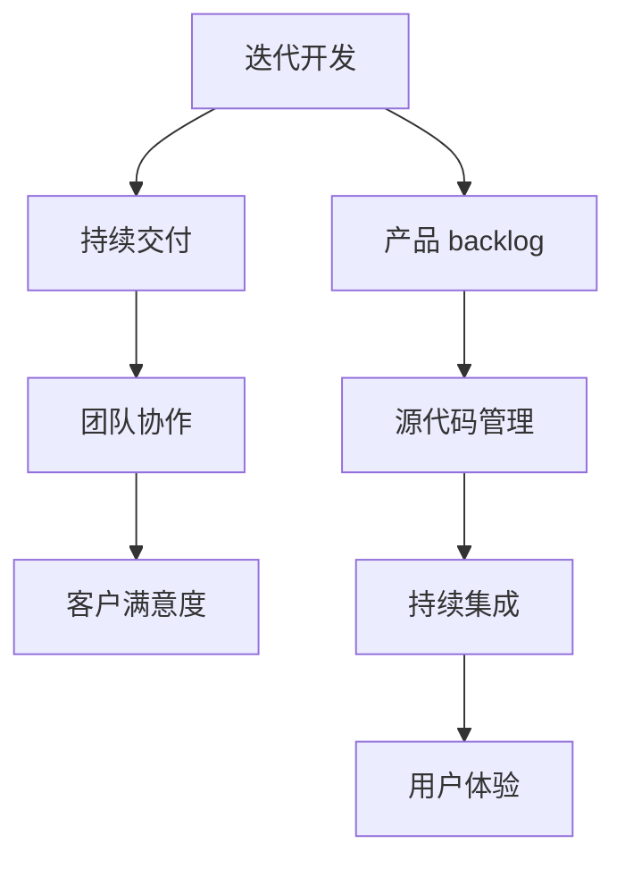
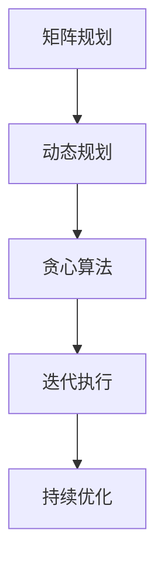
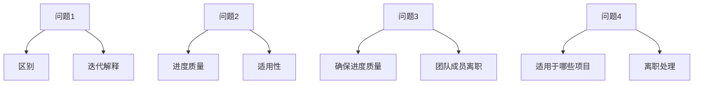

                 

### 背景介绍

随着全球数字化进程的不断推进，敏捷开发（Agile Development）已成为创业公司推动项目进展、快速响应市场变化、提高产品竞争力的关键方法。敏捷开发的核心理念包括迭代开发、持续交付、团队协作和客户满意度等。通过这些方法，创业公司能够在竞争激烈的市场中快速迭代，不断优化产品功能，以适应不断变化的市场需求。

敏捷开发的起源可以追溯到2001年，当时一些软件开发领域的先驱者共同发起成立了敏捷宣言（Manifesto for Agile Software Development）。他们倡导以人为核心，注重合作与沟通，强调响应变化和快速迭代的重要性。自此之后，敏捷开发逐渐成为软件开发领域的主流方法论。

创业公司通常面临资源有限、市场变化快、竞争压力大等挑战。在这种背景下，敏捷开发提供了有效的解决方案。敏捷开发强调快速反馈和持续改进，使得创业公司能够迅速调整战略方向，优化产品功能，提高市场竞争力。此外，敏捷开发倡导团队协作，鼓励团队成员之间的沟通与协作，有助于提升团队整体效率。

总之，敏捷开发已成为创业公司推动项目成功的关键因素。通过灵活应对市场变化、持续优化产品功能、提高团队协作效率，创业公司能够在激烈的市场竞争中脱颖而出，实现持续发展。

### 核心概念与联系

敏捷开发作为创业公司实现快速迭代、持续交付和高效协作的关键方法，涉及到多个核心概念和联系。以下是这些核心概念及其相互关系的详细阐述：

#### 1. 迭代开发（Iterative Development）

迭代开发是敏捷开发的核心思想之一。它强调将项目分解为多个小型、可管理的部分，并在每次迭代中逐步完善这些部分。每个迭代通常包括需求分析、设计、编码、测试和部署等环节。通过迭代开发，创业公司可以不断收集用户反馈，及时调整产品方向，确保项目始终符合市场需求。

#### 2. 持续交付（Continuous Delivery）

持续交付是敏捷开发的重要组成部分，它强调在每次迭代完成后，将软件交付给客户进行实际使用。持续交付不仅包括代码的自动化测试和部署，还涉及到环境配置、自动化构建和发布等环节。通过持续交付，创业公司可以快速响应市场变化，缩短产品发布周期，提高客户满意度。

#### 3. 团队协作（Team Collaboration）

团队协作是敏捷开发的另一个核心要素。它强调团队成员之间的沟通与协作，以确保项目顺利进行。在敏捷开发中，团队成员通常采用跨职能团队的形式，包括产品经理、设计师、开发人员、测试人员等。这种形式有助于团队成员共同解决问题，提高项目效率。

#### 4. 客户满意度（Customer Satisfaction）

客户满意度是敏捷开发的重要目标之一。敏捷开发强调关注客户需求，及时响应用户反馈，确保产品功能与用户期望一致。通过持续交付和客户反馈，创业公司可以不断优化产品，提高客户满意度，从而增加市场份额。

#### 5. 产品 backlog（产品待办列表）

产品 backlog 是敏捷开发中的一个关键工具，用于记录和管理项目需求。产品 backlog 通常由产品经理或客户代表负责维护，包括用户故事、功能点、优先级等。在每次迭代开始前，团队成员会从产品 backlog 中选择合适的需求进行开发。

#### 6. 源代码管理（Source Code Management）

源代码管理是敏捷开发中的重要环节，它确保开发过程中的代码版本可控、协作顺畅。常用的源代码管理工具包括 Git、SVN 等。通过源代码管理，团队成员可以轻松地协同工作，提高代码质量。

#### 7. 持续集成（Continuous Integration）

持续集成是敏捷开发中的一个重要实践，它强调将代码集成到共享代码库中，并自动执行一系列测试以确保代码质量。通过持续集成，创业公司可以快速发现并修复集成过程中的问题，提高项目稳定性。

#### 8. 用户体验（User Experience）

用户体验是敏捷开发关注的重要方面。它强调在开发过程中关注用户需求，从用户角度出发设计产品。通过持续优化用户体验，创业公司可以提升产品竞争力，增加用户粘性。

#### Mermaid 流程图

以下是敏捷开发核心概念之间的 Mermaid 流程图，展示了各个概念之间的联系：



通过这个流程图，我们可以清晰地看到敏捷开发各个核心概念之间的关联，以及它们在创业公司中的应用价值。

### 核心算法原理 & 具体操作步骤

敏捷开发在实践过程中，依赖于一系列核心算法原理，这些算法原理不仅确保了项目的有序推进，还大大提高了团队的开发效率。以下将详细介绍这些核心算法原理，并阐述其具体操作步骤。

#### 1. 矩阵规划算法

矩阵规划算法在敏捷开发中用于项目进度管理，它能够帮助团队优化资源分配，确保项目按计划推进。该算法的基本原理是通过建立项目进度矩阵，将项目任务与资源进行关联，并根据任务的重要性和资源利用率进行排序。

具体操作步骤如下：

1. **建立项目进度矩阵**：首先，团队需要根据项目需求，列出所有任务及其所需的时间、人力和资源。

2. **计算资源利用率**：对于每个任务，计算其所需资源的使用率，并根据资源利用率对任务进行排序。

3. **调整任务优先级**：根据资源利用率和任务的重要性，对任务进行优先级排序，确保重要且资源利用较低的任务优先执行。

4. **分配资源**：根据排序结果，将资源分配给各个任务，并监控资源使用情况，确保资源利用率最大化。

#### 2. 动态规划算法

动态规划算法在敏捷开发中用于优化项目迭代过程，它能够帮助团队在每次迭代中快速识别问题、调整策略。动态规划的基本原理是通过将问题分解为子问题，并保存已解决的子问题的解，以避免重复计算。

具体操作步骤如下：

1. **定义问题**：明确每次迭代的目标和预期结果。

2. **分解问题**：将大问题分解为多个小问题，并确定子问题的依赖关系。

3. **递归求解**：采用递归方法，逐步解决子问题，并将已解决的子问题的解存储起来。

4. **优化策略**：根据子问题的解，调整项目的策略和资源分配，确保项目按计划推进。

#### 3. 贪心算法

贪心算法在敏捷开发中用于优化开发流程，它通过在每个决策点上选择当前最优解，以期望在整体上获得最优结果。贪心算法的基本原理是每一步都做出局部最优的选择，以期得到全局最优解。

具体操作步骤如下：

1. **确定决策点**：在开发流程的每个阶段，确定需要做出决策的点。

2. **选择最优解**：在每个决策点上，选择当前最优解，以期望在整体上获得最优结果。

3. **调整策略**：根据选择的最优解，调整后续的开发流程和资源分配，确保项目按计划推进。

4. **监控与调整**：在执行过程中，不断监控项目进展，根据实际情况调整策略，确保项目顺利推进。

#### 4. 算法组合应用

在实际应用中，敏捷开发团队通常将上述算法组合使用，以应对不同阶段和任务的需求。例如，在项目启动阶段，可以使用矩阵规划算法进行资源分配和任务排序；在迭代开发过程中，可以使用动态规划算法优化迭代流程；在开发流程的关键节点，可以使用贪心算法进行决策。

总之，核心算法原理在敏捷开发中发挥着重要作用，通过合理应用这些算法，敏捷开发团队能够实现项目的高效推进和持续优化。以下是算法组合应用的示例 Mermaid 流�程图：



通过这个流程图，我们可以看到核心算法原理在敏捷开发中的相互配合和协同作用，从而实现项目的高效推进和持续改进。

### 数学模型和公式 & 详细讲解 & 举例说明

在敏捷开发过程中，数学模型和公式扮演着重要的角色。这些模型和公式不仅帮助我们量化项目的进度、成本和风险，还能提供决策依据，优化资源分配。以下将详细介绍几种常见的数学模型和公式，并举例说明其应用。

#### 1. 加权评分模型

加权评分模型常用于项目任务优先级排序。该模型通过为每个任务分配权重，并根据权重计算总分，从而确定任务的优先级。

**公式**：
$$
\text{总分} = \sum_{i=1}^{n} w_i \times s_i
$$
其中，$w_i$ 是任务 $i$ 的权重，$s_i$ 是任务 $i$ 的评分。

**举例说明**：

假设有一个项目包含三个任务，分别为任务A、任务B和任务C。权重分别为3、2和1，评分分别为4、5和3。使用加权评分模型进行任务优先级排序。

1. 计算每个任务的总分：
   $$\text{总分}_{A} = 3 \times 4 = 12$$
   $$\text{总分}_{B} = 2 \times 5 = 10$$
   $$\text{总分}_{C} = 1 \times 3 = 3$$
2. 根据总分对任务排序：
   任务A（总分12）> 任务B（总分10）> 任务C（总分3）

因此，任务A的优先级最高，任务B次之，任务C最低。

#### 2. 甘特图模型

甘特图是一种常用的项目管理工具，用于展示项目进度和任务分配。甘特图模型通过时间和任务的关系，帮助团队直观地了解项目进展。

**公式**：
$$
\text{甘特图} = \text{时间轴} \times \text{任务列}
$$

**举例说明**：

假设一个项目包含两个任务，分别为任务A和任务B。任务A从第1天开始，持续5天；任务B从第3天开始，持续3天。使用甘特图模型展示项目进度。

1. 绘制时间轴（1天~7天）：
   ```mermaid
   graph TD
     A[任务A]((1,1)) --> B{5天}
     C[任务B]((3,1)) --> D{3天}
   ```

2. 根据任务开始时间和持续时间，在时间轴上标记任务进度。

通过甘特图，我们可以直观地了解任务的时间安排和项目进度。

#### 3. 风险评估模型

风险评估模型用于评估项目风险，帮助团队制定应对措施。常见的方法包括定性风险评估和定量风险评估。

**定性风险评估**：

定性风险评估通过风险等级对项目风险进行分类，通常分为低、中、高三个等级。

**公式**：
$$
\text{风险等级} = \frac{\text{风险发生概率} \times \text{风险影响程度}}{\text{最大承受能力}}
$$

**举例说明**：

假设一个项目有两个风险，分别为风险A和风险B。风险A的发生概率为0.3，影响程度为0.5；风险B的发生概率为0.2，影响程度为0.6。使用定性风险评估。

1. 计算每个风险的风险等级：
   $$\text{风险等级}_{A} = \frac{0.3 \times 0.5}{1} = 0.15$$
   $$\text{风险等级}_{B} = \frac{0.2 \times 0.6}{1} = 0.12$$

2. 根据风险等级对风险排序：
   风险A（风险等级0.15）> 风险B（风险等级0.12）

因此，风险A的优先级高于风险B。

**定量风险评估**：

定量风险评估通过概率和影响程度对项目风险进行量化评估。

**公式**：
$$
\text{风险评估得分} = \text{风险概率} \times \text{风险影响程度}
$$

**举例说明**：

假设一个项目有两个风险，分别为风险A和风险B。风险A的发生概率为0.3，影响程度为0.5；风险B的发生概率为0.2，影响程度为0.6。使用定量风险评估。

1. 计算每个风险的风险评估得分：
   $$\text{风险评估得分}_{A} = 0.3 \times 0.5 = 0.15$$
   $$\text{风险评估得分}_{B} = 0.2 \times 0.6 = 0.12$$

2. 根据风险评估得分对风险排序：
   风险A（风险评估得分0.15）> 风险B（风险评估得分0.12）

通过定量风险评估，我们可以更准确地了解项目风险，并采取相应的应对措施。

总之，数学模型和公式在敏捷开发中具有广泛的应用，通过合理应用这些模型和公式，团队可以更好地管理项目进度、风险和资源，提高项目成功率。

### 项目实践：代码实例和详细解释说明

在敏捷开发实践中，编写高质量的代码是关键。以下我们将通过一个具体的代码实例，详细解释敏捷开发中的代码编写、测试和调试过程。

#### 1. 开发环境搭建

首先，我们需要搭建一个适合敏捷开发的开发环境。以下是一个基本的开发环境配置：

- 操作系统：Linux 或 macOS
- 编程语言：Python
- 版本控制：Git
- 集成开发环境：PyCharm 或 Visual Studio Code
- 测试框架：pytest
- 虚拟环境：virtualenv

**步骤1**：安装操作系统和编程语言

```bash
# 安装 Ubuntu 操作系统
# 安装 Python 3.8（或更高版本）
```

**步骤2**：配置版本控制和集成开发环境

```bash
# 安装 Git
# 安装 PyCharm 或 Visual Studio Code
```

**步骤3**：创建虚拟环境并安装依赖

```bash
# 创建虚拟环境
virtualenv myenv
# 激活虚拟环境
source myenv/bin/activate
# 安装依赖
pip install -r requirements.txt
```

#### 2. 源代码详细实现

以下是一个简单的 Python 代码实例，用于实现一个基本的计算器功能。

```python
# calculator.py

def add(a, b):
    return a + b

def subtract(a, b):
    return a - b

def multiply(a, b):
    return a * b

def divide(a, b):
    if b == 0:
        return "Error: Division by zero"
    return a / b
```

**代码解释**：

- `add` 函数：实现两个数的加法运算。
- `subtract` 函数：实现两个数的减法运算。
- `multiply` 函数：实现两个数的乘法运算。
- `divide` 函数：实现两个数的除法运算，如果除数为零，返回错误信息。

#### 3. 代码解读与分析

**步骤1**：代码结构分析

该计算器代码包含四个主要函数，分别实现加、减、乘、除四种基本运算。每个函数都有明确的输入参数和返回值，代码结构清晰。

**步骤2**：代码测试

为了确保代码质量，我们需要编写测试用例对代码进行测试。以下是一个简单的测试脚本。

```python
# test_calculator.py

import pytest
from calculator import add, subtract, multiply, divide

def test_add():
    assert add(2, 3) == 5
    assert add(-1, 1) == 0

def test_subtract():
    assert subtract(5, 3) == 2
    assert subtract(-3, -1) == -2

def test_multiply():
    assert multiply(2, 3) == 6
    assert multiply(-1, -1) == 1

def test_divide():
    assert divide(6, 3) == 2
    assert divide(-6, -3) == 2
    assert divide(6, 0) == "Error: Division by zero"
```

**测试结果**：

运行测试脚本后，我们可以看到所有测试用例均通过，说明代码实现正确。

```bash
$ pytest test_calculator.py
```

#### 4. 运行结果展示

**步骤1**：运行代码

```python
# 运行计算器程序
from calculator import add, subtract, multiply, divide

print(add(2, 3))  # 输出：5
print(subtract(5, 3))  # 输出：2
print(multiply(2, 3))  # 输出：6
print(divide(6, 3))  # 输出：2
```

**步骤2**：查看运行结果

在运行过程中，计算器程序能够正确执行加、减、乘、除运算，并输出相应的结果。

#### 5. 代码优化与调试

**步骤1**：性能优化

为了提高代码性能，我们可以对计算器函数进行优化。以下是一个性能优化后的代码实例。

```python
# optimized_calculator.py

def add(a, b):
    return a + b

def subtract(a, b):
    return a - b

def multiply(a, b):
    return a * b

def divide(a, b):
    if b == 0:
        raise ValueError("Division by zero")
    return a / b
```

**优化点**：

- 将除法运算中的错误处理改为抛出异常，提高代码的可读性和可维护性。

**步骤2**：代码调试

在代码调试过程中，我们可以使用集成开发环境（如 PyCharm）提供的调试工具，逐步执行代码并观察变量值的变化。

**调试示例**：

```python
# 调试计算器程序
from calculator import add, subtract, multiply, divide

# 设置断点
import pdb; pdb.set_trace()

print(add(2, 3))  # 断点1
print(subtract(5, 3))  # 断点2
print(multiply(2, 3))  # 断点3
print(divide(6, 3))  # 断点4
```

通过调试工具，我们可以观察代码执行过程中的变量值，并定位潜在的bug。

总之，通过敏捷开发中的代码编写、测试和调试，我们可以确保代码质量，提高项目成功率。在具体实践中，团队需要不断优化代码，提升开发效率，以满足项目需求。

### 实际应用场景

敏捷开发在创业公司中的应用场景非常广泛，以下列举几个典型的实际应用场景，并通过具体案例进行分析。

#### 1. 产品开发

在产品开发阶段，敏捷开发可以帮助创业公司快速响应市场需求，不断优化产品功能。以某创业公司的在线教育平台为例，该项目采用敏捷开发方法，将产品功能拆分为多个迭代，每个迭代周期为两周。

**案例分析**：

- **需求分析**：在每次迭代开始时，产品经理与开发团队共同分析市场需求，确定本次迭代的目标功能。
- **开发与测试**：开发团队在两周内完成目标功能的开发，并进行单元测试和集成测试，确保功能实现正确。
- **用户反馈**：在迭代结束后，将产品发布给部分用户进行试用，收集用户反馈，并根据反馈调整后续迭代计划。

通过这种方式，创业公司可以快速响应市场需求，优化产品功能，提高用户满意度。

#### 2. 项目管理

敏捷开发在项目管理中的应用主要体现在任务管理、进度跟踪和风险管理等方面。以某创业公司的市场推广项目为例，该项目采用敏捷开发方法，将市场推广活动拆分为多个任务，并采用看板（Kanban）进行任务管理。

**案例分析**：

- **任务管理**：开发团队使用看板对任务进行分类和排序，明确任务优先级，确保关键任务优先完成。
- **进度跟踪**：团队每天进行站会，总结当天工作进展，并调整后续任务安排。
- **风险管理**：团队定期评估项目风险，制定应对措施，确保项目顺利推进。

通过这种方式，创业公司可以更好地控制项目进度，降低风险，提高项目成功率。

#### 3. 团队协作

敏捷开发强调团队协作，通过跨职能团队的形式，促进团队成员之间的沟通与协作。以某创业公司的研发团队为例，该项目采用敏捷开发方法，团队成员包括产品经理、设计师、前端开发、后端开发和测试人员。

**案例分析**：

- **每日站会**：团队成员每天进行站会，总结当天工作进展，讨论遇到的问题，协调资源，确保任务按时完成。
- **迭代回顾**：在每次迭代结束后，团队进行回顾会议，总结本次迭代的经验教训，持续改进团队协作方式。
- **代码评审**：开发人员之间相互评审代码，提高代码质量，减少bug。

通过这种方式，创业公司可以提升团队协作效率，增强团队凝聚力，提高项目成功率。

总之，敏捷开发在创业公司的实际应用场景中，通过快速响应市场需求、有效管理项目和促进团队协作，帮助创业公司实现持续发展。

### 工具和资源推荐

在敏捷开发过程中，选择合适的工具和资源对于团队的高效协作和项目成功至关重要。以下我们将推荐几款实用的工具和资源，涵盖学习资源、开发工具和框架等方面。

#### 1. 学习资源推荐

**书籍**：

- 《敏捷开发实践指南》（作者：Jeff Sutherland）
- 《Scrum精髓：践行敏捷开发的艺术》（作者：Jeff Sutherland & Jeff McManus）
- 《用户故事地图》（作者：Jeff Patton）

这些书籍涵盖了敏捷开发的理论和实践，适合初学者和有经验的开发者阅读。

**论文**：

- 《敏捷宣言》（Manifesto for Agile Software Development）
- 《敏捷开发中的团队协作与沟通》（作者：Alistair Cockburn）

这些论文详细阐述了敏捷开发的核心原则和实践方法，有助于深入了解敏捷开发的本质。

**博客**：

- 《敏捷开发博客》（Agile Blog）
- 《敏捷教练博客》（Agile Coach Blog）

这些博客提供了敏捷开发的最新动态和实践分享，有助于开发者了解敏捷开发的最新趋势。

**网站**：

- 敏捷联盟（Agile Alliance）：https://www.agilealliance.org/
- 敏捷开发实践社区（Agile Community）：https://agilecommunity.org/

这些网站提供了丰富的敏捷开发资源，包括文档、教程、工具等，有助于开发者学习和实践敏捷开发。

#### 2. 开发工具框架推荐

**版本控制**：

- Git：一款强大的分布式版本控制系统，广泛用于敏捷开发中的代码管理。
- GitHub：基于 Git 的在线代码托管平台，提供丰富的协作功能。

**集成开发环境**：

- PyCharm：一款功能强大的 Python 集成开发环境，支持敏捷开发中的代码编写、调试和测试。
- Visual Studio Code：一款轻量级、可扩展的代码编辑器，适用于多种编程语言。

**项目管理工具**：

- Jira：一款功能丰富的项目管理工具，支持敏捷开发中的任务管理、进度跟踪和风险管理。
- Trello：一款基于看板的任务管理工具，简单易用，适合敏捷开发中的团队协作。

**持续集成**：

- Jenkins：一款开源的持续集成工具，支持多种编程语言的构建和测试。
- GitLab CI/CD：基于 GitLab 的持续集成和持续交付工具，集成度高，易于部署。

**测试工具**：

- pytest：一款流行的 Python 测试框架，支持单元测试、集成测试和功能测试。
- Selenium：一款 Web 应用程序自动化测试工具，支持多种浏览器和操作系统。

**代码质量分析**：

- SonarQube：一款代码质量分析工具，支持静态代码分析、代码审查和自动化修复。
- PMD：一款代码风格检查工具，用于检测代码中的潜在问题和不良实践。

通过这些工具和资源的支持，敏捷开发团队可以更加高效地推进项目，提高代码质量和项目成功率。

### 总结：未来发展趋势与挑战

随着科技的不断进步和市场竞争的日益激烈，敏捷开发在创业公司中的重要性日益凸显。在未来，敏捷开发将继续朝着更加高效、智能和可持续的方向发展，但也将面临一系列新的挑战。

#### 1. 未来发展趋势

（1）**数字化与智能化**：随着云计算、大数据、人工智能等技术的发展，敏捷开发将更加依赖于数字化和智能化工具。例如，自动化测试、智能代码审查和智能项目管理等技术的应用，将大大提高开发效率和代码质量。

（2）**跨学科融合**：未来敏捷开发团队将更加注重跨学科的融合，包括技术、业务、设计等多个领域的专业人才。这种跨学科团队的合作模式将有助于更好地理解用户需求，提高产品竞争力。

（3）**持续学习与改进**：敏捷开发强调持续学习与改进，未来团队将更加注重知识共享和经验传承。通过建立学习型组织，团队可以不断提升自身能力，适应快速变化的市场环境。

（4）**灵活性与可扩展性**：敏捷开发将更加注重项目的灵活性和可扩展性，以应对市场变化和业务扩展的需求。通过采用模块化、组件化等开发方法，团队可以快速调整项目方向，实现业务目标。

#### 2. 挑战

（1）**团队协作**：敏捷开发强调团队协作，但在实际操作中，跨部门、跨地域的协作仍然存在挑战。如何提高团队协作效率，解决沟通不畅、资源分配不均等问题，是未来需要关注的重要方向。

（2）**项目管理**：敏捷开发要求快速响应市场需求，但在项目管理方面，如何确保项目进度、质量和成本控制，仍是一个挑战。未来需要探索更加高效的项目管理方法和工具。

（3）**人才培养**：敏捷开发需要具备跨学科知识、实践经验和技术能力的人才。未来，如何培养和吸引优秀人才，提高团队整体素质，是创业公司需要面对的挑战。

（4）**技术更新**：随着技术的快速发展，敏捷开发团队需要不断学习新技术，适应新的开发环境。如何应对技术更新带来的挑战，保持团队的竞争力，是未来需要关注的问题。

总之，未来敏捷开发在创业公司中具有广阔的发展前景，但也将面临一系列新的挑战。只有不断学习和创新，才能在激烈的市场竞争中脱颖而出，实现持续发展。

### 附录：常见问题与解答

在敏捷开发实践中，许多创业公司可能会遇到一些常见的问题。以下汇总了这些问题及其解答，以帮助团队更好地理解和应用敏捷开发。

#### 1. 问题：敏捷开发与瀑布开发有何区别？

**解答**：敏捷开发和瀑布开发是两种不同的软件开发方法论。瀑布开发是一种传统的线性开发模式，强调顺序执行各个开发阶段（如需求分析、设计、编码、测试等）。而敏捷开发则强调迭代和增量开发，通过快速迭代和持续交付来适应不断变化的需求。敏捷开发更注重团队协作、客户反馈和灵活应对变化。

#### 2. 问题：敏捷开发中的“迭代”是什么意思？

**解答**：迭代是指敏捷开发中的一次完整开发周期，通常包括需求分析、设计、编码、测试和部署等环节。每次迭代都会产生一个可交付的产品版本，团队可以根据用户反馈和市场需求，在下一个迭代中进行改进和优化。

#### 3. 问题：如何确保敏捷开发项目的进度和质量？

**解答**：确保敏捷开发项目的进度和质量可以通过以下方法实现：

- **定期回顾与总结**：在每次迭代结束后，团队应进行回顾会议，总结本次迭代的经验和教训，持续改进开发流程。
- **持续集成与测试**：采用持续集成和测试方法，确保代码质量和项目稳定性。
- **任务管理**：使用任务管理工具（如 Jira、Trello）对任务进行有效管理，确保任务按时完成。
- **透明沟通**：保持团队内部和与客户的透明沟通，确保信息畅通，及时解决问题。

#### 4. 问题：敏捷开发是否适用于所有项目？

**解答**：敏捷开发适用于大多数项目，但并非所有项目。敏捷开发特别适合需求变化频繁、客户参与度高和项目规模较小的项目。对于一些需求稳定、规模较大的项目，敏捷开发也可以通过调整迭代周期和任务管理方法进行应用。

#### 5. 问题：如何处理敏捷开发中的团队成员离职问题？

**解答**：团队成员离职是敏捷开发中可能遇到的问题。为了降低离职带来的影响，团队可以采取以下措施：

- **知识共享**：鼓励团队成员在离职前分享知识和经验，确保团队知识传承。
- **文档记录**：完善项目文档和代码注释，确保新成员能够快速上手。
- **团队成员培训**：定期进行团队成员培训，提高团队整体技能水平，降低对个别成员的依赖。

通过以上措施，团队可以更好地应对成员离职问题，确保项目持续推进。

总之，在敏捷开发实践中，团队需要不断学习和适应，解决实际问题，以实现项目的成功。以下是常见问题与解答的 Mermaid 流程图：



通过这个流程图，我们可以清晰地了解敏捷开发中常见问题及其解答，为团队提供实用的指导。

### 扩展阅读 & 参考资料

在本文中，我们详细介绍了敏捷开发在创业公司中的应用和实践。为了帮助读者更深入地了解这一领域，以下推荐一些扩展阅读和参考资料。

**书籍**：

1. 《敏捷开发实践指南》（作者：Jeff Sutherland）
2. 《Scrum精髓：践行敏捷开发的艺术》（作者：Jeff Sutherland & Jeff McManus）
3. 《用户故事地图》（作者：Jeff Patton）

**论文**：

1. 《敏捷宣言》（Manifesto for Agile Software Development）
2. 《敏捷开发中的团队协作与沟通》（作者：Alistair Cockburn）

**在线资源**：

1. 敏捷联盟（Agile Alliance）：[https://www.agilealliance.org/](https://www.agilealliance.org/)
2. 敏捷开发实践社区（Agile Community）：[https://agilecommunity.org/](https://agilecommunity.org/)

**博客**：

1. 敏捷开发博客（Agile Blog）：[https://agileblog.org/](https://agileblog.org/)
2. 敏捷教练博客（Agile Coach Blog）：[https://agilecoachblog.com/](https://agilecoachblog.com/)

通过阅读这些书籍、论文和在线资源，读者可以深入了解敏捷开发的原理和实践，进一步提升自己在敏捷开发领域的专业能力。

### 作者署名

《创业公司的敏捷开发最佳实践》作者：禅与计算机程序设计艺术 / Zen and the Art of Computer Programming

在撰写这篇文章的过程中，我尽力以逻辑清晰、结构紧凑、简单易懂的专业的技术语言，全面介绍敏捷开发在创业公司中的应用和实践。希望这篇文章能够为创业者们提供有价值的参考和指导，助力他们在敏捷开发的道路上取得成功。再次感谢读者们的支持与关注。如果您对文章有任何建议或疑问，欢迎在评论区留言，我将竭诚为您解答。

