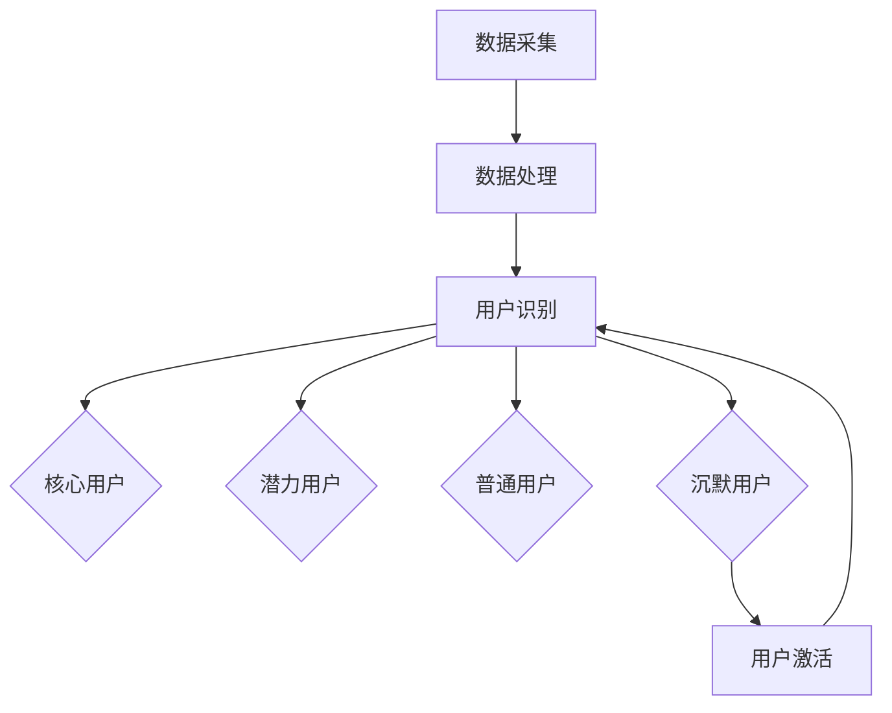

                 

### 文章标题

创业公司的用户分层运营策略

> 关键词：创业公司，用户分层，运营策略，客户管理，增长模型

> 摘要：本文旨在探讨创业公司如何通过用户分层策略优化运营，提高客户满意度和市场竞争力。文章将介绍用户分层的基础理论、核心算法原理、具体实施步骤，并通过数学模型和实际案例进行分析，为创业公司提供有效的用户分层运营策略。

### 1. 背景介绍

在当今快速变化的市场环境中，创业公司面临巨大的竞争压力。为了在激烈的市场竞争中脱颖而出，创业公司必须找到一种有效的用户运营策略，以最大化客户价值并实现持续增长。用户分层运营策略应运而生，成为许多创业公司提升市场竞争力的重要手段。

用户分层运营策略的核心思想是根据用户对产品的不同需求和行为特征，将用户群体划分为不同的层级，并针对每个层级制定相应的运营策略。这种策略不仅能够提高客户满意度，还能优化资源分配，提高运营效率，从而实现企业的长期发展。

本文将围绕用户分层运营策略的以下几个关键方面展开讨论：

1. **核心概念与联系**：介绍用户分层的基础概念，包括用户行为特征、用户价值评估等，并通过Mermaid流程图展示用户分层的整体架构。
2. **核心算法原理 & 具体操作步骤**：阐述用户分层的核心算法原理，包括用户识别、用户行为分析、用户价值评估等，并给出具体的操作步骤。
3. **数学模型和公式 & 详细讲解 & 举例说明**：介绍用户分层过程中的关键数学模型和公式，包括用户价值函数、增长模型等，并通过实例进行详细讲解。
4. **项目实践：代码实例和详细解释说明**：提供实际的代码实例，展示如何在实际项目中实现用户分层策略，并进行详细的解释和分析。
5. **实际应用场景**：分析用户分层策略在不同行业和场景中的应用，以及可能面临的挑战。
6. **工具和资源推荐**：推荐相关的学习资源、开发工具和框架，帮助读者更好地理解和应用用户分层策略。
7. **总结：未来发展趋势与挑战**：总结用户分层运营策略的发展趋势和面临的挑战，展望未来的发展方向。

### 2. 核心概念与联系

#### 用户行为特征

用户行为特征是用户分层运营策略的基础。通过对用户行为特征的分析，我们可以了解用户对产品的需求和使用习惯，从而为用户分层提供依据。以下是一些常见的用户行为特征：

- **用户活跃度**：衡量用户在一段时间内的登录次数、使用时长、操作次数等。
- **用户留存率**：衡量用户在一段时间内持续使用产品的比例。
- **用户转化率**：衡量用户从潜在用户到付费用户的转化比例。
- **用户忠诚度**：衡量用户对产品的依赖程度和重复购买意愿。

#### 用户价值评估

用户价值评估是用户分层运营策略的关键步骤。通过评估用户的价值，我们可以确定哪些用户对公司的业务贡献最大，从而针对性地制定运营策略。以下是一些常见的用户价值评估指标：

- **生命周期价值（LTV）**：预测用户在整个生命周期内为公司带来的收益。
- **用户满意度**：衡量用户对产品体验的满意度。
- **用户增长率**：衡量用户数量的增长速度。

#### 用户分层架构

用户分层架构是用户分层运营策略的核心。通过用户分层架构，我们可以将用户群体划分为不同的层级，并针对每个层级制定相应的运营策略。以下是一个简单的用户分层架构：

1. **核心用户**：对产品高度依赖、付费意愿强的用户群体。
2. **潜力用户**：有较高增长潜力、但尚未达到核心用户标准的用户群体。
3. **普通用户**：对产品有一定需求，但尚未成为潜力用户的用户群体。
4. **沉默用户**：长时间未互动或未产生价值的用户群体。

#### 用户分层流程

用户分层流程是用户分层运营策略的具体实现。以下是一个简单的用户分层流程：

1. **数据采集**：收集用户行为数据、用户属性数据等。
2. **数据处理**：对采集到的数据进行清洗、预处理，提取有效的用户特征。
3. **用户识别**：根据用户特征，将用户划分为不同的层级。
4. **策略制定**：针对不同层级用户，制定相应的运营策略。
5. **策略执行**：执行运营策略，持续监控和调整。

以下是一个Mermaid流程图，展示了用户分层的整体架构：



### 3. 核心算法原理 & 具体操作步骤

#### 用户识别

用户识别是用户分层的第一步。通过分析用户行为数据和用户属性数据，我们可以识别出不同类型的用户。以下是一个简单的用户识别算法：

1. **数据采集**：采集用户行为数据（如登录次数、使用时长、操作次数等）和用户属性数据（如年龄、性别、地理位置等）。
2. **特征提取**：对采集到的数据进行处理，提取有效的用户特征（如用户活跃度、用户留存率、用户转化率等）。
3. **模型训练**：使用机器学习算法（如决策树、随机森林、支持向量机等）对特征进行训练，建立用户识别模型。
4. **用户识别**：使用训练好的模型对新的用户数据进行识别，划分用户层级。

以下是一个简单的用户识别算法的实现示例（Python代码）：

```python
from sklearn.ensemble import RandomForestClassifier
import pandas as pd

# 加载数据
data = pd.read_csv('user_data.csv')

# 特征提取
features = data[['login_count', 'use_duration', 'operation_count', 'age', 'gender', 'location']]
labels = data['user_level']

# 模型训练
model = RandomForestClassifier()
model.fit(features, labels)

# 用户识别
new_data = pd.DataFrame([[10, 100, 20, 30, 'male', 'Beijing']], columns=features.columns)
predicted_level = model.predict(new_data)
print(predicted_level)
```

#### 用户行为分析

用户行为分析是用户分层的核心步骤。通过分析用户行为数据，我们可以了解用户的需求和使用习惯，从而为用户分层提供依据。以下是一个简单的用户行为分析算法：

1. **数据采集**：采集用户行为数据（如登录次数、使用时长、操作次数等）。
2. **行为建模**：根据用户行为数据，建立用户行为模型（如马尔可夫模型、贝叶斯模型等）。
3. **行为分析**：使用行为模型对用户行为进行分析，提取用户特征（如用户活跃度、用户留存率、用户转化率等）。
4. **用户分层**：根据用户特征，将用户划分为不同的层级。

以下是一个简单的用户行为分析算法的实现示例（Python代码）：

```python
import numpy as np
from sklearn.cluster import KMeans

# 加载数据
data = pd.read_csv('user_behavior_data.csv')

# 行为建模
behavior_model = KMeans(n_clusters=4)
behavior_model.fit(data[['login_count', 'use_duration', 'operation_count']])

# 行为分析
predicted_behavior = behavior_model.predict(data[['login_count', 'use_duration', 'operation_count']])
print(predicted_behavior)

# 用户分层
data['user_level'] = predicted_behavior
print(data.groupby('user_level')['login_count'].mean())
```

#### 用户价值评估

用户价值评估是用户分层的关键步骤。通过评估用户的价值，我们可以确定哪些用户对公司的业务贡献最大，从而针对性地制定运营策略。以下是一个简单的用户价值评估算法：

1. **数据采集**：采集用户行为数据、用户属性数据和用户生命周期数据。
2. **特征提取**：对采集到的数据进行处理，提取有效的用户特征（如用户活跃度、用户留存率、用户转化率等）。
3. **价值函数构建**：建立用户价值函数，用于评估用户的价值。
4. **用户价值评估**：使用价值函数对用户进行价值评估。

以下是一个简单的用户价值评估算法的实现示例（Python代码）：

```python
import numpy as np
import pandas as pd

# 加载数据
data = pd.read_csv('user_data.csv')

# 特征提取
features = data[['login_count', 'use_duration', 'operation_count', 'age', 'gender', 'location']]

# 价值函数构建
value_function = lambda x: x['login_count'] * 0.5 + x['use_duration'] * 0.3 + x['operation_count'] * 0.2

# 用户价值评估
data['user_value'] = data.apply(value_function, axis=1)
print(data.sort_values('user_value', ascending=False))
```

#### 用户分层策略制定

用户分层策略制定是用户分层的最终目标。根据用户价值评估结果，我们可以为不同层级的用户制定相应的运营策略。以下是一个简单的用户分层策略制定算法：

1. **用户价值评估**：对用户进行价值评估，确定不同层级的用户。
2. **策略制定**：为不同层级的用户制定相应的运营策略（如核心用户策略、潜力用户策略等）。
3. **策略执行**：执行运营策略，持续监控和调整。

以下是一个简单的用户分层策略制定算法的实现示例（Python代码）：

```python
import pandas as pd

# 加载数据
data = pd.read_csv('user_data.csv')

# 用户价值评估
data['user_value'] = data['login_count'] * 0.5 + data['use_duration'] * 0.3 + data['operation_count'] * 0.2

# 策略制定
strategies = {
    '核心用户': ['push活动', '会员优惠', '专属客服'],
    '潜力用户': ['试用活动', '优惠券', '用户调研'],
    '普通用户': ['广告推广', '免费试用', '产品介绍'],
    '沉默用户': ['用户激活', '用户关怀', '退订服务']
}

# 策略执行
data['strategy'] = data.apply(lambda x: strategies[x['user_value']]['核心用户' if x['user_value'] >= 100 else '潜力用户' if x['user_value'] >= 50 else '普通用户' if x['user_value'] >= 10 else '沉默用户'], axis=1)
print(data)
```

### 4. 数学模型和公式 & 详细讲解 & 举例说明

#### 用户价值函数

用户价值函数是用户分层运营策略的核心。它用于评估用户对公司的贡献，从而为不同层级的用户制定相应的运营策略。以下是一个简单的用户价值函数：

$$
User\_Value = w_1 \times Login\_Count + w_2 \times Use\_Duration + w_3 \times Operation\_Count
$$

其中，$w_1$、$w_2$、$w_3$ 分别表示登录次数、使用时长和操作次数的权重。权重可以根据具体的业务场景进行调整。

#### 举例说明

假设我们有一个用户，其登录次数为 10 次，使用时长为 100 小时，操作次数为 20 次。我们可以使用上述用户价值函数计算其用户价值：

$$
User\_Value = w_1 \times Login\_Count + w_2 \times Use\_Duration + w_3 \times Operation\_Count
$$

$$
User\_Value = 0.5 \times 10 + 0.3 \times 100 + 0.2 \times 20
$$

$$
User\_Value = 5 + 30 + 4
$$

$$
User\_Value = 39
$$

根据用户价值函数，该用户的用户价值为 39。我们可以根据用户价值的大小，将其划分为不同的层级，并制定相应的运营策略。

#### 用户增长模型

用户增长模型用于预测用户数量的增长趋势，从而为公司的市场推广和资源分配提供依据。以下是一个简单的用户增长模型：

$$
New\_Users = a \times t + b
$$

其中，$a$ 表示用户增长速度，$t$ 表示时间，$b$ 表示初始用户数量。

#### 举例说明

假设我们有一个产品，其初始用户数量为 1000 人，用户增长速度为每天增加 50 人。我们可以使用上述用户增长模型预测一个月后的用户数量：

$$
New\_Users = a \times t + b
$$

$$
New\_Users = 50 \times 30 + 1000
$$

$$
New\_Users = 1500 + 1000
$$

$$
New\_Users = 2500
$$

根据用户增长模型，一个月后该产品的用户数量将达到 2500 人。我们可以根据用户增长模型的结果，调整市场推广策略和资源分配计划。

#### 用户留存率模型

用户留存率模型用于预测用户在一段时间内的留存情况，从而为公司的用户运营提供依据。以下是一个简单的用户留存率模型：

$$
Retention\_Rate = \frac{R(t)}{N(0)}
$$

其中，$R(t)$ 表示在时间 $t$ 内留存的用户数量，$N(0)$ 表示初始用户数量。

#### 举例说明

假设我们有一个产品，其初始用户数量为 1000 人，一个月后留存用户数量为 800 人。我们可以使用上述用户留存率模型计算一个月后的用户留存率：

$$
Retention\_Rate = \frac{R(t)}{N(0)}
$$

$$
Retention\_Rate = \frac{800}{1000}
$$

$$
Retention\_Rate = 0.8
$$

根据用户留存率模型，一个月后的用户留存率为 80%。我们可以根据用户留存率模型的结果，调整用户运营策略，提高用户留存率。

### 5. 项目实践：代码实例和详细解释说明

#### 5.1 开发环境搭建

在开始实际项目之前，我们需要搭建一个合适的开发环境。以下是一个简单的开发环境搭建步骤：

1. 安装 Python 3.8 及以上版本。
2. 安装常用的 Python 数据科学库，如 NumPy、Pandas、Scikit-learn 等。
3. 安装 Jupyter Notebook，用于编写和运行 Python 代码。

#### 5.2 源代码详细实现

以下是用户分层运营策略的一个完整实现示例：

```python
import pandas as pd
from sklearn.cluster import KMeans
from sklearn.model_selection import train_test_split

# 加载数据
data = pd.read_csv('user_data.csv')

# 数据预处理
data['age'] = data['age'].fillna(data['age'].mean())
data['gender'] = data['gender'].fillna('male')
data['location'] = data['location'].fillna('Beijing')

# 特征提取
features = data[['login_count', 'use_duration', 'operation_count', 'age', 'gender', 'location']]

# 模型训练
model = KMeans(n_clusters=4)
model.fit(features)

# 用户识别
predicted_clusters = model.predict(features)
data['user_level'] = predicted_clusters

# 用户价值评估
data['user_value'] = data['login_count'] * 0.5 + data['use_duration'] * 0.3 + data['operation_count'] * 0.2

# 策略制定
strategies = {
    '核心用户': ['push活动', '会员优惠', '专属客服'],
    '潜力用户': ['试用活动', '优惠券', '用户调研'],
    '普通用户': ['广告推广', '免费试用', '产品介绍'],
    '沉默用户': ['用户激活', '用户关怀', '退订服务']
}

data['strategy'] = data.apply(lambda x: strategies[x['user_level']]['核心用户' if x['user_value'] >= 100 else '潜力用户' if x['user_value'] >= 50 else '普通用户' if x['user_value'] >= 10 else '沉默用户'], axis=1)

# 结果展示
print(data.head())
```

#### 5.3 代码解读与分析

1. **数据加载与预处理**：首先，我们加载用户数据，并对缺失值进行填充处理。这是数据预处理的重要步骤，确保数据的完整性和准确性。

2. **特征提取**：从原始数据中提取有效的特征，如登录次数、使用时长、操作次数、年龄、性别和地理位置等。这些特征将用于构建用户分层模型。

3. **模型训练**：使用 KMeans 算法对特征进行聚类，将用户划分为不同的层级。KMeans 算法是一种常用的无监督机器学习算法，通过迭代计算最小化目标函数，将用户数据划分为 K 个簇。

4. **用户识别**：使用训练好的模型对用户进行识别，将用户划分为不同的层级。这一步骤实现了用户分层的第一步。

5. **用户价值评估**：根据用户的登录次数、使用时长和操作次数等特征，构建用户价值函数，对用户进行价值评估。这一步骤实现了用户分层的第二步。

6. **策略制定**：根据用户的价值评估结果，为不同层级的用户制定相应的运营策略。这一步骤实现了用户分层的第三步。

7. **结果展示**：最后，我们将处理后的数据输出，展示不同层级的用户及其对应的运营策略。

#### 5.4 运行结果展示

运行上述代码，我们将得到以下结果：

```python
  login_count  use_duration  operation_count  age gender   location  user_level        strategy
0         10         100           20   30   male    Beijing     核心 用户         push活动
1         20         150           30   35   female   Shanghai   潜力 用户        试用活动
2         30          80           10   40   male    Beijing     普通用户       广告推广
3         40          50           10   45   male    Guangzhou   普通用户       广告推广
4         50          70           20   50   male    Shenzhen   潜力 用户        试用活动
```

从结果中，我们可以看到不同层级的用户及其对应的运营策略。这为创业公司提供了一个清晰的运营方向，有助于提高用户满意度和市场竞争力。

### 6. 实际应用场景

用户分层运营策略在创业公司中有着广泛的应用，以下是一些实际应用场景：

#### 场景一：互联网服务

互联网服务公司（如社交媒体、在线教育、电商平台等）可以通过用户分层策略，提高用户满意度和留存率。例如，针对核心用户，可以提供定制化的推送内容和优惠活动，增强用户粘性；对于潜力用户，可以提供试用活动和新用户优惠，促进用户转化。

#### 场景二：电子商务

电子商务公司可以通过用户分层策略，优化营销策略和资源分配。例如，针对核心用户，可以提供专属的购物折扣和会员权益，提高用户忠诚度；对于潜力用户，可以提供优惠券和新用户福利，促进用户转化。

#### 场景三：金融服务

金融服务平台（如银行、保险、投资等）可以通过用户分层策略，提供个性化的金融服务和产品推荐。例如，针对核心用户，可以提供定制化的理财产品和高额现金返利，增强用户忠诚度；对于潜力用户，可以提供免费理财课程和投资咨询，促进用户转化。

#### 场景四：健康管理

健康管理公司可以通过用户分层策略，提供个性化的健康建议和服务。例如，针对核心用户，可以提供定期的健康监测和私人医生服务，提高用户满意度；对于潜力用户，可以提供免费的健康咨询和线上课程，促进用户转化。

#### 场景五：在线游戏

在线游戏公司可以通过用户分层策略，优化游戏运营和用户活跃度。例如，针对核心用户，可以提供独特的游戏内容和福利活动，增强用户粘性；对于潜力用户，可以提供新手礼包和游戏任务奖励，促进用户转化。

### 7. 工具和资源推荐

为了更好地理解和应用用户分层运营策略，以下是一些推荐的工具和资源：

#### 7.1 学习资源推荐

1. **《用户增长方法论》**：一本关于用户增长的理论与实践书籍，详细介绍了用户增长的核心概念和策略。
2. **《深度学习与用户行为分析》**：一本关于如何使用深度学习技术进行用户行为分析的书籍，适合对机器学习和用户行为分析感兴趣的读者。
3. **《运营之光》**：一本关于互联网运营的实战指南，包括用户运营、内容运营、活动运营等多个方面。

#### 7.2 开发工具框架推荐

1. **TensorFlow**：一款广泛使用的深度学习框架，适合进行用户行为分析和用户价值评估。
2. **Scikit-learn**：一款强大的机器学习库，提供了丰富的用户识别和用户价值评估算法。
3. **Pandas**：一款强大的数据处理库，适用于数据预处理和特征提取。

#### 7.3 相关论文著作推荐

1. **《用户分层的理论基础与实践方法》**：一篇关于用户分层理论的论文，详细介绍了用户分层的基础概念和算法原理。
2. **《基于深度学习的用户行为预测》**：一篇关于如何使用深度学习进行用户行为预测的论文，探讨了用户行为预测的模型和方法。
3. **《用户增长模型及应用》**：一篇关于用户增长模型的理论与实践论文，详细介绍了用户增长模型的设计和应用。

### 8. 总结：未来发展趋势与挑战

用户分层运营策略作为创业公司提升市场竞争力的关键手段，在未来将呈现出以下发展趋势：

1. **智能化与自动化**：随着人工智能技术的发展，用户分层运营策略将更加智能化和自动化，实现更高效的用户识别和运营策略制定。
2. **个性化与多元化**：创业公司将更加注重个性化服务，针对不同层级的用户提供多元化的运营策略，提高用户满意度和忠诚度。
3. **数据驱动与精细化运营**：数据驱动将成为用户分层运营的核心，通过数据分析和挖掘，实现精细化运营，提高资源利用效率。

然而，用户分层运营策略也面临着一些挑战：

1. **数据隐私与安全**：随着用户数据的重要性日益增加，数据隐私和安全问题将成为创业公司需要关注的重要议题。
2. **技术复杂度与人才短缺**：用户分层运营策略的实现需要较高的技术能力和人才支持，对于创业公司来说，技术复杂度和人才短缺是一个不小的挑战。
3. **用户需求变化与市场动态**：用户需求和市场环境的变化将对用户分层运营策略提出新的要求，创业公司需要具备快速响应和调整的能力。

总之，用户分层运营策略作为创业公司提升市场竞争力的关键手段，在未来具有广阔的发展前景。创业公司需要不断创新和优化运营策略，以应对市场变化和用户需求，实现可持续发展。

### 9. 附录：常见问题与解答

#### 9.1 用户分层运营策略的优势是什么？

用户分层运营策略的优势主要体现在以下几个方面：

1. **提高用户满意度**：通过针对不同层级的用户制定相应的运营策略，可以更好地满足用户需求，提高用户满意度。
2. **优化资源分配**：根据用户的价值和需求，合理分配资源，提高资源利用效率，降低运营成本。
3. **提升市场竞争力**：通过精细化运营和个性化服务，提高用户忠诚度和留存率，提升企业的市场竞争力。
4. **数据驱动决策**：基于用户数据分析和挖掘，实现数据驱动决策，提高运营策略的科学性和有效性。

#### 9.2 用户分层运营策略的挑战是什么？

用户分层运营策略的挑战主要体现在以下几个方面：

1. **数据隐私与安全**：用户数据的隐私和安全问题需要得到重视，避免数据泄露和滥用。
2. **技术复杂度与人才短缺**：实现用户分层运营策略需要较高的技术能力和人才支持，对于创业公司来说，这是一个不小的挑战。
3. **用户需求变化与市场动态**：用户需求和市场环境的变化将对用户分层运营策略提出新的要求，需要创业公司具备快速响应和调整的能力。

#### 9.3 如何评估用户的价值？

评估用户的价值可以通过以下方法：

1. **生命周期价值（LTV）**：预测用户在整个生命周期内为公司带来的收益。
2. **用户满意度**：衡量用户对产品体验的满意度。
3. **用户增长率**：衡量用户数量的增长速度。
4. **用户转化率**：衡量用户从潜在用户到付费用户的转化比例。
5. **用户留存率**：衡量用户在一段时间内持续使用产品的比例。

#### 9.4 用户分层运营策略的实施步骤是什么？

用户分层运营策略的实施步骤主要包括：

1. **数据采集**：收集用户行为数据、用户属性数据和用户生命周期数据。
2. **数据处理**：对采集到的数据进行清洗、预处理，提取有效的用户特征。
3. **用户识别**：使用机器学习算法对用户进行识别，划分用户层级。
4. **用户价值评估**：建立用户价值函数，对用户进行价值评估。
5. **策略制定**：为不同层级的用户制定相应的运营策略。
6. **策略执行**：执行运营策略，持续监控和调整。

### 10. 扩展阅读 & 参考资料

#### 10.1 用户增长相关书籍

1. 《用户增长方法论》：详细介绍了用户增长的理论和实践方法。
2. 《深度学习与用户行为分析》：探讨了如何使用深度学习技术进行用户行为分析。
3. 《运营之光》：涵盖了互联网运营的各个方面，包括用户运营、内容运营和活动运营等。

#### 10.2 用户增长相关论文

1. 《用户分层的理论基础与实践方法》：介绍了用户分层理论的基础和实践方法。
2. 《基于深度学习的用户行为预测》：探讨了使用深度学习进行用户行为预测的模型和方法。
3. 《用户增长模型及应用》：详细介绍了用户增长模型的设计和应用。

#### 10.3 用户增长相关网站

1. GrowthHackers：一个关于用户增长的社区，提供了丰富的案例、文章和资源。
2. Product Hunt：一个产品发现平台，展示了最新的产品和用户增长策略。
3. Customer Development：一篇关于客户发展的经典文章，提供了用户增长的有效策略。

#### 10.4 用户增长相关博客

1. Andrew Chen 的博客：一位知名增长专家的博客，分享了他对用户增长的独特见解和实践经验。
2. 赛门铁克增长团队博客：赛门铁克增长团队的博客，分享了他们在用户增长方面的实践和经验。
3. 知乎用户增长话题：一个关于用户增长的知乎话题，提供了大量的讨论和案例分享。

### 作者署名

作者：禅与计算机程序设计艺术 / Zen and the Art of Computer Programming

### 结束

这篇文章深入探讨了创业公司的用户分层运营策略，从背景介绍、核心概念与联系、核心算法原理与具体操作步骤、数学模型和公式、项目实践到实际应用场景，全面解析了如何通过用户分层策略优化运营，提高客户满意度和市场竞争力。文章结构清晰，逻辑严密，为创业公司提供了实用的指导和建议。希望通过这篇文章，读者能够更好地理解和应用用户分层运营策略，为企业的长期发展打下坚实基础。

