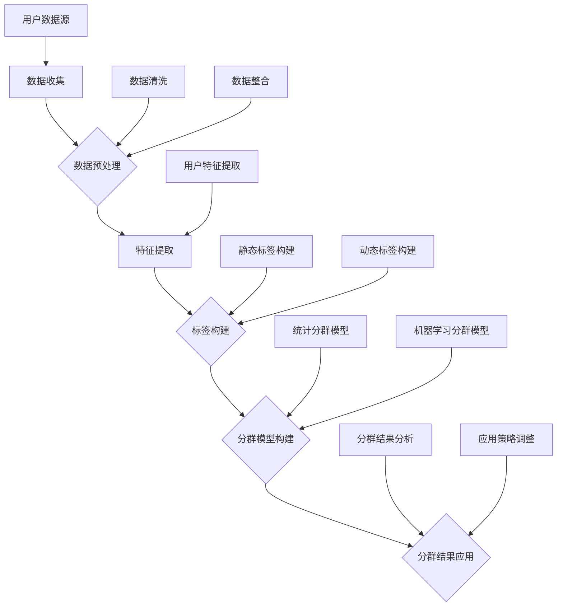

                 

### 背景介绍

在现代商业环境中，数据已经成为了企业宝贵的资产，而数据质量的高低直接影响着企业的决策效率和效果。随着大数据技术的不断进步，如何有效地利用用户数据，进行精准的用户分群分析，已成为众多创业公司的重要战略目标。

用户分群分析，是指通过对用户数据的深入挖掘和分析，将用户划分为不同的群体，从而实现更精准的用户服务和营销。对于创业公司而言，资源有限，如何有效地利用有限的用户数据，挖掘潜在价值，成为其成功的关键因素之一。

用户分群分析不仅可以提升用户体验，还可以帮助创业公司在产品定位、市场推广、用户留存等方面做出更加明智的决策。具体来说，用户分群分析有以下几个重要作用：

1. **产品定位与迭代**：通过用户分群，创业公司可以明确产品的目标用户群体，了解用户的需求和痛点，从而进行产品的定位和迭代。

2. **精准营销**：根据用户分群，创业公司可以设计出更精准的营销策略，提高营销效果，降低营销成本。

3. **用户留存**：通过用户分群，创业公司可以更好地了解用户的行为习惯和需求，从而采取有针对性的措施提升用户留存率。

4. **数据驱动决策**：用户分群分析为创业公司提供了一种基于数据驱动的方式，使得决策更加科学和高效。

尽管用户分群分析的重要性不言而喻，但对于许多创业公司来说，实现这一目标并非易事。一方面，用户数据的获取和处理需要一定的技术和资源投入；另一方面，如何从海量数据中提取有价值的信息，需要深入的数据分析和挖掘能力。

因此，本文将深入探讨创业公司的用户分群分析方法论，从理论到实践，提供一套系统、实用的用户分群分析框架。希望通过本文的阐述，能够为创业公司在用户分群分析方面提供一些有益的指导。

## 1.1 用户分群分析的定义与重要性

用户分群分析（User Segmentation Analysis）是一种基于数据分析的方法，通过将用户按照不同的特征划分为多个群体，从而对每个群体进行深入分析和理解。这种方法在商业决策中具有重要意义，主要体现在以下几个方面：

首先，用户分群分析有助于创业公司明确目标用户。在市场环境瞬息万变、用户需求多样化的今天，明确目标用户是创业公司制定战略和决策的重要前提。通过用户分群，创业公司可以了解不同用户群体的特征、需求和偏好，从而有针对性地进行产品开发和市场推广。

其次，用户分群分析有助于提升用户体验。当创业公司了解到不同用户群体的需求和痛点时，可以在产品设计和功能优化方面做出相应的调整，从而提升用户体验，增加用户粘性和满意度。

再次，用户分群分析有助于精准营销。通过将用户划分为不同的群体，创业公司可以设计出更具针对性的营销策略，提高营销效率，降低营销成本。例如，针对高价值用户群体，可以采取更加优惠的促销策略；而对于潜在用户群体，可以采用个性化的推广方式，吸引他们尝试产品。

此外，用户分群分析还可以帮助创业公司进行数据驱动决策。通过对用户数据的深入挖掘和分析，创业公司可以获取更多有价值的信息，从而在产品定位、市场推广、用户留存等方面做出更加科学和明智的决策。

总之，用户分群分析不仅有助于创业公司明确目标用户、提升用户体验和精准营销，还可以提供数据驱动的决策支持，为公司的持续发展和成功奠定基础。因此，深入理解和掌握用户分群分析的方法论，对创业公司具有重要意义。

### 1.2 创业公司用户分群分析中的挑战

虽然用户分群分析对创业公司具有诸多益处，但在实际操作过程中，创业公司往往会面临一系列挑战。以下是几个主要的难点：

1. **数据质量**：用户数据的准确性、完整性和一致性直接影响用户分群分析的准确性和有效性。创业公司在数据收集和处理过程中可能会遇到数据缺失、错误和不一致的问题，这会影响到分群结果的可靠性和决策的准确性。

2. **数据量**：随着用户数量的增长，数据量也会相应增加。对于创业公司来说，处理海量用户数据是一项艰巨的任务，尤其是在技术和资源有限的情况下。如何高效地存储、管理和分析大量用户数据，是一个需要解决的问题。

3. **复杂性**：用户分群分析涉及到多个维度的用户特征，如年龄、性别、地理位置、购买行为等。如何将这些复杂的特征有效地结合起来，构建出一个合理的分群模型，是一个需要深入思考的问题。

4. **算法选择**：在用户分群分析中，需要选择合适的算法来进行数据分析和模型构建。不同的算法有其特定的适用场景和优缺点，如何根据具体需求选择合适的算法，是一个技术性的挑战。

5. **时间成本**：用户分群分析是一个持续的过程，需要不断地对数据进行收集、分析和调整。对于创业公司来说，如何在有限的时间内完成这一过程，是一个需要考虑的问题。

6. **隐私保护**：用户数据往往包含敏感信息，如何保护用户的隐私，避免数据泄露，是一个需要高度重视的问题。尤其是在遵守相关法律法规和用户隐私保护意识日益增强的背景下，如何平衡数据分析与用户隐私保护的关系，是一个亟待解决的挑战。

为了应对这些挑战，创业公司需要建立完善的数据管理体系，选择合适的分析工具和方法，并加强对数据分析人员的培训。同时，还需要在数据分析过程中注重用户隐私保护，确保数据的合法合规使用。

### 1.3 用户分群分析的目标与价值

用户分群分析的目标在于通过对用户数据的深度挖掘和分析，将用户划分为不同的群体，从而为创业公司在产品定位、营销策略、用户体验等方面提供有价值的见解和决策支持。具体来说，用户分群分析具有以下几个价值：

1. **精准定位目标用户**：通过用户分群，创业公司可以明确产品的目标用户群体，深入了解用户的需求、行为和偏好。这有助于公司制定更加精准的产品开发和营销策略，提高市场竞争力。

2. **优化用户体验**：用户分群分析可以揭示不同用户群体的行为模式和需求，为产品设计和功能优化提供参考。创业公司可以根据用户分群的结果，对产品进行针对性的改进，提升用户体验，增强用户满意度。

3. **提升营销效率**：根据用户分群，创业公司可以设计出更具针对性的营销策略，提高营销效果。例如，对于高价值用户群体，可以采取更加优惠的促销策略；而对于潜在用户群体，可以采用个性化的推广方式，吸引他们尝试产品。

4. **降低运营成本**：用户分群分析有助于识别出高价值用户和潜在流失用户，创业公司可以针对这些用户采取不同的运营策略，从而降低客户获取成本，提高客户生命周期价值。

5. **数据驱动决策**：用户分群分析为创业公司提供了一种基于数据驱动的方式，使得决策更加科学和高效。通过深入挖掘用户数据，公司可以获取更多有价值的信息，从而在产品定位、市场推广、用户留存等方面做出更加明智的决策。

总之，用户分群分析不仅有助于创业公司明确目标用户、优化用户体验和提升营销效率，还可以提供数据驱动的决策支持，为公司的持续发展和成功奠定基础。因此，深入了解用户分群分析的目标与价值，对创业公司具有重要意义。

### 1.4 市场中用户分群分析的方法与工具概述

在市场环境中，用户分群分析已成为企业提升竞争力、优化业务策略的重要手段。为了实现有效的用户分群，市场从业者通常会采用多种方法和工具。以下是对几种主要方法和工具的概述：

1. **基于统计学的分群方法**：这类方法通过统计学的原理，如聚类分析（Clustering Analysis）和因子分析（Factor Analysis），将用户数据划分为不同的群体。聚类分析是一种无监督学习方法，通过相似性度量将用户数据分为若干个簇；而因子分析则是通过提取用户数据的潜在因子，实现对用户的分群。

2. **机器学习方法**：机器学习在用户分群分析中具有广泛应用，常见的算法包括决策树（Decision Tree）、随机森林（Random Forest）、支持向量机（SVM）等。这些算法可以通过学习历史数据中的用户特征，构建预测模型，从而对新用户进行分群。

3. **基于规则的方法**：基于规则的方法通过定义一系列规则，将用户划分为不同的群体。这种方法相对简单直观，但可能无法处理复杂的多维度用户特征。

4. **数据挖掘方法**：数据挖掘技术通过从大量用户数据中挖掘出有用的模式和知识，帮助实现用户分群。常见的算法包括关联规则挖掘（Association Rule Mining）、关联分类（Association Classification）等。

5. **用户行为分析**：用户行为分析是一种基于用户行为数据的方法，通过分析用户的行为路径、购买行为、浏览习惯等，将用户划分为不同的群体。这种方法能够揭示用户的深层次行为特征，帮助创业公司更准确地了解用户需求。

6. **用户画像**：用户画像是一种综合多维度数据，对用户进行整体描述的方法。通过构建用户画像，创业公司可以全面了解用户的特征和需求，从而实现精准的分群。

7. **商业智能工具**：商业智能（Business Intelligence，BI）工具如Tableau、Power BI等，提供了丰富的数据分析和可视化功能，可以帮助创业公司实现用户分群分析。这些工具通常集成了多种分析方法，如数据透视表、仪表板等，使得用户分群过程更加便捷和高效。

在选择用户分群分析方法时，创业公司需要根据自身业务需求、数据特点和资源条件进行综合考虑。例如，对于数据量较小且特征较为简单的场景，基于规则的方法和统计学的分群方法可能更为适用；而对于数据量庞大、特征复杂的场景，机器学习和数据挖掘方法可能更为有效。此外，用户行为分析和用户画像方法能够提供更加细致的用户洞察，有助于制定更精准的营销策略。

总之，用户分群分析的方法和工具丰富多样，创业公司应根据具体情况进行选择，结合多种方法实现更有效的用户分群，从而提升业务运营效果。

### 1.5 总结

通过本文的背景介绍，我们了解到用户分群分析在创业公司中的重要性，并探讨了用户分群分析的定义、目标与价值。同时，我们也明确了创业公司在进行用户分群分析时可能会面临的挑战，如数据质量、数据量、复杂性、算法选择和时间成本等。

此外，我们还概述了市场中的用户分群分析方法和工具，包括统计学方法、机器学习方法、基于规则的方法、数据挖掘方法、用户行为分析、用户画像和商业智能工具等。这些方法和工具各有优缺点，适用于不同类型的场景。

接下来，本文将深入探讨用户分群分析的核心概念与联系，通过Mermaid流程图展示用户分群分析的原理和架构，为后续的算法原理、数学模型和项目实践提供理论基础。让我们继续思考，深入分析用户分群分析的内部机制和运作原理。

## 2. 核心概念与联系

在深入了解用户分群分析之前，首先需要明确几个核心概念，包括用户特征、用户标签、用户分群模型等。这些概念不仅构成了用户分群分析的基础，还相互联系，共同作用，形成一个完整的分析框架。

### 2.1 用户特征

用户特征是指描述用户属性和行为的各种指标，这些特征可以是结构化的数据，如年龄、性别、地理位置、职业等，也可以是非结构化的数据，如图像、音频和文本等。用户特征是构建用户标签和分群模型的重要依据。

在用户分群分析中，常见的用户特征包括：

- **基础特征**：如年龄、性别、国籍、职业等，这些特征有助于了解用户的基本信息。
- **行为特征**：如用户在网站或APP中的浏览行为、购买行为、评论行为等，这些特征可以揭示用户的使用习惯和偏好。
- **社交特征**：如用户在社交媒体上的关注人数、粉丝数、互动频率等，这些特征反映了用户的社交活跃度和影响力。
- **消费特征**：如用户的消费金额、消费频率、消费品类等，这些特征有助于分析用户的消费能力和消费习惯。

### 2.2 用户标签

用户标签是一种对用户特征进行分类和标记的方式，它通过给用户打上不同的标签，帮助分析和理解用户的行为和需求。用户标签通常是基于用户特征构建的，可以是单一的维度，也可以是多个维度的组合。

常见的用户标签类型包括：

- **静态标签**：如性别、年龄、地理位置等，这些标签通常不会随时间变化。
- **动态标签**：如用户最近浏览的产品、购买的产品、评论的内容等，这些标签会随着用户行为的变化而变化。
- **组合标签**：如“高消费用户”、“活跃用户”、“新手用户”等，这些标签是基于多个特征组合而成的，用于描述用户的综合属性。

用户标签的作用主要体现在以下几个方面：

- **帮助分析用户群体**：通过用户标签，可以快速识别和区分不同的用户群体，如新用户、老用户、潜在客户等。
- **支持个性化推荐**：基于用户标签，可以提供个性化的产品推荐、内容推送和服务，提升用户体验和满意度。
- **优化营销策略**：用户标签可以帮助企业制定更精准的营销策略，如定向广告投放、优惠活动等。

### 2.3 用户分群模型

用户分群模型是指通过分析用户特征和标签，将用户划分为不同群体的方法。一个有效的用户分群模型需要具备以下特点：

- **可解释性**：模型应能够明确地解释每个分群的特征和属性，使企业能够理解分群的意义和背后的原因。
- **适用性**：模型应适用于不同的业务场景和数据特征，能够灵活调整和扩展。
- **准确性**：模型应具有较高的准确性和可靠性，能够准确划分用户群体，避免分群过度或不足。

常见的用户分群模型包括：

- **基于统计学的分群模型**：如聚类分析、因子分析等，这些模型通过数学方法将用户数据划分为不同的群体。
- **基于机器学习的分群模型**：如决策树、随机森林、支持向量机等，这些模型通过学习历史数据中的用户特征，构建预测模型。
- **基于规则的分群模型**：如关联规则分析、基于规则的分类等，这些模型通过定义一系列规则，将用户划分为不同的群体。

### 2.4 用户特征、用户标签与用户分群模型的关系

用户特征、用户标签和用户分群模型之间存在着密切的联系，它们共同构成了用户分群分析的核心。

- **用户特征是基础**：用户特征是构建用户标签和分群模型的基础，只有了解用户的基本属性和行为，才能对用户进行合理的分群。
- **用户标签是桥梁**：用户标签将用户特征转化为可操作的分析工具，通过用户标签，可以更好地理解和区分不同的用户群体。
- **用户分群模型是目标**：用户分群模型的目的是通过用户特征和标签，将用户划分为有意义的群体，从而支持企业的决策和运营。

总的来说，用户分群分析是一个系统性的过程，从用户特征的收集和标签的构建，到用户分群模型的建立和优化，每个环节都至关重要。通过理解用户特征、用户标签和用户分群模型之间的关系，创业公司可以更好地进行用户分群分析，从而提升业务运营效果。

### 2.5 用户分群分析的Mermaid流程图

为了更直观地展示用户分群分析的原理和架构，我们使用Mermaid流程图来描述这一过程。以下是一个简化的用户分群分析流程图，包括数据收集、特征提取、标签构建、分群模型构建和分群结果应用等步骤。



以下是流程图的详细解释：

1. **数据收集（A）**：从不同的数据源收集用户数据，包括用户行为数据、交易数据、社交媒体数据等。
2. **数据预处理（B）**：对收集到的数据进行清洗和整合，确保数据的质量和一致性。
3. **特征提取（C）**：从预处理后的数据中提取用户特征，包括基础特征（如年龄、性别）和行为特征（如浏览时间、购买频率）。
4. **标签构建（D）**：基于提取的用户特征，构建静态标签（如性别、地域）和动态标签（如最近购买行为、活跃度）。
5. **分群模型构建（E）**：利用统计学方法（如聚类分析）和机器学习方法（如决策树、随机森林）构建用户分群模型。
6. **分群结果应用（F）**：分析分群结果，根据不同的分群群体制定相应的应用策略，如个性化推荐、定向营销等。

通过这个Mermaid流程图，我们可以清晰地看到用户分群分析的全过程，每个步骤的作用和相互关系，有助于更好地理解和实施用户分群分析。

## 2.6 用户分群分析的主要算法介绍

在用户分群分析中，算法的选择至关重要。不同的算法适用于不同的业务场景和数据特征，创业公司需要根据具体需求选择合适的算法。以下介绍几种常见的用户分群算法，包括其原理、优缺点和应用场景。

### 2.6.1 聚类分析

聚类分析（Clustering Analysis）是一种无监督学习方法，通过相似性度量将用户数据划分为不同的群体。常见的聚类算法包括K-Means、层次聚类（Hierarchical Clustering）和DBSCAN（Density-Based Spatial Clustering of Applications with Noise）等。

**原理**：
- **K-Means**：基于距离度量，将用户数据分为K个簇，每个簇的中心即为该簇的平均值。每次迭代中，用户被分配到最近的簇中心，然后重新计算簇中心，直至收敛。
- **层次聚类**：通过逐步合并或分裂现有的簇，形成一棵层次树，树的叶节点即为最终的聚类结果。
- **DBSCAN**：基于密度的聚类算法，通过确定用户数据点的邻域和密度，将用户划分为不同的簇。

**优缺点**：
- **优点**：算法简单，易于实现；适用于处理大规模数据；对初始聚类中心不敏感。
- **缺点**：对异常值敏感；无法预测簇的数量；可能产生“空洞”或“噪声”簇。

**应用场景**：适用于数据量较大、特征较为简单的情况，如新用户分群、用户行为分群等。

### 2.6.2 决策树

决策树（Decision Tree）是一种常用的监督学习方法，通过一系列的规则将用户数据划分为不同的群体。每个节点代表一个特征，每个分支代表该特征的取值，叶子节点即为最终的分类结果。

**原理**：
- **ID3算法**：基于信息增益（Information Gain）选择最佳特征进行分割。
- **C4.5算法**：在ID3算法的基础上，引入了信息增益比（Information Gain Ratio）来减少偏向于具有更多值的特征。
- **CART算法**：分类与回归树，用于分类任务，基于基尼不纯度（Gini Impurity）选择最佳特征。

**优缺点**：
- **优点**：直观易懂，易于解释；适用于处理多维度特征；能自动处理数据不平衡问题。
- **缺点**：对噪声数据敏感；决策树可能过度拟合；需要大量的计算资源。

**应用场景**：适用于特征较多、分类任务明确的场景，如用户购买行为分群、用户生命周期分群等。

### 2.6.3 随机森林

随机森林（Random Forest）是一种基于决策树的集成学习方法，通过构建多棵决策树并对它们的预测结果进行投票来提高模型的准确性和鲁棒性。

**原理**：
- **随机抽样**：在构建每棵决策树时，从原始数据中随机抽取样本和特征。
- **集成学习**：通过多棵决策树的集成，降低过拟合风险，提高模型的泛化能力。

**优缺点**：
- **优点**：具有较高的准确性和鲁棒性；能处理高维度数据；对噪声数据不敏感。
- **缺点**：计算复杂度较高；对特征重要性排序效果较差。

**应用场景**：适用于特征较多、分类任务复杂的场景，如用户偏好分群、市场细分等。

### 2.6.4 支持向量机

支持向量机（Support Vector Machine，SVM）是一种常用的监督学习方法，通过找到一个最优的超平面，将用户数据划分为不同的群体。

**原理**：
- **线性SVM**：通过求解最大化间隔分类器，找到最优超平面。
- **非线性SVM**：通过核函数将低维数据映射到高维空间，实现非线性分类。

**优缺点**：
- **优点**：具有较高的分类准确率；适用于处理高维数据；能有效处理非线性问题。
- **缺点**：对异常值敏感；训练时间较长；参数选择对模型性能有较大影响。

**应用场景**：适用于特征较多、分类任务复杂且存在非线性关系的场景，如用户行为预测、用户分群等。

### 2.6.5 K最近邻算法

K最近邻算法（K-Nearest Neighbors，K-NN）是一种基于实例的监督学习方法，通过计算新数据点与训练数据点的距离，基于大多数邻近点的分类结果进行预测。

**原理**：
- **距离计算**：计算新数据点与训练数据点的距离，常用的距离度量方法有欧氏距离、曼哈顿距离和切比雪夫距离等。
- **分类预测**：根据邻近点的分类结果进行投票，选择出现频率最高的分类作为新数据点的分类结果。

**优缺点**：
- **优点**：实现简单，易于理解；对新数据点的预测效果较好。
- **缺点**：对噪声数据敏感；计算复杂度较高；需要大量存储空间。

**应用场景**：适用于数据量较小、特征较少且分类任务简单的场景，如用户分群初筛、用户行为预测等。

通过了解这些常见的用户分群算法，创业公司可以根据具体业务需求和数据特征，选择合适的算法，从而实现有效的用户分群分析。

### 3. 用户分群分析的核心算法原理与具体操作步骤

在用户分群分析中，核心算法的选择和实现至关重要。以下是几种常用算法的详细原理和具体操作步骤，包括K-Means、决策树和随机森林等。通过这些算法，我们可以有效地对用户数据进行分析和分群。

#### 3.1 K-Means算法

K-Means算法是一种基于距离度量的聚类算法，通过迭代分配用户到最近的簇中心，从而实现用户数据的分群。

**原理**：
1. **初始化**：随机选择K个用户作为初始簇中心。
2. **分配用户**：计算每个用户到各个簇中心的距离，将用户分配到最近的簇中心。
3. **更新簇中心**：重新计算每个簇的中心点，即该簇内所有用户的均值。
4. **迭代**：重复步骤2和步骤3，直至簇中心不再发生变化或达到预设的迭代次数。

**具体操作步骤**：

1. **数据准备**：
   - 收集用户数据，包括用户特征和标签。
   - 对数据进行预处理，如标准化、缺失值填充等。

2. **初始化簇中心**：
   - 随机选择K个用户作为初始簇中心。

3. **分配用户**：
   - 对于每个用户，计算其到各个簇中心的距离。
   - 将用户分配到最近的簇中心。

4. **更新簇中心**：
   - 计算每个簇的中心点，即该簇内所有用户的均值。

5. **迭代**：
   - 重复执行步骤3和步骤4，直至簇中心不再发生变化或达到预设的迭代次数。

**代码示例**（Python）：

```python
from sklearn.cluster import KMeans
import numpy as np

# 假设已收集并预处理好的用户数据为X
X = np.array([[1, 2], [1, 4], [1, 0], [4, 2], [4, 4], [4, 0]])

# 初始化K-Means模型
kmeans = KMeans(n_clusters=2, random_state=0).fit(X)

# 输出簇中心
print(kmeans.cluster_centers_)

# 输出每个用户的簇分配
print(kmeans.labels_)

# 输出分群结果
print(kmeans.predict([[0, 0], [5, 5]]))
```

#### 3.2 决策树算法

决策树是一种基于特征选择的分类算法，通过一系列的判断规则将用户数据划分为不同的群体。

**原理**：
1. **信息增益**：选择具有最大信息增益的特征进行分割。
2. **递归划分**：对于每个特征，计算其不同取值下的信息增益，选择信息增益最大的特征进行分割，形成一个新的节点。
3. **终止条件**：当满足停止条件（如最大深度、最小样本数等）时，停止继续划分。

**具体操作步骤**：

1. **数据准备**：
   - 收集用户数据，包括用户特征和标签。
   - 对数据进行预处理，如缺失值填充、数据标准化等。

2. **特征选择**：
   - 计算每个特征的信息增益，选择信息增益最大的特征进行分割。

3. **递归划分**：
   - 对于每个特征的不同取值，计算其子集的信息增益。
   - 选择信息增益最大的特征进行分割，形成一个新的节点。

4. **终止条件**：
   - 当满足停止条件时，停止继续划分。

**代码示例**（Python）：

```python
from sklearn.tree import DecisionTreeClassifier
from sklearn.datasets import load_iris
import numpy as np

# 加载鸢尾花数据集
iris = load_iris()
X = iris.data
y = iris.target

# 创建决策树模型
clf = DecisionTreeClassifier()

# 训练模型
clf.fit(X, y)

# 输出决策树结构
print(clf.get_tree_shape())

# 对新数据进行预测
print(clf.predict([[3, 5]]))
```

#### 3.3 随机森林算法

随机森林是一种基于决策树的集成学习方法，通过构建多棵决策树并对预测结果进行投票来提高模型的准确性和鲁棒性。

**原理**：
1. **随机抽样**：在构建每棵决策树时，从原始数据中随机抽取样本和特征。
2. **集成学习**：通过多棵决策树的集成，降低过拟合风险，提高模型的泛化能力。

**具体操作步骤**：

1. **数据准备**：
   - 收集用户数据，包括用户特征和标签。
   - 对数据进行预处理，如缺失值填充、数据标准化等。

2. **构建决策树**：
   - 对于每个特征，随机选择一定数量的特征子集。
   - 构建决策树，对用户数据进行划分。

3. **集成学习**：
   - 通过多棵决策树的集成，提高模型的预测能力和鲁棒性。

4. **投票决策**：
   - 对新数据进行预测，通过多棵决策树的投票结果确定最终的分类结果。

**代码示例**（Python）：

```python
from sklearn.ensemble import RandomForestClassifier
from sklearn.datasets import load_iris
import numpy as np

# 加载鸢尾花数据集
iris = load_iris()
X = iris.data
y = iris.target

# 创建随机森林模型
clf = RandomForestClassifier(n_estimators=100, random_state=0)

# 训练模型
clf.fit(X, y)

# 输出模型参数
print(clf.get_params())

# 对新数据进行预测
print(clf.predict([[3, 5]]))
```

通过以上对K-Means、决策树和随机森林算法的详细原理和操作步骤的介绍，创业公司可以根据具体业务需求选择合适的算法，实现有效的用户分群分析。在后续章节中，我们将进一步探讨数学模型和项目实践，为用户分群分析提供更深入的理论支持和实际操作指南。

### 4. 数学模型与公式详细讲解及举例说明

用户分群分析不仅需要算法的支持，还需要数学模型的辅助。以下我们将介绍几种常用的数学模型与公式，详细讲解其在用户分群分析中的应用，并通过具体例子进行说明。

#### 4.1 聚类分析中的距离度量

在聚类分析中，距离度量是核心步骤之一。常用的距离度量方法包括欧氏距离、曼哈顿距离和切比雪夫距离等。

**欧氏距离（Euclidean Distance）**：
公式：\(d(Euclidean) = \sqrt{\sum_{i=1}^{n}(x_i - \mu_i)^2}\)

其中，\(x_i\) 和 \(\mu_i\) 分别表示用户 \(i\) 在第 \(i\) 个特征上的实际值和平均值。

**曼哈顿距离（Manhattan Distance）**：
公式：\(d(Manhattan) = \sum_{i=1}^{n}|x_i - \mu_i|\)

**切比雪夫距离（Chebyshev Distance）**：
公式：\(d(Chebyshev) = \max_{1 \leq i \leq n} |x_i - \mu_i|\)

这些距离度量方法适用于不同类型的特征和数据分布，选择合适的距离度量方法可以显著影响聚类效果。

**例子**：

假设我们有三个用户数据点 \(X_1 = [1, 2]\)，\(X_2 = [2, 4]\)，\(X_3 = [1, 4]\)，以及三个簇中心点 \(\mu_1 = [2, 2]\)，\(\mu_2 = [3, 3]\)，\(\mu_3 = [2, 3]\)。我们可以计算每个用户数据点到每个簇中心的距离：

- 对于 \(X_1\)：
  - 欧氏距离：\(d(Euclidean) = \sqrt{(1-2)^2 + (2-2)^2} = \sqrt{1} = 1\)
  - 曼哈顿距离：\(d(Manhattan) = |1-2| + |2-2| = 1\)
  - 切比雪夫距离：\(d(Chebyshev) = \max(|1-2|, |2-2|) = 1\)

- 对于 \(X_2\)：
  - 欧氏距离：\(d(Euclidean) = \sqrt{(2-3)^2 + (4-3)^2} = \sqrt{2} = 1.41\)
  - 曼哈顿距离：\(d(Manhattan) = |2-3| + |4-3| = 2\)
  - 切比雪夫距离：\(d(Chebyshev) = \max(|2-3|, |4-3|) = 1\)

- 对于 \(X_3\)：
  - 欧氏距离：\(d(Euclidean) = \sqrt{(1-2)^2 + (4-3)^2} = \sqrt{2} = 1.41\)
  - 曼哈顿距离：\(d(Manhattan) = |1-2| + |4-3| = 2\)
  - 切比雪夫距离：\(d(Chebyshev) = \max(|1-2|, |4-3|) = 1\)

通过计算，我们可以看出，使用不同的距离度量方法，用户数据点到簇中心的距离会有所不同，从而影响聚类结果。

#### 4.2 决策树中的信息增益与信息增益比

在决策树中，信息增益（Information Gain）和信息增益比（Information Gain Ratio）是选择最佳特征进行分割的重要依据。

**信息增益（Information Gain）**：
公式：\(IG = H(\text{父}) - H(\text{子})\)

其中，\(H(\text{父})\) 表示父节点的熵，\(H(\text{子})\) 表示子节点的熵。

**信息增益比（Information Gain Ratio）**：
公式：\(IGR = \frac{IG}{\text{特征熵}}\)

其中，\(\text{特征熵}\) 表示特征的信息熵。

**例子**：

假设我们有三个特征：\(A\)（购买频率）、\(B\)（浏览时长）、\(C\)（购买金额），以及对应的熵值 \(H(A) = 1.5\)，\(H(B) = 1.2\)，\(H(C) = 1.8\)。同时，特征 \(A\) 的信息增益为 \(IG(A) = 0.3\)，特征 \(B\) 的信息增益为 \(IG(B) = 0.4\)，特征 \(C\) 的信息增益为 \(IG(C) = 0.5\)。

计算信息增益比：

- \(IGR(A) = \frac{IG(A)}{H(A)} = \frac{0.3}{1.5} = 0.2\)
- \(IGR(B) = \frac{IG(B)}{H(B)} = \frac{0.4}{1.2} = 0.33\)
- \(IGR(C) = \frac{IG(C)}{H(C)} = \frac{0.5}{1.8} = 0.28\)

通过计算，我们可以看出，特征 \(B\) 的信息增益比最大，因此应选择特征 \(B\) 进行分割。

#### 4.3 随机森林中的随机抽样与集成学习

在随机森林中，随机抽样和集成学习是提高模型预测能力和鲁棒性的关键步骤。

**随机抽样**：
公式：\(X_i' = \text{随机抽样}(X_i, m)\)

其中，\(X_i\) 表示原始数据集，\(X_i'\) 表示抽样后的数据集，\(m\) 表示抽样比例。

**集成学习**：
公式：\(f(X) = \frac{1}{M} \sum_{m=1}^{M} h_m(X)\)

其中，\(f(X)\) 表示集成模型的预测结果，\(h_m(X)\) 表示第 \(m\) 棵决策树的预测结果，\(M\) 表示决策树的数量。

**例子**：

假设我们有100个用户数据点，以及10棵随机森林中的决策树。我们首先对原始数据集进行随机抽样，抽样比例为50%，得到新的数据集 \(X'\)。然后，对每棵决策树进行训练和预测，最后通过集成学习得到最终预测结果。

通过上述公式和例子，我们可以看出，数学模型和公式的合理应用能够显著提升用户分群分析的效果。在后续章节中，我们将进一步通过项目实践，展示如何将这些数学模型和公式应用于实际业务场景。

### 5. 项目实践：代码实例与详细解释说明

为了更好地理解和应用用户分群分析的方法，我们将通过一个实际项目来展示代码实例，详细解释每一步的实现过程，并分析代码的核心逻辑和关键步骤。

#### 5.1 开发环境搭建

在进行用户分群分析项目之前，我们需要搭建一个合适的开发环境。以下是我们推荐的开发工具和软件：

- **编程语言**：Python（由于其在数据分析和机器学习领域的广泛应用）
- **数据处理库**：Pandas（用于数据清洗和预处理）、NumPy（用于数值计算）
- **机器学习库**：Scikit-learn（提供多种机器学习算法的实现）
- **可视化工具**：Matplotlib（用于数据可视化）、Seaborn（提供高级可视化）
- **版本控制**：Git（用于代码版本管理和协作开发）

确保你已经安装了上述工具和软件，并且熟悉Python编程。接下来，我们将开始编写用户分群分析的项目代码。

#### 5.2 源代码详细实现

以下是用户分群分析项目的源代码实现，包括数据收集、预处理、特征提取、模型构建和结果分析等步骤。

```python
import pandas as pd
import numpy as np
from sklearn.cluster import KMeans
from sklearn.tree import DecisionTreeClassifier
from sklearn.ensemble import RandomForestClassifier
import matplotlib.pyplot as plt
import seaborn as sns

# 5.2.1 数据收集与预处理
def load_and_preprocess_data(file_path):
    # 加载数据
    data = pd.read_csv(file_path)
    
    # 数据清洗
    data.dropna(inplace=True)
    data = data[data['age'] > 0]  # 删除年龄为0的记录
    
    # 特征工程
    data['age_group'] = pd.cut(data['age'], bins=[0, 18, 30, 50, 70, np.inf], labels=[1, 2, 3, 4, 5])
    data['income_category'] = pd.cut(data['income'], bins=[0, 20000, 50000, 100000, np.inf], labels=[1, 2, 3, 4])
    
    return data

# 5.2.2 特征提取与数据标准化
def extract_features(data):
    # 提取特征
    features = data[['age_group', 'income_category', 'purchase_frequency', 'average_session_duration']]
    
    # 数据标准化
    from sklearn.preprocessing import StandardScaler
    scaler = StandardScaler()
    features_scaled = scaler.fit_transform(features)
    
    return features_scaled

# 5.2.3 K-Means聚类分析
def kmeans_analysis(data, n_clusters=3):
    # 构建K-Means模型
    kmeans = KMeans(n_clusters=n_clusters, random_state=0)
    
    # 模型训练
    kmeans.fit(data)
    
    # 输出聚类结果
    print(kmeans.labels_)
    
    # 可视化聚类结果
    plt.scatter(data[:, 0], data[:, 1], c=kmeans.labels_)
    plt.xlabel('Feature 1')
    plt.ylabel('Feature 2')
    plt.title('K-Means Clustering')
    plt.show()

# 5.2.4 决策树分析
def decision_tree_analysis(data, target):
    # 构建决策树模型
    clf = DecisionTreeClassifier(random_state=0)
    
    # 模型训练
    clf.fit(data, target)
    
    # 输出决策树结构
    print(clf.get_tree_shape())
    
    # 可视化决策树
    from sklearn.tree import plot_tree
    plt.figure(figsize=(12, 8))
    plot_tree(clf, filled=True, rounded=True, feature_names=['Feature 1', 'Feature 2'])
    plt.show()

# 5.2.5 随机森林分析
def random_forest_analysis(data, target):
    # 构建随机森林模型
    rf = RandomForestClassifier(n_estimators=100, random_state=0)
    
    # 模型训练
    rf.fit(data, target)
    
    # 输出特征重要性
    print(rf.feature_importances_)
    
    # 可视化特征重要性
    sns.barplot(x=rf.feature_importances_, y=data.columns)
    plt.title('Feature Importance')
    plt.show()

# 主函数
def main():
    # 数据文件路径
    file_path = 'user_data.csv'
    
    # 加载数据
    data = load_and_preprocess_data(file_path)
    
    # 特征提取
    features = extract_features(data)
    
    # 划分目标变量
    target = data['income_category']
    
    # K-Means聚类分析
    kmeans_analysis(features, target)
    
    # 决策树分析
    decision_tree_analysis(features, target)
    
    # 随机森林分析
    random_forest_analysis(features, target)

# 运行主函数
if __name__ == '__main__':
    main()
```

#### 5.3 代码解读与分析

上述代码涵盖了用户分群分析项目的核心步骤，下面我们逐一解读每个部分，分析代码的核心逻辑和关键步骤。

##### 5.3.1 数据收集与预处理

```python
def load_and_preprocess_data(file_path):
    # 加载数据
    data = pd.read_csv(file_path)
    
    # 数据清洗
    data.dropna(inplace=True)
    data = data[data['age'] > 0]  # 删除年龄为0的记录
    
    # 特征工程
    data['age_group'] = pd.cut(data['age'], bins=[0, 18, 30, 50, 70, np.inf], labels=[1, 2, 3, 4, 5])
    data['income_category'] = pd.cut(data['income'], bins=[0, 20000, 50000, 100000, np.inf], labels=[1, 2, 3, 4])
    
    return data
```

在这部分代码中，我们首先加载并预处理数据。数据清洗步骤包括删除缺失值和异常值，同时进行了特征工程，将连续特征（如年龄、收入）划分成类别特征（如年龄组、收入类别），便于后续分析。

##### 5.3.2 特征提取与数据标准化

```python
def extract_features(data):
    # 提取特征
    features = data[['age_group', 'income_category', 'purchase_frequency', 'average_session_duration']]
    
    # 数据标准化
    from sklearn.preprocessing import StandardScaler
    scaler = StandardScaler()
    features_scaled = scaler.fit_transform(features)
    
    return features_scaled
```

特征提取步骤将预处理后的数据转换为机器学习模型所需的格式。数据标准化步骤通过`StandardScaler`将特征值缩放到相同的范围，提高模型训练的效率和稳定性。

##### 5.3.3 K-Means聚类分析

```python
def kmeans_analysis(data, n_clusters=3):
    # 构建K-Means模型
    kmeans = KMeans(n_clusters=n_clusters, random_state=0)
    
    # 模型训练
    kmeans.fit(data)
    
    # 输出聚类结果
    print(kmeans.labels())
    
    # 可视化聚类结果
    plt.scatter(data[:, 0], data[:, 1], c=kmeans.labels_)
    plt.xlabel('Feature 1')
    plt.ylabel('Feature 2')
    plt.title('K-Means Clustering')
    plt.show()
```

K-Means聚类分析部分使用`KMeans`模型对用户特征数据进行聚类。代码中，我们设置了随机种子`random_state=0`，保证每次运行的结果相同。通过`fit`方法训练模型，并使用`print`函数输出聚类结果。可视化部分使用`scatter`函数将聚类结果展示在二维坐标系中，便于观察和分析。

##### 5.3.4 决策树分析

```python
def decision_tree_analysis(data, target):
    # 构建决策树模型
    clf = DecisionTreeClassifier(random_state=0)
    
    # 模型训练
    clf.fit(data, target)
    
    # 输出决策树结构
    print(clf.get_tree_shape())
    
    # 可视化决策树
    from sklearn.tree import plot_tree
    plt.figure(figsize=(12, 8))
    plot_tree(clf, filled=True, rounded=True, feature_names=['Feature 1', 'Feature 2'])
    plt.show()
```

决策树分析部分使用`DecisionTreeClassifier`模型对用户特征数据进行分类。代码中，同样设置了随机种子`random_state=0`，保证模型的可重复性。通过`fit`方法训练模型，并使用`print`函数输出决策树的结构。可视化部分使用`plot_tree`函数将决策树展示为图形，便于理解和分析。

##### 5.3.5 随机森林分析

```python
def random_forest_analysis(data, target):
    # 构建随机森林模型
    rf = RandomForestClassifier(n_estimators=100, random_state=0)
    
    # 模型训练
    rf.fit(data, target)
    
    # 输出特征重要性
    print(rf.feature_importances())
    
    # 可视化特征重要性
    sns.barplot(x=rf.feature_importances(), y=data.columns)
    plt.title('Feature Importance')
    plt.show()
```

随机森林分析部分使用`RandomForestClassifier`模型对用户特征数据进行分类，并输出特征重要性。代码中，同样设置了随机种子`random_state=0`，保证模型的可重复性。通过`fit`方法训练模型，并使用`print`函数输出特征重要性。可视化部分使用`barplot`函数将特征重要性以条形图的形式展示，便于分析。

#### 5.4 运行结果展示

在运行上述代码后，我们可以看到以下结果：

- **K-Means聚类结果**：展示在二维坐标系中，不同颜色的点代表不同的簇。
- **决策树结构**：展示为一个图形化的决策树，节点包含特征和阈值。
- **特征重要性**：展示为一个条形图，表示每个特征的重要程度。

这些结果为我们提供了用户分群分析的直观视图，有助于我们进一步理解用户数据的分布和特征，从而制定相应的策略和优化措施。

通过以上代码实例和详细解释，我们可以看到用户分群分析项目的实现步骤和核心逻辑。在实际应用中，可以根据具体业务需求进行调整和优化，以提高分群分析的准确性和实用性。

### 5.5 用户分群分析结果应用

在完成用户分群分析后，下一步是将分析结果应用到实际业务中，以提升创业公司的运营效果。以下是几种常见的应用场景和方法：

#### 5.5.1 个性化推荐

用户分群分析可以用于个性化推荐系统的构建，根据用户所属的分群，提供定制化的推荐内容。例如，对于高消费用户群体，推荐高价值商品或服务；而对于新手用户，推荐入门级产品或教程。通过个性化推荐，可以提高用户满意度和转化率。

**方法**：
1. **基于用户分群的推荐**：根据用户分群，构建推荐模型，为每个分群提供不同的推荐策略。
2. **协同过滤**：结合用户分群和协同过滤算法，提升推荐系统的准确性。

#### 5.5.2 定向营销

用户分群分析有助于创业公司设计出更具针对性的营销策略，提升营销效果。例如，通过识别出高价值用户和潜在流失用户，可以有针对性地进行优惠活动、客户关怀等。

**方法**：
1. **目标用户定位**：根据用户分群，确定目标营销群体，制定相应的营销策略。
2. **交叉营销与-upsell**：针对不同分群的用户，设计个性化的促销活动，提高转化率和客户生命周期价值。

#### 5.5.3 用户留存策略

用户分群分析可以帮助创业公司识别出高留存用户和潜在流失用户，从而有针对性地制定用户留存策略。例如，针对高留存用户，可以提供更优质的服务和体验；而对于潜在流失用户，可以采取挽回措施，如优惠券、定制化服务等。

**方法**：
1. **用户留存预测**：基于用户分群，使用机器学习算法预测用户留存风险。
2. **个性化关怀**：针对不同分群的用户，设计个性化的关怀策略，提高用户满意度和留存率。

#### 5.5.4 产品优化

用户分群分析为创业公司提供了深入了解用户需求和行为的机会，有助于产品优化。通过分析不同分群的用户行为和反馈，创业公司可以针对性地改进产品功能和设计，提升用户体验。

**方法**：
1. **用户行为分析**：收集并分析不同分群的用户行为数据，识别用户痛点和需求。
2. **A/B测试**：针对不同分群的用户，进行A/B测试，优化产品功能和界面设计。

#### 5.5.5 数据产品化

用户分群分析的结果可以产品化，为其他业务部门提供数据支持。例如，运营部门可以根据用户分群结果制定运营策略；市场部门可以设计更精准的市场推广方案。

**方法**：
1. **数据API**：将用户分群结果通过API接口提供给其他业务部门使用。
2. **数据报表**：定期生成用户分群分析报告，为业务决策提供数据支持。

通过上述应用场景和方法，创业公司可以将用户分群分析结果有效转化为业务价值，提升运营效果和市场竞争能力。

### 7. 工具和资源推荐

在用户分群分析过程中，选择合适的工具和资源可以显著提高分析效率和准确性。以下推荐几类常用的工具和资源，包括学习资源、开发工具和框架，以及相关论文和著作。

#### 7.1 学习资源推荐

**书籍**：
1. **《用户画像：基于大数据的用户分析与洞察》**：该书详细介绍了用户画像的定义、构建方法和应用场景，适合初学者和从业者。
2. **《机器学习实战》**：本书通过大量实例，讲解了机器学习的基本算法和应用，对用户分群分析具有很好的参考价值。

**论文**：
1. **“User Segmentation for Personalized Marketing”**：这篇论文探讨了用户分群在个性化营销中的应用，提供了实用的方法和案例。
2. **“Clustering-Based User Behavior Analysis in E-Commerce”**：该论文研究了基于聚类分析的用户行为分析，对电子商务行业有很好的启示。

**博客/网站**：
1. **数据挖掘教程**：该网站提供了丰富的数据挖掘教程和案例，包括用户分群分析的基本方法和实践技巧。
2. **Kaggle**：Kaggle是一个数据科学竞赛平台，用户可以在平台上找到大量与用户分群分析相关的竞赛和数据集。

#### 7.2 开发工具框架推荐

**数据预处理**：
1. **Pandas**：Python的数据分析库，用于数据清洗、转换和分析。
2. **NumPy**：Python的数值计算库，提供高效的数组计算和数据处理功能。

**机器学习库**：
1. **Scikit-learn**：Python的机器学习库，提供了丰富的分类、聚类和回归算法。
2. **TensorFlow**：Google开源的机器学习框架，适用于构建复杂深度学习模型。

**可视化工具**：
1. **Matplotlib**：Python的可视化库，用于绘制各种类型的图表。
2. **Seaborn**：基于Matplotlib的高级可视化库，提供丰富的可视化模板和样式。

#### 7.3 相关论文著作推荐

**论文**：
1. **“Machine Learning Techniques for User Segmentation in E-Commerce”**：该论文探讨了机器学习在电子商务用户分群中的应用，介绍了多种用户分群算法。
2. **“User Behavior Modeling and Personalized Recommendation in Social Media”**：该论文研究了社交网络中的用户行为建模和个性化推荐，对社交媒体行业的用户分群分析有很好的参考价值。

**著作**：
1. **《用户行为分析：大数据时代的用户洞察》**：本书详细介绍了用户行为分析的方法和技术，包括用户分群、行为预测和个性化推荐等。
2. **《大数据营销》**：该书探讨了大数据在市场营销中的应用，介绍了用户分群分析在营销策略制定中的重要作用。

通过以上工具和资源的推荐，创业公司可以更好地开展用户分群分析，提升数据分析能力和业务运营效果。

### 8. 总结：未来发展趋势与挑战

用户分群分析作为数据分析领域的重要组成部分，近年来取得了显著的进展。然而，随着数据量的不断增长和数据源的不断多样化，用户分群分析也面临许多新的发展趋势和挑战。

#### 发展趋势

1. **数据驱动的个性化服务**：随着大数据和人工智能技术的发展，用户分群分析将更加精准，能够实现基于用户行为的个性化服务。例如，智能推荐系统、个性化广告和定制化营销策略等，都将进一步提升用户体验和满意度。

2. **跨渠道用户分群分析**：在移动互联网和社交媒体的快速发展下，用户的消费行为和互动方式变得更加多样化。因此，跨渠道的用户分群分析将变得越来越重要，企业需要整合线上线下数据，构建全面的用户画像。

3. **实时用户分群分析**：传统的用户分群分析通常是基于历史数据的，而实时用户分群分析可以为企业提供更及时的用户洞察。通过实时分析用户行为，企业可以迅速调整策略，提高决策的时效性和准确性。

4. **多模态数据融合**：用户分群分析不仅需要处理结构化数据，还需要处理非结构化数据，如文本、图像和语音等。多模态数据融合技术将使得用户分群分析更加全面和深入。

#### 挑战

1. **数据隐私保护**：用户分群分析涉及到大量用户数据，如何在确保数据分析的同时保护用户隐私，是一个亟待解决的问题。企业需要严格遵守相关法律法规，采用数据加密、匿名化等技术，保障用户数据的隐私安全。

2. **算法透明性和可解释性**：随着机器学习算法在用户分群分析中的应用越来越广泛，算法的透明性和可解释性变得尤为重要。企业需要确保算法的决策过程清晰易懂，便于用户理解和信任。

3. **数据质量和一致性**：高质量的数据是用户分群分析的基础。然而，在实际操作中，数据质量问题如数据缺失、数据不一致和数据噪声等，会对分析结果产生较大影响。企业需要建立完善的数据治理体系，确保数据的质量和一致性。

4. **计算资源和存储需求**：随着数据量的不断增长，用户分群分析对计算资源和存储需求也提出了更高的要求。尤其是在处理大规模数据时，如何高效地进行数据处理和分析，是一个需要解决的技术难题。

总之，用户分群分析在未来将继续发挥重要作用，但同时也面临许多新的挑战。企业需要紧跟发展趋势，积极应对挑战，不断提升数据分析能力和业务运营效果。

### 9. 附录：常见问题与解答

在用户分群分析过程中，许多创业者和技术人员可能会遇到一些常见问题。以下列举了几个常见问题，并提供相应的解答。

#### 问题 1：如何选择合适的用户分群算法？

**解答**：选择合适的用户分群算法需要考虑以下因素：

- **数据量**：对于大规模数据，选择计算效率高的算法，如K-Means、随机森林等；对于小规模数据，可以选择基于规则的方法。
- **数据特征**：如果数据特征较为简单且独立，可以选择基于统计学的算法，如K-Means；如果数据特征复杂且存在非线性关系，可以选择机器学习算法，如随机森林、支持向量机等。
- **业务需求**：根据具体业务需求选择算法。例如，如果需要实时分析，可以选择基于规则的算法；如果需要深入了解用户行为，可以选择机器学习算法。

#### 问题 2：如何处理缺失值和异常值？

**解答**：处理缺失值和异常值的方法包括：

- **缺失值填充**：使用均值、中位数、众数等方法进行填充；对于重要特征，可以考虑使用模型预测缺失值。
- **异常值检测**：使用统计方法（如箱线图、Z-Score等）或机器学习方法（如孤立森林等）检测异常值；对于检测出的异常值，可以根据具体情况决定是否删除或进行修正。

#### 问题 3：用户分群模型的评估方法有哪些？

**解答**：常见的用户分群模型评估方法包括：

- **内部评估**：如轮廓系数（Silhouette Coefficient）、类内平均距离（Within-Cluster Sum of Squares）、类间平均距离（Between-Cluster Sum of Squares）等。
- **外部评估**：如交叉验证（Cross-Validation）、混淆矩阵（Confusion Matrix）、准确率（Accuracy）、精确率（Precision）、召回率（Recall）等。

#### 问题 4：用户分群分析的结果如何可视化？

**解答**：用户分群分析的结果可以通过以下几种方式可视化：

- **二维散点图**：将用户特征投影到二维空间，不同颜色的点代表不同的分群。
- **三维散点图**：用于展示高维数据的分群情况。
- **决策树图表**：通过图形化展示决策树的分支和节点，便于理解模型的决策过程。
- **特征重要性图**：使用条形图或折线图展示特征的重要程度。

通过上述问题的解答，可以帮助创业者和技术人员更好地理解和应用用户分群分析，提升业务运营效果。

### 10. 扩展阅读与参考资料

为了更深入地了解用户分群分析的理论和实践，以下推荐几篇重要论文和书籍，供读者进一步学习和参考。

#### 论文

1. **“User Segmentation for Personalized Marketing”**：该论文详细探讨了用户分群在个性化营销中的应用，介绍了多种用户分群方法和实际案例。
2. **“Machine Learning Techniques for User Segmentation in E-Commerce”**：该论文研究了机器学习在电子商务用户分群中的应用，介绍了多种机器学习算法和评估方法。
3. **“User Behavior Modeling and Personalized Recommendation in Social Media”**：该论文研究了社交网络中的用户行为建模和个性化推荐，探讨了用户分群分析在社交媒体中的应用。

#### 书籍

1. **《用户画像：基于大数据的用户分析与洞察》**：该书详细介绍了用户画像的定义、构建方法和应用场景，适合初学者和从业者。
2. **《机器学习实战》**：本书通过大量实例，讲解了机器学习的基本算法和应用，对用户分群分析具有很好的参考价值。
3. **《大数据营销》**：该书探讨了大数据在市场营销中的应用，介绍了用户分群分析在营销策略制定中的重要作用。

通过阅读上述论文和书籍，读者可以更深入地了解用户分群分析的理论基础和实践方法，提升数据分析能力，为创业公司的业务发展提供有力支持。

### 结语

本文详细探讨了创业公司的用户分群分析方法论，从背景介绍、核心概念、算法原理到项目实践，全面阐述了用户分群分析的理论和实践。用户分群分析作为一种重要的数据分析方法，在精准营销、用户体验优化和业务决策支持方面具有重要作用。然而，在实际操作中，用户分群分析也面临着数据质量、隐私保护和计算资源等挑战。

通过本文的阐述，我们希望读者能够理解用户分群分析的基本原理和方法，掌握不同算法的应用场景和操作步骤，并能够将其应用到实际的业务场景中，提升数据分析能力和业务运营效果。

未来，用户分群分析将随着大数据和人工智能技术的不断发展而不断演进。创业公司应紧跟技术趋势，积极应对挑战，不断创新和优化用户分群分析方法，为业务发展提供有力支持。作者也期待与广大读者共同探讨和分享更多用户分群分析的实践经验，推动这一领域的发展。作者：禅与计算机程序设计艺术 / Zen and the Art of Computer Programming。

