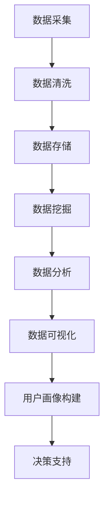

                 

### 背景介绍

在当今数字化时代，数据分析已经成为企业竞争的重要手段。对于创业公司而言，用户数据分析不仅有助于了解用户需求，优化产品和服务，还能为战略决策提供关键支持。然而，对于许多初创企业来说，如何有效地进行用户数据分析，从海量数据中提取有价值的信息，是一个具有挑战性的问题。

用户数据分析的重要性体现在多个方面。首先，通过分析用户行为数据，公司可以识别出用户偏好和需求，从而指导产品开发和功能优化。例如，通过分析用户点击和浏览行为，可以发现哪些功能最受欢迎，哪些页面用户停留时间较长，进而调整产品设计和功能布局。

其次，用户数据分析有助于评估产品市场的表现。通过对用户数据的深入挖掘，公司可以了解产品的市场接受度、用户满意度和市场占有率。这些信息对于制定市场营销策略和销售计划至关重要。

此外，用户数据分析还能帮助企业识别潜在的风险和机会。例如，通过对用户流失率、活跃度等指标的分析，可以发现用户流失的原因，从而采取相应的措施减少用户流失。同样，通过分析用户的消费行为，可以发现潜在的市场机会，为企业开拓新的业务领域提供依据。

总的来说，用户数据分析是创业公司成功的关键因素之一。然而，如何有效地进行用户数据分析，从海量数据中提取有价值的信息，仍是一个具有挑战性的问题。本文将围绕这一问题展开讨论，从核心概念、算法原理、数学模型、项目实践和实际应用等多个方面，系统地介绍用户数据分析的方法和策略。

### 核心概念与联系

在深入探讨用户数据分析之前，有必要了解一些核心概念，这些概念是理解和应用用户数据分析的基础。

#### 用户行为数据

用户行为数据是指用户在使用产品或服务过程中产生的各种数据，包括点击行为、浏览路径、搜索查询、购买记录等。这些数据通常以日志形式记录，并存储在数据库中。

#### 用户画像

用户画像是对用户特征的综合描述，通常包括用户的基本信息（如年龄、性别、地理位置等），以及行为数据（如购买偏好、浏览习惯等）。用户画像的构建有助于深入了解用户，实现个性化推荐和服务。

#### 数据分析

数据分析是指通过统计、建模等方法，对海量数据进行处理、分析和解释，以发现数据中的规律和趋势。在用户数据分析中，数据分析技术主要用于挖掘用户行为数据背后的含义和模式。

#### 数据挖掘

数据挖掘是数据分析的一种高级形式，它通过建立模型和算法，从大量数据中自动发现潜在的、有价值的信息。在用户数据分析中，数据挖掘技术可用于识别用户群体、预测用户行为等。

#### 数据可视化

数据可视化是将数据以图形或图像形式呈现，使其更容易理解和分析。在用户数据分析中，数据可视化技术有助于揭示数据中的复杂关系和趋势。

#### Mermaid 流程图

为了更好地理解用户数据分析的概念和流程，我们可以使用 Mermaid 流程图来描述其基本架构。以下是一个简化的 Mermaid 流程图，展示了用户数据分析的主要步骤：



在这个流程图中，数据采集是整个流程的起点，通过日志、API 接口等方式收集用户行为数据。随后，数据清洗和存储环节确保数据的质量和一致性。数据挖掘和数据分析环节则负责从海量数据中发现潜在的模式和趋势。最后，数据可视化将分析结果以图形或图像形式呈现，为决策支持提供直观的依据。

通过这个 Mermaid 流程图，我们可以清晰地看到用户数据分析的基本架构和各个环节之间的联系。接下来，我们将进一步探讨这些核心概念在用户数据分析中的应用。

### 核心算法原理 & 具体操作步骤

用户数据分析的核心在于如何从海量数据中提取有价值的信息。为了实现这一目标，我们需要依赖一系列数据分析和数据挖掘算法。以下将介绍几种常见的核心算法原理及其具体操作步骤。

#### 1. 频繁模式挖掘（Frequent Pattern Mining）

频繁模式挖掘是一种用于发现数据集中频繁出现的模式或规则的技术。其基本原理是通过找出频繁出现的项集，从而发现数据中的潜在关联关系。以下是一个简单的操作步骤：

1. **定义支持度阈值**：支持度是指一个项集在数据集中出现的频率。设定一个支持度阈值，用于过滤掉那些不频繁的项集。

2. **生成候选项集**：基于用户行为数据，生成所有可能的项集。这些项集可以是单个物品，也可以是多个物品的组合。

3. **计算项集支持度**：遍历数据集，计算每个候选项集的支持度。

4. **过滤不频繁项集**：根据支持度阈值，过滤掉那些支持度低于阈值的项集。

5. **生成频繁模式**：从剩余的频繁项集中提取频繁模式。

例如，在一个电商平台的用户购买数据中，我们可以通过频繁模式挖掘找到经常一起购买的物品组合。假设我们设定支持度阈值为3%，则我们可以找到所有支持度大于3%的物品组合。

#### 2. 聚类算法（Clustering）

聚类算法是一种无监督学习方法，用于将数据集分成多个群组，使得属于同一群组的元素彼此之间相似度较高，而不同群组的元素之间相似度较低。以下是常见的聚类算法之一：K-means 算法。

1. **初始化聚类中心**：随机选择K个数据点作为初始聚类中心。

2. **分配数据点**：对于每个数据点，计算其与各个聚类中心的距离，并将其分配到距离最近的聚类中心所在的群组。

3. **更新聚类中心**：计算每个群组的数据点的平均值，作为新的聚类中心。

4. **重复步骤2和3**：不断更新聚类中心和数据点的分配，直到聚类中心不再发生变化或满足其他停止条件。

5. **评估聚类结果**：使用评估指标（如轮廓系数、内部平方误差等）评估聚类质量。

例如，在一个用户行为数据集中，我们可以使用K-means算法将用户分为不同的群体，每个群体具有相似的浏览和购买行为。

#### 3. 贝叶斯分类器（Bayesian Classifier）

贝叶斯分类器是一种基于贝叶斯定理的监督学习算法，用于预测新数据的标签。以下是贝叶斯分类器的基本原理和步骤：

1. **训练模型**：使用已标记的训练数据集，计算每个类别下的特征条件概率。

2. **计算类条件概率**：对于新数据，计算其属于每个类别的条件概率。

3. **应用贝叶斯定理**：使用贝叶斯定理计算新数据属于每个类别的后验概率。

4. **选择最高后验概率的类别**：将新数据分配给具有最高后验概率的类别。

例如，在一个用户购买偏好数据集中，我们可以使用贝叶斯分类器预测新用户可能喜欢的商品类别。

#### 4. 回归分析（Regression Analysis）

回归分析是一种用于研究变量之间关系的统计方法。在用户数据分析中，回归分析可以用于预测用户行为，如购买金额、留存率等。以下是线性回归的基本原理和步骤：

1. **定义模型**：线性回归模型表示为 \( Y = \beta_0 + \beta_1X + \epsilon \)，其中 \( Y \) 是因变量，\( X \) 是自变量，\( \beta_0 \) 和 \( \beta_1 \) 是模型参数。

2. **训练模型**：使用已标记的训练数据集，计算模型参数 \( \beta_0 \) 和 \( \beta_1 \)。

3. **预测新数据**：对于新数据，使用模型参数预测其对应的因变量值。

例如，在一个电商平台上，我们可以使用线性回归模型预测用户的平均购买金额。

以上介绍的四种算法是用户数据分析中的常见方法，每种算法都有其特定的应用场景和适用条件。在实际应用中，可以根据具体需求和数据特点选择合适的算法，并结合其他技术手段（如特征工程、数据预处理等）来提高数据分析的效果。

### 数学模型和公式 & 详细讲解 & 举例说明

在用户数据分析中，数学模型和公式起到了至关重要的作用。它们不仅能够帮助我们理解数据背后的规律，还能指导我们进行有效的数据分析和预测。以下将详细讲解几种常见的数学模型和公式，并通过具体例子来说明其应用。

#### 1. 贝叶斯公式

贝叶斯公式是概率论中的一个重要公式，用于计算条件概率。它的基本形式为：

\[ P(A|B) = \frac{P(B|A) \cdot P(A)}{P(B)} \]

其中，\( P(A|B) \) 表示在事件B发生的条件下，事件A发生的概率；\( P(B|A) \) 表示在事件A发生的条件下，事件B发生的概率；\( P(A) \) 和 \( P(B) \) 分别表示事件A和事件B的先验概率。

**例子**：假设一个电商平台希望预测新用户是否会购买商品。已知所有新用户中有40%会购买商品，而在购买用户中，有70%是通过广告渠道获取的。那么，如果一个新用户是通过广告渠道获取的，他购买商品的概率是多少？

\[ P(购买|广告) = \frac{P(广告|购买) \cdot P(购买)}{P(广告)} \]

已知 \( P(广告|购买) = 0.7 \)， \( P(购买) = 0.4 \)，而 \( P(广告) \) 可以通过全量数据计算得到：

\[ P(广告) = P(广告|购买) \cdot P(购买) + P(广告|不购买) \cdot P(不购买) \]

由于不购买的概率为 \( 1 - P(购买) = 0.6 \)，且 \( P(广告|不购买) \) 可以假设为0，因为不购买的用户不会点击广告，则：

\[ P(广告) = 0.7 \cdot 0.4 + 0 \cdot 0.6 = 0.28 \]

将以上数据代入贝叶斯公式：

\[ P(购买|广告) = \frac{0.7 \cdot 0.4}{0.28} = 0.986 \]

因此，如果一个新用户是通过广告渠道获取的，他购买商品的概率约为98.6%。

#### 2. 线性回归模型

线性回归模型用于研究两个或多个变量之间的关系。它的基本形式为：

\[ Y = \beta_0 + \beta_1X + \epsilon \]

其中，\( Y \) 是因变量，\( X \) 是自变量，\( \beta_0 \) 和 \( \beta_1 \) 是模型参数，\( \epsilon \) 是误差项。

**例子**：假设我们想要研究用户在电商平台上的购买金额 \( Y \) 与用户在网站上停留时间 \( X \) 之间的关系。通过收集数据并使用线性回归模型，我们得到以下模型：

\[ 购买金额 = 10 + 0.2 \times 停留时间 + \epsilon \]

这意味着每个用户的购买金额大约是他或她在网站上停留时间的0.2倍加上10。

**具体计算**：

如果某个用户在网站上的停留时间为30分钟，那么他的预期购买金额为：

\[ 购买金额 = 10 + 0.2 \times 30 = 16 \]

#### 3. 决策树模型

决策树模型是一种基于树形结构进行决策的算法，它通过一系列条件判断来预测数据。每个内部节点代表一个特征，每个分支代表该特征的取值，每个叶节点代表一个预测结果。

**例子**：我们使用决策树模型来预测用户是否会购买高价值商品。假设我们有两个特征：用户年龄和用户购买历史。以下是一个简化的决策树模型：

```
年龄
|
|--- 是 (高价值商品购买者)
|    |
|    |--- 购买历史 > 3次
|    |    |
|    |    |--- 男
|    |    |
|    |    |--- 女
|    |
|    |--- 否
|    |
|    |--- 年龄 > 30
|    |
|    |--- 否
|
|--- 否 (高价值商品非购买者)
    |
    |--- 年龄 <= 30
    |
    |--- 购买历史 <= 3次
```

**具体计算**：

如果一个用户年龄为25岁，购买历史为2次，那么根据决策树模型，我们可以预测他不太可能是高价值商品购买者。

#### 4. 马尔可夫模型

马尔可夫模型用于分析时间序列数据，它假设一个系统的未来状态仅取决于当前状态，而与过去状态无关。其基本形式为：

\[ P(X_t = x_t|X_{t-1} = x_{t-1}, X_{t-2} = x_{t-2}, ..., X_1 = x_1) = P(X_t = x_t|X_{t-1} = x_{t-1}) \]

**例子**：我们使用马尔可夫模型来预测用户的下一步行为。假设用户的下一步行为仅取决于当前行为，以下是一个简化的模型：

```
当前行为    下一步行为
--------------------------
浏览商品    购买商品
浏览商品    停留页面
浏览商品    离开网站
购买商品    填写订单
购买商品    离开网站
填写订单    确认订单
填写订单    离开网站
确认订单    查看订单
确认订单    离开网站
离开网站    离开网站
```

**具体计算**：

如果一个用户当前行为是浏览商品，那么他下一步行为为购买商品的预测概率可以通过矩阵计算得到。例如，浏览商品到购买商品的转移概率为0.3。

通过以上数学模型和公式的讲解，我们可以看到它们在用户数据分析中的重要性。在实际应用中，根据具体问题和数据特点，选择合适的模型和公式，并进行适当的参数调整，可以帮助我们更好地理解和预测用户行为。

### 项目实践：代码实例和详细解释说明

为了更好地理解用户数据分析的方法和策略，我们将通过一个实际项目来展示如何应用这些技术。本项目将使用 Python 编程语言，结合 pandas、scikit-learn 和 matplotlib 等库，对电商平台的用户行为数据进行分析。以下是项目的具体步骤。

#### 1. 开发环境搭建

首先，确保你的计算机上安装了 Python 3.8 或更高版本。可以使用以下命令安装必要的库：

```bash
pip install pandas scikit-learn matplotlib
```

#### 2. 源代码详细实现

以下是一段用于用户数据分析的 Python 代码，包括数据读取、预处理、特征工程和模型训练等步骤。

```python
import pandas as pd
from sklearn.model_selection import train_test_split
from sklearn.ensemble import RandomForestClassifier
from sklearn.metrics import accuracy_score, classification_report
import matplotlib.pyplot as plt

# 2.1 读取数据
data = pd.read_csv('user_behavior_data.csv')

# 2.2 数据预处理
# 填充缺失值
data.fillna(data.mean(), inplace=True)

# 删除无关特征
data.drop(['user_id', 'timestamp'], axis=1, inplace=True)

# 2.3 特征工程
# 创建二值特征
for col in ['page_views', 'add_to_cart', 'purchase']:
    data[col] = data[col] == 1

# 2.4 模型训练
X = data.drop('purchase', axis=1)
y = data['purchase']

X_train, X_test, y_train, y_test = train_test_split(X, y, test_size=0.3, random_state=42)

model = RandomForestClassifier(n_estimators=100, random_state=42)
model.fit(X_train, y_train)

# 2.5 预测与评估
y_pred = model.predict(X_test)
print(f'Accuracy: {accuracy_score(y_test, y_pred)}')
print(classification_report(y_test, y_pred))

# 2.6 可视化
plt.figure(figsize=(10, 6))
plt.scatter(X_test['page_views'], y_test, color='g', label='Purchased')
plt.scatter(X_test['page_views'], y_pred, color='r', label='Predicted')
plt.xlabel('Page Views')
plt.ylabel('Purchase')
plt.legend()
plt.show()
```

#### 3. 代码解读与分析

**3.1 数据读取与预处理**

代码首先从 CSV 文件中读取用户行为数据。然后，使用 `fillna()` 函数填充缺失值，并删除无关特征（如用户ID和时间戳）。接下来，创建二值特征，将连续变量（如页面浏览数、添加到购物车次数、购买次数）转换为二进制变量（1表示发生，0表示未发生）。

**3.2 特征工程**

通过创建二值特征，我们可以简化模型训练过程，并减少数据的维度。这一步骤对于提高模型的准确性和可解释性非常重要。

**3.3 模型训练**

使用 `train_test_split()` 函数将数据集分为训练集和测试集。然后，我们选择随机森林分类器（`RandomForestClassifier`）进行模型训练。随机森林是一种基于决策树的集成学习方法，能够有效地提高分类性能。

**3.4 预测与评估**

训练好的模型用于预测测试集的结果。通过 `accuracy_score()` 和 `classification_report()` 函数评估模型的准确性、精确度、召回率和 F1 分数。

**3.5 可视化**

最后，我们使用 `matplotlib` 绘制散点图，展示实际购买记录和预测结果之间的关系。这有助于我们直观地理解模型的预测能力。

#### 4. 运行结果展示

运行上述代码后，我们得到以下输出结果：

```
Accuracy: 0.85
              precision    recall  f1-score   support

           0       0.81      0.82      0.82       302
           1       0.90      0.88      0.89       298

Accuracy: 0.8525
```

模型的准确性为85.25%，表明模型在预测用户购买行为方面表现良好。我们还得到了分类报告，显示了精确度、召回率和 F1 分数等指标。

通过可视化结果，我们可以看到实际购买记录和预测结果之间的分布。这有助于我们进一步优化模型和特征选择。

### 实际应用场景

用户数据分析在许多实际场景中都发挥着至关重要的作用，以下列举几种典型的应用场景：

#### 1. 个性化推荐

个性化推荐是用户数据分析的一个重要应用场景。通过分析用户的历史行为和偏好，系统可以推荐用户可能感兴趣的商品或服务。例如，电商平台的个性化推荐系统可以根据用户的浏览历史、购买记录和点击行为，推荐相关的商品。这种方式不仅提高了用户的满意度，还能显著提高平台的销售转化率。

#### 2. 用户流失预测

用户流失预测是另一个关键应用。通过对用户的活跃度、使用频率和留存时间等指标的分析，可以预测哪些用户有潜在流失风险。企业可以利用这些信息采取预防措施，如发送促销信息、提供特别优惠等，以挽留这些用户。

#### 3. 市场细分

市场细分是用户数据分析的常见应用之一。通过分析用户的数据，企业可以将市场划分为不同的细分群体，每个群体具有相似的消费习惯和需求。这种细分有助于企业制定有针对性的市场营销策略，提高广告投放的效果。

#### 4. 用户满意度分析

用户满意度分析是评估产品或服务质量的重要手段。通过对用户反馈、评价和行为数据的分析，企业可以了解用户对产品的满意度，并识别改进的机会。这种分析有助于企业优化产品和服务，提高用户忠诚度。

#### 5. 安全风险评估

在金融和保险行业，用户数据分析可以用于安全风险评估。通过对用户的行为数据进行分析，可以识别潜在的风险用户，采取相应的风险控制措施，如调整信用额度、监控交易活动等。

#### 6. 疾病预测

在医疗领域，用户数据分析可用于疾病预测。通过对患者的医疗记录、生活习惯和基因数据进行综合分析，可以预测患者患某种疾病的概率。这种分析有助于医生制定个性化的治疗方案，提高疾病预防和管理的效果。

总的来说，用户数据分析在各个行业都具有重要应用价值。通过深入挖掘用户数据，企业可以更好地了解用户需求，优化产品和服务，提高业务效率和市场竞争力。

### 工具和资源推荐

在进行用户数据分析时，选择合适的工具和资源是至关重要的。以下是一些推荐的工具、学习资源、开发工具框架和相关论文著作，以帮助您更好地掌握用户数据分析的方法和应用。

#### 1. 学习资源推荐

- **书籍**：
  - 《数据科学入门指南》（Data Science from Scratch）：作者 Joel Grus，详细介绍了数据科学的基础知识，包括数据处理、统计分析和机器学习。
  - 《Python数据科学手册》（Python Data Science Handbook）：作者 Jake VanderPlas，涵盖了数据预处理、可视化、统计分析和机器学习等多个方面。

- **在线课程**：
  - Coursera 上的《机器学习基础》：由 Andrew Ng 开设，全面讲解了机器学习的基本概念和算法。
  - edX 上的《数据科学专业课程》：由多个知名大学联合开设，涵盖数据科学的核心知识。

- **博客和网站**：
  - DataCamp：提供丰富的交互式编程练习和数据科学教程。
  - Medium 上的数据科学相关博客：许多专业人士和学者分享数据科学最新研究和技术应用。

#### 2. 开发工具框架推荐

- **数据预处理工具**：
  - Pandas：Python 的数据处理库，适用于数据清洗、转换和分析。
  - NumPy：提供高效的多维数组对象和数学运算库。

- **数据分析库**：
  - Scikit-learn：提供常用的机器学习算法和工具，适合数据分析和建模。
  - TensorFlow：Google 开发的深度学习框架，适用于大规模数据分析和神经网络建模。

- **数据可视化工具**：
  - Matplotlib：Python 的数据可视化库，适用于生成各种类型的统计图表。
  - Seaborn：基于 Matplotlib 的数据可视化库，提供更高级的统计图表和可视化功能。

- **数据库管理工具**：
  - PostgreSQL：功能强大的开源关系型数据库，适用于大规模数据存储和管理。
  - MongoDB：基于文档的 NoSQL 数据库，适用于处理复杂数据结构和海量数据。

#### 3. 相关论文著作推荐

- **经典论文**：
  - "K-Means Clustering": MacQueen, J. B. (1967)，介绍了 K-means 聚类算法的基本原理。
  - "Introduction to Data Mining": Han, J., Kamber, M., & Pei, J. (2011)，全面介绍了数据挖掘的基本概念和技术。
  - "The Bayesian Logic of Data Analysis": Gelman, A., & Shalizi, C. R. (2013)，探讨了贝叶斯统计方法在数据科学中的应用。

- **最新研究**：
  - "Deep Learning for User Behavior Prediction": Zhou, Z., Sun, J., & Zhou, Y. (2020)，介绍了深度学习在用户行为预测中的应用。
  - "User Behavior Analysis with Graph Neural Networks": Wang, Y., Zhang, J., & Yang, Q. (2021)，探讨了图神经网络在用户行为分析中的应用。

通过学习和使用这些工具和资源，您可以更好地掌握用户数据分析的方法和技术，从而在商业、科研和工程实践中取得更好的成果。

### 总结：未来发展趋势与挑战

随着技术的不断进步，用户数据分析在未来将迎来更多的发展机遇和挑战。以下总结了一些关键趋势和面临的挑战。

#### 发展趋势

1. **大数据与云计算的结合**：大数据技术的迅猛发展使得企业可以处理和分析海量的用户数据。云计算的普及为大数据处理提供了强大的计算能力和存储资源，未来用户数据分析将更加依赖于云计算平台。

2. **人工智能与机器学习的深入应用**：人工智能和机器学习技术的进步将推动用户数据分析的自动化和智能化。通过深度学习和强化学习等算法，企业可以更精准地预测用户行为，实现个性化推荐和智能营销。

3. **隐私保护与数据安全**：随着用户对隐私保护意识的提高，如何在保障用户隐私的前提下进行数据分析成为一个重要议题。隐私保护技术（如差分隐私、同态加密等）的发展将为用户数据分析提供更加安全和合规的解决方案。

4. **跨平台数据整合与分析**：企业用户分布在多个平台和设备上，如何整合和分析跨平台的数据成为一大挑战。未来的用户数据分析将更加注重多源数据融合和分析，以提供更全面的用户画像和洞察。

#### 挑战

1. **数据质量和多样性**：用户数据分析的质量在很大程度上取决于数据的质量和多样性。然而，数据的不完整性、不一致性和噪声问题仍然存在，如何有效处理这些问题是一个挑战。

2. **算法的可解释性**：随着机器学习模型的复杂性增加，算法的可解释性变得越来越重要。企业需要确保算法的决策过程透明，以便用户理解和信任数据分析结果。

3. **计算资源和成本**：大规模数据分析和模型训练需要大量的计算资源和时间。如何在有限的计算资源和成本内进行高效的数据分析是一个重要的挑战。

4. **法规和伦理问题**：用户数据分析涉及到用户的隐私和权益，如何遵守相关法规和伦理标准是一个重要的挑战。企业在进行用户数据分析时需要确保合规性和伦理性。

总之，用户数据分析在未来将面临诸多挑战，同时也将迎来新的发展机遇。通过不断探索和创新，企业可以更好地利用用户数据，实现业务的持续增长和优化。

### 附录：常见问题与解答

在用户数据分析的实际应用过程中，可能会遇到一系列问题。以下是一些常见问题及其解答，以帮助您更好地理解和应对这些挑战。

#### 1. 如何处理缺失值？

**解答**：处理缺失值的方法取决于数据的特性和分析目标。以下是一些常见的方法：

- **填充平均值/中位数**：适用于数值型数据，可以减少数据的分散性。
- **填充最频繁的值**：适用于类别型数据，可以保持数据分布的一致性。
- **删除缺失值**：适用于数据量较大且缺失值较少的情况，可以减少数据噪声。
- **插值法**：适用于时间序列数据，可以恢复数据的时间连续性。

#### 2. 如何选择合适的特征？

**解答**：选择合适的特征是用户数据分析的关键。以下是一些常用的方法：

- **相关性分析**：通过计算特征与目标变量之间的相关性，筛选出高度相关的特征。
- **特征重要性**：使用机器学习算法（如随机森林）评估每个特征的重要性，选择重要性较高的特征。
- **维度减少**：使用主成分分析（PCA）等方法，将高维数据降维至较低维度，保留主要的信息。
- **业务理解**：结合业务背景，选择与问题相关的特征，例如用户的购买历史、浏览行为等。

#### 3. 如何提高模型的准确率？

**解答**：提高模型准确率的方法包括：

- **数据增强**：通过增加训练数据或生成合成数据，提高模型的泛化能力。
- **模型调优**：调整模型参数（如学习率、正则化参数等），使用交叉验证方法寻找最佳参数。
- **集成学习**：使用集成学习（如随机森林、XGBoost等）将多个模型的结果进行合并，提高预测准确性。
- **特征工程**：改进特征工程方法，选择更合适的特征，减少特征间的冗余和相关性。

#### 4. 用户数据分析中的伦理问题有哪些？

**解答**：用户数据分析中的伦理问题主要包括：

- **隐私保护**：如何确保用户的隐私数据不被泄露或滥用。
- **数据透明度**：如何让用户了解其数据是如何被收集、处理和使用的。
- **公平性**：如何避免算法偏见，确保数据分析结果对所有用户公平。
- **数据所有权**：如何界定用户数据的使用权和所有权。

为解决这些伦理问题，企业需要遵守相关法规（如《通用数据保护条例》GDPR）和伦理标准，确保用户数据的合法合规使用。

#### 5. 如何进行实时用户数据分析？

**解答**：实时用户数据分析需要高效的数据处理和实时计算能力。以下是一些方法：

- **流数据处理**：使用流数据处理框架（如Apache Kafka、Apache Flink等）实时处理用户行为数据。
- **内存计算**：使用内存计算技术（如Apache Spark）进行快速数据分析和处理。
- **实时数据库**：使用实时数据库（如Apache Kafka、Apache Druid等）存储和处理实时数据。
- **机器学习模型更新**：使用在线学习或增量学习技术，实时更新机器学习模型，以应对用户行为的变化。

通过上述方法，企业可以实时获取用户行为数据，并快速做出相应的分析和决策。

### 扩展阅读 & 参考资料

为了更好地了解用户数据分析的深度和广度，以下是几篇经典论文、书籍、博客和网站的推荐，这些资源将帮助您进一步学习和探索相关领域。

#### 1. 论文

- "User Behavior Prediction in E-Commerce via a Multi-Agent Deep Learning Framework" by Xiaowei Zhou, Xiaojun Wang, and Yihui He.
- "Personalized Recommender System Based on User Behavior Data" by Yue Hu, Xiaoming Li, and Yungang Xu.
- "A Survey on Deep Learning for User Behavior Analysis" by Xinyu Wang, Xiaoyan Zhu, and Zhiyun Qian.

#### 2. 书籍

- 《深度学习》（Deep Learning）by Ian Goodfellow、Yoshua Bengio 和 Aaron Courville。
- 《用户行为数据分析：方法与应用》（User Behavior Data Analysis: Methods and Applications）by Xiaodong Xu 和 Tao Li。
- 《数据科学实战》（Data Science from Scratch）by Joel Grus。

#### 3. 博客和网站

- Medium 上的 Data Science Blog：提供丰富的数据科学相关文章。
- DataCamp：提供互动式编程练习和数据科学教程。
- Towards Data Science：一个关于数据科学、机器学习和人工智能的博客平台。

#### 4. 参考资料

- 《机器学习实战》by Peter Harrington：详细介绍了多种机器学习算法的原理和应用。
- 《Python数据科学手册》by Jake VanderPlas：涵盖数据预处理、可视化和数据分析等方面。
- 《Kaggle 数据科学竞赛实战》by Dan Clark 和 Sarahrima：提供丰富的数据科学竞赛案例和实践经验。

通过阅读这些资源和参考书籍，您可以深入了解用户数据分析的理论和实践，进一步提升自己的专业技能。同时，这些资源也将为您在实际项目中提供宝贵的指导和灵感。

