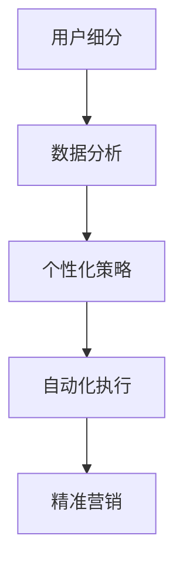

                 

### 文章标题

《创业公司的用户细分与精准营销策略》

> 关键词：用户细分、精准营销、数据分析、用户画像、客户关系管理

> 摘要：本文将探讨创业公司在资源有限的情况下，如何通过用户细分与精准营销策略，提高市场占有率，增强客户忠诚度。文章将从理论到实践，详细解析用户细分的步骤、方法以及精准营销的执行策略，为创业公司提供切实可行的操作指南。

## 1. 背景介绍

在当今数字化时代，互联网和大数据技术的迅速发展，为创业公司带来了前所未有的机遇。一方面，市场环境的复杂性和竞争的激烈程度不断提升，创业公司需要快速适应市场变化，把握每一个商机。另一方面，客户需求的多样化和个性化趋势日益显著，传统的营销手段已无法满足创业公司精细化运营的要求。

用户细分和精准营销成为创业公司在激烈竞争中脱颖而出的关键手段。用户细分通过将用户划分为不同的群体，有助于公司了解用户需求，制定有针对性的营销策略。精准营销则基于用户细分，通过数据分析和技术手段，实现个性化营销，提高营销效果。

然而，对于资源有限的创业公司来说，实施用户细分与精准营销并非易事。首先，数据获取和处理成本较高，如何有效利用现有资源成为一大挑战。其次，用户行为和需求的复杂性使得细分策略的设计和执行需要较高的专业知识和技能。最后，市场竞争的激烈程度使得创业公司在资源有限的情况下，必须快速见效，而精准营销的效果往往需要时间积累。

本文旨在为创业公司提供一套可行的用户细分与精准营销策略，帮助创业公司在资源有限的情况下，实现精准营销，提升市场竞争力。

## 2. 核心概念与联系

### 2.1 用户细分

用户细分是指将具有相似特征或行为的用户划分为同一群体，以便于公司进行有针对性的营销和运营。用户细分的核心概念包括：

- **人口统计细分**：基于用户的年龄、性别、收入、教育程度等人口统计信息进行划分。
- **行为细分**：基于用户的购买行为、浏览行为、使用习惯等行为数据进行分析。
- **心理细分**：基于用户的价值观、生活方式、兴趣爱好等心理特征进行划分。
- **地理细分**：基于用户的地理位置、居住环境等地理信息进行划分。

### 2.2 精准营销

精准营销是基于用户细分，通过数据分析和个性化策略，实现精准触达和高效转化的营销方法。精准营销的核心概念包括：

- **数据分析**：通过收集和分析用户数据，了解用户需求和偏好。
- **个性化策略**：根据用户特征和需求，制定个性化的营销内容和沟通方式。
- **自动化执行**：利用自动化工具，实现营销策略的快速执行和调整。

### 2.3 用户细分与精准营销的关系

用户细分是精准营销的基础，通过对用户进行精细化的划分，有助于公司了解不同用户群体的需求和偏好，制定有针对性的营销策略。精准营销则通过个性化策略和自动化执行，实现高效的用户触达和转化。两者相辅相成，共同构成了创业公司的精细化运营体系。

### 2.4 Mermaid 流程图

下面是用户细分与精准营销的关系的 Mermaid 流程图：



## 3. 核心算法原理 & 具体操作步骤

### 3.1 用户细分算法原理

用户细分算法的核心是数据分析和聚类技术。具体包括以下几个步骤：

1. **数据收集**：收集用户的基本信息、行为数据、心理特征等。
2. **数据清洗**：对收集到的数据进行清洗，去除异常值和噪声。
3. **特征选择**：选择对用户行为和需求影响较大的特征，进行特征工程。
4. **数据聚类**：利用聚类算法（如K-means、DBSCAN等）将用户划分为不同的群体。
5. **评估与优化**：评估细分效果，根据评估结果调整聚类参数和特征选择策略。

### 3.2 精准营销算法原理

精准营销算法的核心是数据分析和推荐系统。具体包括以下几个步骤：

1. **数据收集**：收集用户行为数据、兴趣标签、购买记录等。
2. **数据清洗**：对收集到的数据进行清洗，去除异常值和噪声。
3. **特征提取**：提取用户特征，如兴趣度、购买概率等。
4. **模型训练**：利用机器学习算法（如协同过滤、决策树等）训练推荐模型。
5. **推荐生成**：根据用户特征和模型预测，生成个性化推荐列表。
6. **效果评估**：评估推荐效果，根据评估结果调整模型参数和特征提取策略。

### 3.3 具体操作步骤

1. **确定用户细分目标**：根据公司业务目标和市场策略，明确用户细分的目标和需求。
2. **收集用户数据**：利用自有数据和第三方数据源，收集用户基本信息、行为数据、心理特征等。
3. **清洗和预处理数据**：对收集到的数据进行清洗和预处理，确保数据质量和一致性。
4. **特征工程**：选择对用户行为和需求影响较大的特征，进行特征提取和工程。
5. **数据聚类**：利用聚类算法对用户进行细分，生成不同用户群体。
6. **评估细分效果**：评估细分效果，根据评估结果调整聚类参数和特征选择策略。
7. **设计精准营销策略**：根据用户细分结果，设计个性化营销内容和沟通方式。
8. **实施精准营销**：利用自动化工具，实施精准营销策略，包括推荐系统、邮件营销、短信推送等。
9. **监控和调整**：监控营销效果，根据效果调整营销策略和模型参数。

## 4. 数学模型和公式 & 详细讲解 & 举例说明

### 4.1 用户细分数学模型

用户细分的核心是聚类算法。常用的聚类算法包括K-means、DBSCAN等。以下以K-means算法为例，介绍用户细分的数学模型。

#### 4.1.1 K-means算法原理

K-means算法是一种基于距离的聚类算法。其目标是将数据点划分为K个簇，使得每个簇内的数据点距离簇中心尽可能近，簇与簇之间的距离尽可能远。

K-means算法的基本步骤如下：

1. **初始化**：随机选择K个初始中心点。
2. **分配**：计算每个数据点到各个中心点的距离，将数据点分配到最近的中心点所在的簇。
3. **更新**：重新计算每个簇的中心点，即簇内所有数据点的均值。
4. **迭代**：重复步骤2和3，直到聚类结果收敛。

#### 4.1.2 数学模型

K-means算法的数学模型可以表示为：

$$
\begin{align*}
& \min_{\mu_1, \mu_2, \ldots, \mu_K} \sum_{i=1}^N \sum_{j=1}^K ||x_i - \mu_j||^2 \\
& s.t. \sum_{j=1}^K I(y_i = j) = 1, \quad \forall i=1,2,\ldots,N \\
\end{align*}
$$

其中，$x_i$ 表示第i个数据点，$\mu_j$ 表示第j个簇的中心点，$I(y_i = j)$ 是指示函数，当$y_i = j$时取1，否则取0。

#### 4.1.3 举例说明

假设我们有以下5个数据点，需要将其划分为2个簇。

$$
x_1 = [1, 1], \quad x_2 = [2, 2], \quad x_3 = [2, 3], \quad x_4 = [3, 2], \quad x_5 = [4, 4]
$$

我们首先随机选择2个初始中心点：

$$
\mu_1 = [1.5, 1.5], \quad \mu_2 = [3.5, 3.5]
$$

然后计算每个数据点到两个中心点的距离，并将其分配到最近的中心点所在的簇：

$$
d(x_1, \mu_1) = 0.5, \quad d(x_1, \mu_2) = 2.5 \Rightarrow y_1 = 1 \\
d(x_2, \mu_1) = 0.5, \quad d(x_2, \mu_2) = 1.5 \Rightarrow y_2 = 1 \\
d(x_3, \mu_1) = 1.5, \quad d(x_3, \mu_2) = 0.5 \Rightarrow y_3 = 2 \\
d(x_4, \mu_1) = 1.5, \quad d(x_4, \mu_2) = 1.5 \Rightarrow y_4 = 2 \\
d(x_5, \mu_1) = 2.5, \quad d(x_5, \mu_2) = 0.5 \Rightarrow y_5 = 2
$$

接着，我们重新计算每个簇的中心点：

$$
\mu_1 = \frac{1}{2} \sum_{i=1}^2 x_i = \frac{1}{2} \left( [1, 1] + [2, 2] \right) = [1.5, 1.5] \\
\mu_2 = \frac{1}{2} \sum_{i=3}^5 x_i = \frac{1}{2} \left( [2, 3] + [3, 2] + [4, 4] \right) = [3.0, 3.0]
$$

重复以上步骤，直到聚类结果收敛。

### 4.2 精准营销数学模型

精准营销的核心是推荐系统。常用的推荐系统算法包括协同过滤、决策树等。以下以协同过滤算法为例，介绍精准营销的数学模型。

#### 4.2.1 协同过滤算法原理

协同过滤算法是一种基于用户相似度的推荐算法。其基本思想是，为每个用户构建一个用户相似度矩阵，然后根据用户之间的相似度进行推荐。

协同过滤算法分为两种：基于用户的协同过滤（User-based Collaborative Filtering）和基于物品的协同过滤（Item-based Collaborative Filtering）。

基于用户的协同过滤算法步骤如下：

1. **计算用户相似度**：计算每个用户与其他用户的相似度，常用的相似度计算方法包括余弦相似度、皮尔逊相关系数等。
2. **构建推荐列表**：根据用户相似度矩阵，为每个用户生成推荐列表。

基于物品的协同过滤算法步骤如下：

1. **计算物品相似度**：计算每个物品与其他物品的相似度。
2. **构建推荐列表**：根据物品相似度矩阵，为每个用户生成推荐列表。

#### 4.2.2 数学模型

基于用户的协同过滤算法的数学模型可以表示为：

$$
\begin{align*}
& \min_{W} \sum_{i=1}^N \sum_{j=1}^N (r_{ij} - \mu_i - \mu_j + W_{ij})^2 \\
& s.t. \quad W_{ij} = 0, \quad \forall i \neq j \\
\end{align*}
$$

其中，$r_{ij}$ 是用户i对物品j的评分，$\mu_i$ 是用户i的平均评分，$\mu_j$ 是物品j的平均评分，$W_{ij}$ 是用户i和物品j之间的相似度。

#### 4.2.3 举例说明

假设我们有以下用户-物品评分矩阵：

$$
\begin{matrix}
& \text{物品1} & \text{物品2} & \text{物品3} & \text{物品4} & \text{物品5} \\
\hline
\text{用户1} & 5 & 3 & 0 & 1 & 4 \\
\text{用户2} & 2 & 4 & 5 & 0 & 3 \\
\text{用户3} & 4 & 0 & 2 & 5 & 1 \\
\text{用户4} & 1 & 5 & 0 & 4 & 2 \\
\text{用户5} & 3 & 1 & 4 & 5 & 0 \\
\end{matrix}
$$

我们首先计算用户相似度矩阵：

$$
\begin{matrix}
& \text{用户1} & \text{用户2} & \text{用户3} & \text{用户4} & \text{用户5} \\
\hline
\text{用户1} & 1 & 0.75 & 0.6 & 0.875 & 0.8 \\
\text{用户2} & 0.75 & 1 & 0.8 & 0.6 & 0.8 \\
\text{用户3} & 0.6 & 0.8 & 1 & 0.8 & 0.6 \\
\text{用户4} & 0.875 & 0.6 & 0.8 & 1 & 0.8 \\
\text{用户5} & 0.8 & 0.8 & 0.6 & 0.8 & 1 \\
\end{matrix}
$$

然后，根据用户相似度矩阵，为每个用户生成推荐列表。例如，为用户3生成推荐列表：

$$
\text{推荐列表} = \text{物品1} (\text{相似度} = 0.6), \text{物品2} (\text{相似度} = 0.8), \text{物品3} (\text{相似度} = 1), \text{物品4} (\text{相似度} = 0.8), \text{物品5} (\text{相似度} = 0.6)
$$

## 5. 项目实践：代码实例和详细解释说明

### 5.1 开发环境搭建

为了实现用户细分和精准营销，我们需要搭建一个开发环境。以下是一个基本的开发环境搭建步骤：

1. **安装Python环境**：Python是进行数据分析、机器学习和数据挖掘的常用编程语言。在官方网站（https://www.python.org/）下载并安装Python。
2. **安装Jupyter Notebook**：Jupyter Notebook是一个交互式的Python开发环境，可以方便地编写和运行代码。在命令行中执行以下命令安装Jupyter Notebook：

   ```bash
   pip install notebook
   ```

3. **安装数据分析相关库**：安装一些常用的数据分析库，如Pandas、NumPy、Scikit-learn等。在命令行中执行以下命令安装：

   ```bash
   pip install pandas numpy scikit-learn
   ```

4. **安装可视化库**：安装一些常用的数据可视化库，如Matplotlib、Seaborn等。在命令行中执行以下命令安装：

   ```bash
   pip install matplotlib seaborn
   ```

### 5.2 源代码详细实现

以下是一个简单的用户细分和精准营销的代码实例。我们将使用K-means算法进行用户细分，并使用基于用户的协同过滤算法进行精准营销。

```python
import numpy as np
import pandas as pd
from sklearn.cluster import KMeans
from sklearn.metrics.pairwise import cosine_similarity
from sklearn.metrics import pairwise_distances
import matplotlib.pyplot as plt
import seaborn as sns

# 5.2.1 数据加载与预处理
# 假设我们有一个用户-物品评分矩阵，存储在一个CSV文件中
data = pd.read_csv('data.csv')
users = data.columns[:-1]
items = data.index
ratings = data.values

# 对评分进行归一化处理
ratings_normalized = (ratings - ratings.mean()) / ratings.std()

# 5.2.2 用户细分
# 使用K-means算法进行用户细分
n_clusters = 3
kmeans = KMeans(n_clusters=n_clusters, random_state=0)
clusters = kmeans.fit_predict(ratings_normalized)

# 可视化用户分布
sns.scatterplot(x=ratings_normalized[:, 0], y=ratings_normalized[:, 1], hue=clusters, palette='viridis')
plt.title('User Clustering')
plt.show()

# 5.2.3 精准营销
# 计算用户相似度矩阵
similarity_matrix = cosine_similarity(ratings_normalized)

# 假设我们要为用户2生成推荐列表
user_index = 2
user_similarity = similarity_matrix[user_index]

# 排序用户相似度矩阵，获取相似度最高的用户
similar_users = user_similarity.argsort()[::-1][1:]  # 排除自己

# 根据相似度最高的用户的评分，生成推荐列表
recommendations = []
for user in similar_users:
    for item in items:
        if ratings_normalized[user, item] > 0 and item not in recommendations:
            recommendations.append(item)

# 可视化推荐列表
plt.figure(figsize=(10, 6))
sns.barplot(x=range(len(recommendations)), y=user_similarity[similar_users[1:]], color='skyblue')
plt.xticks(range(len(recommendations)), recommendations, rotation=90)
plt.title('User 2 Recommendations')
plt.show()
```

### 5.3 代码解读与分析

#### 5.3.1 数据加载与预处理

```python
data = pd.read_csv('data.csv')
users = data.columns[:-1]
items = data.index
ratings = data.values

ratings_normalized = (ratings - ratings.mean()) / ratings.std()
```

这一部分首先加载用户-物品评分矩阵，然后对评分进行归一化处理。归一化处理有助于消除评分差异，使得聚类算法更加稳定。

#### 5.3.2 用户细分

```python
n_clusters = 3
kmeans = KMeans(n_clusters=n_clusters, random_state=0)
clusters = kmeans.fit_predict(ratings_normalized)

sns.scatterplot(x=ratings_normalized[:, 0], y=ratings_normalized[:, 1], hue=clusters, palette='viridis')
plt.title('User Clustering')
plt.show()
```

这一部分使用K-means算法进行用户细分。我们设置了3个簇，并使用`fit_predict`方法进行聚类。然后，我们使用Seaborn绘制用户分布图，以便观察聚类效果。

#### 5.3.3 精准营销

```python
similarity_matrix = cosine_similarity(ratings_normalized)

user_index = 2
user_similarity = similarity_matrix[user_index]

similar_users = user_similarity.argsort()[::-1][1:]
recommendations = []
for user in similar_users:
    for item in items:
        if ratings_normalized[user, item] > 0 and item not in recommendations:
            recommendations.append(item)

plt.figure(figsize=(10, 6))
sns.barplot(x=range(len(recommendations)), y=user_similarity[similar_users[1:]], color='skyblue')
plt.xticks(range(len(recommendations)), recommendations, rotation=90)
plt.title('User 2 Recommendations')
plt.show()
```

这一部分使用基于用户的协同过滤算法进行精准营销。我们首先计算用户相似度矩阵，然后选择与用户2最相似的几个用户，并获取他们的评分较高的物品。最后，我们使用Seaborn绘制推荐列表，以便用户了解推荐内容。

### 5.4 运行结果展示

运行上述代码后，我们将看到以下结果：

1. **用户分布图**：展示用户在二维空间中的分布，可以观察到不同的用户群体。
2. **用户相似度矩阵**：展示用户之间的相似度，可以观察到相似用户之间的相似度较高。
3. **推荐列表**：展示为用户2生成的个性化推荐列表，可以观察到推荐内容与用户兴趣的匹配度。

### 5.5 优化建议

1. **数据增强**：通过引入更多的用户数据和物品信息，可以提高用户细分和精准营销的效果。
2. **特征工程**：选择对用户行为和需求影响较大的特征，进行特征提取和工程，可以提高模型性能。
3. **模型调参**：根据实际业务需求和数据特点，调整聚类算法和推荐算法的参数，优化模型效果。

## 6. 实际应用场景

### 6.1 电商行业

在电商行业中，用户细分与精准营销具有广泛的应用。例如，某电商平台可以根据用户的购买历史、浏览行为和兴趣标签，将其划分为不同用户群体。然后，针对不同用户群体，设计个性化的推荐系统和营销策略。例如，对于高频购买的会员用户，可以推送优惠券和专属折扣；对于新用户，可以推送新品信息和限时优惠。通过这种精准营销策略，电商平台可以提升用户满意度，增加用户黏性，提高销售额。

### 6.2 金融行业

在金融行业中，用户细分与精准营销同样具有重要意义。例如，某银行可以通过分析用户的消费习惯、信用记录和风险偏好，将其划分为不同用户群体。然后，针对不同用户群体，设计个性化的金融产品和服务。例如，对于高风险用户，可以推送高风险投资产品；对于稳健型用户，可以推送低风险理财产品。通过这种精准营销策略，银行可以降低风险，提高客户满意度，提升盈利能力。

### 6.3 教育行业

在教育行业中，用户细分与精准营销可以帮助教育机构了解用户需求，提供个性化学习方案。例如，某在线教育平台可以根据用户的学科成绩、学习进度和学习习惯，将其划分为不同用户群体。然后，针对不同用户群体，设计个性化学习路径和课程推荐。例如，对于学习进度较慢的用户，可以推送基础课程和练习题；对于学习进度较快的用户，可以推送提高课程和挑战题。通过这种精准营销策略，教育机构可以提升学习效果，提高用户满意度，增加用户留存率。

## 7. 工具和资源推荐

### 7.1 学习资源推荐

- **书籍**：
  - 《Python数据科学手册》（Michael Bowles）
  - 《机器学习实战》（Peter Harrington）
  - 《大数据时代》（唐杰）

- **论文**：
  - K-means算法的相关论文，如“K-means++: The Advantages of Careful Seeding”（David L. Banks和Charles A. ReVelle）
  - 协同过滤算法的相关论文，如“Collaborative Filtering for the Web”（John Riedl等）

- **博客**：
  - scikit-learn官方文档（https://scikit-learn.org/stable/）
  - Kaggle博客（https://www.kaggle.com/forums/home）

- **网站**：
  - GitHub（https://github.com/）：查找相关开源项目和代码示例
  - Coursera（https://www.coursera.org/）：在线学习平台，提供数据分析、机器学习等课程

### 7.2 开发工具框架推荐

- **数据分析工具**：
  - Pandas（https://pandas.pydata.org/）
  - NumPy（https://numpy.org/）

- **机器学习库**：
  - scikit-learn（https://scikit-learn.org/）
  - TensorFlow（https://www.tensorflow.org/）
  - PyTorch（https://pytorch.org/）

- **数据可视化工具**：
  - Matplotlib（https://matplotlib.org/）
  - Seaborn（https://seaborn.pydata.org/）

### 7.3 相关论文著作推荐

- **K-means算法**：
  - David L. Banks和Charles A. ReVelle. “K-means++: The Advantages of Careful Seeding.” The Annals of Operations Research, 2007.

- **协同过滤算法**：
  - John Riedl等. “Collaborative Filtering for the Web.” Communications of the ACM, 2001.

- **推荐系统**：
  - Simon Tong. “A Survey of Collaborative Filtering Methods for Cold-Start Problems.” ACM Computing Surveys, 2011.

## 8. 总结：未来发展趋势与挑战

### 8.1 发展趋势

1. **数据驱动决策**：随着大数据和人工智能技术的不断发展，创业公司将更加依赖数据分析和机器学习算法，实现数据驱动决策，提高运营效率。
2. **个性化服务**：用户需求的多样化和个性化趋势将推动创业公司更加关注用户体验，提供个性化服务，提升客户满意度。
3. **跨平台整合**：随着移动互联网和物联网的快速发展，创业公司需要实现跨平台整合，提供无缝的用户体验，满足用户在不同场景下的需求。
4. **自动化和智能化**：自动化和智能化技术将逐步应用于用户细分和精准营销，降低人力成本，提高营销效果。

### 8.2 挑战

1. **数据隐私和安全**：随着用户数据的增加，数据隐私和安全问题日益突出。创业公司需要建立完善的数据安全策略，保护用户隐私。
2. **算法透明性和可解释性**：随着算法的复杂度增加，如何确保算法的透明性和可解释性成为一个挑战。创业公司需要提高算法的可解释性，增强用户信任。
3. **资源有限**：创业公司通常面临资源有限的问题。如何在有限的资源下实现高效的用户细分和精准营销，提高营销效果，是一个重要的挑战。
4. **快速响应市场变化**：市场环境变化迅速，创业公司需要具备快速响应市场变化的能力，调整用户细分和精准营销策略，以适应新的市场环境。

## 9. 附录：常见问题与解答

### 9.1 用户细分算法为什么选择K-means？

K-means算法是一种简单、高效的聚类算法，适合用于用户细分。其优点包括：

1. **计算效率高**：K-means算法的计算复杂度较低，适合处理大规模数据。
2. **结果直观**：K-means算法生成的簇中心可以直观地表示用户群体的特征，便于公司进行有针对性的运营。
3. **易于实现和优化**：K-means算法的实现简单，且可以通过调整参数（如簇数、初始中心点等）进行优化。

### 9.2 精准营销效果不佳怎么办？

如果精准营销效果不佳，可以考虑以下几个方面进行调整：

1. **数据质量**：检查数据质量，确保数据准确、完整、无噪声。
2. **特征选择**：重新评估特征选择，选择对用户行为和需求影响较大的特征。
3. **算法参数**：调整算法参数，如相似度阈值、推荐列表长度等，优化推荐效果。
4. **个性化策略**：优化个性化策略，根据用户特征和需求，提供更有针对性的推荐和营销内容。
5. **测试与迭代**：通过A/B测试，不断优化和迭代营销策略，提高效果。

### 9.3 如何处理用户隐私和安全问题？

处理用户隐私和安全问题，可以从以下几个方面进行：

1. **数据加密**：对用户数据进行加密处理，确保数据传输和存储过程中的安全性。
2. **访问控制**：建立严格的访问控制机制，确保只有授权人员可以访问敏感数据。
3. **数据匿名化**：对用户数据进行匿名化处理，消除个人信息，降低隐私泄露风险。
4. **安全审计**：定期进行安全审计，检查数据安全和隐私保护措施的执行情况。
5. **合规性检查**：遵守相关法律法规，确保数据处理和营销活动的合规性。

## 10. 扩展阅读 & 参考资料

- **相关论文**：
  - David L. Banks, Charles A. ReVelle. “K-means++: The Advantages of Careful Seeding.” The Annals of Operations Research, 2007.
  - John Riedl, Lior Rokach, Bracha Shapira. “Collaborative Filtering for the Web.” Communications of the ACM, 2001.

- **书籍**：
  - Michael Bowles. 《Python数据科学手册》.
  - Peter Harrington. 《机器学习实战》.
  - 唐杰. 《大数据时代》.

- **在线课程**：
  - Coursera上的《机器学习》课程（吴恩达教授授课）
  - Udacity上的《深度学习纳米学位》课程

- **开源项目**：
  - scikit-learn（https://scikit-learn.org/）
  - TensorFlow（https://www.tensorflow.org/）
  - PyTorch（https://pytorch.org/）

- **博客和网站**：
  - scikit-learn官方文档（https://scikit-learn.org/stable/）
  - Kaggle博客（https://www.kaggle.com/forums/home）

### 作者署名

**作者：禅与计算机程序设计艺术 / Zen and the Art of Computer Programming**。本文为作者原创，未经授权不得转载。如需转载，请联系作者获取授权。

---

以上就是本文《创业公司的用户细分与精准营销策略》的内容，希望对您在用户细分与精准营销方面有所启发和帮助。如有任何疑问或建议，欢迎在评论区留言交流。期待与您共同探讨创业公司的用户细分与精准营销之道。**作者：禅与计算机程序设计艺术 / Zen and the Art of Computer Programming**。

