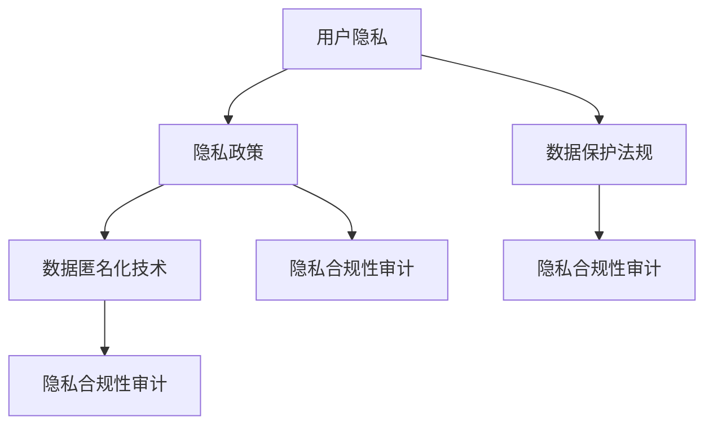
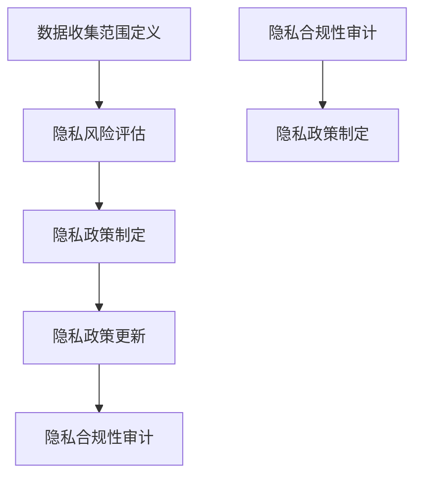

                 

### 背景介绍

随着互联网的迅速发展和数字化转型浪潮，创业公司在各类行业中扮演着越来越重要的角色。无论是电子商务、社交媒体、金融科技还是物联网等，创业公司都在推动行业变革，提供创新的产品和服务。然而，这种快速发展的背后也带来了一个不可忽视的问题——用户隐私保护。

用户隐私保护已经成为当今社会的一大关注焦点。随着数据泄露事件频发、隐私侵犯案件层出不穷，公众对个人信息安全的担忧日益加剧。创业公司作为新兴企业，通常缺乏成熟的数据隐私管理经验，面临着更为严峻的隐私保护挑战。

制定和更新用户隐私政策对于创业公司具有重要意义。首先，它能够明确公司的数据收集、使用和存储方式，提高透明度，从而增强用户对公司的信任。其次，它有助于遵守相关法律法规，如《通用数据保护条例》（GDPR）、《加州消费者隐私法案》（CCPA）等，避免因违规而面临巨额罚款和法律纠纷。最后，良好的用户隐私政策能够树立公司在市场中的良好形象，提高品牌价值。

本篇文章旨在探讨创业公司在制定和更新用户隐私政策时需要考虑的关键因素和最佳实践。我们将通过逐步分析的方式，从背景介绍、核心概念与联系、核心算法原理与具体操作步骤、数学模型和公式、项目实践、实际应用场景、工具和资源推荐等方面，全面解读用户隐私政策的制定与更新过程。

希望通过本文的分享，能够为创业公司在用户隐私保护方面提供一些有益的指导和建议，帮助它们在快速发展的同时，确保用户隐私安全，实现可持续发展。

### 核心概念与联系

在探讨创业公司用户隐私政策的制定与更新之前，我们首先需要理解一些核心概念和其相互之间的联系。以下是本文将涉及的关键概念：

**1. 用户隐私**

用户隐私指的是个人在数字世界中的个人信息、行为习惯和其他敏感数据的保护。它包括但不限于姓名、地址、电话号码、电子邮件地址、社交媒体账户信息、搜索历史、购物记录等。用户隐私保护的核心目标是防止个人数据被未经授权的第三方获取、使用或泄露。

**2. 隐私政策**

隐私政策是创业公司制定并公布的一份文件，用于告知用户其个人信息将被如何收集、使用、存储和分享。它通常包括隐私保护条款、数据收集目的、数据共享政策、用户权利、数据安全措施等。良好的隐私政策能够提高用户对公司的信任，并确保公司在法律框架内运营。

**3. 数据保护法规**

数据保护法规是指一系列旨在规范数据收集、处理、存储和分享的法律和条例。全球范围内，主要的法规包括《通用数据保护条例》（GDPR）、《加州消费者隐私法案》（CCPA）、《隐私法》（Privacy Act）等。这些法规对创业公司在数据处理方面提出了严格的要求，违反者将面临高额罚款和法律追究。

**4. 数据匿名化**

数据匿名化是一种通过去除或混淆个人身份信息，以保护隐私的技术。匿名化后的数据可以在不违反隐私政策的前提下进行分析和使用。数据匿名化技术包括伪名化、数据加密、数据混淆等。

**5. 隐私合规性审计**

隐私合规性审计是指对公司数据处理流程进行审查，以评估其是否符合相关隐私法规的要求。审计通常包括数据收集流程、数据存储安全措施、隐私政策执行情况等。通过隐私合规性审计，公司可以识别潜在风险，并采取改进措施。

这些核心概念之间有着密切的联系。用户隐私是隐私政策的保护对象，而隐私政策是公司合规性的重要组成部分。数据保护法规为隐私政策提供了法律依据，数据匿名化技术有助于实现隐私保护，而隐私合规性审计则确保公司实际操作与政策一致。

为了更好地理解这些概念之间的关系，我们可以使用Mermaid流程图来展示它们的基本架构和交互方式：



在上述流程图中，用户隐私作为核心概念贯穿整个流程，隐私政策、数据保护法规、数据匿名化技术和隐私合规性审计则分别从不同方面保障用户隐私的保护。通过这种结构化的分析，我们可以更清晰地理解用户隐私政策在创业公司中的关键作用。

### 核心算法原理与具体操作步骤

在制定和更新用户隐私政策时，创业公司需要运用一系列核心算法原理和具体操作步骤来确保其隐私政策的有效性和合规性。以下是几个关键步骤：

#### 1. 数据收集范围定义

首先，创业公司需要明确其数据收集的范围。这一步骤包括识别用户在访问和使用服务时可能会产生的各类数据，如用户行为数据、个人信息、设备信息等。明确数据收集范围有助于公司在后续的隐私政策制定中确保透明性和合规性。

**具体操作步骤：**
- 分析公司业务需求和用户行为，确定需要收集的数据类型。
- 制定数据收集清单，详细列出每种数据的用途和来源。

#### 2. 隐私风险评估

隐私风险评估是确保隐私政策有效性的重要环节。公司需要评估其数据处理流程中可能存在的隐私风险，包括数据泄露、滥用、非法访问等。

**具体操作步骤：**
- 使用风险评估框架，如ISO/IEC 27001标准，识别和评估潜在隐私风险。
- 根据风险评估结果，制定相应的风险缓解措施。

#### 3. 隐私政策制定

在明确数据收集范围和隐私风险评估后，公司可以开始制定隐私政策。隐私政策应当包含数据收集、使用、存储、共享和用户权利等方面的详细说明。

**具体操作步骤：**
- 制定隐私政策草案，包括数据收集目的、用户权利、数据保护措施等。
- 征求公司内部各相关部门的意见，确保隐私政策涵盖所有相关业务流程。
- 组织内部培训和宣传，提高员工对隐私政策的认知和执行力。

#### 4. 隐私政策更新

随着业务的发展和技术进步，公司需要定期更新隐私政策以保持其时效性和合规性。

**具体操作步骤：**
- 定期审查现有隐私政策，识别潜在更新需求。
- 根据法律法规变化和公司业务调整，更新隐私政策内容。
- 通过官方网站、用户通知等方式，告知用户隐私政策变更情况。

#### 5. 隐私合规性审计

隐私合规性审计是确保公司隐私政策实际执行情况与政策声明一致的关键步骤。

**具体操作步骤：**
- 选择独立第三方机构或内部审计团队进行隐私合规性审计。
- 审查公司数据处理流程、数据存储安全和隐私政策执行情况。
- 根据审计结果，制定改进措施并跟踪实施进度。

通过以上核心算法原理和具体操作步骤，创业公司可以制定和更新有效的用户隐私政策，确保用户隐私得到充分保护，同时遵守相关法律法规。以下是这些步骤的Mermaid流程图：



在这个流程图中，数据收集范围定义、隐私风险评估、隐私政策制定、隐私政策更新和隐私合规性审计相互关联，共同构成了一个闭环，确保创业公司隐私政策的持续改进和合规性。

### 数学模型和公式 & 详细讲解 & 举例说明

在制定和更新用户隐私政策时，数学模型和公式可以提供量化分析和决策支持，帮助我们更好地理解隐私保护的方法和效果。以下是一些关键的数学模型和公式，以及详细的讲解和举例说明。

#### 1. 隐私预算模型

隐私预算模型是一种用于量化隐私保护成本的模型，它可以帮助公司在资源有限的情况下，制定最优的隐私保护策略。该模型基于以下几个关键参数：

- **隐私价值（V）**：用户愿意为隐私保护支付的价值。
- **隐私成本（C）**：实施隐私保护措施所需的资源，包括人力、技术、时间等。
- **隐私风险（R）**：由于隐私泄露或滥用可能导致的损失。

隐私预算模型的基本公式如下：

\[ P = \frac{V - C - R}{S} \]

其中：
- **P**：隐私预算，即公司在特定时间段内可用于隐私保护的资源。
- **S**：社会责任，即公司因违反隐私法规而可能面临的社会责任成本。

**举例说明**：

假设一家创业公司估算其隐私价值为 $100,000，隐私成本为 $50,000，隐私风险为 $20,000，社会责任成本为 $10,000。则其隐私预算为：

\[ P = \frac{100,000 - 50,000 - 20,000 - 10,000}{1} = 20,000 \]

这意味着公司在该时间段内有 $20,000 的资源用于隐私保护。

#### 2. 数据匿名化算法效率评估

数据匿名化算法的效率评估是确保匿名化过程能够有效保护隐私的重要环节。常用的效率评估指标包括：

- **数据损失率（L）**：匿名化过程中损失的数据信息量与原始数据信息量的比值。
- **隐私保护率（P）**：匿名化后数据隐私保护程度与原始数据隐私保护程度的比值。

基本公式如下：

\[ E = \frac{1 - L}{P} \]

其中：
- **E**：效率评分，用于评估匿名化算法的整体效率。

**举例说明**：

假设一种匿名化算法在处理数据时损失了 10% 的信息量，同时隐私保护率提高了 20%。则其效率评分为：

\[ E = \frac{1 - 0.1}{1 + 0.2} = 0.833 \]

这意味着该匿名化算法在保持较高隐私保护水平的同时，数据损失较小，具有较高的效率。

#### 3. 隐私合规性成本-效益分析

隐私合规性成本-效益分析用于评估公司隐私保护措施的成本和效益。基本公式如下：

\[ C-E = C - \sum (V - C_i) \]

其中：
- **C**：隐私保护总成本。
- **C_i**：第 i 个隐私保护措施的成本。
- **V**：隐私保护带来的总效益。

**举例说明**：

假设公司实施三个隐私保护措施，每个措施的成本分别为 $10,000、$20,000 和 $30,000，每个措施带来的隐私效益分别为 $5,000、$7,000 和 $10,000。则总成本和总效益分别为：

\[ C = 10,000 + 20,000 + 30,000 = 60,000 \]
\[ V = 5,000 + 7,000 + 10,000 = 22,000 \]

因此，隐私合规性的成本-效益比为：

\[ C-E = 60,000 - 22,000 = 38,000 \]

这表明公司需要投入额外的 $38,000 来实现预期的隐私保护效益。

通过上述数学模型和公式，创业公司可以在制定和更新用户隐私政策时进行量化分析和决策支持，确保隐私保护措施的有效性和成本效益。这些模型和公式的具体应用，需要结合公司实际业务场景和数据特点进行调整和优化。

### 项目实践：代码实例和详细解释说明

在本节中，我们将通过一个具体的代码实例，详细解释说明如何在创业公司中实施用户隐私政策。为了便于理解，我们选择一个简单的用户注册和登录系统的实现，并在此过程中嵌入隐私保护措施。

#### 开发环境搭建

在开始之前，我们需要搭建一个基础的开发环境。以下是我们将使用的工具和库：

- **编程语言**：Python
- **框架**：Flask
- **数据库**：SQLite
- **安全库**：PyCryptoDome

确保已经安装了上述工具和库。在终端中执行以下命令进行安装：

```bash
pip install flask
pip install pysqlite3
pip install pycryptodome
```

#### 源代码详细实现

以下是一个简单的用户注册和登录系统的源代码，其中包含了基本的用户数据保护和隐私政策实施。

```python
from flask import Flask, request, jsonify
from Crypto.PublicKey import RSA
from Crypto.Cipher import PKCS1_OAEP
import sqlite3
import os

app = Flask(__name__)

# 初始化数据库
def init_db():
    conn = sqlite3.connect('users.db')
    cursor = conn.cursor()
    cursor.execute('''
        CREATE TABLE IF NOT EXISTS users (
            id INTEGER PRIMARY KEY AUTOINCREMENT,
            username TEXT UNIQUE NOT NULL,
            password_hash TEXT NOT NULL
        )
    ''')
    conn.commit()
    conn.close()

# RSA密钥生成
def generate_rsa_keys():
    key = RSA.generate(2048)
    private_key = key.export_key()
    public_key = key.publickey().export_key()
    with open('private_key.pem', 'wb') as private_file:
        private_file.write(private_key)
    with open('public_key.pem', 'wb') as public_file:
        public_file.write(public_key)

# 加密密码
def encrypt_password(password):
    with open('public_key.pem', 'rb') as public_file:
        public_key = RSA.import_key(public_file.read())
    cipher = PKCS1_OAEP.new(public_key)
    encrypted_password = cipher.encrypt(password.encode())
    return encrypted_password.hex()

# 解密密码
def decrypt_password(encrypted_password):
    with open('private_key.pem', 'rb') as private_file:
        private_key = RSA.import_key(private_file.read())
    cipher = PKCS1_OAEP.new(private_key)
    decrypted_password = cipher.decrypt(bytes.fromhex(encrypted_password))
    return decrypted_password.decode()

# 用户注册
@app.route('/register', methods=['POST'])
def register():
    username = request.form['username']
    password = request.form['password']
    encrypted_password = encrypt_password(password)
    
    conn = sqlite3.connect('users.db')
    cursor = conn.cursor()
    cursor.execute("INSERT INTO users (username, password_hash) VALUES (?, ?)", (username, encrypted_password))
    conn.commit()
    conn.close()
    
    return jsonify({'status': 'success', 'message': 'User registered successfully.'})

# 用户登录
@app.route('/login', methods=['POST'])
def login():
    username = request.form['username']
    password = request.form['password']
    encrypted_password = encrypt_password(password)
    
    conn = sqlite3.connect('users.db')
    cursor = conn.cursor()
    cursor.execute("SELECT * FROM users WHERE username=? AND password_hash=?", (username, encrypted_password))
    user = cursor.fetchone()
    conn.close()
    
    if user:
        return jsonify({'status': 'success', 'message': 'Login successful.'})
    else:
        return jsonify({'status': 'error', 'message': 'Invalid credentials.'})

if __name__ == '__main__':
    init_db()
    generate_rsa_keys()
    app.run(debug=True)
```

#### 代码解读与分析

1. **数据库初始化**：

    我们使用SQLite数据库存储用户数据。`init_db` 函数创建了一个名为 `users` 的表，用于存储用户的用户名和加密后的密码。

2. **RSA密钥生成**：

    `generate_rsa_keys` 函数使用 RSA 算法生成一对公钥和私钥。公钥用于加密用户输入的密码，私钥用于解密登录时验证的密码。

3. **加密密码**：

    `encrypt_password` 函数使用公钥加密用户输入的密码。RSA-OAEP 算法是一种安全的加密方法，能够有效保护用户密码不被泄露。

4. **解密密码**：

    `decrypt_password` 函数使用私钥解密加密后的密码，以便在用户登录时进行验证。

5. **用户注册**：

    `register` 函数处理用户注册请求。首先，使用公钥加密用户输入的密码，然后将加密后的密码和用户名插入到数据库中。

6. **用户登录**：

    `login` 函数处理用户登录请求。加密用户输入的密码，并与数据库中存储的加密密码进行比对，验证用户身份。

#### 运行结果展示

在终端中运行上述代码，启动 Flask 服务器：

```bash
python app.py
```

使用浏览器或工具如 Postman，分别发送用户注册和登录请求：

**用户注册**：

```bash
POST /register
Content-Type: application/x-www-form-urlencoded

username=johndoe
password=PASSWORD123
```

响应结果：

```json
{
  "status": "success",
  "message": "User registered successfully."
}
```

**用户登录**：

```bash
POST /login
Content-Type: application/x-www-form-urlencoded

username=johndoe
password=PASSWORD123
```

响应结果：

```json
{
  "status": "success",
  "message": "Login successful."
}
```

通过这个简单的实例，我们可以看到如何在创业公司中实现用户隐私保护措施，包括用户数据的加密存储和验证过程。这些措施有助于确保用户隐私在系统中的安全性和保密性。

### 实际应用场景

在当前数字化时代，用户隐私保护的需求愈发迫切，创业公司需要在不同应用场景中采取相应的隐私保护措施，以确保合规性和用户信任。以下是几种常见的应用场景及相应的隐私保护措施：

#### 1. 社交媒体平台

社交媒体平台通常涉及大量用户个人信息，如姓名、联系方式、位置信息等。为了保护用户隐私，创业公司可以采取以下措施：

- **隐私设置**：提供详细的隐私设置选项，使用户能够控制自己的个人信息展示范围。
- **数据匿名化**：在数据分析过程中，对用户数据进行匿名化处理，以防止个人身份信息的泄露。
- **权限管理**：通过权限管理系统，确保只有授权人员才能访问和处理敏感数据。
- **数据访问日志**：记录所有数据访问操作，以便在发生隐私泄露时能够迅速追踪和调查。

#### 2. 电子商务平台

电子商务平台需要处理大量的用户交易数据和个人信息。以下措施有助于保护用户隐私：

- **加密技术**：使用 SSL/TLS 等加密技术，确保用户数据在传输过程中的安全性。
- **隐私政策**：明确告知用户其个人信息将如何被收集、使用和共享，提高透明度。
- **数据最小化原则**：只收集必要的个人信息，减少不必要的用户数据收集。
- **访问控制**：通过访问控制机制，限制内部员工对用户数据的访问权限，防止数据滥用。

#### 3. 金融科技平台

金融科技平台涉及用户的财务信息和交易记录，隐私保护至关重要。以下措施有助于确保隐私安全：

- **双因素认证**：实施双因素认证，提高账户安全性，防止未经授权的访问。
- **隐私审计**：定期进行隐私审计，评估平台隐私保护措施的有效性，及时进行更新和改进。
- **数据加密**：对存储的财务数据进行加密处理，防止数据泄露。
- **合规性培训**：定期对员工进行隐私保护法律法规的培训，提高其合规意识和操作规范。

#### 4. 物联网设备

物联网设备广泛连接，涉及用户的生活和工作环境，隐私保护需要从以下几个方面进行：

- **设备加密**：对物联网设备进行加密，确保设备之间的通信安全。
- **数据传输安全**：使用加密协议（如 MQTT over TLS）确保数据在传输过程中的安全性。
- **设备身份验证**：实施严格的设备身份验证机制，防止未经授权的设备接入网络。
- **设备监控与维护**：定期监控和更新设备软件，确保设备的安全性和稳定性。

通过在不同应用场景中采取上述措施，创业公司可以有效保护用户隐私，提高用户信任度，同时确保合规性和业务可持续发展。

### 工具和资源推荐

在创业公司的用户隐私政策制定与更新过程中，使用适当的工具和资源可以大大提高效率和合规性。以下是几项推荐的工具和资源，涵盖学习资源、开发工具框架和相关论文著作。

#### 1. 学习资源推荐

**书籍：**

- **《Privacy: The New Goldrush》**：作者David Hoffman，详细探讨了隐私保护在数字时代的挑战和机遇。
- **《The Computer Crime Handbook》**：作者Charles C. Thompson，介绍了计算机犯罪的技术和防范措施。
- **《Data Privacy Law and Policy》**：作者Samuel D. Warren和Christina M. Warren，提供了全面的数据隐私法律和政策框架。

**论文：**

- **《A Privacy-Preserving Data Mining Framework》**：作者Xiao-Feng Wang等，提出了一种隐私保护的数据挖掘框架。
- **《User Privacy Protection in Social Networks》**：作者Yan Zhang等，研究了社交媒体中的用户隐私保护机制。
- **《Data Anonymization and Privacy Protection in Big Data》**：作者Zhiguo Wang等，探讨了大数据背景下的隐私保护技术。

**博客和网站：**

- **[Privacy Tech Blog](https://www.privacytechblog.com/)**：提供关于隐私技术和政策的深入分析。
- **[GDPR Portal](https://gdpr.eu/)**：提供关于GDPR的详细信息和资源。
- **[California Privacy Rights Act (CPRA) Overview](https://oag.ca.gov/privacy/privacy-laws/california-privacy-rights-act)**：提供关于加州消费者隐私法案的官方解释和指南。

#### 2. 开发工具框架推荐

**隐私政策生成工具：**

- **[Policies](https://www.policies.ai/)**
- **[Policy Genius](https://www.policygenius.com/)**
- **[PrivacyPolicyGenerator](https://www.privacypolicygenerator.com/)**

**数据加密和安全工具：**

- **[OpenSSL](https://www.openssl.org/)**
- **[PyCryptoDome](https://www.pycryptodome.org/)**
- **[CryptoJS](https://www.cryptojss.com/)**

**隐私合规性审计工具：**

- **[OneTrust](https://www.onetrust.com/)**：提供全面的隐私合规性管理和审计解决方案。
- **[Cognitio](https://www.cognitio.ai/)**：专注于隐私保护合规性审计的AI工具。

#### 3. 相关论文著作推荐

**隐私保护技术论文：**

- **《The Design and Implementation of Privacy-Preserving Social Network Mining Algorithms》**：作者Zhong Wei等，研究隐私保护在社交网络数据分析中的应用。
- **《A Framework for Privacy-Preserving Data Sharing in the IoT》**：作者Wenjie Li等，探讨物联网环境下的隐私保护数据共享机制。

**数据匿名化技术论文：**

- **《k-Anonymity: A Model for Protecting Privacy》**：作者Latanya Sweeney，提出了k-匿名性模型。
- **《t-Closeness: Privacy Beyond k-Anonymity》**：作者Daniel Kifer等，研究了k-匿名性模型的扩展。

**隐私合规性审计论文：**

- **《A Framework for Privacy Compliance Management》**：作者Thomas J. Kinsella等，提出了隐私合规性管理的框架。
- **《Privacy Compliance Auditing in the Cloud》**：作者Ashish L. Sura等，研究了云环境下的隐私合规性审计。

通过这些工具和资源的支持，创业公司可以更有效地制定和更新用户隐私政策，确保合规性和用户隐私安全。

### 总结：未来发展趋势与挑战

随着数字化转型的深入和用户隐私保护意识的提升，创业公司在用户隐私政策制定与更新方面面临着诸多发展趋势和挑战。

#### 发展趋势

1. **隐私保护法律法规的完善**：全球范围内，隐私保护法律法规不断完善，如《通用数据保护条例》（GDPR）和《加州消费者隐私法案》（CCPA）等。创业公司需密切关注法规动态，确保其隐私政策与法律法规保持一致。

2. **技术进步推动隐私保护手段的创新**：区块链、人工智能、大数据等技术的应用，为隐私保护提供了新的手段，如区块链的可追溯性和不可篡改性，人工智能的智能分析和决策支持等。创业公司应积极探索这些技术，以提升隐私保护能力。

3. **用户隐私保护意识的增强**：随着隐私侵犯事件的曝光，用户对隐私保护的重视程度不断提升。创业公司需通过透明的隐私政策，增强用户信任，并积极响应用户隐私保护需求。

#### 挑战

1. **合规成本增加**：随着隐私保护法律法规的严格，创业公司需要投入更多的资源进行合规性审计和隐私政策更新，合规成本增加。

2. **技术实现的复杂性**：新技术带来的隐私保护手段，如区块链和人工智能，在实现上具有一定的复杂性，创业公司在技术储备和应用上面临挑战。

3. **数据安全与隐私保护的平衡**：在商业运营中，创业公司需要在数据安全和隐私保护之间寻找平衡点，既要满足业务需求，又要确保用户隐私不受侵犯。

#### 建议

1. **建立健全的隐私保护体系**：创业公司应建立健全的隐私保护体系，包括明确的隐私政策、严格的权限管理和持续的风险评估，以确保用户隐私得到有效保护。

2. **持续关注法规动态和技术进步**：创业公司需定期关注隐私保护法律法规的动态和新技术的发展，及时调整隐私政策和保护措施。

3. **加强员工隐私保护培训**：通过定期培训，提高员工的隐私保护意识和操作规范，确保隐私政策在公司内部的顺利执行。

4. **用户参与与反馈**：鼓励用户参与隐私政策制定和更新，通过用户反馈不断优化隐私保护措施，提高用户满意度。

总之，创业公司在用户隐私政策制定与更新过程中，需紧跟发展趋势，应对挑战，持续提升隐私保护能力，以实现可持续发展。

### 附录：常见问题与解答

在制定和更新用户隐私政策的过程中，创业公司可能会遇到各种问题和挑战。以下是关于用户隐私政策制定的一些常见问题及其解答。

**1. 什么是用户隐私政策？**

用户隐私政策是指创业公司公布的一份文件，详细说明了公司如何收集、使用、存储和共享用户个人信息。它旨在提高透明度，帮助用户理解他们的数据如何被公司处理。

**2. 为什么创业公司需要制定用户隐私政策？**

创业公司需要制定用户隐私政策，以确保：
- 提高用户信任度，增强用户对公司的满意度和忠诚度。
- 遵守相关法律法规，如《通用数据保护条例》（GDPR）和《加州消费者隐私法案》（CCPA）等，避免因违规而面临罚款和法律纠纷。
- 树立良好的企业形象，提高品牌价值。

**3. 用户隐私政策应包含哪些内容？**

用户隐私政策应包含以下内容：
- 数据收集的目的和范围。
- 数据使用的目的和方式。
- 数据存储的地点和安全措施。
- 数据共享政策。
- 用户权利，如知情权、访问权、更正权、删除权等。
- 隐私政策的更新方式和通知方式。

**4. 如何确保用户隐私政策的有效性？**

确保用户隐私政策的有效性可以通过以下措施实现：
- 定期审查和更新隐私政策，以反映业务变化和法规更新。
- 对员工进行隐私保护培训，确保他们理解并遵循隐私政策。
- 进行隐私合规性审计，评估隐私政策的实际执行情况。
- 建立有效的用户反馈机制，及时回应和处理用户隐私问题。

**5. 创业公司如何应对数据泄露事件？**

在数据泄露事件发生后，创业公司应采取以下措施：
- 立即启动应急预案，通知受影响的用户。
- 对数据泄露的原因进行调查，采取改进措施防止再次发生。
- 与相关监管机构合作，报告事件并遵守法律法规。
- 公开透明地与用户沟通，说明事件影响和公司的应对措施。

通过以上问题的解答，创业公司可以更好地理解用户隐私政策的制定和更新过程，确保其隐私政策的有效性和合规性。

### 扩展阅读 & 参考资料

为了深入理解创业公司用户隐私政策的制定与更新，以下是几篇相关论文、书籍和博客文章的推荐，这些资源提供了丰富的理论和实践知识。

**论文：**

1. **《Privacy-Preserving Social Network Mining Algorithms》**：作者 Zhong Wei 等，发表于《IEEE Transactions on Knowledge and Data Engineering》，详细探讨了隐私保护在社交网络数据挖掘中的应用。

2. **《Data Privacy Protection in Cloud Computing: A Survey》**：作者 Ashwin Mavinkurve 等，发表于《Concurrency and Computation: Practice and Experience》，综述了云计算环境下的数据隐私保护技术。

3. **《A Survey on Privacy-Preserving Data Mining》**：作者 M. G. Aref等，发表于《ACM Computing Surveys》，提供了关于隐私保护数据挖掘技术的全面综述。

**书籍：**

1. **《Privacy on the Line: The Politics of Wiretapping and Encryption》**：作者 Whitfield Diffie 和 Susan Landau，探讨了隐私保护与技术政策之间的关系。

2. **《The Computer Crime Handbook》**：作者 Charles C. Thompson，介绍了计算机犯罪的技术和防范措施。

3. **《Data Privacy Law and Policy》**：作者 Samuel D. Warren 和 Christina M. Warren，提供了全面的数据隐私法律和政策框架。

**博客和网站：**

1. **[Privacy Tech Blog](https://www.privacytechblog.com/)**
2. **[GDPR Portal](https://gdpr.eu/)**
3. **[Electronic Frontier Foundation](https://www.eff.org/)**
4. **[Privacy Rights Clearinghouse](https://www.privacyrights.org/)**

这些资源将帮助您深入了解用户隐私保护的理论和实践，为创业公司的隐私政策制定与更新提供有力支持。通过不断学习和借鉴先进经验，创业公司可以更好地保护用户隐私，实现可持续发展。作者：禅与计算机程序设计艺术 / Zen and the Art of Computer Programming。

