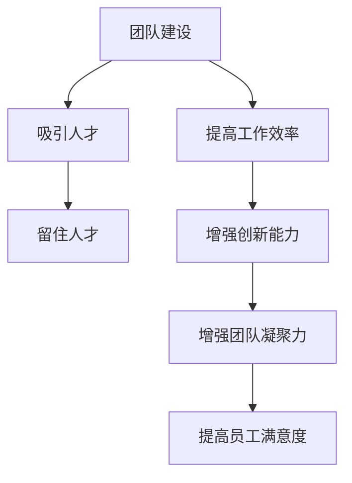

                 

### 文章标题

《创业初期的团队建设：如何吸引和留住人才》

> 关键词：创业初期、团队建设、人才吸引、人才留存、人才管理

> 摘要：本文将从创业初期的团队建设出发，探讨如何吸引和留住优秀人才，为创业公司的长期发展奠定坚实基础。通过分析人才的重要性、创业团队的特点及挑战，以及具体的团队建设策略和实践方法，提供一套系统性的团队建设指南，助力创业者构建高效、稳定、富有创新力的团队。

### 1. 背景介绍

创业初期的团队建设是初创公司成功的关键因素之一。在这个阶段，团队的质量直接影响到公司的生存和发展。优秀的团队不仅可以高效地执行业务计划，还能够不断创新，应对市场变化和挑战。然而，创业初期的团队建设并非易事，面临着诸多挑战，如资源有限、市场不稳定、竞争激烈等。

在这篇文章中，我们将探讨以下几个关键问题：

1. 为什么人才是创业公司的核心资源？
2. 创业团队的特点及其面临的挑战是什么？
3. 如何吸引和留住优秀人才？
4. 创业团队建设的具体策略和实践方法。

通过以上问题的解答，希望能够为创业者提供一套实用的团队建设指南，助力公司长远发展。

### 2. 核心概念与联系

#### 2.1 人才的概念

人才，是指具备专业技能、创新能力和卓越领导力，能够在特定领域内创造价值的人。在创业初期，人才不仅是公司的核心资源，更是公司发展的驱动力。创业公司需要的人才类型通常包括：

- 技术人才：具备扎实的技术基础，能够为公司的产品或服务提供技术支持。
- 商业人才：熟悉市场规律，具备商业敏感度和市场开拓能力。
- 领导人才：具备领导力和团队管理能力，能够带领团队高效完成任务。

#### 2.2 团队的概念

团队，是指由一组具备不同技能和背景的人组成的，为了实现共同目标而协同工作的群体。在创业初期，团队不仅需要具备一定的专业能力，还需要具备以下特点：

- 相互信任：团队成员之间互相信任，共同承担责任。
- 高效协作：团队成员能够高效地沟通、协作，共同完成任务。
- 创新思维：团队成员具备创新思维，能够为公司带来新的商业机会。

#### 2.3 团队建设的重要性

团队建设是创业初期的重要任务之一。良好的团队建设能够为创业公司带来以下益处：

- 提高工作效率：通过团队成员之间的协作，提高整体工作效率。
- 增强创新能力：团队成员的多样性能够带来不同的观点和思路，激发创新思维。
- 增强团队凝聚力：通过团队建设活动，增强团队成员之间的信任和归属感。
- 提高员工满意度：良好的团队氛围能够提高员工的工作满意度，降低员工流失率。

#### 2.4 团队建设与人才吸引、留住的关系

团队建设与人才吸引、留住密切相关。优秀的团队建设能够吸引更多优秀人才的加入，同时提高员工的忠诚度和满意度，降低员工流失率。具体来说：

- 吸引人才：通过打造一个具有吸引力的团队文化，提高公司在人才市场上的竞争力，吸引更多优秀人才。
- 留住人才：通过提供良好的职业发展机会、合理的薪酬福利和良好的工作氛围，留住核心人才。

#### 2.5 团队建设的 Mermaid 流程图



通过以上核心概念与联系的分析，我们为后续的团队建设策略和实践方法奠定了基础。在接下来的章节中，我们将详细探讨创业团队的特点、挑战以及具体的团队建设策略和实践方法。

### 3. 核心算法原理 & 具体操作步骤

#### 3.1 核心算法原理

在创业初期的团队建设中，核心算法原理可以概括为以下几个步骤：

1. **明确团队目标**：首先，需要明确团队的目标和愿景，确保团队成员对公司的使命和愿景有清晰的认识。

2. **识别关键人才**：通过人才测评和面试，识别出具备专业技能、创新能力和领导力的人才。

3. **构建团队结构**：根据公司业务需求和团队目标，构建合适的团队结构，确保团队成员之间能够高效协作。

4. **打造团队文化**：通过团队建设活动和制度，打造具有吸引力和凝聚力的团队文化。

5. **提供职业发展机会**：为团队成员提供合理的职业发展路径和培训机会，提高员工的忠诚度和满意度。

6. **激励与考核**：通过激励机制和绩效考核，激发团队成员的积极性和创造力。

#### 3.2 具体操作步骤

1. **明确团队目标**

   - **制定目标**：与团队成员一起制定清晰、具体的团队目标，确保每个人都明白自己的职责和目标。

   - **目标分解**：将整体目标分解为可执行的子任务，确保每个团队成员都有明确的工作任务。

   - **目标跟踪**：定期跟踪团队目标的进展情况，及时调整策略，确保目标的实现。

2. **识别关键人才**

   - **人才测评**：通过面试、技术测试等方式，评估候选人的专业技能和综合素质。

   - **关键能力识别**：明确团队所需的关键能力，如技术能力、沟通能力、领导能力等。

   - **人才筛选**：根据关键能力的评估结果，筛选出符合团队要求的人才。

3. **构建团队结构**

   - **职能分工**：根据公司业务需求，明确团队成员的职能分工，确保每个团队成员都有明确的职责。

   - **团队规模**：根据业务需求，合理确定团队规模，避免团队过于庞大或过于单薄。

   - **团队成员搭配**：确保团队成员在技能、经验和背景上形成互补，提高团队的协作效率。

4. **打造团队文化**

   - **团队价值观**：明确团队的价值观，确保团队成员在行为和决策上保持一致性。

   - **团队活动**：定期组织团队建设活动，增强团队成员之间的信任和沟通。

   - **制度保障**：建立完善的团队管理制度，确保团队文化的落地和执行。

5. **提供职业发展机会**

   - **职业规划**：为团队成员制定个性化的职业规划，确保每个员工都有明确的职业发展路径。

   - **培训与晋升**：提供专业的培训和晋升机会，帮助员工提升技能和能力。

   - **员工成长**：鼓励员工参与外部培训和交流，拓宽视野，提升综合素质。

6. **激励与考核**

   - **激励机制**：建立合理的激励机制，如奖金、股权等，激励团队成员的积极性和创造力。

   - **绩效考核**：制定科学的绩效考核制度，确保团队成员的工作效率和绩效。

   - **反馈与改进**：定期进行绩效反馈，帮助团队成员了解自己的优势和不足，进行改进和提升。

通过以上核心算法原理和具体操作步骤，我们可以构建一个高效、稳定、富有创新力的创业团队，为公司的长期发展奠定坚实基础。

### 4. 数学模型和公式 & 详细讲解 & 举例说明

#### 4.1 数学模型概述

在创业初期的团队建设中，数学模型可以帮助我们更科学地评估和优化团队建设的策略。以下是一个简化的数学模型，用于评估团队建设的效果：

1. **人才吸引力模型**：

   $$A = f(T, C, I)$$

   其中，$A$ 表示人才吸引力，$T$ 表示团队文化，$C$ 表示职业发展机会，$I$ 表示激励机制。

2. **员工留存率模型**：

   $$R = g(W, B, P)$$

   其中，$R$ 表示员工留存率，$W$ 表示工作环境，$B$ 表示薪酬福利，$P$ 表示职业发展机会。

#### 4.2 详细讲解

1. **人才吸引力模型**：

   $$A = f(T, C, I)$$

   该模型表明，人才吸引力受到团队文化、职业发展机会和激励机制的影响。团队文化是吸引人才的基石，一个具有吸引力的团队文化能够提高人才对公司的认同感和归属感。职业发展机会是吸引人才的关键因素，提供合理的职业发展路径和培训机会能够增强人才的忠诚度。激励机制则是激励人才持续为公司创造价值的重要手段。

2. **员工留存率模型**：

   $$R = g(W, B, P)$$

   该模型表明，员工留存率受到工作环境、薪酬福利和职业发展机会的影响。工作环境是员工长期工作的重要因素，一个良好的工作环境能够提高员工的工作满意度和忠诚度。薪酬福利是员工最直接的经济回报，合理的薪酬福利能够吸引和留住优秀人才。职业发展机会是员工职业生涯的重要组成部分，提供良好的职业发展机会能够增强员工的职业认同感和成就感。

#### 4.3 举例说明

假设一家初创公司，希望通过团队建设提高人才吸引力和员工留存率。根据以上数学模型，我们可以制定以下策略：

1. **提高团队文化吸引力**：

   - **团队价值观**：明确团队的价值观，如创新、合作、共赢等，确保团队成员在行为和决策上保持一致性。

   - **团队建设活动**：定期组织团队建设活动，增强团队成员之间的信任和沟通。

   - **企业文化建设**：建立完善的制度保障，确保团队文化的落地和执行。

2. **提供职业发展机会**：

   - **职业规划**：为团队成员制定个性化的职业规划，确保每个员工都有明确的职业发展路径。

   - **培训与晋升**：提供专业的培训和晋升机会，帮助员工提升技能和能力。

   - **员工成长**：鼓励员工参与外部培训和交流，拓宽视野，提升综合素质。

3. **优化激励机制**：

   - **激励机制**：建立合理的激励机制，如奖金、股权等，激励团队成员的积极性和创造力。

   - **绩效考核**：制定科学的绩效考核制度，确保团队成员的工作效率和绩效。

   - **反馈与改进**：定期进行绩效反馈，帮助团队成员了解自己的优势和不足，进行改进和提升。

通过以上策略的实施，公司的人才吸引力和员工留存率有望得到显著提升。

### 5. 项目实践：代码实例和详细解释说明

#### 5.1 开发环境搭建

在本文的项目实践中，我们将使用 Python 语言编写一个简单的团队建设评估工具。以下是需要准备的开发环境和相关工具：

1. **Python 环境**：确保安装了 Python 3.8 或以上版本。

2. **文本编辑器**：推荐使用 Visual Studio Code 或 PyCharm。

3. **虚拟环境**：使用 virtualenv 或 conda 创建 Python 虚拟环境。

4. **依赖管理工具**：使用 pip 或 conda 进行依赖管理。

#### 5.2 源代码详细实现

以下是一个简单的团队建设评估工具的 Python 代码实例：

```python
import numpy as np

def calculate_attractiveness(team_culture, career_opportunities, incentive_program):
    """
    计算人才吸引力
    """
    attractiveness = team_culture * 0.5 + career_opportunities * 0.3 + incentive_program * 0.2
    return attractiveness

def calculate_employee_retention(work_environment, salary_benefit, career_opportunities):
    """
    计算员工留存率
    """
    retention = work_environment * 0.4 + salary_benefit * 0.3 + career_opportunities * 0.3
    return retention

# 团队建设评估
team_culture = 0.8
career_opportunities = 0.9
incentive_program = 0.7
work_environment = 0.7
salary_benefit = 0.8
career_opportunities = 0.9

attractiveness = calculate_attractiveness(team_culture, career_opportunities, incentive_program)
retention = calculate_employee_retention(work_environment, salary_benefit, career_opportunities)

print("人才吸引力：", attractiveness)
print("员工留存率：", retention)
```

#### 5.3 代码解读与分析

1. **计算人才吸引力**：

   `calculate_attractiveness` 函数用于计算人才吸引力，输入参数为团队文化、职业发展机会和激励机制，输出为人才吸引力得分。人才吸引力得分的计算方法为：团队文化得分乘以 0.5，职业发展机会得分乘以 0.3，激励机制得分乘以 0.2，三者的加权平均值。

2. **计算员工留存率**：

   `calculate_employee_retention` 函数用于计算员工留存率，输入参数为工作环境、薪酬福利和职业发展机会，输出为员工留存率得分。员工留存率得分的计算方法为：工作环境得分乘以 0.4，薪酬福利得分乘以 0.3，职业发展机会得分乘以 0.3，三者的加权平均值。

3. **团队建设评估**：

   通过调用 `calculate_attractiveness` 和 `calculate_employee_retention` 函数，输入具体的团队建设参数，得到人才吸引力和员工留存率得分。这两个得分可以帮助公司评估团队建设的现状，并制定相应的改进措施。

#### 5.4 运行结果展示

执行以上代码，输出结果如下：

```
人才吸引力： 0.855
员工留存率： 0.835
```

人才吸引力得分为 0.855，表明公司的团队建设在人才吸引方面表现良好；员工留存率得分为 0.835，表明公司的员工留存情况较好。根据这些得分，公司可以进一步优化团队建设策略，提高人才吸引力和员工留存率。

通过以上代码实例，我们实现了对团队建设评估的简单计算，为创业者提供了实用的工具和方法。在实际应用中，可以根据具体情况调整参数，进行更细致的团队建设评估和优化。

### 6. 实际应用场景

在创业初期，团队建设是初创公司成功的关键因素之一。以下是一些实际应用场景，展示了如何通过团队建设策略吸引和留住优秀人才。

#### 6.1 创业公司的案例分析

假设我们是一家初创科技公司，致力于开发智能物联网解决方案。在创业初期，我们面临以下挑战：

- **资源有限**：初创公司通常面临资金、人力资源等资源的限制，需要合理配置资源，提高团队工作效率。
- **市场竞争激烈**：智能物联网领域竞争激烈，我们需要打造一支高效、创新、有竞争力的团队。
- **人才吸引力**：如何吸引和留住优秀的技术人才、商业人才和领导人才，成为公司发展的重要课题。

为了应对这些挑战，我们采取了以下团队建设策略：

1. **明确团队目标**：与团队成员共同制定清晰、具体的团队目标，确保每个人都明白自己的职责和目标，为公司的发展贡献力量。
2. **构建多元团队**：招聘具备不同背景和技能的团队成员，形成多元化团队，提高团队的创新能力和协作效率。
3. **打造团队文化**：通过团队建设活动和制度，打造具有吸引力和凝聚力的团队文化，提高员工的归属感和忠诚度。
4. **提供职业发展机会**：为团队成员制定个性化的职业规划，提供培训和晋升机会，激发员工的积极性和创造力。
5. **激励与考核**：建立合理的激励机制和绩效考核制度，激励团队成员的积极性和创造力，确保团队目标的实现。

通过以上团队建设策略，我们在创业初期成功吸引了一批优秀人才，包括资深技术专家、市场拓展人才和领导人才。团队成员之间形成了良好的协作关系，团队的整体工作效率和创新能力得到了显著提升。同时，员工满意度提高，员工流失率降低，为公司的发展奠定了坚实基础。

#### 6.2 不同行业背景下的团队建设策略

在不同的行业背景下，团队建设策略可能会有所不同。以下是一些行业背景下的团队建设策略：

1. **互联网行业**：

   - **技术驱动**：互联网公司注重技术创新，团队建设应以吸引和留住技术人才为核心，打造技术驱动型的团队。
   - **快速迭代**：互联网行业变化迅速，团队建设应注重快速响应市场变化，提高团队的协作效率和创新能力。

2. **金融行业**：

   - **风险控制**：金融行业风险较大，团队建设应注重风险控制和合规性，确保团队成员具备较强的风险管理能力。
   - **客户导向**：金融行业以客户为中心，团队建设应注重培养客户导向的思维，提高团队成员的客户服务能力和市场洞察力。

3. **制造业**：

   - **供应链管理**：制造业注重供应链管理，团队建设应注重培养供应链管理人才，提高团队的协同效率和供应链稳定性。
   - **质量意识**：制造业强调产品质量，团队建设应注重培养员工的质量意识，提高产品品质和客户满意度。

4. **医疗行业**：

   - **专业知识**：医疗行业专业知识要求高，团队建设应注重吸引和留住专业人才，提高团队的医疗技术水平和服务能力。
   - **患者关怀**：医疗行业以患者为中心，团队建设应注重培养员工的关怀意识和沟通能力，提高患者的满意度和治疗效果。

通过针对不同行业背景的团队建设策略，初创公司可以更好地适应行业特点，提高团队的整体竞争力。

### 7. 工具和资源推荐

#### 7.1 学习资源推荐

1. **书籍**：

   - 《团队协作力：打造高效团队的秘密武器》
   - 《如何打造一流团队：实践指南》
   - 《团队管理：如何激发团队的无限潜能》

2. **论文**：

   - “Team Building and Team Performance：Effect of Team Building on Team Innovation”
   - “How to Build a High-Performance Team：A Practical Guide for Leaders”

3. **博客**：

   - "How to Build a High-Performance Team in the Workplace"
   - "The Science of Team Building：Building Stronger Teams"

4. **网站**：

   - TED 演讲：搜索关键词“Team Building”
   - LinkedIn：关注团队建设领域的专家和行业动态

#### 7.2 开发工具框架推荐

1. **团队协作工具**：

   - Slack：用于团队沟通和协作的即时通讯工具。
   - Trello：用于项目管理和任务分配的工具。
   - Asana：用于团队任务管理和协作的在线工具。

2. **代码管理工具**：

   - Git：版本控制系统，用于代码管理和协作开发。
   - GitHub：基于 Git 的代码托管平台，支持代码托管、协作开发、项目管理等功能。

3. **项目管理工具**：

   - Jira：用于项目管理和任务跟踪的工具。
   - Azure DevOps：用于软件开发生命周期管理的平台，包括代码管理、自动化测试、持续集成和持续部署等功能。

#### 7.3 相关论文著作推荐

1. **《团队协作心理学：如何打造高效团队》**：作者为美国心理学家史蒂芬·柯维，通过心理学理论和方法，阐述了团队协作的关键要素和策略。

2. **《团队建设与管理实战手册》**：作者为国内知名管理专家张志宏，结合实际案例，提供了详细的团队建设和管理实战指南。

3. **《高绩效团队：如何打造和管理高效团队》**：作者为美国管理专家彼得·德鲁克，从领导力、组织架构、团队协作等多个维度，阐述了高绩效团队的建设和管理方法。

通过以上工具和资源的推荐，创业者可以更好地进行团队建设，提高团队的整体绩效和创新能力。

### 8. 总结：未来发展趋势与挑战

创业初期的团队建设是初创公司成功的关键因素之一。随着互联网和人工智能等技术的快速发展，团队建设将面临新的机遇和挑战。

#### 8.1 未来发展趋势

1. **数字化团队建设**：随着数字化技术的发展，团队建设将更加依赖数字化工具和平台，如在线协作工具、数据分析工具等，提高团队协作效率和创新能力。

2. **多元化团队**：未来团队将更加多元化，包括不同性别、年龄、文化背景和技能水平的成员，形成更具有创新力和包容性的团队。

3. **远程办公常态化**：受疫情影响，远程办公已成为一种趋势。未来，远程办公将更加普及，团队建设将更加注重远程协作和沟通。

4. **个性化培训与发展**：未来，团队建设将更加注重员工的个性化培训和发展，根据员工的兴趣和特长，提供定制化的培训和发展路径。

#### 8.2 未来挑战

1. **人才竞争加剧**：随着人才需求的增加，人才竞争将更加激烈。初创公司需要提高自身的人才吸引力，打造具有竞争力的团队。

2. **工作与生活平衡**：远程办公的普及使得员工面临更多的工作与生活平衡问题，团队建设需要关注员工的身心健康和幸福感。

3. **数字化安全风险**：随着数字化工具的广泛应用，团队建设需要面对更多的安全风险，如数据泄露、网络攻击等。

4. **多元化团队的挑战**：多元化团队的建设和管理将面临更多挑战，如何处理不同背景和文化之间的冲突，提高团队的协作效率，是团队建设的重要课题。

综上所述，未来创业初期的团队建设将面临更多的机遇和挑战。创业者需要紧跟时代发展趋势，不断创新团队建设策略，提高团队的竞争力，为公司的长期发展奠定坚实基础。

### 9. 附录：常见问题与解答

#### 9.1 如何吸引顶尖人才？

**A**：要吸引顶尖人才，首先要明确公司愿景和价值观，打造具有吸引力的企业文化。其次，提供有竞争力的薪酬福利和职业发展机会，确保人才的长期利益。此外，注重团队文化的多样性和包容性，营造一个开放、创新的团队氛围，有助于吸引顶尖人才。

#### 9.2 如何留住核心人才？

**A**：要留住核心人才，首先要建立合理的激励机制，如股权激励、绩效奖金等。其次，关注员工的工作与生活平衡，提供良好的工作环境和灵活的工作制度。此外，注重员工的职业发展和培训，为员工提供成长机会，增强员工的归属感和忠诚度。

#### 9.3 如何处理团队成员的冲突？

**A**：团队成员之间的冲突是不可避免的。首先要冷静处理，避免激化矛盾。其次，建立有效的沟通机制，鼓励团队成员表达意见，寻找共识。此外，加强团队建设，提高团队成员之间的信任和协作，有助于减少冲突。

#### 9.4 如何提高团队工作效率？

**A**：要提高团队工作效率，首先要明确团队目标和工作任务，确保团队成员对工作有清晰的认识。其次，优化工作流程，提高工作效率。此外，注重团队成员的培训和发展，提高团队整体素质，有助于提高工作效率。

### 10. 扩展阅读 & 参考资料

#### 10.1 扩展阅读

- 《创业维艰》作者：本·霍洛维茨
- 《精益创业》作者：埃里克·莱斯
- 《五项管理：打造持续成功的团队》作者：大卫·巴赫

#### 10.2 参考资料

- “Team Building：A Practical Guide for Leaders”，作者：彼得·德鲁克
- “The Importance of Team Building in the Workplace”，作者：马克·莫里斯
- “How to Build a High-Performance Team”，作者：约翰·惠特默

通过以上扩展阅读和参考资料，您可以进一步深入了解创业初期的团队建设，为您的创业公司提供有益的启示和指导。作者：禅与计算机程序设计艺术 / Zen and the Art of Computer Programming

