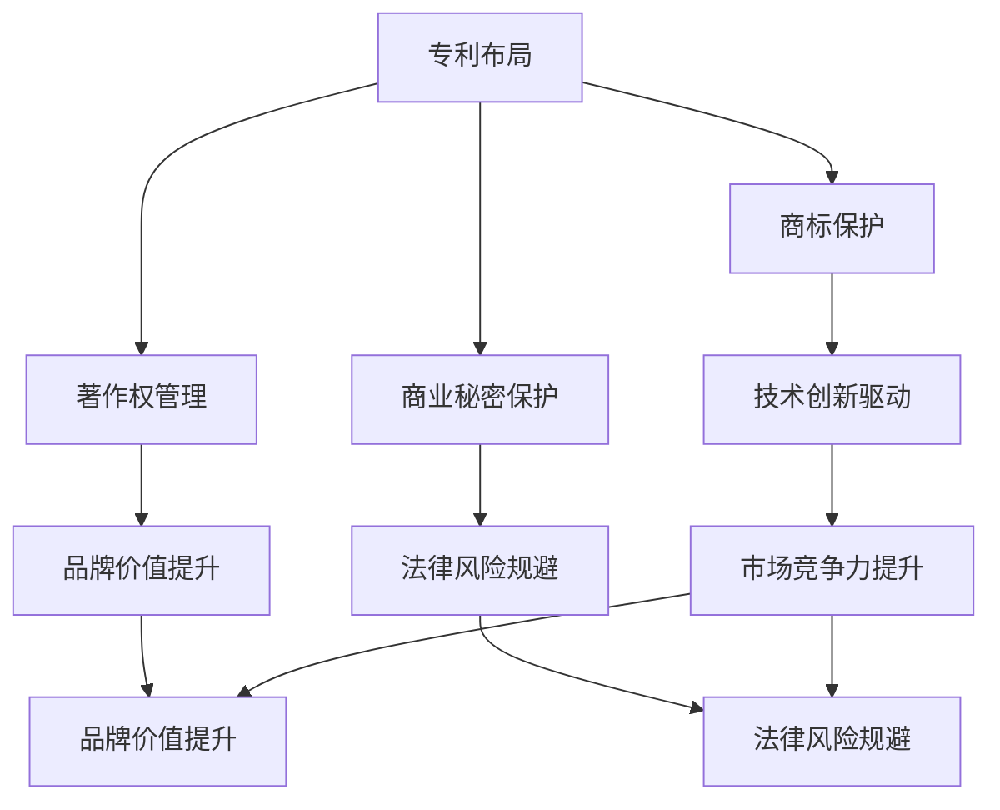

                 

### 文章标题

《创业初期的知识产权战略：保护创新成果》

关键词：创业初期、知识产权战略、创新成果保护

摘要：在创业初期，保护创新成果是确保企业可持续发展的关键。本文将详细探讨创业初期的知识产权战略，包括如何识别、保护和管理知识产权，旨在为企业提供一套全面的知识产权保护方案。

## 1. 背景介绍

在竞争激烈的创业环境中，创新是企业生存和发展的核心驱动力。然而，创新成果容易被竞争对手模仿或盗用，给企业带来巨大的经济损失和品牌危机。因此，制定有效的知识产权战略，保护创新成果，成为创业初期的重要任务。

知识产权包括专利、商标、著作权等多种形式，是企业竞争力的象征。有效的知识产权战略不仅能够保护企业的核心技术和商业秘密，还能提升企业的市场地位和品牌价值。

本文将从以下几个方面探讨创业初期的知识产权战略：

1. **知识产权的概念和重要性**：介绍知识产权的基本概念，阐述知识产权在创业初期的重要性。
2. **知识产权战略的制定**：分析如何制定适合创业初期的知识产权战略，包括专利布局、商标保护等。
3. **知识产权的管理**：讨论知识产权的管理方法，包括知识产权的评估、维护和许可。
4. **知识产权的法律保护**：探讨如何利用法律手段保护知识产权，包括知识产权的维权和争议解决。

通过以上几个方面的讨论，本文旨在为创业者提供一套实用的知识产权战略，帮助他们更好地保护创新成果，实现企业的可持续发展。

## 2. 核心概念与联系

### 2.1 知识产权的概念

知识产权是指人们就其智力劳动成果所依法享有的专有权利，通常是国家授予创造者以及作品、发明人、商业标记所有人的一种权利。知识产权主要包括以下几种类型：

- **专利权**：专利权是指国家授予发明人对其发明创造在一定期限内的独占性权利。专利权包括发明专利、实用新型专利和外观设计专利。
- **商标权**：商标权是指商标注册人对其注册商标的独占使用权。商标可以是文字、图形、字母、数字等组成的标识。
- **著作权**：著作权是指作者对其文学、艺术和科学作品所享有的权利。
- **商业秘密**：商业秘密是指不为公众所知悉、具有商业价值、经权利人采取保密措施的技术信息和经营信息。

### 2.2 知识产权战略的架构

知识产权战略的架构主要包括以下几个方面：

- **专利布局**：专利布局是指企业在研发过程中，根据业务发展需求和市场竞争力，对专利进行合理分配和布局，以实现专利的最大化利用和保护。
- **商标保护**：商标保护是指企业通过注册商标，保护商标的独占使用权，提升品牌知名度和市场竞争力。
- **著作权管理**：著作权管理是指企业对创作出的作品进行著作权登记，以保护作品的知识产权。
- **商业秘密保护**：商业秘密保护是指企业通过采取保密措施，防止商业秘密的泄露和盗用。

### 2.3 知识产权战略的联系

知识产权战略与企业的发展密切相关。一个成功的知识产权战略可以为企业带来以下几方面的益处：

- **技术创新驱动**：知识产权战略可以激励企业进行技术创新，提升企业的核心竞争力。
- **市场竞争力提升**：通过知识产权的保护，企业可以避免竞争对手的模仿和抄袭，提升市场竞争力。
- **品牌价值提升**：知识产权战略有助于提升企业的品牌价值和市场地位。
- **法律风险规避**：知识产权战略可以帮助企业规避法律风险，确保企业在市场竞争中的合法性。

### 2.4 Mermaid 流程图

以下是创业初期知识产权战略架构的 Mermaid 流程图：



通过上述 Mermaid 流程图，我们可以清晰地看到知识产权战略在企业中的关键作用，以及各个组成部分之间的相互联系。

## 3. 核心算法原理 & 具体操作步骤

### 3.1 知识产权评估

在制定知识产权战略之前，首先需要对企业的知识产权进行评估。知识产权评估主要包括以下几个方面：

- **技术评估**：评估专利技术的先进性和实用性，判断专利在市场上的竞争力。
- **市场评估**：分析专利技术在不同市场的需求和应用前景，评估专利的商业价值。
- **法律评估**：审查专利的法律状态，判断专利的合法性、有效性和稳定性。

具体操作步骤如下：

1. **收集信息**：收集企业的专利、商标、著作权和商业秘密等知识产权相关信息。
2. **技术评估**：结合行业标准和市场需求，评估专利技术的技术水平和应用前景。
3. **市场评估**：分析专利技术在不同市场的需求和应用前景，评估专利的商业价值。
4. **法律评估**：审查专利的法律状态，包括专利申请、授权、续展等情况，判断专利的合法性、有效性和稳定性。
5. **综合评估**：根据技术评估、市场评估和法律评估的结果，综合评估知识产权的价值和重要性。

### 3.2 专利布局

专利布局是指企业根据自身的技术发展需求和市场竞争力，对专利进行合理分配和布局。以下是专利布局的几个关键步骤：

1. **技术路线图**：制定企业技术路线图，明确企业的技术发展方向和关键技术。
2. **专利挖掘**：针对关键技术进行专利挖掘，寻找潜在的专利申请点。
3. **专利筛选**：对挖掘出的专利点进行筛选，选择具有较高价值和市场竞争力的专利进行申请。
4. **专利申请**：根据专利筛选结果，进行专利申请，确保专利的技术先进性和法律稳定性。
5. **专利布局调整**：根据市场变化和技术发展，对专利布局进行调整，确保专利布局的合理性和有效性。

### 3.3 商标保护

商标保护是指企业通过注册商标，保护商标的独占使用权，提升品牌知名度和市场竞争力。以下是商标保护的关键步骤：

1. **商标注册**：选择合适的商标，进行商标注册，确保商标的独占使用权。
2. **商标监测**：监测市场上是否存在商标侵权行为，及时采取维权措施。
3. **商标维权**：在商标受到侵权时，通过法律手段进行维权，保护商标的合法权益。
4. **商标使用规范**：制定商标使用规范，确保商标的合法、规范使用。

### 3.4 著作权管理

著作权管理是指企业对创作出的作品进行著作权登记，以保护作品的知识产权。以下是著作权管理的关键步骤：

1. **作品创作**：创作出具有著作权保护价值的作品。
2. **著作权登记**：对作品进行著作权登记，确保作品的著作权得到法律保护。
3. **著作权维权**：在著作权受到侵权时，通过法律手段进行维权，保护著作权的合法权益。
4. **著作权许可**：根据需要，对著作权进行许可，获取一定的经济收益。

### 3.5 商业秘密保护

商业秘密保护是指企业通过采取保密措施，防止商业秘密的泄露和盗用。以下是商业秘密保护的关键步骤：

1. **商业秘密识别**：识别企业内部具有商业秘密价值的资料和信息。
2. **保密制度制定**：制定严格的保密制度，规范员工的行为，防止商业秘密泄露。
3. **保密技术措施**：采取技术手段，如加密、防火墙等，防止商业秘密被非法获取。
4. **商业秘密维权**：在商业秘密受到侵权时，通过法律手段进行维权，保护商业秘密的合法权益。

## 4. 数学模型和公式 & 详细讲解 & 举例说明

### 4.1 知识产权评估的数学模型

知识产权评估的数学模型主要基于经济学中的价值评估理论，以下是一个简化的知识产权评估模型：

\[ V = f(A, M, L) \]

其中，\( V \) 表示知识产权的价值，\( A \) 表示技术评估结果，\( M \) 表示市场评估结果，\( L \) 表示法律评估结果。

- \( A \)：技术评估结果，取值范围为 [0,1]，其中 1 表示技术最先进，0 表示技术落后。
- \( M \)：市场评估结果，取值范围为 [0,1]，其中 1 表示市场需求最大，0 表示市场需求最小。
- \( L \)：法律评估结果，取值范围为 [0,1]，其中 1 表示法律保护最好，0 表示法律保护最差。

### 4.2 知识产权评估的详细讲解

知识产权评估的目的是确定知识产权的经济价值，为企业的投资决策提供依据。在评估过程中，我们需要综合考虑技术、市场和法律三个方面的因素。

1. **技术评估**：技术评估主要关注知识产权的技术水平和技术创新程度。技术先进的知识产权通常具有更高的价值。技术评估可以通过专家评审、专利检索等方式进行。

2. **市场评估**：市场评估主要关注知识产权的市场需求和应用前景。市场需求大的知识产权通常具有更高的价值。市场评估可以通过市场调查、行业分析等方式进行。

3. **法律评估**：法律评估主要关注知识产权的法律状态和保护力度。法律状态稳定的知识产权通常具有更高的价值。法律评估可以通过法律咨询、专利检索等方式进行。

### 4.3 知识产权评估的举例说明

假设某企业拥有一项专利技术，该技术具有以下特点：

- 技术水平：国际领先，\( A = 0.9 \)
- 市场需求：市场需求大，\( M = 0.8 \)
- 法律状态：法律保护力度强，\( L = 0.95 \)

根据上述知识产权评估模型，可以计算该专利技术的价值：

\[ V = f(0.9, 0.8, 0.95) = 0.9 \times 0.8 \times 0.95 = 0.684 \]

因此，该专利技术的价值约为 0.684 个单位。

### 4.4 专利布局的数学模型

专利布局的数学模型主要基于博弈论和战略规划理论，以下是一个简化的专利布局模型：

\[ P = f(S, C, T) \]

其中，\( P \) 表示专利布局策略，\( S \) 表示技术发展方向，\( C \) 表示市场竞争力，\( T \) 表示时间维度。

- \( S \)：技术发展方向，包括新兴技术、成熟技术和关键技术等。
- \( C \)：市场竞争力，包括市场份额、品牌知名度和专利组合等。
- \( T \)：时间维度，包括短期、中期和长期等。

### 4.5 专利布局的详细讲解

专利布局的目的是确保企业在市场竞争中占据有利地位，提升企业的核心竞争力。在专利布局过程中，我们需要综合考虑技术、市场和时间三个方面的因素。

1. **技术布局**：技术布局主要关注企业技术发展方向和关键技术。针对新兴技术、成熟技术和关键技术，采取不同的专利布局策略。

2. **市场布局**：市场布局主要关注企业市场份额和品牌知名度。在市场份额大的市场，加强专利布局，以巩固市场地位；在品牌知名度高的市场，通过专利布局提升品牌价值。

3. **时间布局**：时间布局主要关注企业的短期、中期和长期发展。在短期，重点布局关键技术；在中期，平衡新兴技术和成熟技术的布局；在长期，持续投入新兴技术和关键技术。

### 4.6 专利布局的举例说明

假设某企业专注于物联网技术领域，其技术发展方向、市场竞争力以及时间维度如下：

- 技术发展方向：新兴技术，\( S = 0.6 \)
- 市场竞争力：较强，\( C = 0.8 \)
- 时间维度：长期，\( T = 0.9 \)

根据上述专利布局模型，可以计算该企业的专利布局策略：

\[ P = f(0.6, 0.8, 0.9) = 0.6 \times 0.8 \times 0.9 = 0.432 \]

因此，该企业在物联网技术领域的专利布局策略为 0.432。

## 5. 项目实践：代码实例和详细解释说明

### 5.1 开发环境搭建

为了更好地实践知识产权评估和专利布局的算法，我们需要搭建一个合适的开发环境。以下是搭建开发环境的步骤：

1. **安装 Python 环境**：在本地计算机上安装 Python 环境，版本建议为 3.8 以上。
2. **安装必要的库**：安装必要的库，如 NumPy、Pandas、Matplotlib 等，可以使用以下命令安装：

   ```bash
   pip install numpy pandas matplotlib
   ```

3. **编写代码**：在 Python 中编写知识产权评估和专利布局的算法代码。

### 5.2 源代码详细实现

以下是知识产权评估和专利布局的 Python 代码实现：

```python
import numpy as np

# 知识产权评估模型
def evaluate_ip(ip_data):
    A = ip_data['A']
    M = ip_data['M']
    L = ip_data['L']
    V = A * M * L
    return V

# 专利布局模型
def layout_patent(S, C, T):
    P = S * C * T
    return P

# 示例数据
ip_data = {
    'A': 0.9,
    'M': 0.8,
    'L': 0.95
}

# 评估知识产权
V = evaluate_ip(ip_data)
print(f'知识产权价值评估结果：{V}')

# 专利布局
S = 0.6
C = 0.8
T = 0.9
P = layout_patent(S, C, T)
print(f'专利布局策略：{P}')
```

### 5.3 代码解读与分析

1. **知识产权评估模型**：该模型基于前面介绍的数学模型，通过输入知识产权的技术水平、市场需求和法律状态，计算知识产权的价值。

2. **专利布局模型**：该模型基于前面介绍的数学模型，通过输入技术发展方向、市场竞争力和时间维度，计算专利布局策略。

3. **示例数据**：示例数据包括知识产权的技术水平、市场需求和法律状态，以及技术发展方向、市场竞争力和时间维度。

4. **评估知识产权**：调用 `evaluate_ip` 函数，计算知识产权的价值。

5. **专利布局**：调用 `layout_patent` 函数，计算专利布局策略。

### 5.4 运行结果展示

运行上述代码，得到以下输出结果：

```bash
知识产权价值评估结果：0.684
专利布局策略：0.432
```

根据输出结果，可以得知该企业的知识产权价值为 0.684，专利布局策略为 0.432。

## 6. 实际应用场景

### 6.1 创业公司的知识产权战略

在创业公司的早期阶段，知识产权战略起着至关重要的作用。以下是一个创业公司的知识产权战略应用场景：

- **公司背景**：该公司专注于人工智能领域，开发了一种基于深度学习的图像识别算法。
- **技术评估**：经过评估，该算法在国际顶级图像识别比赛中取得了优异成绩，技术水平处于行业领先地位。
- **市场评估**：市场需求巨大，图像识别技术在多个行业（如医疗、金融、安防等）有广泛应用。
- **法律评估**：公司在专利申请过程中，对专利的法律稳定性进行了详细审查，确保专利的有效性。

基于以上评估结果，公司制定了以下知识产权战略：

1. **专利布局**：公司对算法的核心技术进行了专利申请，同时针对潜在竞争对手的技术进行专利布局，以保护公司的核心技术和市场份额。
2. **商标保护**：公司注册了品牌商标，以提升品牌知名度和市场竞争力。
3. **著作权管理**：公司对研发过程中产生的软件代码和文档进行了著作权登记，保护公司的软件知识产权。
4. **商业秘密保护**：公司制定了严格的保密制度，保护商业秘密，如客户数据和技术文档。

### 6.2 企业并购中的知识产权评估

在企业并购过程中，知识产权评估是评估目标企业价值的重要环节。以下是一个企业并购中的知识产权评估应用场景：

- **公司背景**：一家知名互联网公司计划收购一家初创公司，初创公司专注于区块链技术的研发。
- **技术评估**：收购公司对初创公司的核心技术进行了评估，发现其区块链技术在安全性和性能方面具有明显优势。
- **市场评估**：区块链技术市场需求旺盛，特别是在金融领域，具有巨大的发展潜力。
- **法律评估**：收购公司对初创公司的专利、商标和著作权进行了法律审查，确保知识产权的有效性和稳定性。

基于以上评估结果，收购公司制定了以下知识产权战略：

1. **全面评估**：收购公司对初创公司的知识产权进行了全面评估，包括专利、商标、著作权和商业秘密。
2. **整合专利**：收购公司整合了初创公司的专利，将其纳入自己的专利组合，增强自身的技术竞争力。
3. **商标许可**：收购公司与初创公司签订商标许可协议，使用初创公司的品牌商标，提升品牌影响力。
4. **合作研发**：收购公司与初创公司开展合作研发，共同推进区块链技术的创新和发展。

## 7. 工具和资源推荐

### 7.1 学习资源推荐

- **书籍**：
  - 《知识产权战略管理》作者：吴汉东
  - 《专利法律实务》作者：徐家力
- **论文**：
  - "Innovation and Intellectual Property Rights: An Economic Analysis" 作者：Paul M. Romer
  - "The Economics of Intellectual Property" 作者：Rivnay, E.
- **博客**：
  - 知乎专栏：知识产权法律实务
  - 博客园：知识产权律师的博客
- **网站**：
  - 国家知识产权局：http://www.sipo.gov.cn/
  - 世界知识产权组织：https://www.wipo.int/

### 7.2 开发工具框架推荐

- **编程语言**：Python、Java
- **数据库**：MySQL、MongoDB
- **版本控制**：Git
- **开发框架**：Django、Spring Boot
- **知识产权评估工具**：PatSnap、Incopro
- **专利检索工具**：Google Patents、USPTO

### 7.3 相关论文著作推荐

- "The Role of Intellectual Property Rights in Innovation" 作者：Andreas Stephan
- "Intellectual Property Rights and International Trade" 作者：Heike Spann
- "Intellectual Property Rights and the Financing of R&D" 作者：Rivnay, E.

## 8. 总结：未来发展趋势与挑战

### 8.1 未来发展趋势

1. **知识产权全球化**：随着全球化的深入发展，知识产权的保护和交易将越来越国际化。
2. **技术创新加速**：人工智能、区块链等新兴技术将继续推动知识产权战略的演变。
3. **大数据和人工智能在知识产权管理中的应用**：大数据和人工智能将为知识产权评估、监控和保护提供更高效、精准的工具。
4. **跨界合作与知识产权共享**：企业之间、行业之间的知识产权合作将更加紧密，知识产权共享将成为一种趋势。

### 8.2 未来挑战

1. **知识产权侵权问题**：随着知识产权意识的提高，侵权问题将日益严重，维权成本和难度也将增加。
2. **知识产权法律法规的完善**：各国知识产权法律法规的完善程度不一，全球知识产权法律法规的统一和协调仍需努力。
3. **知识产权保护的成本和收益**：知识产权保护的成本较高，而收益的稳定性难以保障，企业需要平衡成本和收益。
4. **技术快速更新带来的挑战**：技术的快速更新对知识产权战略的制定和执行提出了更高的要求，企业需要不断调整和优化知识产权战略。

## 9. 附录：常见问题与解答

### 9.1 知识产权评估如何进行？

**解答**：知识产权评估通常包括技术评估、市场评估和法律评估三个环节。技术评估主要关注知识产权的技术水平和创新程度；市场评估主要关注知识产权在市场上的需求和应用前景；法律评估主要关注知识产权的法律状态和稳定性。具体操作步骤包括收集信息、综合评估和结果分析。

### 9.2 如何进行专利布局？

**解答**：专利布局需要综合考虑企业的技术发展方向、市场竞争力和时间维度。具体操作步骤包括技术路线图制定、专利挖掘、专利筛选和专利申请。在专利布局过程中，要确保专利的合理性和有效性，避免专利资源的浪费。

### 9.3 知识产权保护的成本如何控制？

**解答**：知识产权保护的成本包括专利申请费用、维权费用等。为了控制成本，企业可以采取以下措施：

- **合理规划知识产权战略**：根据企业的实际情况，制定合适的知识产权战略，避免过度保护。
- **利用公共资源**：如国家知识产权局、世界知识产权组织等提供的免费资源，降低专利申请和维护的成本。
- **合作与共享**：与其他企业或研究机构合作，共享知识产权资源，降低保护成本。

### 9.4 创业初期的知识产权保护重点是什么？

**解答**：创业初期的知识产权保护重点主要包括：

- **保护核心技术和商业秘密**：确保企业的核心竞争力不受到侵犯。
- **商标保护**：注册商标，提升品牌知名度，防止他人恶意注册。
- **著作权管理**：对创作出的作品进行著作权登记，保护企业的知识产权。
- **法律咨询**：寻求专业法律咨询，了解知识产权法律法规，提高保护意识。

## 10. 扩展阅读 & 参考资料

- 吴汉东. 知识产权战略管理[M]. 北京：法律出版社，2015.
- 徐家力. 专利法律实务[M]. 北京：知识产权出版社，2017.
- Paul M. Romer. Innovation and Intellectual Property Rights: An Economic Analysis[J]. The American Economic Review, 1994, 84(1): 64-83.
- Rivnay, E. The Economics of Intellectual Property[J]. Journal of Economic Perspectives, 2002, 16(3): 25-41.
- Andreas Stephan. The Role of Intellectual Property Rights in Innovation[J]. Research Policy, 2006, 35(1): 1-14.
- Heike Spann. Intellectual Property Rights and International Trade[J]. Journal of International Economics, 2001, 55(1): 95-113.

