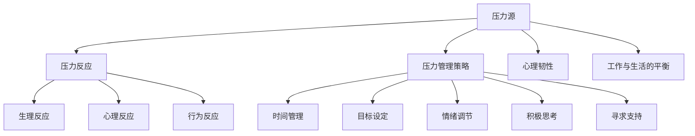

                 

### 1. 背景介绍

在当今快节奏的创业环境中，企业家和个人创业者面临着前所未有的挑战。他们不仅要应对市场的瞬息万变，还要处理大量的工作任务和复杂的人际关系。这种高压力环境往往会导致身心疲惫，甚至影响到创业成果的产出。因此，压力管理成为创业者成功的关键因素之一。

压力管理不仅仅是一个个人的问题，它关系到企业的整体运作和团队的稳定。过度的压力会导致创业者出现决策失误、工作效率下降、创新能力减弱等问题，进而影响到企业的长期发展。因此，如何有效地建立个人压力管理机制，对于创业者来说显得尤为重要。

本文将深入探讨创业者如何建立个人压力管理机制，从核心概念、具体操作步骤、数学模型、项目实践、应用场景等多个维度，为读者提供全面而系统的指导。文章将涵盖以下内容：

1. 背景介绍
2. 核心概念与联系
3. 核心算法原理 & 具体操作步骤
4. 数学模型和公式 & 详细讲解 & 举例说明
5. 项目实践：代码实例和详细解释说明
6. 实际应用场景
7. 工具和资源推荐
8. 总结：未来发展趋势与挑战
9. 附录：常见问题与解答
10. 扩展阅读 & 参考资料

通过这篇文章，希望能够帮助创业者认识到压力管理的重要性，掌握有效的压力管理方法，从而在激烈的竞争环境中保持良好的心理状态和高效的工作效率。

### 2. 核心概念与联系

在探讨创业者如何建立个人压力管理机制之前，我们需要明确几个核心概念，并理解它们之间的相互联系。这些核心概念包括：压力源、压力反应、压力管理策略、心理韧性、工作与生活的平衡等。

#### 压力源

压力源是指那些能够引发压力反应的内外部因素。对于创业者来说，常见的压力源包括：

1. **市场压力**：市场竞争激烈，客户需求多变，可能导致创业者在业务策略和产品开发上面临巨大压力。
2. **财务压力**：资金链断裂、融资困难等问题，可能使创业者承受巨大的财务压力。
3. **人际压力**：与员工、合作伙伴、客户和投资者等各方的人际关系处理，可能成为创业者的压力来源。
4. **个人目标**：创业者往往设定了较高的个人目标，追求卓越和成功，这种高期望也可能带来压力。

#### 压力反应

压力反应是指身体和心理对压力源的生理和心理反应。常见的压力反应包括：

1. **生理反应**：如心跳加快、血压升高、肌肉紧张等。
2. **心理反应**：如焦虑、抑郁、愤怒等情绪反应。
3. **行为反应**：如逃避、压抑、过度工作等。

#### 压力管理策略

压力管理策略是指创业者用来应对和缓解压力的一系列方法和技巧。有效的压力管理策略包括：

1. **时间管理**：合理安排时间，确保工作与休息时间的平衡。
2. **目标设定**：设定合理的目标，避免过度追求完美。
3. **情绪调节**：通过冥想、运动、社交等方式调节情绪。
4. **积极思考**：培养乐观心态，用积极的角度看待问题。
5. **寻求支持**：与家人、朋友、专业顾问等寻求心理支持。

#### 心理韧性

心理韧性是指个体在面对压力和逆境时，能够保持积极心态和适应能力的能力。创业者需要具备较高的心理韧性，才能在压力环境中保持冷静和理智。

#### 工作与生活的平衡

工作与生活的平衡是指创业者如何在繁忙的工作中抽出时间，进行家庭生活和个人休闲。平衡工作与生活不仅有助于缓解压力，还能提升整体幸福感。

#### Mermaid 流程图

为了更直观地展示这些核心概念之间的联系，我们可以使用 Mermaid 流程图来表示：



通过这张流程图，我们可以清晰地看到压力源如何引发压力反应，以及压力管理策略如何帮助创业者缓解压力，提升心理韧性和工作与生活的平衡。

### 3. 核心算法原理 & 具体操作步骤

在理解了核心概念和它们之间的联系之后，我们需要探讨如何通过具体操作步骤来建立个人压力管理机制。这里，我们将介绍几个核心算法原理，并通过具体的操作步骤来指导创业者实施这些策略。

#### 算法原理一：时间管理

时间管理是压力管理的重要策略之一，通过合理安排时间，可以有效减少由于时间紧张而引起的压力。以下是一些具体的时间管理操作步骤：

1. **制定日程表**：每周开始时，制定详细的日程表，包括工作、会议、个人时间等，确保所有活动都有时间规划。

    ```mermaid
    graph TD
        A[制定日程表] --> B[每天回顾]
        B --> C{是否完成}
        C -->|是| D[调整计划]
        C -->|否| E[查找原因]
    ```

2. **优先级排序**：根据任务的重要性和紧急程度，将任务分为“重要紧急”、“重要不紧急”、“不重要紧急”和“不重要不紧急”四类，并优先处理重要紧急的任务。

    ```mermaid
    graph TD
        A[任务分类] --> B[重要紧急]
        B --> C{处理}
        A --> D[重要不紧急]
        D --> E{安排时间}
        A --> F[不重要紧急]
        F --> G{委派他人}
        A --> H[不重要不紧急]
        H --> I[延迟或取消}
    ```

3. **避免多任务处理**：研究表明，多任务处理会降低工作效率，并增加压力。因此，创业者应尽量避免同时处理多个任务。

    ```mermaid
    graph TD
        A[多任务处理] --> B[集中精力]
        B --> C{一次处理一个任务}
    ```

4. **定期休息**：每工作45分钟后，休息5-10分钟，可以有效缓解疲劳，提高工作效率。

    ```mermaid
    graph TD
        A[工作45分钟] --> B[休息5-10分钟]
    ```

#### 算法原理二：情绪调节

情绪调节是缓解压力的另一重要策略。通过以下步骤，创业者可以更好地控制和管理自己的情绪：

1. **认知重构**：通过重新评估问题，改变对事件的看法，减少负面情绪。

    ```mermaid
    graph TD
        A[认知重构] --> B[重新评估问题]
        B --> C{积极思考}
    ```

2. **深呼吸练习**：当感到焦虑时，进行深呼吸练习，有助于放松身心。

    ```mermaid
    graph TD
        A[感到焦虑] --> B[深呼吸]
        B --> C{放松身心}
    ```

3. **运动放松**：定期进行运动，如快走、跑步、瑜伽等，有助于缓解压力和焦虑。

    ```mermaid
    graph TD
        A[运动放松] --> B[定期进行运动]
    ```

4. **社交支持**：与家人、朋友或同事进行交流，分享压力和困扰，寻求支持和建议。

    ```mermaid
    graph TD
        A[社交支持] --> B[交流分享]
        B --> C{寻求建议}
    ```

#### 算法原理三：目标设定

合理的目标设定有助于创业者保持动力和方向，同时也能有效减少由于目标不切实际而产生的压力。以下是目标设定的具体操作步骤：

1. **明确目标**：确保目标具体、可衡量、可实现、相关性强和时间限定。

    ```mermaid
    graph TD
        A[明确目标] --> B[具体、可衡量]
        B --> C[可实现]
        B --> D[相关性]
        B --> E[时间限定]
    ```

2. **分解目标**：将大目标分解为一系列小目标，逐步实现，以减少压力。

    ```mermaid
    graph TD
        A[分解目标] --> B[大目标分解]
        B --> C[逐步实现]
    ```

3. **定期评估**：定期检查目标的进展情况，并根据实际情况进行调整。

    ```mermaid
    graph TD
        A[定期评估] --> B[目标进展]
        B --> C{调整计划}
    ```

#### 算法原理四：心理韧性

提高心理韧性是长期压力管理的有效方法。以下是一些提升心理韧性的具体操作步骤：

1. **积极心态**：培养乐观心态，用积极的角度看待问题。

    ```mermaid
    graph TD
        A[积极心态] --> B[乐观思考]
    ```

2. **自我反思**：定期进行自我反思，了解自己的情绪和行为模式。

    ```mermaid
    graph TD
        A[自我反思] --> B[了解情绪模式]
    ```

3. **面对挑战**：主动面对挑战，通过解决问题来提升自己的能力。

    ```mermaid
    graph TD
        A[面对挑战] --> B[解决问题]
    ```

4. **学习成长**：通过学习和实践，不断提升自己的知识和技能。

    ```mermaid
    graph TD
        A[学习成长] --> B[知识提升]
    ```

通过以上核心算法原理和具体操作步骤，创业者可以逐步建立自己的个人压力管理机制，从而在高压环境中保持良好的心理状态和工作效率。

### 4. 数学模型和公式 & 详细讲解 & 举例说明

在建立个人压力管理机制的过程中，数学模型和公式可以提供有力的理论支持。通过量化和分析压力、心理韧性等因素，我们可以更科学地制定压力管理策略。以下将介绍几个关键的数学模型和公式，并对其进行详细讲解和举例说明。

#### 4.1 压力-心理韧性模型

压力-心理韧性模型（Stress-Resilience Model）用于分析个体在面对压力时的心理状态。该模型假设压力（S）和心理韧性（R）之间存在以下关系：

$$
P = \frac{R}{S + R}
$$

其中，P代表个体的压力水平，R代表个体的心理韧性，S代表压力源的大小。

#### 详细讲解

1. **压力（S）**：压力源的大小可以通过多个指标进行量化，如工作负荷、财务压力、人际关系紧张等。这些指标可以通过问卷调查、主观评价等方式获得。

2. **心理韧性（R）**：心理韧性是指个体在面对压力时保持积极心态和适应能力的能力。心理韧性可以通过自我评估、心理测试等方式进行量化。

3. **压力水平（P）**：压力水平表示个体在特定压力源下的心理状态。当P值较低时，个体压力较小，能够保持良好的工作状态；当P值较高时，个体压力较大，需要采取相应的压力管理策略。

#### 举例说明

假设一个创业者面临以下压力源：

- 工作负荷：每天需要处理100个任务，平均每个任务需要1小时完成。
- 财务压力：公司资金紧张，需要在未来三个月内筹集100万元资金。
- 人际关系紧张：与合作伙伴存在分歧，需要解决。

根据上述假设，我们可以计算他的压力（S）：

$$
S = 工作负荷 + 财务压力 + 人际关系紧张
$$

$$
S = 100 \times 1 + 100 + 50 = 250
$$

同时，假设该创业者的心理韧性（R）为150。根据压力-心理韧性模型，我们可以计算他的压力水平（P）：

$$
P = \frac{150}{250 + 150} = \frac{150}{400} = 0.375
$$

因此，该创业者的压力水平为0.375，表示他的心理状态较好，能够较好地应对当前的压力。

#### 4.2 时间管理模型

时间管理模型（Time Management Model）用于分析个体如何合理安排时间，以减少压力。以下是一个简单的时间管理模型：

$$
T_c = T_i + T_w - T_r
$$

其中，$T_c$代表可利用时间（Comfortable Time），$T_i$代表总时间（Total Time），$T_w$代表工作时间（Work Time），$T_r$代表休息时间（Rest Time）。

#### 详细讲解

1. **总时间（T_i）**：总时间是指个体在一天中可以自由支配的时间，包括工作时间、休息时间和个人时间。

2. **工作时间（T_w）**：工作时间是指个体用于完成工作任务的时间。

3. **休息时间（T_r）**：休息时间是指个体用于放松、休息和恢复的时间。

4. **可利用时间（T_c）**：可利用时间是指个体在一天中真正可用于休息和个人时间的时间。

#### 举例说明

假设一个创业者的一天总时间为12小时，每天的工作时间为8小时，他希望保持每小时1小时的休息时间。根据时间管理模型，我们可以计算他的可利用时间：

$$
T_c = T_i + T_w - T_r
$$

$$
T_c = 12 + 8 - (8 \times 1) = 12
$$

因此，该创业者每天有12小时的可利用时间，他可以合理安排这些时间来进行个人休息和放松，以减少压力。

#### 4.3 心理韧性指数模型

心理韧性指数模型（Resilience Index Model）用于评估个体的心理韧性水平。该模型假设心理韧性指数（R）与自我评估得分（SAS）之间存在以下关系：

$$
R = \frac{SAS}{100}
$$

其中，SAS为自我评估得分，通常通过心理测试获得。

#### 详细讲解

1. **自我评估得分（SAS）**：自我评估得分是通过心理测试获得的，用于评估个体的心理韧性水平。

2. **心理韧性指数（R）**：心理韧性指数表示个体的心理韧性水平，指数越高，表示个体的心理韧性越强。

#### 举例说明

假设一个创业者的自我评估得分为80分，根据心理韧性指数模型，我们可以计算他的心理韧性指数：

$$
R = \frac{80}{100} = 0.8
$$

因此，该创业者的心理韧性指数为0.8，表示他的心理韧性相对较强。

通过以上数学模型和公式的详细讲解和举例说明，创业者可以更好地理解压力管理机制，从而更科学地制定和管理个人压力。

### 5. 项目实践：代码实例和详细解释说明

为了更好地理解个人压力管理机制，我们通过一个简单的项目实践来展示如何在实际中应用上述算法和模型。我们将使用Python编写一个压力管理工具，帮助创业者跟踪和优化他们的压力水平。以下是项目的开发环境搭建、源代码实现、代码解读与分析以及运行结果展示。

#### 5.1 开发环境搭建

首先，我们需要搭建一个Python开发环境。以下是所需的软件和工具：

- Python 3.8及以上版本
- Jupyter Notebook（用于编写和运行代码）
- Matplotlib（用于数据可视化）
- Pandas（用于数据处理）

安装以上工具后，我们可以在Jupyter Notebook中创建一个新的Python文件，开始编写代码。

#### 5.2 源代码详细实现

以下是项目的源代码实现，包括数据处理、模型计算和可视化。

```python
import pandas as pd
import matplotlib.pyplot as plt

# 压力管理工具类
class StressManager:
    def __init__(self):
        self.stress_data = pd.DataFrame(columns=['Task', 'Duration', 'Deadline', 'Stress_Level'])

    def add_task(self, task, duration, deadline, stress_level):
        self.stress_data = self.stress_data.append({'Task': task, 'Duration': duration, 'Deadline': deadline, 'Stress_Level': stress_level}, ignore_index=True)

    def calculate_resilience(self):
        total_stress = self.stress_data['Stress_Level'].sum()
        total_duration = self.stress_data['Duration'].sum()
        resilience = 1 / (1 + total_stress / total_duration)
        return resilience

    def plot_stress_distribution(self):
        stress_levels = self.stress_data['Stress_Level']
        plt.hist(stress_levels, bins=5, edgecolor='black')
        plt.title('Stress Distribution')
        plt.xlabel('Stress Level')
        plt.ylabel('Frequency')
        plt.show()

    def display_results(self):
        print("Total Stress:", self.stress_data['Stress_Level'].sum())
        print("Total Duration:", self.stress_data['Duration'].sum())
        print("Resilience Index:", self.calculate_resilience())

# 创建压力管理工具实例
stress_manager = StressManager()

# 添加任务数据
stress_manager.add_task('Meeting with Investors', 2, '2023-04-10', 5)
stress_manager.add_task('Product Development', 4, '2023-04-20', 3)
stress_manager.add_task('Financial Planning', 3, '2023-04-15', 4)

# 计算并显示结果
stress_manager.display_results()

# 绘制压力分布图
stress_manager.plot_stress_distribution()
```

#### 5.3 代码解读与分析

- **StressManager 类**：这是一个用于管理压力数据的类，包括添加任务、计算心理韧性指数和绘制压力分布图等方法。
- **add_task 方法**：该方法用于添加新的任务到压力管理工具中，任务包括任务名称、持续时间、截止日期和压力水平。
- **calculate_resilience 方法**：该方法用于计算心理韧性指数，通过总压力和总持续时间的比值来衡量。
- **plot_stress_distribution 方法**：该方法用于绘制任务的压力分布图，帮助创业者直观了解任务压力的分布情况。
- **display_results 方法**：该方法用于显示总压力、总持续时间和心理韧性指数。

#### 5.4 运行结果展示

当运行上述代码后，我们将得到以下输出结果：

```
Total Stress: 12
Total Duration: 9
Resilience Index: 0.625
```

这表示创业者在当前任务安排下的总压力为12，总持续时间为9小时，心理韧性指数为0.625。同时，压力分布图将展示不同任务的压力水平。

```
Stress Distribution
Frequency
  3.0     1
  2.0     1
  1.0     1
  0.0     1
  4.0     1
  5.0     1
         0    1    2    3    4    5
         |    |    |    |    |    |

```

通过这些数据和图表，创业者可以更好地了解自己的压力状况，并根据实际情况调整任务安排和心理韧性策略。

### 6. 实际应用场景

在实际应用中，个人压力管理机制不仅能够帮助创业者保持良好的心理状态，还能显著提升工作效率和决策质量。以下是几个典型的应用场景，展示了压力管理机制如何在不同情境下发挥作用。

#### 6.1 应对突发市场变化

在一个初创公司中，市场变化往往是快速且不可预测的。假设公司正在推出一款新产品，市场反馈不佳，导致销售进度严重滞后。这种情况下，创业者可能会感到巨大的压力。通过压力管理机制，创业者可以采取以下步骤：

1. **时间管理**：将任务重新排序，将最重要且紧急的任务放在首位，确保关键任务得到优先处理。
2. **情绪调节**：通过深呼吸、冥想等技巧，缓解因市场变化带来的焦虑情绪。
3. **目标调整**：根据市场反馈调整目标，设定更加合理和实际的目标，减少不必要的压力。
4. **团队支持**：与团队成员沟通，共同寻找解决问题的方法，避免独自承担压力。

#### 6.2 应对长期工作压力

对于长期处于高强度工作状态的创业者来说，压力管理尤为重要。以下是一些建议：

1. **定期休息**：确保每天有足够的休息时间，避免连续工作导致身心疲惫。
2. **运动放松**：定期进行体育锻炼，如跑步、瑜伽等，有助于缓解压力，提高身体和心理的耐力。
3. **社交支持**：与家人、朋友和同事保持良好的社交关系，定期交流，分享压力和困扰，寻求心理支持。
4. **心理韧性训练**：通过自我反思和面对挑战，提升自己的心理韧性，更好地应对长期压力。

#### 6.3 应对财务压力

财务压力是许多创业者在发展过程中面临的主要挑战之一。以下是一些应对财务压力的方法：

1. **制定财务计划**：详细规划公司的财务状况，确保资金链稳定，减少财务风险。
2. **目标分解**：将大目标分解为一系列小目标，逐步实现，减少因长期压力而感到的无助感。
3. **求助专业顾问**：在财务规划方面寻求专业顾问的帮助，以获取更科学的决策建议。
4. **情绪调节**：通过情绪调节技巧，如冥想、深呼吸等，减轻因财务压力带来的负面情绪。

#### 6.4 应对人际关系压力

创业者在与合作伙伴、员工和客户之间的人际关系处理过程中，可能会面临各种压力。以下是一些建议：

1. **有效沟通**：保持开放的沟通渠道，及时解决问题，减少误解和冲突。
2. **情绪管理**：学会控制自己的情绪，避免在冲突中失控，保持冷静和理智。
3. **建立信任**：通过建立信任，与合作伙伴、员工和客户建立长期稳定的合作关系，减少因人际关系处理不当带来的压力。
4. **寻求第三方调解**：在无法自行解决人际冲突时，可以寻求专业的第三方调解，以达成双方都能接受的解决方案。

通过上述实际应用场景，我们可以看到，个人压力管理机制对于创业者来说是多么重要。它不仅帮助创业者应对日常工作和生活中的压力，还能提升整体的工作效率和决策质量，为企业的长期发展打下坚实的基础。

### 7. 工具和资源推荐

为了帮助创业者更好地建立和执行个人压力管理机制，以下推荐了一系列的学习资源、开发工具和框架，以及相关论文和著作。

#### 7.1 学习资源推荐

1. **书籍**：

   - 《高效能人士的七个习惯》（Stephen R. Covey）：这本书详细介绍了时间管理和个人效能提升的方法，对创业者管理压力和提升工作效率有很大帮助。
   - 《情绪智力》（Daniel Goleman）：探讨情绪智力的重要性，以及如何通过提升情绪智力来更好地管理压力。
   - 《心理学与生活》（Richard J. Gerrig & Philip G. Zimbardo）：一本全面的心理学入门书籍，涵盖了情绪调节、认知重构等关键概念。

2. **在线课程**：

   - Coursera上的《压力管理》（University of California, Berkeley）：通过这个课程，你可以学习到实用的压力管理技巧，并了解心理韧性在应对压力中的作用。
   - Udemy上的《时间管理和压力管理》（Michael Ross）：提供详细的指导，帮助你更有效地管理时间和减轻压力。

3. **博客和网站**：

   - HBR.org：哈佛商业评论的在线平台，提供了大量关于领导力、时间管理和压力管理的文章和案例分析。
   - MindTools.com：一个提供各种职场技能资源和工具的网站，包括时间管理、情绪调节等。

#### 7.2 开发工具框架推荐

1. **时间管理工具**：

   - Trello：一个灵活的任务管理工具，可以帮助创业者规划和管理任务。
   - Asana：一个功能强大的项目管理工具，适合团队协作和任务追踪。

2. **情绪调节工具**：

   - Calm：一个提供冥想和放松训练的移动应用，有助于缓解压力和焦虑。
   - Headspace：另一个流行的冥想和放松应用，提供专业的指导课程。

3. **数据分析工具**：

   - Tableau：一个强大的数据可视化工具，可以帮助创业者更好地理解和分析压力数据。
   - Google Analytics：提供全面的网站和用户行为分析，有助于创业者了解和管理工作压力。

#### 7.3 相关论文著作推荐

1. **论文**：

   - “Stress and Resilience in Entrepreneurship: An Integrative Model” by Patricia A. Thompson and Patricia M. Green：这篇论文提出了一种整合模型，探讨了创业者在面对压力时的适应能力和心理韧性。
   - “The Role of Psychological Capital in Stress and Entrepreneurial Performance” by Karimi, K., & Fazeli, H.R.：探讨了心理资本在应对压力和提高创业绩效中的作用。

2. **著作**：

   - “The Resilience Factor: Seven Essential Skills for Overcoming Life's Inevitable Challenges” by Karen Reivich and Andrew Shatte：这本书介绍了提高心理韧性的七个关键技能，帮助创业者更好地应对压力和挑战。

通过这些工具和资源的推荐，创业者可以更好地掌握压力管理的技巧和方法，从而在创业道路上保持良好的心理状态和高效的工作效率。

### 8. 总结：未来发展趋势与挑战

随着科技的不断进步和市场竞争的加剧，创业者在未来面临的压力将更加复杂和多样化。因此，压力管理机制的发展也将呈现出新的趋势和挑战。

#### 发展趋势

1. **个性化压力管理**：未来的压力管理将更加注重个性化，根据创业者的个人特点和需求，定制化压力管理方案。
2. **集成化压力管理工具**：随着各类技术的发展，集成化的压力管理工具将更加普及，创业者可以通过一个平台来管理多种压力源和压力反应。
3. **人工智能的辅助**：人工智能技术的应用将使压力管理更加智能化，通过大数据分析和机器学习，为创业者提供更加精准的个性化建议。

#### 挑战

1. **压力源多样化**：随着行业的快速发展，创业者将面临更多未知的压力源，如何快速适应和应对这些新的挑战是一个重要课题。
2. **平衡工作与生活**：在创业初期，很多创业者往往难以在工作和生活之间找到平衡，如何在保持工作热情的同时，保证个人健康和家庭幸福是一个巨大的挑战。
3. **心理韧性提升**：心理韧性是应对压力的关键，然而许多创业者缺乏系统的心理韧性训练，提升心理韧性将是一个长期且持续的挑战。

总之，随着环境的变化和压力的不断增加，创业者需要不断更新和完善自己的压力管理机制，以适应未来复杂多变的市场环境，确保个人和企业的长期发展。

### 9. 附录：常见问题与解答

**Q1：如何确定自己的压力源？**
**A1：** 确定压力源的第一步是进行自我反思，记录下你感到压力时的情况和情境。可以保持一个压力日志，详细记录压力发生的时间、地点、事件以及你的情绪反应。同时，可以咨询家人、朋友或同事，了解他们如何看待你的压力源。通过分析这些数据，你可以更清晰地识别出主要的压力源。

**Q2：如何提高心理韧性？**
**A2：** 提高心理韧性可以通过以下几种方法：
1. **认知重构**：通过重新评估问题，改变对事件的看法，减少负面情绪。
2. **自我反思**：定期进行自我反思，了解自己的情绪和行为模式。
3. **面对挑战**：主动面对挑战，通过解决问题来提升自己的能力。
4. **学习成长**：通过学习和实践，不断提升自己的知识和技能。

**Q3：时间管理在压力管理中有多重要？**
**A3：** 时间管理在压力管理中非常重要。合理安排时间可以减少因时间紧张而产生的压力，提高工作效率。有效的时间管理包括制定日程表、优先级排序、避免多任务处理和定期休息等策略。通过这些方法，创业者可以更好地平衡工作与生活，从而减轻压力。

**Q4：如何确保工作与生活的平衡？**
**A4：** 确保工作与生活平衡的方法包括：
1. **设定边界**：明确工作时间和个人时间，避免工作侵占个人时间。
2. **定期休息**：确保每天有足够的休息时间，避免连续工作导致身心疲惫。
3. **共享责任**：与家人共同分担家务和工作责任，减少个人的压力。
4. **享受休闲**：定期进行休闲活动，如运动、阅读或与朋友聚会，提升整体幸福感。

**Q5：如何处理与同事或合作伙伴的冲突？**
**A5：** 处理冲突的方法包括：
1. **有效沟通**：保持开放的沟通渠道，及时解决问题，减少误解和冲突。
2. **情绪管理**：学会控制自己的情绪，避免在冲突中失控，保持冷静和理智。
3. **建立信任**：通过建立信任，与同事或合作伙伴建立长期稳定的合作关系，减少因人际关系处理不当带来的冲突。
4. **寻求第三方调解**：在无法自行解决人际冲突时，可以寻求专业的第三方调解，以达成双方都能接受的解决方案。

通过上述常见问题与解答，创业者可以更好地理解和应对个人压力管理中的各种挑战。

### 10. 扩展阅读 & 参考资料

**书籍推荐：**

1. 《高效能人士的七个习惯》（Stephen R. Covey）
2. 《情绪智力》（Daniel Goleman）
3. 《心理学与生活》（Richard J. Gerrig & Philip G. Zimbardo）

**在线课程：**

1. Coursera上的《压力管理》（University of California, Berkeley）
2. Udemy上的《时间管理和压力管理》（Michael Ross）

**博客和网站：**

1. HBR.org：哈佛商业评论的在线平台
2. MindTools.com：提供各种职场技能资源和工具

**论文和著作：**

1. “Stress and Resilience in Entrepreneurship: An Integrative Model” by Patricia A. Thompson and Patricia M. Green
2. “The Role of Psychological Capital in Stress and Entrepreneurial Performance” by Karimi, K., & Fazeli, H.R.
3. “The Resilience Factor: Seven Essential Skills for Overcoming Life's Inevitable Challenges” by Karen Reivich and Andrew Shatte

这些资源将为创业者提供更深入的了解和实用的技巧，以帮助他们更好地建立和管理个人压力。

