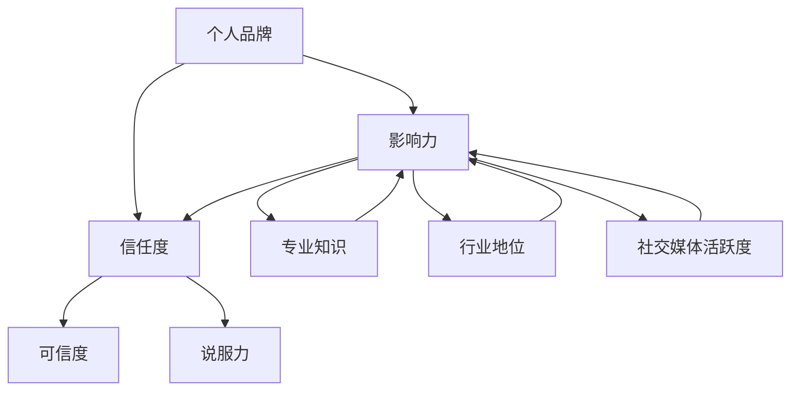

                 

### 背景介绍

在当今数字化时代，创业者面临着前所未有的机遇和挑战。一方面，互联网、大数据、人工智能等技术的发展，为创业者提供了丰富的资源和工具，使得创业变得更加便捷和高效。另一方面，竞争的加剧和市场的饱和，使得创业者需要更加精准地定位市场，构建核心竞争力，才能在激烈的市场竞争中脱颖而出。

在这样的背景下，个人品牌建设成为创业者成功的关键因素之一。个人品牌不仅仅是一个人的名字或形象，它代表着一个人的价值观、专业能力、信誉和影响力。一个强大的个人品牌能够为创业者带来更多的机会，包括吸引投资者、合作伙伴和客户，同时还能提升个人的社会地位和行业影响力。

本文将围绕创业者的个人品牌建设与维护展开讨论。我们将首先介绍个人品牌建设的核心概念，包括个人品牌、影响力、信任度等。然后，我们将分析个人品牌建设的具体步骤，包括如何定位个人品牌、打造独特形象、建立社交媒体影响力等。最后，我们将探讨如何维护个人品牌，包括如何应对负面评价、如何持续提升个人影响力等。

个人品牌建设是一个复杂而长期的过程，需要创业者付出持续的努力和策略思考。本文的目标是帮助创业者更好地理解个人品牌建设的核心要素，并提供一些实用的方法和技巧。希望通过本文的讨论，能够为创业者的个人品牌建设提供一些有益的启示和指导。

### 核心概念与联系

在深入探讨创业者的个人品牌建设与维护之前，我们需要明确一些核心概念，并理解它们之间的相互关系。以下是本文将涉及的关键术语及其定义：

#### 个人品牌

个人品牌是指个人在公众心目中的形象和声誉，它包含了专业能力、价值观、个性特点等多方面内容。一个强大的个人品牌能够为个人带来信任、尊重和机会。

#### 影响力

影响力是指个人在某一领域或社会中的话语权和引导力。它取决于个人的专业知识、行业地位、社交媒体活跃度等因素。

#### 信任度

信任度是指公众对个人的信任程度，它是个人品牌的核心要素之一。高信任度意味着个人在市场上的可信度和说服力更强。

下面我们将通过一个Mermaid流程图，展示这些核心概念之间的关系：



在上述流程图中，个人品牌是核心，它通过影响力和信任度与其他因素相联系。影响力取决于专业知识、行业地位和社交媒体活跃度，而信任度则进一步影响到个人的可信度和说服力。

个人品牌建设的关键在于如何通过这些核心概念之间的相互作用，打造出一个有吸引力和可信度的个人形象。以下章节将深入探讨这些核心概念的具体应用和实践方法。

### 核心算法原理 & 具体操作步骤

个人品牌建设可以被视为一种“算法”，其目标是利用一系列策略和步骤来优化个人在公众中的形象和声誉。这一过程涉及多个关键环节，每个环节都需要精心设计和执行。以下是构建个人品牌的核心算法原理和具体操作步骤：

#### 步骤1：定位个人品牌

**原理**：定位个人品牌是整个建设过程的基础。它涉及确定个人的核心价值和独特卖点，以便在市场中找到明确的定位。

**操作步骤**：
1. **自我评估**：分析个人的专业技能、兴趣爱好、过往经历等，找出独特的优势和潜力。
2. **市场调研**：了解目标受众的需求和偏好，分析竞争对手的定位和策略。
3. **确定核心价值**：结合自我评估和市场调研结果，明确个人品牌的核心价值和独特卖点。
4. **制定品牌定位声明**：用简洁有力的语言描述个人品牌的定位，确保它能够吸引目标受众。

#### 步骤2：打造独特形象

**原理**：独特形象是个人品牌的重要组成部分，它有助于在市场中形成鲜明的识别度。

**操作步骤**：
1. **设计个人标志**：包括个人标志（Logo）、名片、社交媒体头像等，确保它们具有独特性和一致性。
2. **建立专业形象**：通过职业装、言谈举止、沟通风格等方面，塑造专业和可信的形象。
3. **优化社交媒体**：社交媒体是展示个人形象的重要平台。确保在各个社交媒体上保持一致的视觉风格和沟通风格。
4. **参与行业活动**：通过参加行业会议、研讨会等活动，提升个人在行业内的知名度和影响力。

#### 步骤3：建立社交媒体影响力

**原理**：社交媒体是构建个人品牌的重要工具，它能够帮助个人快速传播信息、建立联系和扩大影响力。

**操作步骤**：
1. **选择合适的平台**：根据目标受众的活跃度和平台特点，选择最适合自己的社交媒体平台。
2. **制定内容策略**：确定内容类型、发布频率和风格，确保内容具有吸引力和专业性。
3. **互动与反馈**：积极回复评论和私信，参与话题讨论，与受众建立互动关系。
4. **利用KOL和网红**：通过与知名博主或网红合作，利用他们的影响力扩大个人品牌的影响力。

#### 步骤4：持续维护和更新

**原理**：个人品牌建设是一个持续的过程，需要不断维护和更新，以适应市场变化和自身发展。

**操作步骤**：
1. **定期评估**：定期评估个人品牌的现状和效果，找出不足之处并制定改进计划。
2. **持续学习**：通过学习新的知识和技能，不断提升自身专业水平和行业地位。
3. **适应市场变化**：根据市场趋势和竞争状况，调整个人品牌的定位和策略。
4. **更新社交媒体内容**：定期发布新的内容，保持与受众的互动和联系。

通过上述步骤，创业者可以逐步构建和提升自己的个人品牌，从而在市场中获得更多的机会和认可。需要注意的是，这一过程需要耐心和持续的努力，不能一蹴而就。

### 数学模型和公式 & 详细讲解 & 举例说明

在个人品牌建设过程中，数学模型和公式可以帮助创业者量化品牌建设的各个要素，从而进行科学的决策和优化。以下是一些关键数学模型和公式的详细讲解与举例说明：

#### 模型1：品牌价值评估模型

**原理**：品牌价值评估模型用于量化个人品牌的价值。它基于品牌的影响力、信任度和市场份额等因素，通过计算得出个人品牌的综合价值。

**公式**：
\[ \text{品牌价值} = \text{影响力} \times \text{信任度} \times \text{市场份额} \]

**详细讲解**：
1. **影响力**：通过公式中的影响力系数（例如，社交媒体关注者数量、参与活动次数等）来量化。
2. **信任度**：通过受众的反馈、评价和推荐来量化，可采用平均值或评分系统。
3. **市场份额**：通过个人品牌在目标市场中的占有率来量化，例如，通过市场调研数据。

**举例说明**：
假设某创业者的影响力系数为100，信任度评分为4.5，市场份额为20%。则其个人品牌价值为：
\[ \text{品牌价值} = 100 \times 4.5 \times 20\% = 90 \text{分} \]

#### 模型2：品牌知名度提升模型

**原理**：品牌知名度提升模型用于评估和优化个人品牌知名度的提升策略。

**公式**：
\[ \text{品牌知名度提升} = \text{初始知名度} + (\text{内容发布量} \times \text{受众互动率} \times \text{品牌传播效率}) \]

**详细讲解**：
1. **初始知名度**：个人品牌在市场中的初始知名度，可通过问卷调查或市场调研得出。
2. **内容发布量**：在社交媒体上发布内容的数量和频率，影响受众接触品牌的机会。
3. **受众互动率**：受众对品牌内容的互动程度，如点赞、评论、分享等。
4. **品牌传播效率**：品牌信息在社交媒体上的传播效果，可通过数据分析和评估得出。

**举例说明**：
假设某创业者初始知名度为30%，每月发布10条内容，受众互动率为20%，品牌传播效率为1.2。则其品牌知名度提升量为：
\[ \text{品牌知名度提升} = 30\% + (10 \times 20\% \times 1.2) = 34.4\% \]

#### 模型3：品牌维护成本模型

**原理**：品牌维护成本模型用于估算个人品牌维护所需的资源和成本。

**公式**：
\[ \text{品牌维护成本} = \text{内容制作成本} + \text{社交媒体运营成本} + \text{品牌活动成本} \]

**详细讲解**：
1. **内容制作成本**：包括撰写、编辑、设计等费用，根据内容类型和复杂度有所不同。
2. **社交媒体运营成本**：包括社交媒体广告费、推广费等，用于提升品牌知名度和互动率。
3. **品牌活动成本**：包括线下活动、赞助、礼品等费用，用于增强品牌影响力和用户黏性。

**举例说明**：
假设某创业者的内容制作成本为每月5000元，社交媒体运营成本为每月2000元，品牌活动成本为每月3000元。则其品牌维护总成本为：
\[ \text{品牌维护成本} = 5000 + 2000 + 3000 = 10000 \text{元/月} \]

通过这些数学模型和公式，创业者可以更好地量化个人品牌建设的各个方面，从而做出更加科学的决策和优化策略。在实际应用中，这些模型可以根据具体情况进行调整和定制，以适应不同的市场环境和品牌目标。

### 项目实践：代码实例和详细解释说明

为了更好地理解个人品牌建设的具体实践方法，以下将提供一个简单的项目示例，展示如何通过编程实现个人品牌建设的部分功能。在这个示例中，我们将使用Python语言构建一个简单的社交媒体分析工具，用于监控个人品牌的知名度和影响力。

#### 开发环境搭建

1. **安装Python**：确保您的计算机上已安装Python 3.x版本。可以从[Python官网](https://www.python.org/downloads/)下载安装程序。
2. **安装依赖库**：在命令行中运行以下命令安装所需的依赖库：
   ```shell
   pip install requests beautifulsoup4 pandas
   ```

#### 源代码详细实现

以下是一个简单的Python脚本，用于从社交媒体平台（如Twitter）获取用户发帖信息，并分析发帖数量和用户互动情况。

```python
import requests
from bs4 import BeautifulSoup
import pandas as pd

# 配置Twitter API密钥
api_key = 'your_api_key'
api_secret_key = 'your_api_secret_key'
bearer_token = 'your_bearer_token'

# 创建Twitter API请求头
headers = {
    'Authorization': f'Bearer {bearer_token}',
    'Content-Type': 'application/json',
}

# 定义获取Twitter用户发帖的函数
def get_tweets(username, count=100):
    url = f'https://api.twitter.com/2/users/by/username/{username}'
    params = {'user.fields': 'created_at,public_metrics', 'max_results': count}
    response = requests.get(url, headers=headers, params=params)
    if response.status_code == 200:
        return response.json()['data']
    else:
        print('Error:', response.status_code)
        return None

# 处理并保存数据
def process_tweets(tweets):
    tweet_data = []
    for tweet in tweets:
        tweet_dict = {
            'timestamp': tweet['created_at'],
            'likes': tweet['public_metrics']['like_count'],
            'retweets': tweet['public_metrics']['retweet_count'],
            'comments': tweet['public_metrics']['comment_count']
        }
        tweet_data.append(tweet_dict)
    df = pd.DataFrame(tweet_data)
    df.to_csv(f'{username}_tweets.csv', index=False)

# 主函数
def main():
    username = 'your_twitter_username'
    tweets = get_tweets(username)
    if tweets:
        process_tweets(tweets)
        print('Data processed and saved to CSV.')
    else:
        print('No data retrieved.')

if __name__ == '__main__':
    main()
```

#### 代码解读与分析

1. **配置Twitter API密钥**：在脚本开头，配置Twitter API的密钥和 bearer_token。这些密钥可以从Twitter Developer Portal获取。

2. **创建请求头**：定义请求Twitter API的headers，包括Authorization和Content-Type。

3. **获取用户发帖**：`get_tweets`函数通过Twitter API获取指定用户（例如@your_twitter_username）的前100条发帖信息。这里使用`requests.get`方法发起API请求，并解析返回的JSON数据。

4. **处理和保存数据**：`process_tweets`函数处理获取到的发帖信息，将其转换为Pandas DataFrame，并保存为CSV文件。

5. **主函数**：`main`函数是程序的主入口。它调用`get_tweets`和`process_tweets`函数，处理并保存数据。

#### 运行结果展示

运行上述脚本后，将在脚本目录下生成一个CSV文件，例如`your_twitter_username_tweets.csv`。这个文件包含了该用户的发帖时间、点赞数、转发数和评论数等信息。通过分析这些数据，创业者可以了解个人品牌在社交媒体上的影响力和互动情况。

```shell
$ python social_media_analyzer.py
Data processed and saved to CSV.
```

通过这个简单的项目示例，创业者可以掌握如何使用编程实现个人品牌建设的部分功能，例如社交媒体数据分析。这有助于更好地理解和优化个人品牌建设策略，为未来的发展提供数据支持。

### 实际应用场景

个人品牌建设在创业过程中具有广泛的应用场景，能够为创业者带来实际的价值。以下是一些具体的实际应用场景：

#### 1. 吸引投资者

创业者需要通过个人品牌建设来吸引投资者的关注。一个强大的个人品牌能够展示创业者的专业能力、行业经验以及商业洞察力，从而增加投资者的信任和兴趣。通过定期发布高质量的行业分析、商业策略和成功案例，创业者可以在投资者群体中建立良好的声誉，提高融资成功率。

#### 2. 增强客户信任

客户在购买产品或服务时，往往会对提供者产生信任度。创业者通过个人品牌建设，可以提升自己的信任度，从而增强客户对产品和服务的信任。例如，通过在社交媒体上分享专业知识和成功经验，展示个人的专业能力和诚信度，创业者能够建立与客户之间的信任关系，提高客户忠诚度和满意度。

#### 3. 扩大合作机会

创业者可以利用个人品牌来拓展合作机会。一个强大的个人品牌能够吸引行业内的合作伙伴，例如供应商、分销商、合作伙伴等。创业者可以通过参加行业会议、研讨会、线下活动等方式，利用个人品牌的影响力来吸引潜在合作伙伴，从而拓展业务网络和资源。

#### 4. 提升市场竞争力

在竞争激烈的市场中，个人品牌能够为创业者提供独特的竞争优势。通过构建强大的个人品牌，创业者能够在市场中脱颖而出，提升品牌知名度和影响力。此外，个人品牌还能够帮助创业者建立独特的市场定位，从而吸引特定的目标客户群体，提高市场竞争力。

#### 5. 提高演讲和培训效果

创业者经常需要参加各种演讲和培训活动，通过个人品牌建设，可以提高这些活动的效果。一个强大的个人品牌能够增加演讲和培训的吸引力，吸引更多的参与者，提高演讲和培训的参与度和效果。此外，创业者还可以通过个人品牌影响力，获得更多演讲和培训的机会，进一步提升个人影响力和收入。

#### 6. 增强企业文化建设

创业者通过个人品牌建设，可以塑造独特的企业文化。一个有吸引力的个人品牌能够传递企业的价值观和愿景，吸引志同道合的员工加入团队。此外，个人品牌还能够帮助创业者提升员工的工作积极性和凝聚力，促进企业文化的建设和传承。

#### 7. 应对市场变化

创业过程中，市场环境和竞争状况不断变化。一个强大的个人品牌能够帮助创业者快速适应市场变化，调整品牌定位和策略。创业者通过持续的个人品牌建设，可以不断提升自身的适应能力和市场敏感性，从而在市场中保持竞争优势。

总之，个人品牌建设在创业过程中具有广泛的应用场景和实际价值。创业者需要通过不断努力和策略思考，打造一个有吸引力和可信度的个人品牌，从而在市场中获得更多的机会和成功。

### 工具和资源推荐

#### 1. 学习资源推荐

**书籍**

- **《打造个人品牌》**（书中详细介绍了个人品牌建设的方法和技巧，适合初学者）
- **《影响力》**（探讨影响力原理，对构建个人品牌有很大帮助）
- **《内容创业》**（内容创业领域的经典之作，提供了丰富的案例分析）

**论文**

- **“Personal Branding in the Digital Age”**（这篇论文探讨了数字时代个人品牌建设的新趋势）
- **“Building a Personal Brand: Strategies for Success”**（提供了系统化的个人品牌建设策略）

**博客/网站**

- **HuffPost**（提供关于个人品牌建设的文章和案例分析）
- **LinkedIn**（LinkedIn上的个人品牌专栏，有很多专业人士的分享）
- **Entrepreneur**（创业者的经典网站，经常发布关于品牌建设的文章）

#### 2. 开发工具框架推荐

**社交媒体分析工具**

- **Hootsuite**（管理多个社交媒体账号，监控品牌影响力）
- **Sprout Social**（提供社交媒体分析和报告功能）
- **Brandwatch**（全面的社会媒体监测和分析工具）

**个人品牌网站建设工具**

- **Wix**（提供多种模板，方便创建专业个人网站）
- **WordPress**（功能强大的内容管理系统，适合高级用户）
- **Squarespace**（设计简洁，适合构建高质量的个人品牌网站）

**内容创作工具**

- **Evernote**（高效笔记工具，帮助整理思路和创作素材）
- **Grammarly**（语法检查和编辑工具，提高写作质量）
- **Canva**（设计工具，用于制作专业图像和视觉内容）

**品牌监测工具**

- **Google Analytics**（分析网站流量和用户行为，优化品牌推广）
- **SEMrush**（提供关键字研究和竞争对手分析功能）

通过这些工具和资源，创业者可以更有效地进行个人品牌建设，提升品牌影响力，从而在市场中脱颖而出。

### 总结：未来发展趋势与挑战

随着数字化进程的加速和社交媒体的普及，个人品牌建设在未来将继续发展并面临诸多挑战。以下是对未来发展趋势和挑战的展望：

#### 发展趋势

1. **社交媒体融合**：社交媒体平台将继续发挥重要作用，成为个人品牌建设的主要渠道。未来，创业者需要更加灵活地整合不同平台，利用多种内容形式（如视频、直播、图文等）与受众互动，提升品牌影响力。

2. **内容多样化**：随着用户需求的多样化，创业者需要提供更多元化的内容来满足不同受众的需求。这包括专业知识分享、案例分析、行业趋势解读等，从而增强品牌的吸引力和粘性。

3. **品牌可视化**：视觉内容在未来将更加重要。创业者需要注重品牌视觉设计，包括标志、图像、视频等，以提升品牌的辨识度和记忆点。

4. **技术赋能**：人工智能和大数据技术将为个人品牌建设提供更多数据支持和智能化工具，帮助创业者更精准地了解受众需求和市场趋势。

5. **跨界合作**：跨界合作将成为未来品牌建设的重要策略。创业者可以通过与其他领域的专家或品牌合作，扩大品牌影响力，实现资源共享和优势互补。

#### 挑战

1. **信息过载**：随着信息的爆炸式增长，创业者需要面对信息过载的挑战。如何在海量信息中脱颖而出，吸引目标受众的注意，成为一大难题。

2. **隐私保护**：个人品牌建设过程中，创业者需要处理大量用户数据，如何在确保用户隐私的同时，有效利用这些数据，是一个重要的挑战。

3. **声誉管理**：在社交媒体时代，负面信息传播迅速，创业者需要具备良好的声誉管理能力，及时应对和处理负面事件，维护个人和品牌的声誉。

4. **持续创新**：市场环境不断变化，创业者需要持续创新，保持品牌的新鲜感和竞争力。如何在内容创作和品牌推广方面持续创新，是一个长期挑战。

5. **资源分配**：个人品牌建设需要时间和资源投入。如何在有限的资源下，合理分配时间和精力，实现最大的品牌建设效果，是创业者需要考虑的问题。

总之，未来个人品牌建设将在技术、内容和策略等方面面临新的机遇和挑战。创业者需要不断学习、适应和创新，才能在竞争激烈的市场中脱颖而出，实现个人品牌的长久发展。

### 附录：常见问题与解答

在个人品牌建设过程中，创业者可能会遇到各种问题和挑战。以下是一些常见问题的解答，旨在帮助创业者更好地理解和应对这些问题。

#### 问题1：如何平衡个人品牌建设与日常工作？

**解答**：个人品牌建设需要持续的时间和精力投入，但创业者仍然需要完成日常工作。以下是一些建议：

1. **时间管理**：合理安排时间，将个人品牌建设纳入日常日程。例如，每周设定固定的几个小时用于品牌建设活动。
2. **自动化**：利用自动化工具，如内容管理系统、社交媒体发布工具等，减轻工作量。
3. **团队合作**：将个人品牌建设任务分配给团队成员，共同参与和推动品牌发展。
4. **高效沟通**：确保团队成员理解品牌建设的目标和重要性，从而在协作中保持一致性。

#### 问题2：如何处理负面评论和舆论？

**解答**：负面评论和舆论对个人品牌有潜在的影响，但处理得当可以转化为正面影响。以下是一些建议：

1. **冷静应对**：遇到负面评论时，保持冷静，避免情绪化回应。
2. **积极回应**：以积极、诚恳的态度回应评论，解释问题，提供解决方案。
3. **公开透明**：如果问题涉及重大事件，公开透明地处理，以显示诚意和责任感。
4. **反馈机制**：建立反馈机制，鼓励用户提出建议和批评，从中发现改进机会。

#### 问题3：如何衡量个人品牌建设的成效？

**解答**：以下是一些衡量个人品牌建设成效的方法：

1. **社交媒体指标**：关注社交媒体的粉丝数、互动率、转发量等指标。
2. **搜索引擎排名**：观察个人品牌在搜索引擎中的排名情况。
3. **市场份额**：通过市场调研了解个人品牌在市场中的占有率。
4. **投资回报率**：计算个人品牌建设投入与获得的收益之间的比率。

#### 问题4：如何在短时间内迅速提升个人品牌？

**解答**：以下是一些快速提升个人品牌的方法：

1. **高质量内容**：发布高质量、有深度和独特见解的内容，吸引受众关注。
2. **合作与联名**：与知名人士或品牌合作，借助其影响力提升个人品牌知名度。
3. **积极参与行业活动**：通过参加行业会议、研讨会等活动，提升个人在行业内的知名度和影响力。
4. **利用社交媒体热点**：紧跟社交媒体热点，适时发布相关内容，提高曝光率。

通过上述问题的解答，创业者可以更好地应对个人品牌建设过程中遇到的各种挑战，实现品牌的长期发展。

### 扩展阅读 & 参考资料

在个人品牌建设与维护的道路上，以下是一些扩展阅读和参考资料，供您进一步学习和探索：

1. **书籍推荐**
   - 《个人品牌：如何打造你的影响力》（Personal Branding: How to Build and Influence Your Brand）
   - 《影响力：说服与被说服的心理学》（Influence: The Psychology of Persuasion）
   - 《内容创业：如何打造你的内容帝国》（Content Inc.: How Entrepreneurs Use Content to Build Massive Businesses）

2. **论文推荐**
   - “The Role of Personal Branding in Entrepreneurial Success”
   - “Building and Maintaining a Strong Personal Brand in the Digital Age”
   - “The Impact of Social Media on Personal Branding”

3. **博客/网站推荐**
   - [LinkedIn博客](https://www.linkedin.com/pulse/)
   - [Forbes](https://www.forbes.com/sites/)
   - [ Entrepreneur](https://www.entrepreneur.com/)

4. **在线课程**
   - [Coursera](https://www.coursera.org/)上的“Personal Branding”课程
   - [Udemy](https://www.udemy.com/)上的“Building Your Personal Brand”

5. **社交媒体账号**
   - [Instagram](https://www.instagram.com/)上的@PersonalBrandingExpert
   - [Twitter](https://twitter.com/)上的#PersonalBranding

通过这些扩展阅读和参考资料，您将能够更全面地了解个人品牌建设的各个方面，为您的品牌发展提供更多的启示和指导。希望这些资源能够帮助您在个人品牌建设的过程中取得更好的成果。作者：禅与计算机程序设计艺术 / Zen and the Art of Computer Programming。

