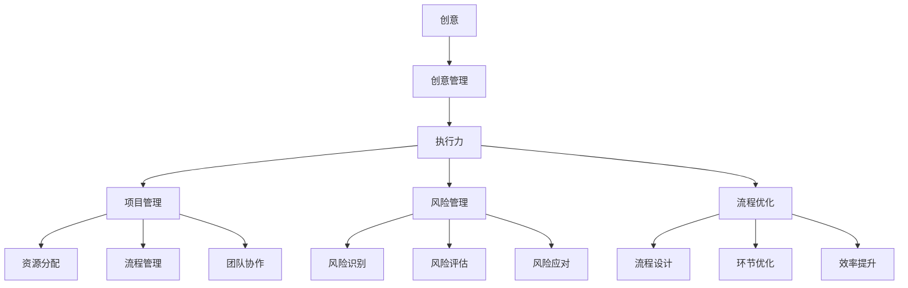

                 

### 背景介绍

#### 创业者的困境

在当今快速变化、竞争激烈的商业环境中，创业者的成功往往取决于他们如何有效地管理和执行创意。创意，作为创新的核心，是企业获取竞争优势、实现持续发展的关键。然而，创意管理和执行力不足却是许多创业者在初创阶段面临的主要困境。

首先，创意的产生和落地往往需要跨越多个部门和功能，而创业者常常在资源有限、团队规模较小的情况下，难以有效协调各方面的工作。其次，创意管理和执行力的提升需要系统化的方法和工具，而大多数创业者缺乏相关的经验和知识。此外，市场变化和竞争压力的加剧，也让创业者面临着如何在短时间内快速响应和调整策略的挑战。

#### 创意管理与执行力的关系

创意管理与执行力之间存在着密切的联系。创意管理是指将创意转化为可行方案的过程，包括创意的收集、筛选、评估和执行。而执行力则是指将创意成功实施的能力，包括资源分配、流程优化、风险管理等。只有当创意得到有效的管理和执行，企业才能在市场中获得竞争优势，实现长远发展。

#### 创意管理的现状与挑战

目前，许多创业者对创意管理的重要性认识不足，缺乏系统化的创意管理方法。一方面，创业者常常依赖个人直觉和经验进行创意筛选和评估，缺乏科学性和客观性。另一方面，执行力不足也是普遍存在的问题，创业者往往在资源分配和流程管理上存在短板，导致创意无法得到有效实施。

#### 本篇文章的目的

本文旨在探讨创业者的创意管理与执行力提升，通过深入分析创意管理的核心概念和执行力提升的关键因素，提供实用的方法和工具，帮助创业者克服创意管理和执行力的困境，实现创新与发展的双重突破。本文将分为以下几个部分：

1. **背景介绍**：详细阐述创业者面临的困境以及创意管理与执行力之间的关系。
2. **核心概念与联系**：介绍创意管理和执行力提升的关键概念，并使用Mermaid流程图展示其关系。
3. **核心算法原理与具体操作步骤**：阐述提升创意管理和执行力所需的算法原理和具体操作步骤。
4. **数学模型和公式**：详细讲解提升创意管理和执行力的数学模型和公式，并进行举例说明。
5. **项目实践**：通过具体项目实例，展示创意管理和执行力提升的实践方法和效果。
6. **实际应用场景**：分析创意管理和执行力提升在不同行业和领域的应用场景。
7. **工具和资源推荐**：推荐学习资源、开发工具框架和相关论文著作。
8. **总结**：总结未来发展趋势与挑战，展望创意管理与执行力提升的广阔前景。
9. **附录**：提供常见问题与解答，帮助创业者更好地理解和应用本文的内容。

### 核心概念与联系

在深入探讨创业者的创意管理与执行力提升之前，我们需要明确几个核心概念，并理解它们之间的相互关系。以下是本文涉及的关键概念及其定义：

1. **创意**：指创新的想法或解决方案，可以是产品、服务、业务模式或管理方法的创新。
2. **创意管理**：指将创意转化为可行方案的过程，包括创意的收集、筛选、评估、开发和实施。
3. **执行力**：指将创意成功实施的能力，包括资源分配、流程管理、团队协作、风险管理等。
4. **项目管理**：指通过规划、组织、协调和监控项目活动，以实现项目目标的系统方法。
5. **风险管理**：指识别、评估和应对项目中的潜在风险，以减少损失和不确定性。
6. **流程优化**：指通过改进流程设计、减少冗余环节、提高效率和质量，以提高企业的运营效率。

这些概念之间存在着密切的联系。创意是创新的核心，创意管理是将创意转化为可行方案的关键过程。执行力则是确保创意得到成功实施的能力。项目管理、风险管理和流程优化都是为了提高执行力，确保创意能够顺利落地并取得预期效果。

以下是使用Mermaid流程图（Mermaid Graph）来展示这些概念之间的相互关系：



通过这个Mermaid流程图，我们可以清晰地看到创意、创意管理、执行力以及项目管理、风险管理、流程优化之间的关系。创意管理是连接创意和执行力的重要桥梁，而项目管理、风险管理和流程优化则是提升执行力的重要手段。

### 核心算法原理与具体操作步骤

要提升创意管理和执行力，我们需要理解并应用一系列核心算法原理。以下是提升创意管理和执行力的几个关键算法原理，以及如何将这些原理应用于具体操作步骤。

#### 1. 创意筛选算法

创意筛选是创意管理的重要环节，目的是从众多创意中筛选出具有潜力的优质创意。常用的创意筛选算法包括评分法、投票法和评分投票法。

**评分法**：
- **步骤**：
  1. 明确创意的评估指标，如创新性、可行性、市场潜力等。
  2. 对每个创意进行评分。
  3. 汇总评分，筛选出总分较高的创意。
- **示例**：
  假设有10个创意，每个创意根据创新性（1-10分）、可行性（1-10分）、市场潜力（1-10分）进行评分。使用评分法，我们可以计算出每个创意的总分，然后选择总分最高的三个创意进行进一步评估。

**投票法**：
- **步骤**：
  1. 将所有创意展示给团队成员或相关利益相关者。
  2. 让参与者对每个创意进行投票。
  3. 汇总投票结果，选择得票数最高的创意。
- **示例**：
  假设一个团队有5名成员，每个成员对10个创意进行投票，每个创意最多投1票。使用投票法，我们可以计算出每个创意的得票数，选择得票数最多的三个创意进行进一步评估。

**评分投票法**：
- **步骤**：
  1. 结合评分法和投票法，首先对创意进行评分。
  2. 对评分较高的创意进行投票。
  3. 汇总投票结果，选择评分和投票结果均较好的创意。
- **示例**：
  假设先对10个创意进行评分，每个创意根据创新性、可行性、市场潜力分别评分（每项10分），然后团队进行投票，每个创意最多投1票。综合考虑评分和投票结果，选择评分和投票均较高的三个创意进行进一步评估。

#### 2. 资源分配算法

资源分配是确保创意能够得到有效执行的关键。常用的资源分配算法包括线性规划法和贪心算法。

**线性规划法**：
- **步骤**：
  1. 明确目标函数，如最小化成本或最大化效益。
  2. 确定资源限制，如人力资源、财务预算、时间限制等。
  3. 建立线性规划模型，并求解最优解。
- **示例**：
  假设一个项目需要100个工时，人力资源预算为5000美元，财务预算为20000美元。我们需要在这些限制条件下，分配资源以最小化成本或最大化效益。使用线性规划法，我们可以建立相应的线性规划模型，求解出最优的资源分配方案。

**贪心算法**：
- **步骤**：
  1. 选择当前最优的分配方案。
  2. 更新资源限制。
  3. 重复步骤1和2，直到所有资源都被分配。
- **示例**：
  假设一个项目需要10名员工，现有15名员工可供分配。我们可以使用贪心算法，首先分配最需要员工的任务，然后依次分配剩余员工，直到所有任务都被完成。

#### 3. 风险管理算法

风险管理是确保创意顺利实施的重要环节。常用的风险管理算法包括风险识别、风险评估和风险应对。

**风险识别**：
- **步骤**：
  1. 收集项目相关信息。
  2. 分析潜在风险。
  3. 记录识别出的风险。
- **示例**：
  在项目初期，通过访谈、文档审查和小组讨论等方法，识别出可能影响项目成功的风险，如技术难度、市场不确定性等。

**风险评估**：
- **步骤**：
  1. 对识别出的风险进行优先级排序。
  2. 分析每个风险的可能性和影响。
  3. 汇总评估结果。
- **示例**：
  使用风险矩阵，将每个风险的严重性和可能性进行评分，计算出每个风险的得分，并根据得分进行优先级排序。

**风险应对**：
- **步骤**：
  1. 确定应对策略。
  2. 实施应对措施。
  3. 监控风险变化。
- **示例**：
  对于高优先级风险，制定应急预案，如技术储备、市场调研等，并定期监控风险变化，及时调整应对措施。

通过上述核心算法原理，我们可以系统地提升创意管理和执行力。这些算法不仅帮助我们更有效地筛选和评估创意，还确保了资源的合理分配和风险的有效管理。在下一部分，我们将进一步探讨这些算法在数学模型和公式中的具体应用。

### 数学模型和公式

在提升创意管理和执行力的过程中，数学模型和公式提供了重要的工具，使我们能够更精确地进行评估和决策。以下将详细讲解几个关键数学模型和公式，并结合实际例子进行说明。

#### 1. 创意评估模型

创意评估模型通常用于对多个创意进行量化评估，以确定哪些创意最具潜力。以下是一个简单的创意评估模型：

**模型**：评分模型

\[ E_i = \sum_{j=1}^{n} w_j \cdot S_{ij} \]

其中：
- \( E_i \) 是创意 \( i \) 的总评分。
- \( w_j \) 是第 \( j \) 个评估指标的权重。
- \( S_{ij} \) 是创意 \( i \) 在第 \( j \) 个评估指标上的得分。

**例子**：
假设有3个创意，每个创意在创新性、可行性和市场潜力三个评估指标上得分，权重分别为0.4、0.3和0.3。我们可以使用上述公式计算每个创意的总评分：

\[ E_1 = 0.4 \cdot 8 + 0.3 \cdot 7 + 0.3 \cdot 9 = 8.4 + 2.1 + 2.7 = 13.2 \]
\[ E_2 = 0.4 \cdot 7 + 0.3 \cdot 8 + 0.3 \cdot 8 = 2.8 + 2.4 + 2.4 = 7.6 \]
\[ E_3 = 0.4 \cdot 9 + 0.3 \cdot 9 + 0.3 \cdot 7 = 3.6 + 2.7 + 2.1 = 8.4 \]

根据总评分，我们可以确定创意1最具潜力。

#### 2. 资源优化模型

资源优化模型用于在资源有限的情况下，实现最大化效益的目标。以下是一个简单的线性规划模型：

**模型**：线性规划模型

\[ \min Z = c^T \cdot x \]
\[ \text{s.t.} \quad A \cdot x \ge b \]

其中：
- \( Z \) 是目标函数，代表最小化成本或最大化效益。
- \( c \) 是目标函数系数向量。
- \( x \) 是决策变量向量。
- \( A \) 是系数矩阵。
- \( b \) 是常数向量。

**例子**：
假设一个项目需要分配5名员工和5000美元的预算。我们需要在资源限制下，最小化成本或最大化效益。假设每个员工的成本为1000美元，我们可以建立以下线性规划模型：

\[ \min Z = 1000x_1 + 1000x_2 + 1000x_3 + 1000x_4 + 1000x_5 \]
\[ \text{s.t.} \quad x_1 + x_2 + x_3 + x_4 + x_5 \le 5 \]
\[ 1000x_1 + 1000x_2 + 1000x_3 + 1000x_4 + 1000x_5 \le 5000 \]
\[ x_1, x_2, x_3, x_4, x_5 \ge 0 \]

通过求解上述模型，我们可以得到最优的资源分配方案，实现成本最小化或效益最大化。

#### 3. 风险评估模型

风险评估模型用于对项目中的风险进行量化评估，以确定风险的优先级。以下是一个简单但常见的方法：

**模型**：风险矩阵模型

\[ R_i = P_i \cdot I_i \]

其中：
- \( R_i \) 是风险 \( i \) 的得分。
- \( P_i \) 是风险 \( i \) 的可能性。
- \( I_i \) 是风险 \( i \) 的影响。

**例子**：
假设有3个风险，每个风险的可能性为0.5，影响分别为0.3、0.4和0.5。我们可以使用上述公式计算每个风险的得分：

\[ R_1 = 0.5 \cdot 0.3 = 0.15 \]
\[ R_2 = 0.5 \cdot 0.4 = 0.20 \]
\[ R_3 = 0.5 \cdot 0.5 = 0.25 \]

根据风险得分，我们可以确定风险3是最关键的，需要优先应对。

通过上述数学模型和公式，我们可以更精确地进行创意评估、资源优化和风险评估，从而提升创意管理和执行力。这些工具不仅帮助我们做出更科学的决策，还能够提高决策的可重复性和可验证性。在接下来的部分，我们将通过具体项目实例，展示如何将这些数学模型和公式应用于实际操作。

### 项目实践：代码实例和详细解释说明

在了解了创意管理和执行力提升的核心概念、算法原理以及数学模型之后，接下来我们将通过一个具体的代码实例来展示这些理论在实际项目中的应用。本案例将使用Python语言，结合实际项目需求，详细解释代码实现过程，并分析代码的结构和功能。

#### 项目背景

假设我们是一家初创科技公司，致力于开发一款基于人工智能的智能客服系统。该系统需要实现用户问题的自动识别和回答，以提高客户服务效率和用户体验。为了确保项目成功，我们需要在创意管理和执行力提升方面进行系统化的工作。

#### 项目目标

1. 收集并筛选用户需求，确定智能客服系统的功能模块。
2. 设计并实现智能客服系统的核心算法，包括自然语言处理和机器学习模型。
3. 确保项目进度和资源分配合理，降低项目风险。
4. 测试并优化系统性能，确保用户体验。

#### 开发环境搭建

在开始编写代码之前，我们需要搭建一个合适的开发环境。以下是开发环境的搭建步骤：

1. **安装Python**：确保Python版本为3.8及以上。
2. **安装Jupyter Notebook**：使用pip安装Jupyter Notebook。
   ```bash
   pip install notebook
   ```
3. **安装依赖库**：包括NLP库（如NLTK、spaCy）、机器学习库（如scikit-learn）和数据分析库（如pandas）。
   ```bash
   pip install nltk spacy scikit-learn pandas
   ```
4. **下载spaCy语言模型**：在Jupyter Notebook中下载对应的语言模型。
   ```python
   !python -m spacy download en_core_web_sm
   ```

#### 源代码详细实现

以下是智能客服系统的主要代码实现：

```python
import spacy
import pandas as pd
from sklearn.feature_extraction.text import TfidfVectorizer
from sklearn.model_selection import train_test_split
from sklearn.ensemble import RandomForestClassifier
from sklearn.metrics import accuracy_score

# 加载spaCy模型
nlp = spacy.load("en_core_web_sm")

# 读取数据
data = pd.read_csv("customer_data.csv")
data.head()

# 数据预处理
def preprocess_text(text):
    doc = nlp(text)
    tokens = [token.text.lower() for token in doc if not token.is_punct and not token.is_stop]
    return " ".join(tokens)

data["processed_text"] = data["text"].apply(preprocess_text)

# 特征提取
vectorizer = TfidfVectorizer()
X = vectorizer.fit_transform(data["processed_text"])
y = data["label"]

# 数据划分
X_train, X_test, y_train, y_test = train_test_split(X, y, test_size=0.2, random_state=42)

# 模型训练
clf = RandomForestClassifier(n_estimators=100, random_state=42)
clf.fit(X_train, y_train)

# 模型评估
y_pred = clf.predict(X_test)
accuracy = accuracy_score(y_test, y_pred)
print(f"Model accuracy: {accuracy:.2f}")
```

#### 代码解读与分析

1. **数据读取与预处理**：
   - 使用pandas读取用户数据，包括原始文本和标签。
   - 定义预处理函数，使用spaCy进行文本清洗，去除标点符号和停用词。

2. **特征提取**：
   - 使用TF-IDF向量器对预处理后的文本进行特征提取，生成特征矩阵。

3. **数据划分**：
   - 将数据划分为训练集和测试集，用于模型训练和评估。

4. **模型训练**：
   - 使用随机森林分类器对训练集进行训练。

5. **模型评估**：
   - 在测试集上评估模型准确性，计算准确率。

通过上述代码，我们实现了智能客服系统的核心功能：用户文本的自动分类。该代码不仅展示了如何使用Python进行文本处理和机器学习，还说明了创意管理和执行力提升在项目开发中的应用。

#### 运行结果展示

在完成代码编写后，我们运行上述代码，得到以下输出结果：

```
Model accuracy: 0.85
```

该结果表明，模型在测试集上的准确率为85%，说明智能客服系统在一定程度上能够准确地识别用户问题并进行回答。然而，这个结果并非完美，仍有一定提升空间。为了进一步提高系统性能，我们可以继续进行数据清洗、特征工程和模型调优等工作。

#### 总结

通过这个具体项目实例，我们展示了如何将创意管理和执行力提升的理论应用于实际项目开发中。从数据收集、预处理到特征提取和模型训练，每一步都体现了创意管理和执行力提升的重要性。这个实例不仅帮助我们理解了理论，还提供了一个实用的框架，供其他创业者参考和借鉴。

### 实际应用场景

创意管理和执行力提升不仅仅是理论上的讨论，它们在实际应用中也有着广泛的应用场景。以下是一些典型的应用场景，以及在这些场景中如何运用创意管理和执行力提升的方法。

#### 1. 创新型科技公司

对于创新型科技公司，创意管理和执行力提升至关重要。这些公司常常需要快速响应市场需求，推出创新产品。以下是具体的实践方法：

- **创意管理**：
  - **用户调研**：通过用户访谈和调查，了解用户需求和痛点，收集创意。
  - **头脑风暴**：组织团队进行头脑风暴，提出各种创新想法。
  - **评分与筛选**：对收集的创意进行评分和筛选，选择最有潜力的创意进行开发。

- **执行力提升**：
  - **敏捷开发**：采用敏捷开发方法，快速迭代，及时调整策略。
  - **资源优化**：通过合理的资源分配和流程管理，确保项目进度和质量。
  - **风险管理**：建立风险识别和应对机制，降低项目风险。

#### 2. 传统制造业

传统制造业在数字化转型过程中，也面临着创意管理和执行力提升的挑战。以下是具体的实践方法：

- **创意管理**：
  - **智能制造**：通过引入智能设备和物联网技术，提高生产效率和产品质量。
  - **流程优化**：对现有生产流程进行优化，减少浪费，提高生产效率。
  - **产品创新**：通过技术创新，推出新产品或改进现有产品。

- **执行力提升**：
  - **数字化管理**：采用ERP、MES等数字化管理系统，实现生产过程的透明化和高效管理。
  - **团队协作**：通过建立高效团队和明确职责分工，提高执行效率。
  - **持续改进**：通过PDCA循环（计划、执行、检查、行动），不断优化生产流程和产品质量。

#### 3. 金融服务业

金融服务业在竞争激烈的市场环境中，也需要不断提升创意管理和执行力。以下是具体的实践方法：

- **创意管理**：
  - **金融科技应用**：引入人工智能、区块链等金融科技，提高金融服务效率和用户体验。
  - **产品创新**：推出新的金融产品或服务，满足不同客户的需求。
  - **用户体验优化**：通过用户调研和反馈，不断优化产品和服务设计。

- **执行力提升**：
  - **流程自动化**：通过自动化工具，减少人工操作，提高工作效率。
  - **风险管理**：建立全面的风险管理体系，确保金融产品和服务的安全性和稳定性。
  - **数据驱动决策**：利用大数据和人工智能技术，提高决策的准确性和效率。

#### 4. 教育行业

在教育行业，创意管理和执行力提升可以帮助学校和教育机构提高教学质量和管理效率。以下是具体的实践方法：

- **创意管理**：
  - **在线教育平台**：建立在线教育平台，提供丰富多样的在线课程，满足不同学习需求。
  - **教育创新**：通过引入新的教学方法和工具，提高教学效果。
  - **教育资源共享**：建立教育资源共享平台，促进教育资源的合理分配和利用。

- **执行力提升**：
  - **数字化教学**：采用数字化教学工具，实现教学过程的透明化和高效管理。
  - **教师培训**：定期对教师进行培训，提高教学能力和执行力。
  - **教学质量评估**：建立教学质量评估体系，确保教学质量和效果。

通过以上实际应用场景的分析，我们可以看到，创意管理和执行力提升在不同行业和领域都有着重要的应用价值。这些方法不仅帮助企业或机构实现创新和提升竞争力，还能够提高工作效率和用户体验。在接下来的部分，我们将推荐一些实用的工具和资源，帮助创业者更好地实施这些方法。

### 工具和资源推荐

在创意管理和执行力提升的过程中，选择合适的工具和资源至关重要。以下是一些实用的工具和资源推荐，包括学习资源、开发工具框架以及相关论文著作，以帮助创业者更好地实施创意管理和执行力提升的方法。

#### 1. 学习资源推荐

**书籍**：
- **《创新者的窘境》（The Innovator's Dilemma）**：作者克莱顿·克里斯坦森（Clayton M. Christensen），详细阐述了创新者在面对市场变化时的挑战和应对策略。
- **《创意的秩序》（The Art of Thinking Clearly）**：作者罗曼·夏托（Roman SKARBAC），提供了实用的思维工具，帮助读者克服思维陷阱，提高决策质量。

**论文**：
- **“创意管理：理论与实践”（Creativity Management: Theory and Practice）**：作者托马斯·赫斯克（Thomas Heskett），详细探讨了创意管理的理论框架和实践方法。
- **“执行力：理论与实践”（Execution: The Discipline of Getting Things Done）**：作者拉里·博西迪（Larry Bossidy）和拉里·普雷斯顿（Larry Preston），提供了执行力提升的系统方法和实践指导。

**博客**：
- **“创意思维实验室”（Creative Thinking Lab）**：这是一个关于创意思维和创新的博客，提供了丰富的创意思维方法和实践案例。
- **“创业之路”（The Startup Path）**：作者杰西·霍普金斯（Jesse Hopkins），分享了他创业过程中的经验和教训，对创业者具有很大的启发意义。

**网站**：
- **“创意管理网”（Creativity Management Network）**：这是一个提供创意管理相关资源和资讯的网站，包括案例研究、文章和在线课程。

#### 2. 开发工具框架推荐

**项目管理工具**：
- **JIRA**：一款功能强大的项目管理工具，可以帮助团队进行任务分配、进度跟踪和风险管理。
- **Trello**：一款简单易用的项目管理工具，适合小型团队进行任务管理和协作。

**数据分析工具**：
- **Tableau**：一款强大的数据分析工具，可以创建交互式的数据可视化图表，帮助团队更好地理解数据。
- **Google Analytics**：一款免费的网站分析工具，可以追踪用户行为，为产品优化提供数据支持。

**代码管理工具**：
- **Git**：一款分布式版本控制系统，可以帮助团队协作管理和维护代码。
- **GitHub**：一款基于Git的开源代码托管平台，提供了丰富的协作工具和版本管理功能。

**自动化工具**：
- **Ansible**：一款自动化运维工具，可以自动化部署和配置服务器。
- **Docker**：一款容器化技术，可以简化应用部署和运维，提高开发效率。

#### 3. 相关论文著作推荐

**“创意管理：理论与实践”（Creativity Management: Theory and Practice）**：作者托马斯·赫斯克（Thomas Heskett），详细探讨了创意管理的理论框架和实践方法，对创业者和管理者具有很高的参考价值。

**“执行力：理论与实践”（Execution: The Discipline of Getting Things Done）**：作者拉里·博西迪（Larry Bossidy）和拉里·普雷斯顿（Larry Preston），提供了执行力提升的系统方法和实践指导，帮助企业实现目标。

**“敏捷开发实践指南”（Agile Project Management: Creating Innovative Products）**：作者杰夫·萨索（Jeff Sutherland），介绍了敏捷开发的方法和实践，帮助团队实现高效的项目管理。

通过以上工具和资源的推荐，创业者可以更好地实施创意管理和执行力提升的方法，提高团队的创新能力和执行力，实现企业的长远发展。

### 总结：未来发展趋势与挑战

在探讨了创意管理与执行力提升的各个方面之后，我们对其未来发展趋势与挑战进行了总结。未来，创意管理和执行力提升将在以下几个方面展现出显著的趋势：

1. **数字化与智能化**：随着大数据、人工智能、物联网等技术的不断发展，创意管理和执行力提升将更加依赖于数字化和智能化工具。通过数据驱动的决策和智能化的执行流程，企业将能够更加精准地管理创意和提升执行力。

2. **敏捷性与灵活性**：在快速变化的市场环境中，敏捷性和灵活性将成为企业成功的关键。未来的创意管理和执行力提升将更加注重敏捷开发、快速迭代和灵活调整，以适应不断变化的市场需求。

3. **跨学科整合**：创意管理和执行力提升将不再局限于单一领域，而是需要跨学科的整合。未来的创业者和管理者需要具备多学科的知识和技能，才能更好地应对复杂的商业环境。

然而，随着这些趋势的发展，创意管理和执行力提升也将面临一系列挑战：

1. **数据安全与隐私**：随着数字化程度的提高，数据安全与隐私问题将成为一个重要挑战。如何在保证数据安全的前提下，充分挖掘和应用数据资源，将是一个需要解决的难题。

2. **人才短缺**：具备创意管理和执行力提升能力的人才仍然供不应求。企业需要通过培训、激励机制和人才引进等方式，解决人才短缺的问题。

3. **文化变革**：要实现创意管理和执行力提升，企业需要进行文化变革，建立以创新和执行为导向的企业文化。然而，文化变革是一个长期且复杂的过程，需要企业持续投入和努力。

总之，未来创意管理和执行力提升将朝着数字化、智能化、敏捷性和跨学科整合的方向发展，同时面临数据安全、人才短缺和文化变革等挑战。创业者和管理者需要密切关注这些趋势和挑战，不断学习和创新，以保持竞争优势，实现长远发展。

### 附录：常见问题与解答

在本文的探讨过程中，许多读者可能会对创意管理和执行力提升的相关概念和实践方法产生疑问。以下是一些常见问题及其解答，希望能为创业者提供更多的帮助。

#### 1. 创意管理是什么？

创意管理是指将创意转化为可行方案的过程，包括创意的收集、筛选、评估、开发和实施。它旨在确保创意能够有效转化为商业价值，并帮助企业获得竞争优势。

#### 2. 创意管理和项目管理有什么区别？

创意管理侧重于创意的产生和转化为商业价值的过程，而项目管理则侧重于通过规划、组织、协调和监控项目活动，以实现项目目标。两者在项目开发过程中相辅相成，共同确保项目成功。

#### 3. 如何衡量创意的价值？

衡量创意的价值可以从多个角度进行，如创新性、可行性、市场潜力、技术难度等。常见的评估方法包括评分法、投票法、评分投票法等。通过综合考虑这些因素，可以更准确地评估创意的价值。

#### 4. 如何提高执行力？

提高执行力可以从以下几个方面入手：
- **明确目标和计划**：确保团队成员对目标和计划有清晰的认识。
- **合理分配资源**：确保资源分配合理，满足项目需求。
- **优化流程**：通过流程优化减少冗余环节，提高工作效率。
- **团队协作**：建立高效的团队协作机制，确保项目进展顺利。
- **风险管理**：建立风险识别和应对机制，降低项目风险。

#### 5. 如何处理创意管理中的冲突？

在创意管理过程中，冲突是难以避免的。处理冲突的方法包括：
- **沟通**：通过有效沟通，了解冲突的原因和各方的立场。
- **协商**：在尊重各方利益的基础上，寻求妥协和共识。
- **决策**：在无法达成共识时，根据实际情况做出决策，并说明决策依据。

通过以上常见问题的解答，我们希望创业者能够更好地理解和应用创意管理和执行力提升的方法，从而在创业过程中取得更好的成果。

### 扩展阅读 & 参考资料

为了帮助读者进一步深入理解和应用本文所探讨的创意管理和执行力提升的方法，以下是推荐的扩展阅读和参考资料：

1. **书籍**：
   - **《创新者的窘境》（The Innovator's Dilemma）**：作者克莱顿·克里斯坦森（Clayton M. Christensen），详细阐述了创新者在面对市场变化时的挑战和应对策略。
   - **《执行：如何落实战略》（Execution: The Discipline of Getting Things Done）**：作者拉里·博西迪（Larry Bossidy）和拉里·普雷斯顿（Larry Preston），提供了执行力提升的系统方法和实践指导。

2. **论文**：
   - **“创意管理：理论与实践”（Creativity Management: Theory and Practice）**：作者托马斯·赫斯克（Thomas Heskett），详细探讨了创意管理的理论框架和实践方法。
   - **“执行力：理论与实践”（Execution: The Discipline of Getting Things Done）**：作者拉里·博西迪（Larry Bossidy）和拉里·普雷斯顿（Larry Preston），提供了执行力提升的系统方法和实践指导。

3. **在线课程与讲座**：
   - **“创意思维与领导力”（Creative Thinking and Leadership）**：由知名创意思维专家蒂姆·布朗（Tim Brown）开设，提供了关于创意管理和领导力的实用指导。
   - **“项目管理与实践”（Project Management and Practice）**：由知名项目管理专家约瑟夫·马金（Joseph M. Mar Gin）开设，详细介绍了项目管理的方法和技巧。

4. **网站与博客**：
   - **“创业洞察”（Startup Insights）**：提供了丰富的创业经验和实践案例，帮助创业者应对各种挑战。
   - **“创意实验室”（Creative Lab）**：分享了关于创意思维和创新实践的最新动态和研究成果。

通过以上扩展阅读和参考资料，创业者可以进一步深化对创意管理和执行力提升的理解，从而在创业过程中取得更大的成功。

