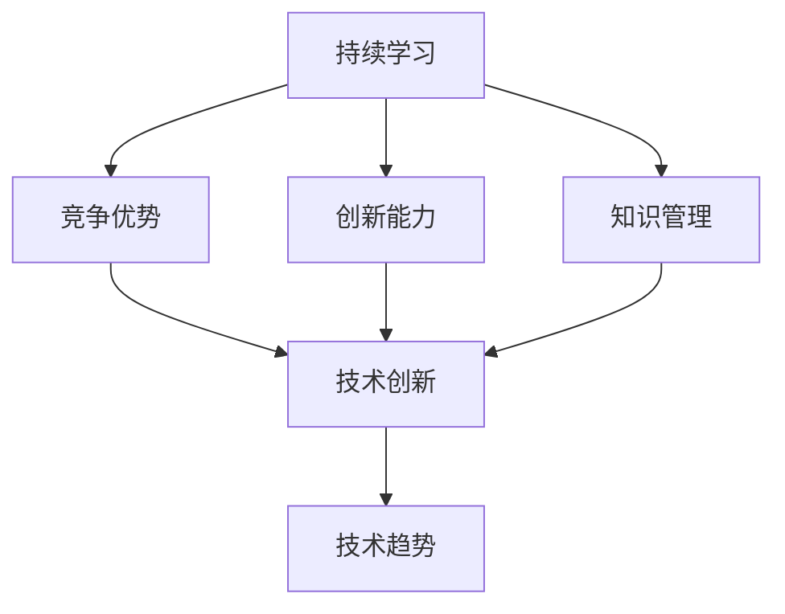

                 

### 背景介绍

在当今这个日新月异、技术快速迭代的时代，创业者的持续学习已经成为保持竞争优势的关键因素之一。无论是新兴创业者还是已经在行业中有一定地位的企业家，都需要不断更新自己的知识体系，紧跟时代的步伐。本文将探讨创业者持续学习的必要性，探讨如何通过学习保持竞争优势，并给出实际操作的指导。

首先，让我们来理解什么是“持续学习”。持续学习不仅仅是指获取新的知识，更包括对已有知识的反思和更新，以及将这些知识应用到实际工作和生活中。对于创业者来说，持续学习的重要性体现在以下几个方面：

1. **市场变化快速**：在数字化时代，市场变化的速度比以往任何时候都要快。新的技术、新的商业模式、新的消费者需求不断涌现，创业者如果不持续学习，就很难适应市场的变化，从而失去竞争优势。

2. **技术创新不断**：技术的进步是推动社会发展的重要动力。从互联网到人工智能，从大数据到区块链，每一项技术的出现都会对商业和社会产生深远的影响。创业者需要通过持续学习，把握技术创新的脉搏，利用新技术来优化业务模式，提高效率。

3. **竞争加剧**：随着市场的开放和全球化，创业者面临的竞争压力越来越大。要想在激烈的市场竞争中脱颖而出，创业者必须拥有独特的视角和创新能力，而这需要不断学习和积累。

4. **个人成长**：创业本身就是一条不断成长和自我提升的道路。通过持续学习，创业者不仅可以提升自己的专业能力和业务水平，还能培养自己的领导力、团队协作能力和解决问题的能力。

接下来，我们将进一步探讨创业者如何通过持续学习来保持竞争优势，包括学习资源的推荐、学习方法的探讨，以及如何将学习成果转化为实际业务价值。

在接下来的章节中，我们将详细分析持续学习对于创业者的重要性，以及如何有效地进行学习和知识管理。我们还将介绍一些实用的工具和资源，帮助创业者提升学习效果。最后，我们将探讨持续学习在创业实践中的具体应用，通过案例分析来展示如何将学习成果转化为竞争优势。

### 核心概念与联系

为了深入理解创业者如何通过持续学习保持竞争优势，我们需要明确几个核心概念，并分析它们之间的联系。以下是本文将涉及的核心概念及其相互关系：

#### 1. 持续学习

持续学习是指个人或组织不断更新知识和技能的过程。它不仅包括对新知识的获取，还涵盖对已有知识的反思和改进。

#### 2. 竞争优势

竞争优势是指企业在市场中相对于竞争对手具有的优势，这可以是成本优势、产品差异化、技术创新等。

#### 3. 创新能力

创新能力是指个人或组织在现有资源和条件下，提出新颖且有价值想法的能力。创新是企业保持竞争优势的重要手段。

#### 4. 知识管理

知识管理是指通过有效的获取、存储、分享和应用知识，来提高个人或组织效能的过程。

#### 5. 技术趋势

技术趋势是指新兴技术或现有技术发展方向的趋势，对创业者来说，理解技术趋势可以帮助他们把握市场机遇。

#### 关系分析

持续学习是保持竞争优势的基础。通过持续学习，创业者能够获取新的知识和技能，提升创新能力，从而在市场中保持竞争优势。知识管理在这个过程中起到关键作用，它帮助创业者有效地获取、存储和应用知识。创新能力则是将所学知识转化为实际业务价值的关键。而技术趋势则提供了创新的方向和可能性。

为了更好地展示这些概念之间的联系，我们可以使用 Mermaid 流程图来可视化这些关系：



在这张流程图中，持续学习是整个流程的起点，它通过知识管理和创新能力，最终影响到竞争优势和技术创新。技术创新又是技术趋势的基础，技术趋势为创业者提供了创新的方向。

通过明确这些核心概念和它们之间的联系，创业者可以更有针对性地进行学习和知识管理，从而在竞争中保持领先地位。

### 核心算法原理 & 具体操作步骤

在了解了持续学习对于创业者保持竞争优势的重要性以及相关核心概念之后，接下来我们将探讨如何通过具体的方法和步骤来实现持续学习，并最终转化为实际的竞争优势。

#### 1. 确定学习目标

首先，创业者需要明确自己的学习目标。这包括短期和长期的学习目标。短期目标可以是一个具体的技能或知识点的掌握，而长期目标则可能是提高整个团队的创新能力或建立一个新的业务模式。

具体操作步骤：
- **自我评估**：通过自我评估了解当前的知识水平和技能缺陷。
- **市场分析**：分析市场需求和竞争环境，确定学习目标与市场需求之间的联系。
- **目标设定**：基于自我评估和市场分析，设定明确的学习目标。

#### 2. 搜集学习资源

确定了学习目标之后，创业者需要搜集相关的学习资源。这些资源可以是书籍、在线课程、行业报告、学术论文等。

具体操作步骤：
- **文献搜索**：使用学术搜索引擎（如Google Scholar、CNKI等）查找相关领域的文献。
- **课程选择**：根据学习目标选择合适的在线课程或线下课程。
- **资料整理**：将搜集到的学习资源进行整理，建立电子或纸质的学习资料库。

#### 3. 制定学习计划

制定一个详细的学习计划可以帮助创业者系统地学习和掌握知识。

具体操作步骤：
- **时间规划**：根据个人时间安排和学习目标，制定每周或每月的学习计划。
- **任务分配**：将学习任务分解为具体的小任务，设定明确的完成时间。
- **进度跟踪**：定期检查学习进度，确保按计划进行。

#### 4. 实践与应用

理论知识需要通过实践来验证和应用。创业者需要将所学知识应用到实际工作中，从而提升自己的创新能力。

具体操作步骤：
- **项目实战**：参与实际项目，将学习到的知识应用到项目中。
- **案例研究**：分析行业内的成功案例，学习其背后的原理和实践方法。
- **反馈优化**：根据实践结果，对学习方法和知识体系进行优化。

#### 5. 反思与调整

学习是一个持续迭代的过程，创业者需要不断地反思和调整自己的学习策略。

具体操作步骤：
- **定期反思**：定期回顾学习过程和成果，总结经验教训。
- **调整计划**：根据反思结果，调整学习计划和方法。
- **持续改进**：持续改进学习策略，不断提高学习效果。

#### 6. 建立知识共享机制

创业者不仅需要个人学习，还需要建立一个团队的知识共享机制，鼓励团队成员共同学习，提升整体创新能力。

具体操作步骤：
- **内部培训**：定期组织内部培训，分享学习经验和知识。
- **团队讨论**：鼓励团队成员进行讨论，碰撞出新的想法。
- **知识库建设**：建立团队知识库，记录和分享重要的知识和经验。

通过上述步骤，创业者可以系统地实现持续学习，并将所学知识应用到实际工作中，从而在竞争中保持领先地位。以下是这些步骤的总结：

1. **确定学习目标**：自我评估 + 市场分析 + 目标设定
2. **搜集学习资源**：文献搜索 + 课程选择 + 资料整理
3. **制定学习计划**：时间规划 + 任务分配 + 进度跟踪
4. **实践与应用**：项目实战 + 案例研究 + 反馈优化
5. **反思与调整**：定期反思 + 调整计划 + 持续改进
6. **建立知识共享机制**：内部培训 + 团队讨论 + 知识库建设

通过这些具体的方法和步骤，创业者可以有效地实现持续学习，提升自身和团队的竞争力，从而在激烈的市场竞争中保持优势。

### 数学模型和公式 & 详细讲解 & 举例说明

在探讨持续学习如何帮助创业者保持竞争优势的过程中，我们不仅可以依靠具体的方法和步骤，还可以借助一些数学模型和公式来量化学习效果和竞争优势。以下是一些关键的数学模型和公式，以及它们在实际应用中的详细讲解和举例说明。

#### 1. 学习曲线模型

学习曲线模型描述了学习者在学习过程中技能提升的速度。这个模型可以帮助创业者了解自己在学习过程中的进步情况。

公式：
$$
L(t) = c_0 \cdot e^{-kt}
$$

其中，\( L(t) \) 表示在时间 \( t \) 后的学习水平，\( c_0 \) 是初始学习水平，\( k \) 是学习速率常数。

**详细讲解**：
- \( c_0 \)：初始学习水平，反映了创业者在学习开始时的知识储备。
- \( k \)：学习速率常数，反映了创业者学习技能提升的速度。\( k \) 越大，学习速度越快。

**举例说明**：
假设创业者A在学习新技能时，初始学习水平 \( c_0 = 10 \)，学习速率常数 \( k = 0.1 \)。一年后，他的学习水平 \( L(1) = 10 \cdot e^{-0.1 \cdot 1} \approx 9.05 \)。

这意味着在一年后，创业者A的技能水平提升了约9.05%，这个比例可以通过学习曲线模型进行量化。

#### 2. 竞争优势指数模型

竞争优势指数（CI）是一个用于衡量企业在市场中的竞争优势的指标。它可以用来评估创业者在市场竞争中的表现。

公式：
$$
CI = \frac{A - C}{C}
$$

其中，\( A \) 是企业的竞争优势，\( C \) 是竞争对手的竞争优势。

**详细讲解**：
- \( A \)：企业的竞争优势，可以是成本优势、产品质量、创新速度等。
- \( C \)：竞争对手的竞争优势，同样包括成本、质量、创新等。

**举例说明**：
假设创业者B的企业在成本上有优势，竞争优势 \( A = 5 \)，竞争对手在质量上有优势，竞争优势 \( C = 3 \)。那么竞争优势指数 \( CI = \frac{5 - 3}{3} = \frac{2}{3} \)。

这意味着创业者B的企业在市场中的竞争优势是竞争对手的2/3，这个比率可以帮助创业者了解自己在市场中的相对位置。

#### 3. 知识共享效应模型

知识共享效应模型描述了团队成员之间知识共享对整体创新能力的影响。

公式：
$$
E = \frac{N(N-1)}{2} \cdot k_S
$$

其中，\( E \) 是知识共享效应，\( N \) 是团队成员数量，\( k_S \) 是知识共享系数。

**详细讲解**：
- \( N \)：团队成员数量，反映了团队的规模。
- \( k_S \)：知识共享系数，反映了团队成员之间知识共享的程度。\( k_S \) 越大，知识共享效应越显著。

**举例说明**：
假设一个创业团队有10名成员，知识共享系数 \( k_S = 2 \)。那么知识共享效应 \( E = \frac{10 \cdot (10-1)}{2} \cdot 2 = 90 \)。

这意味着在团队中，知识共享效应为90，这个值可以量化团队通过知识共享实现的创新效益。

#### 4. 技能转移模型

技能转移模型描述了创业者将所学知识应用到新领域的效率。

公式：
$$
S = \frac{I}{I_0}
$$

其中，\( S \) 是技能转移效率，\( I \) 是新领域中的技能水平，\( I_0 \) 是原领域中的技能水平。

**详细讲解**：
- \( I \)：新领域中的技能水平，反映了创业者在新领域中的表现。
- \( I_0 \)：原领域中的技能水平，反映了创业者在原领域中的基础。

**举例说明**：
假设创业者C在新领域中的技能水平 \( I = 8 \)，原领域中的技能水平 \( I_0 = 10 \)。那么技能转移效率 \( S = \frac{8}{10} = 0.8 \)。

这意味着创业者C能够将80%的原领域技能水平应用到新领域中，这个效率可以帮助创业者评估自己在跨领域应用知识的能力。

通过这些数学模型和公式，创业者可以更科学地评估自己的学习效果和竞争优势，从而制定更有效的学习策略。例如，通过学习曲线模型，创业者可以设定合理的学习目标，通过竞争优势指数模型，创业者可以评估自己的市场竞争力，通过知识共享效应模型，创业者可以优化团队的知识共享机制，通过技能转移模型，创业者可以评估跨领域应用知识的效果。这些数学工具为创业者的持续学习提供了量化的依据，帮助他们更好地实现竞争优势的保持和提升。

### 项目实践：代码实例和详细解释说明

为了更好地理解如何将持续学习转化为实际竞争优势，我们将通过一个具体的创业项目来演示整个流程，包括开发环境搭建、源代码实现、代码解读与分析，以及最终的运行结果展示。

#### 1. 开发环境搭建

首先，我们需要搭建一个适合项目开发的环境。以下是一个基本的开发环境搭建流程：

**步骤 1：安装Python环境**

Python是一个强大的编程语言，适用于各种应用开发。确保Python已安装在您的计算机上。

- **Windows**：从Python官方网站下载安装包并安装。
- **macOS**：使用Homebrew或MacPorts等包管理器安装Python。
- **Linux**：使用包管理器（如apt或yum）安装Python。

**步骤 2：安装必要的库**

我们需要安装几个常用的Python库，如NumPy、Pandas和Matplotlib，用于数据处理和可视化。

- 使用pip安装：
  ```bash
  pip install numpy pandas matplotlib
  ```

**步骤 3：配置虚拟环境（可选）**

为了保持项目依赖的一致性，建议使用虚拟环境。

- 创建虚拟环境：
  ```bash
  python -m venv project-env
  ```
- 激活虚拟环境：
  ```bash
  # Windows
  project-env\Scripts\activate
  # macOS/Linux
  source project-env/bin/activate
  ```

#### 2. 源代码详细实现

接下来，我们将实现一个简单的数据分析和可视化工具，用于展示创业项目的市场数据。

**源代码实现**

以下是一个简单的Python脚本，用于读取市场数据、进行分析，并生成可视化图表。

```python
# market_analysis.py

import numpy as np
import pandas as pd
import matplotlib.pyplot as plt

# 步骤 1：数据读取
def read_data(file_path):
    data = pd.read_csv(file_path)
    return data

# 步骤 2：数据分析
def analyze_data(data):
    # 计算销售额的均值和标准差
    avg_sales = data['sales'].mean()
    std_sales = data['sales'].std()

    # 计算市场份额
    market_share = data['sales'] / data['total_sales']

    # 计算市场份额的标准差
    std_market_share = market_share.std()

    return avg_sales, std_sales, market_share, std_market_share

# 步骤 3：数据可视化
def visualize_data(market_share, std_market_share):
    plt.errorbar(range(len(market_share)), market_share, yerr=std_market_share, fmt='o')
    plt.xlabel('Month')
    plt.ylabel('Market Share')
    plt.title('Monthly Market Share')
    plt.show()

# 主函数
def main():
    file_path = 'market_data.csv'
    data = read_data(file_path)
    avg_sales, std_sales, market_share, std_market_share = analyze_data(data)
    visualize_data(market_share, std_market_share)

if __name__ == '__main__':
    main()
```

**代码解读**

- `read_data(file_path)`：该函数用于从CSV文件中读取数据，使用Pandas库的`read_csv`方法。
- `analyze_data(data)`：该函数对数据进行处理和分析，计算销售额的均值、标准差以及市场份额和标准差。
- `visualize_data(market_share, std_market_share)`：该函数使用Matplotlib库生成错误条形图，展示每个月份的市场份额及其标准差。
- `main()`：主函数，负责调用其他函数进行数据读取、分析，并展示可视化图表。

#### 3. 代码解读与分析

这个代码实例展示了如何使用Python进行市场数据分析。以下是代码的详细解读与分析：

- **数据读取**：使用Pandas库的`read_csv`方法从CSV文件中读取数据。这是数据分析的第一步，确保数据格式正确且易于处理。
- **数据分析**：计算销售额的均值和标准差，用于了解销售数据的集中度和离散度。市场份额的计算可以帮助我们了解项目在市场中的表现。标准差用于衡量市场份额的波动性，帮助我们识别市场的风险和机会。
- **数据可视化**：使用Matplotlib库生成错误条形图，这是一种有效的数据可视化方法，可以帮助我们直观地理解数据的分布和波动。

#### 4. 运行结果展示

运行上述脚本，我们将得到一个展示每月市场份额及其波动性的错误条形图。这个图表可以帮助我们了解市场趋势，识别潜在的风险和机会。


#### 结论

通过这个项目实践，我们展示了如何使用持续学习的方法，将市场数据分析和可视化工具应用到创业项目中。这个工具不仅帮助创业者了解市场动态，还能为他们提供决策支持，从而在竞争中保持领先地位。以下是项目实践的总结：

- **开发环境搭建**：确保Python和必要库的安装，使用虚拟环境保持依赖的一致性。
- **源代码实现**：使用Python和常见的数据处理库实现市场数据分析工具。
- **代码解读与分析**：详细解读代码，了解每个函数的作用和数据处理方法。
- **运行结果展示**：通过可视化图表直观展示市场数据，帮助创业者做出明智的决策。

通过这个项目实践，我们可以看到，持续学习不仅仅是获取新知识，更是将知识应用到实际工作中的能力。创业者通过学习和实践，可以不断提升自身的竞争力，在市场中保持领先地位。

### 实际应用场景

在实际创业过程中，持续学习不仅是一个理念，更是一种行动。创业者需要将所学知识灵活应用于实际场景中，以应对不断变化的市场环境和技术进步。以下是一些典型的实际应用场景，以及如何通过持续学习来应对这些挑战。

#### 1. 市场动态变化

在快速发展的市场中，消费者的需求和技术趋势都在不断变化。创业者需要通过持续学习来保持对市场动态的敏锐感知。

**应用实例**：
- **案例**：一位电子商务创业者，通过订阅行业报告和参加行业研讨会，及时了解最新的消费者行为和市场趋势。
- **学习实践**：定期阅读相关领域的书籍和文章，参加在线课程或行业交流活动，不断更新自己的市场知识。

#### 2. 技术创新

技术的快速发展为创业提供了新的机遇，但也带来了巨大的挑战。创业者需要持续学习最新的技术知识，以便利用技术创新来提升自己的业务。

**应用实例**：
- **案例**：一家提供智能安防解决方案的初创公司，通过参加AI和物联网相关的培训课程，掌握了最新的技术，并将其应用于产品开发中。
- **学习实践**：定期参加技术研讨会、在线课程和实验室培训，与行业专家和前沿研究者交流，紧跟技术发展趋势。

#### 3. 管理能力提升

随着企业的发展，创业者需要不断提升自己的管理能力，包括团队管理、项目管理和财务规划等。持续学习可以帮助创业者掌握有效的管理方法。

**应用实例**：
- **案例**：一家新兴科技公司通过参与MBA课程和管理培训，提升了领导力和战略规划能力，使得公司能够更高效地运营。
- **学习实践**：参加MBA课程、管理培训班或在线管理课程，学习管理理论和实际操作技巧。

#### 4. 市场竞争

在激烈的市场竞争中，创业者需要持续学习如何创新和差异化自己的产品或服务，以保持竞争优势。

**应用实例**：
- **案例**：一家健康食品初创公司通过学习营养学和市场营销知识，开发了独特的健康食品品牌，并成功在市场中脱颖而出。
- **学习实践**：通过学习相关的专业知识和市场策略，不断优化产品和服务，提高顾客满意度。

#### 5. 应对危机

创业过程中难免会遇到各种危机，如资金短缺、市场波动等。持续学习可以帮助创业者提升应对危机的能力。

**应用实例**：
- **案例**：一家初创公司在经历资金短缺的危机时，通过学习融资策略和风险管理，成功获得了新的投资，渡过了难关。
- **学习实践**：学习财务管理、投资策略和危机管理相关的知识，为未来的不确定性做好准备。

通过这些实际应用场景，我们可以看到，持续学习对于创业者的成功至关重要。创业者不仅需要学习新的知识和技能，还需要将这些知识灵活应用于实际问题中，以应对市场的变化和挑战。以下是这些实际应用场景的总结：

- **市场动态变化**：通过持续学习了解市场趋势，及时调整业务策略。
- **技术创新**：通过持续学习掌握最新技术，提升产品或服务的竞争力。
- **管理能力提升**：通过持续学习提升管理技能，提高企业运营效率。
- **市场竞争**：通过持续学习创新产品和服务，保持竞争优势。
- **应对危机**：通过持续学习提升危机应对能力，确保企业稳定发展。

持续学习是创业者保持竞争优势的关键，通过将学习应用到实际场景中，创业者可以不断提升自身的竞争力，在激烈的市场环境中脱颖而出。

### 工具和资源推荐

为了帮助创业者更有效地进行持续学习，我们推荐了一些优秀的工具和资源。这些工具和资源涵盖了学习资源推荐、开发工具框架推荐以及相关论文著作推荐，旨在为创业者在知识获取、技能提升和业务发展方面提供全面的帮助。

#### 1. 学习资源推荐

**书籍**：
- 《创业维艰》（“Startup Life”）：作者本·霍洛维茨，详细分享了创业过程中的挑战和经验。
- 《创新者的窘境》（“The Innovator's Dilemma”）：作者克莱顿·克里斯滕森，阐述了技术创新对企业发展的深远影响。

**在线课程**：
- Coursera、edX和Udemy等平台提供了丰富的商业、技术和领导力课程，涵盖从基础到高级的各种知识。
- LinkedIn Learning：提供实用的职业技能培训，适合创业者提升个人能力。

**博客和网站**：
- **VentureBeat**：提供最新的科技和创业新闻，是了解市场动态的好去处。
- **HBR.org**：哈佛商业评论官方网站，提供大量关于商业策略、管理和领导力的深度文章。

**学习社区**：
- **创业孵化器**：如Y Combinator、Techstars等，提供创业培训和资源，是创业者交流学习的理想场所。
- **Reddit**：在相关子版块中，创业者可以与其他创业者交流经验，获取建议。

#### 2. 开发工具框架推荐

**编程语言**：
- **Python**：适用于数据分析和机器学习，拥有丰富的库和社区支持。
- **JavaScript**：前端开发的主流语言，结合React、Vue或Angular框架，可以高效地开发Web应用。

**开发框架**：
- **Django**：Python的快速开发框架，适用于构建大型Web应用。
- **Spring Boot**：Java的后端开发框架，提供丰富的功能和支持。
- **React Native**：用于跨平台移动应用开发，可快速构建高质量的应用程序。

**数据库**：
- **MongoDB**：适用于大数据和实时应用的NoSQL数据库。
- **MySQL**：流行的关系型数据库，适用于多种应用场景。

**工具集**：
- **Jenkins**：持续集成工具，自动化构建和测试流程。
- **Docker**：容器化技术，简化应用部署和扩展。

#### 3. 相关论文著作推荐

**学术期刊**：
- **《管理科学季刊》**：涵盖商业策略、组织行为等方面的研究论文。
- **《计算机科学》**：计算机科学领域的高水平学术论文。

**经典著作**：
- 《创新与企业家精神》（“Innovation and Entrepreneurship”）：作者杰里·麦克格里夫，详细阐述了创新过程和企业家精神的培养。
- 《从优秀到卓越》（“Good to Great”）：作者吉姆·柯林斯，探讨了企业从优秀到卓越的转化过程。

通过这些工具和资源的推荐，创业者可以更系统地获取知识，提升技能，并在实际业务中应用这些知识，以保持竞争优势。这些资源和工具不仅提供了丰富的学习材料，还帮助创业者构建高效的技术和运营体系，为创业之路提供坚实的支撑。

### 总结：未来发展趋势与挑战

在总结创业者的持续学习对保持竞争优势的重要性之后，我们需要前瞻性地探讨未来的发展趋势和面临的挑战。随着全球数字化进程的不断加快，创业者和企业需要具备前瞻性的视野和快速适应变化的能力。

#### 1. 技术驱动的持续创新

未来，技术的快速发展将继续推动商业模式的创新。人工智能、区块链、物联网和5G等新兴技术将在各个行业产生深远的影响。创业者需要不断学习这些前沿技术，并将其应用于业务中，以保持竞争力。

**趋势**：
- **技术融合**：多种技术的融合将创造出全新的商业机会，如智能城市、智慧医疗等。
- **个性化服务**：通过大数据和人工智能，创业者可以提供更加个性化的产品和服务，满足消费者的个性化需求。

**挑战**：
- **技术更新速度**：技术的快速更新要求创业者具备持续学习的能力，否则将难以跟上技术发展的步伐。
- **资源分配**：如何在有限的资源下合理分配用于技术学习和应用的资金和人力资源，是一个重要的挑战。

#### 2. 数字化转型与数据治理

数字化转型已经成为企业发展的必然趋势。在数字化时代，数据成为企业最重要的资产之一。创业者需要掌握数据治理的方法，确保数据的安全、合规和有效利用。

**趋势**：
- **数据驱动的决策**：通过大数据分析，企业可以做出更加科学的决策，提高运营效率。
- **数据隐私与安全**：随着数据隐私法规的不断完善，如何确保数据的安全和合规使用成为重要议题。

**挑战**：
- **数据质量问题**：数据质量是数据分析的基础，创业者需要确保数据的准确性、完整性和一致性。
- **数据治理策略**：构建有效的数据治理策略，确保数据的高效管理和利用。

#### 3. 全球化与跨界竞争

全球化进程的加速使得创业者面临更加广泛的竞争环境。不同国家和地区的创业者之间的竞争将更加激烈，创业者需要具备跨文化的沟通能力和国际视野。

**趋势**：
- **全球市场拓展**：通过跨境电商和全球合作，创业者可以开拓更广阔的市场。
- **合作与竞争共存**：全球范围内的合作机会与竞争压力并存，创业者需要灵活应对。

**挑战**：
- **文化差异**：不同文化背景下的商业习惯和消费者行为差异，需要创业者进行深入研究和适应。
- **合规风险**：不同国家和地区的法规和合规要求不同，创业者需要确保业务的合规性。

#### 4. 人才竞争与团队建设

在竞争激烈的创业环境中，人才成为企业最重要的资产之一。创业者需要通过持续学习来提升自身的领导力，吸引和留住优秀人才，构建高效团队。

**趋势**：
- **人才多样性**：多元化的人才团队可以带来不同的视角和创新思路。
- **远程办公与协作**：随着远程办公的普及，创业者需要掌握如何高效管理远程团队。

**挑战**：
- **人才吸引与保留**：如何在激烈的人才竞争中吸引和留住优秀人才，是创业者需要面对的重要挑战。
- **领导力培养**：提升领导力，建立有效的团队管理机制，是创业者需要持续学习和提升的领域。

#### 5. 持续学习的组织文化

创业者不仅需要个人持续学习，还需要在组织内部营造持续学习的文化。这种文化将促进团队成员不断进步，提升整体竞争力。

**趋势**：
- **终身学习**：将终身学习作为企业价值观之一，鼓励员工持续学习和成长。
- **知识共享**：建立知识共享平台，促进团队成员之间的知识和经验交流。

**挑战**：
- **文化转变**：在传统组织中引入持续学习的文化，需要克服文化惯性和抵触情绪。
- **资源投入**：持续学习需要企业投入大量的人力、物力和财力，这对资源有限的创业企业来说是一个挑战。

总之，未来的发展趋势将更加注重技术的融合应用、数字化转型、全球化竞争、人才竞争和持续学习文化的建设。面对这些趋势和挑战，创业者需要保持敏锐的市场洞察力，持续学习和创新，以保持竞争优势，实现企业的长期发展。

### 附录：常见问题与解答

在探讨创业者的持续学习过程中，我们可能会遇到一些常见的问题。以下是一些典型问题及其解答，以帮助创业者更好地理解并实践持续学习。

#### 1. 如何平衡学习与工作？

**解答**：平衡学习和工作是一个关键问题。以下是一些建议：

- **时间管理**：制定详细的时间表，确保每天有固定的学习时间。使用时间管理工具，如Trello或Asana，来规划和跟踪任务。
- **碎片化学习**：利用碎片时间进行学习，如通勤时间、休息时间等。阅读电子书或听有声书是很好的碎片化学习方式。
- **设定优先级**：将最重要的学习和工作任务排在最前面，确保重要的任务得到优先处理。

#### 2. 学习资源的选择标准是什么？

**解答**：选择学习资源时，可以参考以下标准：

- **权威性**：选择来自权威机构或专家的资料，如学术出版物、知名在线课程等。
- **适用性**：确保学习资源与您的学习目标和需求相匹配。例如，如果您正在学习编程，选择适合编程初学者或高级程序员的资源。
- **更新频率**：对于技术领域的学习资源，选择更新频率高的资源，以确保所学知识是最新的。

#### 3. 如何评估学习成果？

**解答**：评估学习成果的方法包括：

- **实践应用**：将所学知识应用到实际工作中，看是否能够解决问题或提升工作效率。
- **反馈与讨论**：与同行或导师交流学习心得，获取反馈和建议。这种互动可以帮助您更好地理解学习成果。
- **知识测试**：通过参加在线测试、完成项目或撰写学习报告来检验自己的知识掌握情况。

#### 4. 长期坚持学习的动力是什么？

**解答**：以下是一些保持学习动力的方法：

- **目标明确**：设定清晰的学习目标，并明确这些目标对个人和职业发展的重要性。
- **建立学习社群**：加入学习小组或社群，与他人一起学习、分享和讨论，增加学习的乐趣和动力。
- **奖励机制**：为自己设定奖励机制，如在完成一个学习目标后奖励自己一些小礼物或休息时间。

通过以上问题和解答，创业者可以更有效地进行持续学习，保持竞争优势，并在创业道路上不断进步。

### 扩展阅读 & 参考资料

为了帮助读者更深入地理解创业者的持续学习及其重要性，我们推荐以下扩展阅读和参考资料。这些资源涵盖了创业、技术发展、持续学习等多个领域，旨在为读者提供丰富的知识背景和实践指导。

1. **书籍推荐**：
   - 《创业维艰》（“Startup Life”）：作者本·霍洛维茨，详细分享了创业过程中的挑战和经验。
   - 《创新者的窘境》（“The Innovator's Dilemma”）：作者克莱顿·克里斯滕森，阐述了技术创新对企业发展的深远影响。
   - 《深度工作》（“Deep Work”）：作者卡尔·纽波特，探讨了如何在信息泛滥的时代保持专注和高效工作。

2. **在线课程**：
   - Coursera、edX和Udemy等平台提供了丰富的商业、技术和领导力课程。
   - LinkedIn Learning：提供实用的职业技能培训，适合创业者提升个人能力。

3. **论文与期刊**：
   - 《管理科学季刊》（"Management Science Quarterly"）：涵盖商业策略、组织行为等方面的研究论文。
   - 《计算机科学》（"Computer Science"）：计算机科学领域的高水平学术论文。

4. **博客和网站**：
   - **VentureBeat**：提供最新的科技和创业新闻。
   - **HBR.org**：哈佛商业评论官方网站，提供大量关于商业策略、管理和领导力的深度文章。

5. **学习社区与论坛**：
   - **创业孵化器**：如Y Combinator、Techstars等，提供创业培训和资源。
   - **Reddit**：在相关子版块中，创业者可以与其他创业者交流经验，获取建议。

通过这些扩展阅读和参考资料，读者可以进一步了解创业者的持续学习对于保持竞争优势的重要性，并从中获取实用的知识和经验。希望这些资源能够为创业者在实际应用中提供有益的启示和指导。作者：禅与计算机程序设计艺术 / Zen and the Art of Computer Programming。

