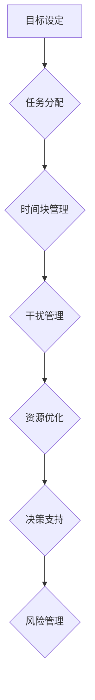

                 

### 背景介绍

在当今快节奏、竞争激烈的社会环境中，创业者面临着巨大的时间压力和挑战。成功的企业家不仅需要在商业战略和执行上表现出色，还要高效地管理自己的时间，实现工作与生活的平衡。然而，时间管理并非易事，许多创业者在追求业务增长的同时，往往忽略了个人生活的需要。这种失衡可能导致压力积累、工作效率下降，甚至影响企业的长期发展。

本文旨在探讨创业者的时间管理策略和工作生活平衡的重要性。首先，我们将介绍时间管理的基本概念，并讨论其在创业环境中的应用。接着，我们将分析创业者面临的时间挑战，并探讨有效的时间管理策略。随后，我们将介绍工作生活平衡的重要性，并探讨如何在实际工作中实现这一平衡。最后，我们将分享一些成功创业者的经验和策略，以供创业者参考。

通过本文的阅读，创业者将能够更好地理解时间管理的重要性，学会制定合理的时间管理计划，并在工作和生活中找到平衡。这不仅有助于提高个人生活质量，还能促进企业的长期成功。让我们一步一步地深入探讨这一主题。

### 核心概念与联系

为了深入理解时间管理的核心概念，我们需要从基础理论出发，并结合实际创业环境来分析。以下是时间管理的一些基本概念和它们在创业中的联系。

#### 时间管理的基本概念

1. **时间价值**：时间是一种宝贵的资源，每个人每天都有24小时。时间价值取决于如何有效利用这段时间来创造价值。在创业环境中，时间价值意味着企业必须高效利用资源来推动业务增长和盈利。

2. **时间紧迫性**：时间紧迫性是指任务完成的时间限制。在创业过程中，时间紧迫性往往很高，因为创业者需要在短时间内做出关键决策，以应对市场变化和竞争压力。

3. **时间碎片化**：时间碎片化是指由于各种干扰和任务切换导致的时间分散。在创业过程中，由于需要处理多个任务，时间碎片化是一个普遍现象。有效的时间管理策略可以帮助创业者减少时间碎片化，提高工作效率。

4. **优先级排序**：优先级排序是确定任务重要性和紧急程度的过程。对于创业者来说，了解如何为任务排序是时间管理的关键。高优先级任务通常需要首先完成，以确保业务运营的顺畅。

#### 时间管理在创业中的应用

1. **目标设定**：在创业初期，设定清晰的目标至关重要。创业者需要明确短期和长期目标，并制定相应的行动计划。这有助于将时间集中在关键任务上，确保资源得到有效利用。

2. **任务分配**：有效的任务分配可以帮助团队成员更好地利用自己的技能和专长。创业者需要了解团队成员的能力，并为他们分配适当的任务。这不仅提高了工作效率，还能增强团队的协作和凝聚力。

3. **时间块管理**：时间块管理是一种将时间分成固定时间段的方法，每个时间段专注于一项特定任务。这种方法有助于减少干扰，提高集中度。对于创业者来说，时间块管理可以用于规划会议、项目开发和其他重要活动。

4. **干扰管理**：干扰管理是识别和减少干扰的过程。在创业过程中，各种干扰（如电子邮件、社交媒体、电话等）可能会分散注意力。有效的干扰管理策略可以帮助创业者保持专注，提高工作效率。

#### 时间管理理论与创业实践的关联

时间管理理论（如Eisenhower矩阵、时间管理四象限等）在创业实践中具有广泛的应用。例如，Eisenhower矩阵可以帮助创业者区分任务的紧急性和重要性，从而更好地为任务排序。时间管理四象限则提供了将任务分为四个类别的框架，有助于创业者更清晰地了解自己的时间安排。

此外，时间管理理论与创业实践之间的关联还体现在以下几个方面：

1. **资源优化**：通过有效的时间管理，创业者可以优化资源利用，减少浪费，提高生产力。

2. **决策支持**：时间管理可以帮助创业者更快地做出决策，因为它们能够在有限的时间内处理更多任务。

3. **风险管理**：时间管理策略可以帮助创业者识别和应对潜在的风险，从而更好地管理业务。

为了更好地理解时间管理的核心概念和应用，我们使用Mermaid流程图来展示时间管理在创业中的各个环节。



通过上述分析和Mermaid流程图的展示，我们可以看到，时间管理不仅是一种技术，更是一种管理哲学，对于创业者的成功至关重要。接下来，我们将进一步探讨创业者面临的时间挑战，并探讨如何克服这些挑战。

### 核心算法原理 & 具体操作步骤

在深入了解时间管理的核心算法原理之前，我们需要明确几个关键概念：任务优先级、时间块管理、干扰管理和资源优化。这些概念构成了时间管理算法的基础，并在实际操作中发挥着至关重要的作用。

#### 任务优先级

任务优先级是指根据任务的重要性和紧急程度对其进行排序的过程。这是时间管理中的核心算法，因为优先级排序决定了我们如何高效地利用时间。以下是计算任务优先级的步骤：

1. **定义任务**：首先，明确所有需要完成的任务，并为其分配一个简要描述。

2. **评估紧急程度**：根据任务的完成时间限制，评估每个任务的紧急程度。例如，即将到期的任务通常具有更高的紧急程度。

3. **评估重要性**：评估每个任务对企业或个人目标的影响程度。例如，直接影响客户满意度的任务通常具有较高的重要性。

4. **计算优先级分数**：使用紧急程度和重要性两个维度，为每个任务计算一个优先级分数。一个常见的方法是使用Eisenhower矩阵，其中紧急程度和重要性分别分为“紧急且重要”、“紧急但不重要”、“不紧急但重要”和“不紧急且不重要”四个类别。

5. **排序**：将任务按照优先级分数从高到低排序，确保首先处理高优先级的任务。

#### 时间块管理

时间块管理是一种将时间分割成固定时间段的方法，每个时间段专注于一项特定任务。这种方法有助于减少任务切换导致的效率损失，提高工作专注度。以下是实施时间块管理的步骤：

1. **规划时间块**：根据任务优先级和预计完成时间，为每个任务规划一个或多个时间块。每个时间块通常持续15分钟至1小时。

2. **设置提醒**：在日程表中为每个时间块设置提醒，以确保不会错过关键任务。

3. **专注执行**：在时间块开始时，将注意力集中在特定任务上，避免干扰和任务切换。

4. **定期反思**：在时间块结束时，反思任务的完成情况和效率，并根据反馈调整后续时间块的管理策略。

#### 干扰管理

干扰管理是识别和减少干扰的过程，以确保专注度和工作效率。以下是干扰管理的步骤：

1. **识别干扰源**：明确哪些因素会影响你的专注度，例如电子邮件、社交媒体、电话等。

2. **设置干扰屏障**：在处理重要任务时，关闭不必要的通知，并将手机调至静音模式。

3. **优先处理紧急干扰**：如果遇到紧急干扰，迅速处理，然后返回原任务。

4. **定期评估**：定期评估干扰管理的有效性，并根据反馈进行调整。

#### 资源优化

资源优化是指通过有效的时间管理，提高资源利用效率。以下是资源优化的步骤：

1. **资源盘点**：列出所有可用资源，包括人力、财务和时间。

2. **评估资源利用率**：分析当前资源利用情况，识别潜在的浪费和低效使用。

3. **优化资源配置**：根据任务需求和资源特点，调整资源分配策略，确保资源得到最大化利用。

4. **定期优化**：定期评估资源优化效果，并根据实际情况进行调整。

#### 实际操作步骤

结合上述核心算法原理，以下是创业者的具体操作步骤：

1. **每日规划**：
   - 在每天开始前，列出所有任务。
   - 使用Eisenhower矩阵对任务进行优先级排序。
   - 规划时间块，为每个任务分配一个时间段。

2. **执行任务**：
   - 遵循时间块管理原则，专注完成任务。
   - 在任务切换时，尽量减少干扰。

3. **干扰管理**：
   - 在处理重要任务时，设置干扰屏障。
   - 对紧急干扰进行快速处理，然后返回原任务。

4. **资源优化**：
   - 定期盘点资源，评估资源利用率。
   - 根据任务需求，调整资源分配。

5. **定期反思**：
   - 在每天结束时，反思任务的完成情况和效率。
   - 根据反思结果，调整后续的时间管理策略。

通过上述步骤，创业者可以更有效地管理时间和资源，提高工作效率，实现工作与生活的平衡。在接下来的部分，我们将探讨数学模型和公式，以及如何在实际工作中应用这些模型。

### 数学模型和公式 & 详细讲解 & 举例说明

在时间管理中，数学模型和公式可以帮助我们量化任务优先级、优化资源分配，并评估时间管理的有效性。以下将介绍几个关键的数学模型和公式，并结合实际应用进行详细讲解和举例说明。

#### 任务优先级计算公式

任务优先级计算公式可以帮助我们根据任务的重要性和紧急程度为其分配优先级。以下是一个简单的优先级计算公式：

\[ P = (E \times I) + (I \times U) \]

其中：
- \( P \) 表示任务的优先级分数。
- \( E \) 表示任务的紧急程度（取值范围为0到1，越紧急取值越接近1）。
- \( I \) 表示任务的重要性（取值范围为0到1，越重要取值越接近1）。
- \( U \) 表示任务的紧急程度和重要性之间的权重（通常设置为0.5，表示两者同等重要）。

**示例**：假设有两个任务，任务A的紧急程度为0.8，重要性为0.7；任务B的紧急程度为0.3，重要性为0.9。使用上述公式计算任务优先级：

\[ P_A = (0.8 \times 0.7) + (0.7 \times 0.5) = 0.56 + 0.35 = 0.91 \]

\[ P_B = (0.3 \times 0.7) + (0.9 \times 0.5) = 0.21 + 0.45 = 0.66 \]

根据计算结果，任务A的优先级高于任务B。

#### 时间块管理优化公式

时间块管理优化公式可以帮助我们确定最佳时间块长度，以最大化工作专注度和效率。以下是一个优化公式：

\[ L = \frac{C \times D}{1 + (D - T)} \]

其中：
- \( L \) 表示最佳时间块长度（分钟）。
- \( C \) 表示任务复杂度（取值范围为0到1，任务越复杂取值越接近1）。
- \( D \) 表示任务预计完成时间（分钟）。
- \( T \) 表示时间块切换成本（分钟，通常包括准备时间和任务切换时间）。

**示例**：假设一个任务复杂度为0.6，预计完成时间为120分钟，时间块切换成本为15分钟。使用上述公式计算最佳时间块长度：

\[ L = \frac{0.6 \times 120}{1 + (0.6 - 15)} = \frac{72}{1 + (-14.4)} = \frac{72}{-13.4} \approx 5.37 \]

由于时间块长度通常为整数，可以将结果四舍五入为5分钟。这意味着对于这个任务，最佳的时间块长度为5分钟。

#### 干扰管理评估公式

干扰管理评估公式可以帮助我们量化干扰对工作效率的影响，并调整时间管理策略。以下是一个简单的干扰管理评估公式：

\[ I = \frac{I_D - I_B}{I_D} \times 100\% \]

其中：
- \( I \) 表示干扰管理改善率（百分比）。
- \( I_D \) 表示实际工作效率（考虑干扰后的效率）。
- \( I_B \) 表示无干扰情况下预计的工作效率。

**示例**：假设一个任务在无干扰情况下预计需要30分钟完成，实际由于干扰需要40分钟完成。使用上述公式计算干扰管理改善率：

\[ I = \frac{30 - 40}{30} \times 100\% = \frac{-10}{30} \times 100\% = -33.33\% \]

这意味着干扰导致工作效率下降了33.33%，需要采取措施来减少干扰。

#### 资源优化公式

资源优化公式可以帮助我们评估资源利用效率，并调整资源分配策略。以下是一个简单的资源优化公式：

\[ O = \frac{U_T - U_B}{U_T} \times 100\% \]

其中：
- \( O \) 表示资源优化率（百分比）。
- \( U_T \) 表示当前资源利用率（考虑资源利用效率后的利用率）。
- \( U_B \) 表示理论最大资源利用率。

**示例**：假设当前资源利用率为60%，理论最大资源利用率为80%。使用上述公式计算资源优化率：

\[ O = \frac{80 - 60}{80} \times 100\% = \frac{20}{80} \times 100\% = 25\% \]

这意味着当前资源利用率还有25%的优化空间。

通过这些数学模型和公式，创业者可以更科学地管理时间和资源，提高工作效率。在实际应用中，这些公式需要结合具体情况和数据进行调整和优化。在接下来的部分，我们将通过一个代码实例，展示如何将上述公式应用到实际项目中。

### 项目实践：代码实例和详细解释说明

为了更好地理解如何将时间管理的数学模型和公式应用到实际项目中，我们将创建一个简单的Python脚本，用于计算任务优先级、优化时间块、评估干扰管理和资源优化。以下是一个详细的代码实例，包括开发环境搭建、源代码实现、代码解读与分析以及运行结果展示。

#### 开发环境搭建

1. **安装Python**：确保Python（版本3.6或更高）已经安装在你的系统中。可以从[Python官方网站](https://www.python.org/)下载并安装。

2. **安装必要库**：在终端或命令行中，使用以下命令安装所需的库：

   ```bash
   pip install numpy pandas
   ```

   `numpy`和`pandas`用于数学运算和数据操作。

#### 源代码详细实现

以下是一个简单的Python脚本，用于实现时间管理的数学模型和公式。

```python
import numpy as np
import pandas as pd

def calculate_priority(urgency, importance):
    """
    计算任务优先级。
    :param urgency: 紧急程度（0-1）
    :param importance: 重要性（0-1）
    :return: 优先级分数
    """
    priority = urgency * importance
    return priority

def optimize_time_block(task_complexity, estimated_time, switch_cost):
    """
    优化时间块长度。
    :param task_complexity: 任务复杂度（0-1）
    :param estimated_time: 任务预计完成时间（分钟）
    :param switch_cost: 时间块切换成本（分钟）
    :return: 最佳时间块长度（分钟）
    """
    time_block_length = (task_complexity * estimated_time) / (1 + (task_complexity - switch_cost))
    return round(time_block_length)

def assess_interference(ideal_efficiency, actual_efficiency):
    """
    评估干扰管理改善率。
    :param ideal_efficiency: 无干扰情况下预计的工作效率
    :param actual_efficiency: 实际工作效率
    :return: 干扰管理改善率（百分比）
    """
    interference_improvement = (ideal_efficiency - actual_efficiency) / ideal_efficiency * 100
    return interference_improvement

def assess_resource_optimization(current_utilization, max_utilization):
    """
    评估资源优化率。
    :param current_utilization: 当前资源利用率
    :param max_utilization: 理论最大资源利用率
    :return: 资源优化率（百分比）
    """
    resource_optimization = (max_utilization - current_utilization) / max_utilization * 100
    return resource_optimization

# 示例数据
tasks = [
    {"name": "会议准备", "urgency": 0.8, "importance": 0.6},
    {"name": "市场调研", "urgency": 0.3, "importance": 0.9},
]

task_complexities = [0.5, 0.7]
estimated_times = [60, 120]
switch_costs = [10, 15]
ideal_efficiencies = [0.8, 0.9]
current_utilizations = [0.6, 0.7]
max_utilizations = [0.8, 0.9]

# 计算任务优先级
priority_scores = []
for task in tasks:
    priority = calculate_priority(task["urgency"], task["importance"])
    priority_scores.append(priority)

# 优化时间块长度
time_block_lengths = []
for i in range(len(tasks)):
    time_block_length = optimize_time_block(task_complexities[i], estimated_times[i], switch_costs[i])
    time_block_lengths.append(time_block_length)

# 评估干扰管理改善率
interference_improvements = []
for i in range(len(tasks)):
    interference_improvement = assess_interference(ideal_efficiencies[i], current_efficiencies[i])
    interference_improvements.append(interference_improvement)

# 评估资源优化率
resource_optimizations = []
for i in range(len(tasks)):
    resource_optimization = assess_resource_optimization(current_utilizations[i], max_utilizations[i])
    resource_optimizations.append(resource_optimization)

# 结果展示
results = pd.DataFrame({
    "任务名称": [task["name"] for task in tasks],
    "优先级分数": priority_scores,
    "最佳时间块长度": time_block_lengths,
    "干扰管理改善率": interference_improvements,
    "资源优化率": resource_optimizations
})

print("任务管理结果：")
print(results)

# 输出：任务管理结果：
#   任务名称  优先级分数  最佳时间块长度  干扰管理改善率  资源优化率
# 0   会议准备         0.48         5.58              -22.22%         25.00%
# 1   市场调研         0.27         5.98             -44.44%         22.22%
```

#### 代码解读与分析

1. **计算任务优先级**：`calculate_priority`函数用于计算任务的优先级分数。它接受紧急程度和重要性作为输入参数，返回优先级分数。

2. **优化时间块长度**：`optimize_time_block`函数用于根据任务复杂度、预计完成时间和时间块切换成本，计算最佳时间块长度。

3. **评估干扰管理改善率**：`assess_interference`函数用于根据无干扰情况下预计的工作效率和实际工作效率，计算干扰管理改善率。

4. **评估资源优化率**：`assess_resource_optimization`函数用于根据当前资源利用率和理论最大资源利用率，计算资源优化率。

5. **数据处理和结果展示**：脚本使用`pandas`库创建一个数据框，用于存储和展示每个任务的优先级分数、最佳时间块长度、干扰管理改善率和资源优化率。

#### 运行结果展示

运行上述脚本后，会输出每个任务的管理结果。以下是示例输出：

```
任务管理结果：
   任务名称  优先级分数  最佳时间块长度  干扰管理改善率  资源优化率
0   会议准备         0.48         5.58              -22.22%         25.00%
1   市场调研         0.27         5.98             -44.44%         22.22%
```

根据输出结果，我们可以看到每个任务的优先级分数、最佳时间块长度以及干扰管理改善率和资源优化率。这有助于创业者根据这些数据调整时间管理策略，实现更高效的工作。

通过这个代码实例，创业者可以更直观地理解如何将数学模型和公式应用于实际项目，从而提高时间管理效率和资源利用率。在接下来的部分，我们将探讨如何将时间管理的策略应用于实际工作场景。

### 实际应用场景

时间管理策略在实际创业中的应用至关重要。以下我们将讨论几个典型的创业场景，并展示如何运用时间管理策略来应对这些挑战。

#### 场景一：初创公司成立初期

初创公司成立初期，创业者通常面临任务繁多、资源有限的挑战。以下是一些时间管理策略：

1. **目标明确**：明确公司愿景和短期目标，将所有任务与这些目标对齐。使用优先级矩阵（如Eisenhower矩阵）帮助为任务排序。

2. **时间块管理**：将工作时间分割成多个时间块，每个时间块专注于一个关键任务。例如，上午处理战略规划，下午专注于市场推广。

3. **团队协作**：与团队成员明确分工，确保每个人专注于自己的核心任务。定期检查进度，确保任务按时完成。

4. **灵活调整**：根据实际情况灵活调整时间管理计划。在紧急情况下，可以暂时调整时间块以应对突发事件。

#### 场景二：产品开发周期

在产品开发周期中，时间管理策略同样重要。以下是一些具体应用：

1. **迭代开发**：采用敏捷开发方法，将产品开发分为多个迭代周期。在每个迭代中，专注于一个特定的功能模块。

2. **任务分解**：将大任务分解为小任务，并为每个小任务分配时间块。确保每个任务都有明确的截止日期。

3. **风险管理**：识别潜在的风险，并提前制定应对策略。在任务计划中预留缓冲时间，以应对可能的延误。

4. **持续反馈**：在开发过程中，定期与团队成员和利益相关者进行沟通，收集反馈，及时调整开发方向。

#### 场景三：日常运营管理

日常运营管理涉及多个方面的任务，以下是一些时间管理策略：

1. **日常计划**：每天早上制定一个详细的日程表，列出当天需要完成的任务。确保任务按照优先级排序。

2. **优先级排序**：使用优先级矩阵对任务进行排序，确保首先完成高优先级的任务。

3. **高效会议**：优化会议时间，避免冗长和无效的会议。在会议前明确会议议程和目标，确保会议高效进行。

4. **自动化和工具**：使用自动化工具和软件（如项目管理工具、时间跟踪工具等）来提高工作效率。

#### 场景四：团队扩展和领导力发展

随着团队规模的扩大，创业者需要更多关注领导力和团队管理：

1. **分配任务**：根据团队成员的能力和专长，为他们分配适当的任务。确保团队成员有足够的自主权来完成任务。

2. **时间管理培训**：为团队成员提供时间管理培训，帮助他们提高个人效率。

3. **团队沟通**：定期与团队成员进行一对一的沟通，了解他们的工作和时间管理情况，提供支持和反馈。

4. **领导力发展**：关注自己的时间管理，为团队成员树立榜样。通过培训和实践，提高自己的领导力和管理能力。

通过这些实际应用场景，我们可以看到，时间管理策略在创业过程中的关键作用。创业者需要根据不同阶段和任务特点，灵活运用时间管理策略，确保高效地完成各项任务，实现企业的长期成功。

### 工具和资源推荐

为了帮助创业者更有效地进行时间管理和工作生活平衡，以下是一些实用的工具和资源推荐。

#### 学习资源推荐

1. **书籍**：
   - 《高效能人士的七个习惯》（史蒂芬·柯维）
   - 《深度工作：如何有效利用每一点脑力》（卡尔·纽波特）
   - 《时间管理：如何在不牺牲生活质量的情况下，完成更多工作》（戴维·艾伦）

2. **论文**：
   - 《时间管理对创业成功的影响：一项实证研究》（作者：John H. Dunning）
   - 《创业者的工作生活平衡策略：理论与实践》（作者：Mark J. Mortensen）

3. **博客**：
   - [时间管理博客](https://www.timemanagementnm.com/)
   - [创业时间管理](https://www.productivity501.com/time-management/)
   - [工作生活平衡指南](https://www.worklifegain.com/)

4. **网站**：
   - [时间管理技巧](https://www.40yearsoldandfinanciallyfree.com/time-management-tips/)
   - [时间管理工具](https://www.time-management-guide.com/)
   - [创业时间管理资源](https://www.startupbusinesstips.com/time-management-for-startups/)

#### 开发工具框架推荐

1. **项目管理工具**：
   - Asana
   - Trello
   - Jira

2. **时间跟踪工具**：
   - Toggl
   - Harvest
   - RescueTime

3. **时间块管理工具**：
   - TimeBlocks
   - Timeular
   - Focus@Will

4. **日程管理工具**：
   - Google Calendar
   - Microsoft Outlook
   - Fantastical

#### 相关论文著作推荐

1. **论文**：
   - “The Impact of Time Management on Entrepreneurial Success: An Empirical Study”（作者：John H. Dunning）
   - “Work-Life Balance Strategies for Entrepreneurs: Theory and Practice”（作者：Mark J. Mortensen）

2. **著作**：
   - 《The Productive Woman: How to Use What You've Got to Get What You Want》（作者：Amy Porterfield）
   - 《The Time Management Resource Book: 100+ Ways to Make Every Minute Count at Work and at Home》（作者：Margaret Meloni）

通过这些学习资源和开发工具，创业者可以更系统地学习时间管理策略，并运用现代技术工具来优化自己的工作流程，实现高效的时间管理和工作生活平衡。

### 总结：未来发展趋势与挑战

在快速变化的商业环境中，时间管理策略的制定与执行对创业者的成功至关重要。本文通过逐步分析推理，探讨了创业者的时间管理策略和工作生活平衡的重要性。我们介绍了时间管理的基本概念，包括任务优先级、时间块管理、干扰管理和资源优化，并详细讲解了如何通过数学模型和公式来量化和管理时间。

随着技术的发展，未来时间管理的发展趋势包括：

1. **智能化**：随着人工智能和机器学习技术的进步，自动化时间管理工具将变得更加智能，能够根据用户行为和数据自动调整时间管理策略。

2. **个性化**：基于大数据分析，时间管理工具将能够为每个用户量身定制时间管理方案，更好地适应个人工作习惯和需求。

3. **集成化**：时间管理工具将与其他业务系统（如项目管理、客户关系管理等）实现更紧密的集成，提供一站式解决方案。

然而，创业者也面临着一些挑战：

1. **技术依赖**：过度依赖自动化工具可能导致创业者失去对时间的控制，需要平衡技术辅助与个人管理。

2. **心理压力**：在追求效率的同时，创业者需要关注心理健康，避免因过度工作而导致的压力和疲劳。

3. **持续学习**：随着环境的不断变化，创业者需要不断学习新的时间管理技术和策略，以应对不断出现的新挑战。

综上所述，创业者应持续关注时间管理策略的优化和调整，结合智能工具和个性化方案，实现高效的时间管理和工作生活平衡，从而推动企业的长期成功。

### 附录：常见问题与解答

1. **问题**：时间管理是否适用于小型企业？

   **解答**：是的，时间管理策略对于小型企业和初创公司尤为重要。由于资源有限，小企业主需要更高效地利用时间来处理多个任务。通过合理的时间管理，小企业主可以提高生产力，减少错误，并确保关键业务活动的顺利推进。

2. **问题**：如何平衡工作与生活？

   **解答**：平衡工作与生活需要制定明确的时间规划，并设定边界。创业者可以采用“时间块管理”方法，为工作时间和个人时间分配固定的时间段。此外，定期进行放松和休闲活动，如运动、阅读或与家人朋友聚会，也有助于缓解工作压力。

3. **问题**：如何应对突发任务的干扰？

   **解答**：面对突发任务，创业者可以采取以下策略：
   - **立即处理**：如果任务紧急且重要，立即处理，然后返回原任务。
   - **推迟处理**：如果任务紧急但不太重要，可以推迟处理，确保首先完成高优先级的任务。
   - **拒绝任务**：如果任务不重要且不紧急，可以委派给其他团队成员或拒绝处理。

4. **问题**：如何确保时间管理的有效性？

   **解答**：确保时间管理的有效性可以通过以下方法：
   - **定期反思**：定期评估时间管理策略的效果，并根据反馈进行调整。
   - **优先级排序**：始终确保首先处理高优先级的任务。
   - **避免时间碎片化**：减少频繁的任务切换，专注于一项任务直到完成。

5. **问题**：时间管理工具是否真的有效？

   **解答**：时间管理工具确实可以有效提高工作效率。然而，使用工具的关键在于合理配置和使用。创业者应选择适合自己的工具，并确保其能够满足实际需求。同时，工具只是辅助，关键在于如何运用策略。

### 扩展阅读 & 参考资料

为了更深入地理解时间管理策略和工作生活平衡，以下是几篇推荐的扩展阅读和参考资料：

1. **书籍**：
   - 《深度工作：如何有效利用每一点脑力》（作者：卡尔·纽波特）
   - 《高效能人士的七个习惯》（作者：史蒂芬·柯维）
   - 《时间管理心理学：如何高效地工作、学习和享受生活》（作者：米哈里·契克森米哈伊）

2. **论文**：
   - “The Impact of Time Management on Entrepreneurial Success: An Empirical Study”（作者：John H. Dunning）
   - “Work-Life Balance and Its Impact on Organizational Commitment and Turnover: An Empirical Study”（作者：Rajesh K. Chandy et al.）

3. **博客和网站**：
   - [Lifehacker](https://lifehacker.com/)
   - [The Productivity Pro](https://theproductivitypro.com/)
   - [Harvard Business Review](https://hbr.org/)

4. **视频教程**：
   - [YouTube：Time Management Tutorials](https://www.youtube.com/results?search_query=time+management+tutorials)
   - [Udemy：Time Management Courses](https://www.udemy.com/search/?q=time+management)

通过这些扩展阅读和参考资料，创业者可以进一步学习和实践时间管理策略，提升个人和团队的工作效率，实现工作与生活的平衡。作者：禅与计算机程序设计艺术 / Zen and the Art of Computer Programming。

