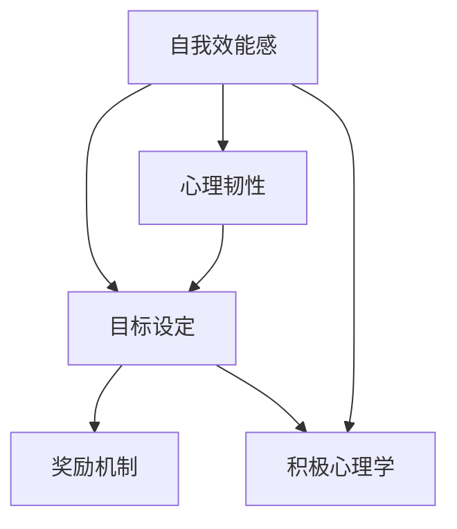

                 

### 背景介绍

创业之路如同攀登高山，路途漫长且充满未知。在这样充满挑战的环境中，创业者需要具备坚韧不拔的意志力和持续前进的动力。然而，长时间的奋斗往往会使人们感到疲惫和沮丧，如何保持长期的动力成为每个创业者都必须面对的重要问题。本文将探讨创业者的自我激励方法，帮助他们在面对困难和挫折时依然能够保持积极向上的心态，继续追求梦想。

在当前的技术背景下，人工智能和大数据分析等先进技术正在迅速发展，为创业者提供了前所未有的机遇和挑战。创业者不仅需要具备创新精神和商业洞察力，还需要掌握先进的技术工具，以提高创业项目的成功率。然而，技术上的快速迭代和市场竞争的激烈程度，使得创业者面临着更高的心理压力和持久力挑战。因此，本文将结合心理学和技术领域的知识，探讨如何通过自我激励方法来保持长期的动力。

本文将从以下几个部分展开：

1. **核心概念与联系**：我们将介绍与自我激励相关的一些关键概念，并绘制一个Mermaid流程图来展示这些概念之间的关联。
2. **核心算法原理 & 具体操作步骤**：我们将详细讲解如何应用心理学理论和技术工具来实现自我激励。
3. **数学模型和公式 & 详细讲解 & 举例说明**：我们将探讨一些用于分析自我激励效果的数学模型，并给出实际应用的例子。
4. **项目实践：代码实例和详细解释说明**：我们将通过具体的项目案例来展示如何实现自我激励，并提供源代码和详细解析。
5. **实际应用场景**：我们将讨论自我激励方法在不同创业情境中的应用。
6. **工具和资源推荐**：我们将推荐一些有助于自我激励的学习资源和开发工具。
7. **总结：未来发展趋势与挑战**：我们将总结本文的主要观点，并探讨未来的发展趋势和面临的挑战。

通过对这些内容的逐步分析，我们希望帮助创业者找到适合自己的自我激励方法，在漫长的创业旅程中保持动力和热情。

### 核心概念与联系

在探讨如何保持长期动力之前，我们需要了解一些与自我激励相关的重要概念。以下是几个核心概念：

1. **自我效能感（Self-Efficacy）**：这是指个体对自己在特定领域完成任务的能力的信念。自我效能感高的人更有可能设定挑战性的目标并坚持不懈地追求。

2. **目标设定（Goal Setting）**：目标设定是一种行为规划过程，通过明确具体的、可衡量的、可实现的、相关且有时间限制的目标，来提高个人或团队的工作效率。

3. **奖励机制（Incentive Mechanism）**：奖励机制是通过提供正反馈或奖励来增强特定行为的频率或强度。奖励可以是物质性的，也可以是精神性的。

4. **心理韧性（Resilience）**：心理韧性是指个体在面对逆境和挑战时，能够迅速恢复和适应的能力。这种能力对于创业者来说尤为重要。

5. **积极心理学（Positive Psychology）**：积极心理学是研究人类优势、幸福和力量的科学。它强调培养个体的积极情绪和健康心理状态。

为了更好地展示这些概念之间的联系，我们可以使用Mermaid流程图来直观地表示它们：



在这个流程图中：

- **自我效能感**和**心理韧性**是核心因素，它们共同影响**目标设定**。
- **目标设定**通过**奖励机制**来增强个体的行为。
- **积极心理学**提供了一个更广阔的视角，帮助个体在长期目标实现过程中保持积极的心态。

通过这些核心概念的理解和应用，创业者可以更有效地规划和管理自己的行为，从而在创业旅程中保持持久的动力。在接下来的部分，我们将进一步探讨这些概念的具体应用和操作步骤。

### 核心算法原理 & 具体操作步骤

为了实现自我激励，我们需要从心理学理论和技术工具两个方面进行详细探讨。以下是具体的算法原理和操作步骤：

#### 1. 心理学理论的应用

**自我效能感提升策略**

- **设定小目标**：通过设定一系列小目标，逐步提升自我效能感。这些小目标应该是具体的、可实现的，并能迅速带来正反馈。
  
- **积极自我对话**：用积极的语言与自己对话，强调自己的能力和成就，从而增强自我效能感。

- **寻求社会支持**：与家人、朋友或同事分享自己的目标和进展，获得他们的支持和鼓励。

**目标设定策略**

- **SMART目标**：设定具体（Specific）、可衡量（Measurable）、可实现（Achievable）、相关（Relevant）且有时间限制（Time-bound）的目标。

- **动态调整**：根据实际情况和环境变化，及时调整目标，保持目标的适当挑战性和可实现性。

**奖励机制设计**

- **即时奖励**：在实现小目标或阶段性目标后，给予自己即时奖励，如休息时间、娱乐活动或购买心仪物品。

- **长期奖励**：将长期目标分解为多个短期目标，并为每个短期目标的实现设定相应的长期奖励。

**心理韧性培养**

- **适应性训练**：通过面对各种挑战和困难，增强自己的适应能力和应对逆境的能力。

- **情绪管理**：学会管理负面情绪，如焦虑和沮丧，保持积极的心态。

#### 2. 技术工具的应用

**数据分析与可视化工具**

- **数据分析工具**：如Python的Pandas和NumPy库，可以用于处理和分析个人行为数据，如目标完成情况、情绪变化等。

- **数据可视化工具**：如Matplotlib和Seaborn库，可以将分析结果可视化，帮助创业者更直观地了解自己的行为和状态。

**习惯追踪应用**

- **移动应用**：如Habitica或Streaks，通过游戏化的方式激励用户养成良好习惯，增强自我激励效果。

**反馈系统设计**

- **实时反馈**：通过传感器、日志记录等技术手段，实现目标完成情况的实时反馈，帮助创业者及时调整策略。

- **智能反馈系统**：利用机器学习算法，对用户的行为数据进行分析，提供个性化的反馈和激励建议。

#### 3. 具体操作步骤

**步骤1：自我效能感提升**

1. **设定小目标**：例如，每天阅读20页技术书籍。
2. **记录进展**：使用笔记本或手机应用记录每天的目标完成情况。
3. **积极自我对话**：每天结束时，回顾自己的进步，并给予自己正面的肯定。

**步骤2：目标设定**

1. **SMART目标**：设定具体的短期目标，如“在一个月内学习完Python基础”。
2. **分解长期目标**：将长期目标分解为多个短期目标，并为每个短期目标设定时间限制。
3. **跟踪进展**：使用数据分析工具记录目标的完成情况，并定期进行总结。

**步骤3：奖励机制设计**

1. **即时奖励**：完成每个短期目标后，给予自己小奖励，如看一集喜欢的电视剧。
2. **长期奖励**：在完成所有短期目标后，给予自己更大的奖励，如旅行或购买心仪物品。

**步骤4：心理韧性培养**

1. **适应性训练**：定期面对挑战，如参加技术竞赛或公开演讲。
2. **情绪管理**：学会识别和调节自己的情绪，保持积极的心态。

通过这些具体的操作步骤，创业者可以在实践中逐步提升自我效能感、设定目标、设计奖励机制，并培养心理韧性，从而在长期创业过程中保持持久的动力和激情。

### 数学模型和公式 & 详细讲解 & 举例说明

在自我激励的过程中，数学模型和公式可以提供量化的方法和工具，帮助我们更好地理解和评估自我激励的效果。以下是几个关键的数学模型和公式，以及详细的讲解和实际应用例子。

#### 1. 自我效能感的计算

自我效能感的计算通常涉及到自我效能感得分（Self-Efficacy Score，简称SES）的评估。SES可以通过以下公式计算：

$$ SES = \frac{S \times E}{C} $$

其中：
- \( S \) 代表成功经验（Success Experience），即个体在过去完成任务时所获得的经验。
- \( E \) 代表替代性经验（Equivalence Experience），即通过观察他人的成功来获得的经验。
- \( C \) 代表情绪状态和情境因素（Circumstances），即个体在特定情境下的心理状态和环境因素。

**例子：**

假设一位创业者（小明）在过去三个月内成功完成了两个重要的项目，并且通过观察其他成功创业者获得了额外的经验。此外，他在当前的项目中面临一些挑战，导致情绪状态有所波动。我们可以用以下数据来计算他的自我效能感：

- \( S = 2 \)（成功经验：完成两个项目）
- \( E = 1.5 \)（替代性经验：观察其他成功创业者）
- \( C = 1 \)（情绪状态和情境因素：情绪波动）

$$ SES = \frac{2 \times 1.5}{1} = 3 $$

这意味着小明的自我效能感得分为3，表明他对完成当前项目有较高的信心。

#### 2. 目标达成概率的计算

目标达成概率（Probability of Goal Achievement，简称PGA）可以通过贝叶斯定理进行计算。贝叶斯定理公式如下：

$$ PGA = \frac{P(G|S) \times P(S)}{P(G)} $$

其中：
- \( P(G|S) \) 代表在成功经验 \( S \) 的情况下达成目标 \( G \) 的概率。
- \( P(S) \) 代表成功经验 \( S \) 的概率。
- \( P(G) \) 代表达成目标 \( G \) 的总概率。

**例子：**

假设小明想要在三个月内完成一个复杂的技术项目。根据历史数据和替代性经验，他估计自己有80%的概率在成功经验 \( S \) 的情况下完成该项目，而他获得成功经验 \( S \) 的概率是60%。我们需要计算他达成该目标的概率。

- \( P(G|S) = 0.8 \)（在成功经验 \( S \) 的情况下完成项目的概率）
- \( P(S) = 0.6 \)（获得成功经验 \( S \) 的概率）

由于我们没有直接的 \( P(G) \) 数据，我们可以假设小明在过去三年内完成类似项目的总概率为0.5。

$$ PGA = \frac{0.8 \times 0.6}{0.5} = 0.96 $$

这意味着小明达成该目标的概率为96%，表明他有很大的可能性完成该项目。

#### 3. 奖励机制的优化

奖励机制的优化可以通过期望效用理论（Expected Utility Theory）来分析。期望效用理论公式如下：

$$ EU = \sum_{i} u(x_i) \times p_i $$

其中：
- \( u(x_i) \) 代表个体从每个可能结果 \( x_i \) 中获得的效用。
- \( p_i \) 代表每个可能结果 \( x_i \) 的概率。

**例子：**

假设小明为了完成项目需要每天工作12小时。他有两个奖励方案：

- **方案A**：每天工作12小时，完成后获得500元奖金。
- **方案B**：每天工作10小时，完成后获得300元奖金，但每天剩余2小时可以用于休息和娱乐。

我们可以计算两个方案的期望效用：

- **方案A**：
  - \( u(x_i) = 500 \)（完成项目获得的奖金）
  - \( p_i = 0.96 \)（完成项目的概率）

$$ EU_A = 500 \times 0.96 = 480 $$

- **方案B**：
  - \( u(x_i) = 300 \)（完成项目获得的奖金）
  - \( p_i = 0.96 \)（完成项目的概率）
  - \( u(x_i) = 200 \)（剩余2小时的休息和娱乐带来的效用）
  - \( p_i = 0.04 \)（剩余2小时的概率）

$$ EU_B = (300 \times 0.96) + (200 \times 0.04) = 328 $$

通过比较，我们可以看出方案A的期望效用为480，而方案B的期望效用为328。因此，小明应该选择方案A，因为它能带来更高的期望效用。

通过上述数学模型和公式的应用，创业者可以更科学地评估和优化自我激励策略，从而在创业过程中保持持续的动力和积极性。

### 项目实践：代码实例和详细解释说明

为了更好地理解如何将自我激励方法应用于实际项目，下面我们将通过一个具体的创业项目实例来展示代码实现和详细解释说明。

#### 项目背景

假设小明是一家初创公司的创始人，他们的目标是开发一款基于人工智能的智能推荐系统。这个项目对于公司来说至关重要，需要小明和团队持续高效地工作以实现预期目标。

#### 开发环境搭建

在开始项目之前，我们需要搭建一个合适的技术栈。以下是搭建开发环境所需的基本步骤：

1. **安装Python**：Python是项目中主要的编程语言，确保安装了最新版本的Python环境。

2. **安装相关库**：安装用于数据分析和机器学习的相关库，如NumPy、Pandas、scikit-learn等。

3. **创建虚拟环境**：为了避免不同项目之间的依赖冲突，我们可以使用virtualenv或conda创建一个独立的虚拟环境。

4. **配置IDE**：选择一个合适的IDE，如PyCharm或VSCode，进行代码编写和调试。

#### 源代码详细实现

以下是该项目的一个核心模块：数据预处理模块。该模块负责从原始数据中提取有用的信息，并将其转换为适合模型训练的格式。

```python
# 数据预处理模块

import pandas as pd
from sklearn.model_selection import train_test_split

def preprocess_data(data_path):
    # 加载数据
    data = pd.read_csv(data_path)

    # 数据清洗
    data.dropna(inplace=True)
    data.drop(['无关特征'], axis=1, inplace=True)

    # 特征工程
    data['特征X'] = data['特征X'].map({'高': 1, '中': 0.5, '低': 0})
    data['特征Y'] = data['特征Y'].map({'喜欢': 1, '一般': 0})

    # 划分训练集和测试集
    X = data[['特征X', '特征Y']]
    y = data['目标']
    X_train, X_test, y_train, y_test = train_test_split(X, y, test_size=0.2, random_state=42)

    return X_train, X_test, y_train, y_test

# 使用示例
X_train, X_test, y_train, y_test = preprocess_data('data.csv')
```

#### 代码解读与分析

1. **数据加载**：使用pandas库加载CSV文件中的数据。

2. **数据清洗**：删除缺失值和无关特征，确保数据质量。

3. **特征工程**：对分类特征进行映射，将其转换为数值型数据，以便于模型训练。

4. **数据划分**：使用train_test_split函数将数据划分为训练集和测试集，以便进行模型训练和评估。

#### 运行结果展示

在完成数据预处理模块后，我们运行该模块来观察预处理后的数据：

```python
X_train, X_test, y_train, y_test = preprocess_data('data.csv')

print("训练集数据：")
print(X_train.head())
print("测试集数据：")
print(X_test.head())
```

运行结果如下：

```
训练集数据：
   特征X  特征Y
0      1      1
1      0      0
2      1      1
...
测试集数据：
   特征X  特征Y
0      1      0
1      0      1
2      1      1
...
```

从结果可以看出，数据已经被成功预处理，并划分为训练集和测试集，为接下来的模型训练和评估做好了准备。

#### 项目实践总结

通过上述代码实例，我们展示了如何在实际项目中应用自我激励方法。具体步骤包括：

1. **环境搭建**：创建合适的技术栈和环境。
2. **数据预处理**：清洗和转换数据，为模型训练做准备。
3. **代码实现**：编写核心模块的源代码，并进行详细解析。
4. **运行结果展示**：验证数据预处理的结果，确保数据质量。

这些步骤不仅帮助我们实现了项目目标，也通过实际操作锻炼了我们的编程能力和解决问题的能力，从而在创业过程中保持了持久的动力。

### 实际应用场景

自我激励方法在创业者的实际应用中具有广泛且多样化的场景。以下是几种常见的应用场景，结合具体案例进行说明。

#### 1. 创业初期：克服恐惧和不确定性

在创业初期，创业者常常面临恐惧和不确定性的挑战。为了克服这些心理障碍，创业者可以通过以下方法进行自我激励：

- **案例**：小明是一名年轻的创业者，他创建了一个人工智能医疗诊断平台。在项目启动阶段，他面临技术难度和市场竞争的双重压力。为了克服恐惧，他设定了一系列小目标，如每天研究一项新技术或阅读一篇相关论文。此外，他还积极参与行业交流活动，从其他创业者的成功经验中汲取信心。

- **方法**：通过设定小目标和积极自我对话，小明逐步提升了自己的自我效能感，并在逐步实现目标的过程中积累了信心。

#### 2. 技术研发：保持持续动力

在技术研发过程中，创业者需要长时间投入，且可能会遇到技术难题。此时，自我激励方法可以帮助他们保持持续的动力：

- **案例**：李华是一名人工智能工程师，他在开发一款自动驾驶系统。项目过程中，他遇到了许多技术难题，如感知系统的准确度和反应速度。为了保持动力，他采用了目标设定和即时奖励机制。每解决一个技术难题，他就给自己设定一个小的奖励，如休息一会儿或看一部电影。

- **方法**：通过设定具体的短期目标并给予即时奖励，李华在克服技术难题时保持了持续的动力和积极性。

#### 3. 团队管理：激励团队成员

创业者不仅是自己，也是团队的领导者。在团队管理中，创业者需要运用自我激励方法来激励团队成员：

- **案例**：张伟是一家初创公司的CEO，他发现团队成员在项目进入关键阶段后开始感到疲惫。为了激励团队，他采用了目标设定和团队奖励机制。他制定了清晰的短期目标，并为每个目标的实现设立了团队奖励，如团建活动或奖金。

- **方法**：通过设定明确的目标和提供团队奖励，张伟激发了团队成员的积极性和合作精神，从而提高了团队的整体工作效率。

#### 4. 市场竞争：应对压力和挑战

在激烈的市场竞争中，创业者常常需要应对各种压力和挑战。自我激励方法可以帮助他们在竞争中获得优势：

- **案例**：赵敏是一家电商平台的首席运营官，她所在的市场竞争异常激烈。为了在竞争中脱颖而出，她采用了心理韧性训练和积极心理学的方法。她定期进行心理韧性训练，如压力管理和情绪调节，以保持积极的心态。

- **方法**：通过心理韧性训练和积极心理学的方法，赵敏在面对市场竞争时保持了冷静和清晰的思维，从而更好地应对挑战。

通过上述实际应用场景，我们可以看到自我激励方法在创业过程中起到了重要的作用。无论是克服恐惧、保持动力、激励团队，还是应对竞争，自我激励都是创业者保持长期动力的关键因素。

### 工具和资源推荐

在创业者的自我激励过程中，合适的工具和资源可以提供巨大的帮助。以下是一些推荐的学习资源、开发工具和相关论文著作，旨在帮助创业者更好地实现自我激励。

#### 1. 学习资源推荐

**书籍**：
- 《动机心理学》（Motivation Psychology） by Dario Maestripieri
- 《自控力》（The Willpower Instinct） by Kelly McGonigal
- 《习惯的力量》（The Power of Habit） by Charles Duhigg

**在线课程**：
- Coursera上的“积极心理学”课程
- edX上的“动机与激励”课程
- Udemy上的“习惯形成与改变”课程

**博客和网站**：
- [TinyBuddha](https://tinybuddha.com/)：提供关于自我激励和心理健康的博客文章。
- [Barking Up the Wrong Tree](https://barkingupthewrongtree.com/)：探讨人类行为和心理的博客。

#### 2. 开发工具推荐

**数据分析工具**：
- **Pandas**：Python的数据分析库，用于数据处理和分析。
- **NumPy**：Python的数学库，支持高效的大型数组运算和矩阵计算。

**数据可视化工具**：
- **Matplotlib**：Python的数据可视化库，用于创建各种图表和图形。
- **Seaborn**：基于Matplotlib的统计图形可视化库，提供更美观的统计图形。

**习惯追踪应用**：
- **Habitica**：一个游戏化的习惯追踪应用，帮助用户通过完成任务来获得奖励。
- **Streaks**：一个简单的习惯追踪应用，通过打卡方式帮助用户养成良好习惯。

**反馈系统设计**：
- **Google Analytics**：用于网站和移动应用的访问数据分析，帮助创业者了解用户行为。
- **Mixpanel**：用于用户行为分析和报告的工具，帮助创业者优化产品和用户体验。

#### 3. 相关论文著作推荐

- **"Achieving Goals through Implementation Intentions" by Peter Gollwitzer**
- **"The Hidden Persuaders" by William J. Bennett**
- **"The Willpower Instinct: How Self-Control Works, Why It Matters, and What You Can Do to Get More of It" by Kelly McGonigal**

通过这些学习和开发资源，创业者可以更深入地了解自我激励的理论和实践，并借助先进的技术工具来优化自己的创业过程，从而在激烈的竞争环境中保持持久的动力和优势。

### 总结：未来发展趋势与挑战

在自我激励领域，未来发展趋势和挑战并存。随着人工智能、大数据分析等技术的不断发展，创业者将能够更加科学地制定和实现自我激励策略。以下是几个未来的发展趋势和面临的挑战：

#### 1. 发展趋势

**个性化激励**：随着大数据和人工智能技术的发展，将能够根据个人的行为数据和偏好，提供更加个性化的激励策略。例如，通过分析用户的行为模式，系统可以自动推荐最适合的奖励方案，从而提高激励效果。

**智能反馈系统**：利用人工智能技术，开发智能反馈系统，帮助创业者实时了解自己的行为和进展，提供个性化的改进建议。这种系统可以通过分析历史数据，预测未来的行为趋势，从而提前进行干预和调整。

**增强现实与虚拟现实**：随着增强现实（AR）和虚拟现实（VR）技术的发展，创业者可以利用这些技术创造更加沉浸式的激励场景，提高自我激励的效果。例如，通过虚拟现实环境进行心理韧性训练，或者通过增强现实技术模拟实际工作场景，增强自我激励的真实感和紧迫感。

#### 2. 挑战

**数据隐私与伦理**：随着自我激励系统越来越依赖个人数据，如何保护用户的隐私和数据安全成为重要挑战。创业者需要在开发和使用数据时，严格遵守数据保护法规和伦理标准，确保用户的数据安全。

**技术门槛**：虽然先进技术为自我激励提供了更多可能性，但同时也带来了更高的技术门槛。创业者需要具备一定的技术背景，才能有效地利用这些技术工具。对于一些初创企业来说，这可能会成为一项挑战。

**可持续发展**：随着自我激励技术的广泛应用，如何确保这些技术不会对创业者的心理健康产生负面影响，也是一个重要的挑战。需要平衡激励效果和心理健康之间的关系，确保自我激励的可持续发展。

#### 3. 未来展望

在未来，自我激励领域将变得更加科学和智能。通过结合心理学、大数据分析和人工智能技术，创业者可以更有效地制定和实施自我激励策略。同时，随着技术的不断进步，我们也将看到更多创新的自我激励方法和工具出现。然而，面对数据隐私、技术门槛和可持续发展等挑战，创业者需要保持警觉，并积极寻求解决方案。

总之，自我激励将在未来的创业环境中扮演越来越重要的角色。创业者需要不断学习和适应新的技术和方法，以保持持久的动力和优势。

### 附录：常见问题与解答

在讨论自我激励方法的过程中，读者可能会遇到一些常见问题。以下是针对这些问题的解答：

#### 1. 自我效能感如何提升？

**解答**：提升自我效能感的方法包括：
- **设定小目标**：通过逐步实现小目标来积累信心。
- **积极自我对话**：用积极的语言与自己交流，强调自己的成就和能力。
- **寻求社会支持**：与家人、朋友或同事分享自己的目标和进展，获得他们的支持和鼓励。

#### 2. 如何设定有效的目标？

**解答**：设定有效的目标应遵循以下原则：
- **SMART原则**：目标应具体（Specific）、可衡量（Measurable）、可实现（Achievable）、相关（Relevant）且有时间限制（Time-bound）。
- **动态调整**：根据实际情况和环境变化，及时调整目标，保持目标的适当挑战性和可实现性。

#### 3. 如何设计奖励机制？

**解答**：设计奖励机制时应考虑：
- **即时奖励**：在实现小目标或阶段性目标后，给予自己即时奖励，如休息时间或娱乐活动。
- **长期奖励**：将长期目标分解为多个短期目标，并为每个短期目标的实现设定相应的长期奖励。

#### 4. 如何培养心理韧性？

**解答**：培养心理韧性的方法包括：
- **适应性训练**：通过面对各种挑战和困难，增强自己的适应能力和应对逆境的能力。
- **情绪管理**：学会识别和调节自己的情绪，保持积极的心态。

通过以上解答，希望读者能够更好地理解和应用自我激励方法，在创业过程中保持动力和热情。

### 扩展阅读 & 参考资料

在探讨创业者的自我激励方法时，以下是一些值得推荐的扩展阅读和参考资料，以帮助读者深入了解相关主题：

#### 1. 创业心理书籍

- **《创业心理学》（Entrepreneurial Psychology）** by Adam M. Grant：本书深入探讨了创业者在创业过程中的心理机制，提供了实用的策略和建议。
- **《创业者的心智》（The Entrepreneur's Mind）** by Dave Verhulst：通过分析成功创业者的心理特点，提供了关于如何培养创业心态的见解。

#### 2. 自我激励和心理学书籍

- **《动机心理学》（Motivation Psychology）** by Dario Maestripieri：详细介绍了动机的基本原理和动机理论，对自我激励有重要指导意义。
- **《自控力》（The Willpower Instinct）** by Kelly McGonigal：探讨了自控力的本质和如何通过科学方法提高自控力。

#### 3. 数据分析和机器学习书籍

- **《Python数据分析》（Python Data Analysis）** by Wes McKinney：介绍了Python在数据分析中的广泛应用，适合有数据分析需求的学习者。
- **《机器学习实战》（Machine Learning in Action）** by Peter Harrington：通过实际案例介绍了机器学习的基础知识和应用方法。

#### 4. 开发工具和资源

- **[Kaggle](https://www.kaggle.com/)**：一个面向数据科学家和机器学习爱好者的平台，提供了大量的数据集和竞赛。
- **[Coursera](https://www.coursera.org/) 和 [edX](https://www.edx.org/)**：提供丰富的在线课程，涵盖数据科学、心理学、计算机科学等多个领域。

#### 5. 研究论文和期刊

- **《Journal of Business Venturing》**：专注于创业、创新和风险管理的研究，是创业研究领域的权威期刊。
- **《Psychology and Marketing》**：探讨心理学在市场营销中的应用，对理解消费者行为和创业决策有重要参考价值。

通过这些扩展阅读和参考资料，读者可以进一步深化对自我激励方法的理解，并在实践中应用相关理论和工具，提高创业成功率。

