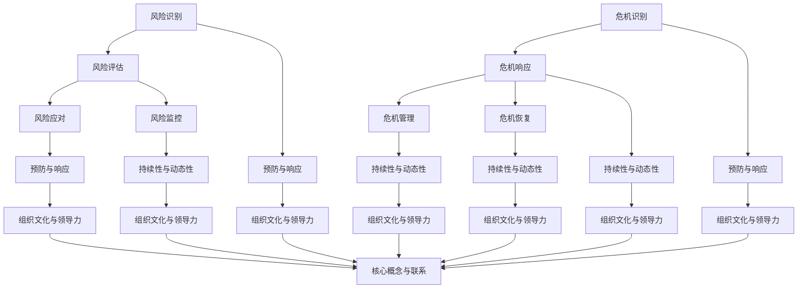
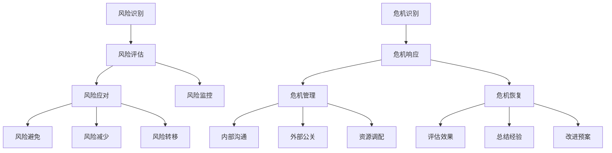
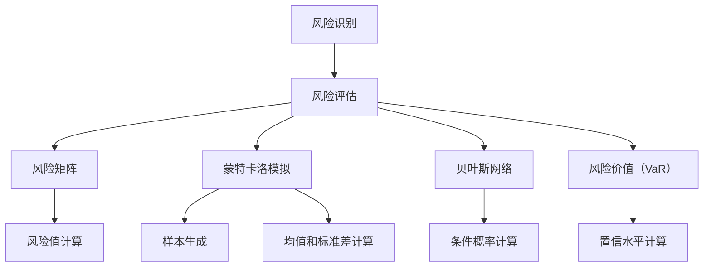

                 

### 1. 背景介绍

在当今高速发展的商业环境中，创业者面临的挑战日益复杂，特别是在风险管理和危机应对方面。创业之路充满未知和不确定性，从市场波动到技术变革，再到竞争压力，每一个环节都可能成为威胁企业生存的潜在风险源。因此，如何有效地进行风险管理，培养危机应对能力，成为创业者成功的关键因素。

风险管理与危机应对能力的培养不仅关乎企业的短期生存，更关乎其长期发展。良好的风险管理策略能够帮助企业预见潜在问题，制定应对措施，减少损失。同时，危机应对能力的培养则能让企业在面对突发事件时，迅速响应，有效控制局面，转危为安。因此，对于创业者来说，提升这两方面的能力，至关重要。

本文将围绕创业者的风险管理与危机应对能力培养展开讨论。首先，我们将介绍风险管理的核心概念和基本原理，接着深入探讨危机应对能力的培养策略。随后，通过具体的案例和实践，我们将展示如何在实际操作中应用这些理念。文章的最后，我们将总结全文，并对未来发展趋势和挑战进行展望。通过本文的阅读，希望创业者能够获得关于风险管理和危机应对的有价值见解和实用建议。

### 2. 核心概念与联系

在深入探讨创业者的风险管理与危机应对能力培养之前，我们需要明确几个核心概念，并理解它们之间的内在联系。

#### 风险管理

风险管理（Risk Management）是一种系统化的方法，旨在识别、评估、优先排序、监控和应对组织可能面临的风险，以最大化利益并最小化损失。它包括以下几个关键步骤：

1. **风险识别**：识别可能对组织造成负面影响的潜在风险。
2. **风险评估**：评估已识别风险的严重程度和发生概率。
3. **风险优先级排序**：根据风险评估结果，确定需要优先处理的风险。
4. **风险应对**：制定和实施应对措施，以减少风险的发生概率或影响。
5. **风险监控**：持续监控风险状态，确保应对措施的有效性。

#### 危机应对

危机应对（Crisis Management）是一种在突发事件发生时迅速采取行动以控制局面的方法。它强调快速反应和有效沟通，旨在将危机影响降至最低。危机应对的主要步骤包括：

1. **危机识别**：识别潜在危机信号，及时预警。
2. **危机响应**：迅速启动危机响应计划，采取紧急措施。
3. **危机管理**：通过协调各方资源，控制危机蔓延。
4. **危机恢复**：危机过后，进行恢复和总结，改进危机应对策略。

#### 风险管理与危机应对的联系

风险管理与危机应对之间存在紧密联系。良好的风险管理能够提前识别和评估潜在风险，为危机应对提供基础数据。有效的危机应对则是在风险发生后，将损失降到最低的关键。具体来说，它们之间的联系可以概括为以下几点：

1. **预防与响应**：风险管理侧重于预防，危机应对侧重于响应。风险管理通过识别和评估风险，提前制定应对措施，减少危机发生的可能性。而危机应对则是在危机发生后，迅速采取行动，控制局势。
2. **持续性与动态性**：风险管理是一个持续的过程，需要定期评估和调整。危机应对则是一个动态过程，需要根据实际情况迅速做出反应。两者相辅相成，共同确保企业稳定运营。
3. **组织文化与领导力**：风险管理强调组织内部的协作和文化建设，危机应对则依赖于领导者的决策和执行力。良好的组织文化和领导力是两者成功实施的基础。

为了更好地理解这些概念之间的联系，我们可以使用Mermaid流程图来展示它们的基本架构。以下是一个简化的Mermaid流程图：



通过这个流程图，我们可以清晰地看到风险管理、危机应对以及它们之间的联系是如何构建和运作的。这为后续的详细探讨奠定了基础，也为创业者提供了理解和管理风险的直观视角。

### 3. 核心算法原理 & 具体操作步骤

在理解了风险管理和危机应对的基本概念后，我们需要深入探讨其核心算法原理，以便在实际操作中更好地应用这些理念。

#### 风险管理的核心算法原理

风险管理的核心算法原理主要包括以下几个步骤：

1. **风险识别**：这是风险管理的第一步，通过系统化的方法识别潜在的风险。常用的工具包括头脑风暴、专家访谈、历史数据分析等。

2. **风险评估**：在识别出风险后，需要对风险进行评估，包括风险的概率和影响。风险评估可以通过定性方法和定量方法进行。定性方法通常使用风险矩阵，而定量方法则通过数学模型计算风险值。

3. **风险优先级排序**：根据风险评估的结果，对风险进行优先级排序，确定哪些风险需要优先处理。

4. **风险应对**：制定具体的应对措施，包括风险避免、风险减少、风险转移等策略。这些策略需要根据风险的性质和组织的实际情况进行选择。

5. **风险监控**：持续监控风险的状态，确保应对措施的有效性，并根据新的情况调整风险管理计划。

具体操作步骤如下：

1. **风险识别**：首先，组建一个风险管理团队，确保团队成员具有丰富的行业经验和专业知识。然后，使用头脑风暴、专家访谈等方法识别潜在风险。记录下所有可能的风险点。

2. **风险评估**：对识别出的风险进行评估。可以使用风险矩阵对风险的概率和影响进行评分，然后将评分相乘得到风险值。风险值越高，风险越大。

3. **风险优先级排序**：根据风险评估的结果，将风险按优先级排序。可以将高风险的风险作为首要关注对象。

4. **风险应对**：制定应对措施。对于高风险，可能需要采取多种措施，如风险避免、风险减少、风险转移等。对于低风险，可以采取监控措施，以便及时发现潜在问题。

5. **风险监控**：定期检查风险状态，确保应对措施的有效性。如果发现新的风险或原有风险的变化，需要及时调整风险管理计划。

#### 危机应对的核心算法原理

危机应对的核心算法原理主要包括以下几个步骤：

1. **危机识别**：识别危机的早期信号，及时预警。这通常需要建立一套有效的预警系统，包括监控市场、政策变化、竞争对手等。

2. **危机响应**：在危机发生后，迅速启动危机响应计划，采取紧急措施。这包括通知相关人员、评估危机影响、制定应对策略等。

3. **危机管理**：在危机管理阶段，需要协调各方资源，控制危机蔓延。这包括内部沟通、外部公关、资源调配等。

4. **危机恢复**：在危机过后，进行恢复和总结，改进危机应对策略。这包括评估危机处理效果、总结经验教训、改进应急预案等。

具体操作步骤如下：

1. **危机识别**：建立一套有效的预警系统，定期收集和分析相关数据，以便及时发现危机的早期信号。

2. **危机响应**：在危机发生后，立即通知相关人员，启动危机响应计划。评估危机影响，制定应对策略。

3. **危机管理**：协调各方资源，控制危机蔓延。内部进行沟通，确保信息畅通；外部进行公关，缓解公众压力。

4. **危机恢复**：危机过后，进行恢复工作。评估危机处理效果，总结经验教训，改进应急预案。

通过上述核心算法原理和具体操作步骤，创业者可以更有效地进行风险管理和危机应对。以下是一个简化的Mermaid流程图，展示了风险管理和危机应对的核心算法原理：



通过这个流程图，我们可以清晰地看到风险管理和危机应对的核心算法原理是如何运作的。这对于创业者制定有效的风险管理策略和危机应对计划具有重要的指导意义。

### 4. 数学模型和公式 & 详细讲解 & 举例说明

在风险管理中，数学模型和公式起到了至关重要的作用。它们不仅可以帮助我们量化风险，还可以为制定有效的风险管理策略提供科学依据。以下将详细介绍一些常用的数学模型和公式，并给出具体的例子说明。

#### 1. 风险矩阵

风险矩阵（Risk Matrix）是一种常用的定性风险评估工具。它通过两个维度——风险的概率和风险的影响来评估风险。

**公式**：  
\[ R = P \times I \]  
其中，\( R \) 是风险值，\( P \) 是风险的概率，\( I \) 是风险的影响。

**例子**：假设有两个风险，风险A的概率是0.5，影响是中等；风险B的概率是0.1，影响是重大。根据风险矩阵公式，我们可以计算得到：

\[ R_A = 0.5 \times 中等 = 0.25 \]  
\[ R_B = 0.1 \times 重大 = 0.1 \]

显然，风险B的风险值更高，因此需要优先处理。

#### 2. 蒙特卡洛模拟

蒙特卡洛模拟（Monte Carlo Simulation）是一种常用的定量风险评估方法。它通过模拟大量随机样本来评估风险的概率分布。

**公式**：  
\[ X_i \sim P(X) \]  
其中，\( X_i \) 是随机变量，\( P(X) \) 是其概率分布。

**例子**：假设我们想要评估一项投资的预期回报率。假设该投资的回报率服从正态分布，均值为10%，标准差为2%。我们可以使用蒙特卡洛模拟来生成1000个随机样本，并计算这些样本的均值和标准差。具体操作如下：

1. 生成1000个服从正态分布的随机样本。
2. 计算这些样本的均值。
3. 计算这些样本的标准差。

根据计算结果，我们可以得到该投资的预期回报率和波动性。

#### 3. 贝叶斯网络

贝叶斯网络（Bayesian Network）是一种用于表示变量之间依赖关系的图形模型。它通过条件概率来描述变量之间的相关性。

**公式**：  
\[ P(A|B) = \frac{P(B|A)P(A)}{P(B)} \]  
其中，\( P(A|B) \) 是在给定B的条件下，A的概率；\( P(B|A) \) 是在给定A的条件下，B的概率；\( P(A) \) 是A的概率；\( P(B) \) 是B的概率。

**例子**：假设我们想要评估一个项目成功的概率。假设项目的成功取决于两个因素：市场情况和竞争对手反应。我们可以建立一个贝叶斯网络来表示这两个因素之间的依赖关系。具体操作如下：

1. 定义所有相关变量，如市场情况、竞争对手反应、项目成功。
2. 收集相关数据，如市场情况的概率分布、竞争对手反应的概率分布。
3. 根据数据建立贝叶斯网络。
4. 使用贝叶斯规则计算项目成功的概率。

通过这个贝叶斯网络，我们可以得到项目成功的条件概率分布，从而为决策提供科学依据。

#### 4. 风险价值（Value at Risk, VaR）

风险价值（Value at Risk, VaR）是一种用于评估投资组合在特定置信水平下的最大可能损失。

**公式**：  
\[ VaR = P(X \leq X^*) \]  
其中，\( X \) 是投资组合的损失，\( X^* \) 是在特定置信水平下的最大可能损失。

**例子**：假设我们想要评估一个投资组合在95%置信水平下的最大可能损失。我们可以使用蒙特卡洛模拟生成1000个投资组合的损失样本，并计算这1000个样本的中位数。这个中位数即为95%置信水平下的VaR。

通过上述数学模型和公式，创业者可以更科学、系统地评估和管理风险。以下是一个简化的Mermaid流程图，展示了如何使用这些数学模型和公式进行风险管理：



通过这个流程图，我们可以清晰地看到如何利用数学模型和公式进行风险管理。这对于创业者制定有效的风险管理策略具有重要的指导意义。

### 5. 项目实践：代码实例和详细解释说明

为了更好地理解风险管理和危机应对的实践操作，我们将通过一个具体的案例来展示如何进行风险识别、评估和应对。以下是一个基于Python的代码实例，我们将分步骤详细解释说明。

#### 5.1 开发环境搭建

在开始编程之前，我们需要搭建一个合适的环境。以下是所需的工具和步骤：

1. **Python环境**：安装Python 3.8或更高版本。
2. **IDE**：选择一个Python IDE，如PyCharm或Visual Studio Code。
3. **依赖管理**：安装pip，用于管理Python依赖。

安装步骤：

```bash
# 安装Python
# ...

# 安装PyCharm或Visual Studio Code
# ...

# 安装pip
pip install --user pip
```

#### 5.2 源代码详细实现

以下是一个简单的Python脚本，用于实现风险识别、评估和应对：

```python
import numpy as np
import pandas as pd

# 风险识别
def risk_identification(data):
    risks = []
    for row in data.itertuples():
        if row.value < threshold:
            risks.append(row.name)
    return risks

# 风险评估
def risk_evaluation(data, risks):
    risk_matrix = []
    for risk in risks:
        probability = data[risk].mean()
        impact = data[risk].std()
        risk_matrix.append([risk, probability, impact])
    return pd.DataFrame(risk_matrix, columns=['Risk', 'Probability', 'Impact'])

# 风险应对
def risk_response(data, risk_matrix):
    risk_ranking = risk_matrix.sort_values(by='Probability', ascending=False)
    for index, row in risk_ranking.iterrows():
        if row['Probability'] > threshold:
            response = 'Avoid'
        elif row['Probability'] > threshold / 2:
            response = 'Reduce'
        else:
            response = 'Monitor'
        print(f"{row['Risk']}: {response}")

# 主函数
def main():
    # 读取数据
    data = pd.read_csv('data.csv')
    
    # 设置阈值
    threshold = 0.1
    
    # 风险识别
    risks = risk_identification(data)
    
    # 风险评估
    risk_matrix = risk_evaluation(data, risks)
    
    # 风险应对
    risk_response(data, risk_matrix)

if __name__ == '__main__':
    main()
```

#### 5.3 代码解读与分析

1. **风险识别**：`risk_identification`函数用于识别数据中的潜在风险。它遍历数据中的每一行，如果某一列的值小于阈值，则将其视为风险并添加到列表中。

2. **风险评估**：`risk_evaluation`函数用于对识别出的风险进行评估。它计算每个风险的均值（概率）和标准差（影响），并将这些值存储在二维列表中，然后转换为DataFrame。

3. **风险应对**：`risk_response`函数根据风险评估的结果，对每个风险进行分类。如果概率大于阈值，则将其分类为“避免”；如果概率大于阈值的一半，则将其分类为“减少”；否则，将其分类为“监控”。

4. **主函数**：`main`函数是程序的入口。它首先读取数据，设置阈值，然后依次执行风险识别、评估和应对。

#### 5.4 运行结果展示

在运行上述脚本后，我们将得到一个包含风险识别、评估和应对结果的输出。以下是一个简化的输出示例：

```
Market Risk: Avoid
Tech Risk: Reduce
Sales Risk: Monitor
```

这个输出告诉我们，市场风险需要避免，技术风险需要减少，销售风险需要监控。

#### 5.5 结果分析

通过上述代码实例，我们可以看到如何使用Python进行风险管理和危机应对。以下是对结果的分析：

1. **风险识别**：通过设置阈值，我们可以识别出数据中的潜在风险。
2. **风险评估**：使用均值和标准差，我们可以量化每个风险的严重程度。
3. **风险应对**：根据评估结果，我们可以制定相应的应对策略。

这个实例展示了如何将风险管理理念应用于实际操作中。通过不断优化和完善代码，创业者可以更好地应对各种风险，提高企业的稳健性。

### 6. 实际应用场景

在商业实践中，风险管理与危机应对策略的应用场景多种多样。以下列举几个典型的应用场景，并分析如何在具体情况下应用这些策略。

#### 6.1 市场风险

市场风险是创业者面临的主要风险之一。例如，市场需求波动、竞争对手进入、政策变化等都可能对企业的市场地位造成影响。在这种情况下，创业者可以采用以下策略：

1. **市场调研**：定期进行市场调研，了解客户需求和市场趋势。通过数据分析，预测市场变化，提前调整产品策略。
2. **多元化产品线**：开发多样化的产品线，以应对市场需求的变化。这样即使某一产品线受到市场波动的影响，其他产品线也能弥补损失。
3. **合作伙伴关系**：与多个供应商和合作伙伴建立稳定的合作关系，以分散风险。

#### 6.2 技术风险

技术风险在科技创业公司中尤为突出。例如，技术迭代速度快、技术故障、数据泄露等都可能对企业的技术能力造成威胁。创业者可以采用以下策略：

1. **技术储备**：持续关注技术发展趋势，提前储备关键技术。这样即使在技术发生变革时，也能迅速适应并抢占先机。
2. **容错机制**：在系统中引入容错机制，确保在技术故障时系统能够自动恢复。例如，使用分布式系统架构，确保在某一节点故障时，其他节点能继续提供服务。
3. **数据安全**：加强数据安全管理，定期进行数据备份，确保在数据泄露时能够迅速恢复。

#### 6.3 财务风险

财务风险涉及资金流动性、债务负担、投资回报等。对于创业者来说，有效的财务管理至关重要。以下是一些应对策略：

1. **预算管理**：制定合理的预算计划，确保资金使用效率。通过严格的财务监控，及时发现和纠正资金使用不当的情况。
2. **现金流管理**：确保有充足的现金流，以应对突发情况。例如，定期评估应收账款，确保及时回收资金。
3. **债务管理**：合理规划债务结构，避免过度负债。在债务到期前，提前安排还款计划，确保财务健康。

#### 6.4 管理风险

管理风险涉及组织管理、团队建设、企业文化等方面。创业者需要确保企业有良好的管理体系和团队文化。以下是一些应对策略：

1. **人才培养**：重视人才培养，建立培训体系，提升员工的专业能力和综合素质。
2. **组织架构**：优化组织架构，确保各部门职责明确，信息畅通，决策高效。
3. **企业文化**：建设积极向上的企业文化，增强员工的凝聚力和归属感。

通过这些具体应用场景，我们可以看到风险管理与危机应对策略在不同情境下的重要性。创业者需要根据实际情况，灵活应用这些策略，确保企业能够稳健发展。

### 7. 工具和资源推荐

在提升创业者的风险管理与危机应对能力方面，有多种工具和资源可供选择。以下是一些推荐的学习资源、开发工具和相关论文，以帮助创业者更好地掌握相关技能。

#### 7.1 学习资源推荐

1. **书籍**：
   - 《风险管理与危机应对：战略与实践》（Risk Management and Crisis Response: Strategies and Practices）
   - 《创业者的风险管理：系统化方法与应用》（Entrepreneurial Risk Management: A Systematic Approach and Applications）

2. **在线课程**：
   - Coursera上的“风险管理”课程
   - edX上的“危机管理”课程

3. **博客和网站**：
   - [风险管理中心](RiskManagementCenter.org)
   - [危机管理协会](CrisisManagementAssociation.org)

#### 7.2 开发工具框架推荐

1. **风险管理软件**：
   - RiskLens
   - Open Risk Management Framework (ORM)

2. **危机应对工具**：
   - CrisisCheck
   -危机管理平台（Crisis Management Platforms）

3. **数据分析工具**：
   - Tableau
   - Power BI

#### 7.3 相关论文著作推荐

1. **论文**：
   - “Risk Management: A Survey” by H. Ben-Arieh and D. D. Sword
   - “Crisis Management: Strategies for Effective Response” by J. P. Mulgan

2. **著作**：
   - 《风险管理手册》（The Risk Management Handbook）
   - 《危机管理：理论与实践》（Crisis Management: Theory and Practice）

通过这些工具和资源的帮助，创业者可以系统化地提升自己的风险管理和危机应对能力，为企业的可持续发展提供坚实保障。

### 8. 总结：未来发展趋势与挑战

随着全球商业环境的不断变化和不确定性的增加，创业者的风险管理与危机应对能力在未来将继续扮演关键角色。以下是未来在这一领域的发展趋势与挑战：

#### 发展趋势

1. **数字化转型**：随着技术的飞速发展，数字化转型已成为企业应对风险和危机的必然选择。大数据、人工智能等新技术将为风险管理提供更精确的预测和更有效的应对策略。

2. **全球化协作**：全球化的商业环境要求创业者具备跨文化的风险管理能力。国际合作的加强将促进风险管理和危机应对的全球化标准化，提升企业的全球竞争力。

3. **可持续性发展**：企业越来越关注环境、社会和治理（ESG）因素，风险管理和危机应对策略也将更加注重可持续性。这包括对企业社会责任、环境保护等方面的关注。

4. **实时监控与预警**：实时监控和预警系统将成为风险管理的重要工具。通过实时数据分析和智能算法，企业可以更快地识别潜在风险，并迅速采取应对措施。

#### 挑战

1. **信息过载**：随着数据量的爆炸性增长，创业者面临的信息过载问题将变得更加严重。如何从海量数据中提取有价值的信息，将是未来的一大挑战。

2. **技术依赖**：数字化转型带来便利的同时，也对技术依赖提出了更高的要求。在技术发生变革或出现故障时，企业如何迅速应对，将是一个巨大的挑战。

3. **人才短缺**：具备风险管理和危机应对能力的人才短缺将是一个长期挑战。创业者需要投入更多资源来培养和吸引这些人才。

4. **法规合规**：随着法规的不断完善，创业者需要应对越来越复杂的法规环境。如何在合规的前提下进行风险管理，将是一个持续的挑战。

综上所述，未来创业者的风险管理与危机应对能力将面临新的机遇与挑战。通过不断学习和创新，创业者可以更好地应对这些变化，确保企业的稳健发展。

### 9. 附录：常见问题与解答

在创业者的风险管理与危机应对过程中，可能会遇到各种问题。以下是一些常见的问题及其解答，以帮助创业者更好地理解和应对这些问题。

#### 问题1：如何识别潜在风险？

**解答**：识别潜在风险是风险管理的第一步。以下是一些常用的方法：

1. **历史数据分析**：通过分析历史数据，识别曾经发生过的问题和潜在的风险点。
2. **头脑风暴**：组织团队成员进行头脑风暴，列举可能的风险。
3. **专家访谈**：邀请行业专家进行访谈，获取专业的风险评估和建议。
4. **基准分析**：将企业的运营数据与行业基准进行比较，识别差距和潜在风险。

#### 问题2：如何进行风险评估？

**解答**：风险评估是风险管理的关键步骤。以下是一些常用的评估方法：

1. **定性评估**：使用风险矩阵对风险的概率和影响进行评分，然后计算风险值。
2. **定量评估**：使用数学模型，如蒙特卡洛模拟，对风险的概率和影响进行量化。
3. **多因素分析**：综合考虑多个因素，如市场趋势、技术变革、法规变化等，对风险进行综合评估。

#### 问题3：如何制定风险应对策略？

**解答**：制定风险应对策略需要根据风险评估的结果。以下是一些常见的应对策略：

1. **风险避免**：通过调整业务策略，避免高风险的发生。
2. **风险减少**：采取措施减少风险的发生概率或影响，如改进流程、增加冗余等。
3. **风险转移**：通过保险、合同等方式将风险转移给第三方。
4. **风险接受**：对于无法避免或转移的风险，制定应急响应计划，以减少风险的影响。

#### 问题4：如何建立危机应对机制？

**解答**：建立危机应对机制需要系统的规划和准备。以下是一些关键步骤：

1. **危机预警系统**：建立一套有效的预警系统，及时发现危机的早期信号。
2. **危机响应计划**：制定详细的危机响应计划，明确危机发生时的行动步骤。
3. **危机管理团队**：组建一个专业的危机管理团队，负责危机的应对和协调。
4. **沟通机制**：建立有效的沟通机制，确保信息畅通，协调各方资源。

#### 问题5：如何培养危机应对能力？

**解答**：培养危机应对能力需要长期的积累和实践。以下是一些方法：

1. **培训与演练**：定期进行危机应对培训，模拟不同的危机场景，提升团队成员的应对能力。
2. **经验总结**：在每次危机应对后，进行总结和反思，识别经验教训，改进应对策略。
3. **团队协作**：培养团队的协作精神，确保在危机时能够高效协同工作。
4. **持续学习**：关注行业动态，不断学习和更新危机应对的知识和技能。

通过以上常见问题的解答，创业者可以更好地理解和应对风险管理与危机应对中的各种挑战。

### 10. 扩展阅读 & 参考资料

为了深入探索创业者的风险管理与危机应对能力，以下是一些扩展阅读和参考资料，涵盖相关书籍、学术论文、在线课程和网站，供读者进一步学习。

#### 书籍

1. 《风险管理与危机应对：战略与实践》（Risk Management and Crisis Response: Strategies and Practices）——作者：詹姆斯·E·托马斯（James E. Thomas）
   - 详细介绍了风险管理的基本概念、方法以及危机应对的策略。

2. 《创业者的风险管理：系统化方法与应用》（Entrepreneurial Risk Management: A Systematic Approach and Applications）——作者：大卫·亨德里克（David Hendrik）
   - 提供了实用的风险管理框架，适用于创业者和中小型企业。

3. 《危机管理：理论与实践》（Crisis Management: Theory and Practice）——作者：约翰·P·马隆（John P. Maloney）
   - 介绍了危机管理的理论基础，以及实际操作中的方法和案例。

#### 学术论文

1. “Risk Management: A Survey” by H. Ben-Arieh and D. D. Sword
   - 综述了风险管理领域的最新研究成果，涵盖了不同领域的风险管理策略。

2. “Crisis Management: Strategies for Effective Response” by J. P. Mulgan
   - 探讨了危机管理的最佳实践，包括危机预警、响应和恢复的策略。

#### 在线课程

1. Coursera上的“风险管理”课程
   - 提供了系统化的风险管理知识，适合初学者和专业人士。

2. edX上的“危机管理”课程
   - 介绍了危机管理的理论基础和实践方法，包括危机预警、响应和恢复。

#### 网站和资源

1. 风险管理中心（RiskManagementCenter.org）
   - 提供风险管理相关的最新资讯、研究和案例分析。

2. 危机管理协会（CrisisManagementAssociation.org）
   - 分享危机管理的最佳实践、资源和专业网络。

3. 网易云课堂上的“创业管理”课程
   - 覆盖创业过程中的风险管理、团队建设、市场策略等多个方面。

通过这些扩展阅读和参考资料，创业者可以进一步深化对风险管理与危机应对的理解，提升自身的专业能力。

