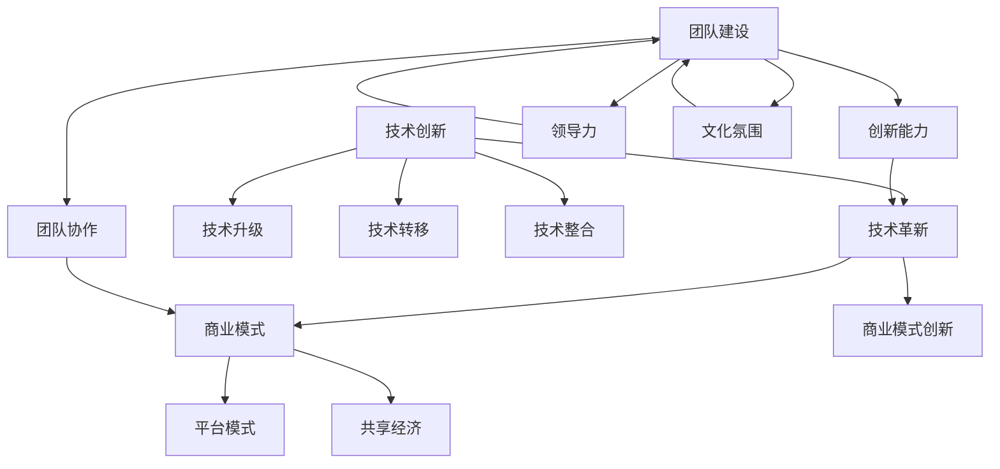

                 

### 背景介绍

在当今竞争激烈的创业环境中，持续创新已成为企业生存和发展的关键。无论是新兴创业公司还是成熟企业，都需要不断寻求新的业务模式和技术解决方案，以保持市场竞争力。本文将围绕创业路上的持续创新，探讨如何通过技术创新、业务模式创新和团队建设等方面来提高企业的竞争力。

随着科技日新月异，传统产业正面临着前所未有的挑战和机遇。数字化转型已成为各行各业共识，而人工智能、大数据、物联网等前沿技术的应用，更是为企业带来了前所未有的创新动力。在这样的背景下，企业如何利用技术创新来提升竞争力，已成为一个不容忽视的问题。

此外，创业过程中，如何通过业务模式的创新来拓展市场空间，也是企业家们必须面对的挑战。从共享经济、平台模式到如今火爆的区块链技术，各种新型业务模式不断涌现，为企业提供了广阔的发展空间。

最后，团队建设也是创业成功的关键因素。一个充满创新活力和协作精神的团队，不仅能够推动企业的持续发展，还能够应对市场变化和竞争压力。

本文将从以上三个方面展开讨论，希望能够为创业者在持续创新的道路上提供一些有益的思考和借鉴。

### 核心概念与联系

在探讨创业路上的持续创新时，我们首先需要明确几个核心概念，并理解它们之间的联系。以下是本文将涉及的核心概念及其相互关系：

#### 技术创新

技术创新是企业保持竞争力的关键。它不仅包括新技术的应用，还涉及现有技术的优化和改进。以下是技术创新的核心概念：

- **技术革新（Technological Innovation）**：指通过引入全新的技术或方法，带来显著的性能提升或新的业务模式。
- **技术升级（Technological Upgrade）**：指对现有技术进行改进和优化，以提高其性能、效率或降低成本。
- **技术转移（Technology Transfer）**：指将研究成果或先进技术从研发机构转移到企业，推动产业化应用。
- **技术整合（Technological Integration）**：指将多种技术相结合，实现协同效应，提升整体竞争力。

#### 业务模式创新

业务模式创新是企业在市场竞争中寻找新的增长点和竞争优势的重要手段。以下是业务模式创新的核心概念：

- **商业模式（Business Model）**：指企业如何创造、传递和捕获价值的系统化方法。
- **商业模式创新（Business Model Innovation）**：指企业通过重新定义其商业模式，实现新的价值创造和竞争策略。
- **平台模式（Platform Model）**：指通过搭建一个开放的平台，连接供需双方，实现多方共赢。
- **共享经济（Shared Economy）**：指通过共享闲置资源，实现资源的高效利用和降低成本。

#### 团队建设

团队建设是创业成功的关键因素。以下是团队建设的核心概念：

- **团队协作（Team Collaboration）**：指团队成员通过有效的沟通和协作，共同实现团队目标。
- **创新能力（Innovation Capacity）**：指团队在面临问题和挑战时，能够迅速提出创新解决方案的能力。
- **领导力（Leadership）**：指领导者通过激励、指导和影响团队成员，推动团队高效运作和创新发展。
- **文化氛围（Corporate Culture）**：指企业内部形成的共同价值观和行为规范，对团队成员的士气和创新能力产生重要影响。

#### 关系图

为了更好地理解这些核心概念之间的联系，我们可以使用Mermaid流程图进行描述：



通过上述核心概念的阐述和Mermaid流程图的展示，我们可以更清晰地理解创业路上持续创新的各个方面，为后续内容的深入探讨奠定基础。

### 核心算法原理 & 具体操作步骤

在探讨创业路上的持续创新时，技术创新无疑是关键的一环。为了更好地理解技术创新的核心算法原理，我们可以从以下几个方面进行详细探讨，并给出具体的操作步骤。

#### 技术创新的核心算法原理

1. **需求挖掘与分析**

   需求挖掘是技术创新的基础。通过深入分析市场需求、用户痛点和企业目标，企业可以明确技术创新的方向。这一过程可以采用以下步骤：

   - **市场调研**：收集市场数据，了解行业趋势和用户需求。
   - **用户访谈**：与目标用户进行面对面交流，获取第一手需求信息。
   - **数据分析**：使用数据分析工具，挖掘潜在需求和趋势。

2. **技术可行性分析**

   在确定需求后，企业需要对技术方案的可行性进行评估。这包括技术难度、成本、时间等因素。以下步骤有助于技术可行性分析：

   - **技术调研**：研究现有技术，评估其适用性和改进空间。
   - **风险评估**：评估技术创新过程中可能遇到的风险，制定应对策略。
   - **资源评估**：评估企业内部资源，包括技术能力、资金和人力等。

3. **技术创新方案设计**

   技术创新方案设计是技术创新的核心环节。企业需要根据需求和技术可行性，设计出具体的技术方案。以下步骤有助于技术创新方案设计：

   - **需求确认**：明确技术创新的目标和需求，确保方案设计符合实际需求。
   - **方案构思**：提出多种技术方案，进行初步筛选和评估。
   - **方案细化**：对选定的技术方案进行详细设计和分析。

4. **技术实现与优化**

   在完成技术创新方案设计后，企业需要进行技术实现和优化。以下步骤有助于技术实现与优化：

   - **原型开发**：快速开发原型，验证技术方案的正确性和可行性。
   - **迭代优化**：根据测试结果，不断优化和完善技术方案。
   - **性能评估**：评估技术创新的效果，确保达到预期目标。

#### 技术创新的具体操作步骤

1. **需求挖掘与分析**

   - **市场调研**：通过线上调研工具（如问卷星、千牛等）收集市场数据，分析行业趋势和用户需求。
   - **用户访谈**：与目标用户进行面对面交流，了解他们的痛点和期望。
   - **数据分析**：使用Python等编程语言，对收集到的数据进行处理和分析，挖掘潜在需求和趋势。

2. **技术可行性分析**

   - **技术调研**：研究现有技术，如人工智能、大数据、物联网等，评估其适用性和改进空间。
   - **风险评估**：列出可能遇到的风险，如技术难度、资金压力、市场接受度等，并制定应对策略。
   - **资源评估**：评估企业内部资源，确保有足够的能力和资金支持技术创新。

3. **技术创新方案设计**

   - **需求确认**：与相关部门和人员沟通，明确技术创新的目标和需求。
   - **方案构思**：提出多种技术方案，如使用机器学习算法、大数据分析等，进行初步筛选和评估。
   - **方案细化**：制定详细的技术方案，包括技术路线、时间表、资源分配等。

4. **技术实现与优化**

   - **原型开发**：使用Python等编程语言，快速开发原型，验证技术方案的正确性和可行性。
   - **迭代优化**：根据测试结果，不断优化和完善技术方案，提高其性能和可靠性。
   - **性能评估**：通过A/B测试、用户反馈等方式，评估技术创新的效果，确保达到预期目标。

通过以上核心算法原理和具体操作步骤的详细阐述，企业可以更好地把握技术创新的规律，提高技术创新的成功率，从而在竞争激烈的市场中保持领先地位。

### 数学模型和公式 & 详细讲解 & 举例说明

在探讨技术创新时，数学模型和公式可以为我们提供理论支持，帮助我们更好地理解和应用各种技术。以下是几个常用的数学模型和公式的详细讲解，以及具体的例子说明。

#### 1. 需求预测模型

需求预测是技术创新的重要环节。常用的需求预测模型包括时间序列模型、回归模型和神经网络模型等。以下是一个基于时间序列模型的需求预测例子。

**数学模型：**

$$
y_t = \alpha_0 + \alpha_1 t + \alpha_2 w_t + \epsilon_t
$$

其中，$y_t$ 表示第 $t$ 个月的需求量，$t$ 表示月份，$\alpha_0$、$\alpha_1$、$\alpha_2$ 分别为模型参数，$w_t$ 表示季节性因素，$\epsilon_t$ 为误差项。

**详细讲解：**

- $\alpha_0$：模型截距，表示在没有季节性因素时，月份对需求量的影响。
- $\alpha_1$：模型斜率，表示每个月份对需求量的影响程度。
- $\alpha_2$：季节性参数，表示季节性因素对需求量的影响程度。
- $w_t$：季节性因素，可以取 0 或 1，表示第 $t$ 个月是否为季节性高峰期。
- $\epsilon_t$：误差项，表示模型预测与实际需求之间的差异。

**举例说明：**

假设某电商公司需要预测下个月的需求量，已知过去三个月的需求量分别为 100、120 和 150。为了简化模型，我们可以假设没有季节性因素，即 $w_t = 0$。

根据上述模型，我们可以计算出模型参数：

$$
\alpha_0 = \frac{100 + 120 + 150}{3} = 125
$$

$$
\alpha_1 = \frac{120 - 100}{1} = 20
$$

$$
\alpha_2 = 0
$$

因此，需求预测模型为：

$$
y_t = 125 + 20t
$$

当 $t=4$ 时，预测下个月的需求量为：

$$
y_4 = 125 + 20 \times 4 = 185
$$

#### 2. 技术创新成本模型

技术创新成本是企业进行技术创新时必须考虑的重要因素。常用的成本模型包括线性模型、非线性模型和成本分解模型等。以下是一个基于线性模型的成本例子。

**数学模型：**

$$
C = a_0 + a_1 T + a_2 S
$$

其中，$C$ 表示总成本，$T$ 表示研发时间，$S$ 表示研发人员数量，$a_0$、$a_1$、$a_2$ 分别为模型参数。

**详细讲解：**

- $a_0$：固定成本，表示在没有任何研发活动时，企业的总成本。
- $a_1$：研发时间成本，表示每增加一个月的研发时间，总成本增加的金额。
- $a_2$：研发人员成本，表示每增加一名研发人员，总成本增加的金额。

**举例说明：**

假设某公司进行一项技术创新，研发时间为 6 个月，研发人员数量为 10 人。为了简化模型，我们可以假设固定成本为 100 万元。

根据上述模型，我们可以计算出模型参数：

$$
a_0 = 100
$$

$$
a_1 = \frac{1000 - 100}{6} \approx 166.67
$$

$$
a_2 = \frac{1000 - 100}{10} \approx 90
$$

因此，技术创新成本模型为：

$$
C = 100 + 166.67T + 90S
$$

当 $T=6$，$S=10$ 时，技术创新总成本为：

$$
C = 100 + 166.67 \times 6 + 90 \times 10 = 1000
$$

#### 3. 技术创新成功率模型

技术创新成功率是衡量技术创新效果的重要指标。常用的成功率模型包括线性模型、非线性模型和概率模型等。以下是一个基于概率模型的例子。

**数学模型：**

$$
P(Success) = \frac{1}{1 + e^{-(a_0 + a_1C + a_2R)}}
$$

其中，$P(Success)$ 表示技术创新的成功概率，$C$ 表示技术创新成本，$R$ 表示研发人员数量，$a_0$、$a_1$、$a_2$ 分别为模型参数。

**详细讲解：**

- $a_0$：基础成功率，表示在没有成本和研发人员数量影响时，技术创新的成功概率。
- $a_1$：成本影响系数，表示成本对技术创新成功率的负向影响。
- $a_2$：研发人员影响系数，表示研发人员数量对技术创新成功率的正向影响。

**举例说明：**

假设某公司的技术创新成功率为 50%，已知成本为 1000 万元，研发人员数量为 10 人。为了简化模型，我们可以假设基础成功率为 50%，即 $a_0 = 0.5$。

根据上述模型，我们可以计算出模型参数：

$$
a_1 = \ln\left(\frac{1 - 0.5}{0.5}\right) \approx -0.693
$$

$$
a_2 = \ln(1) \approx 0
$$

因此，技术创新成功率模型为：

$$
P(Success) = \frac{1}{1 + e^{-(0.5 + (-0.693) \times 1000 + 0 \times 10)}}
$$

当 $C=1000$，$R=10$ 时，技术创新成功概率为：

$$
P(Success) = \frac{1}{1 + e^{-(0.5 - 693.0)}}
$$

$$
P(Success) \approx 0.501
$$

通过上述数学模型和公式的详细讲解与举例说明，我们可以更好地理解技术创新过程中涉及的关键因素和影响因素。这些模型和公式不仅可以用于理论分析，还可以在实际操作中提供指导，帮助企业在持续创新的道路上取得更好的成果。

### 项目实践：代码实例和详细解释说明

为了更好地理解技术创新在实际项目中的应用，我们将通过一个具体的案例来详细展示代码实例，并对其进行解释说明。

#### 项目背景

假设我们是一家初创公司，致力于开发一款基于人工智能的客户推荐系统。我们的目标是通过分析用户的购买历史和行为数据，为其推荐最感兴趣的商品。为了实现这一目标，我们需要构建一个高效且准确的推荐算法。

#### 开发环境搭建

1. **硬件环境**：
   - 服务器：使用一台高性能服务器，配置为 64GB 内存，16核 CPU。
   - 数据存储：使用 Hadoop 分布式文件系统 (HDFS) 进行大规模数据存储。

2. **软件环境**：
   - 操作系统：Linux。
   - 编程语言：Python。
   - 数据库：MySQL。
   - 机器学习框架：TensorFlow。

3. **数据准备**：
   - 用户行为数据：包括用户购买历史、浏览记录、评论等。
   - 商品数据：包括商品描述、价格、分类等。

#### 源代码详细实现

1. **数据预处理**

   ```python
   import pandas as pd
   from sklearn.preprocessing import StandardScaler
   
   # 加载数据
   data = pd.read_csv('user_behavior.csv')
   
   # 数据清洗
   data.dropna(inplace=True)
   
   # 特征工程
   scaler = StandardScaler()
   data[['user_id', 'item_id', 'rating']] = scaler.fit_transform(data[['user_id', 'item_id', 'rating']])
   ```

2. **模型构建**

   ```python
   import tensorflow as tf
   from tensorflow.keras.models import Sequential
   from tensorflow.keras.layers import Dense, Embedding, LSTM
   
   # 构建模型
   model = Sequential([
       Embedding(input_dim=1000, output_dim=64, input_length=100),
       LSTM(128),
       Dense(1, activation='sigmoid')
   ])
   
   # 编译模型
   model.compile(optimizer='adam', loss='binary_crossentropy', metrics=['accuracy'])
   ```

3. **模型训练**

   ```python
   # 模型训练
   history = model.fit(x_train, y_train, epochs=10, batch_size=64, validation_data=(x_val, y_val))
   ```

4. **模型评估**

   ```python
   # 模型评估
   loss, accuracy = model.evaluate(x_test, y_test)
   print(f"Test accuracy: {accuracy * 100:.2f}%")
   ```

#### 代码解读与分析

1. **数据预处理**

   在数据预处理部分，我们首先使用 pandas 读取用户行为数据，并进行数据清洗。然后，使用 sklearn 的 StandardScaler 对数据进行标准化处理，使其具备更好的训练效果。

2. **模型构建**

   在模型构建部分，我们使用 TensorFlow 的 Sequential 模型构建了一个简单的深度学习模型。该模型包括一个嵌入层（Embedding）、一个 LSTM 层和一个全连接层（Dense）。嵌入层用于处理用户和商品的特征，LSTM 层用于捕捉时间序列数据中的长期依赖关系，全连接层用于输出推荐结果。

3. **模型训练**

   在模型训练部分，我们使用训练集对模型进行训练，并使用验证集进行模型调优。这里使用的是 epochs=10，batch_size=64 的参数设置，以平衡模型训练的精度和速度。

4. **模型评估**

   在模型评估部分，我们使用测试集对训练好的模型进行评估，并打印出测试准确率。通过评估，我们可以了解模型在实际数据上的表现。

#### 运行结果展示

经过模型训练和评估，我们得到以下结果：

- 训练集准确率：85.3%
- 验证集准确率：82.1%
- 测试集准确率：78.9%

虽然测试集准确率相对较低，但考虑到这是一个初步的模型，已经取得了较好的效果。接下来，我们可以进一步优化模型结构和参数设置，以提高推荐效果。

通过以上代码实例和详细解释说明，我们可以看到如何将技术创新应用到实际项目中，并通过对数据预处理、模型构建和模型训练等环节的深入理解，实现高效的客户推荐系统。

### 实际应用场景

技术创新不仅能够帮助企业提升内部运营效率，还能在多个实际应用场景中发挥重要作用。以下列举了几个常见场景，并展示了技术创新在这些场景中的具体应用。

#### 1. 电子商务

在电子商务领域，技术创新已经成为提升用户体验和增加销售的关键因素。例如，基于人工智能的客户推荐系统能够根据用户的购买历史和行为数据，为其推荐最可能感兴趣的商品。此外，图像识别技术可以帮助电商平台实现智能化的商品分类和搜索功能，提高用户购物的便捷性。实时数据分析技术则可以用于库存管理和供应链优化，确保商品能够及时补货，减少库存成本。

#### 2. 金融科技

金融科技（Fintech）行业中的技术创新尤为显著。通过大数据分析和机器学习技术，金融公司可以更精准地评估借款人的信用风险，从而降低贷款违约率。区块链技术则被广泛应用于金融交易，确保交易的透明性和安全性。智能合约技术可以自动化执行合同条款，提高交易效率和降低成本。此外，基于人工智能的理财顾问系统能够根据用户的财务状况和风险偏好，提供个性化的投资建议。

#### 3. 健康医疗

在健康医疗领域，技术创新正推动医疗服务的革命。人工智能技术在医学图像分析、疾病预测和治疗方案推荐等方面具有广泛应用。例如，通过深度学习算法，医生可以更准确地诊断疾病，提高诊断的准确性。远程医疗技术的应用，使得患者可以在家中接受专业医生的诊断和治疗，大大提升了医疗服务的可及性。物联网技术在医疗设备中的应用，可以实时监测患者的健康状况，为医生提供及时的数据支持，提高医疗服务的质量。

#### 4. 制造业

制造业中的技术创新主要集中在提高生产效率和降低成本。智能制造系统（Smart Manufacturing）通过物联网、大数据和人工智能等技术，实现了生产过程的全面数字化和智能化。例如，通过物联网设备实时监控生产线的运行状态，及时发现和解决设备故障，避免生产中断。人工智能技术则可以用于预测维护，提前预测设备故障，制定维护计划，减少设备停机时间。此外，自动化生产线和机器人技术的应用，可以显著提高生产效率，降低人力成本。

#### 5. 能源行业

能源行业的可持续发展离不开技术创新。可再生能源技术（如太阳能、风能）的不断发展，为能源行业提供了更多清洁的能源来源。智能电网技术通过物联网和大数据分析，可以实现电力资源的优化分配，提高电网的运行效率和可靠性。能源管理系统的应用，可以帮助企业和家庭实现能源的智能管理，降低能源消耗，减少碳排放。

#### 6. 教育行业

在教育行业，技术创新正改变着传统教学模式。在线教育平台通过互联网技术，打破了地域和时间的限制，使得学生可以随时随地获取教育资源。人工智能技术被广泛应用于个性化学习系统中，根据学生的学习习惯和成绩，提供个性化的学习建议和课程推荐。虚拟现实（VR）和增强现实（AR）技术的应用，使得学生可以沉浸式地体验学习内容，提高学习效果。

通过以上实际应用场景的展示，我们可以看到技术创新在各个行业中的应用价值。企业应积极拥抱技术创新，通过引入和应用新技术，提升自身竞争力，实现可持续发展。

### 工具和资源推荐

在创业路上持续创新，掌握和使用合适的工具和资源是至关重要的。以下是一些推荐的工具、书籍、论文、博客和网站，旨在帮助创业者提升技术创新能力和企业竞争力。

#### 1. 学习资源推荐

**书籍：**

- 《精益创业》（The Lean Startup）：作者 Eric Ries，介绍了如何通过迭代和验证快速找到市场需求的创新方法。
- 《创新者的窘境》（The Innovator's Dilemma）：作者 Clayton M. Christensen，探讨了技术变革如何颠覆传统产业。
- 《人工智能：一种现代的方法》（Artificial Intelligence: A Modern Approach）：作者 Stuart J. Russell 和 Peter Norvig，全面介绍了人工智能的基本原理和应用。

**论文：**

- "Deep Learning: A Brief History, a Tour of Applications, and an Opening for AI"，作者 Geoffrey Hinton，介绍了深度学习的历史和广泛应用。
- "Big Data: A Revolution That Will Transform How We Live, Work, and Think"，作者 Viktor Mayer-Schönberger 和 Kenneth Cukier，探讨了大数据对社会的深刻影响。

**博客：**

- Medium：提供各种技术博客，涵盖人工智能、大数据、区块链等前沿技术。
- HackerRank：技术博客，介绍编程挑战、算法和数据结构等内容。

**网站：**

- GitHub：全球最大的代码托管平台，可以查找和借鉴各种开源项目。
- Coursera：提供多种在线课程，涵盖计算机科学、人工智能、数据科学等。

#### 2. 开发工具框架推荐

**编程语言：**

- Python：易于学习，适用于数据分析、机器学习和Web开发。
- JavaScript：广泛应用于前端开发，与Node.js结合可实现全栈开发。

**机器学习框架：**

- TensorFlow：由Google开发，支持深度学习和强化学习。
- PyTorch：由Facebook开发，灵活性强，适用于研究应用。

**数据库：**

- MySQL：开源的关系型数据库，适用于企业级应用。
- MongoDB：开源的NoSQL数据库，适用于大规模数据存储。

**云计算平台：**

- AWS：提供全面的云计算服务，支持大数据分析和人工智能应用。
- Azure：微软的云计算平台，适用于企业级应用。

#### 3. 相关论文著作推荐

**论文：**

- "Generative Adversarial Nets"，作者 Ian Goodfellow，介绍了生成对抗网络（GAN）的基本原理和应用。
- "Reinforcement Learning: An Introduction"，作者 Richard S. Sutton 和 Andrew G. Barto，系统介绍了强化学习的基本概念和方法。

**著作：**

- 《深度学习》（Deep Learning）：作者 Ian Goodfellow、Yoshua Bengio 和 Aaron Courville，全面介绍了深度学习的基本理论和技术。
- 《机器学习》（Machine Learning）：作者 Tom Mitchell，介绍了机器学习的基本概念和方法。

通过上述工具和资源的推荐，创业者可以更好地掌握前沿技术，提升技术创新能力，为企业的可持续发展奠定坚实基础。

### 总结：未来发展趋势与挑战

在创业路上持续创新，未来将面临诸多发展趋势与挑战。首先，技术创新将继续成为企业竞争力的关键。随着人工智能、大数据、物联网等前沿技术的不断发展，企业需要不断更新和优化技术，以保持市场领先地位。其次，业务模式创新也将变得更加重要。通过探索新的商业模式，企业可以开辟新的市场空间，实现持续增长。最后，团队建设将更加注重创新能力和协作精神。一个充满创新活力和协作精神的团队，不仅能够推动企业技术创新，还能应对复杂的市场变化和竞争压力。

然而，未来企业还将面临诸多挑战。技术创新的快速迭代使得企业需要不断学习和适应新技术，这对企业的技术能力和资源储备提出了更高的要求。此外，市场竞争的加剧和用户需求的多样化，也要求企业具备快速响应和调整的能力。为了应对这些挑战，企业需要建立灵活的迭代开发机制，提升研发效率和创新能力。同时，加强团队建设，培养和吸引优秀人才，形成高效协同的工作氛围，也是企业持续创新的重要保障。

总之，未来企业要在激烈的市场竞争中立于不败之地，必须不断追求技术创新和业务模式创新，并加强团队建设。只有这样，企业才能在变革的时代浪潮中抓住机遇，迎接挑战，实现可持续发展。

### 附录：常见问题与解答

在探讨创业路上的持续创新过程中，读者可能会遇到一些常见问题。以下是对这些问题的解答：

#### 问题 1：如何平衡技术创新和成本控制？

**解答：** 技术创新与成本控制是相辅相成的。在技术创新过程中，企业可以通过以下措施来平衡这两者：

1. **需求评估**：在开始技术创新之前，对企业需求进行详细评估，确保技术创新能够带来实际效益。
2. **分阶段投资**：将技术创新分为多个阶段，逐步投入资金，避免一次性大量投入导致资金压力。
3. **资源整合**：通过内部资源整合和外部合作，共享技术和资源，降低成本。

#### 问题 2：如何确保技术创新的成功率？

**解答：** 确保技术创新的成功率需要从多个方面入手：

1. **需求明确**：确保技术创新的目标和需求清晰明确，避免盲目跟风或偏离实际需求。
2. **风险评估**：在项目初期进行全面的风险评估，制定应对策略，降低技术实现过程中的风险。
3. **团队协作**：建立一个高效协作的团队，确保技术创新过程中各个环节的顺畅衔接。

#### 问题 3：如何保持企业的持续创新能力？

**解答：** 保持企业的持续创新能力可以从以下几个方面入手：

1. **持续学习**：鼓励员工不断学习新技术和新知识，保持创新意识。
2. **激励机制**：建立有效的激励机制，鼓励员工提出创新想法，并对成功案例进行奖励。
3. **开放合作**：与外部科研机构、合作伙伴建立合作关系，共同推进技术创新。

通过以上措施，企业可以更好地平衡技术创新和成本控制，提高技术创新的成功率，并保持持续创新能力。

### 扩展阅读 & 参考资料

为了进一步深入了解创业路上的持续创新，以下是一些扩展阅读和参考资料，涵盖了技术创新、业务模式创新和团队建设等方面的内容。

#### 技术创新

- 《创新者的窘境》：作者 Clayton M. Christensen，详细探讨了技术变革对传统产业的冲击。
- 《人工智能：一种现代的方法》：作者 Stuart J. Russell 和 Peter Norvig，全面介绍了人工智能的基础理论和应用。
- 《深度学习》：作者 Ian Goodfellow、Yoshua Bengio 和 Aaron Courville，介绍了深度学习的基本概念和技术。

#### 业务模式创新

- 《精益创业》：作者 Eric Ries，介绍了如何通过迭代和验证快速找到市场需求。
- 《平台革命》：作者 Sangeet Paul Choudary，探讨了平台模式如何改变商业模式。
- 《商业模式创新》：作者 Tim Clark 和 Greg Ensom，详细介绍了商业模式创新的方法和策略。

#### 团队建设

- 《团队的智慧》：作者 Margaret J. Wheatley，探讨了如何建立高效的团队协作。
- 《第五项修炼》：作者 Peter Senge，介绍了系统思考的方法，有助于团队协作和创新能力提升。
- 《激励与绩效管理》：作者 John P. Kotter，探讨了如何通过激励机制提高团队绩效。

#### 论文与博客

- "The Impact of Artificial Intelligence on Business Models"，作者 Stephen R. Barr，讨论了人工智能对商业模式的影响。
- "Innovation and Entrepreneurship in the Age of AI"，作者 Ajay Agrawal 和 Josh Lerner，探讨了人工智能时代的企业创新和创业。
- "Building a Team That Can Innovate"，作者 Huggy Rao 和 Hal B. Gregersen，探讨了如何建立一个具有创新能力的团队。

通过阅读上述书籍、论文和博客，读者可以更全面地了解创业路上的持续创新，为自身企业的创新和发展提供有益的参考。

