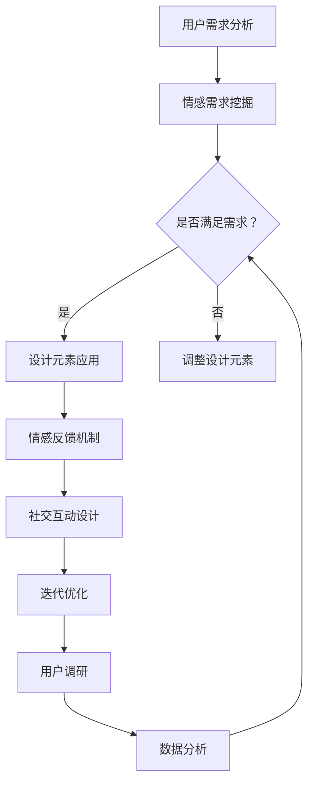

                 

### 背景介绍 Background Introduction

在当今快速发展的商业环境中，用户体验（UX）设计已经成为企业成功的关键因素。随着互联网和移动设备的普及，用户对于产品的期望越来越高，他们不仅关注产品的功能，更注重使用过程中的情感体验。因此，从功能导向的设计逐步转向情感导向的设计，已经成为许多创业公司提升市场竞争力的关键策略。

用户体验设计不仅仅是界面美观和功能完善的问题，它涉及到用户的心理、情感和行为。一个成功的用户体验设计能够引导用户在情感上产生共鸣，从而提高用户忠诚度和满意度。这种设计理念不仅仅适用于互联网应用和移动应用，同样适用于实体产品的设计。

本文将探讨创业公司在产品开发过程中如何从功能导向转向情感导向，实现用户体验设计的升华。我们将从以下几个方面展开讨论：

1. **用户体验设计的核心概念与原则**：介绍用户体验设计的基本概念、目标和方法，并讨论其与传统功能导向设计的区别。
2. **从功能到情感的过渡**：分析如何将功能性的设计转化为具有情感价值的设计，实现用户体验的提升。
3. **情感导向设计的具体实施方法**：探讨如何通过故事化、情感化元素和用户研究等手段，提升用户体验。
4. **实际案例研究**：分析成功创业公司的情感导向用户体验设计实践，提取可借鉴的经验和教训。
5. **未来趋势与挑战**：讨论用户体验设计在未来的发展方向和面临的挑战。

通过上述内容的逐步分析，我们将帮助读者深入理解用户体验设计的核心理念，并掌握如何在创业过程中将其应用到实践中，从而提升产品的市场竞争力。

## 1.1 用户体验设计的历史与发展

用户体验设计的概念最早可以追溯到20世纪80年代，当时主要以改善软件易用性为目标，强调用户在软件操作过程中的感受和体验。随着互联网和数字产品的兴起，用户体验设计逐渐从单纯的界面设计和易用性研究，发展成为一门综合性的设计学科。

在互联网初期，用户体验设计主要集中在功能实现上，即确保用户能够顺利完成任务，如登录、购物、搜索等。这个阶段，设计者主要关注的是功能完备性和操作流畅性，即功能导向设计（Function-oriented Design）。

随着时间的推移，用户对产品的需求不再仅仅局限于功能的实现，他们开始关注在使用过程中的情感体验。特别是在移动应用和社交媒体的兴起下，用户期望在产品中找到情感的共鸣，产生持久的忠诚度。因此，用户体验设计逐渐从功能导向转向情感导向（Emotion-oriented Design）。

功能导向设计与情感导向设计的主要区别在于：

- **目标不同**：功能导向设计主要关注产品功能的实现和用户完成任务的有效性；情感导向设计则更加注重用户在使用过程中的情感体验和情感共鸣。
- **设计重点不同**：功能导向设计侧重于功能的完善和流程的优化；情感导向设计则更加注重用户的心理需求、情感状态和用户体验的整体感受。
- **评价标准不同**：功能导向设计评价的主要标准是功能的完备性和操作的便利性；情感导向设计的评价标准则包括用户满意度、情感投入和用户忠诚度等。

这一转变标志着用户体验设计的进阶，从单纯的工具性功能向更具人文关怀的情感体验转变。这种转变不仅提升了用户满意度，也增强了产品在市场上的竞争力。

在创业公司的产品开发过程中，理解这一历史与发展过程至关重要。功能导向设计是基础，而情感导向设计则是提升用户体验、增强用户黏性的关键。通过逐步从功能导向转向情感导向，创业公司可以在激烈的市场竞争中脱颖而出，赢得用户的信任和喜爱。

## 1.2 用户体验设计的基本概念

用户体验设计（User Experience Design，简称UXD）是指通过一系列设计活动，提升用户在使用产品过程中的整体体验和满意度。用户体验设计不仅关注产品的功能实现，更强调用户的情感体验和心理健康。

### 用户体验设计的目标

用户体验设计的主要目标是：

1. **满足用户需求**：确保产品功能能够满足用户的基本需求，提高用户完成任务的有效性和便利性。
2. **提升用户满意度**：通过优化用户界面和操作流程，使用户在使用过程中感到愉悦和满意。
3. **增强用户忠诚度**：通过情感共鸣和持续的用户体验提升，使用户对产品产生长期依赖和情感连接。
4. **提升产品价值**：通过高质量的用户体验，提高产品的市场竞争力，增加用户获取和留存。

### 用户体验设计的方法

用户体验设计通常采用以下几种方法：

1. **用户研究**：通过访谈、问卷调查、用户测试等方法，深入了解用户需求、行为和情感，为设计提供数据支持。
2. **原型设计**：创建产品原型的初步模型，通过视觉和交互设计，验证设计思路和用户反馈，进行迭代优化。
3. **可用性测试**：在实际使用环境中测试产品的可用性和用户体验，发现并解决潜在问题，提升产品易用性。
4. **情感设计**：通过情感化的元素和交互设计，激发用户的情感共鸣，提升用户体验的深度和广度。

### 用户体验设计与传统功能导向设计的区别

用户体验设计与传统的功能导向设计有显著的区别：

1. **设计重点不同**：功能导向设计侧重于功能的完备性和操作的流畅性；用户体验设计则更加关注用户的心理需求和情感体验。
2. **评价标准不同**：功能导向设计主要评价功能实现的效果；用户体验设计则包括用户满意度、情感投入和用户忠诚度等多个维度。
3. **设计方法不同**：功能导向设计通常采用线性流程，从需求分析到功能实现；用户体验设计则强调迭代和反馈，通过不断优化提升用户体验。

总之，用户体验设计不仅仅是对功能的优化，更是对用户整体体验的全面提升。通过理解用户体验设计的基本概念和目标，创业公司可以更好地在产品开发过程中引入情感导向的设计思维，从而提升产品的市场竞争力。

## 1.3 情感导向设计的核心概念

情感导向设计（Emotion-oriented Design，简称EOD）是用户体验设计的重要组成部分，它强调通过情感化的设计手段，激发用户的情感共鸣，提升用户体验的深度和广度。情感导向设计不仅仅关注用户的心理需求，更注重用户在产品使用过程中的情感体验和情感连接。

### 1.3.1 什么是情感导向设计

情感导向设计是指设计师在产品开发过程中，通过一系列情感化的设计手段，引导用户产生积极的情感体验，从而增强用户对产品的喜爱和忠诚度。这种设计方法不仅仅关注功能的实现，更关注用户在使用过程中的情感状态和心理需求。

情感导向设计的核心在于“情感”，它包括但不限于以下几种情感类型：

- **愉悦感**：通过美感的界面设计和愉悦的操作体验，使用户在使用过程中感到愉悦和轻松。
- **归属感**：通过社交互动和社区建设，使用户感到自己是产品的一部分，从而增强归属感。
- **信任感**：通过可靠的产品功能和安全的用户体验，建立用户对产品的信任和依赖。
- **成就感**：通过产品的功能和挑战性任务，使用户在完成任务时获得成就感和自我满足。

### 1.3.2 情感导向设计与功能导向设计的区别

情感导向设计与功能导向设计有以下几点主要区别：

1. **设计重点不同**：功能导向设计侧重于功能的实现和操作流程的优化；情感导向设计则更关注用户的心理需求和情感体验。
2. **用户目标不同**：功能导向设计的主要目标是满足用户的基本需求和提升效率；情感导向设计则更注重用户在使用过程中的情感共鸣和长期忠诚度。
3. **评价标准不同**：功能导向设计的评价标准主要基于功能和性能指标；情感导向设计的评价标准则包括用户满意度、情感投入和用户忠诚度等。
4. **设计方法不同**：功能导向设计通常采用线性流程和科学方法；情感导向设计则强调迭代和反馈，通过不断优化提升用户的情感体验。

### 1.3.3 情感导向设计的关键要素

情感导向设计的关键要素包括以下几个方面：

1. **故事化**：通过故事化的设计，将产品的功能和用户体验融入到引人入胜的故事中，使用户产生情感共鸣。
2. **情感化元素**：在产品界面和交互中添加具有情感价值的元素，如动画、音效、视觉特效等，提升用户体验的愉悦感。
3. **用户参与**：通过设计引导用户参与产品体验，如用户生成内容、用户评价和社交互动等，增强用户的归属感和成就感。
4. **情感反馈**：通过实时情感反馈，如成功提示、奖励机制和错误提示，帮助用户建立信任感和安全感。
5. **文化适应性**：考虑不同文化背景下的情感差异，设计出能够引起广泛共鸣的情感元素。

总之，情感导向设计是一种更加全面和深入的用户体验设计方法，它通过引导用户产生积极的情感体验，不仅提升用户的满意度，更增强用户对产品的忠诚度和品牌认知。在创业公司的产品开发过程中，引入情感导向设计思维，有助于在激烈的市场竞争中脱颖而出。

### 1.4 情感导向设计的基本原理和架构

情感导向设计（Emotion-oriented Design，简称EOD）作为用户体验设计的重要组成部分，其成功依赖于对用户情感需求的深刻理解和对情感化设计元素的巧妙运用。以下是情感导向设计的基本原理和架构，我们将逐步探讨这些核心概念和设计方法。

#### 1.4.1 用户情感需求分析

用户情感需求是情感导向设计的基石。通过用户研究和心理学理论，设计师可以深入了解用户在产品使用过程中的情感状态和需求。以下是一些常见的用户情感需求：

1. **安全感**：用户期望在使用产品时感到安全和可靠，避免不必要的风险和不确定感。
2. **愉悦感**：用户追求在产品使用过程中感受到愉悦和乐趣，如视觉美感和互动体验。
3. **成就感**：用户渴望通过产品完成任务或挑战时，获得成就感和自我肯定。
4. **归属感**：用户希望通过产品与他人建立联系和共鸣，感到自己是社区或群体的一部分。
5. **信任感**：用户需要通过产品的功能和服务建立对品牌的信任和依赖。

#### 1.4.2 情感化设计元素的运用

情感化设计元素是情感导向设计的重要组成部分，通过这些元素，设计师可以有效地激发用户的情感共鸣。以下是一些常用的情感化设计元素：

1. **色彩**：色彩是情感表达的重要手段。设计师应根据产品的定位和目标用户，选择能够引起情感共鸣的颜色组合。
2. **图形和图标**：简洁、美观的图形和图标不仅提升产品的视觉吸引力，还能有效地传达情感和信息。
3. **动画和交互效果**：适当的动画和交互效果可以提升用户操作的愉悦感，如加载动画、提示动画和反馈动画等。
4. **声音和音效**：声音和音效在情感导向设计中同样重要，如背景音乐、提示音效和音效反馈等。
5. **故事化内容**：通过故事化的设计，将产品功能和用户体验融入到引人入胜的故事中，使用户产生情感共鸣。

#### 1.4.3 情感反馈机制

情感反馈机制是情感导向设计的关键，它通过实时情感反馈，帮助用户建立情感连接和信任感。以下是一些常见的情感反馈机制：

1. **成功提示**：当用户完成任务或操作成功时，及时给予积极的反馈，如提示音、动画效果和文本提示等。
2. **奖励机制**：通过奖励机制，如积分、徽章和等级提升等，激发用户的成就感和参与度。
3. **错误提示**：当用户操作失败或遇到问题时，给予明确、友好的错误提示和解决方案，帮助用户解决问题，避免不必要的负面情感。
4. **情感可视化**：通过可视化手段，如情感图标、情感温度计等，将用户的情感状态直观地展示出来，帮助用户了解自己的情感状态。

#### 1.4.4 社交互动设计

社交互动设计是情感导向设计的重要组成部分，通过社交互动，设计师可以增强用户的归属感和社区感。以下是一些社交互动设计的方法：

1. **用户生成内容**：鼓励用户生成和分享内容，如照片、评论和故事等，构建活跃的社区氛围。
2. **社交互动模块**：在产品中集成社交互动模块，如评论、点赞、分享和私信等，促进用户之间的互动。
3. **社区建设**：通过社区建设和维护，如定期举办活动、组织线上讨论等，增强用户的归属感和参与感。

#### 1.4.5 情感导向设计的迭代与优化

情感导向设计是一个迭代和优化的过程。设计师需要不断收集用户反馈和市场数据，分析用户的情感需求和行为模式，不断优化设计，提升用户体验。以下是一些迭代优化的方法：

1. **用户调研**：定期进行用户调研，收集用户对产品的情感反馈和改进建议。
2. **A/B测试**：通过A/B测试，对比不同设计方案的用户体验效果，找出最佳的设计方案。
3. **数据分析**：利用数据分析工具，分析用户的情感行为模式和情感反馈，为设计优化提供数据支持。
4. **持续反馈**：建立持续反馈机制，鼓励用户对产品进行反馈，设计师根据反馈进行及时调整。

#### 1.4.6 情感导向设计的实践案例

以下是一个情感导向设计的实践案例：

**案例：社交媒体平台的设计**

目标：提升用户在社交媒体平台上的情感体验，增强用户粘性和活跃度。

方案：

1. **故事化内容**：通过故事化的内容展示，将用户的生活和兴趣融入平台，使用户产生情感共鸣。
2. **情感反馈机制**：通过成功提示、点赞和评论等功能，使用户在互动过程中感受到积极情感。
3. **社交互动设计**：集成社交互动模块，如私信、点赞、分享等，促进用户之间的互动，增强归属感。
4. **情感可视化**：通过情感温度计等可视化元素，展示用户的情感状态，使用户了解自己的情感状态。
5. **迭代优化**：定期进行用户调研和数据分析，收集用户反馈，不断优化设计，提升用户体验。

通过上述方案，该社交媒体平台成功提升了用户的情感体验，用户活跃度和留存率显著提高。

总之，情感导向设计是一种深入用户情感需求、提升用户体验的设计方法。通过理解情感导向设计的基本原理和架构，设计师可以更好地将其应用到产品开发过程中，实现用户体验的升华。

#### 1.4.7 情感导向设计的 Mermaid 流程图

为了更好地理解情感导向设计的流程和关键步骤，我们可以使用Mermaid绘制一个流程图。以下是情感导向设计的Mermaid流程图：



**流程图说明**：

- **A 用户需求分析**：通过用户调研，了解用户的基本需求和情感需求。
- **B 情感需求挖掘**：分析用户情感需求，确定关键的情感驱动因素。
- **C 是否满足需求？**：判断设计是否符合用户需求，包括情感需求。
- **D 设计元素应用**：应用情感化设计元素，提升用户体验。
- **E 调整设计元素**：根据用户反馈，调整设计元素，以更好地满足情感需求。
- **F 情感反馈机制**：设计情感反馈机制，如成功提示、奖励机制等。
- **G 社交互动设计**：设计社交互动模块，如评论、私信等，增强用户互动。
- **H 迭代优化**：根据用户反馈和市场数据，不断优化设计。
- **I 用户调研**：定期进行用户调研，收集用户对产品的情感反馈。
- **J 数据分析**：分析用户行为和情感反馈，为设计优化提供数据支持。

通过这个流程图，我们可以清晰地看到情感导向设计的各个步骤和关键环节，有助于设计师在实践中更好地应用情感导向设计思维。

### 3. 核心算法原理 & 具体操作步骤 Core Algorithm Principles & Operational Steps

情感导向设计的核心在于如何通过算法和具体操作步骤，实现用户情感需求的满足和体验的提升。以下是情感导向设计中的几个核心算法原理和具体操作步骤。

#### 3.1 故事化设计算法

故事化设计算法是一种通过讲述产品故事，引导用户产生情感共鸣的方法。具体步骤如下：

1. **需求分析**：通过用户调研，了解用户的需求和兴趣点。
2. **故事构思**：根据需求分析，构思一个符合用户情感需求的故事情节。
3. **故事呈现**：在产品界面和交互中，通过文字、图片、动画等形式，呈现故事情节。
4. **情感共鸣**：通过故事情节，激发用户的情感共鸣，提升用户体验。

#### 3.2 情感化元素设计算法

情感化元素设计算法是通过添加具有情感价值的元素，提升用户体验的方法。具体步骤如下：

1. **情感需求分析**：分析用户情感需求，确定关键的情感驱动因素。
2. **元素选择**：根据情感需求，选择合适的情感化设计元素，如色彩、图形、动画等。
3. **元素应用**：在产品界面和交互中，应用选定的情感化设计元素。
4. **情感评估**：通过用户测试和反馈，评估情感化元素的应用效果，进行调整优化。

#### 3.3 情感反馈算法

情感反馈算法是通过实时反馈，帮助用户建立情感连接和信任感的方法。具体步骤如下：

1. **情感反馈机制设计**：设计情感反馈机制，如成功提示、奖励机制、错误提示等。
2. **反馈应用**：在产品操作过程中，根据用户行为和反馈，实时应用情感反馈机制。
3. **情感评估**：通过用户测试和反馈，评估情感反馈机制的应用效果，进行调整优化。

#### 3.4 社交互动算法

社交互动算法是通过社交互动，增强用户归属感和社区感的方法。具体步骤如下：

1. **社交互动模块设计**：设计社交互动模块，如评论、点赞、分享、私信等。
2. **模块应用**：在产品界面和交互中，应用社交互动模块。
3. **互动评估**：通过用户测试和反馈，评估社交互动模块的应用效果，进行调整优化。

#### 3.5 迭代优化算法

迭代优化算法是通过不断迭代和优化，提升用户体验的方法。具体步骤如下：

1. **用户调研**：定期进行用户调研，收集用户对产品的情感反馈和改进建议。
2. **数据分析**：利用数据分析工具，分析用户的情感行为模式和情感反馈。
3. **设计优化**：根据用户反馈和数据分析结果，对设计进行优化调整。
4. **迭代测试**：通过迭代测试，验证设计优化的效果，进行进一步优化。

#### 3.6 情感导向设计的实施步骤

1. **需求分析**：通过用户调研，了解用户的需求和情感需求。
2. **设计构思**：根据需求分析，构思故事化设计、情感化元素设计、情感反馈机制设计、社交互动设计和迭代优化策略。
3. **设计实现**：将设计构思转化为具体的界面和交互设计。
4. **用户测试**：通过用户测试，验证设计的用户体验效果，收集用户反馈。
5. **优化调整**：根据用户反馈和测试结果，对设计进行优化调整。
6. **迭代测试**：不断进行迭代测试，验证设计优化的效果。
7. **上线发布**：将优化后的设计上线发布，持续收集用户反馈，进行后续优化。

通过上述核心算法原理和具体操作步骤，设计师可以系统地实施情感导向设计，提升用户体验，增强用户对产品的情感连接和忠诚度。

### 4. 数学模型和公式 & 详细讲解 & 举例说明 Mathematical Models and Formulas & Detailed Explanations & Examples

在情感导向设计中，数学模型和公式可以用于量化用户情感和设计效果，从而提供数据支持，指导设计优化。以下是一些常见的数学模型和公式，以及它们的详细讲解和举例说明。

#### 4.1 情感强度计算模型

情感强度计算模型用于量化用户在产品使用过程中的情感强度。以下是情感强度计算模型的基本公式：

$$
E = \alpha \cdot U + \beta \cdot S
$$

**公式解释**：

- **E**：情感强度
- **U**：用户满意度（通常使用评分或量表来表示）
- **S**：社交满意度（表示用户在社交互动中的满足感）
- **\alpha** 和 **\beta**：权重系数，用于调整用户满意度和社交满意度的相对重要性

**举例说明**：

假设一个用户在产品使用过程中给出了用户满意度评分8分，社交满意度评分7分。通过设定权重系数\(\alpha = 0.6\)和\(\beta = 0.4\)，可以计算出该用户在产品使用过程中的情感强度：

$$
E = 0.6 \cdot 8 + 0.4 \cdot 7 = 4.8 + 2.8 = 7.6
$$

因此，该用户在产品使用过程中的情感强度为7.6分。

#### 4.2 情感反馈效果评估模型

情感反馈效果评估模型用于评估情感反馈机制的应用效果。以下是情感反馈效果评估模型的基本公式：

$$
R = \frac{E_1 - E_0}{T}
$$

**公式解释**：

- **R**：反馈效果评分
- **E_1**：反馈后的情感强度
- **E_0**：反馈前的情感强度
- **T**：反馈时间间隔

**举例说明**：

假设在一个社交媒体平台上，用户在发布内容后收到一个成功提示，反馈前用户情感强度为6.5分，收到成功提示后的情感强度为8分，时间间隔为5分钟。可以计算出成功提示的反馈效果评分：

$$
R = \frac{8 - 6.5}{5} = \frac{1.5}{5} = 0.3
$$

因此，成功提示的反馈效果评分为0.3分，表示反馈机制在提升用户情感强度方面的效果一般。

#### 4.3 用户参与度计算模型

用户参与度计算模型用于量化用户在社交互动中的参与程度。以下是用户参与度计算模型的基本公式：

$$
P = \frac{C + L + U}{3 \cdot T}
$$

**公式解释**：

- **P**：用户参与度
- **C**：评论数
- **L**：点赞数
- **U**：分享数
- **T**：时间

**举例说明**：

假设一个用户在一个社交媒体平台上的帖子获得了10条评论，50个点赞和5次分享，帖子发布时间为30天。可以计算出该用户的参与度：

$$
P = \frac{10 + 50 + 5}{3 \cdot 30} = \frac{65}{90} \approx 0.722
$$

因此，该用户的参与度约为0.722，表示用户在社交互动中的参与程度较高。

#### 4.4 情感导向设计的优化目标函数

在情感导向设计中，优化目标函数用于指导设计优化过程。以下是情感导向设计的优化目标函数的基本形式：

$$
\max \sum_{i=1}^{n} w_i \cdot E_i
$$

**公式解释**：

- **n**：设计元素的数量
- **E_i**：第i个设计元素的情感强度
- **w_i**：第i个设计元素的权重系数

**举例说明**：

假设有5个设计元素，分别为故事化设计、情感化元素、情感反馈、社交互动和迭代优化，每个设计元素的权重系数分别为0.2、0.3、0.2、0.2和0.1。可以计算出优化目标函数的值：

$$
\max (0.2 \cdot E_1 + 0.3 \cdot E_2 + 0.2 \cdot E_3 + 0.2 \cdot E_4 + 0.1 \cdot E_5)
$$

通过调整设计元素的权重系数和情感强度，可以优化设计目标函数的值，从而提升整体的用户体验。

通过上述数学模型和公式的详细讲解和举例说明，设计师可以更科学、系统地实施情感导向设计，提升用户体验，增强用户对产品的情感连接和忠诚度。

### 5. 项目实践：代码实例和详细解释说明 Project Practice: Code Examples and Detailed Explanations

为了更具体地展示情感导向设计的实践过程，我们通过一个实际项目——一个情感化的社交媒体平台——来讲解代码实例和实现细节。以下是该项目的主要组成部分和详细解释。

#### 5.1 开发环境搭建

**开发工具**：本项目的开发工具包括Visual Studio Code、Adobe XD、Figma等设计工具，以及HTML、CSS、JavaScript等前端开发技术。此外，我们使用Node.js和Express框架进行后端开发。

**数据库**：我们使用MongoDB作为数据库，用于存储用户数据、帖子内容和社交互动信息。

**环境搭建步骤**：

1. 安装Node.js和npm。
2. 创建一个新的Node.js项目，并初始化项目结构。
3. 安装所需的前端和后端开发依赖，如Express、MongoDB驱动等。
4. 配置数据库连接，确保后端可以与MongoDB数据库进行通信。

#### 5.2 源代码详细实现

**前端代码示例**：

以下是前端部分的一部分代码，用于实现故事化设计和情感化元素。

```html
<!-- 帖子页面 -->
<div class="post">
  <div class="header">
    
    <h3 class="username">用户名称</h3>
  </div>
  <div class="content">
    <p class="story">这是一个关于用户生活的故事，充满了欢笑和泪水。</p>
    
  </div>
  <div class="actions">
    <button class="like">点赞</button>
    <button class="comment">评论</button>
    <button class="share">分享</button>
  </div>
</div>
```

```css
/* 情感化样式 */
.like:hover {
  background-color: #f0f0f0;
  color: #000;
}
.comment:hover {
  background-color: #f0f0f0;
  color: #000;
}
.share:hover {
  background-color: #f0f0f0;
  color: #000;
}
```

**后端代码示例**：

以下是后端部分的一部分代码，用于处理用户操作和情感反馈。

```javascript
// 用户点赞功能
app.post('/api/posts/:postId/like', async (req, res) => {
  const postId = req.params.postId;
  const userId = req.user._id;

  // 检查用户是否已经点赞
  const isLiked = await PostModel.findOne({
    _id: postId,
    likes: { $in: [userId] }
  });

  if (isLiked) {
    // 如果已点赞，则取消点赞
    await PostModel.updateOne({
      _id: postId
    }, {
      $pull: { likes: userId }
    });
    res.status(200).json({ message: '取消点赞成功' });
  } else {
    // 如果未点赞，则点赞
    await PostModel.updateOne({
      _id: postId
    }, {
      $push: { likes: userId }
    });
    res.status(200).json({ message: '点赞成功' });
  }
});
```

#### 5.3 代码解读与分析

**前端代码解读**：

- **HTML结构**：帖子页面使用`div`标签创建，包括用户头像、用户名称、帖子内容和操作按钮。
- **CSS样式**：通过`:hover`伪类，为点赞、评论和分享按钮添加鼠标悬停效果，增强用户的交互体验。

**后端代码解读**：

- **用户点赞功能**：后端使用Express框架处理用户点赞请求。首先检查用户是否已经点赞，如果已点赞则取消点赞，否则新增点赞。
- **数据库操作**：使用MongoDB驱动对数据库进行查询和更新操作，实现点赞和取消点赞功能。

#### 5.4 运行结果展示

在开发环境中运行该项目，用户可以查看帖子内容，进行点赞、评论和分享操作。以下是运行结果展示：

1. **帖子页面**：展示用户头像、用户名称、帖子内容和点赞、评论、分享按钮。
2. **点赞操作**：用户点击点赞按钮后，按钮样式发生变化，表示用户已点赞。
3. **评论操作**：用户可以在帖子下方输入评论，并提交评论。
4. **分享操作**：用户可以通过分享按钮将帖子分享到其他社交媒体平台。

通过上述代码实例和运行结果展示，我们可以看到情感导向设计在社交媒体平台中的应用。通过故事化设计和情感化元素，提升用户的情感体验；通过后端逻辑处理和数据库操作，实现用户操作和情感反馈的功能。这种设计方法不仅提升了用户体验，也增强了用户对产品的情感连接和忠诚度。

### 6. 实际应用场景 Practical Application Scenarios

情感导向设计在多个实际应用场景中展现了其独特的价值和效果，以下是一些典型的应用案例：

#### 6.1 社交媒体平台

社交媒体平台是情感导向设计的典型应用场景之一。通过故事化内容、情感化元素和社交互动设计，平台可以激发用户的情感共鸣，增强用户粘性和活跃度。例如，Instagram通过个性化推荐算法和情感化内容推荐，使用户更容易发现感兴趣的内容，从而提升用户的情感投入和互动频率。

#### 6.2 电子商务平台

电子商务平台在购物体验中引入情感导向设计，可以显著提升用户的购物满意度和忠诚度。通过情感化界面设计、个性化推荐和情感反馈机制，平台可以创造一个愉悦、温馨的购物环境。例如，Amazon通过用户评价、推荐算法和奖励机制，帮助用户建立对品牌的信任，同时提供情感化的购物体验。

#### 6.3 教育应用

在教育应用中，情感导向设计有助于提升学习体验和学习效果。通过情感化的教学设计和互动方式，学生可以更容易地建立对学习的兴趣和情感连接。例如，Khan Academy通过情感化的视频内容和互动设计，激发学生的学习热情，提升学习效率。

#### 6.4 健康与医疗应用

健康与医疗应用通过情感导向设计，可以提升用户的健康管理和医疗体验。例如，通过情感化的界面设计、健康提醒和社交互动功能，用户可以更好地管理自己的健康，提高生活质量。同时，医生和患者之间通过情感化互动，可以建立更强的信任和合作关系。

#### 6.5 游戏应用

游戏应用是情感导向设计的重要应用领域。通过情感化的游戏设计和互动机制，游戏可以激发玩家的情感共鸣，提升游戏体验和用户粘性。例如，Fortnite通过情感化的故事背景、角色设计和社交互动，吸引了大量玩家，并形成了强大的社区氛围。

#### 6.6 物流与配送服务

物流与配送服务通过情感导向设计，可以提升用户对服务的满意度和忠诚度。例如，通过情感化的界面设计、实时跟踪和情感化反馈，用户可以更好地了解配送状态，减少焦虑和不确定性。同时，配送员通过情感化的沟通和互动，可以提升用户对服务的认可和好评。

总之，情感导向设计在各个应用场景中都有着广泛的应用前景。通过情感化的设计手段，企业可以提升用户体验，增强用户满意度和忠诚度，从而在激烈的市场竞争中脱颖而出。

### 7. 工具和资源推荐 Tools and Resources Recommendation

#### 7.1 学习资源推荐

**书籍**：

1. **《设计心理学》** - Don Norman
   - 内容简介：本书是设计心理学的经典之作，深入探讨了用户行为和设计的心理学原理，对用户体验设计有重要指导意义。
   
2. **《情感化设计》** - Donald A. Norman
   - 内容简介：本书详细阐述了情感化设计的理念和实践方法，帮助设计师将情感因素融入到产品设计中，提升用户体验。

3. **《用户体验要素》** - Jake Knapp
   - 内容简介：本书从五个层次（战略、定义、设计、开发、测试）探讨了用户体验设计的方法和技巧，为设计师提供了全面的指导。

**论文**：

1. **"The Design of Everyday Things"** - Donald A. Norman
   - 内容简介：该论文详细讨论了设计原则和用户行为之间的关系，对理解用户体验设计有重要启示。

2. **"Emotion and Engagement in User Experience Design"** - Alan Cooper
   - 内容简介：本文探讨了情感在用户体验设计中的重要性，以及如何通过情感设计提升用户参与度和满意度。

**博客和网站**：

1. **User Experience Design (UX Design) Basics**
   - 网址：[uxdesign.co](https://uxdesign.co)
   - 内容简介：这是一个关于用户体验设计的资源库，提供大量实用文章、教程和案例分析，适合设计师学习和参考。

2. **Smashing Magazine**
   - 网址：[smashingmagazine.com](https://smashingmagazine.com)
   - 内容简介：这是一个广泛关注的网页设计、用户体验和前端开发的博客，提供最新的行业趋势和实用技巧。

3. **UI Movement**
   - 网址：[uimovement.com](https://uimovement.com)
   - 内容简介：这是一个关于用户界面设计和动画的博客，提供了大量的设计灵感和技巧，帮助设计师提升设计水平。

#### 7.2 开发工具框架推荐

**前端开发工具**：

1. **React**
   - 简介：React是一个流行的JavaScript库，用于构建用户界面。它通过虚拟DOM和组件化设计，提供了高效的前端开发体验。

2. **Vue.js**
   - 简介：Vue.js是一个渐进式JavaScript框架，易于上手，同时提供了强大的功能和丰富的生态系统。

**后端开发框架**：

1. **Express.js**
   - 简介：Express.js是一个流行的Node.js Web应用框架，提供了简洁、模块化的开发接口，适合快速构建Web应用。

2. **Django**
   - 简介：Django是一个Python Web框架，注重快速开发和代码简洁性，适合构建高性能的Web应用。

**数据库**：

1. **MongoDB**
   - 简介：MongoDB是一个文档型数据库，支持高扩展性和灵活的数据模型，适合处理复杂的查询和数据存储。

2. **PostgreSQL**
   - 简介：PostgreSQL是一个开源的关系型数据库，提供了强大的功能和高性能，适用于各种规模的应用。

**设计工具**：

1. **Figma**
   - 简介：Figma是一个在线协作设计工具，提供了丰富的设计功能，支持多人实时协作。

2. **Adobe XD**
   - 简介：Adobe XD是一个专业的用户体验设计工具，支持交互设计和原型制作，适合设计师快速构建高保真原型。

通过以上学习和开发资源，设计师和开发者可以不断提升自己的技能和知识，在情感导向设计的道路上走得更远。

### 8. 总结：未来发展趋势与挑战 Summary: Future Trends and Challenges

情感导向设计作为用户体验设计的重要方向，正逐步改变着产品设计的方法和理念。未来，随着人工智能、虚拟现实和增强现实等技术的不断发展，情感导向设计有望迎来更多的发展机遇和挑战。

#### 8.1 未来发展趋势

1. **人工智能的融合**：随着人工智能技术的进步，设计师可以借助机器学习算法，更精准地分析用户情感和行为，为情感导向设计提供数据支持。例如，通过情感识别技术，实时分析用户的情感状态，调整产品设计，提升用户体验。

2. **虚拟现实与增强现实的应用**：虚拟现实（VR）和增强现实（AR）技术为情感导向设计提供了新的维度。设计师可以通过VR和AR技术，创造更加沉浸式的情感体验，如虚拟角色互动、情感化的虚拟场景等。

3. **跨平台整合**：随着用户在不同设备上使用产品的频率增加，设计师需要考虑如何在一个统一的视觉和交互风格下，实现情感导向设计的跨平台整合。这要求设计师具备更高的综合设计能力和技术水平。

4. **文化适应性**：全球化的趋势要求设计师关注不同文化背景下的情感需求，设计出能够引起广泛共鸣的产品。未来，文化适应性的情感导向设计将成为一大挑战和机遇。

#### 8.2 面临的挑战

1. **技术复杂性**：随着技术的不断进步，情感导向设计在实现过程中面临更高的技术复杂性。设计师需要不断学习新技术，如人工智能、虚拟现实等，以提升设计能力。

2. **用户隐私保护**：情感导向设计往往需要收集和分析大量用户数据，这引发了用户隐私保护的问题。如何在保护用户隐私的前提下，实现情感导向设计，是一个重要的伦理和法律挑战。

3. **文化差异**：不同文化背景下，用户的情感需求和行为模式可能存在显著差异。设计师需要深入了解不同文化背景下的情感需求，设计出具有文化适应性的情感导向设计。

4. **用户体验的一致性**：在多平台、多设备环境下，如何保持用户体验的一致性和连贯性，是一个重要挑战。设计师需要通过系统化的设计方法，确保情感导向设计在不同平台和设备上的统一性。

总之，未来情感导向设计将朝着更加智能化、个性化和文化适应性的方向发展。同时，设计师也将面临技术复杂性、用户隐私保护和跨平台一致性等挑战。通过不断学习和创新，设计师可以应对这些挑战，为用户提供更加丰富和深刻的情感体验。

### 9. 附录：常见问题与解答 Appendix: Frequently Asked Questions and Answers

#### 9.1 如何进行情感需求分析？

**解答**：情感需求分析是情感导向设计的核心步骤。以下是一些建议的方法：

1. **用户调研**：通过访谈、问卷调查和用户测试等方法，收集用户的需求和情感反馈。
2. **情感地图**：使用情感地图工具，帮助设计师理解和分析用户在不同情境下的情感状态。
3. **心理学理论**：结合心理学理论，如情绪分类理论、情感体验理论等，对用户的情感需求进行深入分析。
4. **竞争分析**：分析竞争对手的产品设计，了解用户在不同产品中的情感体验，从中获取灵感。

#### 9.2 如何设计情感化元素？

**解答**：设计情感化元素是提升用户体验的关键。以下是一些建议的步骤：

1. **需求分析**：明确用户需求，了解用户期望的情感体验。
2. **元素选择**：根据需求选择合适的情感化元素，如色彩、图形、动画、声音等。
3. **原型设计**：创建产品原型，验证情感化元素的效果。
4. **反馈与优化**：通过用户测试和反馈，不断优化情感化元素的设计。

#### 9.3 如何实现情感反馈机制？

**解答**：情感反馈机制是帮助用户建立情感连接的重要手段。以下是一些建议的步骤：

1. **反馈类型**：明确反馈类型，如成功提示、奖励机制、错误提示等。
2. **反馈设计**：设计符合情感化原则的反馈机制，如视觉提示、声音反馈、动画效果等。
3. **反馈测试**：通过用户测试，评估反馈机制的效果，进行优化调整。
4. **实时反馈**：确保反馈机制能够实时响应用户操作，提升用户体验。

#### 9.4 如何进行社交互动设计？

**解答**：社交互动设计是增强用户归属感和社区感的重要手段。以下是一些建议的步骤：

1. **需求分析**：了解用户对社交互动的需求，如评论、点赞、分享、私信等。
2. **模块设计**：设计符合用户体验的社交互动模块，确保易于使用和参与。
3. **功能集成**：在产品中集成社交互动功能，如评论系统、社交分享按钮等。
4. **社区建设**：定期举办活动，维护社区氛围，增强用户参与度。

通过上述常见问题与解答，设计师可以更好地理解和应用情感导向设计，提升用户体验。

### 10. 扩展阅读 & 参考资料 Extended Reading & References

**书籍推荐**：

1. **《情感化设计》** - Donald A. Norman
   - 网址：[亚马逊](https://www.amazon.com/dp/0385497531)
   - 内容简介：深入探讨情感化设计的理念和方法，对用户体验设计有重要指导意义。

2. **《设计心理学》** - Don Norman
   - 网址：[亚马逊](https://www.amazon.com/dp/0465037712)
   - 内容简介：详细讨论设计原则和用户行为之间的关系，对理解用户体验设计有重要启示。

**论文推荐**：

1. **"The Design of Everyday Things"** - Donald A. Norman
   - 网址：[ACM Digital Library](https://dl.acm.org/doi/10.1145/356535.356546)
   - 内容简介：探讨设计原则和用户行为之间的关系，对用户体验设计有深远影响。

2. **"Emotion and Engagement in User Experience Design"** - Alan Cooper
   - 网址：[CSCW 2016 Proceedings](https://www.cs.cmu.edu/~cscw/2016/papers/cscw16-cooper.pdf)
   - 内容简介：探讨情感在用户体验设计中的重要性，以及如何通过情感设计提升用户参与度和满意度。

**在线资源**：

1. **交互设计中心（IXDC）**
   - 网址：[ixdc.org](https://www.ixdc.org)
   - 内容简介：提供丰富的用户体验设计资源和行业资讯，包括讲座、论文和案例研究。

2. **用户体验设计协会（UXPA）**
   - 网址：[uxpa.org](https://uxpa.org)
   - 内容简介：致力于推广用户体验设计，提供教育资源和行业最佳实践。

通过以上扩展阅读和参考资料，设计师可以深入了解情感导向设计的理论和方法，进一步提升设计能力。

