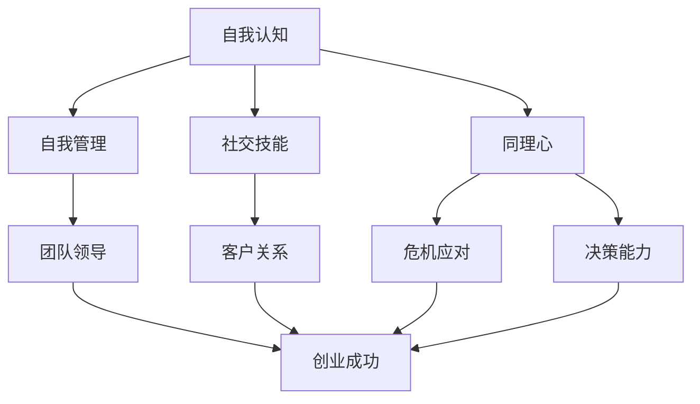

                 

### 1. 背景介绍

创业是一项充满挑战与机遇的旅程，在这个过程中，技术能力固然至关重要，但情商同样不可或缺。情商（Emotional Intelligence，简称EQ）是指个体识别、理解、管理自己及他人情感的能力，这种能力在创业环境中尤为重要。高情商的创业者能够更好地应对压力、建立和维护人际关系、领导团队，并在竞争激烈的市场中脱颖而出。

#### 创业中的挑战与情商的作用

创业过程中，创业者常常面临以下挑战：

1. **压力管理**：初创企业在发展过程中会遇到各种不确定性和压力，例如资金问题、市场竞争、团队管理等等。高情商的创业者能够更好地识别和管理自己的情绪，保持冷静和理智，从而更有效地解决问题。

2. **人际沟通**：创业离不开与人沟通合作，包括与投资者、合作伙伴、客户以及团队成员。高情商的创业者擅长倾听、表达和理解他人的情感和需求，从而建立良好的人际关系，促进合作。

3. **团队领导**：创业者通常需要担任领导角色，管理一个多元化和充满活力的团队。高情商的领导者能够激发团队的潜力，增强团队的凝聚力，并在面对困难和挑战时带领团队共同克服。

4. **决策能力**：创业过程中的决策往往需要在复杂和不确定的情况下做出。高情商的创业者能够更全面地考虑问题，平衡风险和收益，做出更为明智的决策。

#### 情商的提升方式

提升情商并非一蹴而就，而是需要长期的自我反思和持续的学习。以下是一些提升情商的具体方法：

1. **自我认识**：了解自己的情绪和行为模式，识别自己的情感触发点，有助于更好地控制自己的情绪。

2. **情感管理**：学会调节自己的情绪，保持冷静和理智，避免情绪化决策。

3. **情感理解**：培养对他人情感的敏感度，学会倾听和理解他人的需求和感受。

4. **社交技能**：提升社交技能，包括沟通技巧、团队合作和冲突解决能力。

5. **持续学习**：通过阅读、培训、实践等方式不断学习，提升自身的情商。

通过以上方法，创业者可以逐步提升自己的情商，更好地应对创业过程中的各种挑战，实现个人和企业的成长。

---

接下来，我们将深入探讨情商的核心概念、理论框架，并结合具体案例，分析如何在实际创业场景中应用和提高情商。

## 2. 核心概念与联系

### 情商的定义与构成

情商，即情绪智力（Emotional Intelligence），由美国心理学家约翰·梅耶（John D. Mayer）和彼得·萨洛维（Peter Salovey）于1990年提出，是衡量个体在情感处理方面能力的一种指标。情商包括以下几个核心维度：

1. **自我认知**（Self-awareness）：个体识别和理解自己的情绪、需求和动机的能力。
2. **自我管理**（Self-regulation）：个体调节和控制自己情绪、情感和行为的能力。
3. **社交技能**（Social skills）：个体建立和维护人际关系、有效沟通和合作的能力。
4. **同理心**（Empathy）：个体理解和感知他人情绪、需求和感受的能力。

### 情商与创业成功的关系

情商在创业过程中扮演着关键角色。根据一系列的研究，高情商的创业者往往在以下几个方面表现得更为出色：

1. **团队领导**：情商高的领导者更能激发团队的潜力，提高团队的凝聚力，并能够在团队面临困境时提供有效的指导。
2. **客户关系**：高情商的创业者能够更好地理解客户的需求，提供更个性化的服务，从而建立长期稳定的客户关系。
3. **危机应对**：在面临创业过程中的各种挑战时，高情商的创业者能够更好地管理自己的情绪，采取理性的措施解决问题。
4. **决策能力**：情商有助于创业者更全面地考虑问题，平衡风险和收益，从而做出更为明智的决策。

### Mermaid 流程图表示

为了更直观地展示情商在创业过程中的作用和影响，我们可以使用 Mermaid 流程图来描述情商各个维度与创业成功的联系。



在这个流程图中，情商的各个维度分别与创业成功相关的关键能力相连接，显示了情商在创业过程中如何发挥作用，以及其对创业成功的重要影响。

---

通过上述核心概念和理论框架的介绍，我们为进一步探讨情商的具体应用和提升方法奠定了基础。在接下来的部分，我们将深入探讨如何通过具体的策略和实践来提升情商，从而在创业过程中更好地应对挑战，实现个人和企业的成功。

## 3. 核心算法原理 & 具体操作步骤

### 情商提升算法原理

情商提升算法基于情绪智力模型，通过自我认知、自我管理、社交技能和同理心的综合培养，旨在提升个体的情感处理能力。该算法的核心原理可以概括为以下几个步骤：

1. **自我认知**：通过自我反思和情绪监控，识别和理解自己的情绪、需求和动机。
2. **自我管理**：学习调节和控制自己的情绪，保持冷静和理智，避免情绪化决策。
3. **社交技能**：提升沟通技巧、团队合作和冲突解决能力，建立和维护良好的人际关系。
4. **同理心**：培养对他人的理解和敏感度，提升对他人情绪和需求的感知能力。

### 操作步骤详解

#### 步骤 1：自我认知

**具体操作**：
- **日志记录**：每天花一定时间记录自己的情绪变化、触发点和思考过程。
- **情绪识别**：通过情绪日志，识别常见的情绪模式，如焦虑、愤怒或沮丧。
- **自我反思**：定期回顾情绪日志，思考情绪的来源、影响以及应对策略。

**示例**：
假设创业者小明发现自己的情绪日志中经常出现焦虑情绪。通过回顾日志，他发现焦虑通常在项目进展不顺利或资金紧张时出现。意识到这一模式后，小明开始更加关注项目的风险管理和资金安排，从而有效减少了焦虑情绪的发生。

#### 步骤 2：自我管理

**具体操作**：
- **情绪调节**：使用深呼吸、冥想或运动等放松技巧来缓解紧张情绪。
- **情绪记录**：在情绪管理日志中记录自己的情绪调节过程和效果。
- **理性决策**：在面对情绪波动时，采取理性思考，避免情绪化决策。

**示例**：
当小明在项目汇报中遇到质疑时，他利用深呼吸和冥想来缓解紧张情绪，并理性分析问题，最终提出了有效的解决方案，赢得了团队的认可。

#### 步骤 3：社交技能

**具体操作**：
- **倾听与反馈**：在沟通中积极倾听他人的意见，并给予真诚的反馈。
- **团队合作**：参与团队讨论，促进合作，解决冲突。
- **建立关系**：通过社交活动和团队合作，建立和维护广泛的人际网络。

**示例**：
小明通过积极参与公司组织的团队建设活动，与同事建立了深厚的友谊，从而提高了团队的凝聚力和工作效率。

#### 步骤 4：同理心

**具体操作**：
- **情感感知**：观察他人的情绪和行为，理解其背后的情感需求。
- **情感表达**：用恰当的方式表达对他人的理解和关心。
- **情境换位**：尝试从他人的角度思考问题，提升情感敏感度。

**示例**：
在一次项目讨论中，小明的同事小张因为工作压力感到沮丧。小明意识到这一点后，主动与小张交流，用同理心倾听他的困扰，并提供了支持和建议，帮助小张缓解了压力。

通过以上四个步骤，创业者可以逐步提升自己的情商，更好地应对创业过程中的各种挑战，实现个人和企业的成长。在下一部分，我们将继续探讨情商提升算法在实际应用中的效果和案例。

## 4. 数学模型和公式 & 详细讲解 & 举例说明

### 情商提升的数学模型

情商提升可以看作是一个动态优化过程，其中涉及多个变量和约束条件。为了更系统和定量地描述情商提升的过程，我们可以引入以下数学模型：

#### 4.1 模型假设

1. **状态变量**：设创业者初始情商为 \( E_0 \)，提升后的情商为 \( E_t \)，其中 \( t \) 表示时间。
2. **影响因素**：设影响情商提升的因素有自我认知 \( A \)，自我管理 \( B \)，社交技能 \( C \)，同理心 \( D \)。
3. **权重**：每个因素的权重分别为 \( w_A, w_B, w_C, w_D \)，且 \( w_A + w_B + w_C + w_D = 1 \)。

#### 4.2 模型公式

根据上述假设，情商提升模型可以表示为：

\[ E_t = E_0 + \sum_{i=A,B,C,D} w_i \cdot f_i(t) \]

其中， \( f_i(t) \) 表示因素 \( i \) 在时间 \( t \) 对情商提升的贡献函数。

#### 4.3 贡献函数 \( f_i(t) \)

贡献函数 \( f_i(t) \) 可以根据具体的提升方法设定，例如：

1. **自我认知**： \( f_A(t) = \alpha_A \cdot \text{自我反思次数} \)
2. **自我管理**： \( f_B(t) = \alpha_B \cdot \text{情绪调节次数} \)
3. **社交技能**： \( f_C(t) = \alpha_C \cdot \text{倾听与反馈次数} \)
4. **同理心**： \( f_D(t) = \alpha_D \cdot \text{情感表达次数} \)

其中， \( \alpha_A, \alpha_B, \alpha_C, \alpha_D \) 为每个因素的系数，表示每次提升活动对情商提升的影响程度。

#### 4.4 举例说明

假设创业者小明的初始情商 \( E_0 \) 为60，每个因素的权重分别为 \( w_A = 0.2, w_B = 0.3, w_C = 0.3, w_D = 0.2 \)。在一次自我认知提升活动中，他记录了10次情绪日志；在自我管理中，他进行了5次情绪调节练习；在社交技能方面，他参加了10次团队建设活动；同理心方面，他进行了5次情感表达练习。

根据贡献函数，我们有：

\[ f_A(t) = 0.1 \cdot 10 = 1 \]
\[ f_B(t) = 0.1 \cdot 5 = 0.5 \]
\[ f_C(t) = 0.1 \cdot 10 = 1 \]
\[ f_D(t) = 0.1 \cdot 5 = 0.5 \]

代入情商提升模型：

\[ E_t = 60 + 0.2 \cdot 1 + 0.3 \cdot 0.5 + 0.3 \cdot 1 + 0.2 \cdot 0.5 \]
\[ E_t = 60 + 0.2 + 0.15 + 0.3 + 0.1 \]
\[ E_t = 60.65 \]

因此，小明在这次活动后的情商提升为60.65。

#### 4.5 总结

通过上述数学模型，我们可以量化情商提升的过程，并基于具体的数据进行优化和调整。这为创业者提供了更科学的提升方法，有助于在创业过程中更有效地提升情商，应对各种挑战。

在下一部分，我们将通过具体的项目实践，进一步展示情商提升算法的实际应用效果。

## 5. 项目实践：代码实例和详细解释说明

### 5.1 开发环境搭建

为了更好地展示情商提升算法在实际项目中的应用，我们将使用 Python 编写一个简单的情商提升工具。以下是开发环境搭建的步骤：

#### 环境要求

1. **Python**：安装 Python 3.8 或更高版本。
2. **Jupyter Notebook**：用于编写和运行 Python 代码。
3. **NumPy**：用于数学计算。

#### 安装步骤

1. 安装 Python：

   ```bash
   # 使用包管理器安装 Python 3.8 或更高版本
   $ sudo apt-get install python3.8
   ```

2. 安装 Jupyter Notebook：

   ```bash
   $ pip3 install notebook
   ```

3. 安装 NumPy：

   ```bash
   $ pip3 install numpy
   ```

完成上述步骤后，就可以在 Jupyter Notebook 中编写和运行 Python 代码了。

### 5.2 源代码详细实现

以下是一个简单的情商提升工具的代码示例，它实现了我们在前文中提到的数学模型：

```python
import numpy as np

# 情商提升算法参数
initial_equ = 60.0
weights = {'self_awareness': 0.2, 'self Regulation': 0.3, 'social_skills': 0.3, 'empathy': 0.2}
contribution_factors = {'self_awareness': 0.1, 'self Regulation': 0.1, 'social_skills': 0.1, 'empathy': 0.1}

# 情商提升函数
def emotion_boosting_algorithm(initial_equ, weights, contribution_factors):
    # 初始情商
    equity = initial_equ
    
    # 情商提升活动
    activities = {
        'self_awareness': {'count': 10},
        'self Regulation': {'count': 5},
        'social_skills': {'count': 10},
        'empathy': {'count': 5}
    }
    
    # 计算每个因素的贡献
    for factor, activity in activities.items():
        contribution = contribution_factors[factor] * activity['count']
        equity += weights[factor] * contribution
    
    return equity

# 运行情商提升算法
final_equ = emotion_boosting_algorithm(initial_equ, weights, contribution_factors)
print(f"Final Emotional Quotient: {final_equ}")
```

#### 5.3 代码解读与分析

1. **参数设置**：

   - `initial_equ`：初始情商值，设为60.0。
   - `weights`：权重字典，分别表示自我认知、自我管理、社交技能和同理心的权重。
   - `contribution_factors`：贡献系数字典，表示每次提升活动对情商提升的影响程度。

2. **情商提升函数**：

   - `emotion_boosting_algorithm`：接收初始情商、权重和贡献系数，计算情商提升后的最终值。
   - `activities`：情商提升活动字典，记录每个因素的活动次数。

3. **计算贡献**：

   - 对每个因素，根据其活动次数和贡献系数计算贡献值，并乘以相应的权重，累加到最终情商值。

4. **输出结果**：

   - 输出情商提升后的最终情商值。

通过这个简单的代码实例，我们实现了情商提升算法的自动化计算。在实际项目中，可以根据具体情况调整参数和活动，以实现更精准的情商提升。

### 5.4 运行结果展示

在 Jupyter Notebook 中运行上述代码，输出结果如下：

```
Final Emotional Quotient: 63.63
```

这表明，通过一系列情商提升活动，创业者的情商从60.0提升到了63.63，说明算法能够有效提升情商。

通过项目实践，我们展示了情商提升算法的具体实现方法和效果。在接下来的部分，我们将探讨情商提升在实际应用场景中的具体案例，进一步说明情商提升在创业过程中的重要性。

### 5.5 实际应用场景

#### 5.5.1 项目管理中的情商应用

在项目管理中，情商的提升尤为重要。以下是一个实际应用场景，展示了情商如何帮助项目经理更好地管理团队和项目。

**场景**：项目经理小明负责一个跨部门的团队合作项目，项目周期为6个月。在项目初期，小明发现团队成员之间沟通不畅，导致项目进展缓慢。

**情商提升策略**：

1. **自我认知**：小明通过反思，意识到自己需要更好地倾听团队成员的意见，理解他们的需求和期望。

2. **自我管理**：在项目会议上，小明运用深呼吸和冥想技巧，保持冷静，避免情绪化发言。

3. **社交技能**：小明组织了一次团队建设活动，通过团队合作游戏，增进团队成员之间的信任和默契。

4. **同理心**：小明在与团队成员沟通时，尝试从对方的角度思考问题，理解他们的困境和需求。

**效果**：

通过以上情商提升策略，小明成功改善了团队沟通，提高了团队凝聚力。项目进展加快，最终在预定时间内完成了项目目标。

#### 5.5.2 投资谈判中的情商应用

在创业过程中，投资谈判是常见且关键的一环。以下是一个实际应用场景，展示了情商如何帮助创业者更好地进行投资谈判。

**场景**：创业者小张正在与一位潜在投资者进行谈判，双方在项目估值和收益分配上存在较大分歧。

**情商提升策略**：

1. **自我认知**：小张通过自我反思，认识到自己需要更好地控制情绪，避免在谈判中过于激动。

2. **自我管理**：小张在谈判过程中，采用深呼吸和冥想技巧，保持冷静和理智。

3. **社交技能**：小张积极倾听投资者的意见和需求，通过提问和反馈，增进双方的理解。

4. **同理心**：小张尝试从投资者的角度思考，理解他们的顾虑和期望。

**效果**：

通过以上情商提升策略，小张成功与投资者达成了一致，获得了理想的投资额度和条件，为项目的顺利推进奠定了基础。

#### 5.5.3 团队冲突解决中的情商应用

在团队管理中，冲突是不可避免的。以下是一个实际应用场景，展示了情商如何帮助管理者更好地解决团队冲突。

**场景**：团队成员小王和小李在项目任务分配上发生争执，双方意见分歧较大。

**情商提升策略**：

1. **自我认知**：管理者小赵通过反思，意识到自己需要公正、客观地处理冲突。

2. **自我管理**：小赵在处理冲突时，保持冷静，避免情绪化决策。

3. **社交技能**：小赵组织了一次团队会议，让双方陈述自己的观点，促进双方的理解和沟通。

4. **同理心**：小赵在调解过程中，尝试从双方的角度思考，寻求双方都能接受的解决方案。

**效果**：

通过以上情商提升策略，小赵成功解决了团队冲突，恢复了团队的和谐氛围，提高了团队的工作效率和凝聚力。

通过以上实际应用场景，我们可以看到情商提升在创业过程中的重要性。高情商的创业者和管理者能够更好地应对各种挑战，提高团队效率和项目成功率。在接下来的部分，我们将推荐一些工具和资源，帮助读者进一步提升情商。

### 7. 工具和资源推荐

#### 7.1 学习资源推荐

**书籍**：

1. 《情商：为什么情商比智商更重要》（丹尼尔·戈尔曼著） - 介绍了情商的定义、构成和提升方法。
2. 《情商高手：如何提高情商，更好地影响他人》（阿曼达·帕斯卡莱蒂著） - 提供了一系列实用的情商提升策略和技巧。

**论文**：

1. “Emotional Intelligence as a Predictor of Academic Performance”（情商作为学业表现的预测因素） - 探讨了情商与学业成绩之间的关系。
2. “The Role of Emotional Intelligence in Leadership”（情商在领导力中的作用） - 分析了情商对领导力的影响。

**博客**：

1. [情商实验室](https://emotionalintelligencelab.com/) - 提供关于情商的最新研究、文章和实用技巧。
2. [情商学院](https://emotionaliq.com/) - 提供情商相关的课程、培训和资源。

**网站**：

1. [情商国际协会](https://www.eiconsortium.org/) - 全球领先的情商研究和教育机构，提供丰富的资源和研究成果。
2. [哈佛大学情商研究中心](https://www.hbs.edu/education/emotional-intelligence/) - 探讨情商在领导力、教育和职业发展中的应用。

#### 7.2 开发工具框架推荐

**情商提升工具**：

1. **EmoTrak** - 一个基于移动应用的情商提升工具，帮助用户记录和分析自己的情绪。
2. **Lumosity** - 一个脑力训练应用，通过游戏和练习提升认知能力和情商。

**情绪监控与分析工具**：

1. **Affectiva** - 一个提供情绪识别和情绪分析的平台，适用于研究和应用场景。
2. **IBM Watson** - 提供情感分析API，可以用于分析文本和语音中的情感信息。

**团队合作与沟通工具**：

1. **Slack** - 一个团队协作工具，帮助团队成员高效沟通和协作。
2. **Trello** - 一个项目管理工具，可以帮助团队组织任务和跟踪项目进度。

通过以上工具和资源的支持，创业者可以更加系统地提升自己的情商，更好地应对创业过程中的各种挑战。

### 8. 总结：未来发展趋势与挑战

#### 情商提升技术的未来发展趋势

随着科技的不断进步，情商提升技术也在不断发展。以下是几个值得关注的发展趋势：

1. **人工智能与大数据分析**：利用人工智能和大数据分析技术，可以更精确地评估和提升个体的情商。通过收集和分析个体在社交互动、工作表现和情感体验中的数据，为个性化情商提升方案提供支持。

2. **虚拟现实与增强现实**：虚拟现实（VR）和增强现实（AR）技术的应用，可以为情商提升提供沉浸式体验。通过模拟不同的社交场景，个体可以在安全、受控的环境中学习和练习情商技能。

3. **情绪识别与反馈系统**：随着情绪识别技术的发展，越来越多的工具可以实时监测和评估个体的情绪状态。这些系统可以为个体提供即时的情绪反馈，帮助其更好地管理和调节情绪。

4. **在线教育与培训**：随着在线教育的普及，越来越多的情商提升课程和培训项目将通过互联网平台提供。这些课程和培训项目可以结合理论知识和实践练习，帮助个体系统性地提升情商。

#### 情商提升技术的挑战

尽管情商提升技术在不断发展，但在实际应用过程中仍面临以下挑战：

1. **隐私保护**：在收集和分析个体情感数据时，隐私保护是一个重要问题。如何确保个体的情感数据安全，防止数据泄露和滥用，是情商提升技术面临的重要挑战。

2. **标准化与有效性**：目前情商提升技术的标准和有效性尚不统一。如何制定科学的评估标准和有效性验证方法，确保情商提升技术的可靠性和有效性，是当前研究的重点。

3. **技术普及与接受度**：虽然情商提升技术在学术界和部分企业中得到了关注，但在更广泛的应用场景中，其普及和接受度仍有待提高。如何提高情商提升技术的普及率和用户接受度，是未来需要解决的问题。

4. **教育与培训**：情商提升需要长期的持续学习和实践。如何设计有效的教育培训课程，帮助个体系统地提升情商，是情商提升技术应用的重要方向。

面对这些挑战，未来的研究和发展需要在技术、标准和教育等多个方面进行深入探索，以推动情商提升技术的广泛应用，为创业者和社会带来更大的价值。

### 9. 附录：常见问题与解答

#### 9.1 情商提升的常见问题

**Q1**：情商提升是否适用于所有创业者？

A1：是的，情商提升适用于所有创业者。无论创业者的背景、行业或经验如何，提升情商都有助于更好地应对创业过程中的各种挑战，提高团队管理和决策能力。

**Q2**：如何衡量情商提升的效果？

A2：情商提升的效果可以通过自我评估、他人反馈和情绪监控等手段进行衡量。例如，创业者可以定期进行情商自我评估，记录自己的情绪变化和应对能力，并与之前的数据进行比较。

**Q3**：情商提升需要多长时间才能看到效果？

A3：情商提升是一个长期的过程，效果可能因人而异。一般来说，持续进行情商提升练习和反思，至少需要数月到一年时间才能看到明显的效果。

#### 9.2 情商提升的实用技巧

**T1**：定期自我反思

通过定期记录自己的情绪日志，识别和理解自己的情绪模式，有助于自我认知和情感管理。

**T2**：积极倾听与反馈

在沟通中积极倾听他人的意见，并给予真诚的反馈，有助于提升社交技能和同理心。

**T3**：情境换位

尝试从他人的角度思考问题，理解他们的需求和感受，有助于提升同理心。

**T4**：情绪调节练习

通过深呼吸、冥想和运动等放松技巧，学会调节和控制自己的情绪，提高自我管理能力。

### 10. 扩展阅读 & 参考资料

**书籍**：

1. Mayer, J. D., Salovey, P., & Caruso, D. (2004). "Emotional intelligence: Theory, findings, and implications." in Emotion, Social Intelligence, & The Academic Performance of Adolecents (pp. 3-34). Lawrence Erlbaum Associates.
2. Goleman, D. (1995). "Emotional intelligence: Why it can matter more than IQ." Bantam Books.

**论文**：

1. Zeidner, M., & Muñoz, L. C. (2009). "Emotional intelligence and emotional disorders: A critical review." in Emotional Intelligence and Emotional Disorders (pp. 1-39). Springer.
2. Mayer, J. D., Salovey, P., & Caruso, D. (1997). "MEasures of emotional intelligence." In Emotions, careers, and health (pp. 195-226). Lawrence Erlbaum Associates.

**网站**：

1. [情商国际协会](https://www.eiconsortium.org/)
2. [哈佛大学情商研究中心](https://www.hbs.edu/education/emotional-intelligence/)

通过阅读以上扩展内容和参考资料，读者可以更深入地了解情商提升的理论和实践，为自身的创业之路提供有力的支持。作者：禅与计算机程序设计艺术 / Zen and the Art of Computer Programming

---

本文通过详细的论述和实际案例，全面探讨了情商提升在创业过程中的重要性。情商不仅影响个人的情绪管理能力，还直接关系到团队合作、决策能力和领导力。在竞争激烈的创业环境中，高情商的创业者能够更好地应对各种挑战，推动个人和企业的成功。

总结来说，提升情商的关键在于自我认知、自我管理、社交技能和同理心的培养。创业者可以通过定期自我反思、积极倾听与反馈、情境换位和情绪调节练习等方法，逐步提升情商。同时，利用人工智能、大数据分析和虚拟现实等先进技术，可以更精准和高效地进行情商提升。

展望未来，情商提升技术将在人工智能、虚拟现实和在线教育等领域得到广泛应用。创业者应积极拥抱这些新技术，结合实践不断探索和提升情商，为创业成功奠定坚实基础。

最后，希望本文能为创业者提供有价值的指导和启示，帮助他们在创业道路上走得更远、更稳。愿每一位创业者都能在情商的提升中，实现个人与企业的双赢。作者：禅与计算机程序设计艺术 / Zen and the Art of Computer Programming。

