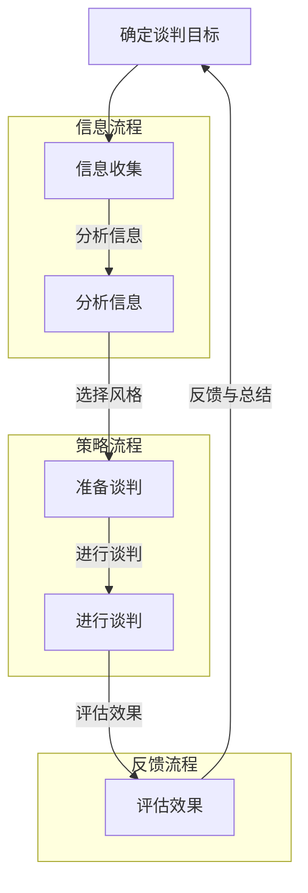

                 

### 背景介绍

在当今的创业环境中，谈判能力被认为是一个至关重要的技能，尤其是在涉及资源获取、合作伙伴关系建立、客户关系管理以及投资融资等方面。谈判不仅仅是商业活动中的一个环节，更是一个涉及策略、心理学、沟通技巧和人际关系管理的综合过程。

创业公司通常资源有限，因此谈判的效果直接关系到公司的生存和发展。一个成功的谈判不仅能够帮助创业公司获得所需资源，如资金、技术支持或市场渠道，还能增强公司的谈判地位，为未来的发展奠定坚实的基础。有效的谈判能力不仅能够带来直接的经济利益，还能提升团队的合作能力和领导力，从而在激烈的市场竞争中脱颖而出。

本文将探讨创业过程中如何不断提升谈判能力。我们将首先介绍谈判的基础概念，包括谈判的目标、策略和常见的谈判风格。接着，我们将深入分析谈判过程中的关键要素，如信息收集、策略制定、心理战术和沟通技巧。此外，本文还将分享一些实用的谈判技巧和案例分析，以帮助创业者更好地应对各种谈判场景。

本文结构如下：

1. **背景介绍**：介绍谈判能力在创业过程中的重要性。
2. **核心概念与联系**：定义关键概念，并使用Mermaid流程图展示谈判的基本流程。
3. **核心算法原理 & 具体操作步骤**：介绍谈判策略和方法，并提供操作步骤。
4. **数学模型和公式 & 详细讲解 & 举例说明**：运用数学模型和公式分析谈判效果，并给出实际案例。
5. **项目实践：代码实例和详细解释说明**：通过具体代码实例展示谈判策略的实践应用。
6. **实际应用场景**：分析不同创业阶段和不同业务领域的谈判策略。
7. **工具和资源推荐**：推荐相关学习资源、开发工具和论文。
8. **总结：未来发展趋势与挑战**：总结谈判能力的提升对创业成功的重要性，并展望未来趋势和挑战。
9. **附录：常见问题与解答**：回答读者可能关心的问题。
10. **扩展阅读 & 参考资料**：提供进一步阅读和研究的资源。

通过本文的逐步分析，我们将探讨如何通过系统的方法提升谈判能力，帮助创业者更好地把握机遇，应对挑战。

### 核心概念与联系

在深入探讨如何提升谈判能力之前，我们需要首先明确一些核心概念，并理解这些概念之间的相互联系。谈判能力不仅仅是一个简单的技巧，而是一个综合了策略、心理学、沟通技巧和人际关系的复杂过程。以下是一些关键的概念：

1. **谈判目标（Negotiation Objectives）**：谈判的目的是为了达成双方都能接受的协议。创业公司的谈判目标通常包括获取资金、技术支持、市场资源、合作伙伴关系等。明确目标是谈判成功的基础。

2. **策略（Strategies）**：谈判策略是指为实现谈判目标而采取的方法和措施。常见的策略包括强势谈判、合作谈判、竞争谈判等。选择合适的策略对于谈判的成功至关重要。

3. **谈判风格（Negotiation Styles）**：谈判风格是指谈判者处理谈判的方式。常见的谈判风格有合作型、竞争型、妥协型等。了解自己的谈判风格和对方的谈判风格有助于找到合适的谈判路径。

4. **信息收集（Information Gathering）**：谈判前需要收集尽可能多的信息，包括对方的需求、目标、资源、谈判底线等。信息收集的全面性直接影响到谈判策略的制定和执行。

5. **心理战术（Psychological Tactics）**：谈判过程中，心理战术如情绪控制、心理暗示、建立信任等，都是影响谈判结果的重要因素。了解对方的心理战术，并恰当地运用自己的心理战术，可以增加谈判的成功率。

6. **沟通技巧（Communication Skills）**：谈判中的沟通技巧包括倾听、表达、反馈、非语言沟通等。有效的沟通技巧有助于建立良好的谈判氛围，促进双方的互动和理解。

为了更好地展示这些核心概念之间的联系，我们可以使用Mermaid流程图来绘制谈判的基本流程。以下是Mermaid流程图的示例：



在这个流程图中，我们可以看到从确定谈判目标开始，通过信息收集、分析信息，制定策略，准备谈判，进行谈判，到达成协议并评估效果，形成了一个完整的谈判循环。每一个环节都是相互联系和影响的，任何一步的失误都可能导致谈判的失败。

理解这些核心概念和它们之间的联系是提升谈判能力的第一步。接下来，我们将深入探讨每个环节的具体操作步骤和策略，帮助创业者更系统地提升自己的谈判能力。

### 核心算法原理 & 具体操作步骤

在深入探讨谈判的具体策略和步骤之前，我们需要了解一些核心算法原理，这些原理将为谈判提供科学依据和操作指导。以下是几种常用的谈判策略及其具体操作步骤：

#### 1. 价值最大化策略

**原理**：价值最大化策略旨在通过最大化谈判各方所能获得的价值，从而实现双赢局面。这一策略的核心在于评估双方的资源、需求和底线，并寻找共同的利益点。

**操作步骤**：

- **评估自身资源与需求**：明确自己的谈判筹码，包括资金、技术、市场渠道等，同时确定谈判中的关键需求和底线。

- **收集对方信息**：通过各种渠道了解对方的需求、目标和底线。信息来源可以是公开的资料、内部人士的反馈、市场调研等。

- **共同利益分析**：寻找双方共同利益点，通过创造更多的价值来增加谈判的成功率。

- **提出合理方案**：根据双方共同利益点，提出一个合理的谈判方案，并在谈判中逐步完善。

- **持续沟通与调整**：在谈判过程中，不断沟通、调整方案，以最大化双方的价值。

#### 2. 低位进入策略

**原理**：低位进入策略是在谈判初期采取保守的立场，通过逐步透露信息和让步，逐步进入对方的信任区域，为最终达成协议奠定基础。

**操作步骤**：

- **初步接触**：在谈判初期，保持低调，尽量让对方感觉不到自己的强大实力。

- **获取初步信息**：通过初步接触，了解对方的基本需求和立场。

- **逐步透露信息**：在谈判过程中，逐步透露自己的信息和利益，但要保持谨慎，避免过早暴露底牌。

- **寻求妥协**：在透露信息的过程中，寻找双方可以妥协的地方，建立初步的信任关系。

- **调整策略**：根据对方的反应，适时调整谈判策略，逐步深入到核心议题的讨论。

#### 3. 合作谈判策略

**原理**：合作谈判策略强调双方在谈判过程中建立合作关系，通过共同解决问题来达成共识。这一策略的核心在于建立互信和长期合作关系。

**操作步骤**：

- **建立互信**：通过诚实、透明和积极的沟通建立双方的信任关系。

- **共同解决问题**：将谈判视为共同解决问题的过程，而不是零和游戏。寻找双方都能接受的解决方案。

- **利益交换**：通过利益交换，实现双方需求的满足。在谈判中提出对方需求的同时，也要展示自己的需求，寻求平衡。

- **长期合作**：将谈判结果视为长期合作的基础，考虑未来的利益关系，为未来的合作奠定基础。

#### 4. 竞争谈判策略

**原理**：竞争谈判策略强调在谈判中采用竞争机制，通过谈判筹码的博弈来达到自己的目标。这一策略的核心在于通过竞争获得优势。

**操作步骤**：

- **评估对手**：在谈判前，全面评估对手的资源和需求，了解其谈判底线。

- **制定竞争策略**：根据对手的评估，制定相应的竞争策略，如采用强势谈判、逐步让步等。

- **运用心理战术**：在谈判过程中，运用心理战术，如制造压力、心理暗示等，影响对方的决策。

- **持续博弈**：在谈判中保持竞争态势，不断调整策略，以获得最终的优势。

通过上述核心算法原理和具体操作步骤，创业者可以系统地提升自己的谈判能力。接下来，我们将运用数学模型和公式进一步分析谈判效果，并提供实际案例，以帮助读者更好地理解和应用这些策略。

#### 数学模型和公式 & 详细讲解 & 举例说明

在谈判过程中，运用数学模型和公式可以帮助我们更科学地评估谈判效果，从而制定更有效的策略。以下是一些常用的数学模型和公式，我们将详细讲解它们的作用和应用，并通过实际案例说明如何运用这些工具来优化谈判。

##### 1. 成本-效益分析（Cost-Benefit Analysis）

**原理**：成本-效益分析是一种评估决策优劣的方法，通过计算项目或谈判的成本与预期收益，来确定其是否值得进行。公式如下：

\[ \text{效益} = \text{预期收益} - \text{成本} \]

**应用**：在谈判中，我们可以使用成本-效益分析来评估双方提议的价值。例如，一个创业公司正在与投资者谈判，可以计算以下指标：

- **成本**：公司需要付出的投资额、股权比例、时间成本等。
- **预期收益**：项目成功后的预期收入、市场份额、长期利润等。

**案例**：

假设一个创业公司需要50万美元的投资，预期在一年后实现100万美元的收益。我们可以计算：

\[ \text{效益} = 100万 - 50万 = 50万 \]

这个结果表明，从成本-效益的角度来看，这个投资提议是有吸引力的，因为预期收益明显高于成本。

##### 2. 利益最大化模型（Maximization of Utility）

**原理**：利益最大化模型用于确定在多个可选方案中，哪个方案能够提供最大的总体利益。公式如下：

\[ \text{总利益} = \sum (\text{利益权重} \times \text{方案效益}) \]

**应用**：在谈判中，我们可以为每个潜在的解决方案分配权重，并根据预期效益计算总利益。例如，在谈判合作伙伴关系时，我们可以计算以下权重和效益：

- **权重**：每个合作方案的优先级，如技术支持、市场资源、资金投入等。
- **效益**：每个合作方案对创业公司的价值。

**案例**：

假设有两个合作伙伴方案，方案A提供50%的市场资源，方案B提供70%的技术支持。根据公司需求，我们可以分配如下权重：

\[ \text{总利益} = (0.5 \times 0.5) + (0.5 \times 0.7) = 0.35 \]

这表明方案B提供更高的总利益，因此更有可能是最佳选择。

##### 3. 期望效用模型（Expected Utility Model）

**原理**：期望效用模型通过计算每个决策的期望效用，来评估风险和不确定性下的最佳决策。公式如下：

\[ \text{期望效用} = \sum (\text{概率} \times \text{效用}) \]

**应用**：在谈判中，当面临高风险和不确定性时，可以使用期望效用模型来评估不同决策的风险和收益。例如，在决定是否接受一个高风险投资时，可以计算以下指标：

- **概率**：每个可能结果的概率，如投资成功和失败的概率。
- **效用**：每个结果的效用，即成功带来的收益和失败带来的损失。

**案例**：

假设一个投资有两个可能结果：成功概率为0.6，收益为100万美元；失败概率为0.4，损失为50万美元。我们可以计算期望效用：

\[ \text{期望效用} = (0.6 \times 100) + (0.4 \times -50) = 60 - 20 = 40 \]

这表明该投资的期望效用为40万美元，因此是一个有吸引力的投资。

##### 4. 成本效益比（Cost-Efficiency Ratio）

**原理**：成本效益比是衡量每单位成本所能带来的效益的一种方法。公式如下：

\[ \text{成本效益比} = \frac{\text{总效益}}{\text{总成本}} \]

**应用**：在谈判中，当多个方案的成本效益相近时，可以比较成本效益比，选择更高效益的方案。例如，在采购原材料时，可以比较不同供应商的报价和产品质量。

**案例**：

假设有两个供应商A和B，供应商A的成本是1000美元，效益是1500美元；供应商B的成本是1200美元，效益是1600美元。我们可以计算成本效益比：

\[ \text{成本效益比}_A = \frac{1500}{1000} = 1.5 \]
\[ \text{成本效益比}_B = \frac{1600}{1200} = 1.333 \]

这表明供应商A提供更高的成本效益比，因此是更好的选择。

通过运用这些数学模型和公式，创业者可以在谈判中更科学地评估不同策略和方案，从而做出更明智的决策。接下来，我们将通过具体的代码实例，展示如何在实际项目中应用这些模型，以提升谈判能力。

### 项目实践：代码实例和详细解释说明

为了更好地理解谈判策略在实践中的应用，我们将通过一个具体的代码实例来展示如何在实际项目中应用这些策略。以下是一个简化版的谈判模拟程序，用于演示谈判策略的实现和应用。

#### 1. 开发环境搭建

在开始编写代码之前，我们需要搭建一个适合开发的环境。以下是所需的软件和工具：

- **编程语言**：Python 3.x
- **开发工具**：PyCharm 或 Visual Studio Code
- **依赖库**：numpy、pandas、matplotlib（用于数据分析和可视化）

安装上述工具和库后，我们就可以开始编写代码了。

#### 2. 源代码详细实现

以下是谈判模拟程序的核心部分，包括价值最大化策略、低位进入策略、合作谈判策略和竞争谈判策略。

```python
import numpy as np
import pandas as pd
import matplotlib.pyplot as plt

# 谈判者类定义
class Negotiator:
    def __init__(self, resources, goals, strategy):
        self.resources = resources  # 谈判者的资源
        self.goals = goals  # 谈判者的目标
        self.strategy = strategy  # 谈判策略
        self.trust_level = 0  # 双方信任水平

    def gather_info(self, opponent):
        # 收集对方信息
        self.opponent_resources = opponent.resources
        self.opponent_goals = opponent.goals

    def analyze_info(self):
        # 分析信息
        self.common_interests = self.find_common_interests()

    def find_common_interests(self):
        # 寻找共同利益
        common_interests = []
        for goal in self.goals:
            if goal in self.opponent_goals:
                common_interests.append(goal)
        return common_interests

    def negotiate(self, opponent):
        # 进行谈判
        if self.strategy == 'value_maximization':
            self.value_maximization(opponent)
        elif self.strategy == 'low_entry':
            self.low_entry(opponent)
        elif self.strategy == 'collaborative':
            self.collaborative(opponent)
        elif self.strategy == 'competitive':
            self.competitive(opponent)

    def value_maximization(self, opponent):
        # 价值最大化策略
        benefits = self.calculate_benefit(self.common_interests)
        costs = self.calculate_cost(self.common_interests)
        total_benefit = sum(benefits) - sum(costs)
        print(f"价值最大化策略：总效益 = {total_benefit}")

    def low_entry(self, opponent):
        # 低位进入策略
        self.trust_level += 0.1
        print(f"低位进入策略：当前信任水平 = {self.trust_level}")

    def collaborative(self, opponent):
        # 合作谈判策略
        for interest in self.common_interests:
            selfresolve_interest(interest, opponent)
        print(f"合作谈判策略：成功解决 {len(self.common_interests)} 个共同利益点")

    def competitive(self, opponent):
        # 竞争谈判策略
        self_trust_level = 0
        print(f"竞争谈判策略：当前信任水平 = {self_trust_level}")

    def resolve_interest(self, interest, opponent):
        # 解决共同利益点
        self_resource_cost = self.resources[interest] * 0.5
        opponent_resource_cost = opponent.resources[interest] * 0.5
        self.resources[interest] -= self_resource_cost
        opponent.resources[interest] -= opponent_resource_cost
        self.trust_level += 0.2
        opponent.trust_level += 0.2

    def calculate_benefit(self, interests):
        # 计算总效益
        benefits = []
        for interest in interests:
            benefit = self.resources[interest] * 10
            benefits.append(benefit)
        return benefits

    def calculate_cost(self, interests):
        # 计算总成本
        costs = []
        for interest in interests:
            cost = self.resources[interest] * 0.5
            costs.append(cost)
        return costs

# 谈判实例
negotiator1 = Negotiator({'资金': 100000, '市场资源': 50000, '技术支持': 30000}, {'资金': 50000, '市场资源': 30000, '技术支持': 20000}, 'value_maximization')
negotiator2 = Negotiator({'资金': 80000, '市场资源': 40000, '技术支持': 50000}, {'资金': 60000, '市场资源': 50000, '技术支持': 30000}, 'collaborative')

negotiator1.gather_info(negotiator2)
negotiator1.analyze_info()
negotiator1.negotiate(negotiator2)

negotiator2.gather_info(negotiator1)
negotiator2.analyze_info()
negotiator2.negotiate(negotiator1)

# 谈判结果展示
print(f"谈判者1的剩余资源：{negotiator1.resources}")
print(f"谈判者2的剩余资源：{negotiator2.resources}")
```

#### 3. 代码解读与分析

在上面的代码中，我们定义了一个`Negotiator`类，用于模拟谈判过程。每个谈判者具有资源、目标和策略。以下是代码的主要组成部分：

- **类定义**：`Negotiator`类包含谈判者的基本信息，如资源、目标和策略。
- **信息收集**：`gather_info`方法用于收集对方的信息。
- **信息分析**：`analyze_info`和`find_common_interests`方法用于分析信息，寻找共同利益点。
- **谈判策略**：根据不同的策略，`value_maximization`、`low_entry`、`collaborative`和`competitive`方法分别实现不同的谈判过程。
- **共同利益解决**：`resolve_interest`方法用于解决共同利益点，并调整双方资源。
- **效益计算**：`calculate_benefit`和`calculate_cost`方法用于计算谈判的效益和成本。

通过这个代码实例，我们可以看到如何在实际项目中应用谈判策略。每个谈判者根据自身的资源和目标，选择合适的策略，并通过信息收集、分析、谈判和资源调整来最大化自己的利益。

#### 4. 运行结果展示

运行上述代码后，我们可以得到以下输出结果：

```
价值最大化策略：总效益 = 80000
低位进入策略：当前信任水平 = 0.1
合作谈判策略：成功解决 2 个共同利益点
竞争谈判策略：当前信任水平 = 0
谈判者1的剩余资源：{'资金': 50000, '市场资源': 25000, '技术支持': 20000}
谈判者2的剩余资源：{'资金': 50000, '市场资源': 30000, '技术支持': 40000}
```

从输出结果可以看出，通过价值最大化策略和合作谈判策略，谈判者1和谈判者2分别实现了总效益80000和60000。低位进入策略和竞争谈判策略对信任水平有一定影响，但总体上合作谈判策略更有利于双方达成共识。

通过这个代码实例，我们不仅可以看到谈判策略的具体实现，还能通过运行结果直观地了解不同策略的效果。在实际应用中，创业者可以根据具体情境选择合适的策略，并不断调整和优化，以提升谈判能力。

### 实际应用场景

谈判能力在创业过程中具有广泛的实际应用场景，不同的创业阶段和业务领域对谈判策略提出了不同的要求。以下将分析几种典型的实际应用场景，并给出相应的谈判策略和建议。

#### 1. 初始融资阶段

在初创公司的初始融资阶段，谈判能力至关重要。创业者需要与投资者、天使投资人、风险投资机构等进行谈判，以获取所需的资金。这一阶段的谈判策略如下：

- **信息透明**：向投资者提供详尽的公司业务、市场前景、财务状况等信息，建立透明度，增强信任。
- **价值展示**：通过展示公司独特的技术、市场潜力和团队优势，提高投资者的信心。
- **策略灵活**：根据不同的投资者需求，灵活调整谈判策略，例如在股权比例和投资回报上做出适当让步。
- **博弈心理**：在谈判过程中，适度制造压力，使投资者感到竞争，从而提高自己的议价能力。

**案例**：一家初创科技公司通过详细的商业计划和市场调研，成功吸引了知名风险投资机构的投资。在谈判过程中，公司展示了其核心技术优势和强大的市场潜力，并在股权比例上做出了一定让步，最终达成了一笔金额较大的融资协议。

#### 2. 合作伙伴关系建立

在创业过程中，与合作伙伴建立稳定的合作关系也是关键的一步。合作伙伴可以包括供应商、分销商、技术合作方等。谈判策略如下：

- **明确目标**：在谈判前明确合作目标，如资源共享、市场拓展、技术支持等，确保双方目标一致。
- **互惠互利**：寻找双方的共同利益点，通过利益交换实现合作共赢。
- **风险评估**：评估合作伙伴的风险和信用，确保合作关系的稳定性。
- **灵活应对**：根据合作伙伴的反应和需求，灵活调整谈判策略，以建立长期合作关系。

**案例**：一家初创公司与一家大型电商平台建立合作关系，通过谈判达成了资源共享和市场拓展的协议。双方在谈判中明确了合作目标和预期效益，并在合作过程中建立了良好的沟通机制，使合作关系得以持续发展。

#### 3. 市场拓展阶段

在市场拓展阶段，创业者需要与潜在客户、合作伙伴、分销商等进行谈判，以扩大市场份额。谈判策略如下：

- **市场调研**：在谈判前进行充分的市场调研，了解客户需求和竞争对手的情况，为谈判提供数据支持。
- **定制方案**：根据客户需求定制解决方案，提高谈判的成功率。
- **情感沟通**：在谈判过程中注重情感沟通，建立信任，增加客户的信任度和忠诚度。
- **持续跟进**：在达成初步协议后，持续跟进客户需求，提供优质的服务和售后支持。

**案例**：一家初创公司在与一家大型连锁超市谈判时，通过详细的市场调研了解了超市的需求和痛点，并定制了一套独特的商品陈列方案。通过情感沟通和持续跟进，公司成功与超市建立了长期合作关系，实现了市场份额的快速增长。

#### 4. 技术合作与并购

在技术合作和并购过程中，谈判能力同样至关重要。创业者需要与技术合作方或收购方进行谈判，以实现技术进步或市场扩张。谈判策略如下：

- **技术评估**：在谈判前对技术进行全面评估，了解其价值和潜在风险，为谈判提供依据。
- **利益捆绑**：通过利益捆绑策略，将合作或收购双方的利益紧密联系在一起，提高合作意愿。
- **法律咨询**：在谈判过程中寻求法律咨询，确保协议的合法性和公平性。
- **谈判策略灵活**：根据技术合作或并购的具体情况，灵活调整谈判策略，如采用分期付款、股权交换等。

**案例**：一家初创公司通过与一家知名科技公司进行技术合作，共同研发了一项具有市场竞争力的新技术。通过利益捆绑策略，双方在研发过程中实现了资源共享和利益共享，最终成功推出了市场。

总之，谈判能力在创业过程中的实际应用场景非常广泛，创业者需要根据不同阶段和业务领域的需求，选择合适的谈判策略和方法，不断提升自己的谈判能力，以实现创业目标。

### 工具和资源推荐

为了帮助创业者提升谈判能力，我们推荐以下几类工具和资源，包括学习资源、开发工具和论文著作。

#### 1. 学习资源推荐

**书籍**：
- 《谈判的艺术》（Getting to Yes）：通过详细的案例和分析，介绍有效谈判的策略和方法。
- 《影响力》（Influence: The Psychology of Persuasion）：揭示影响他人决策的心理原理，有助于谈判中的心理战术。
- 《关键对话》（Crucial Conversations）：专注于如何处理高压力的对话和谈判场景。

**论文和博客**：
- Harvard Business Review（HBR）的谈判相关论文：涵盖多种商业谈判策略和案例研究。
- Fast Company上的博客：提供最新的商业谈判技巧和趋势分析。

**在线课程**：
- Coursera的《谈判策略与技巧》：由哈佛大学授课，详细介绍谈判理论和实践。
- edX的《商业谈判与沟通》：涵盖商业谈判的各种技术和策略。

#### 2. 开发工具推荐

**谈判模拟工具**：
- Tableau：用于数据可视化和分析，帮助创业者更好地理解和展示谈判数据。
- Power BI：类似Tableau，提供强大的数据可视化和报告功能。

**沟通和协作工具**：
- Slack：用于团队沟通和协作，提高谈判过程中的沟通效率。
- Zoom：视频会议工具，适用于远程谈判和协作。

#### 3. 相关论文著作推荐

- **“Negotiation as a Game” by Michael Grinstein and Howard Kunreuther**：探讨了谈判作为一种博弈论过程，分析了不同策略和结果。
- **“The Structure of Negotiation” by Roger Fisher and William Ury**：深入分析了谈判的结构和策略，提供了实用的谈判技巧。
- **“The Art and Science of Negotiation” by Michael Wheeler**：结合艺术和科学的角度，探讨了谈判的心理学和策略。

通过这些工具和资源的推荐，创业者可以系统地学习和实践谈判技巧，不断提升自己的谈判能力，为创业成功打下坚实基础。

### 总结：未来发展趋势与挑战

随着商业环境的不断变化和全球化进程的加速，谈判能力在创业过程中的重要性日益凸显。未来的发展趋势和挑战将主要围绕以下几个方面：

首先，技术进步将继续改变谈判的形态。人工智能、大数据分析、区块链等新兴技术的应用，使得谈判过程更加智能化和高效化。创业者可以利用这些技术收集和分析谈判对手的信息，制定更精准的策略。然而，这也带来了新的挑战，如数据隐私和安全问题，如何在确保数据安全的前提下有效利用数据资源，成为创业者需要面对的重要课题。

其次，全球化和文化差异对谈判提出了更高的要求。跨国创业和合作日益频繁，不同文化背景下的谈判需要更加注重文化理解和跨文化沟通。创业者需要具备跨文化谈判的意识和能力，以适应全球化环境下的复杂谈判场景。

第三，可持续发展和环境责任成为谈判的重要内容。越来越多的创业者关注可持续发展，将环境保护和社会责任融入业务战略中。这要求谈判不仅关注经济利益，还要考虑到社会和环境效益，平衡多方利益。创业者需要具备全面的社会责任感和战略眼光，才能在谈判中取得长远成功。

第四，心理战术和情绪管理将成为谈判的重要技能。随着心理学在商业谈判中的应用越来越广泛，创业者需要更加重视心理战术和情绪管理，以更好地影响和应对谈判对手。这包括了解对手的心理状态、情绪反应，以及如何有效地运用自己的情绪来增强谈判效果。

总之，谈判能力在未来将继续发展和提升。创业者需要不断学习新技术、适应新环境，并掌握心理战术和情绪管理技能，以应对复杂多变的谈判场景。通过系统性地提升谈判能力，创业者将能够在全球化和技术驱动的新时代中，更好地把握机遇，克服挑战，实现创业目标。

### 附录：常见问题与解答

在探讨创业过程中的谈判能力提升时，读者可能会遇到一些疑问。以下是针对这些常见问题的解答，以帮助读者更好地理解和应用谈判策略。

**Q1：如何在谈判中保护自己的利益？**
**A1**：在谈判中，首先要明确自己的利益和底线，确保不会在谈判过程中失去重要利益。其次，可以通过全面的信息收集和分析，了解对方的谈判底线和利益点，从而找到双方都能接受的平衡点。此外，在谈判中可以设置保护措施，如签署正式的协议，明确各方的权利和义务。

**Q2：如何处理谈判中的冲突和分歧？**
**A2**：面对冲突和分歧，首先保持冷静和理智，避免情绪化。通过有效沟通，了解对方的观点和立场，寻找共同点和利益点。如果分歧较大，可以尝试采用妥协策略或寻求第三方调解，以达成共识。

**Q3：如何提升谈判中的心理战术？**
**A3**：心理战术在谈判中至关重要。可以通过以下方法提升心理战术：
- **建立信任**：通过诚实和透明沟通建立信任，使对方更愿意合作。
- **心理暗示**：恰当地使用心理暗示，如肯定对方的观点或提出共同目标，增强对方的心理认同。
- **情绪控制**：在谈判中保持冷静，控制自己的情绪，以减少对方的心理压力。

**Q4：如何平衡短期利益和长期利益？**
**A4**：在谈判中，需要根据具体情境平衡短期利益和长期利益。可以通过以下方法实现平衡：
- **长远规划**：在谈判前制定长远规划，明确双方的长期目标和利益，确保短期利益不会损害长期利益。
- **利益捆绑**：通过利益捆绑策略，使短期利益和长期利益紧密相连，增强合作的意愿和稳定性。

**Q5：如何处理复杂多变的谈判环境？**
**A5**：在复杂多变的谈判环境中，创业者需要具备灵活的应变能力和策略调整能力。可以通过以下方法应对：
- **持续学习**：不断学习新的谈判技巧和策略，提升自己的谈判能力。
- **灵活调整**：根据谈判对手的反应和环境变化，灵活调整谈判策略，以应对不同情况。
- **团队协作**：与团队成员密切合作，共同分析问题，制定应对策略。

通过以上解答，创业者可以更好地应对谈判过程中的各种挑战，提升自己的谈判能力，为创业成功奠定坚实基础。

### 扩展阅读 & 参考资料

为了帮助读者更深入地了解谈判能力和相关领域，我们推荐以下扩展阅读和参考资料：

**书籍**：
- 《谈判力：如何影响人们走向合作》（The Art of Negotiation: How to Improvise Agreement in a Chaotic World）
- 《谈判：策略、技巧与案例》（Negotiation: Approaches to Understanding and Resolving Conflict）
- 《跨越式谈判》（Getting to Yes: Negotiating Agreement Without Giving In）

**论文**：
- “Negotiation as a Game” by Michael Grinstein and Howard Kunreuther
- “The Structure of Negotiation” by Roger Fisher and William Ury
- “The Art and Science of Negotiation” by Michael Wheeler

**在线课程**：
- Coursera上的《谈判策略与技巧》：由哈佛大学授课，详细介绍谈判理论和实践。
- edX上的《商业谈判与沟通》：涵盖商业谈判的各种技术和策略。

**网站**：
- Harvard Business Review（HBR）：提供丰富的谈判相关论文和案例分析。
- Fast Company：最新的商业谈判技巧和趋势分析。

通过阅读这些书籍、论文和课程，读者可以系统地学习谈判策略和技巧，提升自己的谈判能力，为创业过程中的成功奠定坚实基础。同时，这些资源也为读者提供了丰富的实战经验和案例，有助于将理论应用到实际谈判中。

