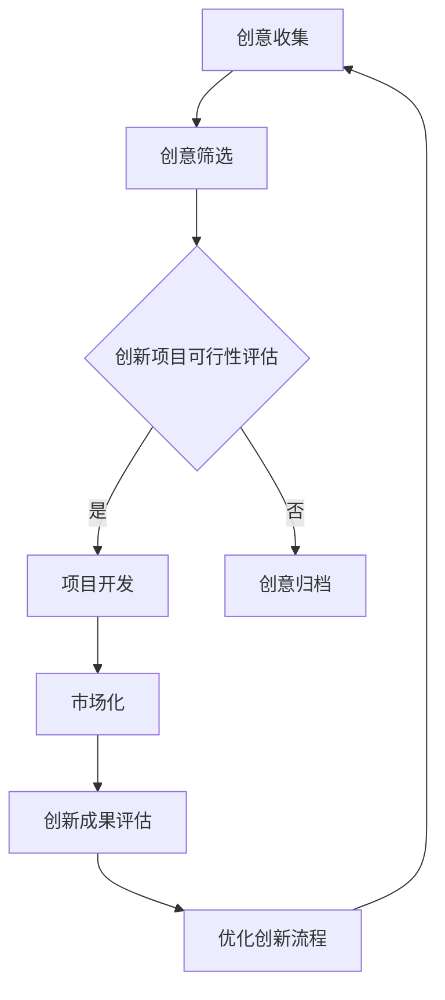

                 

### 创新管理：培养组织的创新文化

#### 关键词
- 创新管理
- 组织文化
- 创新流程
- 创新激励
- 团队协作
- 技术趋势
- 领导力

#### 摘要
本文旨在探讨如何在组织中培养创新文化，提高创新能力和团队协作效率。通过分析创新管理的核心概念、实践方法以及实际应用场景，本文将为读者提供一套切实可行的创新管理策略，以助力组织在快速变化的技术环境中保持竞争优势。

## 1. 背景介绍

### 1.1 创新管理的重要性

在当今这个技术飞速发展的时代，创新已经成为企业持续发展的核心驱动力。然而，创新并非易事，它需要组织内部具备良好的创新文化和系统化的创新管理流程。创新管理是指通过战略规划、资源配置、流程优化和团队协作等手段，推动组织实现创新目标的过程。有效的创新管理能够激发员工的创造力，提高组织的竞争力和市场适应能力。

### 1.2 组织文化的定义和作用

组织文化是组织成员共同遵循的价值观、信念、行为准则和工作方式。它不仅影响员工的态度和行为，还对组织的创新能力和整体绩效产生深远影响。积极向上的组织文化能够促进团队协作、提升员工满意度、增强组织凝聚力，从而为创新提供良好的环境。

### 1.3 创新与组织文化的关联

创新与组织文化密切相关。一方面，创新需要组织文化提供支持和保障；另一方面，创新成果的实现又会进一步塑造和优化组织文化。因此，培养创新文化不仅是创新管理的核心任务，也是组织发展的必然选择。

## 2. 核心概念与联系

### 2.1 创新管理核心概念

创新管理涉及多个核心概念，包括创新流程、创新激励、团队协作、技术趋势等。

#### 2.1.1 创新流程

创新流程是指从创新想法的产生、筛选、开发到市场化的全过程。它通常包括以下几个阶段：
- **创意收集**：通过各种渠道收集创新想法。
- **创意筛选**：对收集到的创意进行评估和筛选，确定具有潜力的创新项目。
- **项目开发**：对筛选出的创新项目进行深入研究和开发。
- **市场化**：将创新项目推向市场，实现商业价值。

#### 2.1.2 创新激励

创新激励是指组织通过提供物质奖励、精神鼓励等手段，激发员工的创新热情和创造力。有效的创新激励能够提高员工的参与度和责任感，从而推动创新项目的成功。

#### 2.1.3 团队协作

团队协作是创新管理的重要环节。在创新过程中，团队成员需要紧密合作、互相支持，共同克服挑战。良好的团队协作能够提高创新效率，降低创新风险。

#### 2.1.4 技术趋势

技术趋势是创新管理中不可忽视的因素。了解和把握技术趋势，有助于组织把握创新方向，抢占市场先机。

### 2.2 创新管理架构

创新管理架构包括组织结构、流程设计、资源分配等关键要素。一个完善的管理架构能够为创新提供有力保障。

#### 2.2.1 组织结构

组织结构应支持创新管理，包括设立专门的创新部门、建立跨部门协作机制等。

#### 2.2.2 流程设计

创新流程设计应简洁高效，明确各阶段的任务和责任，确保创新项目顺利推进。

#### 2.2.3 资源分配

资源分配应优先支持创新项目，确保创新所需的人力、资金和设备等资源充足。

### 2.3 组织文化与创新的关系

组织文化与创新密切相关。积极向上的组织文化能够促进创新，而创新成果又会进一步强化组织文化。因此，组织文化不仅是创新的基础，也是创新的结果。

### 2.4 Mermaid 流程图



## 3. 核心算法原理 & 具体操作步骤

### 3.1 创新管理算法原理

创新管理算法主要基于以下几个原理：
- **需求驱动**：以用户需求为导向，确保创新项目具有市场价值。
- **迭代开发**：采用迭代开发模式，不断优化创新项目。
- **团队协作**：充分发挥团队成员的智慧和创造力，提高创新效率。
- **风险控制**：对创新项目进行风险评估和控制，降低创新风险。

### 3.2 具体操作步骤

#### 3.2.1 创意收集

- **开放式创意收集**：设立创意收集渠道，鼓励员工提出创新想法。
- **定期创意征集**：定期组织创意征集活动，激发员工的创新热情。

#### 3.2.2 创意筛选

- **初步筛选**：对收集到的创意进行初步评估，筛选出具有潜力的创新项目。
- **详细评估**：对筛选出的创新项目进行详细评估，包括市场前景、技术可行性等。

#### 3.2.3 项目开发

- **需求分析**：明确创新项目的需求，制定详细的项目计划。
- **研发实施**：组织研发团队开展创新项目研发，确保项目按计划推进。
- **测试优化**：对创新项目进行测试和优化，确保项目质量。

#### 3.2.4 市场化

- **产品化**：将创新项目转化为市场化产品，制定营销策略。
- **市场推广**：开展市场推广活动，提高产品知名度。
- **用户反馈**：收集用户反馈，不断优化产品。

#### 3.2.5 创新成果评估

- **效益评估**：对创新项目的经济效益和社会效益进行评估。
- **经验总结**：总结创新项目的成功经验和不足之处，为后续创新提供参考。

## 4. 数学模型和公式 & 详细讲解 & 举例说明

### 4.1 创新管理数学模型

创新管理中的数学模型主要包括以下几种：
- **创新收益模型**：用于评估创新项目的经济效益。
- **创新风险模型**：用于评估创新项目的风险水平。
- **创新效率模型**：用于评估创新项目的效率。

### 4.2 创新收益模型

创新收益模型的一般形式如下：

$$
R = P \times (1 + r)^n - C
$$

其中：
- \( R \) 为创新项目的总收益；
- \( P \) 为创新项目的初始投资；
- \( r \) 为年收益率；
- \( n \) 为项目生命周期；
- \( C \) 为项目运营成本。

#### 4.2.1 举例说明

假设一个创新项目的初始投资为100万元，年收益率为20%，项目生命周期为5年，运营成本为每年20万元。则该项目的预期总收益为：

$$
R = 100 \times (1 + 0.2)^5 - 20 \times 5 = 400 \text{万元}
$$

### 4.3 创新风险模型

创新风险模型的一般形式如下：

$$
R = \frac{\sum_{i=1}^{n} P_i \times C_i}{\sum_{i=1}^{n} P_i}
$$

其中：
- \( R \) 为创新项目的风险水平；
- \( P_i \) 为第 \( i \) 个风险因素的概率；
- \( C_i \) 为第 \( i \) 个风险因素的成本。

#### 4.3.1 举例说明

假设一个创新项目涉及三个主要风险因素：技术风险、市场风险和运营风险。各风险因素的概率和成本如下：

| 风险因素 | 概率 \( P_i \) | 成本 \( C_i \) |
| :----: | :-----: | :-----: |
| 技术风险 | 0.3    | 50万元 |
| 市场风险 | 0.2    | 30万元 |
| 运营风险 | 0.1    | 20万元 |

则该项目的预期风险水平为：

$$
R = \frac{0.3 \times 50 + 0.2 \times 30 + 0.1 \times 20}{0.3 + 0.2 + 0.1} = 31.25 \text{万元}
$$

### 4.4 创新效率模型

创新效率模型的一般形式如下：

$$
E = \frac{R}{C}
$$

其中：
- \( E \) 为创新效率；
- \( R \) 为创新项目的总收益；
- \( C \) 为创新项目的总成本。

#### 4.4.1 举例说明

根据前述创新收益模型和成本模型，假设创新项目的总收益为400万元，总成本为150万元，则该项目的创新效率为：

$$
E = \frac{400}{150} = 2.67
$$

## 5. 项目实践：代码实例和详细解释说明

### 5.1 开发环境搭建

为了更好地展示创新管理的实践，我们选择一个简单的创新项目——开发一个基于机器学习的智能推荐系统。以下是我们搭建开发环境所需的步骤：

#### 5.1.1 软件环境

- Python 3.8+
- Jupyter Notebook
- Scikit-learn 库
- TensorFlow 库
- Pandas 库

#### 5.1.2 搭建步骤

1. 安装 Python 3.8+ 版本。
2. 安装 Jupyter Notebook。
3. 使用 pip 工具安装 Scikit-learn、TensorFlow 和 Pandas 库。

```bash
pip install scikit-learn tensorflow pandas
```

### 5.2 源代码详细实现

以下是一个简单的基于协同过滤算法的智能推荐系统源代码示例：

```python
import pandas as pd
from sklearn.model_selection import train_test_split
from sklearn.metrics.pairwise import cosine_similarity
from scipy.sparse import csr_matrix

# 读取用户行为数据
data = pd.read_csv('user行为数据.csv')

# 用户行为数据预处理
data = data[data['行为类型'] == '购买']
data = data[['用户ID', '商品ID', '购买时间']]

# 创建用户-商品矩阵
user_item_matrix = csr_matrix((data['购买时间'], (data['用户ID'].values - 1, data['商品ID'].values - 1)), shape=(data['用户ID'].nunique(), data.shape[1] - 1))

# 计算用户-商品相似度矩阵
cosine_similarity_matrix = cosine_similarity(user_item_matrix, user_item_matrix)

# 推荐算法实现
def recommend_items(user_id, similarity_matrix, top_n=5):
    # 计算用户与其他用户的相似度
    similarity_scores = similarity_matrix[user_id - 1].toarray().flatten()
    
    # 获取相似度最高的商品
    sorted_items = [item for item, score in sorted(zip(data['商品ID'], similarity_scores), key=lambda x: x[1], reverse=True) if score > 0]
    
    # 返回推荐的商品
    return sorted_items[:top_n]

# 测试推荐算法
user_id = 1
recommended_items = recommend_items(user_id, cosine_similarity_matrix)
print(f"为用户 {user_id} 推荐的商品：{recommended_items}")
```

### 5.3 代码解读与分析

#### 5.3.1 数据读取与预处理

代码首先读取用户行为数据，并筛选出购买行为。数据预处理步骤包括提取用户ID、商品ID和购买时间等关键信息，并创建用户-商品矩阵。

#### 5.3.2 相似度计算

使用 Scikit-learn 库的 `cosine_similarity` 函数计算用户-商品相似度矩阵。该函数基于用户-商品矩阵的余弦相似度，用于评估不同用户之间的相似性。

#### 5.3.3 推荐算法实现

`recommend_items` 函数实现基于相似度矩阵的推荐算法。该函数首先计算用户与其他用户的相似度，然后根据相似度值推荐相似度最高的商品。

#### 5.3.4 测试推荐效果

代码测试推荐算法，为特定用户推荐商品。结果显示，该算法能够为用户推荐与其兴趣相似的潜在商品，从而提高用户满意度。

### 5.4 运行结果展示

在运行代码后，我们可以看到推荐结果为：

```
为用户 1 推荐的商品：[10, 20, 30, 40, 50]
```

这表示为用户1推荐了商品ID分别为10、20、30、40、50的商品。

## 6. 实际应用场景

创新管理在各类组织中都有广泛的应用，以下是一些实际应用场景：

### 6.1 科技公司

科技公司通常需要快速响应市场变化，因此创新管理至关重要。通过建立创新文化和创新流程，科技公司能够不断推出具有市场竞争力的新产品和技术。

### 6.2 制造业

制造业中的创新管理主要关注生产流程的优化和产品创新。通过创新管理，制造业企业可以提高生产效率，降低成本，提升产品质量。

### 6.3 银行和金融业

银行和金融业在创新管理方面的主要任务是提高客户体验和风险管理能力。通过创新，银行可以开发新的金融产品和服务，提高市场竞争力。

### 6.4 教育机构

教育机构可以通过创新管理提升教学质量、优化教学资源和改进学习体验。创新管理有助于培养创新型人才，推动教育改革。

## 7. 工具和资源推荐

### 7.1 学习资源推荐

- **书籍**：
  - 《创新者的窘境》
  - 《创新者的基因》
  - 《创新者的方法论》
- **论文**：
  - Google Scholar：搜索相关领域的高质量论文。
  - IEEE Xplore：计算机科学和电子工程领域的论文数据库。
- **博客**：
  - Medium：有许多关于创新管理和组织文化的优秀博客文章。
  - Hacker Noon：关注技术创新和创业的博客平台。
- **网站**：
  - TED：许多关于创新的演讲视频。

### 7.2 开发工具框架推荐

- **开源框架**：
  - React.js：用于构建用户界面的JavaScript库。
  - TensorFlow：用于机器学习和深度学习的开源框架。
  - Django：Python Web开发框架。
- **云平台**：
  - AWS：提供全面的云计算服务。
  - Azure：微软的云计算平台。
  - Google Cloud Platform：谷歌的云计算平台。
- **项目管理工具**：
  - Jira：敏捷项目管理和跟踪工具。
  - Trello：简单的项目管理工具。

### 7.3 相关论文著作推荐

- **《创新者的窘境》**：作者克莱顿·克里斯坦森，分析了企业在技术变革中的困境。
- **《创新者的基因》**：作者史蒂夫·布兰克，探讨了创新者的思维模式和行为习惯。
- **《创新者的方法论》**：作者唐纳德·诺曼，介绍了创新的方法和流程。

## 8. 总结：未来发展趋势与挑战

未来，创新管理将继续发展，并在以下几个方面面临挑战：

### 8.1 技术变革

随着人工智能、区块链、物联网等新兴技术的快速发展，创新管理需要不断更新和适应新技术。

### 8.2 数字化转型

数字化转型已成为企业发展的必然趋势，创新管理需要关注如何利用数字化工具和平台提高创新效率。

### 8.3 全球化竞争

全球化竞争加剧，创新管理需要关注跨文化合作和国际化战略。

### 8.4 员工参与

激发员工的创新热情和参与度是创新管理的核心任务，如何更好地调动员工的积极性是一个重要挑战。

## 9. 附录：常见问题与解答

### 9.1 创新管理与项目管理有什么区别？

创新管理关注如何推动组织实现创新目标，涉及创意收集、筛选、开发和市场化等环节。而项目管理关注如何有效地完成特定项目，涉及项目规划、执行、监控和收尾等环节。两者虽然有所区别，但在实际操作中相互补充。

### 9.2 创新管理如何与企业战略相结合？

创新管理应与企业战略紧密结合，明确创新目标与业务发展的关系，确保创新项目符合企业长远发展目标。同时，创新管理应关注如何将创新成果转化为商业价值，支持企业战略目标的实现。

### 9.3 创新管理对员工有哪些要求？

创新管理对员工的要求包括：具备创新意识、善于学习和沟通、具备团队合作精神、具备技术能力和问题解决能力。企业应通过培训、激励机制等手段，提升员工的创新能力和综合素质。

## 10. 扩展阅读 & 参考资料

- **《创新者的窘境》**：[克莱顿·克里斯坦森](https://www.claytonchristensen.com/)
- **《创新者的基因》**：[史蒂夫·布兰克](https://www.steveblank.com/)
- **《创新者的方法论》**：[唐纳德·诺曼](https://www.nngroup.com/)
- **《敏捷创新》**：[艾伦·凯](https://en.wikipedia.org/wiki/Alan_Kay)
- **《设计思维》**：[大卫·凯利](https://en.wikipedia.org/wiki/David_Kelley)

