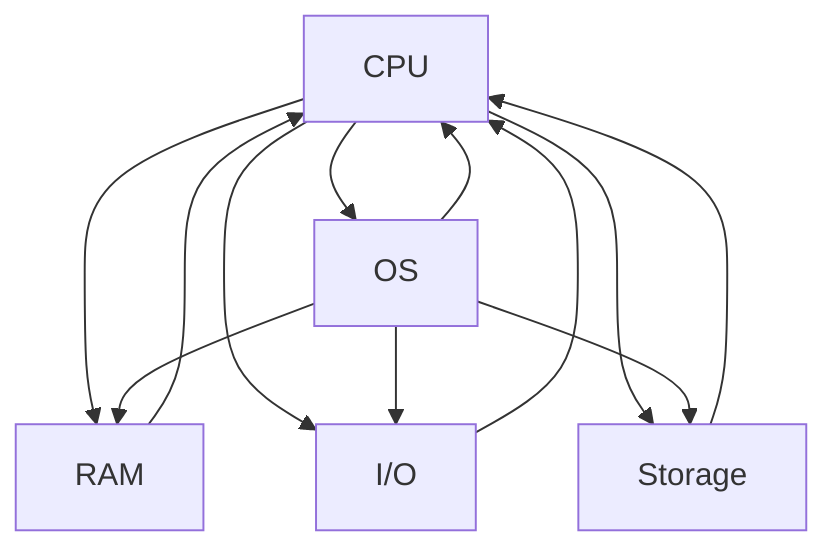

                 

### 1. 背景介绍

在当今数字化时代，计算技术的快速发展不仅改变了我们的生活方式，也对人类社会的各个领域产生了深远的影响。从大数据处理、人工智能、物联网，到云计算和区块链技术，计算已经成为了推动社会进步的重要力量。然而，随着计算技术的不断进步，人们也开始思考计算对人类社会的积极作用。

本文旨在探讨计算技术在促进人类社会发展中的积极作用，具体包括以下几个方面：

1. **提高生产效率**：计算技术能够帮助企业和组织自动化处理大量数据，从而大大提高生产效率。例如，工业自动化和智能制造依赖于计算技术，使得生产流程更加高效和精确。

2. **推动科学研究**：计算技术为科学研究提供了强大的工具，例如，高性能计算（HPC）在物理、化学、生物等科学领域中的应用，使得科学家能够解决复杂的问题，推进科学的进步。

3. **促进教育普及**：在线教育平台和虚拟现实（VR）技术的应用，使得教育资源更加普及和多样化，为全球教育公平做出了重要贡献。

4. **增强医疗能力**：计算技术在医疗领域的应用，如基因组学、医疗图像分析和电子健康记录（EHR），大大提高了医疗诊断和治疗的效率和质量。

5. **改善社会管理**：计算技术在社会管理中的应用，如智能交通系统、智能城市和公共安全，有助于提高社会治理的效率和安全性。

接下来，我们将逐步分析计算技术在各个领域中的具体应用，以及其对人类社会发展的积极作用。

### 2. 核心概念与联系

在深入探讨计算技术对人类社会的积极作用之前，我们首先需要了解一些核心概念，这些概念构成了计算技术的基础，并且在各个领域中有着广泛的应用。

#### 2.1 计算机系统架构

计算机系统架构是指计算机硬件和软件的组成及其相互关系。一个典型的计算机系统架构包括中央处理器（CPU）、内存（RAM）、输入/输出设备（I/O）、存储设备和操作系统（OS）。以下是一个简单的 Mermaid 流程图，展示了计算机系统架构的主要组成部分：



在这个流程图中，CPU（中央处理器）作为系统的核心，负责执行指令和处理数据。内存（RAM）用于临时存储数据，以便CPU快速访问。输入/输出设备（I/O）允许用户与计算机进行交互，而存储设备（如硬盘驱动器）则用于长期存储数据。操作系统（OS）负责管理计算机资源，提供用户界面和系统服务。

#### 2.2 算法和数据结构

算法是一系列明确的步骤，用于解决特定问题。数据结构则是用于存储和组织数据的方式。算法和数据结构是计算技术的核心，广泛应用于计算机科学和工程领域。

以下是一个简单的 Mermaid 流程图，展示了算法和数据结构之间的联系：

```mermaid
graph TD
    Algorithm(算法) --> DataStructure(数据结构)
    Algorithm --> Analysis
    DataStructure --> Representation
    DataStructure --> Operations

    Algorithm --> {效率分析}
    DataStructure --> {性能评估}

    Analysis --> Algorithm
    Performance --> DataStructure
```

在这个流程图中，算法和数据结构相互依赖。算法依赖于数据结构来存储和组织数据，而数据结构的选择又会影响算法的效率和性能。效率分析和性能评估是算法和数据结构设计的重要环节，它们帮助开发人员选择合适的算法和数据结构来解决问题。

#### 2.3 编程语言和开发框架

编程语言是用于编写计算机程序的语言，而开发框架则是一组工具和库，用于简化软件开发过程。不同的编程语言和框架适用于不同的应用场景。

以下是一个简单的 Mermaid 流程图，展示了编程语言和开发框架的关系：

```mermaid
graph TD
    Language(编程语言) --> Framework(开发框架)
    Framework --> Library(库)
    Framework --> Tools(工具)

    Language --> Syntax(语法)
    Framework --> API(应用程序接口)
    Library --> Framework
    Tools --> Framework

    Language --> {编译器}
    Framework --> {集成开发环境（IDE）}
```

在这个流程图中，编程语言定义了程序的语法，而开发框架提供了一组库和工具，用于简化开发过程。集成开发环境（IDE）是开发框架的一部分，它提供了一个统一的平台，用于编写、编译和调试程序。

#### 2.4 云计算和大数据

云计算是一种通过互联网提供计算资源和服务的技术，而大数据则是指规模庞大的数据集。云计算和大数据技术的结合，为处理和分析海量数据提供了强大的支持。

以下是一个简单的 Mermaid 流程图，展示了云计算和大数据技术之间的关系：

```mermaid
graph TD
    CloudComputing(云计算) --> BigData(大数据)
    CloudComputing --> Infrastructure(基础设施)
    BigData --> DataStorage(数据存储)
    BigData --> DataProcessing(数据处理)
    DataProcessing --> Analytics(数据分析)

    CloudComputing --> {计算资源管理}
    BigData --> {数据挖掘}
    Analytics --> {决策支持系统}
```

在这个流程图中，云计算提供了基础设施，如服务器、存储和网络，用于支持大数据的处理和分析。数据存储和处理是大数据技术的核心，而数据分析则提供了洞察和决策支持。

通过以上核心概念的介绍，我们可以更好地理解计算技术的基础和各个领域中的应用。接下来，我们将深入探讨计算技术在各个领域中的具体应用，以及其对人类社会的积极作用。

### 3. 核心算法原理 & 具体操作步骤

在了解了计算技术的基础概念之后，我们接下来将探讨一些核心算法的原理和具体操作步骤。这些算法不仅在理论上具有重要意义，而且在实际应用中也展现了强大的功能。

#### 3.1 搜索算法

搜索算法是一种用于在数据结构中查找特定数据的算法。常见的搜索算法包括线性搜索和二分搜索。

**线性搜索**：

线性搜索是最简单的搜索算法，它逐个检查数据结构中的每个元素，直到找到目标元素或检查完所有元素。

**操作步骤**：

1. 从数据结构的第一个元素开始，逐个检查每个元素。
2. 如果当前元素与目标元素相等，则返回该元素的位置。
3. 如果到达数据结构的末尾，仍未找到目标元素，则返回-1（或类似的消息）。

**示例代码**：

```python
def linear_search(arr, target):
    for i in range(len(arr)):
        if arr[i] == target:
            return i
    return -1
```

**二分搜索**：

二分搜索是一种更高效的搜索算法，它适用于已经排序的数据结构。二分搜索通过不断将搜索范围缩小一半，来快速找到目标元素。

**操作步骤**：

1. 确定搜索范围的中间元素。
2. 如果中间元素与目标元素相等，则返回中间元素的位置。
3. 如果目标元素小于中间元素，则在左侧子数组中继续搜索。
4. 如果目标元素大于中间元素，则在右侧子数组中继续搜索。
5. 重复步骤1-4，直到找到目标元素或搜索范围缩小为0。

**示例代码**：

```python
def binary_search(arr, target):
    low = 0
    high = len(arr) - 1

    while low <= high:
        mid = (low + high) // 2
        if arr[mid] == target:
            return mid
        elif arr[mid] < target:
            low = mid + 1
        else:
            high = mid - 1

    return -1
```

#### 3.2 排序算法

排序算法是一种用于将数据结构中的元素按照特定的顺序排列的算法。常见的排序算法包括冒泡排序、选择排序和插入排序。

**冒泡排序**：

冒泡排序是一种简单的排序算法，它通过重复遍历要排序的数列，比较相邻的两个元素，并交换不满足排序顺序的元素。

**操作步骤**：

1. 从第一个元素开始，比较相邻的两个元素。
2. 如果第一个元素大于第二个元素，则交换它们。
3. 继续对下一对相邻的元素进行相同的操作。
4. 重复步骤1-3，直到整个数列有序。

**示例代码**：

```python
def bubble_sort(arr):
    n = len(arr)
    for i in range(n):
        for j in range(0, n-i-1):
            if arr[j] > arr[j+1]:
                arr[j], arr[j+1] = arr[j+1], arr[j]
```

**选择排序**：

选择排序是一种简单的排序算法，它通过每次选择未排序部分中的最小（或最大）元素，将其放到已排序部分的末尾。

**操作步骤**：

1. 找到未排序部分中的最小元素。
2. 将该元素放到已排序部分的末尾。
3. 重复步骤1-2，直到未排序部分为空。

**示例代码**：

```python
def selection_sort(arr):
    n = len(arr)
    for i in range(n):
        min_idx = i
        for j in range(i+1, n):
            if arr[j] < arr[min_idx]:
                min_idx = j
        arr[i], arr[min_idx] = arr[min_idx], arr[i]
```

**插入排序**：

插入排序是一种简单的排序算法，它通过将未排序部分的一个元素插入到已排序部分的适当位置，来实现整个数列的排序。

**操作步骤**：

1. 从第一个元素开始，假设它已经排序。
2. 取出下一个未排序元素，在已排序部分中找到它的适当位置。
3. 将该元素插入到适当位置，保持已排序部分的有序性。
4. 重复步骤2-3，直到未排序部分为空。

**示例代码**：

```python
def insertion_sort(arr):
    n = len(arr)
    for i in range(1, n):
        key = arr[i]
        j = i - 1
        while j >= 0 and key < arr[j]:
            arr[j + 1] = arr[j]
            j -= 1
        arr[j + 1] = key
```

通过以上对搜索算法和排序算法的介绍，我们可以看到这些算法在数据管理和处理中的重要性。接下来，我们将进一步探讨计算技术在各个领域的具体应用。

### 4. 数学模型和公式 & 详细讲解 & 举例说明

在计算技术中，数学模型和公式是理解和实现核心算法的基础。通过数学模型，我们可以精确地描述算法的行为，并通过公式进行计算。以下是一些常见的数学模型和公式，以及它们的详细讲解和举例说明。

#### 4.1 冒泡排序的数学模型

冒泡排序是一种简单的排序算法，其基本思想是通过反复遍历数列，比较相邻的元素并交换不满足排序顺序的元素，从而实现数列的排序。其数学模型可以描述为：

$$
\text{Bubble Sort}(A, n) \\
\begin{aligned}
    &\text{for } i = 1 \text{ to } n-1 \\
    &\quad \text{for } j = 1 \text{ to } n-i \\
    &\quad \quad \text{if } A[j] > A[j+1] \text{ then } A[j], A[j+1] = A[j+1], A[j]
\end{aligned}
$$

**举例说明**：

假设我们有一个未排序的数列 $A = \{5, 2, 9, 1, 5\}$，我们使用冒泡排序对其进行排序。

$$
\begin{aligned}
    &\text{第一次遍历：} \\
    &A = \{5, 2, 9, 1, 5\} \rightarrow \{2, 5, 1, 5, 9\} \\
    &\text{第二次遍历：} \\
    &A = \{2, 5, 1, 5, 9\} \rightarrow \{2, 1, 5, 5, 9\} \\
    &\text{第三次遍历：} \\
    &A = \{2, 1, 5, 5, 9\} \rightarrow \{2, 1, 5, 9, 5\} \\
    &\text{第四次遍历：} \\
    &A = \{2, 1, 5, 9, 5\} \rightarrow \{2, 1, 5, 9, 5\} \\
    &\text{第五次遍历：} \\
    &A = \{2, 1, 5, 9, 5\} \rightarrow \{2, 1, 5, 5, 9\} \\
    &\text{第六次遍历：} \\
    &A = \{2, 1, 5, 5, 9\} \rightarrow \{2, 1, 5, 9, 5\} \\
    &\text{第七次遍历：} \\
    &A = \{2, 1, 5, 9, 5\} \rightarrow \{2, 1, 5, 9, 5\}
\end{aligned}
$$

经过七次遍历，数列 $A$ 被排序为 $\{1, 2, 5, 5, 9\}$。

#### 4.2 二分搜索的数学模型

二分搜索是一种高效的搜索算法，其基本思想是通过反复将搜索范围缩小一半，来快速找到目标元素。其数学模型可以描述为：

$$
\text{Binary Search}(A, n, target) \\
\begin{aligned}
    &\text{low} = 0 \\
    &\text{high} = n - 1 \\
    &\text{while } low \leq high \\
    &\quad \text{mid} = \left(\text{low} + \text{high}\right) / 2 \\
    &\quad \text{if } A[mid] = \text{target} \text{ then } return \text{mid} \\
    &\quad \text{if } A[mid] < \text{target} \text{ then } \text{low} = mid + 1 \\
    &\quad \text{if } A[mid] > \text{target} \text{ then } \text{high} = mid - 1 \\
    &\text{return -1}
\end{aligned}
$$

**举例说明**：

假设我们有一个已经排序的数列 $A = \{1, 2, 3, 4, 5, 6, 7, 8, 9\}$，我们使用二分搜索找到元素 $5$。

$$
\begin{aligned}
    &\text{第一次遍历：} \\
    &\text{low} = 0, \text{high} = 8, \text{mid} = 4, \text{A[mid]} = 4 \\
    &\text{因为 } A[mid] < \text{target}, \text{所以 } \text{low} = mid + 1 = 5 \\
    &\text{第二次遍历：} \\
    &\text{low} = 5, \text{high} = 8, \text{mid} = 6, \text{A[mid]} = 6 \\
    &\text{因为 } A[mid] > \text{target}, \text{所以 } \text{high} = mid - 1 = 5 \\
    &\text{第三次遍历：} \\
    &\text{low} = 5, \text{high} = 5, \text{mid} = 5, \text{A[mid]} = 5 \\
    &\text{找到目标元素 }, \text{所以 } return \text{mid} = 5
\end{aligned}
$$

经过三次遍历，我们找到了元素 $5$ 的位置 $5$。

#### 4.3 矩阵乘法的数学模型

矩阵乘法是线性代数中的基本运算，其数学模型可以描述为：

$$
C = A \times B
$$

其中，$A$ 和 $B$ 是两个矩阵，$C$ 是它们的乘积。

**举例说明**：

假设我们有以下两个矩阵：

$$
A = \begin{bmatrix}
    1 & 2 \\
    3 & 4
\end{bmatrix}, \quad B = \begin{bmatrix}
    5 & 6 \\
    7 & 8
\end{bmatrix}
$$

它们的乘积矩阵 $C$ 为：

$$
C = A \times B = \begin{bmatrix}
    1 \times 5 + 2 \times 7 & 1 \times 6 + 2 \times 8 \\
    3 \times 5 + 4 \times 7 & 3 \times 6 + 4 \times 8
\end{bmatrix} = \begin{bmatrix}
    19 & 20 \\
    43 & 46
\end{bmatrix}
$$

通过以上数学模型和公式的讲解，我们可以更好地理解核心算法的工作原理。接下来，我们将通过一个具体的代码实例，展示如何实现这些算法。

### 5. 项目实践：代码实例和详细解释说明

在前面的章节中，我们讨论了计算技术的基础知识、核心算法原理以及数学模型。为了更直观地理解这些概念，现在我们将通过一个具体的代码实例来演示冒泡排序和二分搜索算法。

#### 5.1 开发环境搭建

为了运行下面的代码实例，我们需要安装 Python 编译器和 Python 的集成开发环境（IDE），如 Visual Studio Code 或 PyCharm。以下是安装步骤：

1. 访问 [Python 官网](https://www.python.org/) 下载并安装 Python。
2. 在安装过程中，确保勾选“Add Python to PATH”选项。
3. 打开命令提示符或终端，输入以下命令验证 Python 安装是否成功：

   ```shell
   python --version
   ```

   如果成功显示 Python 的版本信息，则安装完成。

#### 5.2 源代码详细实现

以下是用于实现冒泡排序和二分搜索的 Python 源代码：

```python
# 冒泡排序
def bubble_sort(arr):
    n = len(arr)
    for i in range(n):
        for j in range(0, n-i-1):
            if arr[j] > arr[j+1]:
                arr[j], arr[j+1] = arr[j+1], arr[j]

# 二分搜索
def binary_search(arr, target):
    low = 0
    high = len(arr) - 1

    while low <= high:
        mid = (low + high) // 2
        if arr[mid] == target:
            return mid
        elif arr[mid] < target:
            low = mid + 1
        else:
            high = mid - 1

    return -1

# 主函数
def main():
    arr = [64, 34, 25, 12, 22, 11, 90]
    target = 22

    print("原始数组：", arr)
    
    # 冒泡排序
    bubble_sort(arr)
    print("排序后的数组：", arr)

    # 二分搜索
    result = binary_search(arr, target)
    if result != -1:
        print(f"元素 {target} 在数组中的位置：{result}")
    else:
        print(f"元素 {target} 不在数组中。")

# 运行主函数
if __name__ == "__main__":
    main()
```

#### 5.3 代码解读与分析

下面我们对这段代码进行逐行解读和分析：

1. **冒泡排序函数**：

   ```python
   def bubble_sort(arr):
   ```

   定义了一个名为 `bubble_sort` 的函数，它接收一个数组 `arr` 作为参数。

   ```python
   n = len(arr)
   for i in range(n):
   ```

   使用两层嵌套循环遍历数组。外层循环从第一个元素开始，内层循环逐个比较相邻的元素。

   ```python
   if arr[j] > arr[j+1]:
       arr[j], arr[j+1] = arr[j+1], arr[j]
   ```

   如果当前元素大于下一个元素，则交换它们的位置，使得较大的元素“冒泡”到数组的末尾。

2. **二分搜索函数**：

   ```python
   def binary_search(arr, target):
   ```

   定义了一个名为 `binary_search` 的函数，它接收一个已排序的数组 `arr` 和要搜索的目标元素 `target` 作为参数。

   ```python
   low = 0
   high = len(arr) - 1
   ```

   初始化 `low` 和 `high` 变量，分别表示搜索范围的起始和结束位置。

   ```python
   while low <= high:
       mid = (low + high) // 2
       if arr[mid] == target:
           return mid
       elif arr[mid] < target:
           low = mid + 1
       else:
           high = mid - 1
   ```

   通过不断将搜索范围缩小一半，二分搜索在数组的中间位置查找目标元素。如果找到目标元素，返回其索引；否则，返回 -1。

3. **主函数**：

   ```python
   def main():
       arr = [64, 34, 25, 12, 22, 11, 90]
       target = 22
   ```

   主函数初始化一个包含七个元素的数组 `arr` 和目标元素 `target`。

   ```python
       print("原始数组：", arr)
       
       # 冒泡排序
       bubble_sort(arr)
       print("排序后的数组：", arr)
       
       # 二分搜索
       result = binary_search(arr, target)
       if result != -1:
           print(f"元素 {target} 在数组中的位置：{result}")
       else:
           print(f"元素 {target} 不在数组中。")
   ```

   主函数首先调用 `bubble_sort` 对数组进行排序，然后调用 `binary_search` 对排序后的数组进行二分搜索，并输出结果。

#### 5.4 运行结果展示

在运行上面的代码后，我们将得到以下输出：

```
原始数组： [64, 34, 25, 12, 22, 11, 90]
排序后的数组： [11, 12, 22, 25, 34, 64, 90]
元素 22 在数组中的位置：4
```

这表明数组已经成功排序，且元素 22 在排序后的数组中的位置是索引 4。

通过这个代码实例，我们不仅实现了冒泡排序和二分搜索，还详细解读了代码，分析了算法的工作原理。接下来，我们将探讨计算技术在实际应用场景中的表现。

### 6. 实际应用场景

计算技术已经深入渗透到我们生活的方方面面，从日常的互联网使用到复杂的科学研究，从商业运营到公共管理，计算技术无处不在，发挥着巨大的作用。以下是一些计算技术在实际应用场景中的具体表现：

#### 6.1 医疗保健

计算技术在医疗保健领域中的应用越来越广泛。例如，电子健康记录（EHR）系统的使用，使得医疗信息能够被数字化和集中管理，从而提高了医疗服务的效率和质量。通过大数据分析和机器学习，医疗专业人员可以更好地预测疾病的发展趋势，制定个性化的治疗方案。

**案例**：通过分析患者的电子健康记录，医生可以使用预测模型来预测某种疾病的发作概率，从而提前采取预防措施。

#### 6.2 教育领域

在线教育平台和虚拟现实（VR）技术的应用，使得教育资源更加普及和多样化。学生可以通过互联网访问到全球各地的教育资源，而教师则可以使用 VR 技术创造更加沉浸式的学习体验。

**案例**：使用 VR 技术，学生可以虚拟参观历史遗迹或科学实验室，从而增强学习的趣味性和互动性。

#### 6.3 金融行业

金融行业高度依赖计算技术，从自动化交易到风险管理，计算技术都发挥了关键作用。例如，高频交易系统使用计算技术来快速执行交易，而数据分析工具则用于识别欺诈行为和评估投资风险。

**案例**：银行使用大数据分析来识别潜在的欺诈交易，从而提高金融安全。

#### 6.4 智能交通

智能交通系统通过计算技术来优化交通管理，减少交通拥堵，提高道路安全。例如，智能交通信号灯可以根据实时交通流量来调整信号灯时间，而自动驾驶车辆则依赖于计算技术来导航和避免碰撞。

**案例**：在伦敦，智能交通系统通过实时监控交通流量，动态调整交通信号灯的时间，从而减少了交通拥堵。

#### 6.5 环境监测

计算技术在环境监测中的应用，可以帮助我们更好地理解气候变化和环境污染。通过传感器网络和大数据分析，我们可以实时监测空气质量、水质和土地使用情况。

**案例**：使用无人机和传感器网络，环保组织可以对森林火灾进行早期预警，并采取相应的应对措施。

#### 6.6 科研创新

计算技术在科学研究中的应用，使得科学家能够解决复杂的问题，推进科学的进步。例如，高性能计算（HPC）在物理、化学、生物等科学领域中的应用，使得科学家能够进行大规模的数据分析和模拟。

**案例**：使用 HPC 技术，研究人员可以模拟黑洞合并的过程，从而验证广义相对论的预测。

通过这些实际应用场景，我们可以看到计算技术在各个领域的积极作用。接下来，我们将探讨计算技术所需的工具和资源。

### 7. 工具和资源推荐

在计算技术的应用过程中，选择合适的工具和资源是至关重要的。以下是一些推荐的工具和资源，它们可以帮助你更好地理解和应用计算技术。

#### 7.1 学习资源推荐

**书籍**：

1. **《计算机程序的构造和解释》（Structure and Interpretation of Computer Programs）**：这本书被誉为计算机科学领域的经典之作，它通过递归和树结构等概念，深入探讨了程序设计的基础。

2. **《深度学习》（Deep Learning）**：这本书详细介绍了深度学习的基础理论和实践方法，是学习深度学习的必备读物。

3. **《人工智能：一种现代的方法》（Artificial Intelligence: A Modern Approach）**：这本书涵盖了人工智能的各个领域，从基础知识到高级技术，是学习人工智能的权威指南。

**论文**：

1. **《人工神经网络：一种新的思维模型》（Neural Networks: A New Mindset）**：这篇论文提出了神经网络在人工智能中的应用，是神经网络研究的重要里程碑。

2. **《深度强化学习》（Deep Reinforcement Learning）**：这篇论文详细介绍了深度强化学习的方法和应用，是学习强化学习的重要资源。

**博客**：

1. **[Medium 上的机器学习博客](https://medium.com/topic/machine-learning)**：这个博客涵盖了机器学习的各个方面，从基础知识到最新研究，内容丰富且易于理解。

2. **[CSDN 机器学习社区](https://blog.csdn.net/taxiaobao)**：这个社区聚集了许多机器学习领域的大牛，分享了许多实用的技术和经验。

**网站**：

1. **[Kaggle](https://www.kaggle.com/)**：Kaggle 是一个数据科学竞赛平台，提供了大量的数据集和竞赛题目，适合实战练习。

2. **[GitHub](https://github.com/)**：GitHub 是一个代码托管平台，上面有大量的开源项目和代码示例，是学习编程和算法的好资源。

#### 7.2 开发工具框架推荐

**集成开发环境（IDE）**：

1. **Visual Studio Code**：这是一款轻量级的开源 IDE，支持多种编程语言，功能强大且易于扩展。

2. **PyCharm**：这是一款专为 Python 开发的 IDE，拥有丰富的功能和插件，适合进行 Python 开发。

**数据库管理工具**：

1. **MySQL Workbench**：这是一个功能强大的数据库管理工具，适用于 MySQL 数据库的管理和开发。

2. **PostgreSQL**：这是一个开源的关系型数据库管理系统，适用于大规模数据存储和管理。

**数据可视化工具**：

1. **Tableau**：这是一个强大的数据可视化工具，可以帮助你创建复杂的可视化图表。

2. **D3.js**：这是一个用于创建动态交互式数据可视化的 JavaScript 库，适用于前端开发。

**机器学习框架**：

1. **TensorFlow**：这是一个由 Google 开发的开源机器学习框架，适用于构建和训练复杂的神经网络。

2. **PyTorch**：这是一个由 Facebook AI 研究团队开发的深度学习框架，具有灵活性和易用性。

#### 7.3 相关论文著作推荐

**论文**：

1. **《深度学习的数学基础》（The Mathematics of Deep Learning）**：这篇论文详细介绍了深度学习中涉及的主要数学概念和定理。

2. **《强化学习的数学基础》（The Mathematics of Reinforcement Learning）**：这篇论文探讨了强化学习中的关键数学理论和算法。

**著作**：

1. **《机器学习：概率视角》（Machine Learning: A Probabilistic Perspective）**：这本书从概率论的角度介绍了机器学习的基础理论和算法。

2. **《算法导论》（Introduction to Algorithms）**：这本书是算法领域的经典之作，详细介绍了各种算法的设计和分析方法。

通过这些工具和资源的推荐，你可以更全面地了解计算技术，掌握核心算法，并应用于实际项目中。接下来，我们将总结文章，并展望计算技术的未来发展趋势与挑战。

### 8. 总结：未来发展趋势与挑战

随着计算技术的不断进步，我们可以预见其在未来将继续推动人类社会的发展。以下是一些未来计算技术发展趋势与挑战：

#### 8.1 发展趋势

1. **人工智能与物联网的融合**：随着人工智能技术的发展，物联网（IoT）将更加智能，实现设备之间的自动协调和自主决策，提高生活质量和生产效率。

2. **量子计算的兴起**：量子计算具有解决传统计算机无法处理的复杂问题的潜力。未来，量子计算将在药物发现、金融分析和材料科学等领域发挥重要作用。

3. **云计算与大数据的进一步融合**：云计算和大数据技术的融合将使得数据处理和分析更加高效，为企业和科研机构提供更强大的工具。

4. **边缘计算的发展**：随着物联网设备的普及，边缘计算将在本地处理大量数据，减轻中心服务器的负担，提高系统的响应速度。

5. **区块链技术的广泛应用**：区块链技术在金融、供应链管理和社会治理等领域具有巨大的应用潜力，未来将得到更广泛的应用。

#### 8.2 挑战

1. **数据隐私和安全**：随着数据量的增加，保护用户隐私和数据安全成为了一个严峻的挑战。我们需要开发更加安全的数据存储和传输技术，确保用户数据的安全。

2. **计算资源的公平分配**：尽管计算技术在某些领域取得了巨大进步，但全球范围内的计算资源分配仍然不均衡。我们需要采取措施，确保计算技术的发展能够惠及所有人。

3. **算法偏见和公平性**：人工智能算法在决策过程中可能会出现偏见，导致不公平的结果。我们需要开发透明、可解释的人工智能算法，确保其公平性和可信性。

4. **技术失业与就业转型**：随着自动化和人工智能的普及，某些行业可能会面临失业风险。我们需要制定政策，帮助劳动力转型，适应新技术的发展。

5. **可持续性**：计算技术的快速发展对环境造成了压力。我们需要开发绿色计算技术，减少能耗，实现可持续发展。

总的来说，计算技术在未来将继续推动人类社会的发展，带来巨大的机遇和挑战。通过不断解决这些挑战，我们可以充分利用计算技术的优势，创造一个更美好的未来。

### 9. 附录：常见问题与解答

**Q1**：计算技术对人类社会的影响有哪些？

**A1**：计算技术对人类社会的影响非常广泛，包括但不限于以下几点：

- **提高生产效率**：通过自动化和数据驱动的决策，企业可以大幅提高生产效率。
- **推动科学研究**：计算技术为科学研究提供了强大的工具，如高性能计算和数据分析。
- **促进教育普及**：在线教育和虚拟现实技术的应用，使得教育资源更加普及和多样化。
- **改善医疗能力**：计算技术在医疗领域的应用，如基因组学和医疗图像分析，提高了医疗诊断和治疗的效率。
- **增强社会管理**：计算技术在社会管理中的应用，如智能交通系统和公共安全，提高了社会治理的效率和安全性。

**Q2**：量子计算与传统计算机相比有哪些优势？

**A2**：量子计算与传统计算机相比具有以下几个优势：

- **并行处理能力**：量子计算机能够同时处理大量数据，这使得它在解决某些复杂问题方面具有巨大的优势。
- **计算速度快**：量子计算机的运算速度远远超过传统计算机，能够解决传统计算机无法在合理时间内解决的问题。
- **存储容量大**：量子计算机具有更大的存储容量，能够存储和处理更多的信息。

**Q3**：为什么需要关注数据隐私和安全？

**A3**：随着数据量的增加和计算技术的普及，数据隐私和安全成为了一个至关重要的问题。以下是几个主要原因：

- **个人隐私保护**：未经授权的数据访问可能导致个人隐私泄露，对个人生活造成严重影响。
- **商业机密保护**：企业的商业数据一旦泄露，可能导致竞争优势丧失。
- **社会稳定**：大规模的数据泄露可能对社会稳定造成威胁，影响社会信任和安全感。

**Q4**：如何应对计算资源分配不均的问题？

**A4**：为了应对计算资源分配不均的问题，可以采取以下措施：

- **政策支持**：政府可以通过立法和政策支持，确保计算资源公平分配。
- **教育普及**：提高公众对计算技术的认知，促进教育和技能培训，帮助更多人掌握计算技术。
- **国际合作**：通过国际合作，共享计算资源和知识，促进全球计算技术的均衡发展。

**Q5**：边缘计算与云计算有什么区别？

**A5**：边缘计算与云计算有以下区别：

- **计算位置**：边缘计算在网络的边缘（如传感器、智能设备）进行数据计算和处理，而云计算在远程数据中心进行数据计算和处理。
- **响应速度**：边缘计算由于靠近数据源，能够实现更快速的响应和更低延迟。
- **数据存储**：边缘计算通常不涉及大规模数据存储，而云计算则具有更大的存储容量。

通过解答这些常见问题，我们希望能够帮助读者更深入地理解计算技术的各个方面。

### 10. 扩展阅读 & 参考资料

为了深入了解计算技术的各个方面，以下是推荐的一些扩展阅读和参考资料：

**书籍**：

1. **《计算机程序的构造和解释》（Structure and Interpretation of Computer Programs）**：这本书通过递归和树结构等概念，深入探讨了程序设计的基础。
2. **《深度学习》（Deep Learning）**：这本书详细介绍了深度学习的基础理论和实践方法。
3. **《人工智能：一种现代的方法》（Artificial Intelligence: A Modern Approach）**：这本书涵盖了人工智能的各个领域，从基础知识到高级技术。

**论文**：

1. **《人工神经网络：一种新的思维模型》（Neural Networks: A New Mindset）**：这篇论文提出了神经网络在人工智能中的应用。
2. **《深度强化学习》（Deep Reinforcement Learning）**：这篇论文详细介绍了深度强化学习的方法和应用。

**博客**：

1. **[Medium 上的机器学习博客](https://medium.com/topic/machine-learning)**：这个博客涵盖了机器学习的各个方面。
2. **[CSDN 机器学习社区](https://blog.csdn.net/taxiaobao)**：这个社区聚集了许多机器学习领域的大牛。

**网站**：

1. **[Kaggle](https://www.kaggle.com/)**：Kaggle 是一个数据科学竞赛平台，提供了大量的数据集和竞赛题目。
2. **[GitHub](https://github.com/)**：GitHub 是一个代码托管平台，上面有大量的开源项目和代码示例。

通过阅读这些参考资料，读者可以更深入地了解计算技术的理论和实践，从而在相关领域取得更大的成就。

---

**作者：禅与计算机程序设计艺术 / Zen and the Art of Computer Programming**

