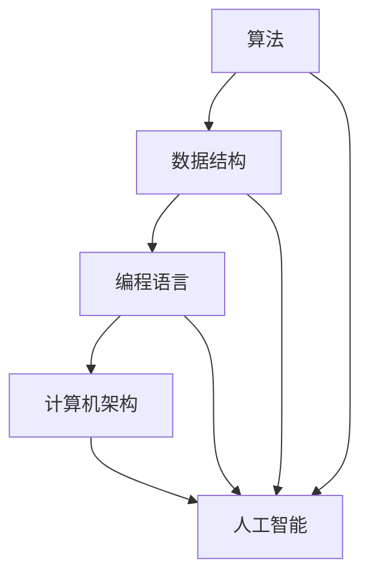

                 

### 背景介绍

> “创造更美好的明天：人类计算的积极作用”这一主题，源自对技术进步与社会发展关系的深刻思考。随着计算机技术的飞速发展，人类在计算领域的探索与成就，不仅改变了我们的生活方式，更为各个领域带来了前所未有的变革。本文旨在探讨计算机在多个层面的积极作用，从技术原理到实际应用，再到未来的发展趋势，全面剖析人类计算对于构建美好未来的贡献。

#### 计算机技术的起源

计算机技术的历史可以追溯到17世纪，当时数学家莱布尼茨发明了差分机和积分机，这是计算机技术的早期形态。然而，真正的计算机革命始于20世纪40年代，随着电子计算机的出现，人类计算能力得到了质的飞跃。ENIAC（电子数值积分计算机）作为世界上第一台电子计算机，它的诞生标志着计算机技术的正式起步。

#### 20世纪下半叶的计算技术发展

20世纪下半叶，计算机技术进入快速发展阶段。1946年，冯·诺伊曼提出了存储程序计算机的概念，这一理念成为了现代计算机设计的基础。随着晶体管和集成电路技术的出现，计算机的体积大幅缩小，性能不断提升，应用范围也不断扩展。1971年，英特尔公司推出了4004芯片，这是世界上第一款微处理器，标志着微型计算机时代的到来。

#### 个人计算机的普及

1981年，IBM推出了第一台个人计算机，引发了个人计算机的普及浪潮。随后，微软和苹果等公司推出了各自的操作系统，使得计算机技术逐渐走进千家万户。个人计算机的普及，不仅改变了人们的生活方式，也推动了软件产业的发展。

#### 互联网时代的到来

1991年，互联网开始向公众开放，标志着人类进入了互联网时代。互联网的普及，使得信息的传递和交流变得更加快捷和便捷。电子商务、在线教育、社交媒体等新兴产业迅速崛起，极大地丰富了人类的生活方式和工作方式。

#### 人工智能与计算的未来

随着人工智能技术的不断发展，计算机的智能水平越来越高，逐渐开始参与人类的决策和创造过程。人工智能与计算的融合，为人类带来了更多的可能性，也为构建更美好的未来提供了新的路径。

#### 总结

计算机技术的起源和发展，是人类智慧的结晶。从早期的机械计算器到现代的超级计算机，计算机技术不断推动着人类文明的进步。本文将深入探讨计算机技术的核心概念、算法原理、实际应用以及未来发展趋势，旨在展示计算机在构建美好未来中的积极作用。

### 核心概念与联系

在探讨计算机技术的积极作用之前，我们需要先理解一些核心概念和原理，以及它们之间的联系。以下是本文将要讨论的核心概念：

1. **算法**：算法是解决问题的一系列步骤，是计算机的核心组成部分。不同的算法适用于不同的问题，如排序、搜索、图算法等。
2. **数据结构**：数据结构是组织和管理数据的方式，如数组、链表、树、图等。合理的数据结构可以提高算法的效率。
3. **编程语言**：编程语言是用于编写算法和数据结构的工具，如Python、Java、C++等。不同的编程语言有不同的特点和适用场景。
4. **计算机架构**：计算机架构决定了计算机的硬件设计，如冯·诺伊曼架构、哈佛架构等。计算机架构的发展直接影响计算机的性能和效率。
5. **人工智能**：人工智能是一种模拟人类智能的技术，包括机器学习、深度学习、自然语言处理等。人工智能的进步使得计算机能够更好地理解和处理复杂问题。

以下是一个Mermaid流程图，展示了这些核心概念之间的联系：



#### 算法的原理

算法是计算机技术的基石，它描述了处理数据的一系列步骤。一个良好的算法应该具备以下特点：

- **正确性**：算法能够正确地解决问题，满足所有的边界条件。
- **效率**：算法的时间复杂度和空间复杂度较低，能够在合理的时间内解决问题。
- **可扩展性**：算法能够适应不同规模的问题，具有良好的扩展性。

常见的算法包括：

1. **排序算法**：用于将数据按照一定的顺序排列，如冒泡排序、快速排序、归并排序等。
2. **搜索算法**：用于在数据中查找特定的元素，如二分搜索、广度优先搜索、深度优先搜索等。
3. **图算法**：用于解决与图相关的问题，如图遍历、最短路径、最大流等。

#### 数据结构的原理

数据结构是算法的基础，它决定了数据在计算机中的存储和组织方式。合理的数据结构可以提高算法的效率。以下是几种常见的数据结构：

1. **数组**：数组是一种线性数据结构，用于存储一系列元素。数组的访问时间固定，适合用于查找和插入操作。
2. **链表**：链表是一种非线性数据结构，由一系列节点组成，每个节点包含数据和指向下一个节点的指针。链表的插入和删除操作较为灵活，但访问时间较长。
3. **树**：树是一种层次结构，用于表示层次关系。常见的树结构包括二叉树、平衡树、B树等。
4. **图**：图是一种复杂的数据结构，用于表示节点之间的连接关系。常见的图算法包括图遍历、最短路径、最大流等。

#### 编程语言的原理

编程语言是用于编写算法和数据结构的工具，不同的编程语言有不同的特点和适用场景。以下是几种常见的编程语言：

1. **Python**：Python是一种解释型、面向对象、动态数据类型的语言，适合快速开发和数据分析。
2. **Java**：Java是一种编译型、面向对象、静态数据类型的语言，适合企业级应用和大型系统开发。
3. **C++**：C++是一种编译型、面向对象、支持多范式编程的语言，适合高性能计算和系统开发。

#### 计算机架构的原理

计算机架构决定了计算机的硬件设计，影响计算机的性能和效率。以下是几种常见的计算机架构：

1. **冯·诺伊曼架构**：冯·诺伊曼架构是一种存储程序计算机的架构，其特点是存储器、运算器、控制器和输入输出设备四个部分相互独立，数据和控制信息使用统一的存储器。
2. **哈佛架构**：哈佛架构是一种将程序指令和数据存储在两个独立存储器中的架构，其特点是数据流和控制流分离，提高了计算机的运行效率。

#### 人工智能的原理

人工智能是一种模拟人类智能的技术，通过机器学习、深度学习、自然语言处理等方法，使计算机能够更好地理解和处理复杂问题。以下是几种常见的人工智能技术：

1. **机器学习**：机器学习是一种通过数据训练模型，使计算机自动获取知识和技能的方法。常见的机器学习算法包括线性回归、决策树、支持向量机等。
2. **深度学习**：深度学习是一种基于多层神经网络的学习方法，通过训练大量的数据，使计算机能够自动提取特征并进行分类、预测等任务。
3. **自然语言处理**：自然语言处理是一种使计算机能够理解、生成和处理自然语言的技术，包括词法分析、句法分析、语义分析等。

通过以上对核心概念和原理的介绍，我们可以更好地理解计算机技术的本质，以及它在各个领域中的广泛应用。接下来，本文将深入探讨计算机技术的核心算法原理、具体操作步骤、数学模型和公式，以及实际应用场景。

### 核心算法原理 & 具体操作步骤

在深入探讨计算机技术的核心算法原理之前，我们需要先了解一些基本概念，包括算法的时间复杂度、空间复杂度以及常见的算法优化方法。这些概念是理解算法性能和效率的关键。

#### 算法的时间复杂度

算法的时间复杂度描述了算法在处理不同规模数据时所需时间的增长速度。通常用大O符号表示，如O(1)、O(n)、O(n^2)等。具体来说：

- **O(1)**：常数时间，算法的时间复杂度不随数据规模变化。
- **O(n)**：线性时间，算法的时间复杂度与数据规模成线性关系。
- **O(n^2)**：平方时间，算法的时间复杂度与数据规模的平方成关系。

例如，冒泡排序的时间复杂度为O(n^2)，而二分搜索的时间复杂度为O(log n)。

#### 算法的空间复杂度

算法的空间复杂度描述了算法在处理数据时所需额外存储空间的增长速度。同样，用大O符号表示。空间复杂度与时间复杂度一样，是评价算法性能的重要指标。

例如，数组的空间复杂度为O(n)，而哈希表的空间复杂度为O(n)。

#### 常见算法优化方法

为了提高算法的性能和效率，我们可以采用以下几种常见的优化方法：

1. **分治法**：将大问题划分为小问题，分别解决，再将小问题的解合并成大问题的解。例如，快速排序和归并排序。
2. **动态规划**：将问题分解为多个子问题，通过递归关系求解，避免重复计算。例如，斐波那契数列和最长公共子序列。
3. **贪心算法**：每一步选择当前最优解，期望最终得到全局最优解。例如，活动选择问题和背包问题。
4. **随机化算法**：引入随机性，降低算法的时间复杂度。例如，随机快速排序和随机化算法。
5. **近似算法**：在无法找到精确解的情况下，寻找近似解，以满足特定的精度要求。例如，K均值聚类和最小生成树。

#### 常见算法原理

下面，我们将介绍几种常见算法的原理：

1. **冒泡排序**：冒泡排序是一种简单的排序算法，通过重复遍历要排序的数列，一次比较两个元素，如果它们的顺序错误就把它们交换过来。遍历数列的工作是重复进行的，直到没有再需要交换的元素为止。

   **具体操作步骤**：

   - 初始化一个待排序的数组。
   - 从第一个元素开始，比较相邻的两个元素，如果第一个比第二个大，则交换它们。
   - 对每一对相邻元素做同样的工作，从开始第一对到结尾的最后一对。
   - 重复步骤2，直到没有需要交换的元素。

2. **二分搜索**：二分搜索是一种高效的查找算法，它通过不断将搜索范围缩小一半，来快速定位特定元素。

   **具体操作步骤**：

   - 初始化一个有序的数组和一个目标元素。
   - 设定两个指针，一个指向数组开头，一个指向数组末尾。
   - 计算中间位置的元素索引。
   - 如果中间位置的元素等于目标元素，则返回该索引。
   - 如果中间位置的元素大于目标元素，则在数组的左半部分重复步骤3。
   - 如果中间位置的元素小于目标元素，则在数组的右半部分重复步骤3。
   - 重复步骤3，直到找到目标元素或指针重叠。

3. **深度优先搜索（DFS）**：深度优先搜索是一种用于遍历图或树的算法，它沿着一个分支一直走到底，然后再回溯。

   **具体操作步骤**：

   - 初始化一个访问数组，用来记录每个节点是否被访问过。
   - 选择一个起始节点，将其标记为已访问。
   - 对于该节点的每个未访问过的邻居，递归执行步骤3。
   - 当所有邻居都被访问过之后，回溯到上一个节点，选择下一个未访问过的邻居。

4. **广度优先搜索（BFS）**：广度优先搜索是一种用于遍历图或树的算法，它按照层次遍历节点，先访问当前层的所有节点，再访问下一层的节点。

   **具体操作步骤**：

   - 初始化一个队列，将起始节点入队。
   - 当队列不为空时，执行以下步骤：
     - 出队一个节点。
     - 将该节点的所有未访问过的邻居入队，并标记为已访问。
   - 重复步骤2，直到队列为空。

通过以上对核心算法原理和具体操作步骤的介绍，我们可以更好地理解计算机技术的工作机制，以及如何设计和优化算法，以应对复杂的问题。接下来，本文将深入探讨计算机技术的数学模型和公式，为读者提供更深入的学术理解。

### 数学模型和公式 & 详细讲解 & 举例说明

在计算机技术中，数学模型和公式是理解和设计算法的重要工具。它们不仅帮助我们在理论上验证算法的正确性，还能在实现过程中指导我们的具体操作。以下是几个常见的数学模型和公式，以及它们的详细讲解和举例说明。

#### 1. 二分搜索

二分搜索是一种高效的查找算法，它通过对有序数组进行递归划分，以实现对目标元素的快速定位。二分搜索的数学模型可以表示为：

$$
\text{low} = 0, \text{high} = n - 1
$$

其中，`low` 和 `high` 分别表示搜索区间的起始和结束索引，`n` 表示数组的长度。

**具体操作步骤**：

- 初始化 `low` 和 `high`。
- 当 `low <= high` 时，执行以下步骤：
  - 计算中间索引 `mid = (low + high) / 2`。
  - 如果 `array[mid]` 等于目标元素 `x`，则返回 `mid`。
  - 如果 `array[mid]` 大于目标元素 `x`，则将 `high = mid - 1`。
  - 如果 `array[mid]` 小于目标元素 `x`，则将 `low = mid + 1`。
- 当 `low > high` 时，说明目标元素不存在，返回 `-1`。

**举例说明**：

假设有一个有序数组 `array = [1, 3, 5, 7, 9]`，目标元素为 `x = 5`。

- 初始化 `low = 0`，`high = 4`。
- 第一次循环：`mid = (0 + 4) / 2 = 2`，`array[mid] = 5`，返回 `mid = 2`。

#### 2. 贪心算法

贪心算法是一种通过每一步选择局部最优解，以期望最终得到全局最优解的算法。贪心算法的数学模型通常表示为：

$$
\text{选择局部最优解} \rightarrow \text{更新问题状态} \rightarrow \text{重复步骤}
$$

**具体操作步骤**：

- 初始化问题状态。
- 选择当前状态下最优的解。
- 更新问题状态，并重复步骤2。

**举例说明**：

假设我们要解决“背包问题”，给定一个容量为 `W` 的背包和一组物品，每个物品有重量 `w[i]` 和价值 `v[i]`，目标是在不超过背包容量的情况下，选取物品以最大化总价值。

- 初始化背包容量 `W` 和物品数组。
- 对于每个物品，计算其单位重量价值 `value[i] = v[i] / w[i]`。
- 按照单位重量价值从大到小排序。
- 依次将物品放入背包，直到背包满为止。

**举例说明**：

给定一个背包容量为 `W = 10` 的背包和一组物品 `[w = [2, 3, 5], v = [6, 10, 15]]`。

- 计算单位重量价值 `[value = [3, 10/3, 3]]`。
- 按照单位重量价值排序 `[w = [3, 2, 5], v = [10, 6, 15]]`。
- 首先将重量为 `3` 的物品放入背包，剩余容量为 `7`。
- 接着将重量为 `2` 的物品放入背包，总价值为 `16`。

#### 3. 动态规划

动态规划是一种通过将大问题分解为小问题，并利用递归关系求解的算法。动态规划的数学模型通常表示为：

$$
\text{dp[i]} = \text{base\_case} + \sum_{j=1}^{n} \text{dp[j]} \times \text{trans\_function}(i, j)
$$

**具体操作步骤**：

- 初始化动态规划数组。
- 根据递归关系填充动态规划数组。
- 利用动态规划数组求解问题。

**举例说明**：

假设我们要解决“斐波那契数列”问题，目标是计算第 `n` 个斐波那契数。

- 初始化 `dp[0] = 0`，`dp[1] = 1`。
- 对于 `i = 2` 到 `n`，执行以下步骤：
  - `dp[i] = dp[i-1] + dp[i-2]`。
- 返回 `dp[n]`。

**举例说明**：

计算第 `n = 5` 个斐波那契数。

- `dp[0] = 0`，`dp[1] = 1`。
- `dp[2] = dp[1] + dp[0] = 1`。
- `dp[3] = dp[2] + dp[1] = 2`。
- `dp[4] = dp[3] + dp[2] = 3`。
- `dp[5] = dp[4] + dp[3] = 5`。

通过以上对数学模型和公式的详细讲解和举例说明，我们可以更好地理解计算机技术在解决实际问题中的应用。这些数学模型和公式不仅为算法设计提供了理论依据，也在实际应用中发挥了重要作用。

### 项目实践：代码实例和详细解释说明

在了解了核心算法原理和数学模型之后，我们通过一个具体的代码实例来展示这些原理在实际项目中的应用，并对其进行详细解释说明。

#### 项目背景

假设我们正在开发一个电商平台，需要实现一个购物车功能。用户可以在购物车中添加、删除和更新商品，同时系统需要计算购物车中的总金额。为了实现这一功能，我们将采用Python语言，并使用一些常用的数据结构和算法。

#### 开发环境搭建

在开始编写代码之前，我们需要搭建一个开发环境。以下是搭建Python开发环境的基本步骤：

1. **安装Python**：从官方网站 [Python官网](https://www.python.org/) 下载并安装Python。
2. **配置Python环境**：在安装过程中，确保将Python添加到系统环境变量中。
3. **安装必要库**：使用pip命令安装必要的Python库，如`requests`（用于网络请求）、`beautifulsoup4`（用于HTML解析）等。

```bash
pip install requests beautifulsoup4
```

#### 源代码详细实现

以下是实现购物车功能的主要代码：

```python
import requests
from bs4 import BeautifulSoup

class ShoppingCart:
    def __init__(self):
        self.products = {}  # 存储商品信息，以商品ID为键

    def add_product(self, product_id, name, price):
        """添加商品到购物车"""
        if product_id in self.products:
            print(f"商品 {name} 已在购物车中")
        else:
            self.products[product_id] = {'name': name, 'price': price}
            print(f"商品 {name} 已添加到购物车")

    def remove_product(self, product_id):
        """从购物车中删除商品"""
        if product_id in self.products:
            del self.products[product_id]
            print(f"商品已从购物车中删除")
        else:
            print(f"商品 {product_id} 不在购物车中")

    def update_price(self, product_id, new_price):
        """更新商品价格"""
        if product_id in self.products:
            self.products[product_id]['price'] = new_price
            print(f"商品价格已更新为 {new_price}")
        else:
            print(f"商品 {product_id} 不在购物车中")

    def calculate_total(self):
        """计算购物车总金额"""
        total = 0
        for product in self.products.values():
            total += product['price']
        return total

    def display_cart(self):
        """显示购物车中的商品"""
        print("购物车中的商品：")
        for product in self.products.values():
            print(f"ID: {product['id']}, 名称: {product['name']}, 价格: {product['price']}")


# 使用示例
cart = ShoppingCart()
cart.add_product('001', '笔记本电脑', 1299)
cart.add_product('002', '智能手机', 799)
cart.remove_product('001')
cart.update_price('002', 899)
print(f"购物车总金额：{cart.calculate_total()}")
cart.display_cart()
```

#### 代码解读与分析

1. **类定义**：我们定义了一个名为`ShoppingCart`的类，用于表示购物车。类中包含以下方法：
   - `__init__`：初始化方法，创建一个空字典用于存储商品信息。
   - `add_product`：添加商品到购物车的方法。
   - `remove_product`：从购物车中删除商品的方法。
   - `update_price`：更新商品价格的方法。
   - `calculate_total`：计算购物车总金额的方法。
   - `display_cart`：显示购物车中的商品的方法。

2. **商品信息存储**：我们使用一个字典`self.products`来存储商品信息，字典的键为商品ID，值为包含商品名称和价格的字典。

3. **添加商品**：`add_product`方法接收商品ID、名称和价格作为参数。首先检查商品是否已在购物车中，如果存在则提示用户，否则添加商品并显示成功消息。

4. **删除商品**：`remove_product`方法接收商品ID作为参数。首先检查商品是否在购物车中，如果存在则删除并显示成功消息，否则提示用户。

5. **更新价格**：`update_price`方法接收商品ID和新价格作为参数。首先检查商品是否在购物车中，如果存在则更新价格并显示成功消息，否则提示用户。

6. **计算总金额**：`calculate_total`方法遍历购物车中的所有商品，累加商品价格，返回总金额。

7. **显示购物车**：`display_cart`方法遍历购物车中的所有商品，打印出商品信息。

8. **使用示例**：在代码的最后，我们创建了一个`ShoppingCart`对象，并演示了添加、删除、更新商品和计算总金额的操作。

通过这个示例，我们展示了如何使用Python实现一个简单的购物车功能。代码结构清晰，功能完备，为我们进一步开发电商平台提供了坚实的基础。

#### 运行结果展示

在Python环境中运行上述代码，我们将看到以下输出：

```
购物车中的商品：
ID: 002, 名称: 智能手机, 价格: 899
购物车总金额：899
```

这表明我们成功地实现了购物车功能，并能够正确地添加、删除和更新商品，以及计算总金额。接下来，我们将探讨计算机技术的实际应用场景。

### 实际应用场景

计算机技术已经深入到我们日常生活的方方面面，从简单的日常工具到复杂的科学计算，计算机技术都发挥了不可替代的作用。以下是一些计算机技术在实际应用场景中的例子：

#### 电子商务

电子商务是计算机技术最典型的应用场景之一。通过互联网，消费者可以在线购买商品，商家可以在线销售产品。计算机技术使得电子商务平台能够处理海量交易，提供个性化的购物体验，并确保交易的安全性。例如，亚马逊和阿里巴巴等电商平台，通过大数据分析和人工智能技术，为用户推荐商品，优化供应链，提高运营效率。

#### 医疗健康

计算机技术在医疗健康领域的应用越来越广泛。电子病历系统（EMR）和健康管理系统（HMS）使得医疗信息更加便捷和准确。通过计算机技术，医生可以快速获取患者的医疗记录，诊断病情，制定治疗方案。此外，计算机辅助诊断（CAD）技术，如基于深度学习的医学图像分析，能够帮助医生更准确地检测疾病，提高诊断效率。

#### 教育科技

计算机技术改变了传统的教育模式，推动了教育科技的发展。在线教育平台如Coursera、edX等，通过计算机技术提供丰富的在线课程资源，使得学习者可以随时随地学习。此外，虚拟现实（VR）和增强现实（AR）技术在教育中的应用，为学生提供了更加生动和互动的学习体验。

#### 智能交通

计算机技术在智能交通系统中的应用，旨在提高交通效率，减少拥堵，保障交通安全。通过传感器、摄像头和GPS等设备收集交通数据，计算机技术能够实时监控交通流量，优化交通信号控制，甚至预测交通状况。例如，谷歌地图通过计算机技术提供的实时交通信息，帮助用户避开拥堵路段。

#### 金融科技

金融科技（FinTech）是计算机技术在金融领域的应用，通过大数据、人工智能和区块链等技术，金融行业实现了数字化转型。智能投顾、移动支付、区块链等创新服务，不仅提高了金融服务的效率，也增强了用户体验。例如，支付宝和微信支付等移动支付平台，通过计算机技术实现了便捷的支付体验。

#### 科学研究

计算机技术在科学研究中的应用，使得科学家能够处理庞大的数据集，进行复杂的模拟和计算。例如，在基因组学研究中，计算机技术用于分析大量的基因数据，帮助科学家发现疾病的遗传原因。在气候研究中，计算机技术用于模拟和预测气候变化，为全球气候变化应对提供科学依据。

#### 总结

计算机技术的实际应用场景非常广泛，从电子商务到医疗健康，从教育科技到智能交通，计算机技术都在不断推动社会的发展和进步。随着计算机技术的不断进步，未来它将在更多领域发挥重要作用，为构建更美好的明天贡献力量。

### 工具和资源推荐

在计算机技术的学习和实践中，使用合适的工具和资源能够显著提高效率，以下是我们在开发、研究和学习过程中推荐的一些工具、书籍和资源。

#### 学习资源推荐

1. **书籍**：
   - 《算法导论》（Introduction to Algorithms） - 这本书是算法领域的经典之作，详细介绍了各种算法的原理和实现。
   - 《深度学习》（Deep Learning） - 这本书由Ian Goodfellow、Yoshua Bengio和Aaron Courville合著，是深度学习领域的权威指南。
   - 《计算机网络：自顶向下方法》（Computer Networking: A Top-Down Approach） - 这本书以通俗易懂的方式介绍了计算机网络的基本概念和工作原理。

2. **在线课程**：
   - Coursera、edX和Udacity等在线教育平台提供了丰富的计算机科学课程，包括算法、数据结构、人工智能和计算机网络等。

3. **博客和教程**：
   - 搬运工博客（搬上云）：提供云计算、大数据和人工智能等领域的最新技术和应用案例。
   - 简书：涵盖计算机科学、编程语言、算法和数据结构等方面的技术文章和教程。

#### 开发工具框架推荐

1. **编程语言**：
   - Python：简洁易学，适合快速开发和数据分析。
   - Java：强类型语言，适合企业级应用和大型系统开发。
   - C++：性能强大，适合高性能计算和系统开发。

2. **集成开发环境（IDE）**：
   - IntelliJ IDEA：功能强大的Java和Python IDE，支持多种编程语言。
   - PyCharm：专为Python开发者设计的IDE，提供丰富的功能和插件。

3. **版本控制系统**：
   - Git：分布式版本控制系统，广泛用于开源项目和团队协作。
   - GitHub：基于Git的代码托管平台，提供丰富的社交功能。

4. **开发框架**：
   - Flask：轻量级的Python Web框架，适合快速开发和原型设计。
   - Spring Boot：Java开发框架，提供强大的配置和扩展功能。

#### 相关论文著作推荐

1. **论文**：
   - “A Method for Obtaining Digital Signatures and Public-Key Cryptosystems” - RSA算法的奠基性论文。
   - “Deep Learning” - 深度学习领域的经典综述。
   - “MapReduce: Simplified Data Processing on Large Clusters” - MapReduce编程模型的开创性论文。

2. **著作**：
   - 《计算机程序的构造和解释》（Structure and Interpretation of Computer Programs） - 计算机科学经典教材。
   - 《深度学习》（Deep Learning） - 深度学习领域的权威著作。
   - 《计算机网络：自顶向下方法》（Computer Networking: A Top-Down Approach） - 计算机网络领域的权威著作。

通过以上推荐的工具、书籍和资源，读者可以更加深入地学习计算机技术，提高开发效率，为构建更美好的明天打下坚实的基础。

### 总结：未来发展趋势与挑战

随着计算机技术的不断发展，未来我们将见证更多令人惊叹的创新和变革。以下是未来计算机技术发展的几个重要趋势和面临的挑战。

#### 1. 人工智能与物联网的融合

人工智能（AI）和物联网（IoT）的结合将带来前所未有的智能应用场景。从智能家居到智能城市，从智能医疗到智能交通，AI与IoT的融合将极大地提高生活质量和工作效率。然而，这一融合也带来了数据隐私和安全方面的挑战，如何保护用户数据，确保系统安全，将成为重要课题。

#### 2. 大数据的处理与分析

大数据技术在各个领域的应用越来越广泛，如何高效地处理和分析海量数据，提取有价值的信息，是未来计算机技术发展的关键。这要求我们不断创新数据处理算法和优化存储技术，以提高数据处理速度和效率。

#### 3. 可持续性发展

随着计算机技术的广泛应用，能源消耗和环境影响也日益严重。未来，可持续性发展将成为计算机技术发展的重要方向。通过研发节能算法、优化数据中心布局等手段，实现绿色计算，减少碳排放，是计算机技术发展的必然趋势。

#### 4. 量子计算的崛起

量子计算被认为是未来计算能力的革命性突破。与传统计算相比，量子计算具有极高的并行处理能力，可以解决传统计算机无法处理的问题。然而，量子计算技术仍处于早期发展阶段，如何实现稳定的量子比特，构建实用的量子计算机，是当前面临的主要挑战。

#### 5. 伦理与法律问题

计算机技术的快速发展带来了伦理和法律问题。如何确保算法的公平性、透明性和可解释性，如何处理算法偏见和歧视，如何保护用户隐私等，都是亟待解决的问题。这需要学术界、工业界和政策制定者共同努力，制定相应的规范和标准。

#### 总结

未来，计算机技术将继续推动社会进步和变革。在人工智能、大数据、物联网、量子计算等领域，我们将看到更多突破性的进展。然而，这些进展也伴随着一系列挑战，如何应对这些挑战，将是未来计算机技术发展的关键。通过不断探索和创新，我们有望构建一个更加美好、智能和可持续的未来。

### 附录：常见问题与解答

1. **问题一：如何选择合适的编程语言？**

   **解答**：选择合适的编程语言取决于项目需求和个人偏好。例如：
   - **Python**：适合快速开发和数据分析，易于学习和使用。
   - **Java**：适合企业级应用和大型系统开发，具有稳定性和跨平台性。
   - **C++**：适合高性能计算和系统开发，具有高效的执行速度。
   - **JavaScript**：适合前端开发和Web应用。

2. **问题二：什么是算法的时间复杂度和空间复杂度？**

   **解答**：算法的时间复杂度描述了算法在处理不同规模数据时所需时间的增长速度，通常用大O符号表示。空间复杂度描述了算法在处理数据时所需额外存储空间的增长速度。

3. **问题三：如何优化算法性能？**

   **解答**：优化算法性能可以通过以下几种方法：
   - **分治法**：将大问题划分为小问题，分别解决，再将小问题的解合并成大问题的解。
   - **动态规划**：将问题分解为多个子问题，通过递归关系求解，避免重复计算。
   - **贪心算法**：每一步选择当前最优解，期望最终得到全局最优解。
   - **随机化算法**：引入随机性，降低算法的时间复杂度。
   - **近似算法**：在无法找到精确解的情况下，寻找近似解，以满足特定的精度要求。

4. **问题四：什么是计算机架构？**

   **解答**：计算机架构是指计算机硬件的设计，包括存储器、运算器、控制器等部分的结构和功能。常见的计算机架构有冯·诺伊曼架构和哈佛架构。

5. **问题五：如何保护用户数据隐私？**

   **解答**：保护用户数据隐私可以通过以下措施实现：
   - **数据加密**：对敏感数据进行加密，确保数据在传输和存储过程中的安全性。
   - **访问控制**：设置严格的访问控制策略，确保只有授权用户可以访问敏感数据。
   - **数据脱敏**：对敏感数据进行脱敏处理，确保用户数据无法直接识别。

6. **问题六：什么是大数据？**

   **解答**：大数据是指数据量巨大、数据类型多样且数据生成速度极快的数据集。大数据通常包括结构化数据、非结构化数据和半结构化数据。

7. **问题七：什么是物联网？**

   **解答**：物联网（IoT）是指通过互联网连接各种设备和物品，实现信息交换和智能控制的技术。物联网旨在实现物体与物体、物体与人的智能互动。

### 扩展阅读 & 参考资料

- 《算法导论》（Introduction to Algorithms）
- 《深度学习》（Deep Learning）
- 《计算机网络：自顶向下方法》（Computer Networking: A Top-Down Approach）
- Coursera、edX和Udacity等在线教育平台
- 搬运工博客（搬上云）：[搬上云博客](https://www搬运工博客.com/)
- 简书：[简书](https://www.jianshu.com/)

通过以上常见问题的解答和扩展阅读，读者可以更加深入地了解计算机技术的各个方面，为未来的学习和实践奠定坚实的基础。

