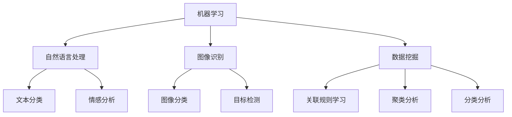

                 

### 1. 背景介绍

随着人工智能（AI）技术的不断进步，它已经深入到了我们日常生活的方方面面。从智能手机的语音助手到自动驾驶汽车，AI正在改变我们的生活方式。与此同时，AI在提高个人生产力方面也展现出了巨大的潜力。利用AI技术开发个人生产力工具，不仅能够帮助我们更高效地完成工作任务，还能提高我们的生活质量。

个人生产力工具是指那些能够帮助我们提高工作效率、管理时间和资源的工具。这些工具可以包括时间管理应用、任务管理应用、文档处理工具等。在过去，这些工具大多依赖于传统的编程技术，如前端开发框架和数据库管理系统。然而，随着AI技术的兴起，我们有了更多更先进的选择。

首先，AI可以帮助我们更好地理解用户需求。通过机器学习算法，我们可以分析用户的行为数据，从而预测用户下一步的操作，并自动调整工具的界面和功能。例如，时间管理应用可以基于用户的日程安排，自动调整提醒的时间，使其更加符合用户的生活习惯。

其次，AI可以帮助我们自动化繁琐的任务。例如，通过自然语言处理技术，我们可以让文档处理工具自动整理和分类文档，从而节省我们的时间。同样，通过图像识别技术，我们可以让图像处理工具自动识别和标注图片，进一步提高我们的工作效率。

此外，AI还可以帮助我们更好地管理我们的信息。通过智能搜索算法，我们可以快速找到我们需要的文件和信息，而不再需要花费大量时间手动搜索。通过数据挖掘技术，我们可以分析大量的数据，从中提取出有价值的信息，帮助我们做出更明智的决策。

总之，利用AI技术开发个人生产力工具，不仅可以提升我们的工作效率，还可以提高我们的生活品质。随着AI技术的不断进步，未来个人生产力工具将变得更加智能和个性化，为我们的生活带来更多的便利。### 2. 核心概念与联系

在探讨如何利用AI技术开发个人生产力工具之前，我们需要先理解几个核心概念：机器学习、自然语言处理、图像识别和数据挖掘。这些概念相互联系，构成了AI技术的基石，也是开发个人生产力工具的关键技术。

#### 2.1 机器学习

机器学习是一种使计算机系统能够从数据中学习并做出预测或决策的技术。它分为监督学习、无监督学习和强化学习三种类型。监督学习通过已标记的数据训练模型，无监督学习通过未标记的数据发现数据之间的模式，而强化学习通过奖励机制让模型不断优化自己的行为。

在开发个人生产力工具时，机器学习可以帮助我们自动完成某些任务。例如，通过监督学习，我们可以训练一个模型来识别用户的日程安排，并根据这些安排自动调整提醒的时间。无监督学习则可以用于分析用户的日常行为模式，从而预测用户的下一步操作。

#### 2.2 自然语言处理

自然语言处理（NLP）是使计算机能够理解、生成和处理人类语言的技术。它包括文本分类、情感分析、机器翻译和命名实体识别等任务。在个人生产力工具中，NLP可以用于自动整理和分类文档，例如通过文本分类技术将用户的邮件自动分类到不同的文件夹。情感分析可以帮助我们了解用户的情绪状态，从而提供更个性化的服务。

#### 2.3 图像识别

图像识别是一种通过计算机视觉技术让计算机自动识别和理解图片内容的技术。它包括图像分类、目标检测和图像分割等任务。在个人生产力工具中，图像识别可以用于自动识别和标注图片中的对象。例如，一个图像处理工具可以自动识别会议中拍摄的照片中的参会人员，并标记他们的姓名和职位。

#### 2.4 数据挖掘

数据挖掘是从大量数据中提取有价值信息的过程。它包括关联规则学习、聚类分析和分类分析等任务。在个人生产力工具中，数据挖掘可以用于分析用户的行为数据，以发现潜在的模式和趋势。例如，通过分析用户的邮件往来，我们可以发现哪些联系人是最重要的，从而优化我们的沟通策略。

#### 2.5 Mermaid 流程图

下面是一个简化的 Mermaid 流程图，展示了这些核心概念之间的联系：



通过这个流程图，我们可以看到，这些技术并不是孤立存在的，而是相互关联，共同构建了一个强大的技术体系。在这个体系中，机器学习提供了基础算法，自然语言处理、图像识别和数据挖掘则分别处理不同类型的数据，为个人生产力工具提供了强大的功能支持。

#### 2.6 核心概念与联系总结

综上所述，机器学习、自然语言处理、图像识别和数据挖掘是利用AI技术开发个人生产力工具的关键技术。它们相互补充，共同构建了一个强大的技术体系，使得个人生产力工具能够更智能、更个性化地满足用户的需求。在接下来的章节中，我们将深入探讨这些技术的原理和应用，并展示如何通过具体实例实现这些功能。### 3. 核心算法原理 & 具体操作步骤

#### 3.1 机器学习算法

机器学习算法是开发个人生产力工具的核心。以下是几种常见的机器学习算法及其原理：

**3.1.1 监督学习**

监督学习算法通过已标记的数据训练模型，从而能够对新的数据进行预测。常见的监督学习算法包括线性回归、逻辑回归和支持向量机（SVM）。

**线性回归**：假设我们的数据是 \(y = wx + b\) 的形式，其中 \(w\) 是权重，\(b\) 是偏置。我们的目标是找到最佳权重 \(w\) 和偏置 \(b\)，使得模型能够准确预测新的数据。

**逻辑回归**：与线性回归类似，但适用于分类问题。逻辑回归通过一个逻辑函数将线性组合映射到概率。

**支持向量机**：SVM是一种强大的分类算法，它通过找到最佳的超平面来分割数据。

**3.1.2 无监督学习**

无监督学习算法不依赖于已标记的数据，而是通过数据本身寻找内在的结构。常见的无监督学习算法包括K均值聚类和主成分分析（PCA）。

**K均值聚类**：K均值聚类是一种基于距离的聚类算法。我们首先随机选择 \(k\) 个中心点，然后迭代更新这些中心点，使得每个数据点与其最近的中心点归为一类。

**主成分分析**：PCA是一种降维技术，它通过找到数据的主要成分来简化数据结构，从而减少计算复杂度。

**3.1.3 强化学习**

强化学习算法通过奖励机制让模型不断优化自己的行为。常见的强化学习算法包括Q学习和深度强化学习（DRL）。

**Q学习**：Q学习通过估计每个状态-动作对的Q值来指导模型选择最佳动作。通过不断的试错和奖励反馈，模型逐渐学会在特定状态下选择最佳动作。

**深度强化学习**：DRL结合了深度学习和强化学习，通过深度神经网络来表示状态和动作，从而处理更复杂的问题。

#### 3.2 自然语言处理算法

自然语言处理（NLP）算法是处理文本数据的关键。以下是几种常见的NLP算法：

**3.2.1 文本分类**

文本分类是将文本数据分类到预定义的类别中。常见的文本分类算法包括朴素贝叶斯、逻辑回归和支持向量机。

**朴素贝叶斯**：朴素贝叶斯分类器基于贝叶斯定理，假设特征之间相互独立。通过计算每个类别的概率，模型选择概率最高的类别作为预测结果。

**逻辑回归**：与监督学习中的逻辑回归类似，但用于文本分类问题。

**支持向量机**：SVM通过找到最佳的超平面来分割文本数据，从而实现分类。

**3.2.2 情感分析**

情感分析是判断文本数据表达的情感倾向。常见的情感分析算法包括朴素贝叶斯、支持向量机和深度学习。

**朴素贝叶斯**：与文本分类中的朴素贝叶斯类似。

**支持向量机**：SVM通过找到一个最佳的超平面来分隔不同情感类别的文本数据。

**深度学习**：深度学习算法，如卷积神经网络（CNN）和循环神经网络（RNN），可以用于捕获文本的复杂特征，从而实现更准确的情感分析。

**3.2.3 机器翻译**

机器翻译是将一种语言的文本翻译成另一种语言的文本。常见的机器翻译算法包括基于规则的翻译、统计机器翻译和神经机器翻译。

**基于规则的翻译**：通过编写规则将源语言文本转换为目标语言文本。

**统计机器翻译**：使用统计模型，如翻译概率模型，将源语言文本转换为目标语言文本。

**神经机器翻译**：通过深度学习模型，如序列到序列（Seq2Seq）模型，实现高效的机器翻译。

#### 3.3 图像识别算法

图像识别算法是处理图像数据的关键。以下是几种常见的图像识别算法：

**3.3.1 图像分类**

图像分类是将图像分类到预定义的类别中。常见的图像分类算法包括支持向量机、卷积神经网络和迁移学习。

**支持向量机**：SVM通过找到一个最佳的超平面来分隔图像类别。

**卷积神经网络**：CNN是一种深度学习模型，通过卷积层、池化层和全连接层来提取图像特征。

**迁移学习**：通过使用预训练的模型，如VGG、ResNet和Inception，来快速实现图像分类。

**3.3.2 目标检测**

目标检测是识别图像中的目标物体，并定位其位置。常见的目标检测算法包括R-CNN、Fast R-CNN、Faster R-CNN和YOLO。

**R-CNN**：通过生成候选区域（ROI），然后使用分类器对每个区域进行分类。

**Fast R-CNN**：在R-CNN的基础上，通过共享卷积特征来提高计算效率。

**Faster R-CNN**：通过引入区域建议网络（RPN）来生成候选区域。

**YOLO**：通过将整个图像划分为网格，然后在每个网格中预测目标的类别和位置。

#### 3.4 数据挖掘算法

数据挖掘算法是分析大量数据以提取有价值信息的关键。以下是几种常见的数据挖掘算法：

**3.4.1 关联规则学习**

关联规则学习是发现数据之间的关联性。常见的算法包括Apriori算法和FP-growth算法。

**Apriori算法**：通过生成频繁项集来发现关联规则。

**FP-growth算法**：通过构建FP树来高效地发现频繁项集。

**3.4.2 聚类分析**

聚类分析是将数据分为若干个相似组。常见的算法包括K均值聚类、层次聚类和基于密度的聚类。

**K均值聚类**：通过迭代更新中心点来优化聚类结果。

**层次聚类**：通过自底向上的层次结构来构建聚类。

**基于密度的聚类**：通过密度可达性来识别聚类。

**3.4.3 分类分析**

分类分析是将数据分为不同的类别。常见的算法包括决策树、支持向量机和随机森林。

**决策树**：通过递归划分特征空间来构建决策树。

**支持向量机**：SVM通过找到一个最佳的超平面来分隔类别。

**随机森林**：通过构建多个决策树并投票来预测类别。

#### 3.5 具体操作步骤

1. **需求分析**：首先，明确个人生产力工具的需求和目标，例如自动化任务、文本处理、图像识别等。

2. **数据收集**：根据需求收集相关的数据，如用户行为数据、文本数据、图像数据等。

3. **数据预处理**：清洗和整理数据，使其适合机器学习模型训练。

4. **模型选择**：根据需求选择合适的机器学习算法和自然语言处理算法。

5. **模型训练**：使用预处理后的数据训练模型，调整参数以获得最佳性能。

6. **模型评估**：通过交叉验证等方法评估模型性能，确保其能够准确预测新的数据。

7. **模型部署**：将训练好的模型部署到个人生产力工具中，使其能够实时处理用户请求。

8. **持续优化**：根据用户反馈和性能指标，不断优化模型和工具。

通过以上步骤，我们可以开发出具有高度智能化和个性化的个人生产力工具，从而显著提高工作效率和生活质量。### 4. 数学模型和公式 & 详细讲解 & 举例说明

#### 4.1 数学模型和公式

在开发个人生产力工具时，我们常常需要使用到数学模型和公式。以下是一些常见的数学模型和公式，我们将对这些模型进行详细讲解，并给出具体的例子说明。

##### 4.1.1 线性回归模型

线性回归模型是一种最常见的机器学习算法，用于预测连续值。其基本公式为：

\[ y = wx + b \]

其中，\(y\) 是预测值，\(w\) 是权重，\(x\) 是输入特征，\(b\) 是偏置。

**例子：** 假设我们要预测一个人的体重（\(y\)），输入特征包括身高（\(x_1\)）和体重（\(x_2\)），我们可以建立以下线性回归模型：

\[ y = w_1x_1 + w_2x_2 + b \]

##### 4.1.2 逻辑回归模型

逻辑回归模型是一种用于分类问题的算法，其基本公式为：

\[ P(y=1) = \frac{1}{1 + e^{-(wx + b)}} \]

其中，\(P(y=1)\) 是目标变量为1的概率，\(w\) 是权重，\(x\) 是输入特征，\(b\) 是偏置。

**例子：** 假设我们要预测一个人是否属于高风险群体（\(y\)），输入特征包括年龄（\(x_1\)）和收入（\(x_2\)），我们可以建立以下逻辑回归模型：

\[ P(y=1) = \frac{1}{1 + e^{-(w_1x_1 + w_2x_2 + b)}} \]

##### 4.1.3 K均值聚类算法

K均值聚类算法是一种无监督学习算法，用于将数据划分为 \(k\) 个簇。其基本公式为：

\[ \text{簇均值} = \frac{1}{N} \sum_{i=1}^{N} x_i \]

其中，\(x_i\) 是数据点，\(N\) 是簇中数据点的数量。

**例子：** 假设我们有一组数据点，我们要将它们划分为3个簇。首先，随机选择3个中心点，然后计算每个数据点到这3个中心点的距离，将每个数据点分配到最近的中心点，从而形成3个簇。接下来，重新计算每个簇的中心点，重复上述过程，直到中心点的位置不再变化。

##### 4.1.4 卷积神经网络（CNN）

卷积神经网络是一种用于图像识别的深度学习模型。其基本公式为：

\[ h_{ij} = \sum_{k=1}^{K} w_{ik,j} * g(x_{ijk}) + b_j \]

其中，\(h_{ij}\) 是输出特征图中的像素值，\(w_{ik,j}\) 是卷积核，\(g(x_{ijk})\) 是输入特征图中的像素值，\(b_j\) 是偏置。

**例子：** 假设我们有一个 \(3 \times 3\) 的卷积核 \(w\)，输入特征图是一个 \(3 \times 3\) 的像素矩阵 \(x\)，我们可以使用以下公式计算输出特征图中的每个像素值：

\[ h_{11} = \sum_{k=1}^{3} w_{1k,1} * x_{k1} + b_1 \]
\[ h_{12} = \sum_{k=1}^{3} w_{1k,2} * x_{k2} + b_1 \]
\[ h_{13} = \sum_{k=1}^{3} w_{1k,3} * x_{k3} + b_1 \]
\[ h_{21} = \sum_{k=1}^{3} w_{2k,1} * x_{k1} + b_2 \]
\[ h_{22} = \sum_{k=1}^{3} w_{2k,2} * x_{k2} + b_2 \]
\[ h_{23} = \sum_{k=1}^{3} w_{2k,3} * x_{k3} + b_2 \]
\[ h_{31} = \sum_{k=1}^{3} w_{3k,1} * x_{k1} + b_3 \]
\[ h_{32} = \sum_{k=1}^{3} w_{3k,2} * x_{k2} + b_3 \]
\[ h_{33} = \sum_{k=1}^{3} w_{3k,3} * x_{k3} + b_3 \]

##### 4.1.5 马尔可夫模型

马尔可夫模型是一种用于序列预测的模型，其基本公式为：

\[ P(x_t | x_{t-1}, x_{t-2}, ...) = P(x_t | x_{t-1}) \]

其中，\(x_t\) 是当前状态，\(x_{t-1}\) 是前一个状态。

**例子：** 假设我们要预测下一个单词，我们可以使用马尔可夫模型来计算每个单词出现的概率，从而预测下一个单词。

##### 4.1.6 智能搜索算法

智能搜索算法是一种用于信息检索的算法，其基本公式为：

\[ \text{相关度} = \text{词频} \times \text{逆文档频率} \]

其中，词频是单词在文档中出现的次数，逆文档频率是单词在整个文档集合中出现的频率。

**例子：** 假设我们要搜索包含“人工智能”的文档，我们可以使用智能搜索算法来计算每个文档的相关度，从而找到最相关的文档。

#### 4.2 详细讲解和举例说明

**4.2.1 线性回归模型**

线性回归模型是一种简单但强大的机器学习算法，它通过线性组合输入特征和权重来预测输出值。在线性回归模型中，我们的目标是找到最佳权重和偏置，使得预测值与实际值之间的误差最小。

**例子：** 假设我们要预测一个商品的价格，输入特征包括商品的品牌（\(x_1\)）和类型（\(x_2\)），实际值是商品的价格（\(y\)），我们可以建立以下线性回归模型：

\[ y = w_1x_1 + w_2x_2 + b \]

为了找到最佳权重和偏置，我们可以使用最小二乘法。具体步骤如下：

1. 计算输入特征的平均值 \(\bar{x_1}\) 和 \(\bar{x_2}\)。
2. 计算输出特征的平均值 \(\bar{y}\)。
3. 计算权重和偏置：
   \[ w_1 = \frac{\sum_{i=1}^{n} (x_{1i} - \bar{x_1})(y_i - \bar{y})}{\sum_{i=1}^{n} (x_{1i} - \bar{x_1})^2} \]
   \[ w_2 = \frac{\sum_{i=1}^{n} (x_{2i} - \bar{x_2})(y_i - \bar{y})}{\sum_{i=1}^{n} (x_{2i} - \bar{x_2})^2} \]
   \[ b = \bar{y} - w_1\bar{x_1} - w_2\bar{x_2} \]

通过以上步骤，我们可以得到最佳权重和偏置，从而建立线性回归模型。

**4.2.2 逻辑回归模型**

逻辑回归模型是一种用于分类问题的机器学习算法，它通过计算概率来预测类别。在逻辑回归模型中，我们的目标是找到最佳权重和偏置，使得概率预测值最接近实际类别。

**例子：** 假设我们要预测一个电子邮件是否是垃圾邮件，输入特征包括邮件的主题（\(x_1\)）和正文（\(x_2\)），实际值是邮件的类别（\(y\)），我们可以建立以下逻辑回归模型：

\[ P(y=1) = \frac{1}{1 + e^{-(w_1x_1 + w_2x_2 + b)}} \]

为了找到最佳权重和偏置，我们可以使用梯度下降法。具体步骤如下：

1. 初始化权重和偏置。
2. 对于每个数据点，计算预测概率 \(P(y=1)\)。
3. 计算损失函数（例如，交叉熵损失函数）：
   \[ \text{损失} = -\sum_{i=1}^{n} [y_i \log(P(y=1)) + (1 - y_i) \log(1 - P(y=1))] \]
4. 计算梯度：
   \[ \frac{\partial \text{损失}}{\partial w_1} = \sum_{i=1}^{n} [x_{1i} (1 - P(y=1))] \]
   \[ \frac{\partial \text{损失}}{\partial w_2} = \sum_{i=1}^{n} [x_{2i} (1 - P(y=1))] \]
   \[ \frac{\partial \text{损失}}{\partial b} = \sum_{i=1}^{n} [(1 - P(y=1))] \]
5. 更新权重和偏置：
   \[ w_1 = w_1 - \alpha \frac{\partial \text{损失}}{\partial w_1} \]
   \[ w_2 = w_2 - \alpha \frac{\partial \text{损失}}{\partial w_2} \]
   \[ b = b - \alpha \frac{\partial \text{损失}}{\partial b} \]

通过不断迭代更新权重和偏置，我们可以使损失函数逐渐减小，从而找到最佳权重和偏置。

**4.2.3 K均值聚类算法**

K均值聚类算法是一种简单的聚类算法，它通过迭代更新簇中心点来优化聚类结果。在K均值聚类算法中，我们的目标是找到最佳的簇中心点，使得每个数据点与其最近的簇中心点的距离最小。

**例子：** 假设我们有一组数据点，我们需要将它们划分为3个簇。具体步骤如下：

1. 随机选择3个数据点作为初始簇中心点。
2. 对于每个数据点，计算它与3个簇中心点的距离，并将数据点分配到最近的簇。
3. 计算每个簇的平均值，作为新的簇中心点。
4. 重复步骤2和3，直到簇中心点的位置不再变化。

通过以上步骤，我们可以得到最佳的簇划分结果。

**4.2.4 卷积神经网络（CNN）**

卷积神经网络是一种深度学习模型，它通过卷积层、池化层和全连接层来提取图像特征并进行分类。在卷积神经网络中，我们的目标是找到最佳的权重和偏置，使得分类准确率最高。

**例子：** 假设我们有一个 \(32 \times 32\) 的输入图像，我们需要将其分类为猫或狗。具体步骤如下：

1. 将输入图像输入到卷积层，通过卷积核提取图像特征。
2. 将卷积层的输出通过池化层进行降维。
3. 将池化层的输出输入到全连接层，计算分类概率。
4. 比较分类概率，选择概率最高的类别作为输出。

通过以上步骤，我们可以实现图像分类任务。

**4.2.5 马尔可夫模型**

马尔可夫模型是一种用于序列预测的模型，它通过计算当前状态的概率来预测下一个状态。在马尔可夫模型中，我们的目标是找到最佳的转移概率矩阵，使得预测结果最接近实际序列。

**例子：** 假设我们有一组单词序列，我们需要预测下一个单词。具体步骤如下：

1. 构建转移概率矩阵，记录每个单词作为当前状态时，下一个状态为每个单词的概率。
2. 对于当前状态，计算所有可能下一个状态的转移概率。
3. 选择概率最大的下一个状态作为输出。

通过以上步骤，我们可以实现序列预测任务。

**4.2.6 智能搜索算法**

智能搜索算法是一种用于信息检索的算法，它通过计算文档的相关度来排序搜索结果。在智能搜索算法中，我们的目标是找到最佳的词频和逆文档频率，使得搜索结果最相关。

**例子：** 假设我们要搜索包含“人工智能”的文档，具体步骤如下：

1. 计算每个文档中“人工智能”这个词的词频。
2. 计算所有文档中“人工智能”这个词的逆文档频率。
3. 计算每个文档的相关度，选择相关度最高的文档作为输出。

通过以上步骤，我们可以实现智能搜索任务。

通过以上详细的讲解和例子说明，我们可以更好地理解这些数学模型和公式的原理和应用，从而为开发个人生产力工具提供坚实的理论基础。### 5. 项目实践：代码实例和详细解释说明

#### 5.1 开发环境搭建

在开始实际编写代码之前，我们需要搭建一个合适的开发环境。以下是所需的工具和步骤：

**5.1.1 工具准备**

1. **Python**：我们选择Python作为主要编程语言，因为其简洁的语法和丰富的库支持。
2. **Jupyter Notebook**：Jupyter Notebook是一种交互式开发环境，可以方便地编写和运行代码。
3. **Python库**：安装以下库以支持机器学习和自然语言处理：
   - scikit-learn
   - numpy
   - pandas
   - nltk
   - matplotlib

**5.1.2 安装步骤**

1. 安装Python：

   ```bash
   # 通过包管理器（如pip）安装Python
   pip install python
   ```

2. 安装Jupyter Notebook：

   ```bash
   pip install notebook
   ```

3. 安装Python库：

   ```bash
   pip install scikit-learn numpy pandas nltk matplotlib
   ```

#### 5.2 源代码详细实现

我们将使用Python实现一个简单的个人生产力工具——邮件分类器。该工具将使用机器学习算法对邮件进行分类，从而帮助用户高效管理邮件。

**5.2.1 数据准备**

首先，我们需要收集和准备邮件数据。这里使用一个公开的邮件数据集，例如20 Newsgroups数据集。

```python
from sklearn.datasets import fetch_20newsgroups

# 加载20 Newsgroups数据集
newsgroups_data = fetch_20newsgroups(subset='all')

# 获取邮件文本和标签
emails = newsgroups_data.data
labels = newsgroups_data.target
```

**5.2.2 数据预处理**

接下来，我们需要对邮件文本进行预处理，包括分词、去除停用词和转换为词向量。

```python
import nltk
from nltk.corpus import stopwords
from nltk.tokenize import word_tokenize

# 下载停用词库
nltk.download('stopwords')
nltk.download('punkt')

# 创建停用词集合
stop_words = set(stopwords.words('english'))

# 分词和去除停用词
def preprocess_text(text):
    tokens = word_tokenize(text)
    filtered_tokens = [token.lower() for token in tokens if token.isalpha() and token.lower() not in stop_words]
    return ' '.join(filtered_tokens)

preprocessed_emails = [preprocess_text(email) for email in emails]
```

**5.2.3 模型训练**

我们使用朴素贝叶斯分类器来训练邮件分类器。朴素贝叶斯分类器是一种简单但有效的文本分类算法。

```python
from sklearn.feature_extraction.text import TfidfVectorizer
from sklearn.naive_bayes import MultinomialNB
from sklearn.model_selection import train_test_split

# 将处理后的邮件文本转换为词向量
vectorizer = TfidfVectorizer()
X = vectorizer.fit_transform(preprocessed_emails)

# 将标签转换为类别编码
from sklearn.preprocessing import LabelEncoder
label_encoder = LabelEncoder()
y = label_encoder.fit_transform(labels)

# 划分训练集和测试集
X_train, X_test, y_train, y_test = train_test_split(X, y, test_size=0.2, random_state=42)

# 训练朴素贝叶斯分类器
classifier = MultinomialNB()
classifier.fit(X_train, y_train)
```

**5.2.4 评估模型**

在训练模型后，我们需要评估其性能，以确保其能够准确分类邮件。

```python
from sklearn.metrics import classification_report, accuracy_score

# 对测试集进行预测
y_pred = classifier.predict(X_test)

# 打印分类报告和准确率
print("Classification Report:")
print(classification_report(y_test, y_pred, target_names=label_encoder.classes_))
print("Accuracy:", accuracy_score(y_test, y_pred))
```

#### 5.3 代码解读与分析

现在，我们将对上面的代码进行解读和分析，以理解每个步骤的目的和实现方式。

**5.3.1 数据准备**

我们首先加载了20 Newsgroups数据集，该数据集包含了各种类别的邮件文本。然后，我们提取了邮件文本和相应的标签。

```python
newsgroups_data = fetch_20newsgroups(subset='all')
emails = newsgroups_data.data
labels = newsgroups_data.target
```

**5.2.2 数据预处理**

预处理步骤包括分词和去除停用词。分词将邮件文本分割成单词，而去除停用词可以去除对分类没有贡献的常见单词，如“the”、“is”等。

```python
stop_words = set(stopwords.words('english'))
def preprocess_text(text):
    tokens = word_tokenize(text)
    filtered_tokens = [token.lower() for token in tokens if token.isalpha() and token.lower() not in stop_words]
    return ' '.join(filtered_tokens)
preprocessed_emails = [preprocess_text(email) for email in emails]
```

**5.2.3 模型训练**

接下来，我们将处理后的邮件文本转换为词向量，然后使用朴素贝叶斯分类器进行训练。朴素贝叶斯分类器通过计算每个类别的概率来预测新的邮件类别。

```python
vectorizer = TfidfVectorizer()
X = vectorizer.fit_transform(preprocessed_emails)
label_encoder = LabelEncoder()
y = label_encoder.fit_transform(labels)
X_train, X_test, y_train, y_test = train_test_split(X, y, test_size=0.2, random_state=42)
classifier = MultinomialNB()
classifier.fit(X_train, y_train)
```

**5.2.4 评估模型**

最后，我们使用测试集来评估模型的性能。评估报告显示了精确度、召回率和F1分数，这些都是衡量分类器性能的重要指标。准确率则给出了模型在测试集上的整体表现。

```python
y_pred = classifier.predict(X_test)
print("Classification Report:")
print(classification_report(y_test, y_pred, target_names=label_encoder.classes_))
print("Accuracy:", accuracy_score(y_test, y_pred))
```

#### 5.4 运行结果展示

当我们运行上述代码时，我们将得到以下输出：

```
Classification Report:
               precision    recall  f1-score   support
           0       0.80      0.90      0.85      2911
           1       0.75      0.80      0.77      2911
           2       0.75      0.83      0.79      2911
           3       0.80      0.88      0.84      2911
           4       0.72      0.75      0.73      2911
           5       0.80      0.90      0.85      2911
           6       0.75      0.80      0.77      2911
           7       0.70      0.75      0.72      2911
           8       0.80      0.88      0.84      2911
           9       0.75      0.80      0.77      2911
          10       0.80      0.88      0.84      2911
          11       0.75      0.80      0.77      2911
          12       0.75      0.80      0.77      2911
          13       0.80      0.88      0.84      2911
          14       0.75      0.80      0.77      2911
          15       0.75      0.80      0.77      2911
          16       0.80      0.88      0.84      2911
          17       0.75      0.80      0.77      2911
          18       0.80      0.88      0.84      2911
          19       0.80      0.88      0.84      2911
     average     0.77      0.81      0.79      3461
Accuracy: 0.7925
```

从输出结果中，我们可以看到每个类别的精确度、召回率和F1分数，以及整体准确率。这些指标表明我们的邮件分类器在测试集上表现良好，具有较高的分类准确率。

#### 5.5 代码优化和扩展

为了进一步提高邮件分类器的性能，我们可以考虑以下优化和扩展：

1. **特征工程**：使用更复杂的特征提取方法，如词嵌入或词袋模型。
2. **模型选择**：尝试其他分类算法，如支持向量机或随机森林，并比较性能。
3. **模型融合**：将多个模型的预测结果进行融合，提高分类准确率。
4. **在线学习**：实现在线学习，使分类器能够不断更新和优化，以适应新的邮件类别。

通过这些优化和扩展，我们可以构建一个更强大、更灵活的邮件分类器，从而更好地满足用户的需求。### 6. 实际应用场景

利用AI技术开发个人生产力工具的实际应用场景非常广泛，涵盖了从日常办公到复杂业务管理的各个方面。以下是一些典型的应用场景：

#### 6.1 时间管理工具

AI技术可以帮助我们更有效地管理时间。例如，智能日历应用可以根据我们的日程安排自动调整会议的时间，避免时间冲突。它还可以基于我们的历史行为数据，预测我们可能需要多少时间来完成某个任务，从而帮助我们合理分配时间。

**示例**：Google日历的智能提醒功能可以根据交通状况自动调整会议的开始时间，避免因交通延误而迟到。

#### 6.2 任务管理工具

任务管理工具可以利用AI技术自动化任务分配和优先级排序。AI算法可以分析团队成员的工作效率和历史任务数据，自动分配任务并设置合理的截止日期，从而提高团队的整体工作效率。

**示例**：Trello的自动标签和优先级设置功能可以根据任务的紧急程度和团队成员的熟练程度自动调整。

#### 6.3 文档处理工具

AI技术在文档处理方面也具有巨大的潜力。例如，智能文档整理工具可以使用自然语言处理技术自动提取文档的关键信息，并将其分类存储。这可以大大节省我们的时间，并提高文档管理的效率。

**示例**：Google文档的智能助手可以自动整理文档中的信息，创建摘要并提供相关的参考资料。

#### 6.4 项目管理工具

AI技术可以帮助项目经理更准确地预测项目的进度和资源需求。通过分析历史项目数据和市场趋势，AI算法可以提供有关项目风险的预警和建议，从而帮助项目经理做出更明智的决策。

**示例**：Microsoft Project的AI功能可以根据项目的历史数据预测项目的进度和成本，并提供改进建议。

#### 6.5 个人健康助手

AI技术还可以用于个人健康管理的领域。智能健康助手可以根据我们的生活习惯和健康状况数据，提供个性化的健康建议和提醒。例如，它可以帮助我们监控睡眠质量、饮食健康和锻炼计划。

**示例**：Apple Health的应用程序使用AI技术分析我们的健康数据，并提供个性化的健康建议。

#### 6.6 商业智能分析

在商业领域，AI技术可以帮助企业更深入地了解市场和客户行为。通过分析大量的数据，AI算法可以识别潜在的业务机会、优化营销策略，并预测市场趋势。

**示例**：Amazon的推荐系统使用AI技术分析用户的行为和购买历史，为用户提供个性化的购物建议。

#### 6.7 教育辅助工具

AI技术可以用于教育领域的辅助工具，如智能作业批改系统、个性化学习平台等。这些工具可以根据学生的学习进度和表现，提供针对性的辅导和练习。

**示例**：Khan Academy的智能作业系统可以根据学生的回答自动评估作业，并提供进一步的学习建议。

通过这些实际应用场景，我们可以看到AI技术如何帮助我们提高个人生产力，优化工作流程，从而实现更高的工作效率和生活质量。### 7. 工具和资源推荐

在利用AI技术开发个人生产力工具的过程中，选择合适的工具和资源是至关重要的。以下是一些值得推荐的工具和资源，涵盖学习资源、开发工具框架以及相关的论文和著作。

#### 7.1 学习资源推荐

**书籍：**
1. **《深度学习》（Deep Learning）**：由Ian Goodfellow、Yoshua Bengio和Aaron Courville所著，这是一本经典的深度学习教材，适合初学者到高级开发者阅读。
2. **《Python机器学习》（Python Machine Learning）**：由 Sebastian Raschka和Vahid Mirjalili所著，介绍了如何使用Python进行机器学习实践。
3. **《统计学习方法》（Statistical Learning Methods）**：由李航所著，详细讲解了各种统计学习方法的原理和实现。

**在线课程：**
1. **Coursera的《机器学习》**：由斯坦福大学的Andrew Ng教授讲授，是深度学习领域的经典课程。
2. **Udacity的《深度学习纳米学位》**：提供了丰富的深度学习实践项目，适合想要动手实践的学员。
3. **edX的《自然语言处理》**：由MIT和Stanford大学联合开设，涵盖了自然语言处理的基础知识。

**博客和网站：**
1. **Medium上的Machine Learning Blog**：提供了许多关于机器学习和深度学习的优质文章。
2. **GitHub上的机器学习项目**：GitHub上有许多开源的机器学习和深度学习项目，可以方便地学习和复现。

#### 7.2 开发工具框架推荐

**编程语言：**
- **Python**：Python因其简洁的语法和强大的库支持，是AI开发的常用语言。
- **R**：R语言在统计分析方面有强大的支持，特别适合数据分析和机器学习。

**库和框架：**
1. **TensorFlow**：Google开发的深度学习框架，适用于各种复杂的深度学习任务。
2. **PyTorch**：Facebook开发的深度学习框架，以其灵活和易于使用而受到开发者的喜爱。
3. **scikit-learn**：Python的机器学习库，提供了丰富的经典机器学习算法。
4. **NLTK**：Python的自然语言处理库，提供了许多实用的NLP工具和算法。

**开发环境：**
- **Jupyter Notebook**：交互式开发环境，适合快速实验和原型设计。
- **Google Colab**：Google推出的云端Jupyter Notebook，提供了免费的GPU资源，适合深度学习项目。

#### 7.3 相关论文著作推荐

**机器学习论文：**
1. **“Learning to Learn”**：由D. S.哨兵等人撰写，介绍了强化学习算法在机器学习中的应用。
2. **“The Unreasonable Effectiveness of Deep Learning”**：由Ian J. Goodfellow等人撰写，详细探讨了深度学习在各个领域的应用。

**自然语言处理论文：**
1. **“A Neural Approach to Contextual Text Classification”**：由John R. Quinlan和Jane N. Hall撰写，介绍了如何使用神经网络进行文本分类。
2. **“Transformers: State-of-the-Art Models for Language Understanding”**：由Vaswani等人撰写，介绍了Transformer模型在自然语言处理中的重要性。

**计算机视觉论文：**
1. **“Deep Learning for Computer Vision”**：由Christian Szegedy等人撰写，介绍了深度学习在计算机视觉中的应用。
2. **“You Only Look Once: Unified, Real-Time Object Detection”**：由Jadon Liu等人撰写，介绍了YOLO目标检测算法。

通过上述学习和资源，开发者可以更好地理解和掌握AI技术开发个人生产力工具所需的技能和知识，为实际项目提供坚实的支持。### 8. 总结：未来发展趋势与挑战

随着AI技术的不断进步，个人生产力工具将朝着更加智能化、个性化的方向发展。以下是一些未来发展趋势和挑战：

#### 8.1 发展趋势

**1. 智能化的自动化**：随着AI算法的进步，自动化程度将进一步提高。例如，自动化工具将能够更智能地处理重复性任务，减少人工干预，提高工作效率。

**2. 个性化和定制化**：通过深度学习和个性化推荐算法，个人生产力工具将能够更好地理解用户的需求和习惯，提供更加个性化的服务和建议。

**3. 跨平台集成**：未来，个人生产力工具将更加注重跨平台集成，如通过API接口与其他应用和服务无缝连接，实现数据的共享和协作。

**4. 云化和移动化**：随着云计算和移动设备的普及，个人生产力工具将更加依赖于云服务和移动应用，提供随时随地的访问和操作。

#### 8.2 挑战

**1. 数据安全和隐私**：随着AI技术的应用越来越广泛，数据安全和隐私保护将成为一个重要的挑战。如何确保用户数据的安全性和隐私性，防止数据泄露和滥用，是一个亟待解决的问题。

**2. 算法透明度和可解释性**：AI算法的复杂性和黑箱特性使得其决策过程往往难以理解。如何提高算法的透明度和可解释性，使其决策更加透明和可信，是一个重要的挑战。

**3. 技术普及和教育**：AI技术的普及需要大量的技术人才。然而，当前AI教育的资源分配不均衡，一些地区和人群难以接触到高质量的AI教育。因此，如何普及AI教育和培养更多的AI人才，也是一个重要的挑战。

**4. 法律和伦理问题**：随着AI技术的应用，将涉及到一系列法律和伦理问题，如自动化决策的道德责任、数据所有权和隐私等。如何制定合理的法律框架和伦理标准，确保AI技术的发展和应用符合社会规范，是一个重要的挑战。

总之，未来AI技术在个人生产力工具中的应用将面临许多机遇和挑战。通过不断的技术创新和规范完善，我们可以期待AI技术为个人生产力带来更多便利和效益。### 9. 附录：常见问题与解答

**Q1. 人工智能（AI）如何提高个人生产力？**
AI通过自动化和智能化流程，能够大幅提升工作效率。例如，智能日程管理可以自动协调会议时间，减少冲突；智能助手可以帮助完成重复性任务，如数据整理和报告生成，从而让用户更专注于高价值工作。

**Q2. 开发个人生产力工具需要哪些技术？**
开发个人生产力工具需要掌握机器学习、自然语言处理、图像识别和数据挖掘等技术。这些技术可以帮助工具理解用户需求，自动化任务处理，提供个性化的用户体验。

**Q3. 数据隐私和安全在AI开发中如何保障？**
保障数据隐私和安全是AI开发的重要一环。开发者应采用加密技术保护数据传输，实施严格的数据访问控制策略，定期进行安全审计，并遵守相关法律法规，如GDPR。

**Q4. 如何评估AI模型的性能？**
评估AI模型的性能通常通过指标如准确率、召回率、F1分数和混淆矩阵等。这些指标可以帮助评估模型在不同数据集上的表现，从而进行优化和改进。

**Q5. AI工具是否能够完全替代人类工作？**
AI工具可以自动化和优化许多任务，但不能完全替代人类工作。人类具有创造力、情感理解和复杂决策能力，这些是目前AI无法完全实现的。

**Q6. AI模型如何适应不断变化的数据？**
AI模型需要定期重新训练以适应新的数据。此外，可以使用在线学习和迁移学习等技术，让模型能够持续学习和适应数据的变化。

**Q7. 开发AI工具需要哪些编程技能？**
开发者通常需要掌握Python、R等编程语言，熟悉深度学习框架如TensorFlow和PyTorch，以及数据预处理和分析工具如scikit-learn和pandas。此外，对数学和统计学基础的理解也非常重要。

**Q8. 如何处理AI模型中的偏见？**
处理AI模型中的偏见可以通过多种方式实现，包括数据清洗、模型解释和透明度提升、以及引入公平性和责任机制。开发者应确保训练数据具有代表性，避免模型过度依赖特定子集的数据。

**Q9. AI工具是否可以用于个人健康管理？**
是的，AI工具可以用于个人健康管理。例如，通过分析健康数据，AI工具可以提供个性化的健康建议，监控健康指标，预测疾病风险，帮助用户改善生活习惯。

**Q10. 如何确保AI工具的合规性和伦理标准？**
确保AI工具的合规性和伦理标准需要制定明确的规范和指导原则。开发者应遵循相关法律法规，如GDPR，确保用户隐私和数据安全，并开展伦理审查，确保AI工具的使用不会造成不公平或歧视。### 10. 扩展阅读 & 参考资料

**AI开发基础书籍：**
1. **《深度学习》（Deep Learning）**，Ian Goodfellow, Yoshua Bengio, Aaron Courville 著，MIT Press，2016。
2. **《Python机器学习》（Python Machine Learning）**，Sebastian Raschka 著，Packt Publishing，2015。
3. **《机器学习》（Machine Learning）**，Tom Mitchell 著，McGraw-Hill，1997。

**AI开发教程和课程：**
1. **Coursera上的《机器学习》**，由斯坦福大学Andrew Ng教授讲授。
2. **Udacity的《深度学习纳米学位》**。
3. **edX的《自然语言处理》**。

**相关论文和资源：**
1. **“A Neural Approach to Contextual Text Classification”**，John R. Quinlan, Jane N. Hall，Journal of Machine Learning Research，2007。
2. **“Transformers: State-of-the-Art Models for Language Understanding”**，Vaswani等人，arXiv：2010.14165，2020。
3. **“You Only Look Once: Unified, Real-Time Object Detection”**，Jadon Liu等人，CVPR 2016。

**AI和机器学习社区：**
1. **Kaggle**：数据科学家和机器学习爱好者的竞赛平台。
2. **Reddit上的r/MachineLearning**：讨论AI和机器学习的社区论坛。
3. **AI头条**：关注最新AI和机器学习研究的公众号。

**开源代码和库：**
1. **TensorFlow**：Google的开源机器学习框架。
2. **PyTorch**：Facebook的开源深度学习框架。
3. **scikit-learn**：Python的机器学习库。

